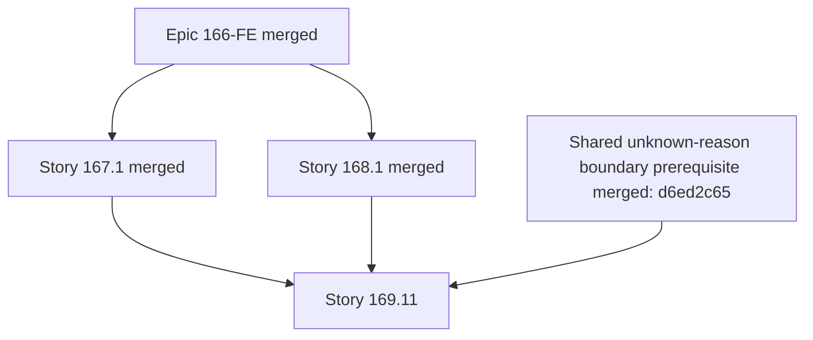

# OMX Plan — Story 169.11: Migrate Returns Analytics

## Authoritative references

1. `_bmad-output/planning-artifacts/epics-166-174-fe-shadcn-migration.md#story-16911-migrate-returns-analytics` — canonical ID, exact title, requirements, route value, owned/allowed/forbidden surfaces, BDD acceptance criteria, branch, validation, and cleanup contract.
2. `.omx/plans/shadcn-full-ui-migration-master.md#standard-story-execution-protocol` — inherited prerequisite, behavior-lock, implementation, validation, review, Git/PR, and mandatory-cleanup protocol.
3. `_bmad-output/planning-artifacts/ux-design-specification.md` — Adaptive Calm Command Center, state, responsive, table/chart, theme, accessibility, and evidence requirements.
4. `_bmad-output/planning-artifacts/shadcn-route-ledger.md` — read-only route ownership/completion evidence; updates are reported to the Epic 174 owner, not made by this Story.
5. `package.json` — Node `24.18.0`, npm `11.11.0`, and authoritative local validation scripts.
6. Current source and tests under the resolved Owned Surface below — brownfield behavior truth.

If an artifact conflicts with current passing behavior, preserve behavior, record the discrepancy, and stop any scope expansion pending orchestrator resolution.

## Outcome and requirements

- **Requirements:** FR16, FR27.
- **Outcome/user value:** As an operations/finance user, I want `/analytics/returns` to show return totals, reasons, trends, comparison, and product rows consistently, so that I can identify material return drivers and affected products.
- **Resolved owned surface:** `/analytics/returns`; its `page.tsx`, full `components/**` tree (summary, trend chart/tooltip/config, reasons pie parts, delta/comparison utilities, table/helpers/rows), and colocated tests.
- **Shared dependencies:** C2; existing returns query, reason mapping, comparison, and formatting semantics.
- Preserve backend endpoints, headers, payloads, response interpretation, query keys, invalidation, polling, calculations, URL/search parameters, navigation, permissions, cabinet/period/comparison context, Russian localization, and numeric/date/week formatting.
- Consume the merged semantic tokens, shadcn primitives, analytics compositions, and AppShell; do not create a competing primitive, dependency, or generalized DataTable.
- Complete only when the route's full owned render tree, applicable states, tests, visual/accessibility evidence, review, merge, branch cleanup, and worktree cleanup are proven.

## Prerequisites and dependency DAG

- Epic 166-FE foundation is merged into current `main` and its merge SHA is recorded.
- Story 167.1 AppShell/navigation is merged into current `main` and its merge SHA is recorded.
- Story 168.1 analytics-shared owner is merged into current `main` and its merge SHA is recorded.
- **Resolved shared boundary prerequisite:** PR #218 (`d9befb08`, merge `d6ed2c65`) preserves an unknown return-reason discriminator and neutral Russian label through `src/lib/api/return-analytics-normalizer.ts` and `src/types/analytics-returns.ts`. Story 169.11 did not absorb that shared-file change into its route-only implementation PR.
- Confirm the source route and tests still match the canonical Owned Surface; source plus passing behavior-lock tests govern if documentation has drifted.
- Confirm no other active writer owns any file in this plan's Allowed Change Surface.



**Stop gate (satisfied before execution):** the implementation branch was created only after `d6ed2c65` and all other prerequisite SHAs were ancestors of current `main`, with no active-writer overlap or Forbidden Shared File need. For any replay, re-prove those conditions; a route-only neutral color fallback is not a substitute for the merged boundary contract.

## Isolated branch and worktree

- **Exact branch:** `cdx/epic-169-story-11-returns-shadcn`
- **Unique temporary worktree:** `/private/tmp/wb-repricer-fe-169-11-returns-shadcn`
- Record the primary checkout path and base SHA; validate that the worktree path does not already exist and is not broad/destructive.

```bash
git -C "/Users/r2d2/Documents/Code_Projects/wb-repricer-system-new/frontend" fetch origin
git -C "/Users/r2d2/Documents/Code_Projects/wb-repricer-system-new/frontend" switch main
git -C "/Users/r2d2/Documents/Code_Projects/wb-repricer-system-new/frontend" pull --ff-only origin main
git -C "/Users/r2d2/Documents/Code_Projects/wb-repricer-system-new/frontend" rev-parse HEAD
git -C "/Users/r2d2/Documents/Code_Projects/wb-repricer-system-new/frontend" worktree add -b "cdx/epic-169-story-11-returns-shadcn" "/private/tmp/wb-repricer-fe-169-11-returns-shadcn" main
git -C "/Users/r2d2/Documents/Code_Projects/wb-repricer-system-new/frontend" worktree list
```

Never reuse a sibling branch/worktree or start from a stale pre-prerequisite base.

## Allowed Change Surface

- **Canonical allowance:** Only `src/app/(dashboard)/analytics/returns/**`.
- **Resolved owned files/tree:** `/analytics/returns`; its `page.tsx`, full `components/**` tree (summary, trend chart/tooltip/config, reasons pie parts, delta/comparison utilities, table/helpers/rows), and colocated tests.
- Colocated route/component tests and Story-specific evidence are allowed only where the canonical surface permits them.
- Before editing, inventory consumers with `rg`; a file used by two or more routes is shared and requires its declared upstream owner.

## Forbidden Shared Files

- **Canonical prohibition:** FS.
- **Inherited explicit prohibition:** `package.json`, `package-lock.json`, `components.json`, `tailwind.config.ts`, `src/styles/globals.css`, `src/components/ui/**`, AppShell/sidebar/navbar/navigation, cross-route product compositions, `src/app/(dashboard)/analytics/shared/**`, `src/hooks/**`, `src/lib/api/**`, `src/lib/api-client.ts`, `src/lib/routes.ts`, `src/types/**`, `src/stores/**`, the BMAD artifact, master plan, route ledger, and every sibling Story plan or route tree.
- No package/dependency, API/hook/type/store, token/primitive, AppShell, analytics-shared, route-ledger, BMAD, master-plan, or sibling-plan edit is permitted unless it is explicitly listed in this Story's canonical Allowed Change Surface.
- If a forbidden edit appears necessary, stop, document the exact file/consumer need, and route a prerequisite/owner correction to the orchestrator.

## Behavior-lock step

1. From `/private/tmp/wb-repricer-fe-169-11-returns-shadcn`, inventory the complete owned render tree, imports, current tests, raw controls, hardcoded/light-only styling, table/chart implementations, overlays, and route-state ownership.
2. Run the smallest current targeted tests before source edits:
   ```bash
   npx vitest run "src/app/(dashboard)/analytics/returns"
   ```
3. Add or strengthen colocated regression tests before presentation edits when coverage cannot prove the canonical BDD behavior, query/URL preservation, formatting, focus lifecycle, mutation safety, or state distinction.
4. Disposition every inherited C4 state as tested, intentionally N/A with source-backed evidence, or blocked with an exact gap. At minimum lock default success, initial structural loading, background refresh with retained usable content, global empty, filtered-empty with visible reset, recoverable error with retry, trend error distinct from valid empty, stale, partial, permission-restricted, and route-appropriate processing/success behavior. Capture deterministic baseline evidence for valid zero-returns, missing comparison, and partial-series states; unknown-reason evidence becomes mandatory after its shared prerequisite merges.
5. Record current table/chart semantics and representative light/dark screenshots so implementation can prove presentation changed without business meaning changing.
6. If behavior cannot be locked inside the Allowed Change Surface, record the gap and stop rather than editing a shared/forbidden test surface.

## Implementation sequence

1. **Confirm scope and source truth:** map every owned component and applicable route state; prove nested/sibling exclusions and shared consumers before editing.
2. **Lock behavior:** make the Story-targeted tests fail for any intended presentation contract gap while preserving current business/API/query behavior.
3. **Migrate route hierarchy and states:** adopt merged PageHeader/ContextBar/PageState/financial/status compositions as applicable; preserve route identity, context, data freshness, recovery, and Russian content.
4. **Migrate owned interactions:** replace route-owned legacy/raw presentation with approved shadcn primitives; preserve filters, sort, pagination, selection, expansion, dialogs/forms, export or mutation lifecycle exactly as the canonical Story requires.
5. **Apply the route-specific data contract:** RTC; returns table primary column is product/SKU, return count/rate/amount align with units; trend and reasons charts expose period, units, reason/series meaning, data alternatives, and identical tooltip/table precision.
6. **Apply accessibility and responsive behavior:** AX; pie segments are not the only access to reason values, delta meaning includes sign/text, and unknown reasons are announced neutrally. The daily trend provides a non-hover data alternative with the exact selected period, count and percentage units, every day and every series value at tooltip precision, and non-color series labels/markers. Verify semantic DOM order, keyboard/focus behavior, no hover-only meaning, both themes, narrow widths, zoom, and reduced motion.
7. **Remove only obsolete owned presentation:** delete duplicate wrappers, raw controls, unregistered palette/hex/light-only classes, and orphaned owned tests only after all owned consumers migrate; document justified retained specialized components.
8. **Run targeted and universal verification:** resolve failures, inspect the complete diff, and prove no forbidden/shared/business-contract change.

## Story-targeted tests and local validation

Canonical target: VC with `STORY_TEST_TARGET=src/app/(dashboard)/analytics/returns` and `STORY_ID=169.11`.

Run in this order and capture commands, exit codes, test counts, and complete failure output:

```bash
cd "/private/tmp/wb-repricer-fe-169-11-returns-shadcn"
npx vitest run "src/app/(dashboard)/analytics/returns"
npm run test:e2e -- e2e/returns-analytics.spec.ts
npm run lint
npm run type-check
npm run check:max-lines
npm run build
git -C "/private/tmp/wb-repricer-fe-169-11-returns-shadcn" diff --check
```

- Add/update route-focused Vitest coverage inside the Allowed Change Surface.
- `e2e/returns-analytics.spec.ts` is a run-only, read-only validation consumer outside the canonical Story surface. Run it by exact file path; do not retag or edit it without an explicit owner exception. Record the selected and executed test count.
- Add/update Playwright coverage only if its file is already within the canonical Story surface; otherwise run the existing route target and record/escalate the coverage gap.
- Use frontend `http://localhost:3100` and backend `http://localhost:3000` for applicable local smoke/e2e checks.
- An unavailable backend/browser/environment is a named gap, never a pass.
- After any review fix, rerun the smallest affected target plus all universal commands above.

## Responsive, table/chart, visual, and accessibility verification

- **State matrix:** SC plus valid zero-returns, unknown reason, missing comparison, and partial-series states.
- **Route-specific table/chart contract:** RTC; returns table primary column is product/SKU, return count/rate/amount align with units; trend and reasons charts expose period, units, reason/series meaning, data alternatives, and identical tooltip/table precision.
- **Accessibility contract:** AX; pie segments are not the only access to reason values, delta meaning includes sign/text, and unknown reasons are announced neutrally.
- **Required Story evidence:** VE plus zero-return, unknown-reason, partial-series, and chart alternative evidence.
- Verify light and dark themes at `320`, `390`, `768`, `1024`, `1280`, and `1440+` px, between-breakpoint transitions, 200% zoom, reduced motion where applicable, long Russian labels, zero/missing/unavailable, large/negative values, dates, percentages, and ISO weeks.
- Capture before/after or approved-baseline screenshots with deterministic cabinet/period/fixture labels.
- Capture automated axe output plus manual keyboard, focus, reading-order, data-meaning, overlay lifecycle, table semantics, chart summary/data-alternative, and responsive overflow checklists.
- Confirm normal text contrast `>=4.5:1` and applicable large/non-text/focus UI `>=3:1` in both themes.
- Record unsupported browser/assistive-technology environments as explicit gaps.

## Independent review

1. Run `git diff --check`, `git status --short`, and an explicit changed-file inventory; compare every path with the Allowed Change Surface.
2. Assign an independent `code-reviewer` that did not author the implementation. Review canonical BDD criteria, behavior preservation, shared-boundary discipline, state truthfulness, table/chart semantics, responsive behavior, accessibility, tests, and cleanup.
3. Resolve every accepted finding; document rejected findings with evidence; rerun affected targeted and universal validation.
4. Assign an independent `verifier` to confirm test output, visual/accessibility evidence, absence of forbidden files, and readiness for commit/PR.
5. Do not self-approve and do not proceed with unresolved material findings.

## Conventional commit, push, PR, and merge

Stage only the verified Allowed Change Surface file list; never use a broad stage command without reviewing its expansion.

```bash
git -C "/private/tmp/wb-repricer-fe-169-11-returns-shadcn" status --short
git -C "/private/tmp/wb-repricer-fe-169-11-returns-shadcn" diff --check
UNSTAGED_TRACKED_FILES="$(git -C "/private/tmp/wb-repricer-fe-169-11-returns-shadcn" diff --name-only)"
UNTRACKED_FILES="$(git -C "/private/tmp/wb-repricer-fe-169-11-returns-shadcn" ls-files --others --exclude-standard)"
EXPLICIT_ALLOWED_FILES_AND_TESTS="$(printf '%s\n%s\n' "$UNSTAGED_TRACKED_FILES" "$UNTRACKED_FILES" | sed '/^$/d' | sort -u)"
test -n "$EXPLICIT_ALLOWED_FILES_AND_TESTS"
printf '%s\n' "$EXPLICIT_ALLOWED_FILES_AND_TESTS"
git -C "/private/tmp/wb-repricer-fe-169-11-returns-shadcn" add -- $EXPLICIT_ALLOWED_FILES_AND_TESTS
git -C "/private/tmp/wb-repricer-fe-169-11-returns-shadcn" diff --cached --name-only
git -C "/private/tmp/wb-repricer-fe-169-11-returns-shadcn" commit \
  -m "feat(analytics): migrate Story 169.11 route to shadcn" \
  -m "Story 169.11-FE — Migrate Returns Analytics. Migrates only the canonical owned surface, preserves behavior/contracts, and includes targeted plus local validation evidence."
git -C "/private/tmp/wb-repricer-fe-169-11-returns-shadcn" push -u origin "cdx/epic-169-story-11-returns-shadcn"
REPOSITORY="salacoste/wb-erp-system-daytona-FE"
STORY_PR_URL="$(gh pr create --repo "$REPOSITORY" \
  --base main \
  --head "cdx/epic-169-story-11-returns-shadcn" \
  --title "[Story 169.11-FE] Migrate Returns Analytics" \
  --body "Implements the canonical Story-owned surface with behavior-lock, local validation, visual/accessibility evidence, independent review, and mandatory branch/worktree cleanup. No production or backend-contract work.")"
test -n "$STORY_PR_URL"
STORY_PR_NUMBER="$(gh pr view "$STORY_PR_URL" --repo "$REPOSITORY" --json number --jq '.number')"
test -n "$STORY_PR_NUMBER"
```

- Reconfirm current `main` contains prerequisite merge SHAs and the PR contains no Forbidden Shared Files.
- Keep the implementation PR route-only. After its merge and mandatory cleanup, update this Story artifact and `sprint-status.yaml` in a separate documentation-only closeout branch/PR; the implementation branch must not edit either file.
- Obtain required human/owner review under the repository's local-only merge policy; no required CI gate is introduced.
- Merge only after local validation and independent review pass:
  ```bash
  REPOSITORY="salacoste/wb-erp-system-daytona-FE"
  STORY_BRANCH="cdx/epic-169-story-11-returns-shadcn"
  STORY_PR_NUMBER="$(gh pr list --repo "$REPOSITORY" --head "$STORY_BRANCH" --state open --json number --jq '.[0].number')"
  test -n "$STORY_PR_NUMBER"
  gh pr merge "$STORY_PR_NUMBER" --repo "$REPOSITORY" --merge
  STORY_MERGE_SHA="$(gh pr view "$STORY_PR_NUMBER" --repo "$REPOSITORY" --json mergeCommit --jq '.mergeCommit.oid')"
  test -n "$STORY_MERGE_SHA"
  git -C "/Users/r2d2/Documents/Code_Projects/wb-repricer-system-new/frontend" switch main
  git -C "/Users/r2d2/Documents/Code_Projects/wb-repricer-system-new/frontend" pull --ff-only origin main
  git -C "/Users/r2d2/Documents/Code_Projects/wb-repricer-system-new/frontend" merge-base --is-ancestor "$STORY_MERGE_SHA" main
  ```
- Record PR URL/number, commit SHA, merge SHA, reviewer, and final validation summary. Never push directly or force-push to `main`.

## Remote/local branch deletion and mandatory worktree cleanup

Canonical cleanup requirement: CE.

After the merge SHA is proven on `main`, execute in this order:

```bash
git -C "/Users/r2d2/Documents/Code_Projects/wb-repricer-system-new/frontend" push origin --delete "cdx/epic-169-story-11-returns-shadcn"
git -C "/Users/r2d2/Documents/Code_Projects/wb-repricer-system-new/frontend" worktree remove "/private/tmp/wb-repricer-fe-169-11-returns-shadcn"
git -C "/Users/r2d2/Documents/Code_Projects/wb-repricer-system-new/frontend" branch -d "cdx/epic-169-story-11-returns-shadcn"
git -C "/Users/r2d2/Documents/Code_Projects/wb-repricer-system-new/frontend" worktree prune
git -C "/Users/r2d2/Documents/Code_Projects/wb-repricer-system-new/frontend" ls-remote --heads origin "cdx/epic-169-story-11-returns-shadcn"
git -C "/Users/r2d2/Documents/Code_Projects/wb-repricer-system-new/frontend" branch --list "cdx/epic-169-story-11-returns-shadcn"
git -C "/Users/r2d2/Documents/Code_Projects/wb-repricer-system-new/frontend" worktree list --porcelain
git -C "/Users/r2d2/Documents/Code_Projects/wb-repricer-system-new/frontend" status --short
```

Required close evidence:

- PR merge SHA is an ancestor of current `main`.
- `git ls-remote --heads` returns no remote Story branch.
- `git branch --list` returns no local Story branch.
- `git worktree list --porcelain` contains no `/private/tmp/wb-repricer-fe-169-11-returns-shadcn`.
- Primary checkout and remaining worktrees are clean or contain only separately attributed concurrent work.
- Final file inventory contains only the Story's Allowed Change Surface.
- Route-ledger completion evidence is handed to the Epic 174 owner; this Story does not edit the shared ledger.

Worktree removal, prune, and both branch deletions are mandatory completion conditions.

## Risks and mitigations

| Risk                                                                  | Mitigation                                                                                                                                                                                                                                                   |
| --------------------------------------------------------------------- | ------------------------------------------------------------------------------------------------------------------------------------------------------------------------------------------------------------------------------------------------------------ |
| Presentation refactor changes business/query/URL behavior             | Lock current behavior first; retain hooks/contracts; compare targeted tests and deterministic before/after evidence.                                                                                                                                         |
| Shared or sibling files are edited for convenience                    | Consumer inventory plus forbidden-path diff audit; stop and route the need to the orchestrator.                                                                                                                                                              |
| Route states misrepresent unavailable/partial data                    | Test and visually verify the exact matrix: SC plus valid zero-returns, unknown reason, missing comparison, and partial-series states.                                                                                                                        |
| Dense or responsive evidence loses business meaning                   | Enforce the canonical contract: RTC; returns table primary column is product/SKU, return count/rate/amount align with units; trend and reasons charts expose period, units, reason/series meaning, data alternatives, and identical tooltip/table precision. |
| Keyboard/focus/contrast regression                                    | Apply AX; pie segments are not the only access to reason values, delta meaning includes sign/text, and unknown reasons are announced neutrally. and require axe plus manual keyboard/focus/zoom/theme evidence.                                              |
| Mutation/export/background work is duplicated or ambiguously reported | Preserve current lifecycle/query semantics; test pending, success, partial/conflict/failure states where applicable.                                                                                                                                         |
| Branch/worktree residue survives merge                                | Do not close until remote/local branch absence and exact worktree removal/prune evidence are recorded.                                                                                                                                                       |

## Testable acceptance criteria

### Product acceptance criteria

1. **Given** return data and a comparison period, **when** migrated, **then** totals, reason shares, trend/delta direction, table metrics, filters/sort/page, and drill-down preserve current definitions and precision.
2. **Given** zero returns, missing comparison, unknown reason, stale/partial reason series, filtered-empty, or error, **when** rendered, **then** states are distinct and unknown reasons have neutral labeled fallback.
3. **Given** keyboard/touch or narrow layouts, **when** a reason/day/product is examined, **then** the same period, units, full values, and non-color meaning are present in chart summaries/data alternatives and rows.

### Plan and delivery acceptance criteria

4. **Given** the Story branch is created, **when** its base is inspected, **then** it is exactly `cdx/epic-169-story-11-returns-shadcn` from current prerequisite-complete `main` and uses only `/private/tmp/wb-repricer-fe-169-11-returns-shadcn`.
5. **Given** the final diff, **when** paths are compared with the canonical surfaces, **then** every changed path is allowed and no Forbidden Shared File, BMAD artifact, master plan, route ledger, or sibling plan changed.
6. **Given** implementation is ready for review, **when** targeted Vitest/e2e, lint, type-check, max-lines, build, diff-check, visual/theme/responsive, axe, and manual keyboard/focus checks run, **then** each passes or has a specific recorded environment gap; no gap is represented as a pass.
7. **Given** independent review finds an accepted issue, **when** it is fixed, **then** affected checks are rerun and the reviewer/verifier evidence is updated before merge.
8. **Given** the PR is merged, **when** cleanup completes, **then** the merge SHA is on `main`, the remote/local `cdx/epic-169-story-11-returns-shadcn` branches are absent, `/private/tmp/wb-repricer-fe-169-11-returns-shadcn` is removed, `git worktree prune` ran, and absence/clean-status evidence is recorded.
9. **Given** Story closure, **when** scope is audited, **then** no deployment, production operation, backend contract change, required CI gate, direct push to `main`, or force push occurred.

## Explicit no-production scope

NP. This plan authorizes local frontend implementation and local validation only. It does **not** authorize deployment, production infrastructure/configuration, production data operations, backend/public contract changes, required CI gates, direct pushes to `main`, or force pushes.
