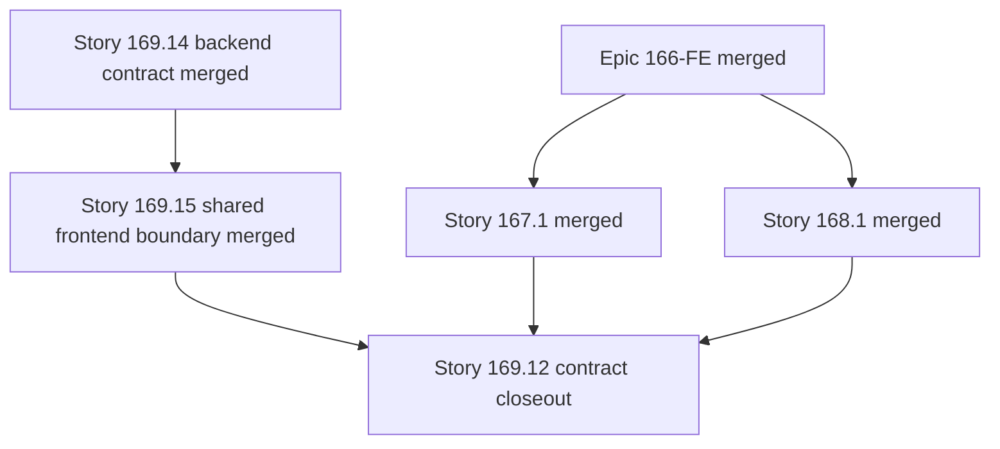

# OMX Plan — Story 169.12: Migrate Storage Analytics and Paid-Storage Import

## Authoritative references

1. `_bmad-output/planning-artifacts/epics-166-174-fe-shadcn-migration.md#story-16912-migrate-storage-analytics-and-paid-storage-import` — canonical ID, exact title, requirements, route value, owned/allowed/forbidden surfaces, BDD acceptance criteria, branch, validation, and cleanup contract.
2. `.omx/plans/shadcn-full-ui-migration-master.md#standard-story-execution-protocol` — inherited prerequisite, behavior-lock, implementation, validation, review, Git/PR, and mandatory-cleanup protocol.
3. `_bmad-output/planning-artifacts/ux-design-specification.md` — Adaptive Calm Command Center, state, responsive, table/chart, theme, accessibility, and evidence requirements.
4. `_bmad-output/planning-artifacts/shadcn-route-ledger.md` — read-only route ownership/completion evidence; updates are reported to the Epic 174 owner, not made by this Story.
5. `package.json` — Node `24.18.0`, npm `11.11.0`, and authoritative local validation scripts.
6. Current source and tests under the resolved Owned Surface below — brownfield behavior truth.

If an artifact conflicts with current passing behavior, preserve behavior, record the discrepancy, and stop any scope expansion pending orchestrator resolution.

## Outcome and requirements

- **Requirements:** FR16, FR27.
- **Outcome/user value:** As a finance/operations user, I want `/analytics/storage` to connect storage cost summaries, alerts, trends, SKU consumers, filters, and paid-storage import status, so that I can trace storage cost and recover safely from import issues.
- **Resolved owned surface:** `/analytics/storage`; `page.tsx`, `loading.tsx`, full `components/**` tree (header/filters/badges, summary/alerts, trend chart/parts/config, SKU table/header/cells/hooks, top consumers, paid-storage import dialog/status/hooks/utils, URL sync), and colocated tests.
- **Shared dependencies:** C2; merged Story 169.14 authoritative backend paid-storage import contract; merged Story 169.15 shared frontend paid-storage import boundary; existing storage analytics hooks/contracts, URL filters, and financial formatting.
- Preserve backend endpoints, headers, payloads, response interpretation, query keys, invalidation, polling, calculations, URL/search parameters, navigation, permissions, cabinet/period/comparison context, Russian localization, and numeric/date/week formatting.
- Consume the merged semantic tokens, shadcn primitives, analytics compositions, and AppShell; do not create a competing primitive, dependency, or generalized DataTable.
- Complete only when the route's full owned render tree, applicable states, tests, visual/accessibility evidence, review, merge, branch cleanup, and worktree cleanup are proven.

## Concurrent route-delivery reconciliation

PR #227 merged the Story 169.12 route presentation at `52f7f5061d73f5633fbc0fe575ff35f2055be194` before this approved Correct Course package reached `main`. Its 27 route-owned files, targeted/full validation, E2E evidence, and two review-fix commits are retained as delivered evidence; they are not reverted or recreated. That early merge did not deliver or validate the authoritative Story 169.14 backend contract or the post-169.14 Story 169.15 shared frontend boundary, so Story 169.12 remains in `review` and this plan stays `blocked-on-prerequisites`.

After Stories 169.14 and 169.15 merge and clean up, this plan governs a bounded **contract closeout**, not a second presentation migration. Start from then-current frontend `main`, lock PR #227 behavior, validate the merged request/status/result/error contract end to end, change only route-owned files when the new shared boundary proves a real route defect, update the existing implementation artifact, and close the Story only after the final contract evidence and cleanup are recorded.

## Prerequisites and dependency DAG

- Epic 166-FE foundation is merged into frontend repository `main`, and its merge SHA is recorded and proven to be an ancestor of current frontend `main`.
- Story 167.1 AppShell/navigation is merged into frontend repository `main`, and its merge SHA is recorded and proven to be an ancestor of current frontend `main`.
- Story 168.1 analytics-shared owner is merged into frontend repository `main`, and its merge SHA is recorded and proven to be an ancestor of current frontend `main`.
- Story 169.14 is merged in the backend repository; record its exact merge SHA, prove that SHA is an ancestor of current backend repository `main`, read its final request/status/result/error contract, and separately prove backend local/remote branch absence plus backend worktree removal/prune.
- Story 169.15 is merged into the frontend repository; record its exact merge SHA, prove that SHA is an ancestor of current frontend repository `main`, and separately prove frontend local/remote branch absence plus frontend worktree removal/prune.
- Confirm the source route and tests still match the canonical Owned Surface; source plus passing behavior-lock tests govern if documentation has drifted.
- Confirm no other active writer owns any file in this plan's Allowed Change Surface.



**Repository-specific stop gate:** do not create the Story 169.12 contract-closeout branch unless the Story 169.14 merge SHA is an ancestor of backend repository `main`; the Epic 166, Story 167.1, Story 168.1, Story 169.15, and PR #227 merge SHAs are ancestors of frontend repository `main`; backend cleanup evidence and frontend cleanup evidence have each passed independently; and the frontend primary checkout has fetched and fast-forwarded to current `origin/main`. Create the contract-closeout worktree only from that refreshed frontend `main`. Also stop if the Allowed Change Surface overlaps an active Story or implementation would require a Forbidden Shared File.

## Isolated branch and worktree

- **Exact branch:** `cdx/epic-169-story-12-contract-closeout`
- **Unique temporary worktree:** `/private/tmp/wb-repricer-fe-169-12-contract-closeout`
- Record the primary checkout path and base SHA; validate that the worktree path does not already exist and is not broad/destructive.

```bash
BACKEND_REPOSITORY="/Users/r2d2/Documents/Code_Projects/wb-repricer-system-new"
FRONTEND_REPOSITORY="/Users/r2d2/Documents/Code_Projects/wb-repricer-system-new/frontend"
STORY_169_14_BRANCH="cdx/epic-169-story-14-paid-storage-import-contract"
STORY_169_14_WORKTREE="/private/tmp/wb-repricer-be-169-14-paid-storage-import-contract"
STORY_169_15_BRANCH="cdx/epic-169-story-15-storage-import-boundary"
STORY_169_15_WORKTREE="/private/tmp/wb-repricer-fe-169-15-storage-import-boundary"
STORY_169_12_ROUTE_BRANCH="cdx/epic-169-story-12-storage-shadcn"
STORY_169_12_ROUTE_WORKTREE="/private/tmp/wb-repricer-fe-169-12-storage-shadcn"
RECORDED_EPIC_166_COMPLETION_MERGE_SHA="${RECORDED_EPIC_166_COMPLETION_MERGE_SHA:?export the exact approved Epic 166 completion SHA}"
RECORDED_STORY_167_1_MERGE_SHA="${RECORDED_STORY_167_1_MERGE_SHA:?export the exact approved Story 167.1 merge SHA}"
RECORDED_STORY_168_1_MERGE_SHA="${RECORDED_STORY_168_1_MERGE_SHA:?export the exact approved Story 168.1 merge SHA}"
RECORDED_STORY_169_14_MERGE_SHA="${RECORDED_STORY_169_14_MERGE_SHA:?export the exact approved Story 169.14 merge SHA}"
RECORDED_STORY_169_15_MERGE_SHA="${RECORDED_STORY_169_15_MERGE_SHA:?export the exact approved Story 169.15 merge SHA}"
RECORDED_STORY_169_12_ROUTE_MERGE_SHA="52f7f5061d73f5633fbc0fe575ff35f2055be194"

git -C "$BACKEND_REPOSITORY" fetch origin
git -C "$BACKEND_REPOSITORY" switch main
git -C "$BACKEND_REPOSITORY" pull --ff-only origin main
test "$(git -C "$BACKEND_REPOSITORY" rev-parse main)" = "$(git -C "$BACKEND_REPOSITORY" rev-parse origin/main)"
git -C "$BACKEND_REPOSITORY" merge-base --is-ancestor "$RECORDED_STORY_169_14_MERGE_SHA" origin/main
git -C "$BACKEND_REPOSITORY" merge-base --is-ancestor "$RECORDED_STORY_169_14_MERGE_SHA" main
test -z "$(git -C "$BACKEND_REPOSITORY" branch --list "$STORY_169_14_BRANCH")"
test -z "$(git -C "$BACKEND_REPOSITORY" ls-remote --heads origin "$STORY_169_14_BRANCH")"
test ! -e "$STORY_169_14_WORKTREE"
test -z "$(git -C "$BACKEND_REPOSITORY" worktree list --porcelain | rg -F "$STORY_169_14_WORKTREE")"

git -C "$FRONTEND_REPOSITORY" fetch origin
git -C "$FRONTEND_REPOSITORY" switch main
git -C "$FRONTEND_REPOSITORY" pull --ff-only origin main
test "$(git -C "$FRONTEND_REPOSITORY" rev-parse main)" = "$(git -C "$FRONTEND_REPOSITORY" rev-parse origin/main)"
for PREREQUISITE_SHA in \
  "$RECORDED_EPIC_166_COMPLETION_MERGE_SHA" \
  "$RECORDED_STORY_167_1_MERGE_SHA" \
  "$RECORDED_STORY_168_1_MERGE_SHA" \
  "$RECORDED_STORY_169_15_MERGE_SHA" \
  "$RECORDED_STORY_169_12_ROUTE_MERGE_SHA"; do
  git -C "$FRONTEND_REPOSITORY" merge-base --is-ancestor "$PREREQUISITE_SHA" origin/main
  git -C "$FRONTEND_REPOSITORY" merge-base --is-ancestor "$PREREQUISITE_SHA" main
done

FRONTEND_PREREQUISITE_BRANCHES=(
  'cdx/epic-166-story-1-token-compiler'
  'cdx/epic-166-story-2-primitives'
  'cdx/epic-166-story-3-page-context'
  'cdx/epic-166-story-4-financial-status'
  'cdx/epic-166-story-5-filters-periods'
  'cdx/epic-166-story-6-responsive-tables'
  'cdx/epic-166-story-7-chart-evidence'
  'cdx/epic-166-story-8-states-async'
  'cdx/epic-167-story-1-appshell'
  'cdx/epic-168-story-1-analytics-hub'
  "$STORY_169_15_BRANCH"
  "$STORY_169_12_ROUTE_BRANCH"
)
FRONTEND_PREREQUISITE_WORKTREES=(
  '/private/tmp/wb-fe-166-1-establish-the-tailwind-v4-semantic-token-a'
  '/private/tmp/wb-fe-166-2-harden-the-existing-shadcn-primitive-layer'
  '/private/tmp/wb-fe-166-3-deliver-pageheader-and-contextbar-composit'
  '/private/tmp/wb-fe-166-4-standardize-metrics-financial-values-avail'
  '/private/tmp/wb-fe-166-5-standardize-filters-and-period-controls'
  '/private/tmp/wb-fe-166-6-deliver-responsivetable-and-data-table-con'
  '/private/tmp/wb-fe-166-7-deliver-chartframe-and-accessible-analytic'
  '/private/tmp/wb-fe-166-8-standardize-page-states-async-results-cont'
  '/private/tmp/wb-fe-167-1-unify-protected-appshell-and-desktop-mobil'
  '/private/tmp/wb-fe-168-1-migrate-analytics-hub-and-own-analytics-sh'
  "$STORY_169_15_WORKTREE"
  "$STORY_169_12_ROUTE_WORKTREE"
)
for PREREQUISITE_BRANCH in "${FRONTEND_PREREQUISITE_BRANCHES[@]}"; do
  test -z "$(git -C "$FRONTEND_REPOSITORY" branch --list "$PREREQUISITE_BRANCH")"
  test -z "$(git -C "$FRONTEND_REPOSITORY" ls-remote --heads origin "$PREREQUISITE_BRANCH")"
done
for PREREQUISITE_WORKTREE in "${FRONTEND_PREREQUISITE_WORKTREES[@]}"; do
  test ! -e "$PREREQUISITE_WORKTREE"
  test -z "$(git -C "$FRONTEND_REPOSITORY" worktree list --porcelain | rg -F "$PREREQUISITE_WORKTREE")"
done

STORY_BASE_SHA="$(git -C "$FRONTEND_REPOSITORY" rev-parse HEAD)"
git -C "$FRONTEND_REPOSITORY" worktree add -b "cdx/epic-169-story-12-contract-closeout" "/private/tmp/wb-repricer-fe-169-12-contract-closeout" "$STORY_BASE_SHA"
git -C "$FRONTEND_REPOSITORY" worktree list
```

Never use merge-message grep or another fuzzy lookup for prerequisite SHAs. Consume the exact approved delivery-record SHAs, never reuse a sibling branch/worktree, and never start from a stale pre-prerequisite base. Record the backend 169.14 ancestry/cleanup proof separately from the frontend prerequisite ancestry/cleanup proof; a clean frontend repository does not prove backend cleanup, and vice versa.

## Allowed Change Surface

- **Canonical allowance:** Only `src/app/(dashboard)/analytics/storage/**`.
- **Resolved owned files/tree:** `/analytics/storage`; `page.tsx`, `loading.tsx`, full `components/**` tree (header/filters/badges, summary/alerts, trend chart/parts/config, SKU table/header/cells/hooks, top consumers, paid-storage import dialog/status/hooks/utils, URL sync), and colocated tests.
- Colocated route/component tests and Story-specific evidence are allowed only where the canonical surface permits them.
- The exact implementation artifact `_bmad-output/implementation-artifacts/169-12-fe-migrate-storage-analytics-and-paid-storage-import.md` is allowed only for final contract evidence, lifecycle reconciliation, and cleanup proof.
- Before editing, inventory consumers with `rg`; a file used by two or more routes is shared and requires its declared upstream owner.

## Forbidden Shared Files

- **Canonical prohibition:** FS.
- **Inherited explicit prohibition:** `package.json`, `package-lock.json`, `components.json`, `tailwind.config.ts`, `src/styles/globals.css`, `src/components/ui/**`, AppShell/sidebar/navbar/navigation, cross-route product compositions, `src/app/(dashboard)/analytics/shared/**`, `src/hooks/**`, `src/lib/api/**`, `src/lib/api-client.ts`, `src/lib/routes.ts`, `src/types/**`, `src/stores/**`, the BMAD artifact, master plan, route ledger, and every sibling Story plan or route tree.
- No package/dependency, API/hook/type/store, token/primitive, AppShell, analytics-shared, route-ledger, BMAD, master-plan, or sibling-plan edit is permitted unless it is explicitly listed in this Story's canonical Allowed Change Surface.
- If a forbidden edit appears necessary, stop, document the exact file/consumer need, and route a prerequisite/owner correction to the orchestrator.

## Behavior-lock step

1. From `/private/tmp/wb-repricer-fe-169-12-contract-closeout`, inventory the PR #227 owned render tree, imports, current tests, overlays, route-state ownership, and every consumer of the merged Story 169.15 boundary.
2. Run the smallest current targeted tests before source edits:

```bash
npx vitest run "src/app/(dashboard)/analytics/storage"
```

3. Add or strengthen colocated regression tests before presentation edits when coverage cannot prove the canonical BDD behavior, query/URL preservation, formatting, focus lifecycle, mutation safety, or state distinction.
4. Capture deterministic baseline evidence for: SC plus week-filter mismatch, alert, import idle, validation/submission, pending, processing, success, failure, per-section error states, and route-level partial analytical sections. Paid-storage import partial success is N/A under Story 169.14 and must not be synthesized.
5. Reuse PR #227 table/chart/theme/accessibility evidence and capture new evidence only where contract closeout changes behavior or where the merged backend/shared boundary affects an existing state.
6. After baseline and honest RED inventory, freeze two exact newline-delimited manifests in the Story delivery record before the first implementation edit: `STORY_169_12_FROZEN_REVIEWED_MANIFEST` for every reviewed route/test/artifact path and `STORY_169_12_REQUIRED_MANIFEST` for only the acceptance-necessary paths that must change. Every source/test path must remain under `src/app/(dashboard)/analytics/storage/`; the only non-route exception is the exact Story implementation artifact.
7. If later evidence requires another path, stop before editing it, perform a separate ownership/scope review, update and re-freeze both manifests as applicable, rerun the affected RED proof, and include the addition in both independent reviews. Never derive the reviewed manifest from the final Git diff.
8. If behavior cannot be locked inside the Allowed Change Surface, record the gap and stop rather than editing a shared/forbidden test surface.

## Implementation sequence

1. **Confirm scope and source truth:** map the PR #227 route state machine and every consumer of the merged Story 169.15 boundary; prove nested/sibling exclusions before editing.
2. **Lock the delivered route:** rerun PR #227 behavior, state, table/chart, responsive, theme, accessibility, and E2E evidence on prerequisite-complete `main` before any correction.
3. **Validate the authoritative import contract:** prove request serialization, accepted start, pending/processing polling, completed row result, failed actionable detail, unknown/malformed defense, safe whole-range retry guidance, and no fabricated partial success.
4. **Add honest RED only for proven route-owned gaps:** do not manufacture a presentation diff or duplicate shared Story 169.15 logic. If the route already consumes the final boundary correctly, use test/evidence and artifact-only closeout rather than touching production source.
5. **Apply the smallest route correction when required:** preserve PR #227 hierarchy, filters, table/chart semantics, URL/query behavior, focus lifecycle, responsive behavior, theme tokens, and Russian content.
6. **Run targeted and universal verification:** resolve failures, inspect the complete diff, prove no forbidden/shared/business-contract change, update the existing Story artifact, and complete two independent reviews.

## Story-targeted tests and local validation

Canonical target: VC with `STORY_TEST_TARGET=src/app/(dashboard)/analytics/storage` and `STORY_ID=169.12`.

Run in this order and capture commands, exit codes, test counts, and complete failure output:

```bash
cd "/private/tmp/wb-repricer-fe-169-12-contract-closeout"
npx vitest run "src/app/(dashboard)/analytics/storage"
npm run test:e2e:full -- e2e/storage-analytics.spec.ts --project=chromium
npm run lint
npm run type-check
npm run check:max-lines
npm run build
git -C "/private/tmp/wb-repricer-fe-169-12-contract-closeout" diff --check
```

- `test:e2e:full` is required because the default `test:e2e` preflight prepends `e2e/orders.spec.ts`; the current storage spec has no `Story 169.12-FE` grep marker. Full-mode forwarding with the exact storage path selects the existing read-only route test.
- Add/update route-focused Vitest coverage inside the Allowed Change Surface.
- Do not edit the external `e2e/storage-analytics.spec.ts`; run it by exact path through full preflight forwarding. Add/update Playwright coverage only if a future approved ownership change places it inside the Story surface.
- Use frontend `http://localhost:3100` and backend `http://localhost:3000` for applicable local smoke/e2e checks.
- An unavailable backend/browser/environment is a named gap, never a pass.
- After any review fix, rerun the smallest affected target plus all universal commands above.

## Responsive, table/chart, visual, and accessibility verification

- **State matrix:** SC plus week-filter mismatch, alert, import idle, validation/submission, pending, processing, success, failure, per-section error states, and route-level partial analytical sections. Paid-storage import partial success is N/A under the merged 169.14 contract.
- **Route-specific table/chart contract:** RTC; SKU table primary column is product/SKU, storage cost/volume/days align with full precision, warehouse badges/actions stay reachable; trend chart exposes week/units/series and data alternative; import dialog uses focusable error/result summary.
- **Accessibility contract:** AX; import progress/result uses bounded live announcements, badges/alerts are non-color, dialog focus returns to import trigger.
- **Required Story evidence:** VE plus alert, filtered-empty, partial analytical section, and the complete authoritative import lifecycle from idle through success/failure, including the merged request/status/result contract evidence. No import partial-success screenshot is required while that state is contractually N/A.
- Verify light and dark themes at `320`, `390`, `768`, `1024`, `1280`, and `1440+` px, between-breakpoint transitions, 200% zoom, reduced motion where applicable, long Russian labels, zero/missing/unavailable, large/negative values, dates, percentages, and ISO weeks.
- Capture before/after or approved-baseline screenshots with deterministic cabinet/period/fixture labels.
- Capture automated axe output plus manual keyboard, focus, reading-order, data-meaning, overlay lifecycle, table semantics, chart summary/data-alternative, and responsive overflow checklists.
- Confirm normal text contrast `>=4.5:1` and applicable large/non-text/focus UI `>=3:1` in both themes.
- Record unsupported browser/assistive-technology environments as explicit gaps.

## Independent review

1. Run `git diff --check`, `git status --short`, and an explicit changed-file inventory; compare every path with the Allowed Change Surface.
2. Assign an independent `code-reviewer` that did not author the implementation. Review canonical BDD criteria, behavior preservation, shared-boundary discipline, state truthfulness, table/chart semantics, responsive behavior, accessibility, tests, and cleanup.
3. Resolve every accepted finding; document rejected findings with evidence; rerun affected targeted and universal validation.
4. Assign an independent `verifier` to confirm test output, visual/accessibility evidence, absence of forbidden files, and readiness for commit/PR.
5. Do not self-approve and do not proceed with unresolved material findings.

## Conventional commit, push, PR, and merge

Stage only the verified Allowed Change Surface file list; never use a broad stage command without reviewing its expansion.

```bash
git -C "/private/tmp/wb-repricer-fe-169-12-contract-closeout" status --short
git -C "/private/tmp/wb-repricer-fe-169-12-contract-closeout" diff --check
test -z "$(git -C "/private/tmp/wb-repricer-fe-169-12-contract-closeout" diff --cached --name-only)"
STORY_ROUTE_ROOT='src/app/(dashboard)/analytics/storage/'
STORY_ARTIFACT='_bmad-output/implementation-artifacts/169-12-fe-migrate-storage-analytics-and-paid-storage-import.md'
REVIEWED_MANIFEST="$(printf '%s\n' "${STORY_169_12_FROZEN_REVIEWED_MANIFEST:?export the exact implementation manifest frozen after baseline and RED inventory}" | sed '/^$/d' | sort -u)"
STORY_REQUIRED_MANIFEST="$(printf '%s\n' "${STORY_169_12_REQUIRED_MANIFEST:?export only the acceptance-necessary reviewed paths}" | sed '/^$/d' | sort -u)"
test -n "$REVIEWED_MANIFEST"
test -n "$STORY_REQUIRED_MANIFEST"
while IFS= read -r STORY_PATH; do
  case "$STORY_PATH" in
    "$STORY_ROUTE_ROOT"*|"$STORY_ARTIFACT") ;;
    *) exit 1 ;;
  esac
done <<< "$REVIEWED_MANIFEST"
test -z "$(comm -23 \
  <(printf '%s\n' "$STORY_REQUIRED_MANIFEST") \
  <(printf '%s\n' "$REVIEWED_MANIFEST"))"
ACTUAL_CHANGED_MANIFEST="$({
  git -C "/private/tmp/wb-repricer-fe-169-12-contract-closeout" diff --name-only
  git -C "/private/tmp/wb-repricer-fe-169-12-contract-closeout" ls-files --others --exclude-standard
} | sed '/^$/d' | sort -u)"
test -n "$ACTUAL_CHANGED_MANIFEST"
test "$ACTUAL_CHANGED_MANIFEST" = "$REVIEWED_MANIFEST"
printf '%s\n' "$REVIEWED_MANIFEST"
# New colocated tests are valid when they are under STORY_ROUTE_ROOT and were frozen before edit;
# STORY_ARTIFACT is the only allowed non-route path.
# Any later path addition requires a separate ownership/scope review, RED rerun, and manifest refreeze.
while IFS= read -r STORY_PATH; do
  git -C "/private/tmp/wb-repricer-fe-169-12-contract-closeout" add -- "$STORY_PATH"
done <<< "$REVIEWED_MANIFEST"
CACHED_MANIFEST="$(git -C "/private/tmp/wb-repricer-fe-169-12-contract-closeout" diff --cached --name-only | sort)"
test "$CACHED_MANIFEST" = "$REVIEWED_MANIFEST"
git -C "/private/tmp/wb-repricer-fe-169-12-contract-closeout" diff --cached --check
git -C "/private/tmp/wb-repricer-fe-169-12-contract-closeout" commit \
  -m "fix(analytics): close Story 169.12 import contract" \
  -m "Validate the PR #227 route delivery against merged Stories 169.14 and 169.15, preserve route behavior, apply only proven route-owned corrections, and record final contract, review, merge, and cleanup evidence."
git -C "/private/tmp/wb-repricer-fe-169-12-contract-closeout" push -u origin "cdx/epic-169-story-12-contract-closeout"
REPOSITORY="salacoste/wb-erp-system-daytona-FE"
STORY_PR_URL="$(gh pr create --repo "$REPOSITORY" \
  --base main \
  --head "cdx/epic-169-story-12-contract-closeout" \
  --title "[Story 169.12-FE] Close paid-storage import contract" \
  --body "Closes the PR #227 route delivery against merged Stories 169.14 and 169.15 with contract validation, only proven route-owned corrections, independent review, and mandatory cleanup. No production operation, direct push to main, or force-push.")"
test -n "$STORY_PR_URL"
STORY_PR_NUMBER="$(gh pr view "$STORY_PR_URL" --repo "$REPOSITORY" --json number --jq '.number')"
test -n "$STORY_PR_NUMBER"
```

- Reconfirm current `main` contains prerequisite merge SHAs and the PR contains no Forbidden Shared Files.
- Obtain required human/owner review under the repository's local-only merge policy; no required CI gate is introduced.
- Merge only after local validation and independent review pass:

```bash
REPOSITORY="salacoste/wb-erp-system-daytona-FE"
STORY_BRANCH="cdx/epic-169-story-12-contract-closeout"
STORY_PR_NUMBER="$(gh pr list --repo "$REPOSITORY" --head "$STORY_BRANCH" --state open --json number --jq '.[0].number')"
test -n "$STORY_PR_NUMBER"
gh pr merge "$STORY_PR_NUMBER" --repo "$REPOSITORY" --merge
STORY_MERGE_SHA="$(gh pr view "$STORY_PR_NUMBER" --repo "$REPOSITORY" --json mergeCommit --jq '.mergeCommit.oid')"
test -n "$STORY_MERGE_SHA"
git -C "/Users/r2d2/Documents/Code_Projects/wb-repricer-system-new/frontend" switch main
git -C "/Users/r2d2/Documents/Code_Projects/wb-repricer-system-new/frontend" pull --ff-only origin main
git -C "/Users/r2d2/Documents/Code_Projects/wb-repricer-system-new/frontend" merge-base --is-ancestor "$STORY_MERGE_SHA" main
```

- Record PR URL/number, commit SHA, merge SHA, reviewer, and final validation summary. Never push directly or force-push to `main`.

## Remote/local branch deletion and mandatory worktree cleanup

Canonical cleanup requirement: CE.

After the merge SHA is proven on `main`, execute in this order:

```bash
git -C "/Users/r2d2/Documents/Code_Projects/wb-repricer-system-new/frontend" push origin --delete "cdx/epic-169-story-12-contract-closeout"
git -C "/Users/r2d2/Documents/Code_Projects/wb-repricer-system-new/frontend" worktree remove "/private/tmp/wb-repricer-fe-169-12-contract-closeout"
git -C "/Users/r2d2/Documents/Code_Projects/wb-repricer-system-new/frontend" branch -d "cdx/epic-169-story-12-contract-closeout"
git -C "/Users/r2d2/Documents/Code_Projects/wb-repricer-system-new/frontend" worktree prune
git -C "/Users/r2d2/Documents/Code_Projects/wb-repricer-system-new/frontend" ls-remote --heads origin "cdx/epic-169-story-12-contract-closeout"
git -C "/Users/r2d2/Documents/Code_Projects/wb-repricer-system-new/frontend" branch --list "cdx/epic-169-story-12-contract-closeout"
git -C "/Users/r2d2/Documents/Code_Projects/wb-repricer-system-new/frontend" worktree list --porcelain
git -C "/Users/r2d2/Documents/Code_Projects/wb-repricer-system-new/frontend" status --short
```

Required close evidence:

- PR merge SHA is an ancestor of current `main`.
- `git ls-remote --heads` returns no remote Story branch.
- `git branch --list` returns no local Story branch.
- `git worktree list --porcelain` contains no `/private/tmp/wb-repricer-fe-169-12-contract-closeout`.
- Primary checkout and remaining worktrees are clean or contain only separately attributed concurrent work.
- Final file inventory contains only the Story's Allowed Change Surface.
- Route-ledger completion evidence is handed to the Epic 174 owner; this Story does not edit the shared ledger.

Worktree removal, prune, and both branch deletions are mandatory completion conditions.

## Risks and mitigations

| Risk                                                                  | Mitigation                                                                                                                                                                                                                                                                                |
| --------------------------------------------------------------------- | ----------------------------------------------------------------------------------------------------------------------------------------------------------------------------------------------------------------------------------------------------------------------------------------- |
| Presentation refactor changes business/query/URL behavior             | Lock current behavior first; retain hooks/contracts; compare targeted tests and deterministic before/after evidence.                                                                                                                                                                      |
| Shared or sibling files are edited for convenience                    | Consumer inventory plus forbidden-path diff audit; stop and route the need to the orchestrator.                                                                                                                                                                                           |
| Route states misrepresent unavailable/partial data                    | Test and visually verify the exact matrix: SC plus week-filter mismatch, alert, import idle, validation/submission, pending, processing, success, failure, per-section error states, and route-level partial analytical sections; do not synthesize import partial success.               |
| Dense or responsive evidence loses business meaning                   | Enforce the canonical contract: RTC; SKU table primary column is product/SKU, storage cost/volume/days align with full precision, warehouse badges/actions stay reachable; trend chart exposes week/units/series and data alternative; import dialog uses focusable error/result summary. |
| Keyboard/focus/contrast regression                                    | Apply AX; import progress/result uses bounded live announcements, badges/alerts are non-color, dialog focus returns to import trigger. and require axe plus manual keyboard/focus/zoom/theme evidence.                                                                                    |
| Mutation/export/background work is duplicated or ambiguously reported | Preserve the merged lifecycle/query semantics; test pending, processing, success, and failure plus route-level partial analytical data where applicable.                                                                                                                                  |
| Branch/worktree residue survives merge                                | Do not close until remote/local branch absence and exact worktree removal/prune evidence are recorded.                                                                                                                                                                                    |

## Testable acceptance criteria

### Product acceptance criteria

1. **Given** storage data and applied week/warehouse/SKU filters, **when** migrated, **then** cost definitions, alert thresholds, trend/table/top-consumer values, URL sync, sorting/pagination, import validation/submission/status, and refresh behavior remain unchanged.
2. **Given** no data, filtered-empty, stale/partial analytical sections, import idle, validation/submission, pending, processing, success, or failure, or background refresh, **when** rendered, **then** current trustworthy data remains visible and the authoritative import outcome plus safe whole-range retry guidance is explicit. Paid-storage import partial success is not applicable unless a future approved backend contract exposes partial counts and a safe retry subset; the route must not synthesize it.
3. **Given** keyboard, zoom, or narrow-width use, **when** filters/table/import dialog are operated, **then** focus lifecycle, retained safe input, primary SKU/cost/status/action, and long Russian/large RUB values remain usable.

### Plan and delivery acceptance criteria

4. **Given** the contract-closeout branch is created, **when** its base is inspected, **then** it is exactly `cdx/epic-169-story-12-contract-closeout` from current prerequisite-complete `main` containing PR #227 and uses only `/private/tmp/wb-repricer-fe-169-12-contract-closeout`.
5. **Given** the final diff, **when** paths are compared with the canonical surfaces, **then** every changed path is allowed and no Forbidden Shared File, BMAD artifact, master plan, route ledger, or sibling plan changed.
6. **Given** implementation is ready for review, **when** targeted Vitest/e2e, lint, type-check, max-lines, build, diff-check, visual/theme/responsive, axe, and manual keyboard/focus checks run, **then** each passes or has a specific recorded environment gap; no gap is represented as a pass.
7. **Given** independent review finds an accepted issue, **when** it is fixed, **then** affected checks are rerun and the reviewer/verifier evidence is updated before merge.
8. **Given** the contract-closeout PR is merged, **when** cleanup completes, **then** the merge SHA is on `main`, the remote/local `cdx/epic-169-story-12-contract-closeout` branches are absent, `/private/tmp/wb-repricer-fe-169-12-contract-closeout` is removed, `git worktree prune` ran, and absence/clean-status evidence is recorded.
9. **Given** Story closure, **when** scope is audited, **then** no deployment, production operation, backend contract change, required CI gate, direct push to `main`, or force push occurred.

## Explicit no-production scope

NP. This plan authorizes local frontend implementation and local validation only. It does **not** authorize deployment, production infrastructure/configuration, production data operations, backend/public contract changes, required CI gates, direct pushes to `main`, or force pushes.
