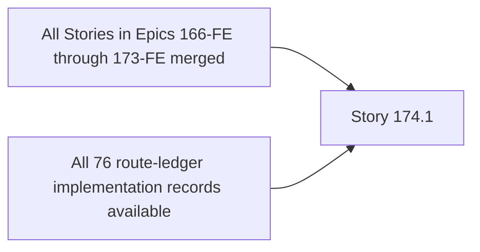

# Story 174.1: Prove BMAD, Route-Ledger, and OMX Plan Parity

## Authoritative References

1. `_bmad-output/planning-artifacts/epics-166-174-fe-shadcn-migration.md` — canonical Story 174.1 ID/title, requirements, ownership, states, evidence, and acceptance criteria.
2. `.omx/plans/shadcn-full-ui-migration-master.md` — authoritative delivery DAG, standard Story protocol, merge policy, and cleanup contract.
3. `_bmad-output/planning-artifacts/ux-design-specification.md` — semantic visual, responsive, table/chart, state, theme, and WCAG 2.2 AA target.
4. `_bmad-output/planning-artifacts/shadcn-route-ledger.md` — exact route ownership and final verification evidence where this Story owns routes.
5. Current source and passing tests inside the allowed surface — brownfield behavior truth. If they conflict with planning prose, preserve proven behavior, record the discrepancy, and escalate scope rather than silently changing a contract.

This plan inherits the master protocol, but the narrower Story 174.1 scope below takes precedence.

## Outcome and Requirements

- **Requirements:** FR31, FR35
- **Route/User Value:** all 76 routes and 90 Stories; complete accountable migration scope.
- **Required outcome:** Prove exact one-to-one parity among the 90 canonical BMAD Stories, 90 per-Story OMX plans, 76 source routes, 76 route-ledger rows, ownership records, prerequisites, and evidence schema. This Story validates planning/tracking truth and does not migrate runtime UI.
- **Canonical shared dependency statement:** Epics 166–173-FE planning/implementation records available.
- **Completion boundary:** the canonical acceptance criteria, targeted/local validation, visual-responsive-accessibility evidence, independent review, merge, branch deletion, and worktree cleanup all have recorded proof.

## Prerequisite DAG and Ownership Gate



- [ ] Verify the merge SHA for **All Stories in Epics 166-FE through 173-FE merged** is reachable from current local `main`; record that SHA in the Story delivery record.
- [ ] Verify the merge SHA for **All 76 route-ledger implementation records available** is reachable from current local `main`; record that SHA in the Story delivery record.
- [ ] Confirm Story ID/title parity: `174.1` / `Prove BMAD, Route-Ledger, and OMX Plan Parity` in BMAD, this plan, the branch delivery record, and PR.
- [ ] Record current `main` base SHA after prerequisites merge; do not base this Story on another unmerged feature branch.
- [ ] Inventory every consumer of each proposed shared component. Edit a multi-route component only when Story 174.1 is its explicit owner; otherwise stop that edit and route it to the named prerequisite owner.
- [ ] Confirm the route-ledger row(s), if any, are owned exactly once by Story 174.1. Epic 174 audit Stories verify rather than take silent ownership of route implementation.

## Exact Branch and Isolated Worktree

- **Branch:** `cdx/epic-174-story-1-plan-parity`
- **Temporary worktree:** `/private/tmp/wb-repricer-fe-174-1-plan-parity`
- **Base:** current local `main`, after the prerequisite SHAs above are present.
- **Rule:** one Story, one branch, one fresh worktree; never reuse a stale branch/worktree.

Creation sequence from the primary checkout:

```bash
git -C "/Users/r2d2/Documents/Code_Projects/wb-repricer-system-new/frontend" fetch origin
git -C "/Users/r2d2/Documents/Code_Projects/wb-repricer-system-new/frontend" switch main
git -C "/Users/r2d2/Documents/Code_Projects/wb-repricer-system-new/frontend" pull --ff-only origin main
git -C "/Users/r2d2/Documents/Code_Projects/wb-repricer-system-new/frontend" rev-parse HEAD
git -C "/Users/r2d2/Documents/Code_Projects/wb-repricer-system-new/frontend" worktree list
test ! -e "/private/tmp/wb-repricer-fe-174-1-plan-parity"
git -C "/Users/r2d2/Documents/Code_Projects/wb-repricer-system-new/frontend" show-ref --verify --quiet "refs/heads/cdx/epic-174-story-1-plan-parity" && exit 1 || true
git -C "/Users/r2d2/Documents/Code_Projects/wb-repricer-system-new/frontend" worktree add -b "cdx/epic-174-story-1-plan-parity" "/private/tmp/wb-repricer-fe-174-1-plan-parity" main
git -C "/private/tmp/wb-repricer-fe-174-1-plan-parity" status --short --branch
```

Record the base SHA and the clean initial status. If the explicit path or branch already exists, treat it as stale state to investigate; do not overwrite or reuse it.

## Allowed and Forbidden Files

### Allowed change surface

- planning, tracking, and non-product validation scripts only.
- Canonical owned surface: route ledger, BMAD migration artifact, OMX master/per-Story plans, parity validators and planning documentation.
- Direct Vitest/Playwright fixtures, screenshots, and Story evidence that prove this owned behavior.
- Story delivery documentation only when required to record proof.

Before editing, expand wildcards to an explicit file manifest with `rg --files`, and attach that manifest to the delivery record.

### Forbidden files and changes

- runtime UI, API/hooks/types, tokens/primitives, route implementation.
- Any file outside the explicit manifest, including unrelated route/domain trees.
- Backend code or contracts; API clients, hooks, types, query keys, calculations, cache invalidation, and authorization unless the canonical allowed surface explicitly names them.
- Foundation tokens, generic `src/components/ui/**`, AppShell/navigation, or multi-route product compositions owned by a prerequisite Story unless explicitly allowed above.
- New dependencies, `shadcn init --force`, broad mechanical rewrites, required CI gates, and unrelated cleanup.
- If a forbidden shared edit becomes necessary, stop that edit and escalate to the orchestrator/owner Story; do not absorb it into Story 174.1.

## Behavior Lock Before Presentation Changes

Canonical state matrix: **every route has applicable-state ownership and evidence fields; no implementation state is changed here.**

1. Inventory the owned route/component tree, overlays, forms, tables/charts, hooks consumed, URL/search state, queries/mutations, focus transitions, formatting, and all navigation outcomes.
2. Run the targeted commands below on the clean baseline and save exact command/exit-code output.
3. Add or strengthen regression tests before presentation edits wherever existing coverage cannot prove the canonical state matrix, current data meaning, focus lifecycle, query/request count, mutation outcomes, or URL/navigation preservation.
4. Use representative Russian labels and fixtures for zero, missing/unavailable, stale/partial, negative/large financial values, dates, percentages, and ISO weeks as applicable.
5. Record baseline screenshots or DOM/accessibility snapshots for materially different states. Baseline failures are documented and resolved or explicitly treated as blockers; they are never relabeled as passes.

## Story-Specific Implementation

1. Enumerate canonical Story IDs/titles from BMAD, source `page.tsx` routes, route-ledger rows, and per-Story OMX plans; normalize only comparison syntax, never canonical identity.
2. Implement or strengthen a non-product parity validator that fails on missing, extra, duplicate, orphaned, title-mismatched, future-dependent, or incomplete-evidence records.
3. Prove `90 BMAD Stories = 90 OMX plans` and `76 source routes = 76 ledger routes = 76 route Stories`, with every item mapped exactly once.
4. Validate required per-Story fields: authoritative references, prerequisites, owner surface, forbidden files, branch/worktree lifecycle, tests, visual/accessibility proof, review, merge, and cleanup evidence.
5. Reconcile planning/tracking discrepancies only inside the allowed artifacts; do not edit runtime UI or take ownership from implementation Stories.
6. Save machine-readable and human-readable parity output, including exact failing IDs/routes for any mismatch.
7. Inspect the final file manifest and diff; remove temporary diagnostics and accidental planning churn.

## Targeted Tests and Local Validation

Run on pinned Node `24.18.0` and npm `11.11.0`. The frontend test URL is `http://localhost:3100`; the local backend URL is `http://localhost:3000`.

Targeted proof, in order:

- `node scripts/check-shadcn-migration-parity.mjs`
- `git diff --check`

Where the named Story-specific target does not yet exist, create it inside the allowed test/evidence surface before implementation is accepted; it must exercise the canonical states and then pass under the exact command above.

Then run the universal local merge gate:

```bash
node --version
npm --version
npm run lint
npm run type-check
npm run check:max-lines
npm run build
git -C "/private/tmp/wb-repricer-fe-174-1-plan-parity" diff --check
```

Required recorded evidence:

- exact commands, versions, exit codes, and complete failure output;
- the targeted behavior/state assertions and any request/URL/mutation preservation assertions;
- `machine check: 76 source routes = 76 ledger routes = 76 route Stories; 90 BMAD Stories = 90 OMX plans; no duplicates.`;
- canonical local-validation intent: parity validator plus documentation checks and `git diff --check`.
- unavailable environment-dependent checks are explicit validation gaps with next-best proof, never passes.

## Visual, Responsive, Theme, and Accessibility Proof

- Capture Story-specific evidence under a unique `test-results/shadcn/story-174.1/` run directory or the repository's established equivalent.
- Verify light and dark themes at `320`, `390`, `768`, `1024`, `1280`, and `1440+` CSS pixels where the surface is applicable.
- Verify 200% zoom, long Russian labels/values, narrow and dense data, visible focus, logical headings/reading order, keyboard-only completion, and reduced motion where applicable.
- **Story responsive/data contract:** verify each route Story declares its specific contract.
- **Story accessibility contract:** verify each Story declares automated and manual evidence.
- Verify accessible names/roles/states, error association/summary, focus containment and return for Dialog/Sheet/Popover/Menu/Drawer, moderated status announcements, and non-color meaning.
- Normal text must meet `4.5:1`; applicable large text and non-text UI must meet `3:1`.
- Tables must prove caption/name, primary identity, numeric precision/alignment, sort/selection/actions, pagination or virtualization, and the declared narrow-width strategy.
- Charts/visualizations must prove title, period, units, series/legend meaning, tooltip precision, responsive containment, reduced motion, accessible summary, and equivalent data evidence.
- Attach screenshot identifiers, axe output, keyboard/focus notes, contrast notes, and manual review disposition. Automated axe success alone is insufficient.

## Independent Adversarial Review

After the author completes implementation and validation, assign a reviewer who did not author Story 174.1.

Reviewer checklist:

1. Compare the complete diff and file manifest against Allowed/Forbidden Files.
2. Re-run or inspect targeted proof for every canonical state, contract-preservation assertion, and dynamic/overlay workflow.
3. Challenge responsive density, both themes, keyboard/focus lifecycle, semantic meaning, table/chart alternatives, and Russian/edge-value fixtures.
4. Search for hardcoded/light-only presentation, raw controls that bypass approved primitives, hidden shared-owner edits, behavior changes, test weakening, and scope creep.
5. Record each finding, severity, disposition, and rerun evidence. All accepted findings must be resolved before merge; unresolved material findings block the PR.

## Commit, Push, PR, and Merge

Only after targeted tests, universal validation, visual/accessibility proof, and independent review pass:

```bash
git -C /private/tmp/wb-repricer-fe-174-1-plan-parity diff --check
git -C /private/tmp/wb-repricer-fe-174-1-plan-parity status --short
UNSTAGED_TRACKED_FILES="$(git -C "/private/tmp/wb-repricer-fe-174-1-plan-parity" diff --name-only)"
UNTRACKED_FILES="$(git -C "/private/tmp/wb-repricer-fe-174-1-plan-parity" ls-files --others --exclude-standard)"
EXPLICIT_ALLOWED_FILES_AND_DIRECT_TESTS="$(printf '%s\n%s\n' "$UNSTAGED_TRACKED_FILES" "$UNTRACKED_FILES" | sed '/^$/d' | sort -u)"
test -n "$EXPLICIT_ALLOWED_FILES_AND_DIRECT_TESTS"
printf '%s\n' "$EXPLICIT_ALLOWED_FILES_AND_DIRECT_TESTS"
git -C "/private/tmp/wb-repricer-fe-174-1-plan-parity" add -- $EXPLICIT_ALLOWED_FILES_AND_DIRECT_TESTS
git -C /private/tmp/wb-repricer-fe-174-1-plan-parity diff --cached --stat
git -C /private/tmp/wb-repricer-fe-174-1-plan-parity commit \
  -m "chore(migration): prove bmad route ledger and omx plan parity" \
  -m "Story 174.1. Migrate only the canonical owned surface, preserve established contracts and states, and record targeted, local, visual, accessibility, and independent-review evidence."
git -C /private/tmp/wb-repricer-fe-174-1-plan-parity push -u origin cdx/epic-174-story-1-plan-parity
REPOSITORY="salacoste/wb-erp-system-daytona-FE"
STORY_PR_URL="$(gh pr create --repo "$REPOSITORY" --base main --head "cdx/epic-174-story-1-plan-parity" \
  --title "Story 174.1: Prove BMAD, Route-Ledger, and OMX Plan Parity" \
  --body "Implements BMAD Story 174.1 within its declared owner surface. Includes prerequisite/base SHA, behavior-lock evidence, exact validation results, visual/responsive/accessibility proof, independent-review disposition, risks, and cleanup checklist. No production or backend-contract work.")"
test -n "$STORY_PR_URL"
STORY_PR_NUMBER="$(gh pr view "$STORY_PR_URL" --repo "$REPOSITORY" --json number --jq '.number')"
test -n "$STORY_PR_NUMBER"
gh pr merge "$STORY_PR_NUMBER" --repo "$REPOSITORY" --merge
STORY_MERGE_SHA="$(gh pr view "$STORY_PR_NUMBER" --repo "$REPOSITORY" --json mergeCommit --jq '.mergeCommit.oid')"
test -n "$STORY_MERGE_SHA"
```

- Confirm the PR diff contains only allowed files and direct proof.
- Re-run affected checks after review fixes and update the evidence.
- Merge only under the repository's local-validation policy; GitHub Actions are not a required gate.
- The executable block above runs `gh pr merge "$STORY_PR_NUMBER" --repo "$REPOSITORY" --merge` only after required local evidence and review pass.
- Never push directly or force-push to `main`; never merge an unresolved material finding.
- Record feature commit SHA, PR number/URL, review disposition, merge commit SHA, and confirmation that the merge SHA is reachable from updated local `main`.

## Mandatory Branch and Worktree Cleanup

After the PR is merged, run from the primary checkout, substituting only the recorded PR/merge reference—not the exact Story branch/path:

```bash
REPOSITORY="salacoste/wb-erp-system-daytona-FE"
STORY_BRANCH="cdx/epic-174-story-1-plan-parity"
STORY_PR_NUMBER="$(gh pr list --repo "$REPOSITORY" --head "$STORY_BRANCH" --state merged --json number --jq '.[0].number')"
test -n "$STORY_PR_NUMBER"
STORY_MERGE_SHA="$(gh pr view "$STORY_PR_NUMBER" --repo "$REPOSITORY" --json mergeCommit --jq '.mergeCommit.oid')"
test -n "$STORY_MERGE_SHA"
git -C "/Users/r2d2/Documents/Code_Projects/wb-repricer-system-new/frontend" switch main
git -C "/Users/r2d2/Documents/Code_Projects/wb-repricer-system-new/frontend" pull --ff-only origin main
git -C "/Users/r2d2/Documents/Code_Projects/wb-repricer-system-new/frontend" branch --contains "$STORY_MERGE_SHA"
git -C "/Users/r2d2/Documents/Code_Projects/wb-repricer-system-new/frontend" push origin --delete "cdx/epic-174-story-1-plan-parity"
git -C "/Users/r2d2/Documents/Code_Projects/wb-repricer-system-new/frontend" worktree remove "/private/tmp/wb-repricer-fe-174-1-plan-parity"
git -C "/Users/r2d2/Documents/Code_Projects/wb-repricer-system-new/frontend" branch -d "cdx/epic-174-story-1-plan-parity"
git -C "/Users/r2d2/Documents/Code_Projects/wb-repricer-system-new/frontend" worktree prune
git -C "/Users/r2d2/Documents/Code_Projects/wb-repricer-system-new/frontend" worktree list
git -C "/Users/r2d2/Documents/Code_Projects/wb-repricer-system-new/frontend" branch --list "cdx/epic-174-story-1-plan-parity"
git -C "/Users/r2d2/Documents/Code_Projects/wb-repricer-system-new/frontend" ls-remote --heads origin "cdx/epic-174-story-1-plan-parity"
git -C "/Users/r2d2/Documents/Code_Projects/wb-repricer-system-new/frontend" status --short --branch
```

Completion evidence must show:

- merge SHA is present on local `main`;
- remote branch deletion succeeded or `git ls-remote` proves it is already absent;
- local branch deletion succeeded;
- `/private/tmp/wb-repricer-fe-174-1-plan-parity` was removed;
- `git worktree prune` ran;
- `git worktree list` has no Story 174.1 worktree;
- local and remote branch queries return no `cdx/epic-174-story-1-plan-parity`;
- intended primary-checkout status is recorded; and
- canonical cleanup intent is satisfied: merged tracking artifacts, deleted branch, removed worktree.

Do not use forced worktree removal or forced branch deletion to conceal unmerged changes. Investigate and preserve unexpected work first.

## Risks and Mitigations

| Story-specific risk | Required mitigation / blocking proof |
| --- | --- |
| Presentation work changes the established meaning or behavior of all 76 routes and 90 Stories; complete accountable migration scope. | Behavior-lock the canonical states and request/query/calculation/navigation/mutation semantics before editing; rerun targeted proof after the final diff. |
| Shared ownership is crossed because Epics 166–173-FE planning/implementation records available. | Record prerequisite SHAs and a consumer/file manifest; reject forbidden edits and route shared needs to their owner. |
| Responsive or dense-data treatment loses evidence: verify each route Story declares its specific contract. | Capture the full width/theme matrix and prove primary identity, precision, actions, and alternatives remain available. |
| Keyboard, focus, status, or non-color meaning regresses: verify each Story declares automated and manual evidence. | Require manual keyboard/focus notes, semantic assertions, axe output, contrast evidence, and independent review. |
| Async or edge states are visually omitted: every route has applicable-state ownership and evidence fields; no implementation state is changed here. | Test each applicable fixture and block merge on an unhandled state. |
| Branch/worktree residue or an over-broad diff survives merge | Enforce the exact file manifest, cleanup command sequence, and absence checks above. |

## Testable Acceptance Criteria

Canonical BMAD acceptance criteria:

> **Given** the current source routes, BMAD artifact, route ledger, and OMX plan directory
> **When** parity validation runs
> **Then** every route and Story maps exactly once with matching IDs, prerequisites, ownership, and evidence schema
> **And** any missing, duplicate, orphaned, or title-mismatched item fails validation.

Execution acceptance checklist:

- [ ] Exact Story ID/title, prerequisites, route ownership, branch, and worktree match this plan.
- [ ] Only the explicit allowed file manifest and direct tests/evidence changed; no forbidden shared or backend contract file changed.
- [ ] Complete owned render tree and every applicable state are migrated with current behavior preserved.
- [ ] Targeted Vitest/Playwright or audit commands pass with recorded output.
- [ ] `npm run lint`, `npm run type-check`, `npm run check:max-lines`, `npm run build`, and `git diff --check` pass on the final diff.
- [ ] Light/dark, responsive widths, 200% zoom, Russian/edge values, keyboard/focus, semantics, and applicable table/chart evidence are recorded.
- [ ] An independent non-author review has no unresolved accepted finding.
- [ ] Detailed conventional commit, push, PR, and merge evidence is recorded; no direct/force push to `main`.
- [ ] Remote/local feature branches are absent and the exact temporary worktree is removed and pruned with command evidence.
- [ ] No production or deployment action occurred.

## No-Production Scope and Stop Conditions

Story 174.1 authorizes local frontend/planning/test work, local backend-connected validation at `localhost:3000`, and the feature-branch/PR lifecycle above only. It does **not** authorize deployment, production infrastructure/configuration/data operations, backend contract changes, secrets, direct or force pushes to `main`, destructive cleanup outside the exact merged Story branch/worktree, or a required CI gate.

Stop and escalate this Story if it requires a forbidden shared file, a new dependency, a backend/public contract change, production authority, an unrelated destructive action, or an unresolved material validation/review failure. The Story is complete only when implementation and every acceptance/evidence/cleanup item above pass and no Story-owned branch or worktree remains.
