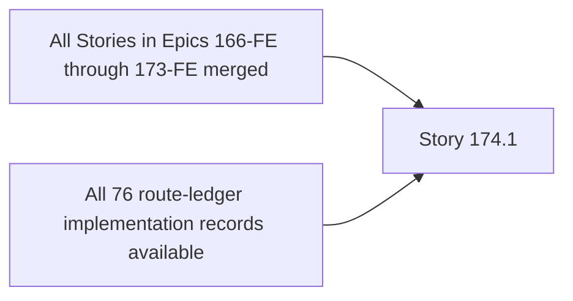

# Story 174.1: Prove BMAD, Route-Ledger, and OMX Plan Parity

## Authoritative References

1. `_bmad-output/planning-artifacts/epics-166-174-fe-shadcn-migration.md` — canonical Story 174.1 ID/title, requirements, ownership, states, evidence, and acceptance criteria.
2. `.omx/plans/shadcn-full-ui-migration-master.md` — authoritative delivery DAG, standard Story protocol, merge policy, and cleanup contract.
3. `_bmad-output/planning-artifacts/ux-design-specification.md` — read-only source for the evidence-schema fields that each route Story must declare; Story 174.1 does not reperform visual/accessibility validation.
4. `_bmad-output/planning-artifacts/shadcn-route-ledger.md` — exact 76-row route ownership source. Story 174.1 validates rows and does not own a route implementation.
5. Current planning artifacts, validator source/tests/fixtures, and read-only `src/app/**/page.tsx` paths — parity truth. Runtime component behavior is outside this Story.

This plan inherits the master protocol, but the narrower Story 174.1 scope below takes precedence.
The frontmatter status is this plan's execution gate; Story 174.1 started from clean base `9d611369085a1e88783322a50f3c3a043cd25257` after Story 173.13 auxiliary PR #367 merged as `3cc30b66bce748c56c5286054fe1707c0bb3617c` and its exact branch/worktree/ref residue was removed.

## Outcome and Requirements

- **Requirements:** FR31, FR35
- **Route/User Value:** all 76 routes and 94 Stories; complete accountable migration scope.
- **Required outcome:** Prove exact one-to-one parity among the 94 canonical BMAD Stories, 94 per-Story OMX plans, 76 source routes, 76 route-ledger rows, ownership records, prerequisites, and evidence schema. This Story validates planning/tracking truth and does not migrate runtime UI.
- **Canonical shared dependency statement:** Epics 166–173-FE planning/implementation records available.
- **Completion boundary:** canonical acceptance criteria, deterministic positive/negative parity validation, machine/human reports, exact reviewed-manifest proof, independent review, merge, branch deletion, and worktree cleanup all have recorded evidence.

## Prerequisite DAG and Ownership Gate



- [x] Verify the merge SHA for **All Stories in Epics 166-FE through 173-FE merged** is reachable from current local `main`; Story 173.13 auxiliary merge `3cc30b66bce748c56c5286054fe1707c0bb3617c` is an ancestor of the Story base.
- [x] Verify the merge SHA for **All 76 route-ledger implementation records available** is reachable from current local `main`; the same refreshed base contains all 76 unique linked implementation artifacts.
- [x] Confirm Story ID/title parity: `174.1` / `Prove BMAD, Route-Ledger, and OMX Plan Parity` in BMAD, this plan, and the branch delivery record; PR identity remains a future lifecycle field.
- [x] Record current `main` base SHA after prerequisites merge: `9d611369085a1e88783322a50f3c3a043cd25257`.
- [x] Inventory and freeze exactly nine planning/tracking/validator paths before the first edit; runtime source remains read-only.
- [x] Confirm Story 174.1 has no route-ledger row and does not take route ownership; all 76 existing rows resolve exactly once and remain `planned`.

## Exact Branch and Isolated Worktree

- **Branch:** `cdx/epic-174-story-1-plan-parity`
- **Temporary worktree:** `/private/tmp/wb-repricer-fe-174-1-plan-parity`
- **Base:** current local `main`, after the prerequisite SHAs above are present.
- **Rule:** one Story, one branch, one fresh worktree; never reuse a stale branch/worktree.

Creation sequence from the primary checkout:

```bash
git -C "/Users/r2d2/Documents/Code_Projects/wb-repricer-system-new/frontend" fetch origin
git -C "/Users/r2d2/Documents/Code_Projects/wb-repricer-system-new/frontend" switch main
git -C "/Users/r2d2/Documents/Code_Projects/wb-repricer-system-new/frontend" pull --ff-only origin main
git -C "/Users/r2d2/Documents/Code_Projects/wb-repricer-system-new/frontend" rev-parse HEAD
git -C "/Users/r2d2/Documents/Code_Projects/wb-repricer-system-new/frontend" worktree list
test ! -e "/private/tmp/wb-repricer-fe-174-1-plan-parity"
git -C "/Users/r2d2/Documents/Code_Projects/wb-repricer-system-new/frontend" show-ref --verify --quiet "refs/heads/cdx/epic-174-story-1-plan-parity" && exit 1 || true
git -C "/Users/r2d2/Documents/Code_Projects/wb-repricer-system-new/frontend" worktree add -b "cdx/epic-174-story-1-plan-parity" "/private/tmp/wb-repricer-fe-174-1-plan-parity" main
git -C "/private/tmp/wb-repricer-fe-174-1-plan-parity" status --short --branch
```

Record the base SHA and the clean initial status. If the explicit path or branch already exists, treat it as stale state to investigate; do not overwrite or reuse it.

## Allowed and Forbidden Files

### Allowed change surface

- Planning, tracking, parity-validator source/tests/fixtures, and non-product Story evidence only.
- Canonical owned surface: route ledger, BMAD migration artifact, OMX master/per-Story plans, parity validator, deterministic validator fixtures, and planning documentation.
- Machine-readable and human-readable parity output that records exact missing, extra, duplicate, orphaned, title-mismatched, repository-mismatched, prerequisite-invalid, or evidence-schema-invalid records.
- Story delivery documentation only when required to record the frozen reviewed manifest, validator evidence, review disposition, merge SHA, and cleanup proof.

Before editing, resolve every candidate path, freeze the exact reviewed manifest in the delivery record, and export the same newline-delimited value as `STORY_174_1_PREDECLARED_REVIEWED_MANIFEST`. Do not populate it from the later Git diff.

### Forbidden files and changes

- runtime UI, API/hooks/types, tokens/primitives, route implementation.
- Any file outside the explicit manifest, including unrelated route/domain trees.
- Backend code or contracts; API clients, hooks, types, query keys, calculations, cache invalidation, and authorization unless the canonical allowed surface explicitly names them.
- Foundation tokens, generic `src/components/ui/**`, AppShell/navigation, or multi-route product compositions owned by a prerequisite Story unless explicitly allowed above.
- New dependencies, `shadcn init --force`, broad mechanical rewrites, required CI gates, and unrelated cleanup.
- If a forbidden shared edit becomes necessary, stop that edit and escalate to the orchestrator/owner Story; do not absorb it into Story 174.1.

## Parity Baseline and Validator Contract

Story 174.1 changes no runtime presentation or product behavior. Its behavior lock is the current planning corpus plus deterministic validator failure semantics.

1. On a clean refreshed `main`, record the exact 94 canonical Story headings/titles, 94 per-Story plan frontmatters, 76 source `page.tsx` paths, 76 route-ledger rows, repository assignments, branch/worktree identities, prerequisite edges, status rows, and evidence-schema fields.
2. Run the existing parity command if present. If absent, retain that absence as RED evidence before creating `scripts/check-shadcn-migration-parity.mjs` and its direct deterministic test/fixture surface.
3. Add fixtures/tests proving the validator fails with exact IDs/paths for each applicable defect class: missing, extra, duplicate, orphaned, title mismatch, nonexistent route entry, duplicate route owner, invalid repository exception, duplicate branch/worktree, unresolved prerequisite, and missing required evidence field.
4. Prove the clean canonical corpus passes only after every discrepancy is resolved in an owned planning/tracking artifact. Do not weaken the validator, normalize away canonical identity, or rewrite runtime source to make parity pass.
5. Before the first edit, freeze the exact newline-delimited reviewed file manifest in the Story delivery record and export it as `STORY_174_1_PREDECLARED_REVIEWED_MANIFEST`. Any later path addition requires a separate scope review and a newly frozen manifest before that path is edited.
6. Record complete RED and GREEN output, validator version/base SHA, exact counts, and the failing-record list. There is no screenshot, viewport, theme, keyboard, chart, or route-state evidence requirement for this non-product planning validator Story.

## Story-Specific Implementation

1. Enumerate canonical Story IDs/titles from BMAD, source `page.tsx` routes, route-ledger rows, and per-Story OMX plans; normalize only comparison syntax, never canonical identity.
2. Implement or strengthen a non-product parity validator that fails on missing, extra, duplicate, orphaned, title-mismatched, future-dependent, or incomplete-evidence records.
   The master Story Plan Index and its ownership/dependency fingerprint table are the canonical executable OMX parity declarations inherited by every numeric plan. Validate each plan's exact master linkage and identity/reference/status contract; do not treat incidental legacy prerequisite prose as a second canonical graph that can override later approved BMAD/master updates.
3. Prove `94 BMAD Stories = 94 OMX plans` and `76 source routes = 76 ledger routes = 76 route Stories`, with every item mapped exactly once.
4. Validate Stories 167.8 and 169.14 against their separate exact backend repository, branch, worktree, merge-ancestry, and cleanup contracts in `/Users/r2d2/Documents/Code_Projects/wb-repricer-system-new`; validate every other Story plan against its declared repository. Cross-repository parity may read both repositories but may not mutate backend product code.
5. Validate required per-Story fields: authoritative references, prerequisites, owner surface, forbidden files, repository-specific branch/worktree lifecycle, tests, visual/accessibility proof, review, merge, and cleanup evidence.
6. Reconcile planning/tracking discrepancies only inside the allowed artifacts; do not edit runtime UI or take ownership from implementation Stories.
7. Save machine-readable and human-readable parity output, including exact failing IDs/routes for any mismatch.
8. Inspect the final file manifest and diff; remove temporary diagnostics and accidental planning churn.

## Targeted Tests and Local Validation

Run on pinned Node `24.18.0` and npm `11.11.0`. No frontend server, backend service, browser, credential, or production environment is required for this filesystem/planning validator.

Targeted proof, in order:

- `node scripts/check-shadcn-migration-parity.mjs`
- `git diff --check`

Where the named validator does not yet exist, retain the missing-command/baseline gap as RED evidence, then create it inside the allowed script/test surface. It must exercise canonical success plus deterministic negative fixtures and pass under the exact command above.

Then run the universal local merge gate:

```bash
node --version
npm --version
npm run lint
npm run type-check
npm run check:max-lines
npm run build
git -C "/private/tmp/wb-repricer-fe-174-1-plan-parity" diff --check
```

Required recorded evidence:

- exact commands, versions, exit codes, and complete failure output;
- exact positive and negative validator assertions, including the offending Story ID, plan path, route entry, repository assignment, prerequisite edge, or evidence field;
- `machine check: 76 source routes = 76 ledger routes = 76 route Stories; 94 BMAD Stories = 94 OMX plans; no duplicates.`;
- canonical local-validation intent: parity validator plus documentation checks and `git diff --check`.
- validator or filesystem checks that cannot run are explicit blockers or named gaps with next-best proof, never passes; browser/backend availability is N/A.

## Planning and Validator Evidence

- Record one machine-readable parity report and one concise human-readable summary from the same validator run and base SHA.
- The machine report must enumerate exact Story IDs, plan files, route entries, route-ledger rows, repository assignments, prerequisite edges, branch/worktree identities, and evidence-schema failures rather than reporting counts alone.
- The human summary must state `94 BMAD Stories = 94 OMX plans`, `76 source routes = 76 route-ledger rows = 76 route Stories`, Epic-level counts, duplicate/orphan/mismatch counts, and separate backend-exception validation for Stories 167.8 and 169.14.
- Retain deterministic negative-fixture proof for every supported defect class and demonstrate a non-zero exit code plus actionable record identity.
- Record the exact reviewed file manifest, empty-index proof before staging, exact cached-manifest equality, independent review disposition, feature/merge SHAs, and branch/worktree cleanup evidence.
- Responsive, theme, screenshot, axe, keyboard, focus, contrast, table, and chart evidence are explicitly N/A because Story 174.1 mutates no product or runtime UI. This Story verifies that route Stories declare their own applicable evidence fields; it does not reperform their visual/accessibility work.

## Independent Adversarial Review

After the author completes implementation and validation, assign a reviewer who did not author Story 174.1.

Reviewer checklist:

1. Compare the complete diff and file manifest against Allowed/Forbidden Files.
2. Re-run the parity validator and deterministic negative fixtures; confirm every supported defect class fails with the exact offending ID/path and a non-zero exit code.
3. Recompute canonical counts and set parity independently from the implementation; challenge normalization rules, duplicate detection, repository-exception handling, prerequisite validation, and evidence-schema completeness.
4. Confirm no runtime source, backend product code, UI test, screenshot, or route implementation changed, and that no validator assertion was weakened to accommodate a planning mismatch.
5. Verify the reviewed manifest was frozen before edits, any later addition received a separate scope review, the index was empty before staging, no extra/missing path was staged, and the cached manifest equals the reviewed manifest exactly.
6. Record each finding, severity, disposition, and rerun evidence. All accepted findings must be resolved before merge; unresolved material findings block the PR.

## Commit, Push, PR, and Merge

Only after targeted parity tests, universal validation, planning/validator evidence, and independent review pass:

```bash
git -C /private/tmp/wb-repricer-fe-174-1-plan-parity diff --check
git -C /private/tmp/wb-repricer-fe-174-1-plan-parity status --short
test -z "$(git -C "/private/tmp/wb-repricer-fe-174-1-plan-parity" diff --cached --name-only)"
REVIEWED_MANIFEST="$(printf '%s\n' "${STORY_174_1_PREDECLARED_REVIEWED_MANIFEST:?export the exact manifest frozen before the first edit}" | sed '/^$/d' | sort -u)"
STORY_ALLOWED_MANIFEST="$(printf '%s\n' \
  '.omx/plans/174.1-prove-bmad-route-ledger-and-omx-plan-parity.md' \
  '.omx/plans/shadcn-full-ui-migration-master.md' \
  '_bmad-output/implementation-artifacts/174-1-fe-prove-bmad-route-ledger-and-omx-plan-parity.md' \
  '_bmad-output/implementation-artifacts/sprint-status.yaml' \
  '_bmad-output/planning-artifacts/epics-166-174-fe-shadcn-migration.md' \
  '_bmad-output/planning-artifacts/shadcn-migration-status-and-debt-registry.md' \
  '_bmad-output/planning-artifacts/shadcn-route-ledger.md' \
  'scripts/check-shadcn-migration-parity.mjs' \
  'scripts/__tests__/check-shadcn-migration-parity.test.mjs' | sort)"
ACTUAL_CHANGED_MANIFEST="$({
  git -C "/private/tmp/wb-repricer-fe-174-1-plan-parity" diff --name-only
  git -C "/private/tmp/wb-repricer-fe-174-1-plan-parity" ls-files --others --exclude-standard
  test -f "/private/tmp/wb-repricer-fe-174-1-plan-parity/_bmad-output/implementation-artifacts/174-1-fe-prove-bmad-route-ledger-and-omx-plan-parity.md" && printf '%s\n' '_bmad-output/implementation-artifacts/174-1-fe-prove-bmad-route-ledger-and-omx-plan-parity.md'
} | sed '/^$/d' | sort -u)"
test -n "$REVIEWED_MANIFEST"
test -z "$(comm -23 \
  <(printf '%s\n' "$REVIEWED_MANIFEST") \
  <(printf '%s\n' "$STORY_ALLOWED_MANIFEST"))"
test "$ACTUAL_CHANGED_MANIFEST" = "$REVIEWED_MANIFEST"
printf '%s\n' "$REVIEWED_MANIFEST"
# UX, PRD, architecture, runtime, package, E2E, and unrelated historical planning files
# are intentionally absent. Any newly necessary path requires an ownership correction
# that updates this static allowlist before the path is edited, reruns affected validation,
# re-freezes the reviewed manifest, and includes the addition in both independent reviews.
while IFS= read -r STORY_PATH; do
  if test "$STORY_PATH" = '_bmad-output/implementation-artifacts/174-1-fe-prove-bmad-route-ledger-and-omx-plan-parity.md'; then
    git -C "/private/tmp/wb-repricer-fe-174-1-plan-parity" add -f -- "$STORY_PATH"
  else
    git -C "/private/tmp/wb-repricer-fe-174-1-plan-parity" add -- "$STORY_PATH"
  fi
done <<< "$REVIEWED_MANIFEST"
CACHED_MANIFEST="$(git -C "/private/tmp/wb-repricer-fe-174-1-plan-parity" diff --cached --name-only | sort)"
test "$CACHED_MANIFEST" = "$REVIEWED_MANIFEST"
git -C /private/tmp/wb-repricer-fe-174-1-plan-parity diff --cached --check
git -C /private/tmp/wb-repricer-fe-174-1-plan-parity commit \
  -m "chore(migration): prove bmad route ledger and omx plan parity" \
  -m "Story 174.1. Validate canonical Story/plan/route parity, repository and prerequisite contracts, deterministic failure fixtures, exact planning scope, and cleanup evidence without runtime product changes."
git -C /private/tmp/wb-repricer-fe-174-1-plan-parity push -u origin cdx/epic-174-story-1-plan-parity
REPOSITORY="salacoste/wb-erp-system-daytona-FE"
STORY_PR_URL="$(gh pr create --repo "$REPOSITORY" --base main --head "cdx/epic-174-story-1-plan-parity" \
  --title "Story 174.1: Prove BMAD, Route-Ledger, and OMX Plan Parity" \
  --body "Implements BMAD Story 174.1 within its declared planning/validator surface. Includes prerequisite/base SHA, deterministic positive/negative parity evidence, exact reviewed/cached manifests, independent-review disposition, risks, and cleanup checklist. No runtime UI, production, or backend-contract work.")"
test -n "$STORY_PR_URL"
STORY_PR_NUMBER="$(gh pr view "$STORY_PR_URL" --repo "$REPOSITORY" --json number --jq '.number')"
test -n "$STORY_PR_NUMBER"
gh pr merge "$STORY_PR_NUMBER" --repo "$REPOSITORY" --merge
STORY_MERGE_SHA="$(gh pr view "$STORY_PR_NUMBER" --repo "$REPOSITORY" --json mergeCommit --jq '.mergeCommit.oid')"
test -n "$STORY_MERGE_SHA"
```

- Confirm the PR diff contains only allowed files and direct proof.
- Re-run affected checks after review fixes and update the evidence.
- Merge only under the repository's local-validation policy; GitHub Actions are not a required gate.
- The executable block above runs `gh pr merge "$STORY_PR_NUMBER" --repo "$REPOSITORY" --merge` only after required local evidence and review pass.
- Never push directly or force-push to `main`; never merge an unresolved material finding.
- Record feature commit SHA, PR number/URL, review disposition, merge commit SHA, and confirmation that the merge SHA is reachable from updated local `main`.

## Mandatory Branch and Worktree Cleanup

After the PR is merged, run from the primary checkout, substituting only the recorded PR/merge reference—not the exact Story branch/path:

```bash
REPOSITORY="salacoste/wb-erp-system-daytona-FE"
STORY_BRANCH="cdx/epic-174-story-1-plan-parity"
STORY_PR_NUMBER="$(gh pr list --repo "$REPOSITORY" --head "$STORY_BRANCH" --state merged --json number --jq '.[0].number')"
test -n "$STORY_PR_NUMBER"
STORY_MERGE_SHA="$(gh pr view "$STORY_PR_NUMBER" --repo "$REPOSITORY" --json mergeCommit --jq '.mergeCommit.oid')"
test -n "$STORY_MERGE_SHA"
git -C "/Users/r2d2/Documents/Code_Projects/wb-repricer-system-new/frontend" switch main
git -C "/Users/r2d2/Documents/Code_Projects/wb-repricer-system-new/frontend" pull --ff-only origin main
git -C "/Users/r2d2/Documents/Code_Projects/wb-repricer-system-new/frontend" branch --contains "$STORY_MERGE_SHA"
git -C "/Users/r2d2/Documents/Code_Projects/wb-repricer-system-new/frontend" push origin --delete "cdx/epic-174-story-1-plan-parity"
git -C "/Users/r2d2/Documents/Code_Projects/wb-repricer-system-new/frontend" worktree remove "/private/tmp/wb-repricer-fe-174-1-plan-parity"
git -C "/Users/r2d2/Documents/Code_Projects/wb-repricer-system-new/frontend" branch -d "cdx/epic-174-story-1-plan-parity"
git -C "/Users/r2d2/Documents/Code_Projects/wb-repricer-system-new/frontend" worktree prune
git -C "/Users/r2d2/Documents/Code_Projects/wb-repricer-system-new/frontend" worktree list
git -C "/Users/r2d2/Documents/Code_Projects/wb-repricer-system-new/frontend" branch --list "cdx/epic-174-story-1-plan-parity"
git -C "/Users/r2d2/Documents/Code_Projects/wb-repricer-system-new/frontend" ls-remote --heads origin "cdx/epic-174-story-1-plan-parity"
git -C "/Users/r2d2/Documents/Code_Projects/wb-repricer-system-new/frontend" status --short --branch
```

Completion evidence must show:

- merge SHA is present on local `main`;
- remote branch deletion succeeded or `git ls-remote` proves it is already absent;
- local branch deletion succeeded;
- `/private/tmp/wb-repricer-fe-174-1-plan-parity` was removed;
- `git worktree prune` ran;
- `git worktree list` has no Story 174.1 worktree;
- local and remote branch queries return no `cdx/epic-174-story-1-plan-parity`;
- intended primary-checkout status is recorded; and
- canonical cleanup intent is satisfied: merged tracking artifacts, deleted branch, removed worktree.

Do not use forced worktree removal or forced branch deletion to conceal unmerged changes. Investigate and preserve unexpected work first.

## Risks and Mitigations

| Story-specific risk                                                                                                                                | Required mitigation / blocking proof                                                                                                                                            |
| -------------------------------------------------------------------------------------------------------------------------------------------------- | ------------------------------------------------------------------------------------------------------------------------------------------------------------------------------- |
| One of 76 routes or 94 Stories is omitted, duplicated, orphaned, title-mismatched, or mapped to a nonexistent source path.                         | Compare canonical sets and identities, emit exact offending IDs/paths, run deterministic negative fixtures, and rerun the validator after the final diff.                       |
| A normalization rule hides a real canonical mismatch or collapses two distinct route/Story identities.                                             | Normalize only documented syntax; retain raw identity in machine output; independently recompute set equality and duplicate keys during review.                                 |
| Stories 167.8 or 169.14 are validated as ordinary frontend Stories, or another Story silently inherits backend authority.                          | Assert the exact two-item backend exception set, separate backend repository/scope/merge/cleanup fields, no route-ledger rows, and failure for any third exception.             |
| A prerequisite, branch, worktree, repository, status, or evidence-schema field is present syntactically but invalid or internally inconsistent.    | Validate field meaning and referential integrity, not presence alone; retain negative fixtures for unresolved prerequisites, duplicate lifecycle identities, and missing proof. |
| The validator is weakened or planning truth is rewritten mechanically so the current corpus passes.                                                | Require RED fixtures, explicit discrepancy review, minimal owned corrections, independent recomputation, and no assertion removal without owner approval.                       |
| The final diff includes an unreviewed planning file, runtime source, backend product file, or another path added after the frozen manifest review. | Require an empty index, exact predeclared-vs-actual equality, safe per-path staging, exact cached equality, and a separate scope review before any later manifest addition.     |
| Branch/worktree residue survives merge.                                                                                                            | Record merge ancestry and exact local/remote branch plus worktree absence after cleanup.                                                                                        |

## Testable Acceptance Criteria

Canonical BMAD acceptance criteria:

> **Given** the current source routes, BMAD artifact, route ledger, and OMX plan directory
> **When** parity validation runs
> **Then** every route and Story maps exactly once with matching IDs, prerequisites, ownership, and evidence schema
> **And** any missing, duplicate, orphaned, or title-mismatched item fails validation.

Execution acceptance checklist:

- [ ] Exact Story ID/title, prerequisites, route ownership, branch, and worktree match this plan.
- [ ] Exactly 94 canonical Story IDs/titles match 94 per-Story plans, with Epic counts, repositories, branches, worktrees, prerequisites, and evidence-schema fields validated.
- [ ] Exactly 76 source routes match 76 route-ledger rows and 76 route Stories, with no missing, extra, duplicate, orphaned, or nonexistent route entry.
- [ ] Stories 167.8 and 169.14 are the only backend exceptions, each has no route-ledger row, and each validates against its separate backend scope/merge/cleanup contract.
- [ ] Deterministic negative fixtures fail with non-zero exit codes and exact offending identities for every supported mismatch class.
- [ ] Only the predeclared reviewed planning/validator manifest changed; the index was empty before staging; actual and cached manifests equal the reviewed manifest exactly; no runtime UI or backend product file changed.
- [ ] `node scripts/check-shadcn-migration-parity.mjs` passes with recorded machine-readable and human-readable output.
- [ ] `npm run lint`, `npm run type-check`, `npm run check:max-lines`, `npm run build`, and `git diff --check` pass on the final diff.
- [ ] Responsive/theme/browser/accessibility evidence is recorded as N/A for this non-product Story while required per-route evidence-field declarations are validated structurally.
- [ ] An independent non-author review has no unresolved accepted finding.
- [ ] Detailed conventional commit, push, PR, and merge evidence is recorded; no direct/force push to `main`.
- [ ] Remote/local feature branches are absent and the exact temporary worktree is removed and pruned with command evidence.
- [ ] No production or deployment action occurred.

## No-Production Scope and Stop Conditions

Story 174.1 authorizes local planning/validator/test work, read-only repository metadata validation, and the feature-branch/PR lifecycle above only. It does **not** authorize runtime UI changes, backend product changes, deployment, production infrastructure/configuration/data operations, secrets, direct or force pushes to `main`, destructive cleanup outside the exact merged Story branch/worktree, or a required CI gate.

Stop and escalate this Story if it requires a forbidden shared file, a new dependency, a backend/public contract change, production authority, an unrelated destructive action, or an unresolved material validation/review failure. The Story is complete only when implementation and every acceptance/evidence/cleanup item above pass and no Story-owned branch or worktree remains.
