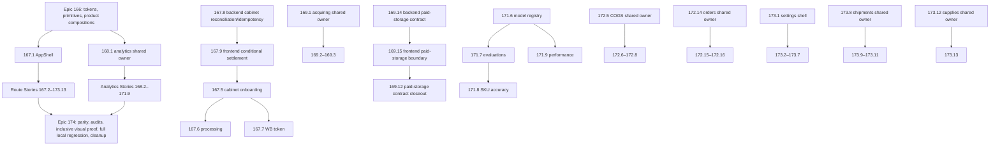

# OMX Master Plan — Full Shadcn/UI Frontend Migration

## Outcome

Migrate the complete frontend presentation layer to the approved shadcn/ui-based semantic design system, one BMAD Story at a time, while preserving current backend contracts, calculations, query keys, mutation behavior, URLs/search parameters, authentication, cabinet context, Russian localization, and formatting semantics except for the narrowly approved Story 167.8 cabinet reconciliation/idempotency contract and Story 169.14 paid-storage import lifecycle/result reconciliation.

The migration is complete only when all 94 BMAD Stories have matching OMX plans and completion evidence, all 76 route slices are verified exactly once, legacy presentation paths are removed only after their last consumer migrates, and every temporary feature worktree and feature branch has been removed after merge.

## Authoritative Inputs

1. `_bmad-output/planning-artifacts/ux-design-specification.md` — visual, interaction, responsive, table, chart, state, theme, and accessibility contracts.
2. `_bmad-output/planning-artifacts/epics-166-174-fe-shadcn-migration.md` — Story scope, acceptance criteria, ownership, prerequisites, forbidden files, and lifecycle contract.
3. `_bmad-output/planning-artifacts/shadcn-route-ledger.md` — exact route-to-Story ownership for all 76 `page.tsx` routes.
4. `components.json`, `src/styles/globals.css`, current source, and tests — brownfield implementation truth.

If documents and source disagree about existing behavior, source and passing behavior-locking tests are authoritative; the discrepancy must be recorded and routed to the orchestrator before scope changes.

## Non-Negotiable Principles

- Preserve behavior before changing presentation.
- Keep `src/components/ui/**` generic and domain-agnostic.
- Build in layers: semantic tokens → generic shadcn primitives → product compositions → domain-shared components → route-owned UI trees.
- Give every file consumed by two or more routes one upstream owner Story.
- Do not hide financial, operational, chart, table, availability, or error meaning behind color, hover, truncation, or viewport width.
- Do not run `shadcn init --force`; add no new UI or table dependency without a separate approved dependency decision.
- Do not edit a forbidden shared file from a route Story. Report the need and wait until the owning prerequisite Story is merged.
- One Story equals one feature branch and one temporary worktree.
- Local validation is the merge gate; production/deployment work and required CI gates are outside scope.
- Worktree removal and local/remote feature-branch deletion are mandatory completion conditions, not optional housekeeping.
- Exactly Stories 167.8 and 169.14 are cross-repository exceptions, and neither has a route-ledger row. Story 167.8 is bounded to the authoritative cabinet session reconciliation/create-idempotency contract. Story 169.14 is separately bounded to the authoritative paid-storage import request/lifecycle/result/error contract: BullMQ `waiting | delayed | prioritized | waiting-children` maps to wire `pending`, `active` maps to `processing`, terminal states retain their meaning, and BullMQ `unknown` fails closed as wire `failed` with sanitized `UNKNOWN_QUEUE_STATE` detail. Story 169.15 may use a frontend-only `unknown` sentinel solely for an unrecognized backend wire value; it does not reinterpret BullMQ `unknown`. No other Story inherits either exception.
- Verify each backend exception's implementation, PR, merge, and cleanup in the backend repository. Frontend coordination artifacts may not claim `review`, `done`, backend completion, or cleanup without the exact backend merge SHA, proof that SHA is an ancestor of refreshed backend `origin/main`, the exact recorded PR number and reviewed head SHA, local and remote backend branch absence, and backend worktree removal/prune evidence. Clean local-backend-`main` equality/ancestry remains preferred; it may be deferred only under a durable exact foreign-WIP reservation that records local/origin/base SHAs, exact WIP paths, and fresh no-overlap proof while leaving foreign WIP and the local `main` ref untouched.

## Delivery DAG



Execution details:

1. Execute Epic 166 in Story order because later foundation layers consume earlier ones.
2. Merge Story 167.1 before protected route migration. For the corrected onboarding lane, merge 167.8, then 167.9, then resume and merge 167.5; only then may 167.6 and 167.7 start.
3. Merge Story 168.1 before any analytics Story that consumes analytics-shared UI.
4. Within a domain, merge named upstream-owner Stories before their consumer Stories. Independent route Stories may run in parallel only when their Allowed Change Surfaces do not overlap.
5. Start Epic 174 only after Epics 166–173 are merged and the route ledger has completion evidence for all 76 routes.
6. Story numbers are canonical identities, not a universal execution order. Higher-numbered owner-approved correct-course prerequisites may precede lower-numbered route Stories when this DAG says so.
7. Stories 167.8 and 169.14 are the only approved cross-repository exceptions. Create and execute them in `/Users/r2d2/Documents/Code_Projects/wb-repricer-system-new`; all other Stories use the frontend repository and do not inherit backend authority.
8. PR #227 merged Story 169.12's route presentation early, before the approved paid-storage Correct Course reached `main`; retain that route delivery but do not mark the Story complete. Merge Story 169.14 in the backend repository, stage its restartable branch/worktree cleanup while retaining the backend reviewed-head, three-line PR, and strict nine-line cleanup-authority records, merge the exact artifact-only final handoff into trusted frontend history, retire the five source records, then merge and clean Story 169.15 in the frontend repository. Only then create the bounded Story 169.12 contract-closeout lane from refreshed frontend `main`. Story 169.13 remains independent.

## Standard Story Execution Protocol

Every per-Story plan inherits this protocol. Story-specific scope and acceptance criteria always take precedence where narrower.

### 1. Prerequisite and ownership gate

- Confirm prerequisite Story merge SHAs are present in current `main`.
- Confirm the BMAD Story ID/title and matching OMX plan ID/title.
- Resolve the exact Allowed Change Surface and Forbidden Shared Files before creating the worktree.
- Inventory all consumers of any component proposed for modification. Stop shared edits that lack the declared owner.
- Record base SHA and planned branch/worktree names.
- For Stories 167.8 and 169.14, re-run a fail-closed backend collision scan immediately before creation. Inspect staged, unstaged, and untracked Story-path WIP in every linked worktree; clean linked worktrees or branches whose committed diff overlaps Story-owned paths; and open PRs whose changed files overlap those paths. Hard-stop on a true overlap; a non-overlapping hunk reservation is valid only when both owners, exact files/hunks, integration order, conflict owner, and fresh diff evidence are documented.
- The collision scan must also enumerate every clean unattached local branch and stop on overlap. Before any fetch, push, deletion, or deletion-authorizing remote-tip read, require exactly one fetch URL and exactly one push URL for origin, resolve both independently to the expected nameWithOwner, and use the verified push endpoint for the mutation namespace. Retain fail-closed PR list-limit, full pagination, and authoritative changedFiles count checks.
- For Story 169.14, use a clean local-backend-`main` fast-forward when safe. If recorded foreign WIP blocks it, verified refreshed `origin/main` is the only approved Story base fallback: record local/origin/base SHAs, exact WIP paths and no-overlap proof in the Story artifact, and never mutate the WIP or local `main`. After behavioral RED and before the first backend production edit, the trusted frontend artifact must contain exactly one backend-base, RED classification/command/nonzero exit/output-hash, reviewer identity/PASS disposition, reviewed-manifest hash, review-evidence hash, and frozen-manifest hash marker plus all exact retained/manifest delimiters named in the Story plan. Both Stories validate their evidence delimiters through one global exact-order/no-cross-nesting state machine, extract every nonempty payload to a file, preserve every complete payload line and trailing blank line with one LF per line, recompute every hash from file bytes, and reject hash-only evidence. Before evidence-preflight can succeed, Story 169.14 must authorize the extracted canonical nonempty manifest as a subset of its allowed manifest containing every required path; Story 169.15 must authorize its extracted blank-line-stripped canonical nonempty manifest as a subset of its static allowlist and prove the evidence-artifact path is absent. Delivery and publish recovery rerun the same authorization gates. RED/reviewer payloads use synthetic identities and sanitized logging. A non-echoing privacy scan is suffix-aware for conventional prefixed credential variables; it rejects credential-bearing headers, Bearer/Basic values, private-key material, credential-bearing URI userinfo, and the full credential-family set under exactly `=`, `:=`, `+=`, `-=`, `?=`, `&&=`, and `||=`. The mandatory synthetics `DATABASE_PASSWORD=`, `OPENAI_API_KEY:=`, `GH_TOKEN+=`, `JWT_SECRET-=`, `AWS_ACCESS_KEY_ID?=`, `X_AUTH_TOKEN&&=`, and `service-refresh-token||=` must fail independently, while benign prose such as `OPENAI_API_KEY field omitted` remains allowed. The retained reviewer payload must contain exactly one Story-specific privacy line—`STORY_169_14_PRIVACY_REVIEW_ATTESTATION: PASS_NO_SECRET_OR_CUSTOMER_PII` or `STORY_169_15_PRIVACY_REVIEW_DISPOSITION: PASS`—inside the committed bytes covered by its review-evidence hash; missing or duplicate lines fail closed. Fetch the exact frontend origin, assert `salacoste/wb-erp-system-daytona-FE`, prove the evidence commit is reachable from refreshed frontend `origin/main`, and re-read the committed artifact; temporary, in-memory, PR-body, backend-local, or later-diff evidence is invalid.
- Exactly one serialized Story leader executes delivery, publish recovery, and cleanup; concurrent lifecycle-fence invocations are outside the supported contract. Before each final commit, delivery atomically publishes a dedicated mode-600 review-bootstrap record binding the exact reviewed parent/tree, manifest or artifact hashes, both independent reviewer identities/PASS dispositions, and applicable predecessor-record hashes. A crash after bootstrap publication may resume only from byte-identical bootstrap authority; a crash after commit but before reviewed-head publication must reauthenticate the direct parent, tree, manifest/artifact, reviewers, and remote absence from that bootstrap before creating the reviewed-head record. Missing, malformed, foreign, wrong-mode, or symlinked bootstrap state fails closed. The reviewed-head record is cross-checked against the bootstrap, then the bootstrap is deleted and proven absent before the first push. REST all-state PR enumeration always combines lowercase REST `state` with `merged_at`, normalizing only `open → OPEN`, `closed + merged_at → MERGED`, and `closed + null → CLOSED_UNMERGED`; `CLOSED_UNMERGED` and invalid combinations fail closed, post-create state is re-read, and an already merged exact PR is never merged a second time. First publication requires an absence-expecting remote-ref lease; recovery accepts only an absent ref or the exact recorded feature and pushes the immutable object rather than a mutable branch source. The absence lease is a create-only compare-and-swap guard: it never authorizes rewriting an existing remote ref, and any existing non-identical value fails closed. Story 169.14 uses a create-or-byte-identical three-line backend PR record and a strict nine-line cleanup-authority record, then runs a separate executable frontend final-handoff lifecycle with phases `create | delivery | publish-recovery | cleanup`. That lifecycle publishes the captured twice-reviewed artifact-only head through its own mode-600 reviewed-head record, recovers only an exact zero-or-one PR identity into a separate PR record, merges only with `--match-head-commit`, proves handoff commit → exact frontend merge → refreshed frontend `origin/main`, and performs restartable exact branch/worktree cleanup. The committed handoff is exactly one ordered 30-line version-3 record plus the adjacent cleanup-authenticated foreign-WIP payload; it binds all three backend record hashes and the exact frontend base/branch/artifact/reviewer truth without self-referencing its future commit or PR. Story 169.15 separately uses the exact ten-line lifecycle record: PENDING is create-or-identical and an existing PENDING record is byte-validated with its recorded OPEN PR before any remote mutation; finalization requires the exact matching PENDING bytes before adjacent-temp replacement; a finalized record routes to cleanup. Cleanup is record-driven and restartable when its worktree/branch are already absent, proves reviewed feature → exact merge → refreshed `origin/main`, and uses exact-old-SHA deletion. Story 169.14 retires all five backend/frontend source records only through the authenticated 48-line mode-600 `story-169-14-record-retirement-transaction-v1`; Story 169.15 similarly retires its two records only through `story-169-15-cleanup-transaction-v1`. Each strict ordered transaction is self-contained restart authority: it binds the exact repositories, bases/evidence, feature or handoff commits/trees, manifest or artifact hashes, reviewer identities/PASS dispositions, PR base/head/head SHA/URL/merge topology, recorded-main ancestry, exact source paths/hashes, deletion set, and cleanup proof. Recovery re-runs live Git/GitHub topology and accepts each source only as exact-present or already absent under the authenticated transaction; wrong mode/type/symlink/hash or topology drift fails before further deletion. The transaction is removed only after every source is proven absent. Story 169.15 strict-parses the 30-line record/payload, independently reconstructs and hashes the complete nine-line cleanup authority from committed/static fields, proves its actual parent equals the committed frontend base, and independently reauthenticates the predecessor evidence commit, exact artifact bytes, RED/reviewer/manifest hashes, privacy gate, allowed/required manifest, real backend base-to-feature manifest byte/hash equality, both branch/worktree cleanup sets, and absence of all five source records plus predecessor transaction residue before its own worktree creation. Every expected-absent record/bootstrap/transaction/worktree path must also be non-symlinked; dangling symlinks fail closed.

### 2. Branch and temporary worktree

- Fetch `origin` and create `cdx/epic-{epic}-story-{story}-{slug}` from current local `main` only after prerequisites merge.
- Create one dedicated temporary worktree outside the primary checkout, using an explicit validated path such as `/private/tmp/wb-repricer-fe-{epic}-{story}-{slug}`.
- Never reuse a stale sibling branch or another Story's worktree.

### 3. Behavior lock

- Run the smallest existing targeted tests before editing.
- Add or strengthen route/component regression tests when current coverage cannot prove behavior, state, focus, formatting, query/URL, or mutation preservation.
- Capture the baseline for applicable default, loading, updating, empty, filtered-empty, error/retry, stale, partial, permission, success, and edge-value states.

### 4. Implementation

- Replace route-owned legacy presentation with merged shadcn primitives and product compositions.
- Preserve domain logic, APIs, hooks, query keys, calculations, sorting, filtering, pagination, selection, export, URL/search state, and navigation.
- Apply semantic tokens; remove hardcoded or light-only styling only inside the Allowed Change Surface.
- Preserve specialized virtualization and chart architecture unless the Story explicitly owns an approved replacement.
- Keep route and shared boundaries explicit. Do not move domain concepts into generic primitives.

### 5. Targeted verification

- Run Story-specific Vitest and Playwright targets.
- Verify keyboard path, accessible names/roles/states, focus containment/return, non-color meaning, and applicable WCAG 2.2 AA contrast.
- Verify light/dark themes, 320/390/768/1024/1280/1440+ widths, 200% zoom, reduced motion where applicable, long Russian labels, zero/missing/unavailable, large/negative values, dates, percentages, and ISO weeks.
- For tables, prove caption/name, primary identity, numeric precision, sort/selection/actions, pagination/virtualization, and deliberate narrow-width behavior.
- For charts, prove title, period, units, series/legend semantics, tooltip precision, responsive containment, reduced motion, accessible summary, and equivalent data evidence.

### 6. Universal local validation

Use Node `24.18.0` and npm `11.11.0`:

```bash
npm run lint
npm run type-check
npm run check:max-lines
npm run build
```

Run the Story's targeted test commands first. Use frontend `localhost:3100` and backend `localhost:3000` for applicable Playwright/local smoke validation. Record exact commands, exit codes, and complete failure output. An unavailable check is a recorded validation gap, never a pass.

### 7. Review, commit, push, and merge

- Run `git diff --check`, inspect the complete Story diff, and prove only Allowed Change Surface files plus direct tests/evidence changed.
- Run adversarial review by an agent that did not author the change; resolve every accepted finding and rerun affected checks.
- Create a detailed conventional commit that classifies the change and explains the Story-owned implementation and validation. Do not mention Codex.
- Push the feature branch through the verified push endpoint and open a PR only after validation/review. Retain exact OPEN/main/head/headRefOid identity checks and record the exact PR number.
- Merge the exact recorded PR only with the atomic --match-head-commit reviewed-feature-SHA fence after the defense-in-depth identity checks pass.
- No direct or force push to `main`.

### 8. Mandatory cleanup

- Reuse the exact recorded PR number; do not rediscover a PR by list position or branch-name ambiguity.
- Confirm that PR's merge SHA is on refreshed `origin/main` and that the reviewed head is an ancestor of the merge before cleanup mutations.
- Story 169.14 cleanup consumes its backend reviewed-head/PR/cleanup-authority records and its frontend final-handoff reviewed-head/PR records in restartable phases: backend branch/worktree cleanup retains all three backend records; frontend final-handoff cleanup proves the exact artifact-only head → frontend merge → refreshed-origin chain and removes exact refs/worktree while retaining all publication truth; backend record retirement publishes and authenticates the self-contained 48-line five-source retirement transaction before any source deletion. Story 169.15 cleanup similarly publishes and authenticates its self-contained 24-line cleanup transaction before consuming the exact reviewed-head plus pending/final ten-line lifecycle records. Either transaction can resume after any subset of its source records is already absent, but only after re-proving the recorded reviewed authority, exact PR/merge identity, advancing-main ancestry, and branch/worktree absence; malformed/reordered/extra/missing transaction fields, wrong mode, symlinks, foreign hashes, or topology drift fail closed. Neither lifecycle uses environment overrides or branch-based rediscovery as authority, and each transaction is removed only after the complete deletion set is proven absent.
- Delete a present remote feature branch only through the verified push endpoint with a server-side exact-old-SHA lease and empty-source deletion refspec; concurrent advancement must reject deletion. Accept absence only after merged-PR and ancestry proof.
- Remove the temporary worktree using its explicit validated path.
- Delete the local feature branch after the worktree is removed.
- Run `git worktree prune` and verify `git worktree list` contains no Story-owned worktree.
- Record final branch deletion, worktree removal, clean-status, and route-ledger evidence.

## Acceptance Criteria

1. Exactly 94 per-Story OMX plans exist and match the 94 BMAD Story IDs and titles without duplicates or orphans.
2. Exactly 76 route-ledger entries map to 76 current `src/app/**/page.tsx` routes and to existing route Story IDs.
3. Every per-Story plan declares prerequisites, branch, temporary worktree, Allowed Change Surface, Forbidden Shared Files, implementation steps, targeted tests, universal validation, visual/accessibility checks, review, commit/push/PR/merge, branch deletion, mandatory worktree removal, and cleanup evidence.
4. No plan except the narrowly approved Stories 167.8 and 169.14 authorizes backend contract changes; neither has a route-ledger row, and each backend completion state requires exact backend merge-SHA ancestry and cleanup evidence. No plan authorizes production/deployment operations, direct/force pushes to `main`, or required CI gates.
5. Foundation/shared owners merge before dependent route Stories; numeric order does not override an explicit correct-course prerequisite DAG.
6. A route is accepted only when its complete owned render tree and applicable states, dialogs, forms, tables, charts, responsive behavior, themes, accessibility, tests, and evidence satisfy its BMAD Story.
7. Epic 174 proves parity, source cleanup, inclusive visual/accessibility coverage, complete local regression, and repository cleanup after all route Stories merge.

## Risks and Mitigations

| Risk                                            | Mitigation                                                                                                                 |
| ----------------------------------------------- | -------------------------------------------------------------------------------------------------------------------------- |
| Partial `page.tsx`-only migration               | Route ledger and Story Owned Surface define the complete render tree; evidence must list every changed/retained component. |
| Conflicting shared-file edits                   | Named upstream owners, forbidden-file checks, consumer inventory, and merge-before-consume DAG.                            |
| Semantic color drift                            | Story 166.1 is the exclusive token writer; later Stories consume semantic roles only.                                      |
| Behavior regressions hidden by visual refactor  | Behavior-locking tests first; preserve API/query/calculation/URL contracts; targeted and full local regression.            |
| Dense table/chart information loss              | Explicit responsive/table/chart and accessible-alternative contracts in every applicable Story.                            |
| Parallel worktrees based on stale prerequisites | Create each worktree from current `main` only after prerequisite merge; record base SHA.                                   |
| Repository clutter                              | Worktree and local/remote branch cleanup are required evidence before Story completion.                                    |
| Over-broad foundation changes                   | One exclusive writer per foundation layer, checked consumer inventory, bounded commits, and adversarial review.            |

## Verification and Stop Conditions

The initiative stops successfully only when:

- BMAD Story count = 94 and per-Story OMX plan count = 94 with exact ID/title parity;
- source-route count = route-ledger count = 76 with no missing, extra, or duplicate routes;
- every Story is merged with local validation and independent review evidence;
- all Story-owned feature branches and temporary worktrees are removed;
- Epic 174 final audits pass; and
- no production/deployment action has been taken.

If a Story other than 167.8 or 169.14 needs a forbidden shared file, a new dependency, a backend/public contract change, production authority, or a destructive action outside its cleanup contract, stop that Story and escalate to the orchestrator for a corrected prerequisite or explicit owner decision.

## Execution Staffing Guidance

- `executor` agents: Story implementation inside isolated Allowed Change Surfaces.
- `test-engineer` agents: behavior locks, route-focused Vitest/Playwright, state and accessibility coverage.
- `designer` agents: visual hierarchy, responsive composition, semantic token and interaction conformance.
- `code-reviewer` agents: independent adversarial review before merge.
- `verifier` agents: parity, validation evidence, branch/worktree cleanup, and final acceptance.
- `git-master` agents: branch/worktree/PR/merge/cleanup lifecycle when delegated explicitly.

The orchestrator owns the DAG, assigns one Story per branch/worktree, prevents overlapping writers, integrates review findings, records completion, and never acts as the Story's code author.

## Scope Boundary

This plan authorizes local frontend implementation and local validation plus the narrowly declared local backend contract implementation and validation for Stories 167.8 and 169.14. Each backend Story uses its repository-specific branch/worktree/PR lifecycle. It does not authorize deployment, production infrastructure or configuration, production data operations, backend changes outside Stories 167.8 and 169.14, required CI gates, direct pushes to `main`, or force pushes.

## Story Plan Index

This index is generated from the exact canonical BMAD Story headings and the matching per-Story OMX frontmatter. Prerequisites reproduce each Story's canonical `Shared Dependencies` field; the per-Story plan remains authoritative for the executable DAG and ownership gate.

Story identity is the numeric `Epic.Story` ID, not the descriptive sprint-status slug. The orchestrator MUST parse that canonical ID from a sprint key and resolve the OMX path through this Story Plan Index or the matching plan's `storyId` frontmatter. It MUST NOT derive an OMX filename by removing or transforming the sprint slug: route-bearing Stories such as `167.3–167.7` and `168.1–168.11` intentionally have sanitized route fragments in sprint keys that are absent from their human-readable OMX filenames.

| Story  | Exact title                                                                             | Plan                                                                                                                                                                                                   | Branch                                                  | Prerequisites                                                                                                                                                                          |
| ------ | --------------------------------------------------------------------------------------- | ------------------------------------------------------------------------------------------------------------------------------------------------------------------------------------------------------ | ------------------------------------------------------- | -------------------------------------------------------------------------------------------------------------------------------------------------------------------------------------- |
| 166.1  | Establish the Tailwind v4 Semantic Token and Compiler Contract                          | [166.1-establish-the-tailwind-v4-semantic-token-and-compiler-contract.md](./166.1-establish-the-tailwind-v4-semantic-token-and-compiler-contract.md)                                                   | cdx/epic-166-story-1-token-compiler                     | none.                                                                                                                                                                                  |
| 166.2  | Harden the Existing Shadcn Primitive Layer                                              | [166.2-harden-the-existing-shadcn-primitive-layer.md](./166.2-harden-the-existing-shadcn-primitive-layer.md)                                                                                           | cdx/epic-166-story-2-primitives                         | 166.1.                                                                                                                                                                                 |
| 166.3  | Deliver PageHeader and ContextBar Compositions                                          | [166.3-deliver-pageheader-and-contextbar-compositions.md](./166.3-deliver-pageheader-and-contextbar-compositions.md)                                                                                   | cdx/epic-166-story-3-page-context                       | 166.1–166.2.                                                                                                                                                                           |
| 166.4  | Standardize Metrics, Financial Values, Availability, and Status                         | [166.4-standardize-metrics-financial-values-availability-and-status.md](./166.4-standardize-metrics-financial-values-availability-and-status.md)                                                       | cdx/epic-166-story-4-financial-status                   | 166.1–166.3.                                                                                                                                                                           |
| 166.5  | Standardize Filters and Period Controls                                                 | [166.5-standardize-filters-and-period-controls.md](./166.5-standardize-filters-and-period-controls.md)                                                                                                 | cdx/epic-166-story-5-filters-periods                    | 166.1–166.4.                                                                                                                                                                           |
| 166.6  | Deliver ResponsiveTable and Data-Table Contracts                                        | [166.6-deliver-responsivetable-and-data-table-contracts.md](./166.6-deliver-responsivetable-and-data-table-contracts.md)                                                                               | cdx/epic-166-story-6-responsive-tables                  | 166.1–166.5.                                                                                                                                                                           |
| 166.7  | Deliver ChartFrame and Accessible Analytical Evidence                                   | [166.7-deliver-chartframe-and-accessible-analytical-evidence.md](./166.7-deliver-chartframe-and-accessible-analytical-evidence.md)                                                                     | cdx/epic-166-story-7-chart-evidence                     | 166.1–166.6.                                                                                                                                                                           |
| 166.8  | Standardize Page States, Async Results, Contextual Detail, and Global Not Found         | [166.8-standardize-page-states-async-results-contextual-detail-and-global-not-found.md](./166.8-standardize-page-states-async-results-contextual-detail-and-global-not-found.md)                       | cdx/epic-166-story-8-states-async                       | 166.1–166.7.                                                                                                                                                                           |
| 167.1  | Unify Protected AppShell and Desktop/Mobile Navigation                                  | [167.1-unify-protected-appshell-and-desktop-mobile-navigation.md](./167.1-unify-protected-appshell-and-desktop-mobile-navigation.md)                                                                   | cdx/epic-167-story-1-appshell                           | Epic 166-FE.                                                                                                                                                                           |
| 167.2  | Migrate Root Entry `/`                                                                  | [167.2-migrate-root-entry.md](./167.2-migrate-root-entry.md)                                                                                                                                           | cdx/epic-167-story-2-root-entry                         | 166-FE, 167.1, auth store/routes.                                                                                                                                                      |
| 167.3  | Migrate Login `/login`                                                                  | [167.3-migrate-login.md](./167.3-migrate-login.md)                                                                                                                                                     | cdx/epic-167-story-3-login                              | 166-FE and auth contracts.                                                                                                                                                             |
| 167.4  | Migrate Registration `/register`                                                        | [167.4-migrate-registration.md](./167.4-migrate-registration.md)                                                                                                                                       | cdx/epic-167-story-4-register                           | 166-FE and registration contracts.                                                                                                                                                     |
| 167.5  | Migrate Cabinet Onboarding `/cabinet`                                                   | [167.5-migrate-cabinet-onboarding.md](./167.5-migrate-cabinet-onboarding.md)                                                                                                                           | cdx/epic-167-story-5-cabinet                            | 166-FE; merged 167.8 and 167.9.                                                                                                                                                        |
| 167.6  | Migrate Processing `/processing`                                                        | [167.6-migrate-processing.md](./167.6-migrate-processing.md)                                                                                                                                           | cdx/epic-167-story-6-processing                         | merged 167.5 (transitively 167.8 and 167.9).                                                                                                                                           |
| 167.7  | Migrate WB Token `/wb-token`                                                            | [167.7-migrate-wb-token.md](./167.7-migrate-wb-token.md)                                                                                                                                               | cdx/epic-167-story-7-wb-token                           | merged guard owner 167.5 (transitively 167.8 and 167.9).                                                                                                                               |
| 167.8  | Establish Authoritative Cabinet Session Reconciliation and Create-Idempotency Contracts | [167.8-establish-authoritative-cabinet-session-reconciliation-and-create-idempotency-contracts.md](./167.8-establish-authoritative-cabinet-session-reconciliation-and-create-idempotency-contracts.md) | cdx/epic-167-story-8-cabinet-reconciliation-contract    | backend main `75a080c6b857f8e7998e2ac0736b2b4d9ae3bfa4`; historical overlap merged in PR #212 and removed; mandatory immediate recheck or documented non-overlapping hunk reservation. |
| 167.9  | Enforce Account-Scoped Conditional Cabinet Settlement                                   | [167.9-enforce-account-scoped-conditional-cabinet-settlement.md](./167.9-enforce-account-scoped-conditional-cabinet-settlement.md)                                                                     | cdx/epic-167-story-9-account-scoped-cabinet-settlement  | merged 167.8 real backend contract.                                                                                                                                                    |
| 168.1  | Migrate Analytics Hub `/analytics` and Own Analytics-Shared UI                          | [168.1-migrate-analytics-hub-and-own-analytics-shared-ui.md](./168.1-migrate-analytics-hub-and-own-analytics-shared-ui.md)                                                                             | cdx/epic-168-story-1-analytics-hub                      | 166-FE/167.1.                                                                                                                                                                          |
| 168.2  | Migrate Analytics Alerts `/analytics/alerts`                                            | [168.2-migrate-analytics-alerts.md](./168.2-migrate-analytics-alerts.md)                                                                                                                               | cdx/epic-168-story-2-alerts                             | 166-FE/167.1/168.1.                                                                                                                                                                    |
| 168.3  | Migrate Analytical Dashboard `/analytics/dashboard`                                     | [168.3-migrate-analytical-dashboard.md](./168.3-migrate-analytical-dashboard.md)                                                                                                                       | cdx/epic-168-story-3-analytics-dashboard                | foundation/AppShell/hub and shared periods/states.                                                                                                                                     |
| 168.4  | Migrate Finance History `/analytics/finance-history`                                    | [168.4-migrate-finance-history.md](./168.4-migrate-finance-history.md)                                                                                                                                 | cdx/epic-168-story-4-finance-history                    | foundation/AppShell/hub.                                                                                                                                                               |
| 168.5  | Migrate Orders Analytics `/analytics/orders`                                            | [168.5-migrate-orders-analytics.md](./168.5-migrate-orders-analytics.md)                                                                                                                               | cdx/epic-168-story-5-orders-analytics                   | foundation/AppShell/hub/date controls.                                                                                                                                                 |
| 168.6  | Migrate Pricing Analytics `/analytics/pricing`                                          | [168.6-migrate-pricing-analytics.md](./168.6-migrate-pricing-analytics.md)                                                                                                                             | cdx/epic-168-story-6-pricing                            | foundation/AppShell/hub.                                                                                                                                                               |
| 168.7  | Migrate Product Analytics `/analytics/product/[nmId]`                                   | [168.7-migrate-product-analytics.md](./168.7-migrate-product-analytics.md)                                                                                                                             | cdx/epic-168-story-7-product-detail                     | foundation/AppShell/hub-owned VariantTable/date/chart.                                                                                                                                 |
| 168.8  | Migrate Reorder Analytics `/analytics/reorder`                                          | [168.8-migrate-reorder-analytics.md](./168.8-migrate-reorder-analytics.md)                                                                                                                             | cdx/epic-168-story-8-reorder                            | foundation/AppShell/hub.                                                                                                                                                               |
| 168.9  | Migrate SKU Analytics `/analytics/sku`                                                  | [168.9-migrate-sku-analytics.md](./168.9-migrate-sku-analytics.md)                                                                                                                                     | cdx/epic-168-story-9-sku                                | foundation/AppShell/hub-owned VariantTable/ExportDialog and shared selectors.                                                                                                          |
| 168.10 | Migrate Time-Period Analytics `/analytics/time-period`                                  | [168.10-migrate-time-period-analytics.md](./168.10-migrate-time-period-analytics.md)                                                                                                                   | cdx/epic-168-story-10-time-period                       | foundation/AppShell/hub/chart contract.                                                                                                                                                |
| 168.11 | Migrate Unit Economics `/analytics/unit-economics`                                      | [168.11-migrate-unit-economics.md](./168.11-migrate-unit-economics.md)                                                                                                                                 | cdx/epic-168-story-11-unit-economics                    | foundation/AppShell/hub/shared profitability/chart.                                                                                                                                    |
| 169.1  | Migrate Acquiring Report Index                                                          | [169.1-migrate-acquiring-report-index.md](./169.1-migrate-acquiring-report-index.md)                                                                                                                   | cdx/epic-169-story-1-acquiring-shadcn                   | C2; existing acquiring queries/contracts; Stories 169.2–169.3 consume the shared banner/indicator only after this Story merges.                                                        |
| 169.2  | Migrate Acquiring Period Detail                                                         | [169.2-migrate-acquiring-period-detail.md](./169.2-migrate-acquiring-period-detail.md)                                                                                                                 | cdx/epic-169-story-2-acquiring-period-shadcn            | C2 and merged Story 169.1 acquiring-shared banner/anomaly presentation; existing search-param and query contracts.                                                                     |
| 169.3  | Migrate Acquiring Report Transaction Detail                                             | [169.3-migrate-acquiring-report-transaction-detail.md](./169.3-migrate-acquiring-report-transaction-detail.md)                                                                                         | cdx/epic-169-story-3-acquiring-report-detail-shadcn     | C2 and merged Story 169.1 shared acquiring presentation; existing report-ID parsing and not-found behavior.                                                                            |
| 169.4  | Migrate Buyout Analytics                                                                | [169.4-migrate-buyout-analytics.md](./169.4-migrate-buyout-analytics.md)                                                                                                                               | cdx/epic-169-story-4-buyout-shadcn                      | C2; existing buyout query, comparison, formatting, and navigation contracts.                                                                                                           |
| 169.5  | Migrate Buyout Reconciliation                                                           | [169.5-migrate-buyout-reconciliation.md](./169.5-migrate-buyout-reconciliation.md)                                                                                                                     | cdx/epic-169-story-5-buyout-reconciliation-shadcn       | C2; existing reconciliation state machine and query/URL semantics are preserved, not redesigned.                                                                                       |
| 169.6  | Migrate Enhanced FBS Analytics                                                          | [169.6-migrate-enhanced-fbs-analytics.md](./169.6-migrate-enhanced-fbs-analytics.md)                                                                                                                   | cdx/epic-169-story-6-fbs-enhanced-shadcn                | C2; existing FBS hooks/contracts and specialized chart logic remain read-only dependencies.                                                                                            |
| 169.7  | Migrate FBS Stock Analytics                                                             | [169.7-migrate-fbs-stock-analytics.md](./169.7-migrate-fbs-stock-analytics.md)                                                                                                                         | cdx/epic-169-story-7-fbs-stock-shadcn                   | C2; existing FBS stock query/grouping/export contracts.                                                                                                                                |
| 169.8  | Migrate Funnel Analytics                                                                | [169.8-migrate-funnel-analytics.md](./169.8-migrate-funnel-analytics.md)                                                                                                                               | cdx/epic-169-story-8-funnel-shadcn                      | C2; existing funnel queries, anomaly thresholds, comparison, sync, and export semantics.                                                                                               |
| 169.9  | Migrate Analytics Gaps Triage                                                           | [169.9-migrate-analytics-gaps-triage.md](./169.9-migrate-analytics-gaps-triage.md)                                                                                                                     | cdx/epic-169-story-9-gaps-shadcn                        | C2; existing gap classification, query, filters, and recovery/navigation semantics.                                                                                                    |
| 169.10 | Migrate Liquidity Analytics and Liquidation Planning                                    | [169.10-migrate-liquidity-analytics-and-liquidation-planning.md](./169.10-migrate-liquidity-analytics-and-liquidation-planning.md)                                                                     | cdx/epic-169-story-10-liquidity-shadcn                  | C2; existing liquidity hook, sort mapping, types, calculations, and scenario semantics remain read-only.                                                                               |
| 169.11 | Migrate Returns Analytics                                                               | [169.11-migrate-returns-analytics.md](./169.11-migrate-returns-analytics.md)                                                                                                                           | cdx/epic-169-story-11-returns-shadcn                    | C2; existing returns query, reason mapping, comparison, and formatting semantics.                                                                                                      |
| 169.12 | Migrate Storage Analytics and Paid-Storage Import                                       | [169.12-migrate-storage-analytics-and-paid-storage-import.md](./169.12-migrate-storage-analytics-and-paid-storage-import.md)                                                                           | cdx/epic-169-story-12-contract-closeout                 | PR #227 route delivery retained; close only after merged Story 169.14 backend contract and Story 169.15 shared frontend boundary are validated against the route.                      |
| 169.13 | Migrate Supply Planning                                                                 | [169.13-migrate-supply-planning.md](./169.13-migrate-supply-planning.md)                                                                                                                               | cdx/epic-169-story-13-supply-planning-shadcn            | C2; existing supply-planning hook, types, calculations, filters/query params, and navigation/export contracts.                                                                         |
| 169.14 | Establish the Authoritative Paid-Storage Import Lifecycle and Result Contract           | [169.14-establish-authoritative-paid-storage-import-lifecycle-and-result-contract.md](./169.14-establish-authoritative-paid-storage-import-lifecycle-and-result-contract.md)                           | cdx/epic-169-story-14-paid-storage-import-contract      | refreshed backend `origin/main`; clean local-main FF preferred, or exact recorded foreign-WIP fallback; no overlapping backend writer; two-phase cleanup and durable final handoff.    |
| 169.15 | Align the Shared Frontend Paid-Storage Import Boundary                                  | [169.15-align-shared-frontend-paid-storage-import-boundary.md](./169.15-align-shared-frontend-paid-storage-import-boundary.md)                                                                         | cdx/epic-169-story-15-storage-import-boundary           | authenticated committed Story 169.14 handoff plus exact backend PR/topology, branch/worktree cleanup, and ephemeral-record absence.                                                    |
| 170.1  | Migrate Advertising Analytics Workspace                                                 | [170.1-migrate-advertising-analytics-workspace.md](./170.1-migrate-advertising-analytics-workspace.md)                                                                                                 | cdx/epic-170-story-1-advertising-shadcn                 | C2; existing comparison selector, advertising queries, campaign/product grouping, attribution, sync, metrics, URL/filter, sort, and export contracts.                                  |
| 170.2  | Migrate Advertising Campaign Bid-Recommendation Detail                                  | [170.2-migrate-advertising-campaign-bid-recommendation-detail.md](./170.2-migrate-advertising-campaign-bid-recommendation-detail.md)                                                                   | cdx/epic-170-story-2-advertising-campaign-detail-shadcn | C2 and merged Story 170.1 advertising index; existing advertId, optional nmId, cabinet, back-route, and recommendation semantics.                                                      |
| 170.3  | Migrate Brand Margin Analytics                                                          | [170.3-migrate-brand-margin-analytics.md](./170.3-migrate-brand-margin-analytics.md)                                                                                                                   | cdx/epic-170-story-3-brand-margin-shadcn                | C2; existing analytics/shared margin filter/state/summary/storage/COGS compositions, margin hooks/calculations, formatters, and ExportDialog.                                          |
| 170.4  | Migrate Brand Share Analytics                                                           | [170.4-migrate-brand-share-analytics.md](./170.4-migrate-brand-share-analytics.md)                                                                                                                     | cdx/epic-170-story-4-brand-share-shadcn                 | C2; existing cascading brand → parent-subject filter behavior, date-range defaults, report query, backend 503 interpretation, and null percentage semantics.                           |
| 170.5  | Migrate Category Margin Analytics                                                       | [170.5-migrate-category-margin-analytics.md](./170.5-migrate-category-margin-analytics.md)                                                                                                             | cdx/epic-170-story-5-category-margin-shadcn             | C2; existing analytics-shared margin state/filter/summary/storage/COGS components, margin hooks/calculations, formatters, and export dialog.                                           |
| 170.6  | Migrate Advertising–Organic Cross-Reference Analytics                                   | [170.6-migrate-advertising-organic-cross-reference-analytics.md](./170.6-migrate-advertising-organic-cross-reference-analytics.md)                                                                     | cdx/epic-170-story-6-cross-reference-shadcn             | C2; existing ad/search correlation inputs, calculations, filters, comparison, and drill-down contracts.                                                                                |
| 170.7  | Migrate Search Analytics Workspace                                                      | [170.7-migrate-search-analytics-workspace.md](./170.7-migrate-search-analytics-workspace.md)                                                                                                           | cdx/epic-170-story-7-search-analytics-shadcn            | C2; existing search params, tabs, query/product/order hooks/contracts, comparison/formatting, deep-link, sort/page behavior.                                                           |
| 171.1  | Migrate AI Anomaly Triage                                                               | [171.1-migrate-ai-anomaly-triage.md](./171.1-migrate-ai-anomaly-triage.md)                                                                                                                             | cdx/epic-171-story-1-ai-anomalies-shadcn                | C2; existing anomaly query/mutation, authorization, status values, resolution payload, invalidation, and audit semantics.                                                              |
| 171.2  | Migrate AI Admin Model Governance                                                       | [171.2-migrate-ai-admin-model-governance.md](./171.2-migrate-ai-admin-model-governance.md)                                                                                                             | cdx/epic-171-story-2-ai-admin-models-shadcn             | C2; existing admin model query/mutation, authorization, pagination, version/status interpretation, rollback payload/invalidation, and audit behavior.                                  |
| 171.3  | Migrate AI Preferences                                                                  | [171.3-migrate-ai-preferences.md](./171.3-migrate-ai-preferences.md)                                                                                                                                   | cdx/epic-171-story-3-ai-preferences-shadcn              | C2; existing preferences query/mutation, authorization, field defaults/validation, payload, cache invalidation, and server-error semantics.                                            |
| 171.4  | Migrate Forecast Workspace                                                              | [171.4-migrate-forecast-workspace.md](./171.4-migrate-forecast-workspace.md)                                                                                                                           | cdx/epic-171-story-4-forecast-shadcn                    | C2; existing forecast/readiness queries, preferences, model selection, parameters, collection/polling, calculations, URL/query, and navigation behavior.                               |
| 171.5  | Migrate Forecast Accuracy Analytics                                                     | [171.5-migrate-forecast-accuracy-analytics.md](./171.5-migrate-forecast-accuracy-analytics.md)                                                                                                         | cdx/epic-171-story-5-forecast-accuracy-shadcn           | C2; existing accuracy query, metric formulas/thresholds, horizon/SKU grouping, filters/sort/page, and navigation semantics.                                                            |
| 171.6  | Migrate Model Registry and Training Entry                                               | [171.6-migrate-model-registry-and-training-entry.md](./171.6-migrate-model-registry-and-training-entry.md)                                                                                             | cdx/epic-171-story-6-model-registry-shadcn              | C2; existing model registry query, statuses, authorization, train mutation/payload, invalidation, and detail-route builders.                                                           |
| 171.7  | Migrate Model Evaluations List                                                          | [171.7-migrate-model-evaluations-list.md](./171.7-migrate-model-evaluations-list.md)                                                                                                                   | cdx/epic-171-story-7-model-evaluations-shadcn           | C2 and merged Story 171.6 registry; existing model-ID parsing, evaluation query/status/metrics, pagination, route builders, and not-found/authorization behavior.                      |
| 171.8  | Migrate Evaluation SKU Accuracy Detail                                                  | [171.8-migrate-evaluation-sku-accuracy-detail.md](./171.8-migrate-evaluation-sku-accuracy-detail.md)                                                                                                   | cdx/epic-171-story-8-model-sku-accuracy-shadcn          | C2 and merged Story 171.7; existing modelId/evaluation search params, SKU-accuracy query, metrics/formulas, sort/page, and evaluations return-route builder.                           |
| 171.9  | Migrate Model Performance Detail                                                        | [171.9-migrate-model-performance-detail.md](./171.9-migrate-model-performance-detail.md)                                                                                                               | cdx/epic-171-story-9-model-performance-shadcn           | C2 and merged Story 171.6 registry; existing model-ID parsing, performance query, MAPE/metric definitions, evaluation history, navigation, authorization, and not-found behavior.      |
| 172.1  | Migrate the Business Dashboard                                                          | [172.1-migrate-the-business-dashboard.md](./172.1-migrate-the-business-dashboard.md)                                                                                                                   | cdx/epic-172-story-1-dashboard                          | Epics 166-FE and Story 167.1 merged; this Story owns dashboard-exclusive compositions only.                                                                                            |
| 172.2  | Migrate the Canned Automation Rules Gallery                                             | [172.2-migrate-the-canned-automation-rules-gallery.md](./172.2-migrate-the-canned-automation-rules-gallery.md)                                                                                         | cdx/epic-172-story-2-canned-rules                       | Epics 166-FE and Story 167.1.                                                                                                                                                          |
| 172.3  | Migrate the Installed Automation Rules List                                             | [172.3-migrate-the-installed-automation-rules-list.md](./172.3-migrate-the-installed-automation-rules-list.md)                                                                                         | cdx/epic-172-story-3-installed-rules                    | 172.2 for shared automation presentation if reused; Epics 166-FE and 167.1.                                                                                                            |
| 172.4  | Migrate the Installed Rule Detail and Editor                                            | [172.4-migrate-the-installed-rule-detail-and-editor.md](./172.4-migrate-the-installed-rule-detail-and-editor.md)                                                                                       | cdx/epic-172-story-4-installed-rule-detail              | Story 172.3 and foundation/AppShell prerequisites.                                                                                                                                     |
| 172.5  | Migrate Single-Product COGS Management                                                  | [172.5-migrate-single-product-cogs-management.md](./172.5-migrate-single-product-cogs-management.md)                                                                                                   | cdx/epic-172-story-5-cogs                               | foundation/AppShell; this Story is owner for shared single-COGS presentation used by 172.6–172.8 where applicable.                                                                     |
| 172.6  | Migrate Bulk COGS Assignment                                                            | [172.6-migrate-bulk-cogs-assignment.md](./172.6-migrate-bulk-cogs-assignment.md)                                                                                                                       | cdx/epic-172-story-6-cogs-bulk                          | Story 172.5 plus foundation/AppShell.                                                                                                                                                  |
| 172.7  | Migrate COGS History                                                                    | [172.7-migrate-cogs-history.md](./172.7-migrate-cogs-history.md)                                                                                                                                       | cdx/epic-172-story-7-cogs-history                       | Story 172.5 plus foundation/AppShell.                                                                                                                                                  |
| 172.8  | Migrate the COGS Price Calculator                                                       | [172.8-migrate-the-cogs-price-calculator.md](./172.8-migrate-the-cogs-price-calculator.md)                                                                                                             | cdx/epic-172-story-8-price-calculator                   | Story 172.5 formatting/presentation plus foundation/AppShell.                                                                                                                          |
| 172.9  | Migrate Communications Workspace                                                        | [172.9-migrate-communications-workspace.md](./172.9-migrate-communications-workspace.md)                                                                                                               | cdx/epic-172-story-9-communications                     | foundation/AppShell.                                                                                                                                                                   |
| 172.10 | Migrate Finances and Documents                                                          | [172.10-migrate-finances-and-documents.md](./172.10-migrate-finances-and-documents.md)                                                                                                                 | cdx/epic-172-story-10-finances                          | foundation/AppShell.                                                                                                                                                                   |
| 172.11 | Migrate the Monitor Route                                                               | [172.11-migrate-the-monitor-route.md](./172.11-migrate-the-monitor-route.md)                                                                                                                           | cdx/epic-172-story-11-monitor                           | foundation/AppShell; no implicit ownership of /monitoring components.                                                                                                                  |
| 172.12 | Migrate the Monitoring Operations Console                                               | [172.12-migrate-the-monitoring-operations-console.md](./172.12-migrate-the-monitoring-operations-console.md)                                                                                           | cdx/epic-172-story-12-monitoring                        | foundation/AppShell; Story 172.11 handoff for exact shared `src/lib/monitoring-constants.ts` `STATUS_COLORS` migration and both-consumer proof.                                        |
| 172.13 | Migrate the MoySklad Integration Workspace                                              | [172.13-migrate-the-moysklad-integration-workspace.md](./172.13-migrate-the-moysklad-integration-workspace.md)                                                                                         | cdx/epic-172-story-13-moysklad                          | foundation/AppShell.                                                                                                                                                                   |
| 172.14 | Migrate the Orders Overview                                                             | [172.14-migrate-the-orders-overview.md](./172.14-migrate-the-orders-overview.md)                                                                                                                       | cdx/epic-172-story-14-orders                            | foundation/AppShell; this Story owns order-shared presentation used by 172.15–172.16 where documented.                                                                                 |
| 172.15 | Migrate FBO Orders                                                                      | [172.15-migrate-fbo-orders.md](./172.15-migrate-fbo-orders.md)                                                                                                                                         | cdx/epic-172-story-15-orders-fbo                        | Story 172.14 plus foundation/AppShell.                                                                                                                                                 |
| 172.16 | Migrate Order Integrity Analysis                                                        | [172.16-migrate-order-integrity-analysis.md](./172.16-migrate-order-integrity-analysis.md)                                                                                                             | cdx/epic-172-story-16-order-integrity                   | Story 172.14 plus foundation/AppShell.                                                                                                                                                 |
| 172.17 | Migrate Product Management                                                              | [172.17-migrate-product-management.md](./172.17-migrate-product-management.md)                                                                                                                         | cdx/epic-172-story-17-products                          | foundation/AppShell.                                                                                                                                                                   |
| 173.1  | Migrate Settings Shell and Overview                                                     | [173.1-migrate-settings-shell-and-overview.md](./173.1-migrate-settings-shell-and-overview.md)                                                                                                         | cdx/epic-173-story-1-settings-shell                     | Epics 166-FE and Story 167.1; this Story owns the settings layout consumed by 173.2–173.7.                                                                                             |
| 173.2  | Migrate Backfill Settings                                                               | [173.2-migrate-backfill-settings.md](./173.2-migrate-backfill-settings.md)                                                                                                                             | cdx/epic-173-story-2-settings-backfill                  | Story 173.1 plus foundation/AppShell.                                                                                                                                                  |
| 173.3  | Migrate Cabinet Settings                                                                | [173.3-migrate-cabinet-settings.md](./173.3-migrate-cabinet-settings.md)                                                                                                                               | cdx/epic-173-story-3-settings-cabinet                   | Story 173.1 plus foundation/AppShell.                                                                                                                                                  |
| 173.4  | Migrate Expense Settings                                                                | [173.4-migrate-expense-settings.md](./173.4-migrate-expense-settings.md)                                                                                                                               | cdx/epic-173-story-4-settings-expenses                  | Story 173.1 plus foundation/AppShell.                                                                                                                                                  |
| 173.5  | Migrate Notification Settings                                                           | [173.5-migrate-notification-settings.md](./173.5-migrate-notification-settings.md)                                                                                                                     | cdx/epic-173-story-5-settings-notifications             | Story 173.1, semantic external-brand token from 166-FE, AppShell.                                                                                                                      |
| 173.6  | Migrate Tariff Settings                                                                 | [173.6-migrate-tariff-settings.md](./173.6-migrate-tariff-settings.md)                                                                                                                                 | cdx/epic-173-story-6-settings-tariffs                   | Story 173.1 plus foundation/AppShell.                                                                                                                                                  |
| 173.7  | Migrate Tax Settings                                                                    | [173.7-migrate-tax-settings.md](./173.7-migrate-tax-settings.md)                                                                                                                                       | cdx/epic-173-story-7-settings-tax                       | Story 173.1 and financial presentation foundation.                                                                                                                                     |
| 173.8  | Migrate the Shipments List                                                              | [173.8-migrate-the-shipments-list.md](./173.8-migrate-the-shipments-list.md)                                                                                                                           | cdx/epic-173-story-8-shipments                          | foundation/AppShell; this Story owns shipment-shared status/list compositions used by 173.9–173.11 where documented.                                                                   |
| 173.9  | Migrate Shipment Detail                                                                 | [173.9-migrate-shipment-detail.md](./173.9-migrate-shipment-detail.md)                                                                                                                                 | cdx/epic-173-story-9-shipment-detail                    | Story 173.8 plus foundation/AppShell.                                                                                                                                                  |
| 173.10 | Migrate Shipment Box Types                                                              | [173.10-migrate-shipment-box-types.md](./173.10-migrate-shipment-box-types.md)                                                                                                                         | cdx/epic-173-story-10-box-types                         | Story 173.8 plus foundation/AppShell.                                                                                                                                                  |
| 173.11 | Migrate SKU Packaging                                                                   | [173.11-migrate-sku-packaging.md](./173.11-migrate-sku-packaging.md)                                                                                                                                   | cdx/epic-173-story-11-sku-packaging                     | Stories 173.8 and 173.10 where box-type presentation is consumed.                                                                                                                      |
| 173.12 | Migrate Supplies List                                                                   | [173.12-migrate-supplies-list.md](./173.12-migrate-supplies-list.md)                                                                                                                                   | cdx/epic-173-story-12-supplies                          | foundation/AppShell; owner for supply-shared list/status compositions used by 173.13.                                                                                                  |
| 173.13 | Migrate Supply Detail                                                                   | [173.13-migrate-supply-detail.md](./173.13-migrate-supply-detail.md)                                                                                                                                   | cdx/epic-173-story-13-supply-detail                     | Story 173.12 plus foundation/AppShell.                                                                                                                                                 |
| 174.1  | Prove BMAD, Route-Ledger, and OMX Plan Parity                                           | [174.1-prove-bmad-route-ledger-and-omx-plan-parity.md](./174.1-prove-bmad-route-ledger-and-omx-plan-parity.md)                                                                                         | cdx/epic-174-story-1-plan-parity                        | Epics 166–173-FE planning/implementation records available.                                                                                                                            |
| 174.2  | Remove Legacy UI and Enforce the Design-System Boundary                                 | [174.2-remove-legacy-ui-and-enforce-the-design-system-boundary.md](./174.2-remove-legacy-ui-and-enforce-the-design-system-boundary.md)                                                                 | cdx/epic-174-story-2-legacy-enforcement                 | all route migrations merged and Story 174.1 parity passing.                                                                                                                            |
| 174.3  | Complete Accessibility, Responsive, Theme, and Visual Verification                      | [174.3-complete-accessibility-responsive-theme-and-visual-verification.md](./174.3-complete-accessibility-responsive-theme-and-visual-verification.md)                                                 | cdx/epic-174-story-3-inclusive-visual-verification      | all route Stories merged; Stories 174.1–174.2 passing.                                                                                                                                 |
| 174.4  | Complete Full Local Functional and Backend-Contract Regression                          | [174.4-complete-full-local-functional-and-backend-contract-regression.md](./174.4-complete-full-local-functional-and-backend-contract-regression.md)                                                   | cdx/epic-174-story-4-full-local-regression              | all route Stories and Story 174.3 merged.                                                                                                                                              |
| 174.5  | Finalize Documentation and Repository Cleanup                                           | [174.5-finalize-documentation-and-repository-cleanup.md](./174.5-finalize-documentation-and-repository-cleanup.md)                                                                                     | cdx/epic-174-story-5-docs-cleanup                       | Stories 174.1–174.4 complete with no unresolved migration blocker.                                                                                                                     |

## Parity Validation Evidence

- Planning parity validation date: `2026-08-24`; this records planning parity, not implementation completion.
- BMAD Stories: `94`; per-Story OMX plans: `94`; exact Story ID/title mismatches: `0`.
- Per-Epic counts in both sources: `166=8`, `167=9`, `168=11`, `169=15`, `170=7`, `171=9`, `172=17`, `173=13`, `174=5`.
- Source `src/app/**/page.tsx` routes: `76`; route-ledger rows: `76`; missing, extra, duplicate, or nonexistent route entries: `0`.
- Duplicate Story IDs, plan IDs, branches, or temporary worktrees: `0`; missing or orphan plans: `0`.
- Lifecycle safety scan: no unresolved angle-bracket placeholders and no unanchored post-merge/cleanup Git commands.
- Validation method: parse canonical `### Story N.M: Title` headings, parse every numeric plan's `storyId`, `storyTitle`, `branch`, and `temporaryWorktree` frontmatter, compare set/count/title parity, walk `src/app/**/page.tsx`, and compare normalized routes and route-entry paths with the ledger.

## Execution Status & Debt Snapshot (2026-08-30)

> Датированный срез прогресса; НЕ генерируемая секция (parity-валидатор выше не затронут).
> Канонический реестр долгов/статуса: `_bmad-output/planning-artifacts/shadcn-migration-status-and-debt-registry.md`.
> Живые по-сторийные статусы: `_bmad-output/implementation-artifacts/sprint-status.yaml`.

- **Epics CLOSED**: 166-FE (foundation), 167-FE (AppShell/auth, freeze-8), 168-FE (analytics core, 11/11), 169-FE (operational analytics, 15/15), 170-FE (marketing and marketplace analytics, 7/7), 171-FE (models, 9/9), and 172-FE (core operations, 17/17).
- **Canonical Story readiness: 81/94**; Story 173.5 feature commit `12798d9f` merged in PR #341 as `41d686de`; documentation closeout commit `6aab9d8a` merged in PR #342 as `45c35498`; the product and initial documentation branches/worktrees were removed locally and remotely, stale registrations were pruned, and the independent review's sole P2 date finding was fixed with zero unresolved P0–P2 findings. The settings shell owner remains available to Stories 173.6–173.7.
- **Program NEXT = Epic 173 / Story 173.6** after this auxiliary lifecycle record merges and its own branch/worktree cleanup passes.
- **Remaining**: 173.6-13 (173.8 shipments owner, 173.12 supplies owner) → 174.1-5 (consolidation;
  174.2 — применимые design-system/source-boundary/contrast долги; 174.3 — browser/theme/axe/keyboard/visual;
  174.4 — functional/local-backend regression; trigger-specific behavior/API debts сохраняют registry-owner).
- Recorded floor: FE Vitest **19,647/0** across **1,242 files** after Story 173.5. Consolidated live axe, light/dark, width-matrix, real browser-UI zoom, keyboard/focus, privacy-safe visual evidence, and real-screen-reader evidence remains an explicit
  174.3 carry-out; credentialed functional E2E, auth/session/error-recovery, and local-backend critical
  journeys remain explicit 174.4 carry-outs.
- Route-ledger row statuses remain globally `planned` for already-shipped Stories; this snapshot does not create partial row exceptions. Story 174.1 validates and reconciles all 76 ownership and evidence records without changing route implementation state. Story 174.5 owns final status transitions to `verified` after Stories 174.2–174.4 provide the required evidence.
- Полный долг-реестр + параллельные треки (W4 Epic-121 P3 ready-to-implement, W5 Epic-128 owner-акты,
  W7 финанс W34 авто-пулл Пн 24.08) — в registry-файле выше и BE handoff-цепочке.
