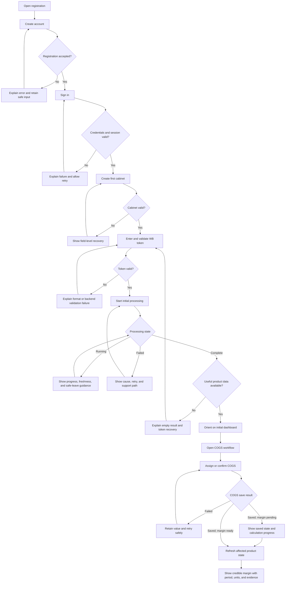
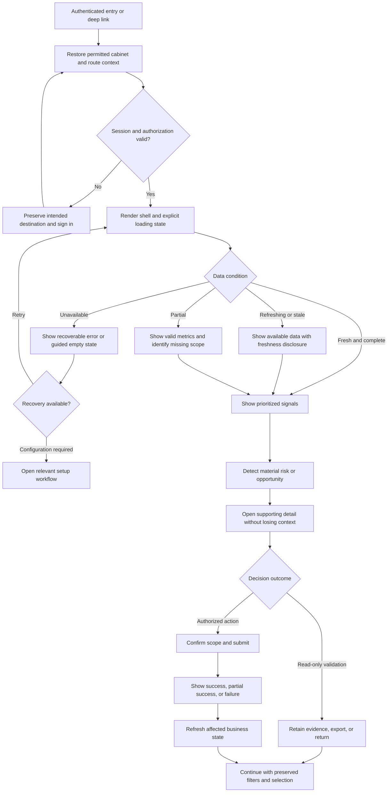
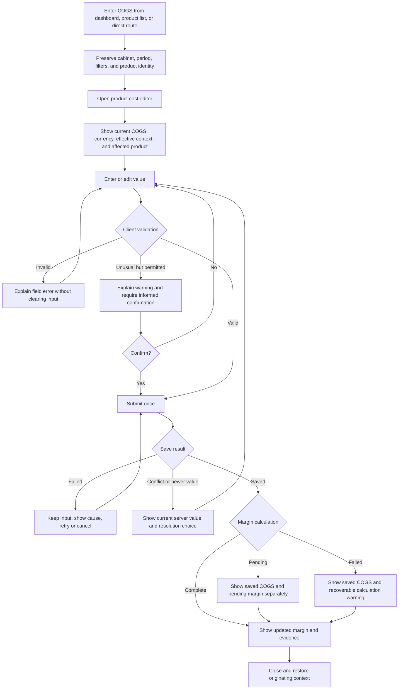
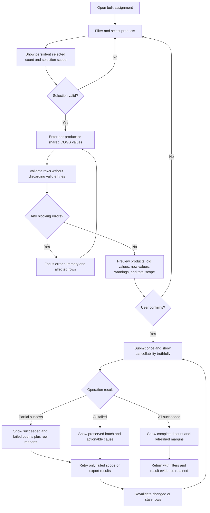
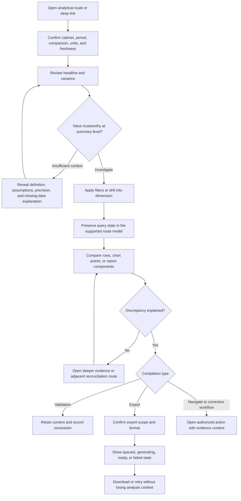
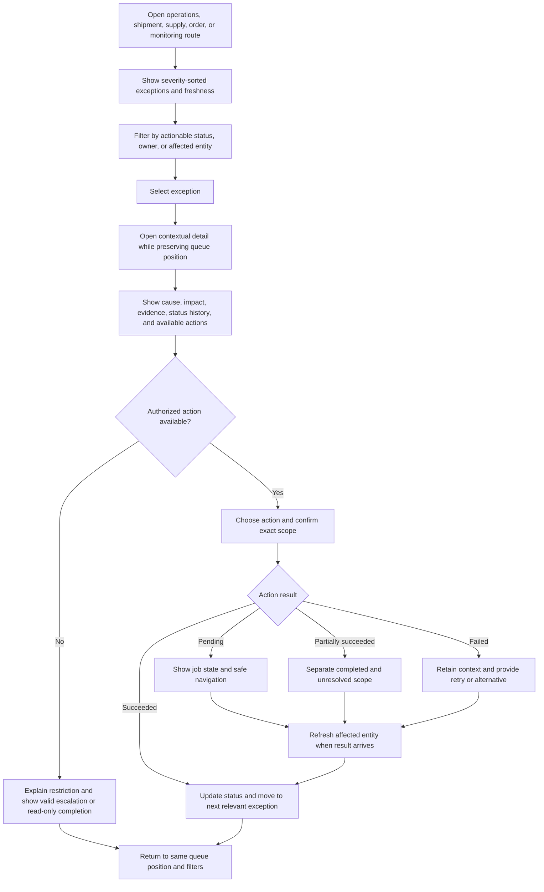

# UX Design Specification frontend

**Author:** R2d2
**Date:** 2026-08-11

---

## Executive Summary

### Project Vision

WB Repricer System Frontend is a data-intensive business management interface for Wildberries sellers. It transforms backend financial, operational, advertising, inventory, fulfillment, and forecasting data into clear decisions for business owners, finance leaders, and operations managers.

The core product experience is a repeatable decision loop: users orient themselves in the current cabinet and period, detect a material risk or opportunity, understand the drivers behind it, take an appropriate action, and verify the outcome. The design-system migration must make this loop faster and more trustworthy without changing established business rules or forcing users to relearn valid workflows.

The frontend is already a substantial brownfield Next.js application rather than a greenfield interface. The objective of this initiative is therefore not to introduce a second visual system or reinstall shadcn/ui from scratch. The objective is to consolidate the existing partial shadcn/ui adoption into one accessible, maintainable, semantically tokenized design system, then migrate every user-facing route and shared surface to that system.

The product must preserve its recognizable red-and-white identity while separating brand, interaction, destructive, financial-status, operational-status, data-availability, and analytical-series colors into explicit semantic roles. The interface must remain data-first: important business metrics must be readable at a glance, dense tables must remain usable, complex filters must be predictable, and every asynchronous operation must communicate its state consistently.

The migration is a design-system consolidation and targeted experience improvement, not a rebrand or an uncontrolled redesign. Existing workflows, information architecture, backend contracts, query behavior, URL behavior, Russian localization, number formatting, financial semantics, and domain logic must remain stable unless an approved Story explicitly changes them.

Success means that every route experience and shared user-facing surface conforms to the approved semantic-token, interaction, accessibility, responsive, and state-management contracts. Approved shadcn primitives and project compositions should be used where they fit. Specialized domain components may remain custom when they preserve semantic HTML, accessibility, established behavior, and the same design contract.

A route is considered migrated only when its page entry, owned component tree, exclusive components, shared surfaces first introduced by that route, dialogs, forms, tables, charts, loading and refresh behavior, empty and error states, responsive behavior, keyboard flow, and supported theme behavior have been reviewed and verified. Migration status must not be inferred from the `page.tsx` file alone.

The application is developed and validated locally, with the frontend running on `localhost:3100` and the backend running on `localhost:3000`. The migration does not include deployment, production infrastructure, or production-platform operations.

### Target Users

#### Business Owner / Entrepreneur

The Business Owner / Entrepreneur is the primary product persona. This user typically manages approximately 50–5,000 Wildberries SKUs and needs an immediate understanding of revenue, profitability, COGS coverage, sales performance, risks, and required actions.

This user is moderately comfortable with web applications but should not need to understand financial-system implementation details. The interface must prioritize concise summaries, recognizable status signals, plain-language explanations, guided corrective actions, and fast drill-down from high-level metrics to affected products.

Typical usage includes daily dashboard checks, weekly cost and pricing work, and periodic analysis of product, category, brand, and advertising performance.

The Business Owner succeeds when the interface makes the most material profitability issue or opportunity understandable without requiring spreadsheet reconstruction.

#### Financial Director / CFO

The Financial Director / CFO is the secondary analytical persona. This user works with larger catalogs and needs trustworthy totals, explicit period comparisons, complete financial breakdowns, traceable calculations, anomaly visibility, and reviewable detail.

This user is comfortable with dense analytical interfaces but requires precision. Ambiguous zeros, missing-data states, misleading percentages, inconsistent status colors, hidden comparison context, or truncated monetary values without access to full precision are unacceptable.

Typical usage includes regular monitoring, detailed analytical review, reconciliation, forecasting, and preparation of management reporting.

The CFO succeeds when every headline can be traced to its period, dimensions, assumptions, units, freshness, and full-precision details.

#### Operations Manager

The Operations Manager is a confirmed third persona with high-frequency operational workflows. This user focuses on inventory availability, stock risks, FBO/FBS order flow, returns, fulfillment, supply planning, storage costs, shipment state, and operational exceptions.

This user needs fast triage rather than financial modeling. Operational warnings must be visible before deep analytics, status labels must be consistent across modules, and tables must preserve their most important identifier, status, metric, and action columns on narrower screens.

Typical usage is daily and action-oriented: identify what is blocked, at risk, late, out of stock, incorrectly configured, or waiting for intervention.

The Operations Manager succeeds when urgent exceptions can be identified, prioritized, and acted on without scanning unrelated financial detail.

#### Persona and Authorization Boundary

Persona lenses influence information priority, density, default widgets, and progressive disclosure. They do not grant authorization and do not replace backend roles or permissions.

Backend roles determine what a user may access or change. Persona selection determines how already-authorized information is prioritized and presented.

#### Shared User Context

The primary targets are desktop and tablet. Mobile remains supported but is secondary for dense analytical workflows.

Across personas, navigation must preserve the active cabinet and make the current period, filters, sort, pagination, comparison basis, data freshness, and reset behavior visible and predictable where applicable.

A displayed zero must be distinguishable from:

- unavailable data;
- not-yet-calculated data;
- filtered-out data;
- stale data;
- genuinely zero data.

Power-user density should be preserved through progressive disclosure, column priority, configurable detail, and drill-down rather than by shrinking text below readable sizes or hiding critical information exclusively in tooltips.

The interface language is Russian. Code, technical documentation, types, logs, and implementation comments remain English. Currency, percentage, date, ISO-week, and compact-number formatting must follow the established Russian-locale conventions.

### Key Design Challenges

#### 1. Consolidating an Existing but Fragmented Design System

The repository already contains shadcn-style primitives and extensive primitive usage, but semantic colors, interaction states, theme behavior, and custom-component conventions remain inconsistent.

The migration must preserve useful local customizations while replacing hardcoded styling and repairing primitive-level drift. A blind shadcn reinitialization or forced overwrite would risk losing existing behavior, domain-specific functionality, and accessibility fixes.

The foundation must establish a single Tailwind v4 CSS-first token source using semantic CSS variables and `@theme inline`. Legacy theme declarations must not remain as a parallel palette source. `components.json` must be aligned with the selected Tailwind v4 configuration model, and representative utilities must be verified in compiled output.

#### 2. Establishing Clear Component Ownership Boundaries

shadcn/ui is the primitive layer, not the complete product architecture.

The component architecture must maintain the following boundaries:

- Generic shadcn primitives remain domain-agnostic and own low-level visual, interaction, and accessibility behavior.
- Product compositions combine primitives into reusable interface patterns without owning backend data access.
- Domain-shared components own reusable domain behavior and terminology.
- Route-owned components retain feature-specific queries, mutations, calculations, navigation, and business rules.

Migration Stories must not move API access or business logic into `components/ui`, and route components must not reimplement behavior already owned by a primitive or shared composition.

The existing `src/components/custom` directory does not need to be reorganized in a single high-conflict mechanical refactor. Logical ownership boundaries take priority over immediate physical renaming.

#### 3. Migrating the Real Experience Surface

The application contains 76 page routes, but most UI behavior lives in route-local components and more than 500 custom components. Treating each `page.tsx` as the entire migration unit would produce misleading completion claims.

A route slice consists of:

- the route entry;
- route-local components;
- exclusive custom components;
- applicable dialogs and forms;
- tables and charts;
- loading, refresh, empty, error, partial, permission, and success states;
- route-specific responsive behavior;
- tests and verification evidence.

Any component consumed by two or more routes is a shared dependency. It must be migrated in a dedicated upstream Story or assigned to one explicit owner Story before dependent route migrations begin.

#### 4. Preserving Analytical Trust

Financial and operational interfaces can become visually consistent while still becoming less trustworthy.

Every migration must preserve:

- cabinet context;
- period context;
- comparison basis;
- currency and units;
- sign conventions;
- full-value access;
- compact-number disclosure;
- zero-versus-missing semantics;
- freshness indicators;
- summary-to-detail traceability;
- query and URL behavior.

A visually improved interface that changes the meaning, precision, traceability, or freshness of displayed data is a regression.

#### 5. Resolving Color and Semantic-State Fragmentation

Current colors are spread across CSS variables, Tailwind configuration, inline styles, palette utilities, chart configurations, and domain-specific status mappings.

The design system must define separate token families for:

- brand identity;
- interactive controls;
- destructive actions;
- positive and negative financial direction;
- operational status;
- warning and information;
- data availability;
- external brands;
- categorical, sequential, and diverging chart series.

Similar visible colors may be used only when their meanings remain unambiguous through labels, icons, signs, patterns, or other non-color indicators.

Brand red is not automatically the correct interactive red. Interactive colors must meet WCAG contrast requirements in their actual foreground/background combinations.

#### 6. Preserving Data Density Without Sacrificing Readability

The frontend includes more than one hundred table-related components, more than fifty chart-related components, dozens of filters and forms, and many operational-status presentations.

The design system must support dense financial data without relying on:

- sub-readable text;
- color-only distinctions;
- uncontrolled horizontal scrolling;
- inconsistent number formatting;
- critical tooltip-only information;
- universal column-hiding rules;
- unstructured collections of near-identical cards.

Responsive behavior must be defined by task priority rather than device width alone. Each dense table requires an explicit primary-column contract, secondary-column behavior, row-detail strategy, and action-accessibility strategy.

#### 7. Standardizing Complex Cross-Route Interactions

Filters, cabinet selection, date and period selection, responsive tables, pagination, sorting, dialogs, bulk actions, charts, status badges, and page states currently use multiple patterns.

These interactions must be standardized without changing backend API contracts, query keys, URL parameters, response interpretation, persisted state, or legitimate domain-specific behavior.

Standardized controls must not unexpectedly reset the active cabinet, period, filter, sort, pagination, selected rows, or deep-link state.

#### 8. Standardizing Asynchronous and Data States

Applicable interfaces must visually and programmatically distinguish:

- initial loading;
- background refresh;
- stale data;
- partial data;
- global empty state;
- filtered-empty state;
- recoverable error;
- permission restriction;
- mutation in progress;
- successful completion;
- partial-success completion;
- failed mutation with retained input.

Skeletons are appropriate for initial structural loading. Existing content should generally remain visible during background refresh.

The absence of a route-level `loading.tsx` or `error.tsx` is a review signal, not automatically a defect. State ownership may legitimately live inside a route or shared component based on recovery behavior.

#### 9. Maintaining Accessibility Across Dense Analytical Interfaces

The consolidated system must provide:

- predictable keyboard navigation;
- visible focus states;
- valid accessible names;
- correct dialog focus trapping and restoration;
- logical heading hierarchy;
- adequate touch targets;
- reduced-motion support;
- non-color status indicators;
- accessible live-region announcements;
- chart summaries or tabular alternatives where applicable.

Russian content must be tested with long labels, large currency values, negative values, percentages, dates, ISO weeks, and truncation with accessible full-value disclosure.

Automated axe and contrast checks are necessary but do not prove that a dense financial workflow is understandable and operable.

#### 10. Preserving AppShell Runtime Invariants

The AppShell migration must preserve:

- authentication redirects;
- protection against pre-hydration content flashes;
- the intended single scroll owner;
- fixed Sidebar and Navbar behavior;
- role-based navigation filtering;
- dynamic navigation badges;
- active-route semantics;
- mobile Sheet close behavior;
- focus return and Escape behavior;
- cabinet context;
- supported theme behavior.

Desktop and mobile navigation must use one canonical navigation model instead of maintaining separate route definitions.

#### 11. Avoiding an Over-Generalized DataTable

The project must distinguish:

- a semantic `Table` primitive;
- a simple responsive composition for static and server-controlled lists;
- an advanced DataTable for genuine client-side sorting, filtering, selection, and column visibility;
- specialized virtualized tables that preserve their existing performance architecture.

An additional table dependency must be justified through a separate dependency decision. Historical architecture documentation alone is not sufficient justification.

#### 12. Delivering Incrementally Without Recreating Drift

The migration is too large for a single all-at-once rewrite.

Foundation and shared Stories must be serialized in this order:

1. Token and compiler contract.
2. Primitive hardening.
3. AppShell and shared navigation.
4. Product-level compositions.
5. Domain-shared components.
6. Independent route slices.
7. Legacy removal.
8. Full migration verification.

Route migrations may run in parallel only when their owned-file sets do not overlap and their shared prerequisites have already been merged.

### Design Opportunities

#### 1. Establish a Semantic Token Contract

A CSS-first Tailwind v4 token layer can become the single source of truth for supported surfaces, interactive states, typography, borders, focus rings, financial direction, operational statuses, data availability, external brands, and chart series.

The contract must document semantic meaning and permitted usage, not only raw values. It must include contrast expectations, supported theme mappings, and rules preventing brand, destructive, financial, operational, and chart semantics from becoming interchangeable.

#### 2. Build a Small Set of High-Value Product Compositions

The migration can reduce page-specific code by standardizing reusable product-level compositions:

- AppShell and responsive Sidebar;
- Navbar and cabinet context;
- PageHeader and Breadcrumbs;
- FilterToolbar;
- date and period selection;
- MetricCard and KPI groups;
- StatusBadge and StatusStrip;
- responsive tables and table controls;
- ChartContainer, ChartLegend, and ChartTooltip;
- EmptyState, ErrorState, and LoadingState;
- form and modal action layouts;
- bulk-action confirmation and partial-result summaries.

Product compositions must remain thin, documented assemblies of primitives. They should standardize repeated interaction behavior without becoming a parallel low-level UI library.

#### 3. Make Analytical Meaning Consistent Across the Product

A unified status and data-visualization contract can give consistent meaning to positive, negative, warning, informational, unavailable, pending, stale, and restricted states across all modules.

Every data-heavy page should identify:

- its headline decision;
- primary metric or status;
- supporting drivers;
- available actions;
- detailed evidence.

Existing audit guidance—clear hero metrics, grouped metric families, and progressive disclosure—should be applied where it supports the route’s task rather than imposed mechanically on every screen.

#### 4. Improve Responsive Data Workflows

Responsive data tables can prioritize identifiers, primary metrics, statuses, and actions while progressively disclosing secondary columns.

Responsive decisions must be documented per table because a universal hide-by-index rule cannot determine which identifier, status, metric, or action matters to the Business Owner, CFO, or Operations Manager.

A table may remain horizontally scrollable, expose row details through a Sheet, or become a compact card layout according to the route’s task and information density.

#### 5. Turn Accessibility Into a Repeatable Quality Gate

Contrast checks, axe scans, keyboard smoke tests, heading checks, reduced-motion validation, realistic Russian-content checks, and route-level visual verification can become part of every migration Story rather than a final remediation phase.

Accessibility verification must combine automated checks with manual interaction scenarios. Automated results alone do not prove that a dense financial workflow is understandable or operable.

#### 6. Use Incremental Migration as a Cleanup Boundary

Each route migration can remove raw controls, duplicate state surfaces, hardcoded colors, outdated styling helpers, and obsolete wrappers within its owned scope.

Legacy removal remains safe because it occurs only after the affected consumers have migrated and the route’s verification evidence has passed.

Custom domain components that remain valid must be documented as approved exceptions instead of being treated as incomplete shadcn adoption.

#### 7. Establish a Route Experience Contract

A reusable route-level checklist can define:

- heading structure;
- current cabinet and period context;
- filter and reset behavior;
- comparison basis;
- data freshness;
- loading and background-refresh behavior;
- empty, filtered-empty, error, restricted, and partial-result semantics;
- primary action placement;
- responsive table behavior;
- keyboard and focus behavior;
- accessible navigation;
- completion feedback;
- supported theme behavior.

This contract will make route migrations consistent without forcing every domain into the same visual layout.

## Core User Experience

### Defining Experience

The defining experience of WB Repricer System is a trusted business-decision loop:

1. Orient in the current cabinet, period, comparison basis, and data-freshness state.
2. Detect the most material risk, anomaly, operational exception, or profitability opportunity.
3. Understand the contributing drivers through progressive drill-down.
4. Decide, navigate to the appropriate workflow, or take an authorized action where applicable without losing analytical context.
5. Confirm that the action succeeded and understand the resulting state.

The most frequent user action is determining what deserves attention now and moving from a summary signal to enough evidence to make a confident decision. The most critical interaction is summary-to-detail-to-action continuity.

For analytical routes, the core sequence is:

`Headline decision → supporting drivers → detailed evidence → available action → result confirmation`

For operational routes, the core sequence is:

`Exception queue → priority and status → affected entity → corrective action → updated status`

For configuration and form routes, the core sequence is:

`Current state → intended change → validation → confirmation where required → saved state → visible outcome`

The migration must strengthen these sequences rather than force every route into one universal layout. A route may use different compositions according to its domain, but every route must make the following clear where applicable:

- Where am I?
- Which cabinet and period am I viewing?
- Is the data current, stale, partial, unavailable, or filtered?
- What is the primary decision or task?
- What evidence supports the conclusion?
- What can I do next?
- Did my action succeed, partially succeed, fail, or remain pending?
- What changed as a result?

Read-only analytical outcomes are valid completions of the loop. A CFO may finish by validating, comparing, reconciling, or exporting information rather than changing application state.

### Platform Strategy

WB Repricer System is a responsive Next.js web application. Desktop is the primary environment for dense analysis, wide tables, bulk actions, charts, and configuration. Tablet is a first-class environment for monitoring, operational triage, filters, prioritized tables, and bounded actions. Mobile is supported as a secondary environment for key metrics, urgent exceptions, compact summaries, deep-linked detail, and simple actions.

Mobile is not required to display every desktop analytical dimension simultaneously. It must preserve the task's primary identifier, metric or status, context, and action while progressively disclosing secondary detail.

Mouse and keyboard are the primary desktop inputs. All product workflows must remain keyboard operable, including navigation, filters, dates, sorting, row selection, pagination, dialogs, Sheets, forms, expandable rows, and chart-adjacent controls.

Touch is a first-class tablet and mobile input. Touch interactions require 44×44 pixel targets for primary controls, adequate separation, no required hover-only behavior, and no destructive action triggered by an ambiguous gesture.

The current delivery environment remains local: frontend on `localhost:3100` and backend on `localhost:3000`. This is a delivery constraint rather than a user-experience characteristic. The UX migration preserves API contracts, authentication headers, cabinet context, query behavior, polling, caching, URL parameters, and backend-driven permissions.

Offline-first behavior is outside scope. Connectivity handling must nevertheless preserve already-rendered data where safe, identify stale information, distinguish network failure from valid empty data, retain non-sensitive form input after recoverable failures, prevent duplicate mutations, and provide bounded retry actions.

Light and dark themes are existing supported behavior and must not regress. Semantic tokens must preserve contrast, hierarchy, focus visibility, state meaning, chart distinction, and financial direction in both themes.

### Effortless Interactions

#### Cabinet and Period Continuity

The active cabinet and applicable period should persist predictably across related routes. Users should not repeatedly select the same context or discover silent resets. Period controls must expose granularity, comparison mode, presets, limits, and reset behavior.

#### Signal-to-Evidence Drill-Down

A metric, warning, status, chart point, or table summary should lead naturally to affected entities or supporting calculations where the product provides that detail. Users should not need to copy identifiers, reconstruct filters, or guess whether detail uses the same period and calculation basis.

#### Filters, Sorting, Pagination, and Selection

Controls must use visible labels, discoverable applied state, explicit reset behavior, accessible sort direction, understandable pagination, and clear selection scope. Bulk selection must distinguish the current page from all filtered results. Filtered-empty results must not look like globally empty data.

#### Financial Formatting

Currency, percentages, dates, ISO weeks, quantities, compact values, and deltas must use shared Russian-locale formatters. Summary values may be compact, but full precision remains accessible. Positive and negative direction must use signs, labels, icons, or wording in addition to color.

#### Loading and Refresh

Initial structural loading uses representative skeletons. Background refresh generally preserves existing content and uses a bounded refresh indicator. Users must distinguish first load, refresh, long-running processing, stale data, partial response, and retry. Mutations prevent duplicate submission.

#### Forms and Validation

Forms use persistent labels, useful helper text, inline validation, clear server-error placement, focus management, preserved safe input after recoverable errors, submitting states, unsaved-change protection for material edits, and explicit confirmation for destructive or high-impact changes.

#### Bulk Operations

Before confirmation, bulk workflows expose affected count, selection scope, intended change, and risk. After completion, they expose attempted, succeeded, and failed counts, actionable failure reasons, and a bounded retry path. Partial success is never presented as full success or full failure.

#### Responsive Tables

Each dense table has an explicit responsive contract. Entity identity, the primary metric or status, and critical actions remain accessible. Secondary columns may collapse, move into row detail or a Sheet, or remain horizontally scrollable according to task priority. There is no universal hide-by-index or table-to-card rule.

#### Status Interpretation

Statuses communicate human-readable meaning, required action, severity where applicable, lifecycle state, and next action. Color reinforces meaning but is never the only indicator.

#### Safe Defaults and Automation

The interface automatically handles formatting, semantic status mapping, focus restoration, safe query refresh, submission disabling, cabinet propagation, sensible period presets, and accessible result announcements. Automation should feel dependable rather than magical: it may remove repetitive interface work, but it keeps financial inputs, calculation state, data freshness, and consequential outcomes visible and explainable. It never silently performs destructive work.

### Critical Success Moments

#### First-Time Value Flow

The first make-or-break sequence is:

`registration → cabinet creation → WB token validation → initial processing → first useful data → COGS assignment → calculated margin`

The user must always understand the current step, what the system is doing, whether it is safe to leave and return, how to recover, and what becomes possible after success. The first strong value moment occurs when COGS produces a credible margin result for a real product without spreadsheet reconstruction.

#### First Trusted Dashboard

After onboarding and processing, the user sees the expected cabinet, period, processing state, most important signal, trust limitations such as missing COGS, and an appropriate next action. This is the first moment the product must feel more useful than a spreadsheet.

#### Returning-User Orientation

A returning user should be able to identify the active cabinet and period, data freshness and completeness, material changes or exceptions, the most relevant signal for the current persona, and the path to supporting evidence without scanning the entire product. Persona emphasis must not create three disconnected applications: navigation, terminology, semantics, and user-overridable preferences remain shared.

#### First Traceable Insight

A user moves from a headline metric, warning, or anomaly to the affected products, periods, costs, campaigns, orders, or operational events without reconstructing the calculation manually.

#### First Successful COGS Assignment

The user assigns COGS with clear validation, in-progress state, save confirmation, and visible recalculation or pending-calculation state. Saving COGS while margin remains pending is presented as partial completion.

#### First Confident Bulk Action

The user understands selection scope and consequences, previews the change, confirms it, and receives a trustworthy result summary. Successful items remain successful while failed items remain identifiable and retryable.

#### First Operational Resolution

The Operations Manager identifies an urgent exception, opens the affected entity, performs a corrective action, and sees updated status without losing context.

#### First Financial Verification

The CFO traces a headline value to its period, comparison basis, component values, assumptions, precision, freshness, and supporting detail.

#### Recovery From Failure

After a network, validation, backend, or partial-data failure, the user understands what failed, whether anything was saved, what can be retried, and whether existing data remains usable. A failure must not masquerade as empty data.

#### Migration Without Workflow Regression

An existing user completes the same valid task on a migrated route without relearning it, while benefiting from clearer hierarchy, consistent controls, stronger accessibility, and improved responsive behavior.

### Experience Principles

1. **Decision Before Decoration:** prioritize the decision, task, or exception the user came to address.
2. **Context Is Part of the Data:** cabinet, period, comparison, filters, units, freshness, and availability shape meaning.
3. **Summary Must Lead to Evidence:** headlines and statuses lead to supporting drivers and affected entities where detail exists.
4. **Preserve Valid Behavior:** migration does not alter contracts, calculations, URLs, permissions, queries, or workflows without an approved requirement.
5. **Use shadcn as a Foundation, Not a Goal:** approved primitives and compositions serve experience consistency; valid specialized components may remain custom.
6. **Make State Explicit:** loading, refresh, stale, partial, empty, filtered-empty, error, restricted, success, and partial success are distinct.
7. **Dense Does Not Mean Illegible:** preserve analytical power through hierarchy, progressive disclosure, column priority, and drill-down.
8. **Responsive Means Task-Preserving:** preserve primary identity, metric or status, context, and action at every supported width.
9. **Accessibility Is Interaction Quality:** keyboard, focus, naming, contrast, motion, non-color indicators, and announcements are correct behavior.
10. **Actions Need Trustworthy Closure:** every mutation exposes its final, partial, failed, or pending state.
11. **Automation Handles Repetition, Not Judgment:** automate safe presentation and state propagation without hiding decisions.
12. **One Product, Shared Meaning:** the same semantic state and interaction mean the same thing across routes unless domain differences are deliberate and documented.

## Desired Emotional Response

### Primary Emotional Goals

The primary emotional goal is **calm control grounded in trust**. Users should feel that the product understands the operational and financial complexity of their Wildberries business and is presenting it without hiding uncertainty or creating unnecessary alarm.

Supporting emotional goals are:

- **Confidence:** values, periods, units, states, and actions are understandable and traceable.
- **Focus:** the interface highlights what matters now without turning every metric into an urgent alert.
- **Efficiency:** common analysis and operational work proceeds without repetitive context setup.
- **Accomplishment:** completed actions have visible, trustworthy closure.
- **Safety:** destructive, bulk, or financially important actions communicate scope and consequences.
- **Continuity:** returning users recognize the same product patterns across every domain.

The product should not aim for novelty-driven surprise. Delight comes from removing spreadsheet reconstruction, preserving context, exposing a useful answer quickly, and recovering gracefully when data or services fail.

### Emotional Journey Mapping

#### First Discovery and Onboarding

Users should feel guided rather than tested. Cabinet creation, token setup, and initial processing should communicate why each step matters, what is happening, how long it may take, and whether the user can safely leave and return.

#### First Dashboard

Users should feel oriented and reassured: this is the expected cabinet, this is the active period, this is the freshness and completeness of the data, and this is the most useful next action.

#### Routine Monitoring

Returning users should feel fast and focused. Familiar hierarchy, preserved context, consistent statuses, and stable formatting reduce the mental cost of daily review.

#### Deep Analysis

Users should feel curious but not lost. Progressive disclosure, comparison context, traceability, and clear return paths allow exploration without sacrificing orientation.

#### Configuration and Mutation

Before an action, users should feel informed about scope. During an action, they should feel protected from duplicate submission. After an action, they should feel certain about success, partial success, failure, or pending downstream work.

#### Failure and Recovery

When something goes wrong, users should feel informed and capable rather than blamed or trapped. The interface should preserve safe work, distinguish what failed from what succeeded, and provide a bounded recovery path.

#### Return Usage

Users should feel continuity. Cabinet, theme, and applicable preferences behave predictably; migrated routes do not feel like unrelated applications.

### Micro-Emotions

The most important positive micro-emotions are:

- confidence instead of confusion;
- trust instead of skepticism;
- focus instead of cognitive overload;
- safety instead of mutation anxiety;
- progress instead of waiting uncertainty;
- accomplishment instead of ambiguous completion;
- curiosity instead of fear of losing context;
- recognition instead of relearning.

The design must actively avoid:

- alarm fatigue from excessive red or warning styling;
- false confidence caused by missing context or precision;
- frustration caused by silent filter or period resets;
- anxiety caused by unclear bulk scope;
- skepticism caused by contradictory statuses or colors;
- helplessness caused by generic errors without recovery;
- disorientation caused by inconsistent navigation and page hierarchy;
- distrust caused by presenting missing, pending, or stale data as zero or current.

### Design Implications

- **Calm control →** strong hierarchy, restrained use of emphasis, one clear primary task, and progressive disclosure.
- **Trust →** visible cabinet, period, units, freshness, availability, precision access, and summary-to-detail traceability.
- **Confidence →** consistent semantic tokens, shared status language, predictable controls, and explicit result states.
- **Focus →** grouped metrics, prioritized tables, meaningful whitespace, and warnings reserved for actionable conditions.
- **Safety →** visible action scope, validation, confirmation for high-impact work, disabled duplicate submission, and partial-result reporting.
- **Accomplishment →** immediate but honest feedback that distinguishes saved, recalculating, partially complete, and complete states.
- **Continuity →** shared AppShell, navigation, page hierarchy, filters, date controls, state surfaces, and responsive behavior.
- **Recovery →** retained safe input, usable existing data during refresh failures, precise error language, retry scope, and focus restoration.

Motion should clarify state changes rather than decorate them. Reduced-motion preferences are respected. Financially negative data may use semantic emphasis, but the overall page should not become emotionally aggressive.

### Emotional Design Principles

1. **Reassure with evidence, not empty optimism.** Trust comes from context, traceability, and honest state communication.
2. **Reserve urgency for actionable urgency.** Red and warning treatments must not create alarm fatigue.
3. **Never surprise users with scope.** Bulk, destructive, or high-impact actions expose affected entities and consequences.
4. **Make progress observable.** Long-running work communicates current stage, pending work, and safe next steps.
5. **Make completion unambiguous.** Success, partial success, failure, and downstream pending work remain distinct.
6. **Preserve orientation during exploration.** Drill-down retains cabinet, period, filters, and a clear return path where applicable.
7. **Treat recovery as a core experience.** Errors preserve safe work and provide actionable recovery rather than generic blame.
8. **Prefer quiet consistency over novelty.** Familiar shared patterns reduce cognitive load across 76 routes.

## UX Pattern Analysis & Inspiration

### Inspiring Products Analysis

The migration uses external products as pattern references rather than visual templates. WB Repricer retains its own red-and-white identity, Russian content, marketplace workflows, and domain semantics.

#### Stripe Dashboard

Stripe is a useful reference for financial traceability and progressive detail. High-level values remain connected to transactions, periods, filters, and status. The transferable lesson is that financial confidence comes from clear context, stable formatting, and a predictable path from summary to evidence—not from maximizing the number of cards on a screen.

Relevant patterns include restrained surface hierarchy, explicit status language, action placement close to affected entities, and consistent filtering across data-heavy views.

#### Linear

Linear is a useful reference for dense but calm interaction design. It demonstrates how consistent shortcuts, focus behavior, compact controls, predictable states, and low-noise visual hierarchy can support high-frequency work.

The transferable lesson is not to imitate Linear's visual identity, but to make recurring interactions behave the same everywhere. For WB Repricer, this applies to filters, selection, dialogs, Sheets, status changes, and navigation.

#### Grafana

Grafana is a useful reference for analytical dashboards, time context, drill-down, and operational status. It demonstrates the importance of visible time ranges, refresh state, dashboard hierarchy, and explicit alert semantics.

The transferable lesson is to keep time and freshness context attached to analytical meaning while avoiding uncontrolled dashboard density and color proliferation.

#### Existing WB Repricer Dashboard Improvements

The repository's approved persona-dashboard and readability work is the closest product-specific inspiration. It already establishes valuable patterns:

- persona-informed information priority without changing authorization;
- a three-tier hierarchy from hero metrics to operational and analytical detail;
- progressive disclosure for heavy analytics;
- one canonical COGS coverage surface;
- compact summary values with full precision available;
- explicit table-column priority;
- non-color indicators for financial direction;
- consistent heading hierarchy;
- loading, empty, and error separation.

These patterns should be generalized carefully where they support a route's task, not copied mechanically into every page.

### Transferable UX Patterns

#### Navigation Patterns

- One stable AppShell with a canonical desktop/mobile navigation model.
- Clear active-route indication and page hierarchy.
- Breadcrumbs for deep detail routes rather than every shallow route.
- Preserved cabinet and applicable period context across related navigation.
- Deep links that remain understandable when opened directly.

#### Interaction Patterns

- Summary-to-detail drill-down with retained context.
- Filter toolbars with visible applied state and explicit reset.
- Progressive disclosure for secondary analytical detail.
- Inline validation paired with server-result feedback.
- Preview and partial-result summaries for bulk operations.
- Background refresh that preserves already-visible data.
- Sheets for narrow-screen secondary detail when they preserve task continuity.
- Dialogs reserved for focused decisions, confirmation, or bounded forms.

#### Visual Patterns

- Quiet white and neutral surfaces with red reserved for brand and deliberate interaction emphasis.
- One primary visual decision per route or major section.
- Grouped metric families instead of repetitive independent cards.
- Semantic status badges with text or icons in addition to color.
- Tabular numerals and aligned financial values.
- Shared chart grids, axes, legends, and tooltip treatment.
- Clear hierarchy through typography and spacing before shadow and color.

#### State Patterns

- Structural skeletons for first load.
- Bounded refresh indicators for background fetches.
- Separate global-empty and filtered-empty states.
- Precise unavailable, pending, stale, restricted, and partial-data states.
- Action feedback that distinguishes saved, recalculating, partial, and complete outcomes.

### Anti-Patterns to Avoid

- Reinstalling or force-overwriting existing shadcn components.
- Treating a shadcn import count as migration completion.
- Replacing valid specialized components solely for visual uniformity.
- Applying one universal page template to unrelated domains.
- Building a second low-level component library inside product compositions.
- Using brand red for every action, error, negative value, and chart series.
- Excessive red surfaces that create alarm fatigue.
- Card grids where a table, list, or status strip communicates relationships better.
- Hiding critical context only in tooltips.
- Resetting cabinet, period, filters, sort, or pagination without an explicit reason.
- Replacing visible content with a full skeleton during background refresh.
- Treating no data, filtered data, failed data, and zero data as the same state.
- Universal responsive column hiding based on index rather than task priority.
- Making desktop-only hover interaction necessary for chart or table comprehension.
- Introducing a large generic DataTable abstraction before confirming shared behavior.
- Moving business logic or API access into `components/ui`.
- Performing unrelated directory reorganizations during route migration.
- Using animation to decorate financial data or delay task completion.

### Design Inspiration Strategy

#### Adopt

- Stripe-like traceability from summary to detailed evidence.
- Linear-like consistency for repeated controls, keyboard behavior, and action feedback.
- Grafana-like visibility of time range, freshness, and operational state.
- Existing WB Repricer hierarchy, persona, readability, and responsive-column improvements.
- Current shadcn/Radix accessibility behavior where it is already correct.

#### Adapt

- Analytical density to Russian labels, large RUB values, marketplace statuses, and desktop/tablet workflows.
- Progressive disclosure to each route's actual decision rather than a universal dashboard structure.
- Sheets, dialogs, and responsive tables according to route-specific task priority.
- Red-and-white branding through semantic tokens that preserve contrast and distinguish brand from risk.

#### Avoid

- Visual imitation of another product.
- Competitor features not supported by current product requirements or backend contracts.
- Novel interaction patterns that make existing users relearn valid workflows.
- Additional dependencies when existing shadcn primitives and compositions are sufficient.
- Design choices that optimize screenshots while weakening real data trust, keyboard use, or narrow-width operation.

## Design System Foundation

### 1.1 Design System Choice

The approved foundation is the repository's existing local **shadcn/ui architecture**, using:

- shadcn/ui components owned in the repository;
- Radix UI primitives for accessible interactive behavior;
- Tailwind CSS v4 for styling;
- semantic CSS variables and `@theme inline` for tokens;
- class-variant-authority for controlled component variants;
- `tailwind-merge` and the existing `cn()` utility;
- Lucide React for the shared icon language;
- Sonner for transient action notifications;
- Recharts adapted through a project chart composition rather than replaced.

The existing `new-york` style remains the baseline. This is a consolidation and hardening of an installed system, not a new installation.

### Rationale for Selection

shadcn/ui is already materially integrated:

- `components.json` is configured;
- 28 primitives exist in `src/components/ui`;
- hundreds of production files already import local primitives;
- Radix packages, CVA, Lucide, React Hook Form, Command, Sonner, `next-themes`, and Tailwind v4 are installed;
- existing tests and product components already depend on local customizations.

A forced reinitialization would create high regression risk and overwrite useful accessibility and behavior changes. Adopting a second established component system would add visual and runtime duplication. Building a new low-level design system would repeat capabilities already present.

The local-copy architecture is appropriate because it provides:

- direct ownership of component source;
- accessible behavior through Radix;
- compatibility with the red-and-white product identity;
- incremental brownfield migration;
- controlled variants and semantic tokens;
- no runtime dependency on a remote UI package;
- freedom to retain specialized domain components.

### Implementation Approach

#### Foundation Phase

1. Establish one Tailwind v4 CSS-first compiler and token path.
2. Align `components.json` with the selected Tailwind v4 configuration model.
3. Reconcile `#E53935` documentation/config values with the current accessible `#C62828` interactive token.
4. Define semantic light and dark tokens and compiled-style probes.
5. Audit and harden all existing primitives without force-overwriting them.
6. Add missing primitives only when required by approved compositions or route Stories.

#### Component Layers

- **Tokens:** semantic visual values and permitted usage.
- **Primitives (`src/components/ui`):** generic, domain-agnostic interaction and accessibility behavior.
- **Product compositions:** reusable AppShell, header, filter, metric, status, table, chart, state, and form patterns.
- **Domain-shared components:** reusable business concepts with no route-exclusive assumptions.
- **Route slices:** feature data, business behavior, navigation, and complete route states.

#### Existing Primitive Hardening

The foundation audit must cover the existing primitives, including Button, Card, Input, Select, Dialog, Sheet, DropdownMenu, Popover, Tooltip, Table, Tabs, Form, Alert, Badge, Skeleton, Progress, Calendar, Command, and Sonner.

Hardcoded `bg-white`, `text-gray-*`, hover palettes, and inline colors inside primitives must be replaced with semantic tokens. Radix focus, keyboard, portal, layering, accessible naming, and focus-restoration behavior must be preserved.

#### Missing Primitive and Composition Decisions

Candidate generic primitives:

- Breadcrumb;
- Pagination;
- Accordion;
- Toggle and ToggleGroup;
- Avatar;
- ScrollArea;
- Resizable where a verified workflow requires it.

Candidate product compositions:

- Combobox from Command + Popover;
- DatePicker and period picker from Calendar + Popover;
- ResponsiveTable and table controls from Table;
- chart wrapper around Recharts;
- Sidebar/AppShell composition;
- FilterToolbar;
- PageHeader;
- MetricCard;
- StatusBadge and StatusStrip;
- shared Loading, Empty, Error, Restricted, Stale, and Partial states.

Drawer is not added automatically when Sheet already satisfies the interaction. An advanced DataTable or TanStack Table dependency requires a separate decision based on real client-side behavior. Virtualized tables preserve their specialized architecture.

#### Migration Sequence

The design-system migration proceeds through dependency-ordered Stories:

1. compiler and tokens;
2. primitive hardening;
3. AppShell and navigation;
4. shared product compositions;
5. domain-shared components;
6. independent route slices;
7. legacy removal;
8. full-system verification.

No route Story may silently expand into shared-token, primitive, or AppShell ownership.

### Customization Strategy

#### Product Identity

The product retains a white-surface, red-identity visual language. Decorative brand red may remain `#E53935`, while interactive primary uses a darker WCAG-compliant red where white foreground text requires it. Hover and pressed states use a darker accessible token. Light red is reserved for subtle emphasis and selected surfaces.

Primary, destructive, negative-financial, operational-error, and categorical-chart red are documented as separate semantic roles even when values are visually related.

#### Semantic Palette

The canonical system includes:

- brand and interactive red families;
- neutral surface and text hierarchy;
- positive/success green;
- negative financial and destructive red;
- warning amber;
- information blue;
- data-availability neutral states;
- analytics purple and additional categorical series;
- Telegram external-brand blue;
- light and dark theme mappings.

Raw hex values and palette utilities are permitted only in registered token definitions or documented external-brand and visualization exceptions.

#### Component Variants

Variants represent semantic purpose rather than page-specific appearance. Button, Badge, Alert, status, and surface variants must have named meanings, documented foreground/background combinations, and tested interactive states.

Route code should prefer composition props and semantic variants over long repeated class strings. Product compositions remain thin and must not become a second primitive library.

#### Accessibility and Verification

Customization must preserve Radix accessibility behavior and prove:

- keyboard operation;
- visible focus;
- accessible names and descriptions;
- dialog and Sheet focus lifecycle;
- non-color state indicators;
- WCAG AA contrast in supported themes;
- reduced-motion behavior;
- 44×44 touch targets for primary mobile controls;
- realistic Russian labels and financial values.

Foundation completion requires lint, type-check, targeted tests, production build, compiled token probes, contrast checks, and representative visual verification.

## Defining Core Experience

### 2.1 Defining Experience

The defining experience is **turning a trustworthy business signal into a confident next decision without reconstructing the analysis manually**.

Users should describe the product as the place where they can see what materially changed, understand why, inspect the affected products or operations, and decide or act with the relevant context intact.

The defining value is not a single dashboard gesture. It is the consistent movement:

`signal → context → drivers → evidence → decision or action → verified outcome`

This interaction must work for read-only conclusions, exports, reconciliation, navigation to another workflow, and authorized mutations. Not every useful analysis ends with changing application state.

### 2.2 User Mental Model

Users arrive with a spreadsheet and marketplace-report mental model:

- rows represent products, orders, supplies, shipments, campaigns, or periods;
- columns represent measures and calculated outcomes;
- filters define the subset being analyzed;
- totals and summary cards are expected to reconcile with detail;
- periods and cabinet identity determine meaning;
- positive and negative direction require domain interpretation;
- a calculation is trusted only when its inputs and assumptions are visible.

Existing workarounds include downloading reports, copying identifiers, joining data between sheets, maintaining separate COGS tables, applying manual formulas, and comparing periods by hand.

The product should preserve the useful familiarity of tables, filters, explicit formulas, and traceable totals while eliminating repetitive assembly. It must not imitate a spreadsheet so literally that hierarchy, guided action, status, accessibility, and responsive use are lost.

Likely confusion occurs when:

- cabinet or period context is hidden;
- summary and detail appear to disagree;
- missing or pending data looks like zero;
- status terminology changes between routes;
- a filter remains applied but is not visible;
- a compact value hides material precision;
- bulk selection scope is unclear;
- an action completes but downstream calculations remain pending;
- route migration changes familiar control behavior without user value.

### 2.3 Success Criteria

The defining experience succeeds when:

- the active cabinet, applicable period, comparison basis, and freshness are visible or immediately discoverable;
- the route exposes one clear primary decision, task, or exception;
- headline values preserve units, direction, availability, and access to full precision;
- summaries lead to supporting drivers and affected entities where detail exists;
- navigation to detail preserves relevant filter and period context;
- read-only validation or export is treated as a valid completion;
- authorized actions expose scope and consequences before execution;
- mutation feedback distinguishes success, partial success, failure, and pending downstream work;
- background refresh does not unnecessarily remove usable content;
- recoverable errors retain safe state and offer one clear next step;
- keyboard and touch users can complete the same primary workflow;
- narrow layouts preserve the primary identifier, metric or status, and action;
- Russian labels and realistic financial values remain readable;
- the migrated experience preserves backend contracts, calculations, queries, URL behavior, and permissions.

Route-level verification must exercise representative Owner, CFO, and Operations tasks where the route serves those personas. Completion evidence includes state coverage, responsive checks, keyboard flow, accessibility scans, targeted tests, and visual comparison.

### 2.4 Novel UX Patterns

The product does not require a novel interaction language. It should use established patterns users already understand:

- persistent application navigation;
- page headers and breadcrumbs;
- metric summaries;
- filters and period selectors;
- sortable and selectable tables;
- charts with accessible supporting information;
- dialogs, Sheets, and confirmation flows;
- inline form validation;
- progress, loading, empty, and error states;
- toasts and inline result summaries.

The differentiating combination is domain-specific rather than mechanically novel:

- Wildberries financial and operational semantics;
- COGS-to-margin continuity;
- persona-aware information emphasis;
- summary-to-evidence traceability;
- consistent zero, missing, stale, partial, and pending semantics;
- shared context across many analytical and operational routes.

Any new pattern must be teachable through familiar controls, require no hidden gesture, remain keyboard operable, and demonstrate a concrete improvement over an existing pattern.

### 2.5 Experience Mechanics

#### 1. Initiation

The user enters through the Dashboard, a domain route, a navigation item, an alert, or a deep link. The route establishes page identity, cabinet, period where applicable, freshness, and primary task before presenting secondary detail.

For returning users, the first viewport communicates what changed or requires attention. For first-time users, the interface provides the next required setup or data-completeness action.

#### 2. Interaction

The user filters, compares, sorts, searches, selects, expands, or drills down using shared controls. The system preserves applicable context and exposes applied state.

When the user reaches evidence, they may:

- validate the result;
- compare another period or dimension;
- export or reconcile information;
- navigate to an affected entity;
- correct COGS or configuration;
- perform an authorized operational or bulk action.

#### 3. Feedback

The interface communicates immediate control state, validation, loading, refresh, stale data, partial results, restrictions, and calculation progress. Feedback stays close to the affected surface and uses live announcements where appropriate.

Errors explain what failed, whether any work succeeded, what input remains safe, and the next recovery action. The system does not replace a recoverable error with a misleading empty state.

#### 4. Completion

Completion is explicit:

- a read-only conclusion retains the evidence and context;
- an export exposes creation and download status;
- a saved change appears in the affected entity;
- a downstream calculation is marked complete or pending;
- a bulk operation exposes attempted, succeeded, and failed results;
- a user can continue, retry the failed scope, return to the prior context, or navigate to the next relevant workflow.

The core loop is complete only when the user understands both the outcome and its current business state.

## Visual Design Foundation

### Color System

#### Color Architecture

Color is organized by semantic role rather than by raw palette name. The system distinguishes:

- product brand;
- interactive primary;
- destructive action;
- positive and negative financial direction;
- operational status;
- warning and information;
- data availability;
- external brand;
- categorical, sequential, and diverging visualization series.

The Tailwind v4 foundation exposes semantic utilities from CSS variables through `@theme inline`. Components consume semantic tokens instead of hex values or generic palette utilities.

#### Red Identity

- **Brand red:** `#E53935`. Used for brand marks, decorative identity, large display accents, and non-text emphasis where contrast permits.
- **Interactive primary:** `#C62828`. Used for filled primary actions with white foreground. Contrast with white is approximately `5.62:1`.
- **Interactive hover/pressed:** `#A31515`. Contrast with white is approximately `7.85:1`.
- **Subtle primary surface:** `#FFCDD2` or a theme-equivalent low-emphasis token with dark readable foreground.

`#E53935` has approximately `4.23:1` contrast with white and therefore is not the canonical filled control background for normal white text. It may be used for large text or non-text brand treatment after context-specific verification.

#### Semantic Direction and Status

The current analytics palette remains recognizable but is converted into role-based pairs:

- positive/success base reference: `#22C55E`;
- negative base reference: `#EF4444`;
- information base reference: `#3B82F6`;
- warning base reference: `#F59E0B`;
- analytics purple reference: `#7C4DFF` with a consolidated token family;
- Telegram external brand: `#0088CC`.

Bright base colors are not automatically used as text or filled backgrounds with white text. Accessible dark foreground tokens are required for text on light surfaces, while light subtle surfaces use dark semantic foregrounds. For example, negative, success, warning, and information text tokens must meet `4.5:1` against their actual surface.

Destructive action is distinct from interactive primary and negative financial direction. A destructive control communicates irreversible or high-risk behavior; a negative financial value communicates business direction; brand red communicates identity.

#### Neutral System

The canonical neutral system is semantic:

- page background;
- primary surface;
- elevated surface;
- muted surface;
- primary foreground;
- secondary foreground;
- muted foreground;
- border;
- input border;
- disabled surface and foreground;
- focus ring.

The existing gray numbering drift is not preserved as a second semantic model. Legacy `gray-*` classes are mapped deliberately during route migration rather than replaced mechanically by index.

#### Chart Color System

Charts use registered semantic series tokens:

- categorical series for distinct unrelated dimensions;
- sequential series for magnitude;
- diverging series for positive/negative direction;
- reference, target, forecast, and confidence-band tokens;
- grid, axis, tick, tooltip, and selection tokens.

Chart palettes must remain distinguishable in both themes, avoid using brand red for every primary series, and preserve meaning outside color through legends, labels, signs, shapes, or accessible summaries.

### Typography System

The product uses a high-performance system sans-serif stack:

`-apple-system, BlinkMacSystemFont, "Segoe UI", Roboto, "Helvetica Neue", Arial, sans-serif`

No additional font dependency is required. The tone is professional, modern, calm, and highly readable.

#### Type Scale

- Page title: `28–32px`, weight `700`, compact line height.
- Section title: `22–24px`, weight `600–700`.
- Subsection title: `18–20px`, weight `600`.
- Card or group title: `16px`, weight `600`.
- Body: `14–16px`, line height `1.45–1.6`.
- Secondary text: `13–14px`, readable muted foreground.
- Dense metadata: minimum `12px`, line height at least `16px`.
- Primary metric: responsive `28–40px`, weight `650–700`.
- Secondary metric: `20–28px`, weight `600–700`.

Text below `12px` is not used for ordinary information. Dense visualization labels at the lower boundary require accessible disclosure and must not become the only source of meaning.

Financial and tabular values use `font-variant-numeric: tabular-nums` where alignment improves comparison. Currency signs, percent signs, negative signs, units, and compact suffixes remain visible and consistent.

Heading levels follow document structure rather than visual size. One runtime page title is followed by logical section and subsection headings. Card-title components do not automatically become headings unless they participate in the route outline.

### Spacing & Layout Foundation

#### Spacing Scale

The base unit remains `4px`, using the established scale:

`4, 8, 12, 16, 20, 24, 32, 40, 48, 64, 80, 96`

Spacing expresses semantic relationships:

- `4–8px`: icon/text and tightly related metadata;
- `8–12px`: control internals and compact row groups;
- `12–16px`: field groups and card internals;
- `20–24px`: card padding and related sections;
- `32–48px`: major page sections;
- `64px+`: exceptional page-level separation, not routine dashboard spacing.

#### Density Strategy

The interface uses controlled density rather than one universal spacing mode:

- **Comfortable:** onboarding, auth, forms, empty states, focused settings.
- **Standard:** dashboards, cards, filters, operational lists.
- **Dense:** financial tables, reconciliation, model evaluation, and data-heavy comparison.

Dense mode reduces whitespace carefully but does not reduce body text below the readability floor, shrink touch targets, or hide required context.

#### Page Layout

- AppShell owns global navigation, header, viewport, and intended scroll behavior.
- PageHeader establishes route title, description, breadcrumbs where useful, primary action, and applicable context.
- Analytical routes may use the available content width; long prose and narrow forms use constrained readable widths.
- A responsive grid supports metric and content grouping, but domains are not forced into identical column layouts.
- Major surfaces align to shared horizontal gutters and vertical rhythm.
- Tables and charts receive width according to the task, not an arbitrary card grid.

#### Responsive Breakpoints

Tailwind breakpoints remain the implementation basis, but behavior is task-driven:

- narrow mobile: one primary content flow and progressive detail;
- wide mobile/tablet: selected multi-column groups and prioritized tables;
- desktop: persistent navigation and full analytical workspace;
- large desktop: expanded evidence without stretching readable prose excessively.

#### Shape and Elevation

- Standard radius derives from the shared `--radius` token.
- Controls use consistent small/medium radii.
- Cards and dialogs use medium/large radii without excessive pill styling.
- Borders provide the primary surface separation.
- Shadows are restrained and reserved for elevation, popovers, menus, dialogs, and meaningful interactive lift.
- Color and shadow are not used to compensate for weak information hierarchy.

### Accessibility Considerations

- Normal text targets at least `4.5:1` contrast; large text and non-text UI follow applicable WCAG AA thresholds.
- Contrast is tested for default, hover, pressed, focus, disabled, destructive, and semantic states in both themes.
- Focus rings remain clearly visible against every supported surface.
- Color is never the only carrier of direction, severity, availability, or completion.
- Touch targets for primary mobile interactions are at least 44×44 pixels.
- Typography supports browser zoom and does not rely on fixed-height text containers.
- Layout remains usable at 200% zoom and narrow reflow for critical workflows.
- Reduced-motion preferences disable non-essential motion while retaining state clarity.
- Charts provide legends, accessible descriptions, and data alternatives where needed.
- Long Russian labels, large RUB values, negative values, percentages, dates, and ISO weeks are included in visual verification.
- Automated token contrast checks and compiled-style probes are part of the foundation acceptance criteria.

## Design Direction Decision

### Design Directions Explored

Six complementary directions were explored in the interactive [UX Design Directions Showcase](./ux-design-directions.html):

1. **Calm Command Center** — a stable application shell, clear page hierarchy, restrained surfaces, explicit context, and progressive disclosure.
2. **Financial Dense Workspace** — compact analytical controls, tabular precision, comparison context, and high information density for finance workflows.
3. **Operations Triage** — exception-first prioritization, actionable status queues, visible severity, and rapid recovery paths.
4. **Executive Minimal** — a restrained owner overview with one dominant business signal, supporting evidence, and limited high-value actions.
5. **Modular Analytics** — metric-family grouping, comparison-friendly cards and charts, and progressive drill-down from summary to evidence.
6. **Contextual Split View** — a list-to-detail workspace that preserves selection and context for campaigns, models, shipments, supplies, and other entity-heavy workflows.

The exploration confirmed that one universal page composition would not serve the full product. The application spans executive orientation, financial reconciliation, operational triage, analytical comparison, forms, settings, and entity-detail workflows. Visual consistency must therefore come from shared tokens, primitives, compositions, interaction contracts, and AppShell behavior rather than from forcing every route into the same layout.

### Chosen Direction

The chosen direction is **Adaptive Calm Command Center**.

It combines the six explored directions according to task and persona:

- Calm Command Center is the shared AppShell, navigation, page hierarchy, context, status, and surface foundation.
- Financial Dense Workspace supplies the density, precision, comparison controls, and table behavior for CFO and reconciliation routes.
- Operations Triage supplies exception-first hierarchy, severity cues, queue behavior, and recovery actions for operational routes.
- Executive Minimal supplies the restrained hero treatment for the Business Owner overview only; it is not the default for dense analytical pages.
- Modular Analytics supplies metric-family grouping and summary-to-evidence drill-down for analytical routes.
- Contextual Split View supplies list-detail continuity for campaign, model, shipment, supply, and similar entity-focused experiences.

The direction preserves one product identity, one navigation model, and one terminology system. Persona lenses may change emphasis, density, disclosure, and default widget priority, but they must not create disconnected applications or alter authorization.

### Design Rationale

Adaptive Calm Command Center supports the defining product loop: orient, detect, understand, decide or act, and verify.

The calm shared shell reduces navigation and context-management effort. Domain-specific workspaces then expose the information density and interaction model appropriate to the task. This balance prevents both extremes: an oversimplified dashboard that hides evidence and a uniformly dense interface that forces every user to scan irrelevant detail.

The direction also fits the brownfield migration constraint. Existing business workflows, route structure, backend contracts, analytical semantics, and specialized tables or charts can remain intact while their presentation moves toward a shared semantic-token and shadcn-based component contract.

Key reasons for the decision are:

- it preserves analytical trust by keeping cabinet, period, comparison, freshness, units, and evidence visible;
- it supports owner, finance, and operations needs without fragmenting navigation or terminology;
- it standardizes interface mechanics while keeping consequential financial reasoning explicit;
- it supports high-density desktop workflows and prioritized tablet/mobile adaptations;
- it creates reusable product compositions without moving domain logic into generic primitives;
- it gives entity-heavy routes a context-preserving split-view option instead of repeated navigation and lost state;
- it provides enough visual restraint for trustworthy business software while retaining the established red-and-white identity.

### Implementation Approach

Implementation follows the approved design-system dependency sequence:

1. Establish the canonical Tailwind v4 CSS-first semantic token and compiler contract.
2. Harden generic shadcn primitives for tokens, themes, interaction states, and accessibility.
3. Migrate the AppShell and unify desktop/mobile navigation while preserving authentication, hydration, scroll, cabinet, badge, route-state, and theme invariants.
4. Build reusable product compositions for page headers, metric groups, filters, status presentation, tables, charts, forms, dialogs, page states, and contextual detail workspaces.
5. Migrate domain-shared components before dependent route slices.
6. Migrate every route as a complete owned render tree, selecting the direction variant appropriate to its primary user task.
7. Verify light and dark themes, responsive behavior, keyboard flow, state coverage, analytical meaning, and visual consistency before removing legacy styling.

Route Stories must identify which Adaptive Calm Command Center variant they apply and why. They may combine variants when the journey requires it, but they must preserve the shared AppShell, semantic tokens, component ownership boundaries, and interaction contracts.

The HTML showcase is a directional reference, not a pixel-perfect implementation artifact. Route-specific implementation must be validated against real Russian content, large and negative financial values, realistic empty/error/partial states, existing behavior, and the complete owned component tree.

## User Journey Flows

### Journey 1: First-Time Value — Registration to Credible Margin

The first-time journey is successful only when the user reaches a trustworthy business result. Registration and data processing are enabling steps; the first strong value moment is a real product with assigned COGS and a calculated margin.



Journey requirements:

- Each step exposes current status, purpose, next action, and recovery.
- The user may leave long-running processing safely and return to the same status.
- Errors do not restart completed steps or discard valid recoverable input.
- Completion distinguishes saved COGS from completed margin calculation.
- The first dashboard does not show misleading zeros when processing or required cost data is incomplete.

### Journey 2: Returning-User Orientation and Decision

The returning user must understand the current cabinet, period, freshness, material change, and next relevant workflow without scanning the entire product.



The initial route should answer:

- Which cabinet and period are active?
- Is the data current and complete?
- What changed or requires attention?
- What is the most material signal for the current task or persona lens?
- Which detail or action explains or addresses it?

### Journey 3: Single-Product COGS Assignment

Single assignment optimizes for speed without hiding financial consequences.



The editor must use explicit labels, field-level error association, visible currency, safe cancellation, duplicate-submit prevention, and an outcome announcement suitable for assistive technology. A negative margin is valid business information and must not be treated as an invalid input solely because it is negative.

### Journey 4: Bulk COGS Assignment with Partial Outcomes

Bulk assignment prioritizes scope clarity, reviewability, and recoverability.



The interface must never collapse partial success into a generic success toast. It exposes attempted, succeeded, failed, skipped, and still-pending scopes where applicable. Retrying defaults to the failed subset and does not reapply successful rows without an explicit user decision.

### Journey 5: Financial Investigation, Reconciliation, and Export

For a CFO, a read-only conclusion is a complete outcome. The journey must make every headline traceable to source dimensions and preserve comparison context.



Tables and charts must agree on period, units, sign, rounding, and filtering. Compact values provide full precision on demand. Export status is explicit, and failed generation does not reset the analytical workspace.

### Journey 6: Operational Exception Triage

Operations users need to find the highest-priority exception, understand its operational impact, act if authorized, and verify the resulting state.



Severity is expressed by label, icon, ordering, and text—not color alone. Selecting, resolving, or returning from an exception must not reset filters, selected entity, or queue position where preservation is technically supported.

### Journey Patterns

#### Navigation Patterns

- One navigation model serves desktop and mobile; responsive presentation does not change route meaning.
- Deep links restore the permitted route, entity, cabinet, and supported query context.
- Summary-to-detail navigation preserves period, filters, comparison, sort, pagination, and selection when those values remain applicable.
- Contextual split view is preferred when frequent list-detail transitions would otherwise destroy queue or analytical context.
- Returning from dialogs, sheets, and nested details restores focus to the invoking control.

#### Decision Patterns

- Primary decisions state their exact scope and consequence.
- Financial warnings inform and confirm; they do not incorrectly prohibit valid negative business outcomes.
- Destructive or irreversible actions are separated from routine primary actions.
- Authorization restrictions explain what is unavailable without confusing them with persona preferences.
- Read-only validation, comparison, reconciliation, and export are valid journey completions.

#### Feedback Patterns

- Initial loading, background refresh, stale, partial, empty, error, permission, pending, success, and partial-success states are distinguishable.
- Field errors appear beside fields and in a focusable summary when multiple rows or controls fail.
- Valid input is retained after recoverable failure.
- Success feedback identifies what changed and where the updated result can be verified.
- Background work exposes running, safe-to-leave, completed, and failed states.
- Bulk outcomes expose counts and row-level reasons rather than only a toast.

#### Context and Trust Patterns

- Cabinet, period, comparison basis, units, freshness, and data completeness remain visible wherever they affect interpretation.
- Zero, missing, not calculated, filtered out, stale, and unavailable are distinct states.
- Summary values provide definition and full precision without hiding critical meaning exclusively in tooltips.
- Charts, tables, exports, and details share the same semantic and formatting contract.

### Flow Optimization Principles

- Optimize time to trustworthy value, not merely click count.
- Remove repeated context entry and unnecessary navigation while keeping financial decisions explainable.
- Preserve user work and context across recoverable errors, session renewal, background processing, and detail navigation.
- Make the most likely next valid action visible, but never silently change cabinet, period, selection, cost input, authorization-sensitive state, or business data.
- Use progressive disclosure to reduce scanning without concealing evidence needed for a decision.
- Prevent duplicate submissions and clearly identify whether an operation can still be cancelled.
- Let users retry only the failed scope after partial operations.
- Keep keyboard order aligned with visual and task order; move focus deliberately after validation, dialog transitions, and completion.
- Include Russian labels, long values, empty states, negative results, partial data, and slow operations in journey-level verification.

## Component Strategy

### Design System Components

The repository already contains a partial shadcn/ui foundation configured with the `new-york` style. The migration consolidates and hardens this foundation; it does not reinstall or overwrite it blindly.

Existing generic primitives include:

- Alert and AlertDialog;
- Badge;
- Button;
- Calendar;
- Card;
- Checkbox;
- Collapsible;
- Command;
- Dialog;
- DropdownMenu;
- Form, Input, Label, RadioGroup, Select, Slider, Switch, Textarea;
- Popover;
- Progress;
- Separator;
- Sheet;
- Skeleton;
- Table;
- Tabs;
- Toast notifications through Sonner;
- Tooltip.

These primitives cover low-level controls and overlays but do not constitute the complete product component architecture. Existing primitive files require a foundation audit because several contain hardcoded white or gray styling, inconsistent semantic-state treatment, or incomplete theme alignment.

Missing primitives or utilities may be added only when a verified route or shared-composition requirement exists. Likely gaps include Breadcrumb, Pagination, Accordion, ScrollArea, Toggle or ToggleGroup, and Drawer. Their addition must follow the same semantic-token, accessibility, theme, and variant contract as existing primitives.

The generic primitive layer must remain domain-agnostic:

- no API hooks or data fetching;
- no query keys, route paths, or navigation decisions;
- no seller, SKU, cabinet, COGS, margin, shipment, supply, or campaign terminology;
- no financial calculations or response interpretation;
- no route-owned state;
- no hardcoded application palette outside registered semantic tokens.

Specialized semantic components may remain custom. A complex chart, virtualized table, shipment calculator, reconciliation grid, or domain editor should not be forced into a generic primitive when that would erase behavior or create an abstraction used by only one route.

### Custom Components

#### AppShell and Unified Navigation Model

**Purpose:** Provide the stable authenticated workspace, cabinet context, desktop/mobile navigation, header, theme controls, badges, viewport, and intentional scroll ownership.

**Usage:** All protected routes. Authentication and onboarding use lighter shell variants without inheriting protected navigation.

**Anatomy:** Shared navigation data model, desktop Sidebar, mobile Sheet navigation, Navbar, cabinet context, route title/context outlet, fixed shell regions, single scrollable content region.

**States:** Hydrating, authenticated, redirecting, navigation expanded/collapsed, mobile open/closed, active route, restricted item, badge loading/value/error, light/dark.

**Accessibility:** Landmarks, skip link, logical heading entry, visible active route, keyboard-complete navigation, Escape close, focus trap and focus return for mobile Sheet, 44×44 mobile targets.

**Interaction Behavior:** Desktop and mobile consume one navigation source. Role filtering, dynamic badges, active-route semantics, auth redirects, protected-content flash prevention, fixed regions, and exactly one scroll owner are preserved.

#### PageHeader

**Purpose:** Establish route identity, description, breadcrumbs where useful, primary action, applicable status, and contextual controls.

**Usage:** Route-level pages; compact variants may be used inside split-view details.

**Anatomy:** Breadcrumbs, title, optional description, context metadata, status, primary and secondary actions.

**States:** Default, loading metadata, warning, restricted action, compact, wrapped narrow layout.

**Accessibility:** One logical page-level heading, named navigation for breadcrumbs, actions in task order, no heading-level selection based only on visual size.

**Content Guidelines:** Titles are concise and stable; descriptions explain business purpose; transient data does not replace the route title.

#### ContextBar

**Purpose:** Make cabinet, period, comparison basis, freshness, completeness, and applied-scope context visible and controllable.

**Usage:** Dashboards, analytics, reconciliation, monitoring, and any route where context changes interpretation.

**Anatomy:** Cabinet indicator or selector, period control, comparison control, freshness indicator, active-filter summary, reset or refresh action.

**States:** Fresh, refreshing, stale, partial, unavailable, restricted, overridden, default.

**Accessibility:** Each control has an explicit name and current value; refresh state is announced without disruptive focus movement; semantic state is not color-only.

**Interaction Behavior:** Context changes are explicit. The component must not silently change cabinet, period, comparison, selection, or route state.

#### MetricGroup and MetricCard

**Purpose:** Present a prioritized family of business metrics with definition, period, units, trend, availability, and drill-down.

**Usage:** Executive overview, analytics summaries, operational monitoring, and domain dashboards.

**Anatomy:** Group title and context; metric label; primary value; unit; delta/comparison; status or availability; definition/help; optional drill-down action.

**States:** Loading, available, zero, unavailable, not calculated, stale, partial, positive, negative, neutral, warning, error.

**Variants:** Hero, standard, compact, dense comparison; variants change hierarchy and density, not semantic meaning.

**Accessibility:** Values remain text; direction includes sign or label; clickable cards have explicit action semantics; tooltips do not contain the only definition or precision path.

#### FilterToolbar

**Purpose:** Standardize search, filters, date/week selection, comparison, sort-adjacent controls, active-filter summary, and reset behavior.

**Usage:** Lists, tables, analytical routes, queues, and catalogs.

**Anatomy:** Primary filters, progressive secondary filters, active-filter chips or summary, result count, reset, optional saved-view controls.

**States:** Default, expanded, applied, loading dependencies, invalid combination, empty result, narrow responsive presentation.

**Accessibility:** Keyboard-complete controls, visible labels, announced result changes when appropriate, deterministic focus after reset, no hover-only controls.

**Interaction Behavior:** URL/search-param, persisted-state, query-key, debounce, and reset semantics remain route-owned and are not hidden inside the visual composition.

#### ResponsiveTable and DataTable Composition

**Purpose:** Provide consistent table framing, density, responsive behavior, sorting/filter affordances, selection feedback, pagination, state presentation, and row actions.

**Usage:** `ResponsiveTable` for static or server-controlled lists. An advanced DataTable is used only when genuine client-side sorting, filtering, selection, or column visibility requires it.

**Anatomy:** Caption or accessible name, toolbar slot, semantic Table, header, rows, primary column, secondary columns, row actions, state surface, pagination, selected-count summary.

**States:** Loading, empty, filtered-empty, error, stale/partial, populated, selected, disabled row, expanded row, updating row.

**Variants:** Standard, dense financial, operational, simple list, virtualized adapter.

**Accessibility:** Semantic headers and scopes, announced sort direction, named row actions, selection labels containing entity identity, keyboard access, no essential information available only on hover.

**Interaction Behavior:** Every table defines its primary-column and narrow-width contract. Horizontal scrolling, column priority, row detail, stacking, and virtualization are selected deliberately per route. TanStack Table is not assumed; it requires a separate dependency decision.

#### ChartFrame and ChartEvidence

**Purpose:** Standardize chart title, context, legend, status, accessible summary, tooltip behavior, and data-table alternative without standardizing domain calculations.

**Usage:** Analytical and monitoring visualizations.

**Anatomy:** Title, description, period/units, legend, plot region, tooltip, annotation, accessible summary, optional table/download action.

**States:** Loading, empty, unavailable, partial, stale, error, rendered, selected point, comparison.

**Accessibility:** Text summary and data alternative, keyboard-reachable interactive points only when useful, non-color series distinction, readable tooltips, reduced-motion support.

**Interaction Behavior:** Domain components own series construction and interpretation. ChartFrame owns presentation contract, registered chart tokens, responsive containment, and common state behavior.

#### PageState

**Purpose:** Standardize route and section states while preserving domain-specific recovery.

**Usage:** Route boundaries, panels, tables, charts, and forms.

**Anatomy:** Icon or illustration, title, explanation, context, primary recovery action, secondary navigation, optional technical reference suitable for support.

**States:** Initial loading, background refresh, empty, filtered-empty, error, offline/network uncertainty, stale, partial, permission-restricted, not found, processing, success.

**Accessibility:** Live announcements are proportional to urgency; errors receive focus only when needed; loading does not repeatedly announce; actions have explicit names.

**Content Guidelines:** State text explains what happened, whether existing data remains trustworthy, and the next valid action.

#### AsyncOperationStatus and BulkResultSummary

**Purpose:** Make writeback and background-operation lifecycle explicit, especially for partial results.

**Usage:** COGS, exports, processing, synchronization, automation, shipment/supply actions, backfill, and other long-running or multi-entity operations.

**Anatomy:** Operation name, exact scope, phase, progress where truthful, attempted/succeeded/failed/skipped counts, row or item reasons, retry-failed action, safe-leave guidance.

**States:** Idle, validating, queued, running, cancellable, no-longer-cancellable, partial success, complete, failed, retrying, expired result.

**Accessibility:** Status is announced through an appropriate live region; focus is not stolen on every progress tick; result summary and failed items are keyboard reachable.

#### StatusBadge and StatusStrip

**Purpose:** Express operational, financial-direction, data-availability, automation, and lifecycle states consistently.

**Usage:** Cards, tables, headers, queues, detail panels, and forms.

**Anatomy:** Label, optional icon, semantic token pair, optional explanation and timestamp.

**States:** Domain-specific values mapped to registered semantic roles; unknown values use an explicit neutral fallback.

**Accessibility:** Meaning is carried by text and optional icon, never by color alone. Badge labels remain readable at zoom and in both themes.

**Interaction Behavior:** Brand red, destructive action, negative financial direction, and operational error remain separate roles even if visually related.

#### ContextualSplitView

**Purpose:** Preserve list or queue context while users inspect or act on an entity.

**Usage:** Campaigns, models, shipments, supplies, communications, anomaly queues, and similar entity-heavy flows.

**Anatomy:** Search/filter/list pane, selected entity state, resizable or responsive detail pane, detail header, actions, close/back behavior.

**States:** No selection, loading detail, selected, detail error, stale entity, restricted action, narrow-screen single-pane transition.

**Accessibility:** Pane headings and landmarks, deterministic focus on selection and close, keyboard list navigation where appropriate, meaningful URL/deep-link support when the route already supports it.

**Interaction Behavior:** Selection, filters, queue position, and scroll context are retained. Mobile uses an explicit detail transition rather than compressing both panes beyond usability.

#### FinancialValue and DataAvailability

**Purpose:** Standardize monetary, percentage, count, duration, delta, compact, precision, and missing-data presentation.

**Usage:** All analytical, financial, operational, and summary surfaces.

**Anatomy:** Formatted value, sign, currency/unit, optional compact form, full-precision disclosure, availability/freshness metadata.

**States:** Positive, negative, zero, missing, unavailable, not calculated, filtered out, stale, partial, estimated.

**Accessibility:** Screen-reader text preserves sign and unit; compact values expose full precision without tooltip-only dependence; direction is not color-only.

**Interaction Behavior:** Formatting helpers remain centralized and preserve established Russian locale, currency, percent, date, and ISO-week semantics.

### Component Implementation Strategy

The implementation layers are:

```text
Semantic tokens
    ↓
Generic shadcn primitives
    ↓
Reusable product compositions
    ↓
Domain-shared components
    ↓
Route-owned UI trees
```

Ownership rules:

- `src/components/ui` contains generic primitives only.
- Product compositions standardize cross-domain UX behavior without fetching backend data.
- Domain-shared components may know domain terminology and reusable business interaction behavior.
- Route-owned trees own queries, mutations, calculations, URL semantics, navigation decisions, and route-specific state.
- A component with two or more route consumers is a shared dependency and receives an upstream owner Story.
- Route Stories may not silently change semantic tokens, primitives, AppShell, or shared compositions.
- Shared-file needs discovered during route work are escalated into a prerequisite or explicitly coordinated owner Story.
- Existing custom components are evaluated for reuse, repair, consolidation, or deletion; they are not replaced merely because their filename predates the migration.

Component acceptance requires:

- semantic-token use in light and dark themes;
- default, hover, active, focus-visible, disabled, loading, error, and applicable destructive states;
- keyboard and assistive-technology behavior;
- Russian content and long-value resilience;
- narrow-width and 200% zoom behavior;
- focused component tests and visual examples;
- no changes to backend contracts or domain calculations unless separately approved.

### Implementation Roadmap

#### Phase 1 — Foundation

- Canonical semantic tokens and compiled Tailwind v4 contract.
- Primitive audit, repair, and verified missing primitives.
- Formatting and semantic-state foundations.
- AppShell and unified navigation model.

#### Phase 2 — Cross-Domain Product Compositions

- PageHeader and ContextBar.
- MetricGroup and MetricCard.
- FilterToolbar.
- ResponsiveTable, table states, and pagination.
- ChartFrame and accessible chart evidence.
- PageState.
- StatusBadge and StatusStrip.
- AsyncOperationStatus and BulkResultSummary.
- ContextualSplitView.

#### Phase 3 — Domain-Shared Components

- Analytics headers, period/date controls, comparison controls, metric families, chart adapters, and export states.
- COGS single/bulk editors and result surfaces.
- Settings layout and settings navigation.
- Shipment and supply list/detail compositions.
- Communications sections and writeback states.
- Operational exception and monitoring compositions.

#### Phase 4 — Route Slices

- Migrate complete route-owned render trees after their shared dependencies merge.
- Apply the appropriate Adaptive Calm Command Center variant per route.
- Keep advanced, virtualized, or domain-specialized components when they satisfy the shared contract.

#### Phase 5 — Enforcement and Legacy Removal

- Remove obsolete legacy variants and duplicated compositions only after consumers migrate.
- Add bounded static checks for forbidden raw controls, unregistered colors, and primitive-boundary violations.
- Complete route-ledger, visual, accessibility, responsive, theme, and local-build verification.

## UX Consistency Patterns

### Button Hierarchy

#### Action Roles

- **Primary:** One dominant forward action per task region, such as save, continue, create, apply, or confirm a routine authorized operation.
- **Secondary:** A valid alternative or supporting action, such as preview, export, refresh, or open settings.
- **Tertiary/Ghost:** Low-emphasis contextual actions, row actions, or navigation that must remain discoverable.
- **Destructive:** Delete, deactivate, disconnect, rollback, close-finally, or another high-risk operation. Destructive is never styled as ordinary primary merely because both use a red family.
- **Link:** Navigation embedded in content. It is not used as a substitute for a button that changes state.

Button labels use explicit verbs and objects where ambiguity is possible: “Сохранить себестоимость,” “Повторить 8 ошибок,” or “Скачать отчёт,” rather than generic “OK” or “Да.” Icon-only buttons require an accessible name and visible tooltip for sighted discovery, but the tooltip is not the accessible name.

Loading buttons retain a stable width where practical, prevent duplicate submission, preserve the action label or expose equivalent context, and truthfully indicate whether cancellation remains possible. Disabled controls must not be the only explanation of unmet prerequisites; adjacent text explains why the action is unavailable.

On narrow screens, the primary task action remains easy to reach without reversing semantic order. Full-width mobile actions are used for focused forms and onboarding, not indiscriminately in dense tables.

### Feedback Patterns

#### Inline, Surface, and Global Feedback

- Field-specific validation appears with the field.
- Section or operation feedback appears within the affected surface.
- Toasts acknowledge lightweight completed actions but do not carry the only error detail, partial-result report, or recovery action.
- Alerts communicate persistent route or section conditions.
- Dialogs are reserved for decisions requiring focused confirmation, not routine success messages.
- Background jobs expose durable status that remains discoverable after navigation where the current application architecture supports it.

#### Severity and Semantics

- **Success:** The requested operation completed for the stated scope.
- **Partial success:** Some scope completed and some did not; counts and item-level recovery are mandatory.
- **Warning:** The user may continue, but a meaningful consequence or uncertainty requires attention.
- **Error:** The requested scope could not complete or current information cannot be trusted.
- **Information:** Neutral context, processing, freshness, or guidance.

Messages answer: what happened, what was affected, whether current data is still valid, and what the user can do next. Technical diagnostics remain in logs; user-visible copy stays actionable and in Russian.

Feedback uses semantic token pairs with icon and text. Live-region urgency matches the event. Background refresh does not repeatedly interrupt assistive-technology users, while blocking validation and submission failures are announced once with a clear focus destination.

### Form Patterns

Labels remain visible; placeholders provide examples or format hints and never replace labels. Required fields are identified programmatically and in visible supporting text when the form mixes required and optional fields.

Validation timing follows risk:

- format and obvious constraint feedback may appear after blur or an attempted submit;
- server validation appears after submission and maps to the field or form scope;
- warning-level financial values remain submit-capable after informed confirmation;
- valid values remain intact after recoverable errors;
- multi-row forms provide a focusable error summary plus row-level errors.

Currency, percentages, dimensions, dates, ISO weeks, tokens, and identifiers expose units and accepted format. Numeric inputs do not silently coerce invalid or ambiguous strings into zero. A zero value remains distinguishable from blank, missing, and not calculated.

Save, cancel, reset, and destructive actions have stable placement and meaning. Reset explains its scope when filters, defaults, or persisted preferences could be affected. Unsaved-change protection is used only when real loss is possible and does not trap users after a successful save.

### Navigation Patterns

Desktop Sidebar and mobile Sheet consume one navigation model. Active-route indication, role filtering, dynamic badges, cabinet context, and labels remain consistent across presentations.

Navigation preserves supported context:

- cabinet;
- period and comparison basis;
- filters, sort, pagination, and selection where applicable;
- intended deep-link destination after session renewal;
- list or queue position when returning from contextual detail.

Breadcrumbs are used for deep hierarchy or entity details, not as decoration on every route. Tabs switch peer views inside the same information context; they do not disguise unrelated routes or destructive state changes. Back behavior follows browser and route expectations and does not invent a parallel navigation history.

Keyboard navigation follows standard web behavior. Focus is moved only when the user opens or closes an overlay, submits invalid content, enters an intentionally changed view, or needs an explicit completion destination.

### Dialog, Sheet, Popover, and Tooltip Patterns

- **Dialog:** Focused decision, form, preview, or detailed result that temporarily blocks the underlying workflow.
- **AlertDialog:** Destructive or consequential confirmation requiring an explicit choice.
- **Sheet/Drawer:** Mobile navigation, responsive contextual detail, or supporting workflow where spatial continuity matters.
- **Popover:** Compact, reversible contextual selection or information anchored to a control.
- **Tooltip:** Short supplemental label or explanation; never required to operate a control or understand a critical result.

All overlays have a visible title or appropriate accessible title, intentional initial focus, Escape behavior unless a truly blocking operation prevents dismissal, focus containment, and focus return. Nested overlays are avoided. Closing an overlay never silently submits or discards data; potential loss receives a proportionate warning.

### Loading, Refresh, Empty, Error, and Partial-Data Patterns

Skeletons approximate the final structure for initial loading. Spinners are appropriate for compact actions or indeterminate operations. Existing usable data remains visible during background refresh with a non-blocking freshness indicator.

Empty states are categorized:

- first-use empty — explains value and setup;
- valid zero-result empty — confirms no records for the current scope;
- filtered empty — identifies active filters and offers reset;
- configuration-required empty — links to the required setup;
- permission-restricted — explains access without pretending data is absent;
- error empty — provides recovery and does not imply there are no records.

Partial data displays trustworthy values and identifies missing scope. A route does not replace all valid content with a full-page error when only one independent section failed and meaningful use can continue.

### Search, Filtering, Sorting, and Pagination Patterns

Search states what entities or fields it covers. Debounced searches show when results are updating and preserve typed input. Filters expose applied values, result count, and a deterministic reset.

Filter semantics remain route-owned: client/server execution, URL persistence, query keys, and backend parameter interpretation must not change during visual migration. Dependent filters disclose loading or unavailable options. Applying one filter must not silently clear unrelated selections unless the dependency is explicit.

Sorting indicates the active column and direction programmatically and visually. Pagination preserves filters and sort. Changing page size returns to a valid page and communicates the new result scope. Infinite or virtualized lists require equivalent position, loading, and end-of-results feedback.

### Table Patterns

Tables use semantic header and cell markup. Each table Story defines:

- accessible name or caption;
- primary identifier column;
- numeric alignment and precision;
- sortable and non-sortable headers;
- row selection semantics;
- row-action naming;
- loading, empty, filtered-empty, error, partial, and updating states;
- desktop, tablet, and narrow-width behavior;
- pagination or virtualization behavior.

Dense financial tables use tabular numerals and preserve units and signs. Important identifiers, statuses, primary metrics, and row actions remain reachable on narrow screens through deliberate column priority, scroll, expansion, or card/detail transformation. There is no universal “hide the last columns” rule.

### Chart and Analytical Evidence Patterns

Charts always expose title, period, units, legend or direct labels, freshness where applicable, and an accessible summary or data alternative. Tooltip values use the same formatting and precision rules as corresponding tables.

Series colors come from registered chart tokens. Positive/negative direction, forecast/actual, target/reference, and selected/default use consistent semantics and non-color indicators. Hover may enhance discovery but is not required for essential values; touch and keyboard alternatives are designed where interaction is meaningful.

Drill-down preserves the originating chart context. Selecting a chart point or segment communicates selection and the resulting filter or navigation effect.

### Bulk and Asynchronous Operation Patterns

Before submission, bulk actions show selected scope, important changes, and validation warnings. During submission, duplicate execution is prevented and progress is shown only when truthful. After submission, results distinguish attempted, succeeded, failed, skipped, and pending items.

Partial-success recovery defaults to the failed scope. Successful records are not silently retried. Users can inspect failure reasons, correct data, retry, export results, or leave safely when supported.

Long-running operations state whether the user may navigate away, how to return, and whether cancellation is possible. Session expiration or network interruption does not present an unknown outcome as a definite failure; the interface reconciles server state before offering a repeat action when duplicate execution would be risky.

### Status, Color, and Data Meaning Patterns

All status mappings use semantic roles rather than arbitrary palette utilities. Brand, primary interaction, destructive action, negative financial direction, operational error, warning, information, data availability, and chart series remain separate concepts.

Every status includes readable text and, where useful, iconography or ordering. Unknown backend values receive an explicit neutral fallback and diagnostic logging rather than an incorrect color mapping.

Formatting preserves Russian locale conventions, cabinet and period context, currency, percentage, sign, ISO week, and full-value access. Zero, missing, not calculated, filtered out, stale, estimated, and unavailable are never collapsed into one placeholder.

### Theme and Motion Patterns

Light and dark themes use the same semantic roles and information hierarchy. Hardcoded white, gray, or palette utilities do not bypass theme tokens. Theme selection does not reset route or business context.

Motion is restrained and functional: overlay transitions, progress, state change, and contextual emphasis. Reduced-motion preference removes non-essential animation. No workflow depends on animation to communicate completion, direction, severity, or selection.

### shadcn/ui Integration Rules

- Use shadcn primitives for their intended semantic and interaction roles.
- Extend variants centrally when a cross-route use case is proven; do not copy arbitrary class strings across routes.
- Keep generic primitives free of domain logic.
- Compose product patterns outside the primitive layer.
- Preserve native semantics when a native element is the correct accessible solution.
- Raw interactive controls in migrated scope require an explicit documented semantic exception.
- Do not use primitive replacement as justification to change query behavior, calculations, formatting meaning, or route state.
- Verify every pattern in both themes, keyboard operation, narrow width, Russian content, and applicable asynchronous states.

## Responsive Design & Accessibility

### Responsive Strategy

The product is desktop-first in capability but responsive by task priority. Desktop and tablet are the primary environments for dense financial, operational, and administrative work. Mobile remains a supported focused-work surface for orientation, urgent review, route navigation, compact forms, and primary actions.

Responsive design does not mean shrinking the desktop layout. Each route defines:

- the primary task at that width;
- the information that must remain visible;
- the content that may move behind progressive disclosure;
- the control or detail that may become a separate view;
- the table-column and row-detail contract;
- the chart simplification and accessible-data contract;
- the intended scroll owner.

#### Desktop

- Persistent Sidebar and Navbar preserve cabinet, navigation, route, and status context.
- Analytical routes may use the available workspace width for tables and charts.
- Forms and prose use constrained readable widths.
- Multi-column layouts are used when the columns are simultaneously useful, not merely because space exists.
- Contextual split view supports frequent list-detail workflows.
- Dense mode preserves readable typography, focus visibility, and target size.

#### Tablet

- Navigation becomes compact or Sheet-based according to the existing AppShell model.
- Two-column layouts remain only when both columns preserve useful width.
- Secondary filters and metadata move into progressive disclosure without hiding current applied state.
- Tables preserve identifier, status, primary metric, and row action; secondary fields move to horizontal scroll or row detail according to the route contract.
- Touch and keyboard use are both supported.

#### Mobile

- Mobile navigation uses the same source and route semantics as desktop.
- Pages prioritize cabinet/period orientation, status, one dominant signal, and the next valid action.
- Dense tables become deliberate scrollable tables, prioritized row summaries, or list-to-detail flows; they do not rely on accidental viewport clipping.
- Split views become explicit list and detail states with a predictable return path.
- Focused forms may use full-width controls and actions.
- Tooltips and hover are never prerequisites.
- Primary touch targets are at least 44×44 pixels with adequate separation.

Mobile support does not promise comfortable execution of every high-density reconciliation task. It does require that supported content and actions remain understandable, reachable, and safe, and that the interface never presents a broken desktop fragment.

### Breakpoint Strategy

Tailwind standard breakpoints remain the technical basis unless a component demonstrates a content-driven need for an intermediate change:

- base: narrow mobile and mobile-first control behavior;
- `sm` (`640px`): wider mobile layouts and selected paired controls;
- `md` (`768px`): tablet composition and selected multi-column groups;
- `lg` (`1024px`): desktop AppShell and analytical workspace;
- `xl` (`1280px`): expanded table/chart capacity;
- `2xl` (`1536px`): large-desktop evidence expansion with constrained readable prose.

Breakpoints trigger layout behavior, not device assumptions. Component-level transitions occur when content, Russian labels, values, or controls no longer fit their intended hierarchy. Container-aware behavior may be introduced when supported by the existing toolchain and justified by a reusable composition.

Validation widths include at minimum:

- `320px` — narrow supported viewport;
- `375px` or `390px` — common mobile viewport;
- `768px` — tablet boundary;
- `1024px` — compact desktop/tablet landscape;
- `1280px` — standard desktop;
- `1440px` or wider — expanded analytical workspace.

Responsive acceptance is based on behavior at and between boundaries, not only exact screenshots at the breakpoints.

### Accessibility Strategy

The target is WCAG 2.2 Level AA for migrated user-facing routes and shared components. Native HTML semantics are preferred; ARIA supplements semantics only when necessary.

#### Structure and Navigation

- One meaningful page-level heading and a logical heading hierarchy.
- Landmarks for header, navigation, main content, complementary regions, and footer where present.
- A skip link to the main content.
- Descriptive document and route titles.
- Consistent navigation labels and active-route indication.
- Breadcrumbs with a named navigation landmark when hierarchy requires them.

#### Keyboard and Focus

- All functionality is available without a pointer.
- Focus order follows visual and task order.
- Focus indicators remain visible in both themes and are not removed without an equivalent.
- No keyboard trap outside intentionally modal content.
- Dialogs, Sheets, menus, popovers, and composite widgets follow their established keyboard patterns.
- Opening, closing, validation, deletion, and route/detail transitions use deliberate focus placement and restoration.
- Sticky/fixed UI does not obscure the focused element.

#### Names, Roles, Values, and Announcements

- Every control has an accessible name matching or extending its visible label.
- Icon-only actions include the affected entity or purpose when multiple instances occur.
- Form errors are programmatically associated with fields.
- Sort, selection, expansion, progress, and current route/tab states are exposed programmatically.
- Live regions announce meaningful operation transitions without flooding users during polling or animation.
- Status labels remain understandable without color.

#### Visual Accessibility

- Normal text meets at least `4.5:1` contrast.
- Large text meets at least `3:1` under the applicable WCAG definition.
- Non-text controls, focus indicators, and meaningful graphical objects meet at least `3:1` against adjacent colors where required.
- Default, hover, pressed, selected, focus-visible, disabled, destructive, semantic, and chart states are tested in light and dark themes.
- Text remains usable at 200% zoom; critical workflows support reflow without two-dimensional page scrolling except for inherently two-dimensional data regions such as tables.
- Color is not the sole indicator for profitability, trend, status, availability, selection, or severity.

#### Forms and Data-Dense UI

- Visible labels, instructions, units, and error recovery.
- Error summaries for complex or multi-row forms.
- Semantic table headers, scopes, captions or accessible names, and announced sorting.
- Selection controls name the row or entity.
- Full precision, units, and sign remain accessible when compact formatting is shown visually.
- Zero, missing, stale, partial, and unavailable states have distinct text equivalents.
- Charts provide a meaningful summary and data alternative appropriate to the decision they support.

#### Motion, Timing, and Authentication

- Reduced-motion preference removes non-essential motion.
- No business action depends on a timed gesture.
- Session-expiration warnings and redirects do not expose protected content and provide a predictable re-authentication path.
- Long-running processing communicates safe-leave and return behavior.
- Automatic updates do not unexpectedly move focus or change cabinet, period, filters, selection, or input.

### Testing Strategy

Accessibility and responsive verification is layered.

#### Static and Component Validation

- Type, lint, and test checks for component contracts.
- Automated accessibility assertions for primitives and product compositions.
- Token contrast checks for registered foreground/background pairs.
- Compiled-style probes for representative Tailwind v4 semantic utilities in both themes.
- Tests for accessible names, roles, state, focus return, keyboard operation, and error association.

#### Route-Level Browser Validation

For each migrated route, verify applicable states at representative widths and both themes:

- default success;
- initial loading and background refresh;
- empty and filtered-empty;
- error and recovery;
- stale or partial data;
- permission restriction;
- long Russian labels and large/negative values;
- keyboard-only operation;
- 200% zoom or equivalent reflow review;
- focus visibility and overlay lifecycle;
- responsive table/chart behavior.

Critical journeys receive Playwright smoke or end-to-end coverage. Axe or an equivalent automated browser scan supplements, but does not replace, manual keyboard, focus, reading-order, status, and data-meaning review.

#### Assistive-Technology and Browser Matrix

During foundation and representative high-risk route verification:

- VoiceOver with Safari on macOS for semantic and focus review;
- keyboard-only review in Chromium and Firefox;
- a Windows screen-reader pass such as NVDA with Firefox or Chromium when that environment is available;
- Chromium, Firefox, Safari, and Edge compatibility checks proportionate to supported local environments;
- touch-oriented review at tablet/mobile viewports.

Unavailable environments are recorded as validation gaps rather than silently claimed as passed.

#### Visual Verification

- Before/after screenshots or approved baselines for every route Story.
- State and breakpoint screenshots for high-risk surfaces.
- Diff review focused on hierarchy, clipping, overflow, theme, status meaning, and unintended business-data changes.
- Visual fixtures use realistic Russian content and financial values rather than short lorem ipsum placeholders.

### Implementation Guidelines

#### Responsive Development

- Start from semantic document order; use CSS layout to adapt presentation without creating a contradictory reading order.
- Use flexible Grid/Flex layouts, `minmax`, intrinsic sizing, wrapping, and bounded overflow.
- Prefer `rem`, percentages, and content-driven sizing; use fixed pixel values only for deliberate borders, icons, or measured constraints.
- Avoid viewport-height assumptions that conflict with the AppShell's single scroll owner.
- Do not use CSS-only visual reordering when it makes keyboard and reading order diverge.
- Give every dense table a route-specific responsive contract.
- Keep charts inside measured responsive frames and provide accessible summaries.
- Test Russian labels, large numbers, error copy, and zoom before declaring a breakpoint complete.

#### Accessible Development

- Prefer native button, link, form, heading, list, table, and disclosure semantics.
- Use shadcn/Radix primitives according to their intended interaction model and preserve their accessibility behavior during styling.
- Do not attach button behavior to generic `div` or `span` elements.
- Use ARIA only to complete semantics; do not duplicate or contradict native roles.
- Connect labels, descriptions, units, hints, and errors through stable IDs.
- Use `aria-live` sparingly and choose polite/assertive behavior by urgency.
- Preserve focus-visible rings and verify them on every semantic surface.
- Include entity identity in repeated action names.
- Keep hidden accessible text synchronized with visible values and state.

#### Route Story Accessibility Contract

Each route migration Story must identify:

- landmarks and heading outline;
- primary keyboard path;
- overlay and focus lifecycle;
- data-table and chart accessibility strategy;
- form validation and error-recovery behavior;
- state announcements;
- responsive content priority;
- theme and contrast verification;
- automated and manual evidence collected.

A route is not complete because an automated scan reports zero violations. Completion requires evidence that its real task, states, data semantics, and focus behavior remain usable.
