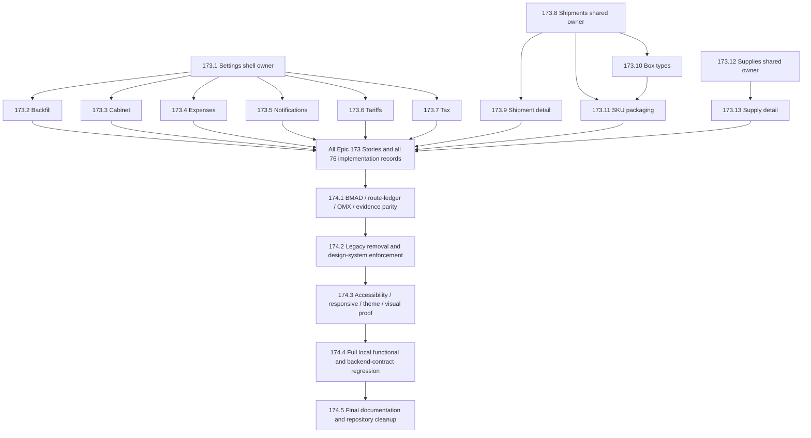

# WB Repricer Frontend — Full shadcn/ui Migration Handoff and Technical-Debt Register

> **Snapshot:** 2026-08-30, based on `origin/main` commit `b21362730e728b00d136dc729ffc31041a1bffa7` (Story 173.11 exact-five documentation merge, PR #360); exact Story 173.11 product and initial-documentation cleanup is proved, and only the auxiliary lifecycle-record lane remains.
> **Audience:** the next autonomous frontend migration team and its orchestrator.
> **Status:** Epics 166–172 and Stories 173.1–173.11 are complete; 87 of 94 canonical Stories are complete; 7 Stories remain in Epics 173–174.
> **Immediate next product Story:** 173.12, Supplies List, only after this Story 173.11 auxiliary lifecycle record merges and its branch/worktree cleanup passes.
> **Supersedes operationally:** `docs/HANDOFF-2026-08-27-CROSS-TEAM-OMC-ORCHESTRATOR-172-8-CONTINUATION.md`. That historical file remains unchanged by this documentation lane; it contains obsolete Story 172.12 execution instructions and a known plaintext test-credential exposure, so it must not be used as an execution entry point.
> **Scope:** this document concerns only `/Users/r2d2/Documents/Code_Projects/wb-repricer-system-new/frontend` and the approved local frontend migration workflow. It grants no deploy, production, force-push, or direct-push-to-main authority.

This document is the single continuation entry point. It intentionally separates verified current state, executable remaining work, known debt, deferred evidence, historical claims, and owner decisions. Read it completely before creating the next Story worktree.

---

## 0. Executive snapshot

| Item                          | Verified state                                                                                                                                                  |
| ----------------------------- | --------------------------------------------------------------------------------------------------------------------------------------------------------------- |
| Repository                    | `salacoste/wb-erp-system-daytona-FE`                                                                                                                            |
| Authoring base                | `origin/main` at `b21362730e728b00d136dc729ffc31041a1bffa7`                                                                                                     |
| Latest lifecycle event        | Story 173.11 exact-five docs PR #360 merged as `b2136273`; exact product and initial-docs branch/worktree/path/open-PR cleanup proved; auxiliary lane active    |
| Canonical Story parity        | 94 BMAD Stories and 94 per-Story OMX plans                                                                                                                      |
| Completed                     | 87/94 Stories; Epics 166–172 complete; Epic 173 at 11/13                                                                                                        |
| Remaining                     | 7/94: Epic 173 has 2; Epic 174 has 5                                                                                                                            |
| Route inventory               | 76 source routes and 76 ledger rows                                                                                                                             |
| Route implementation progress | 74 route-owning Stories complete; 2 Epic 173 routes remain                                                                                                      |
| Route-ledger status           | all rows remain `planned`; Story 174.1 validates ownership/evidence without changing implementation state, and Story 174.5 owns final transitions to `verified` |
| Recorded full Vitest floor    | 19,733 passed, 0 failed, 1,249 files after Story 173.9; Story 173.11 focused 112/112 + immutable contracts 23/23 did not refresh the full floor                 |
| Story 173.8 lifecycle         | Feature #350, closeout #351, and auxiliary #352 merged; all product/docs refs, paths, and PR residue absent                                                     |
| Story 173.9 lifecycle         | Feature #353, initial docs #354, and auxiliary #355 merged; all product/docs refs, paths, worktrees, and PR residue absent                                      |
| Story 173.10 lifecycle        | Feature #356, initial docs #357, and auxiliary #358 merged; all product/docs refs, paths, worktrees, and PR residue absent                                      |
| Story 173.11 lifecycle        | Feature #359 and initial docs #360 merged; exact product and initial-docs residue absent; auxiliary lifecycle-record lane active                                |
| NEXT                          | execute Story 173.12 from refreshed clean `main` only after this Story 173.11 auxiliary lifecycle record merges and cleans                                      |
| Production/deploy authority   | forbidden                                                                                                                                                       |

The recorded test floor is the fresh pinned-runtime Story 173.9 unrestricted final-product-snapshot full-suite rerun: 19,733/19,733 across 1,249 files. Story 173.11 ran a fresh pinned-runtime focused 112/112 plus immutable hook/API contracts 23/23 and static discovery of seven Story browser scenarios, but no full-suite snapshot, so the floor is intentionally unchanged. The known jsdom navigation diagnostic remained non-failing.

### Immutable continuation anchors

- Source code and behavior-locking tests are authoritative for existing runtime behavior.
- [AGENTS.md](../AGENTS.md) is the operating contract.
- [The BMAD Epic/Story artifact](../_bmad-output/planning-artifacts/epics-166-174-fe-shadcn-migration.md) owns canonical Story scope, acceptance criteria, ownership, prerequisites, and the Universal Story Delivery Contract.
- [The master OMX plan](../.omx/plans/shadcn-full-ui-migration-master.md) owns the program DAG and Story-plan index.
- [The route ledger](../_bmad-output/planning-artifacts/shadcn-route-ledger.md) is the only 76-route ownership mapping.
- [The UX specification](../_bmad-output/planning-artifacts/ux-design-specification.md) owns behavioral UX, responsive, theme, accessibility, state, table, metric, and chart requirements.
- Each exact `.omx/plans/{Story}.md` owns that Story's branch, worktree, allowed/forbidden surfaces, state matrix, tests, risks, and cleanup proof.
- [Sprint status](../_bmad-output/implementation-artifacts/sprint-status.yaml) owns per-Story execution state.

When artifacts disagree, resolve in this order: live source and passing behavior-locking tests for existing behavior; exact Story plan for the active Story; canonical BMAD/route/UX artifacts for program intent; this handoff for the current continuation snapshot. Record and correct drift through a reviewable documentation lane rather than silently choosing whichever text is convenient.

---

## 1. Authority hierarchy and mandatory reading order

Before any Story worktree is created, read in this order:

1. [AGENTS.md](../AGENTS.md) completely.
2. [Project agent documentation index](AGENTS/index.md) and the shards relevant to the active work.
3. [package.json](../package.json), especially the exact local validation scripts and pinned engines.
4. [This handoff](HANDOFF-2026-08-29-EPIC-173-174-FULL-MIGRATION-AND-DEBT.md) completely.
5. [Master migration plan](../.omx/plans/shadcn-full-ui-migration-master.md).
6. [Canonical BMAD Epics and Stories](../_bmad-output/planning-artifacts/epics-166-174-fe-shadcn-migration.md).
7. [Route ledger](../_bmad-output/planning-artifacts/shadcn-route-ledger.md).
8. [UX design specification](../_bmad-output/planning-artifacts/ux-design-specification.md); use [UX directions](../_bmad-output/planning-artifacts/ux-design-directions.html) only as supplementary visual direction.
9. [Sprint status](../_bmad-output/implementation-artifacts/sprint-status.yaml).
10. The exact next `.omx/plans/173.*.md` file, read completely before branch/worktree creation.
11. The immediately preceding owner/prerequisite Story artifacts and tests, for lessons and merged evidence only; do not reimplement them.

Do not treat generic or historical documents as equal authorities:

- `docs/AGENTS/technical-debt-and-known-issues.md` is a placeholder with unrelated examples and is not project truth.
- `docs/TECHNICAL-DEBT-TEST-FIXES.md` is historical; its old failure counts conflict with the current recorded floor and must be revalidated before any item is called active.
- Older handoffs and orchestrator prompts remain historical process evidence. Their NEXT markers, floors, branches, worktrees, service health, and owner availability are stale unless freshly verified.

---

## 2. Repository, Git, and worktree topology

### State observed before this handoff lane

```text
primary checkout:
  /Users/r2d2/Documents/Code_Projects/wb-repricer-system-new/frontend
  branch main
  HEAD 11fc603861bd17c1445047ca197850221fe3ee89
  clean

origin/main:
  046599670319d9a5d6da935b892ceca6fe01e7d9

relation:
  primary main is 0 ahead / 20 behind origin/main
  fast-forwardable, no divergence
```

### Documentation lane used to produce this handoff

```text
branch:
  cdx/handoff-full-migration-debt-2026-08-29

worktree:
  /private/tmp/wb-repricer-fe-handoff-full-20260829

base:
  origin/main @ 046599670319d9a5d6da935b892ceca6fe01e7d9
```

This historical handoff lane was merged as PR #327 and cleaned before Story 173.1 began. Story 173.1 then merged through feature PR #328 and documentation closeout PR #329; both delivery lanes were cleaned. Story 173.2 merged through feature PR #332 and documentation closeout PR #333; all of its lifecycle lanes were cleaned. Story 173.3 merged through feature PR #335, documentation closeout PR #336, and lifecycle-record PR #337; all lanes were cleaned before Story 173.4. Story 173.4 merged through feature PR #338, documentation closeout PR #339, and lifecycle-record PR #340; all lanes were cleaned before Story 173.5. Story 173.5 merged through feature PR #341, documentation closeout PR #342, and lifecycle-record PR #343; those lanes were cleaned before Story 173.6. Story 173.6 merged through feature PR #344, documentation closeout PR #345, and lifecycle-record PR #346; all lanes were cleaned before Story 173.7. Story 173.7 merged through feature PR #347, documentation closeout PR #348, and lifecycle-record PR #349; all lanes were cleaned before Story 173.8. Story 173.8 merged through feature PR #350, documentation closeout PR #351, and auxiliary lifecycle-record PR #352 (`55e21498`); all product and documentation residue was absent before Story 173.9. Story 173.9 merged through feature PR #353, exact-five documentation closeout PR #354, and auxiliary lifecycle-record PR #355 (`6cfa782d`); all product and documentation residue was absent before Story 173.10. Story 173.10 merged through feature PR #356, exact-five documentation closeout PR #357, and auxiliary lifecycle-record PR #358 (`7ee1f51e`); all product and documentation residue was absent before Story 173.11. Story 173.11 product work merged through feature PR #359 as `137e2ee5`; exact-five documentation commit `66b30d7d` merged through PR #360 as `b2136273`; exact product and initial-documentation cleanup was proved before this auxiliary lane began.

### Active Story 173.11 auxiliary lifecycle-record lane

```text
branch:
  cdx/docs-story-173-11-final-lifecycle-record

worktree:
  /private/tmp/wb-repricer-docs-story-173-11-final-lifecycle-record

base:
  initial documentation merge b21362730e728b00d136dc729ffc31041a1bffa7

scope:
  exactly the same five Story 173.11 program tracking files: master, implementation artifact, sprint, debt registry, and this handoff
```

This auxiliary lane publishes the already-proved initial documentation PR #360 head/merge, primary fast-forward, exact product and initial-docs cleanup, validation, and review facts. Its own future PR number, head, merge, primary fast-forward, and cleanup are unknown until they happen and are not recursively preclaimed here.

Never reset, rebase, stage, commit, remove, or clean another team's WIP. When a path or branch is disputed, capture branch/HEAD/status/diffs/untracked files and ownership evidence before any Git mutation.

### Recoverable quarantine

The following recoverable audit quarantine existed at handoff time:

```text
/private/tmp/wb-repricer-cleanup-quarantine-20260828.H6K0jw
size: approximately 112 MiB
```

It contains five historical/audit-evidence directories associated with Story 172.11 and Story 169.14 review snapshots. It is not a registered product worktree and is not active product WIP. Do not permanently delete it without an explicit informed destructive decision. Its presence does not block the Story 173.11 documentation lanes or Story 173.12 after lifecycle cleanup.

---

## 3. Completed migration history: Epics 166–172

| Epic | Result   | Stories | What is now available                                                                                                                                                                                           |
| ---- | -------- | ------: | --------------------------------------------------------------------------------------------------------------------------------------------------------------------------------------------------------------- |
| 166  | complete |     8/8 | Tailwind v4 semantic tokens, hardened shadcn primitives, PageHeader/ContextBar, metrics/financial/availability/status compositions, filters/period controls, table/chart contracts, and page-state compositions |
| 167  | complete |     9/9 | AppShell and protected/public/auth/cabinet/onboarding/processing/WB-token surfaces, including the approved backend reconciliation/idempotency prerequisite and shared frontend conditional-settlement boundary  |
| 168  | complete |   11/11 | Analytics shared owner and core analytics route wave                                                                                                                                                            |
| 169  | complete |   15/15 | Operational analytics routes plus the approved paid-storage backend lifecycle/result prerequisite and shared frontend boundary/closeout                                                                         |
| 170  | complete |     7/7 | Advertising, brand, category, and search analytics route wave                                                                                                                                                   |
| 171  | complete |     9/9 | AI anomaly, model governance/preferences/registry/evaluation/performance, and forecast route wave                                                                                                               |
| 172  | complete |   17/17 | Core business dashboard, rules, COGS, communications, finance, monitor/monitoring, MoySklad, orders, integrity, and product management route wave                                                               |

The last verified Epic 172 chain is:

| Story  | Feature PR/merge  | Closeout PR/merge | Recorded full Vitest floor |
| ------ | ----------------- | ----------------- | -------------------------: |
| 172.14 | #319 / `4b988aae` | #320 / `cdc5cfe2` |                     19,447 |
| 172.15 | #321 / `81bc35cc` | #322 / `688a7ad2` |                     19,458 |
| 172.16 | #323 / `8939aea4` | #324 / `45e3da76` |                     19,463 |
| 172.17 | #325 / `caee8523` | #326 / `04659967` |                     19,467 |
| 173.1  | #328 / `3c560ed2` | #329 / `7bec65fd` |                     19,489 |
| 173.2  | #332 / `7c85b804` | #333 / `650f8efc` |                     19,565 |
| 173.3  | #335 / `5ce9935e` | #336 / `3e04ccd2` |                     19,589 |
| 173.4  | #338 / `6a6e1bf8` | #339 / `d99f812e` |                     19,615 |
| 173.5  | #341 / `41d686de` | #342 / `45c35498` |                     19,647 |
| 173.6  | #344 / `80427f28` | #345 / `d079dcb6` |                     19,663 |
| 173.7  | #347 / `7f9f046f` | #348 / `27577ca2` |                     19,688 |
| 173.8  | #350 / `65f73fed` | #351 / `4bda841f` |                     19,703 |
| 173.9  | #353 / `069c9645` | #354 / `cd05d31c` |                     19,733 |
| 173.10 | #356 / `9e4f6254` | #357 / `ebba17a5` |                    19,733† |
| 173.11 | #359 / `137e2ee5` | active closeout   |                    19,733‡ |

† Story 173.10 passed focused 89/89 plus the static boundary 4/4 but did not run a fresh full suite, so the recorded full floor remains the Story 173.9 snapshot.

‡ Story 173.11 passed focused 112/112 plus immutable contracts 23/23 and statically discovered seven Story browser scenarios but did not run a fresh full suite, so the recorded full floor remains the Story 173.9 snapshot.

All Epic 172 feature/closeout branches and temporary worktrees were absent at audit time. The completed artifacts under `_bmad-output/implementation-artifacts/166-*` through `172-*` are evidence and lessons; they are not invitations to reopen shipped scope.

### Foundation reuse rule

Reuse the established product layer, including `src/components/product/PageHeader.tsx`, `ContextBar.tsx`, the product barrel, and their composition/source-contract tests. Do not duplicate these components. A route Story may not expand a prior explicit Story-owned source-contract manifest or edit generic primitives/shared owners without exact necessity, consumer proof, and ownership authorization.

---

## 4. Execution DAG (7 Stories remaining)



Named owner Stories must merge before their consumers. The repository plan permits truly independent branches after owner prerequisites merge and exact allowed surfaces prove non-overlap. The standing operator policy for this program is sequential execution; numeric order `173.1 → 173.13 → 174.1 → 174.5` is safe and satisfies the DAG. Never create a downstream worktree from a stale or unmerged prerequisite branch.

---

## 5. Detailed Epic 173 execution map

Every row below is a synopsis. The linked exact plan is authoritative and must be read fully before lane creation.

| Story                                                                                           | Exact lane                                                                                                                    | Prerequisites and ownership                                                                                                                                                                                                                                                                                                   | Required state/behavior evidence                                                                                                                                                                                                                                                                                                                                                   | Targeted validation anchor                                                                                          |
| ----------------------------------------------------------------------------------------------- | ----------------------------------------------------------------------------------------------------------------------------- | ----------------------------------------------------------------------------------------------------------------------------------------------------------------------------------------------------------------------------------------------------------------------------------------------------------------------------- | ---------------------------------------------------------------------------------------------------------------------------------------------------------------------------------------------------------------------------------------------------------------------------------------------------------------------------------------------------------------------------------- | ------------------------------------------------------------------------------------------------------------------- |
| [173.1 Settings Shell and Overview](../.omx/plans/173.1-migrate-settings-shell-and-overview.md) | **DONE** — feature #328 / `3c560ed2`; closeout #329 / `7bec65fd`; exact cleanup proved                                        | Shared seven-route shell, static overview, desktop grid, compact Sheet, Owner/non-Owner semantics delivered in exact six-file manifest; credentialed non-Owner visual gap is C18 → 174.3                                                                                                                                      | focused 2/22; settings 17/217; full 19,489/0/1,229; browser 47 pass/2 explicit skip + repeat 63 pass/1 optional Manager skip                                                                                                                                                                                                                                                       | [implementation artifact](../_bmad-output/implementation-artifacts/173-1-fe-migrate-settings-shell-and-overview.md) |
| [173.2 Backfill Settings](../.omx/plans/173.2-migrate-backfill-settings.md)                     | **DONE** — feature #332 / `7c85b804`; closeout #333 / `650f8efc`; exact lifecycle cleanup proved                              | Truthful unresolved/error/refresh/stale/retry states; dual-pipeline status/eligibility; responsive cards/table; guarded pending trigger and focus restoration delivered in exact 17-file manifest                                                                                                                             | focused 6/106; full 19,565/0/1,232; browser 77 pass/2 documented conditional skips; both builds 70/70                                                                                                                                                                                                                                                                              | [implementation artifact](../_bmad-output/implementation-artifacts/173-2-fe-migrate-backfill-settings.md)           |
| [173.3 Cabinet Settings](../.omx/plans/173.3-migrate-cabinet-settings.md)                       | **DONE** — feature #335 / `5ce9935e`; closeout #336 / `3e04ccd2`; exact lifecycle cleanup proved                              | Stable active-cabinet context; semantic seller/Jam/rating/subscription states; accessible loading, validation, and save lifecycle; fail-closed unknown tier and exact fixtures delivered in exact 12-file manifest                                                                                                            | focused 6/49; full 19,589/0/1,234; browser 24 pass/1 optional Manager setup skip; both builds 70/70; product + docs reviews approved                                                                                                                                                                                                                                               | [implementation artifact](../_bmad-output/implementation-artifacts/173-3-fe-migrate-cabinet-settings.md)            |
| [173.4 Expense Settings](../.omx/plans/173.4-migrate-expense-settings.md)                       | **DONE** — feature #338 / `6a6e1bf8`; closeout #339 / `d99f812e`; exact product and initial docs cleanup proved               | Truthful invalid/loading/error/empty/unavailable states; native validation; pending-safe CRUD overlays; unavailable financial evidence; deterministic focus and privacy-safe responsive/theme/reflow/axe proof delivered in exact nine-file manifest                                                                          | focused 4/98; full 19,615/0/1,235; browser 37 pass/1 optional Manager setup skip; build 70/70; product + docs reviews approved                                                                                                                                                                                                                                                     | [implementation artifact](../_bmad-output/implementation-artifacts/173-4-fe-migrate-expense-settings.md)            |
| [173.5 Notification Settings](../.omx/plans/173.5-migrate-notification-settings.md)             | **DONE** — feature #341 / `41d686de`; closeout #342 / `45c35498`; exact product and initial docs cleanup proved               | Truthful loading/unavailable/bound/unbound Telegram state; FBS independence; semantic tokens; labeled switches and visible radio focus; complete quiet-hours validation; pending-safe binding/unbind lifecycle; deterministic focus; responsive/theme/reflow/reduced-motion/axe discovery delivered in exact 28-file manifest | focused 10/68; full 19,647/0/1,242; Playwright 40 discovered with service-dependent browser gap explicit; build 70/70; product and documentation findings resolved                                                                                                                                                                                                                 | [implementation artifact](../_bmad-output/implementation-artifacts/173-5-fe-migrate-notification-settings.md)       |
| [173.6 Tariff Settings](../.omx/plans/173.6-migrate-tariff-settings.md)                         | **DONE** — feature #344 / `80427f28`; closeout #345 / `d079dcb6`; exact product and initial docs cleanup proved               | Truthful query-backed ContextBar states; responsive tabs; accessible skeleton, partial notice, validation summary, associated scalar/tier errors; controlled dirty state; pending-safe confirmation; recoverable retry; pristine rebase; result/focus lifecycle delivered in exact 29-file manifest                           | focused 10/162; full 19,663/0/1,244; Playwright 81 file-level tests discovered including 20 tariff scenarios with browser gap explicit; build 70/70; product and docs reviews P0/P1/P2=0, scope PASS, APPROVE                                                                                                                                                                      | [implementation artifact](../_bmad-output/implementation-artifacts/173-6-fe-migrate-tariff-settings.md)             |
| [173.7 Tax Settings](../.omx/plans/173.7-migrate-tax-settings.md)                               | **DONE** — feature #347 / `7f9f046f`; closeout #348 / `27577ca2`; exact product and initial docs cleanup proved               | PageHeader and truthful ContextBar; native form; validation and no-tax warning; same-cabinet draft preservation; cabinet-boundary isolation; unsupported saved VAT safety; pending/success/failure/retry/cancel/read-only lifecycle delivered in exact 11-file manifest                                                       | focused 5/64; full 19,688/0/1,246; Playwright 99 file-level tests discovered including 20 tax scenarios with browser gap explicit; build 70/70; product + docs reviews P0/P1/P2=0, scope PASS, APPROVE                                                                                                                                                                             | [implementation artifact](../_bmad-output/implementation-artifacts/173-7-fe-migrate-tax-settings.md)                |
| [173.8 Shipments List](../.omx/plans/173.8-migrate-the-shipments-list.md)                       | **DONE** — feature #350 / `65f73fed`; closeout #351 / `4bda841f`; auxiliary #352 / `55e21498`; exact lifecycle cleanup proved | Shared shipment-list/status owner delivered in exact 18-file manifest: persistent PageHeader/PageState identity; retained stale refresh data; shared filters/responsive table/state/pagination; queue cards; semantic unknown-safe status; filtered-empty reset; role-gated pending-safe creation and exact focus return      | focused 6/50; full 19,703/0/1,248; static Playwright boundary 4/4; credentialed browser execution gap explicit; webpack build 70/70; product + docs reviews P0/P1/P2=0, scope PASS, APPROVE                                                                                                                                                                                        | [implementation artifact](../_bmad-output/implementation-artifacts/173-8-fe-migrate-the-shipments-list.md)          |
| [173.9 Shipment Detail](../.omx/plans/173.9-migrate-shipment-detail.md)                         | **DONE** — feature #353 / `069c9645`; closeout #354 / `cd05d31c`; exact product and initial docs cleanup proved               | Exact 24-file detail-owned manifest: persistent route identity; safe loading/404/error/retry/validation/partial states; PageHeader/ContextBar/shared status; truthful conditional table contracts; complete mutation and focus lifecycle. APIs/hooks/types/calculations/query/auth preserved.                                 | focused 19/192; focused + static 20/196; full 19,733/0/1,249; webpack 70/70; browser execution gap explicit; fingerprint `41d945d2`; product + docs reviews P0/P1/P2=0, scope PASS, APPROVE                                                                                                                                                                                        | [implementation artifact](../_bmad-output/implementation-artifacts/173-9-fe-migrate-shipment-detail.md)             |
| [173.10 Shipment Box Types](../.omx/plans/173.10-migrate-shipment-box-types.md)                 | **DONE** — feature #356 / `9e4f6254`; closeout #357 / `ebba17a5`; exact product and initial docs cleanup proved               | Preserved active-only query; PageHeader/PageState; named wide table + stacked cards; semantic status/units; visible 44px entity actions; 320/768 overflow-safe action stacks; complete dialog validation/pending/failure/focus lifecycle; APIs/hooks/types/query shared owners unchanged                                      | focused 7/89 + static 1/4; full floor remains 19,733/0/1,249; build 70/70; credentialed browser execution gap explicit; product + docs reviews P0/P1/P2=0, scope PASS, APPROVE                                                                                                                                                                                                     | [implementation artifact](../_bmad-output/implementation-artifacts/173-10-fe-migrate-shipment-box-types.md)         |
| [173.11 SKU Packaging](../.omx/plans/173.11-migrate-sku-packaging.md)                           | **DONE** — feature #359 / `137e2ee5`; initial docs #360 / `b2136273`; exact product and initial-docs cleanup proved           | Exact 24-file packaging-exclusive manifest; preserved unparameterized SKU and active-only box-type queries; exact single/bulk/delete contracts; shared hooks/APIs/types/query keys/foundation unchanged                                                                                                                       | truthful dependency failures; local filtered-empty reset; named wide table + narrow cards; mapping status/units; bounded dialogs/errors; validation summary; reconciled announcements and exact cancellation/success focus; focused 10/112 + immutable 3/23; seven Story browser scenarios discovered; build 70/70; browser execution gap explicit; product + docs reviews APPROVE | [implementation artifact](../_bmad-output/implementation-artifacts/173-11-fe-migrate-sku-packaging.md)              |
| [173.12 Supplies List](../.omx/plans/173.12-migrate-supplies-list.md)                           | `cdx/epic-173-story-12-supplies`; `/private/tmp/wb-repricer-fe-173-12-supplies`                                               | Shared supply-list/status owner for 173.13. Freeze explicit shared/exclusive manifest. Preserve supply contracts.                                                                                                                                                                                                             | loading/empty/filtered-empty; lifecycle; stale/partial; create pending/success/failure; error; identifier/status/date/action; overlay focus/errors                                                                                                                                                                                                                                 | supply list/filter/table Vitest; list/a11y E2E                                                                      |
| [173.13 Supply Detail](../.omx/plans/173.13-migrate-supply-detail.md)                           | `cdx/epic-173-story-13-supply-detail`; `/private/tmp/wb-repricer-fe-173-13-supply-detail`                                     | Requires 173.12. Dynamic route and detail-exclusive files/tests.                                                                                                                                                                                                                                                              | loading/not-found/partial; lifecycle; document/picker states; close pending/success/failure; stepper, orders, documents, drawer/dialog, sticker/act; focus and announcements                                                                                                                                                                                                       | detail/supply-component Vitest; detail/lifecycle E2E                                                                |

### Epic 173 owner boundaries

- 173.1 owns the settings shell. Child settings Stories must not silently edit it.
- 173.8 owns shipment-shared list/status presentation. Detail/box/packaging Stories must not absorb shared changes without owner coordination.
- 173.12 owns supply-shared list/status presentation. 173.13 must keep detail-only ownership.
- APIs, hooks, query keys, types, business calculations, authentication, cabinet context, URLs/search parameters, mutation semantics, cache behavior, and backend contracts remain behavior-preservation surfaces unless an exact Story explicitly owns a change.

---

## 6. Epic 174 assurance and closeout plan

Epic 174 is sequential and starts only after all 13 Epic 173 Stories are merged and their lifecycle cleanup/evidence is complete. Frontmatter wording such as `ready-for-execution` never overrides a plan's prerequisite DAG.

### 174.1 — BMAD, route-ledger, OMX, and evidence parity

[Exact plan](../.omx/plans/174.1-prove-bmad-route-ledger-and-omx-plan-parity.md)

- Prove 94 BMAD Stories = 94 exact OMX plans.
- Prove 76 actual `page.tsx` routes = 76 ledger rows = 76 route-owning Stories.
- Reconstruct and validate all 76 linked implementation records from Story artifacts, PR/merge evidence, and cleanup proof.
- Make the validator fail deterministically on missing, extra, duplicate, orphaned, mismatched, nonexistent-route, duplicate-owner, wrong-repository, duplicate-lane, unresolved-prerequisite, or missing-evidence conditions.
- Own planning/evidence files and parity validator/tests only. Do not edit runtime UI, APIs, tokens, primitives, or backend code.
- Do not treat today's 76 `planned` rows as verified. This Story validates and reconciles all 76 ownership and evidence records without changing route implementation state. Story 174.5 owns the final status transitions to `verified` after Stories 174.2–174.4 provide the required evidence.

### 174.2 — Legacy removal and design-system enforcement

[Exact plan](../.omx/plans/174.2-remove-legacy-ui-and-enforce-the-design-system-boundary.md)

- Build a consumer/import-closure manifest before deletion.
- Reconcile the exception register and all applicable design-system/source-boundary debt in §11.
- Delete only code proven unused after all route consumers migrate.
- Add or strengthen exact file/line guards for raw controls, hardcoded colors, boundary violations, orphaned migrated variants, and prohibited domain logic in generic primitives.
- Preserve specialized tables, charts, virtualization, domain editors, APIs, calculations, and business behavior.
- Do not use a broad mechanical cleanup as evidence of safety.

### 174.3 — Inclusive visual, theme, responsive, and accessibility proof

[Exact plan](../.omx/plans/174.3-complete-accessibility-responsive-theme-and-visual-verification.md)

- Consolidate route-applicable states: default, loading, refresh/updating, empty, filtered-empty, error, stale, partial, permission, pending, partial-success, and not-found.
- Cover light and dark themes; 320, 390, 768, 1024, 1280, and 1440+ widths; 200% zoom; reduced motion; long Russian labels; financial/date/percentage/ISO-week/edge values.
- Prove keyboard completion, focus containment and return, visible focus, announcements, non-color meaning, tables, charts, overlays, and responsive detail strategies.
- Run axe, but do not equate automated axe with manual keyboard, contrast, visual, or assistive-technology proof.
- Record unavailable real-screen-reader/browser environments as gaps, never passes.

### 174.4 — Full local functional and backend-contract regression

[Exact plan](../.omx/plans/174.4-complete-full-local-functional-and-backend-contract-regression.md)

- Run the full local unit/integration and E2E suites against the approved local frontend/backend environment.
- Exercise auth/onboarding/session/error recovery, single/bulk COGS, analytics, writeback/retry, exports/downloads, long jobs, dynamic entities, URLs/headers/query counts, calculations/formatting, mutations/cache, and backend contracts.
- Credentialed E2E is mandatory where specified. Credentials may be supplied only under explicit authorization and only in process memory; never print or persist them.
- A missing mandatory environment or unresolved failure blocks completion. Production is not a validation substitute.
- This Story does not own backend code, public-contract changes, deployment configuration, or required CI gates.

### 174.5 — Final documentation and repository cleanup

[Exact plan](../.omx/plans/174.5-finalize-documentation-and-repository-cleanup.md)

- Reconcile canonical design-system/frontend docs to merged reality.
- Mark each route verified only when complete linked evidence exists.
- Validate every final evidence/doc link and publish the delivery manifest, retrospective, and cleanup report.
- Resolve or explicitly owner-accept every exception; an unclassified silent omission is not closure.
- Remove only proven-completed migration branches/worktrees/temporary lifecycle records; preserve unrelated or unmerged work.
- Finish with 94/94 Stories, 76/76 verified routes, all Epic 174 gates green, zero completed migration branches/worktrees, and no deploy/production action.

---

## 7. Universal Story lifecycle

Every remaining Story uses the complete lifecycle below. A feature merge without closeout and cleanup is incomplete.

### A. Bootstrap and collision gate

1. Fetch and verify the exact `origin` repository identity.
2. Inspect primary branch, HEAD, status, divergence, worktrees, local branches, remote branches, and open PRs.
3. Preserve concurrent WIP. If ownership is unclear, collect forensic evidence before mutation.
4. Verify prerequisite merge SHAs are ancestors of refreshed `origin/main` and current local `main`.
5. Read the exact Story plan fully.
6. Freeze the exact Allowed Change Surface, Forbidden Shared Files, direct tests/evidence, import consumers, and owner handoffs.
7. Verify the planned branch/worktree do not already exist.

### B. Isolated lane

Create exactly one Story branch and one temporary worktree from updated local `main`, using the exact names in the plan. Never reuse a stale Story lane or branch from another team. Install dependencies inside the Story worktree with the pinned runtime and `npm ci`; do not symlink `node_modules` from another filesystem root, because Turbopack rejects that boundary and the evidence becomes non-reproducible.

### C. Honest behavior lock and RED

- Run the smallest existing targeted tests before production edits.
- When coverage cannot prove preservation, first add regression/acceptance tests and demonstrate honest RED for the missing behavior or contract.
- Distinguish planned RED from environment failure, flaky infrastructure, stale test expectation, and pre-existing main failure.
- Record command, exit status, failure meaning, and disposition without secrets.

### D. Implementation

- Prefer existing tokens, primitives, product compositions, domain-shared components, and deletion of proven residue over new abstractions.
- Preserve APIs, hooks, query keys, calculations, URLs/search state, navigation, auth/cabinet state, mutations, cache behavior, formatting, and Russian localization.
- Keep generic `src/components/ui/**` domain-neutral.
- Do not add dependencies or run force-overwriting shadcn initialization.
- Keep diffs small and inside the frozen ownership manifest.

### E. Targeted and universal verification

Run Story-specific tests first, then the applicable universal gates from the exact plan and `package.json`:

```bash
npm run lint
npm run type-check
npm run check:max-lines
npm run build
git diff --check
```

In temporary worktrees, use `npm run build -- --webpack` when the known Turbopack/symlink failure mode applies. Record that proportional choice. Run Playwright through the repository npm wrapper so required auth/orders dependencies are included.

### F. Independent review

- A reviewer who did not author the change must inspect the complete diff and exact allowed manifest.
- Review accessibility, state semantics, behavior preservation, source guards, tests, and import closure.
- Resolve every accepted finding, explicitly disposition non-findings/known debt, and rerun affected gates.
- Every behavior-changing source Story requires at least two fresh-context adversarial review passes before commit and closeout. Trivial process/docs-only work may use the documented lighter contract; apply the canonical escalation triggers for additional passes.

### G. Commit, push, PR, and merge

- Use a detailed conventional commit classifying and explaining the Story-owned change. Never mention Codex in commit text.
- Push the feature branch; never direct-push `main` and never force-push.
- Create/recover exactly one PR with the expected base/head.
- Fence merge to the exact reviewed head SHA; re-read PR identity before merge.
- Local validation is the merge gate. Do not introduce a mandatory GitHub `Quality Gates`/CI requirement without owner authorization.

### H. Closeout and cleanup

- Update the Story artifact, sprint status, program/debt registry, current handoff snapshot, and recorded validation floor in a documentation closeout lane when the established process requires it.
- Merge the closeout through PR.
- Fetch and fast-forward primary `main`.
- Delete the completed remote feature branch using exact-old-SHA safety, remove the temporary worktree, delete the local feature branch, and prune.
- Prove exact local branch, remote branch, worktree, lifecycle-record, and open-PR absence.
- Never delete another lane or recoverable quarantine as incidental cleanup.

---

## 8. UX, design-system, responsive, theme, and accessibility contract

The canonical stack is repository-owned shadcn/ui on Radix, Tailwind v4 semantic CSS variables, CVA, `cn()`/tailwind-merge, Lucide, Sonner, and Recharts through product compositions. The baseline is `new-york`; do not reinstall or force-overwrite it.

The layer boundary is:

```text
semantic tokens
  → generic, domain-free shadcn primitives
    → product compositions
      → domain-shared components
        → route-owned UI trees
```

Mandatory rules:

- No light-only presentation. Hardcoded palette/hex is permitted only in a registered semantic token, external-brand, or visualization exception.
- Generic primitives contain no route, API, query, calculation, or domain language.
- Keep specialized charts, virtualized tables, and domain editors specialized when abstraction would lose behavior.
- Mobile is a supported focused-work surface, not a clipped desktop fragment.
- Status, risk, availability, validation, financial sign, and progress are never communicated by color alone.
- Preserve distinct meanings for zero, missing, unavailable, not calculated, filtered, stale, estimated, partial, and permission-denied.
- Partial-success retry defaults to failed scope; already successful entities are not silently retried.
- Theme changes cannot reset product state.

### Tables

Every applicable table needs an accessible caption/name, an explicit primary identity, correct numeric precision and `tabular-nums`, sort/selection/action semantics, loading/empty/filtered/error/stale/partial states, deliberate narrow-width behavior, and preserved pagination/virtualization. Do not duplicate equivalent accessible naming between caption and scroll-region label.

### Charts

Every applicable chart needs title, period, units, series/legend meaning, freshness, tooltip precision, responsive containment, reduced-motion handling, accessible summary, and equivalent data evidence. Series meaning must not depend only on hue.

Chart tokens are suitable for series fill, stroke, and border. They are not normal text colors on tinted surfaces. Text on tints uses semantic foreground/status text with measured contrast.

### Overlays and focus

Dialog, AlertDialog, Drawer, Sheet, Popover, menu, and confirmation flows must have a clear accessible name, focus containment, Escape behavior where appropriate, deterministic focus return, visible errors, and status/result announcements.

### Validation matrix

- Themes: light and dark.
- Widths: 320, 390, 768, 1024, 1280, 1440+; use 375 where a plan explicitly requires it.
- 200% zoom.
- Reduced motion.
- Keyboard-only completion and visible focus.
- Automated axe plus manual semantic/contrast review.
- Real screen reader where available; record unavailable environments.
- Long Russian labels and zero/missing/unavailable, large/negative financial values, dates, percentages, ISO weeks, and overflow.

---

## 9. Ownership, forbidden surfaces, and cross-repository limits

- Story-owned route work cannot edit a shared component without its declared owner, complete consumer inventory, and a reviewed ownership expansion.
- Import closure is mandatory. Searching only the visible route directory is insufficient.
- Source-contract guards must pin an explicit Story-owned manifest. Do not broaden old guards to claim new ownership merely to make a check pass.
- Guards can match comments and dead examples; inventory production consumers separately from textual matches.
- Exactly the historical Stories 167.8 and 169.14 had approved backend exceptions. Remaining Epic 173–174 frontend Stories inherit no backend mutation authority.
- Backend debt in §11 is coordination input, not permission to edit the backend repository.
- No deploy, production operation, required CI gate, force-push, or direct push to `main` is authorized.

---

## 10. Validation and review gates

### Pinned runtime

```text
Node.js 24.18.0
npm 11.11.0
```

Node 26 is a known webpack incompatibility in this repository. Validate the active runtime before interpreting build failures.

### Documentation-handoff PR gates

Because this auxiliary Story 173.11 lifecycle record changes exactly the same five Markdown/YAML tracking files—the master plan, Story implementation artifact, sprint, debt registry, and this handoff—without modifying the obsolete credential-bearing handoff, its proportional gates are:

```bash
git diff --check
npm run check:docs
npm run check:markers
npm run check:lessons
```

Additionally prove:

- `sprint-status.yaml` parses as YAML;
- exactly 94 canonical Stories = 87 done + 7 backlog;
- completed arithmetic is 8+9+11+15+7+9+17+11 = 87;
- 94 OMX Story plans exist and 76 source routes equal 76 ledger rows;
- all 76 ledger rows intentionally remain `planned`;
- master, sprint, registry, Story artifact, and this handoff agree on 87/94, Epic 173 at 11/13, NEXT Story 173.12 after this auxiliary lifecycle record cleans, and the unchanged 19,733/1,249 full floor;
- stale-state scan finds no live continuation instruction that directs the new team to Story 173.10 or Story 173.11 product work;
- a non-echoing staged-diff scan proves that this lane introduces no new credential-bearing line; SEC-DOC-1 remains open because a full tracked-tree inventory found five files with ten additional occurrences;
- all new relative document/plan links resolve.

`npm run check:docs` remains an explicit inherited gap, not a green claim. On this exact Story 173.11 auxiliary candidate it exits `1` after scanning 427 citations: 95 are broken, one is classified as new relative to the committed baseline, three are classified as resolved, and 94 match the accepted baseline, so the overall baseline comparison is `MISMATCH`. This lane intentionally does not update the citation baseline or repair historical archive citations.

This auxiliary record is backed by the exact Story product and initial-closeout evidence. Its documentation-only delta additionally requires docs/marker/lesson checks, YAML parsing, link validation, formatting, and a fresh non-author review.

### Product Story gates

Product Stories run their targeted Vitest/Playwright first, then lint, typecheck, max-lines, build, diff check, exact source-contract guards, and the plan's UX/browser matrix. Full Vitest and E2E are required where the exact plan says so. Record unavailable checks as gaps.

---

## 11. Complete known technical-debt and carry-out register

This section is the consolidated continuation register. “Known” means backed by a committed registry/artifact or fresh audit; it does not imply every item belongs to the next Story. Resolve only through the listed owner/trigger and preserve IDs in closeout updates.

### 11.1 Frontend behavior/security debt requiring a separate owner-trigger

| ID    | Debt                                                                                                                       | Risk                                                          | Trigger/owner                                                                                                                                                            |
| ----- | -------------------------------------------------------------------------------------------------------------------------- | ------------------------------------------------------------- | ------------------------------------------------------------------------------------------------------------------------------------------------------------------------ |
| FE-D1 | Mutation configuration `retry: 1` also retries 4xx; the WB-token PUT can execute twice and existing E2E pins two attempts. | Duplicate non-idempotent mutation and behavior/test coupling. | Separate behavior-change lane with full Vitest/E2E and deliberate update to the E2E pin; not an incidental UI cleanup.                                                   |
| FE-D2 | `WbTokenBanner` is dead code with zero importers.                                                                          | Orphaned legacy presentation.                                 | Proven-unused cleanup in a bounded frontend Story or applicable 174.2 manifest.                                                                                          |
| FE-D3 | `getErrorMessage` may expose raw `error.message` to users.                                                                 | Internal/sensitive error disclosure.                          | API-client/error-path owner; scrub, classify, and truncate with behavior tests.                                                                                          |
| FE-D5 | Cross-tab cabinet creation has no compare-and-set/Web Locks boundary.                                                      | Duplicate creation from concurrent tabs.                      | Dedicated Web Locks/conditional-settlement fast-follow; not visual migration.                                                                                            |
| FE-D6 | `ExportConfigForm` duplicates/dead-ends `ExportDialogForm`.                                                                | Duplicate implementation and drift.                           | Proven-unused cleanup or 174.2 import-closure sweep.                                                                                                                     |
| FE-D8 | A middle path in `getCabinetCreationOperation` can leave the user in `SAFE_RECONCILIATION`.                                | Stuck onboarding/recovery UX.                                 | Fresh behavior/UX review and dedicated corrective Story; do not change opportunistically.                                                                                |
| FE-D9 | `logApiError` can log non-2xx response bodies, including registration secrets.                                             | Credential/PII leakage to logs.                               | Nearest authorized API-client security lane; redact before logging and preserve password-policy classification. High priority, but outside route-presentation ownership. |

### 11.2 Registered route-wave carry-outs C1–C17

| ID  | Carry-out                                                                                                                                                                                                                                                                                                                    | Destination                                                                                                                                  |
| --- | ---------------------------------------------------------------------------------------------------------------------------------------------------------------------------------------------------------------------------------------------------------------------------------------------------------------------------- | -------------------------------------------------------------------------------------------------------------------------------------------- |
| C1  | The registry's historical “four tooltip containers” count has drifted and needs fresh classification. Current candidates include `TrendsChart.tsx` `bg-white`, a raw white switch knob in `WidgetSettingsSheet.tsx`, and advertising translucent white/black filter chips; one previously named tooltip is already semantic. | Applicable dashboard/advertising owner or 174.2. Recount an exact manifest before change and use semantic popover/control/overlay contracts. |
| C2  | `MarginDisplay` retains legacy gray/green/red palette.                                                                                                                                                                                                                                                                       | Dashboard/financial presentation owner or 174.2; sign uses financial semantics, zero uses muted.                                             |
| C3  | `getProfitabilityColor` and `getProfitabilityBgClass` appear to have no direct production callers beyond a barrel, while tests still consume them.                                                                                                                                                                           | `reverify` with barrel/dynamic/build proof before a proven-unused 174.2 deletion.                                                            |
| C4  | `getHealthScoreInfo` returns raw hex/`bgColor` and appears to have no direct production caller beyond a barrel.                                                                                                                                                                                                              | `reverify` reachability and tests before deletion.                                                                                           |
| C5  | Waterfall rendering has two color authorities: utility green versus config blue.                                                                                                                                                                                                                                             | Dedicated chart-owner decision; establish one source of truth before cleanup.                                                                |
| C6  | Acquiring date cells in three tables lack `tabular-nums`.                                                                                                                                                                                                                                                                    | Tree-wide/table-owner sweep, not inconsistent per-route edits.                                                                               |
| C7  | Acquiring E2E still describes an “amber” rate-limit banner.                                                                                                                                                                                                                                                                  | Correct comment on next owned spec change.                                                                                                   |
| C8  | `FunnelPageContent` is exactly at the 200-line cap.                                                                                                                                                                                                                                                                          | Extract the sync/toolbar block on the next owned functional change; no speculative refactor.                                                 |
| C9  | Funnel, gaps, and liquidity lack the consolidated browser/theme/responsive/axe/keyboard/visual matrix.                                                                                                                                                                                                                       | Story 174.3.                                                                                                                                 |
| C10 | Funnel uses semantic KPI icons while related FBS routes use muted icon canon.                                                                                                                                                                                                                                                | 174.2 owner reconciliation; current direction is semantic.                                                                                   |
| C11 | One cold-cache Funnel Vitest episode produced 12 failures, while warm/full runs were stable.                                                                                                                                                                                                                                 | Investigate only if freshly reproducible; not an active failure claim.                                                                       |
| C12 | Gaps route/component suites partially duplicate composition coverage.                                                                                                                                                                                                                                                        | Dedicated test cleanup preserving corrective lifecycle coverage.                                                                             |
| C13 | `GapsTable` caption and scroll `aria-label` duplicate the same accessible meaning.                                                                                                                                                                                                                                           | Low-priority accessibility naming deduplication.                                                                                             |
| C14 | Remaining route source guards need an owner sweep after the Gaps pure-digit-hex correction.                                                                                                                                                                                                                                  | Route owner or applicable 174.2 source-boundary sweep; preserve ticket-reference exclusions.                                                 |
| C15 | Liquidity `URGENCY_CLASS` keys are localized labels; renaming can silently fall back.                                                                                                                                                                                                                                        | Type by stable tier/day key on next owner change.                                                                                            |
| C16 | Liquidity pie uses a double cast and chart token as text with only a marginal contrast result on card and failures on tint.                                                                                                                                                                                                  | Chart/174.2 contrast owner; remove cast only with type-proof and use chart token only as visual mark.                                        |
| C17 | Credentialed functional E2E for the Story 169.9 corrective journey is missing.                                                                                                                                                                                                                                               | Story 174.4 under explicit in-memory credential authorization.                                                                               |

### 11.3 Contrast and semantic-foundation debt owned by 174.2

| Family                                     | Known condition                                                                           | Required disposition                                                                                                                                                  |
| ------------------------------------------ | ----------------------------------------------------------------------------------------- | --------------------------------------------------------------------------------------------------------------------------------------------------------------------- |
| Warning/success `/15` chips in light theme | measured examples can fall below 4.5:1; historical values include approximately 3.96–4.21 | Reconcile semantic light status foregrounds at the foundation, measure on the actual substrate, and regression-test both themes. Do not fix inconsistently per route. |
| Chart tokens used as text                  | can barely pass on card and fail around 3.71–4.19 on tinted surfaces                      | Use chart tokens for fill/stroke/border; normal text on tints uses semantic foreground/status text.                                                                   |
| Weaker `/80` text in light theme           | historical measurements around 3.2–3.45                                                   | Reassess intended text role/size and either raise contrast or record an owner-approved non-text/decorative use; do not silently accept normal-text failure.           |
| Margin-tier semantics                      | different implementations encode tiers differently                                        | Establish one financial semantic canon and migrate through ownership-aware imports.                                                                                   |
| Substrate dependence                       | the same pair differs on `background`, `card`, and tinted layers                          | Every contrast record names foreground, background token, substrate, theme, font size/weight, and result.                                                             |

### 11.4 Story-specific completed-wave carry-outs

These items were explicitly left by completed Story artifacts and sprint comments. They remain active until removed, proved inapplicable, or superseded by owner evidence:

- Monitoring: a dead constant trio remains; shared `STATUS_COLORS` residue remains; some circular markers still use white text; a `role=listitem` semantics question remains.
- Orders: the order-library passthrough/mirror residue remains after shared-owner migration and needs import-closure-driven 174.2 disposition.
- FBO orders: the exact E2E spec named by the 172.15 plan does not exist; dedicated FBO E2E evidence remains missing.
- Model registry/performance: the stale shared `STATUS_BADGE_CONFIG.className` field, two stale comments, and related guard pins remain because another live consumer existed; remove only after full consumer proof.
- Forecast: browser evidence recorded a focus-disappearance degradation and a caption-spacing deviation; they require fresh 174.3 verification and owner disposition.
- E2E quality: at least one weak “OR” assertion can pass when only one intended condition is true; harden in the owning E2E lane.
- Charts/visual: multiple completed route Stories deferred live chart, visual, axe, keyboard, responsive, reduced-motion, zoom, and real-screen-reader evidence to 174.3.
- Route ledger: completed route Stories deferred the global ownership/evidence audit to 174.1; Story 174.5 owns final status transitions to `verified` after Stories 174.2–174.4 provide the required evidence.
- Dynamic Playwright: Story 172.8 recorded a dynamic-browser gap despite static guards and unit coverage.
- Monitoring/finance worktree builds: standard Turbopack was not always a valid worktree signal; webpack builds passed and the tooling limitation remains documented.
- Cold-route E2E/compiler episodes were accepted only after warm retry or clean-main bisect. Reproduce before classifying as product regressions.

The individual Story artifacts remain the detail source. The next team must append newly discovered carry-outs to this register or the canonical debt registry during Story closeout rather than leaving them only in chat/review text.

### 11.5 Backend/external debt affecting frontend behavior

| ID                             | External debt                                                                                                                                                                                     | Frontend handling                                                                                                                                                                                                                                                                            |
| ------------------------------ | ------------------------------------------------------------------------------------------------------------------------------------------------------------------------------------------------- | -------------------------------------------------------------------------------------------------------------------------------------------------------------------------------------------------------------------------------------------------------------------------------------------- |
| TD-S2b                         | Supply-sync terminal branch: first-seen CLOSED records may not receive `syncSupplyOrders`; backfill is limited beyond 14 days by design.                                                          | Keep as backend owner debt; revalidate on an authorized supply-sync Story. Do not mask it in UI.                                                                                                                                                                                             |
| TD-P8                          | Supply barcode flow can return 409 for an unpacked box.                                                                                                                                           | Recheck on the next real supply; present accurate recoverable error state. Backend fix requires separate authority.                                                                                                                                                                          |
| legacy test-api ×42            | Historical April test-API naming remains.                                                                                                                                                         | Owner decision before mass cleanup. Do not bulk-rename during UI migration.                                                                                                                                                                                                                  |
| OPS-BE-DEAD-HOURS (MEDIUM)     | No alert currently proves that the backend has been unavailable for a configured number of hours; one recorded infrastructure outage went unnoticed for four days, 2026-08-18 through 2026-08-22. | Assign an operations/backend observability owner to define the outage threshold, health signal, notification channel, deduplication/escalation, recovery notice, and retained evidence. This migration may consume the resulting state but does not authorize production monitoring changes. |
| `getMarginColor` deduplication | Copies remain across analytics/shared/dashboard despite tokenization.                                                                                                                             | Routed to 174.2 because safe deduplication crosses route/shared ownership.                                                                                                                                                                                                                   |

### 11.6 Evidence debt owned by 174.3 and 174.4

Story 174.3 owns consolidated visual/inclusive proof for all applicable routes, both themes, declared widths, zoom, reduced motion, keyboard/focus, axe, real screen reader, charts, tables, overlays, long Russian labels, and edge values. A prior Story's unit/source guard does not substitute for this matrix.

Story 174.4 owns credentialed functional E2E, authentication/session/error recovery, local backend critical journeys, contract regression, and the full local suite. A prior route E2E subset does not substitute for the final cross-product regression.

### 11.7 Process, tooling, and infrastructure debt/gotchas

- Pinned Node is 24.18.0 and npm is 11.11.0. Node 26 breaks the webpack path.
- During this handoff audit the active shell was Node 26.7.0/npm 11.19.0. An installed Node 24.18.0 binary exists, but its bundled npm is 11.16.0 rather than the pinned 11.11.0. Therefore this docs lane does not claim product lint/type/build/test evidence, and future product Stories must provision and record the exact pinned pair before treating validation as authoritative.
- Temporary worktree symlinks can make the default Turbopack build fail for tooling reasons; use the documented `--webpack` route and record it.
- The E2E npm wrapper includes authentication/orders dependencies; invoking raw Playwright can omit them.
- Repeated E2E login setup can exhaust local backend throttling. Avoid wasteful reruns and classify throttle exhaustion honestly.
- zsh does not perform the shell-variable word splitting some bash snippets assume.
- `rg` glob ordering can re-include excluded files; use explicit roots/manifests and inspect the final file set.
- Source-contract regexes can match comments, strings, dead examples, and the worktree path itself. Use relative-path enumeration and production consumer proof.
- Run full Vitest without concurrent heavy build/E2E jobs; resource contention has produced misleading failures.
- Cold-route compilation failures require one warm retry, then a clean-main bisect when they persist. Never call a flake “pre-existing” without evidence.
- Import-closure audit is mandatory for every shared or deletion change.
- Parallel sessions can mutate the same Story worktree mid-flight. Re-read HEAD/status/diff before review, commit, push, and merge.
- Capture forensic WIP before any Git action on disputed work.
- End-anchored Playwright URL globs can miss URLs with query strings. Prefer explicit RegExp where query parameters are valid.
- After login, use an explicit `goto` to the target route; do not rely on stale navigation state.
- Verify the primary/Story branch and exact HEAD before every commit.
- Shell-launched subagents must use `codex-lb`, never `codex`. Native Codex subagents are allowed.
- Local validation is authoritative; production, deploys, direct main push, force-push, and required CI gates remain unauthorized.

### 11.8 Historical/unrevalidated parallel tracks outside this migration

The existing debt registry mentions the following parallel tracks. Their snapshots are dated and were not refreshed in this handoff audit; they are not current operational truth and are not authorized migration scope:

- Epic 121 P3 price writeback.
- Epic 128 owner-attestation track.
- Weekly finance ingestion.
- PM2/Docker/backend service health.

Revalidate repository, owner, environment, and date before acting on any of them. Do not block a frontend-only Story on a stale service-health sentence unless its exact validation requires that service.

### 11.9 Debt status vocabulary and priority incidents

Use one of these states when updating this register:

- `confirmed-live`: reproduced in current source or tests;
- `reverify`: historical evidence exists, but reachability or exact file count has drifted;
- `accepted-exception`: explicitly justified and bounded, with owner/evidence;
- `environment-gap`: validation could not be completed because the declared environment was unavailable or unreliable;
- `external-owner`: known frontend impact, but mutation authority belongs elsewhere;
- `resolved`: fixed and proven by linked tests/merge/cleanup evidence.

The highest-priority current incidents are:

| ID          | State                              | Incident                                                                                                                                             | Completion criterion                                                                                                                                                                                                            |
| ----------- | ---------------------------------- | ---------------------------------------------------------------------------------------------------------------------------------------------------- | ------------------------------------------------------------------------------------------------------------------------------------------------------------------------------------------------------------------------------- |
| SEC-DOC-1   | confirmed-live / open              | The same plaintext local test credential remains in tracked historical documentation and implementation artifacts.                                   | A separate reviewed security lane redacts every tracked occurrence; a full non-echoing `git ls-files` scan returns zero; the security owner separately decides rotation and history remediation. No autonomous history rewrite. |
| DOC-TRUTH-1 | addressed; maintained per closeout | Master, debt registry, sprint, handoff, and Story artifacts can route a team to completed work if a Story closes without synchronized documentation. | All current entry-point snapshots agree on 87/94, Epic 173 11/13, NEXT 173.12 after this Story 173.11 auxiliary lifecycle record cleans, and the unchanged 19,733/1,249 full floor.                                             |
| FE-D9       | confirmed-live, high security risk | Arbitrary non-2xx response bodies can be serialized into logs.                                                                                       | Recursively redact sensitive keys across objects/arrays/casing/non-JSON payloads; preserve safe classification; add security regressions; assign API/security owner.                                                            |
| FE-D3       | confirmed-live                     | Unknown WB-token errors can expose raw server messages to the user.                                                                                  | Bounded fallback plus scrub/truncate behavior and regression tests for stack/internal/sensitive text.                                                                                                                           |

### 11.10 Raw-palette classification baseline for 174.2

A fresh regex inventory found 139 production files containing direct Tailwind palette classes after excluding tests. This is a candidate classification baseline, not 139 proven violations. It contains active debt, future Epic 173 ownership, dead code, registered visualization/brand/overlay exceptions, shared boundaries route Stories were forbidden to modify, and false positives.

Confirmed or high-value candidates include:

- `PriceBasisBadge.tsx` and `ExportStatusDisplay.tsx` active legacy palettes;
- `MarginDisplay.tsx`, `TrendsChart.tsx`, `KPICard.helpers.tsx`, `SeasonalInsightsCard.tsx`, and `DataSourceIndicator.tsx`;
- `top-table-utils.ts`, `analytics-utils.ts`, `liquidity-action-benchmark.ts`, `liquidity-formatters.ts`, and `monitoring-constants.ts`;
- `orders-status-config.ts`, `wb-status-data-core.ts`, `wb-status-data-delivery.ts`, and `wb-status-data-returns.ts`;
- supply-planning configs;
- notification components classified and migrated by Story 173.5, with any remaining shared/dead-code candidate disposition reserved for the 174.2 inventory;
- shipment/supply components that must first be owned by Stories 173.8–173.13.

Story 174.2 must persist an explicit manifest classifying every candidate as:

1. active violation;
2. completed route-owner work requiring shared cleanup;
3. future 173 owner surface;
4. dead/unreachable;
5. registered justified exception;
6. non-presentation false positive.

It must not run a broad mechanical color replacement. Every deletion/change requires consumer/import-closure and relevant behavior evidence.

### 11.11 Foundation consumer hit-area and overlay debt

Foundation Stories established primitive contracts, but effective 44×44 consumer proof was deferred for these concrete integrations:

- Calendar: `DateRangePickerPopoverContent.tsx`; tariff `ScheduleVersionForm.tsx`.
- Checkbox: dead `ExportConfigForm.tsx`; bulk COGS `BulkCogsProductTable.tsx`.
- RadioGroup: shipment `ShipmentFormFields.tsx`; `DashboardPeriodSelector.tsx`.
- Switch: `ComparisonPeriodSelector.tsx`; advertising `OverAttributionBanner.tsx`.
- Slider: price-calculator `MarginSlider.tsx`; analytics-pricing `PricingFilters.tsx`.
- Table: liquidity `LiquidityTable.tsx`; orders `OrdersTable.tsx`.
- Tabs: orders `OrderHistoryTabs.tsx`; settings tariffs page.

Each active route/composition owner must measure the effective target in its real layout, including spacing and adjacent-target separation. Primitive-level dimensions alone do not prove consumer compliance.

Neutral `bg-black/50` and `bg-black/80` scrims were retained because Story 166.1 defined no overlay token. Story 174.2 must either register a documented neutral overlay exception with focus/contrast proof or introduce an owner-approved semantic overlay contract. Do not replace scrims route by route without a foundation decision.

### 11.12 Epic-specific carry-outs from completed artifacts

#### Epic 166 — foundation

- Real Safari/VoiceOver and Edge/NVDA evidence was unavailable.
- Manual screen-reader announcement timing remains absent for filters and period controls.
- `check:eslint-rules` can resolve the wrong repository root in temporary worktrees because `../..` becomes `/private/tmp`; full ESLint and direct config load can pass while the wrapper is non-portable.
- The Epic 166 closeout recorded a then-current inventory of 97 broken citations. That number is historical, not the current checker result: Story 173.6 finds 95 broken citations against 94 accepted baseline matches and exits nonzero with a mismatch.
- Worktrees need their own `npm ci`; the obsolete symlink/copy-environment guidance has been removed from the current handoff.
- `ResponsiveChartFrame` final ownership/read-only consumer boundary must be reconfirmed during 174.2 rather than changed by route consumers.

#### Epic 167 — AppShell/auth/cabinet

- Real screen-reader and non-Chromium audit gaps remain for registration, processing, and WB-token routes.
- Sonner toast duplicates the WB-token alert title.
- FE-D3, FE-D5, FE-D8, and FE-D9 remain open under separate behavior/security ownership.
- Local backend login throttling is approximately five attempts/hour in the tested environment; repeated setup can invalidate E2E evidence.
- The credential-documentation incident is handled in §13 but rotation/history disposition remains an owner decision.

#### Epic 168 — analytics core

- Story 168.2 lacked a route E2E palette DOM scan.
- `PriceBasisBadge` has a confirmed live legacy gray palette.
- `ExportStatusDisplay` has confirmed live red/green/gray presentation through the active export dialog.
- `PROFITABILITY_COLORS`/`PROFITABILITY_HEX` consolidation was claimed later and needs fresh consumer proof before deletion.
- Waterfall categorical hex is an accepted temporary exception until an owner decides how to represent 13 categories with the available semantic chart palette.
- Dashboard C1/C2 remain.

#### Epic 169 — operational analytics

- Story 169.7 acceptance text describes expandable groups, but the shipped FBS presentation has no expansion mechanics. Owner must decide whether the requirement is stale or a feature is missing.
- Funnel retains C8–C11; Gaps retains C12/C13/C17; Liquidity retains C15/C16.
- Returns table has no explicit performance cap for ranges up to 365 days; ranges over 180 days are folded. Revisit only with performance evidence.
- Paid-storage canonical “uploading/partial” language does not fully match the backend. `has_data` normalizer overrides and pagination-total fallback are do-not-fix items without backend contract verification. Focusable status `div` versus `aria-live` wrapper is future accessibility polish.
- Supply planning has an unsanitized `velocity_trend` cast that can admit phantom enum values, no unknown-risk summary bucket, known bucket totals that can be lower than `total_skus`, and a descending risk sort that can place unknown above healthy.
- Supply-planning sidebar navigation raced under full-suite load but passed isolated/warm; reclassify only after reproduction.

#### Epic 170 — advertising/brand/search

- Invalid advertising sync status silently becomes genuine `idle`; an explicit `unknown` boundary needs contract ownership.
- Magic `status === 9` and Boolean `isMainProduct` require backend-contract evaluation.
- Advertising daily-trend screen-reader data represents only default-visible series.
- Advertising daily-trend historically retained categorical `#7C3AED`; reverify the current active source and classify it as a chart exception or semantic migration rather than assuming completion removed it.
- Campaign bid detail has no dedicated E2E; its `cacheAge` is mock-only because the normalizer does not set `cachedAt`.
- Brand-margin source-comment stripping is tokenizer-unaware and can mishandle a future string containing `//`.
- Brand share has no E2E, `BrandShareView` exceeds the 200-line guideline at about 205 raw lines, and malformed ISO dates can pass through.
- Category margin lacks empty-state E2E.
- Cross-reference error E2E must avoid substring collisions; pseudo-keywords are product-name words, not real advertising keywords; no real ad-keywords API exists; channel labels are duplicated.
- Search `initialTab` is typed as `string`; `?nmId` without `?tab=by-product` is inert until manual switching; retained-data refetch lacks `aria-busy`; component suites duplicate; normalized `currentPosition`/`positionDelta` are not rendered.
- Most Epic 170 live browser/theme evidence remains for 174.3.

#### Epic 171 — AI/forecast/models

- `AnomaliesList.tsx` is near the 200-line cap; no E2E exists; passed severity is not rendered.
- AI model admin can drop focus to `body` when the invoking row disappears and has no E2E.
- AI preferences E2E uses a weak OR assertion where label, denied state, or skeleton can independently satisfy the check.
- Forecast workspace has an accepted plain-caption spacing/style deviation and no URL synchronization; one recorded browser path observed focus disappearance after content replacement.
- Models root must remove `STATUS_BADGE_CONFIG.className` only after the remaining root consumer owns a route-local overlay. Two helper comments and 171.6 guard pins are stale/coupled; the guard also needs relative-first path filtering.
- Manual between-breakpoint, 200% zoom, reduced-motion, and real-AT evidence remains absent for parts of 171.7–171.9.

#### Epic 172 — core operations

- 172.10: category dead-end affordance; no `error.tsx` digest logging because logging needs privacy review; one tautological E2E assertion.
- 172.11: pre-existing `null as any` in a weekly-chart tooltip test; final full E2E rerun was throttle-blocked.
- 172.12: dead monitoring component trio; shared `STATUS_COLORS`; white-text status circles; buttons with `role="listitem"`; generic Button cursor behavior must not be route-fixed.
- 172.13: recalc badge needs owner classification as informational or warning; presence-only source pins are weaker than exclusivity pins.
- 172.14: shared palette residue in WB status data files, analytics SLA color helper, confirmation/completion-time helpers, and countdown helper; a hover test is tautological.
- 172.15: planned `e2e/orders-fbo.spec.ts` does not exist; changed files were format-clean but repository `format:check` retains 39 pre-existing warnings.
- 172.16 guard misses `ring-offset`, `rgb()`/`oklch()`, and CSS modules.
- 172.17 guard needs semicolon-safe hex lookahead and compound-class-counter hardening.
- Most Epic 172 routes still need 174.3 live light/dark, width, zoom, keyboard, axe, and real-screen-reader evidence.

### 11.13 Functional/E2E backlog for 174.4

- Credentialed Analytics Gaps recovery journey was not run.
- Campaign bid detail, brand share, category-margin empty state, anomalies, AI model admin, and the planned FBO orders spec lack dedicated E2E coverage.
- AI preferences assertion is too permissive.
- Several shipment/supply E2E cases conditionally skip when sandbox data is absent. A reasoned skip is not automatically a defect, but 174.4 must provide deterministic fixtures or an evidence ledger proving which critical paths actually executed.
- End-anchored URL globs miss query-string routes; use collision-checked regular expressions.
- Wrapper totals include auth setup and orders dependencies and must be decomposed in evidence.
- Serialize login use and reuse authenticated storage carefully to avoid throttling.
- Run full Vitest alone; concurrent build/E2E work can produce fork-runner timeouts.
- Known reproduction-only flakes include dashboard period W03, COGS cold compilation/navigation, monitor/sidebar load order, Funnel cold-cache Vitest, and the supply-planning sidebar URL race. None authorizes a product change without fresh reproduction and classification.

### 11.14 Documentation, generated guidance, and tooling debt

- `docs/AGENTS/technical-debt-and-known-issues.md` is placeholder/template content about nonexistent payment/user/database examples.
- `docs/AGENTS/testing-reality.md` incorrectly describes Jest, 60% coverage, minimal integration tests, no E2E, and manual QA as primary. It conflicts with the live Vitest/Playwright project and must be regenerated or clearly marked obsolete.
- OpenWiki is generated. Update source/canonical docs and let automation regenerate it; do not hand-edit generated pages unless explicitly asked.
- Remote `automation/openwiki-*` refs are unrelated and outside migration cleanup authority.
- The repository format checker has 39 accepted pre-existing warnings; changed files still must be clean.
- The historical Epic 166 tooling snapshot recorded 97 broken citations. The current Story 173.6 run finds 95 against 94 accepted baseline matches, classifies one as new and three as resolved, and exits nonzero; baseline/archive remediation remains separate debt and new Story-owned citation regressions remain forbidden.
- `npm run check:markers` exits successfully with zero violations but currently prints 16 grandfathered warnings for Stories 71.6–73.7 having zero review-pass entries. Treat that exact noisy-green baseline as historical debt, not as a warning-free result or a new Epic 173 failure; any count increase requires investigation.
- Guard scripts need a consolidated, mutation-tested framework instead of divergent per-route regexes.
- Production code contains additional `as unknown as` boundary casts in normalizers/adapters. This is an untriaged type-safety inventory, not blanket permission for 174.2 to alter contracts.
- E2E deterministic seed ownership is insufficiently specified; conditional skip prevalence must be addressed in 174.4 evidence design.

### 11.15 Owner decisions that must not be silently absorbed by 174.2

1. FE-D1 retry policy and which status/network failures are retryable.
2. FE-D3 safe error-message boundary owner.
3. FE-D5 cross-tab cabinet CAS/Web Locks semantics and unsupported-browser recovery.
4. FE-D8 whether `SAFE_RECONCILIATION` is terminal, retryable, or time-bounded.
5. FE-D9 API log-redaction owner and recursive sensitive-key contract.
6. Backend-dead-hours monitoring owner.
7. FBS expandable-group requirement versus stale acceptance text.
8. Waterfall 13-category palette capacity/exception.
9. Gaps suite consolidation and accessible-name deduplication owner.
10. Reachability/deletion of profitability and health-score helpers.
11. Supply-planning unknown-risk bucket, enum narrowing, totals, and sort semantics.
12. Advertising sync `unknown`, magic status, and real-keywords API contract.
13. Recalc badge informational-versus-warning classification.
14. Orders shared-library palette owner.
15. Generic source-guard framework ownership.
16. Credential rotation and Git-history disposition.
17. Permanent fate of the recoverable quarantine.
18. Canonical correction of backend-impossible or non-applicable states.
19. Type-boundary cast cleanup outside presentation scope.

Every decision needs a named owner, exact scope, tests/evidence, and a canonical artifact amendment before implementation.

---

## 12. Canonical documentation drift and deliberate non-changes

The Story 173.11 auxiliary lifecycle record keeps the continuation state synchronized:

- sprint keeps Epic 173 `in-progress`, keeps Stories 173.1–173.10 `done`, and marks Story 173.11 `done` with feature PR #359 recorded;
- master execution snapshot records 87/94 and NEXT Story 173.12 only after this auxiliary lifecycle record merges and cleans;
- debt-registry header/status/floor/owner note records Story 173.10's fully completed three-lane lifecycle, Story 173.11 feature PR #359 and initial docs PR #360, the unchanged 19,733/1,249 full floor, focused 112/112 plus immutable contracts 23/23, and remaining 174.3/174.4 evidence gaps;
- this document remains the single continuation entry point with Story 173.11 feature PR #359 / heads `b1772e48`, `e484c30f` / merge `137e2ee5` and initial docs PR #360 / head `66b30d7d` / merge `b2136273`;
- primary `main` equalled refreshed `origin/main` at `b2136273` before this auxiliary lane began; the exact Story 173.10 product/docs and Story 173.11 product/initial-docs branches, worktrees, paths, stale registrations, and open PRs were absent;
- the auxiliary lane is the only remaining Story 173.11 residue, and this record makes no recursive self-merge or self-cleanup claim.

Deliberately not changed:

- The obsolete Story 172 handoff remains unchanged in this PR. It is operationally superseded, but it still contains obsolete instructions and a known plaintext test-credential exposure. An ordinary textual redaction diff would republish the removed value in review patches, so remediation is reserved for a separate review-safe security lane.
- All known tracked credential occurrences remain open security debt under SEC-DOC-1. This lane proves only that it adds no new credential-bearing line.
- Route-ledger rows remain `planned`. Story 174.1 will validate/reconcile ownership and evidence without changing route implementation state; Story 174.5 owns final transitions to `verified` after Stories 174.2–174.4 provide the required evidence.
- Epic 174.2–174.5 frontmatter wording is not normalized here; their internal prerequisite DAGs remain the operative authority.
- The Git history containing the old credential is not rewritten. History rewrite, revocation, or rotation is a separate security-owner decision.
- Historical Story artifacts and old validation floors remain historical evidence and are not mass-edited.

---

## 13. Security, privacy, and credential handling

- Never write credentials to Markdown, YAML, source, fixtures, screenshots, review bundles, evidence artifacts, PR titles/bodies, logs, terminal output, or shell history.
- The existing user authorization to read `TEST_PASSWORD` from the backend `.env` was bounded to the Story 167.5 E2E process and in-memory transfer only. It does not automatically authorize a later Story 174.4 run; obtain an explicit renewed scope when that credentialed process is reached. Under any authorization, the value must never be printed or persisted.
- Do not pass secrets on a visible command line. Use an in-memory process environment assembled without echoing.
- Redact authentication headers, cookies, tokens, passwords, customer identifiers, and response bodies from retained evidence.
- `logApiError` body logging is registered FE-D9, not an accepted privacy posture.
- The current tracked tree contains the same plaintext test credential in at least five files with ten additional occurrences beyond the obsolete handoff. This PR does not touch those credential-bearing lines because a normal textual redaction would republish deleted values in review patches. A separate security-owner-approved remediation must redact every current-tree occurrence through a review-safe method and then run a non-echoing full tracked-tree scan. Credential rotation and Git-history remediation remain separate owner decisions; do not rewrite history autonomously.
- Privacy scans must be non-echoing: report only file paths/counts or PASS/FAIL, never matching secret text.

---

## 14. Lessons and recurring failure modes

1. Repository truth beats a stale handoff. Always verify branch, origin, Story rows, PRs, and worktrees before planning.
2. Honest RED distinguishes missing behavior from bad environment, stale expectation, and flake.
3. Shared-owner work requires import closure; route-local searches repeatedly missed live consumers.
4. Source guards need pinned explicit manifests and mutation/self-tests. Broad globs and comment matches create false confidence.
5. Review the final diff, not an earlier snapshot. Parallel edits and review fixes can invalidate approval.
6. Browser wrappers, auth dependencies, throttling, warm compilation, and query-string URLs materially affect E2E interpretation.
7. Contrast is a foreground/background/substrate/theme property, not a token-name property.
8. Chart colors are data marks, not automatically accessible text colors.
9. Worktree/build tooling failures must be separated from source regressions using the documented webpack path and clean-main evidence.
10. A Story is not done at feature merge: closeout records, primary fast-forward, branch/worktree deletion, prune, and absence proof are completion criteria.
11. Cleanup is ownership-sensitive. Quarantine and foreign WIP survive unless exact deletion authority exists.
12. Credentials in handoffs are security defects even when they are “only test” values.

---

## 15. Next-Story bootstrap checklist

Before Story 173.12:

- [ ] Read §1 authorities, the Story 173.11 implementation artifact, and the complete Story 173.12 plan.
- [ ] `git fetch origin` and verify repository identity.
- [ ] Verify no Story 173.10 or Story 173.11 feature, documentation closeout, or auxiliary lifecycle-record PR remains open.
- [ ] Verify primary `main` is clean and fast-forward it to refreshed `origin/main`.
- [ ] Verify the Story 173.10 and Story 173.11 product, initial documentation, and auxiliary local and remote branches, worktrees, paths, and stale worktree registrations are absent.
- [ ] Verify no existing Story 173.12 branch/worktree/open PR exists; if a stale or foreign lane exists, audit ownership and base before any mutation.
- [ ] Recount 94 BMAD Stories, 94 OMX plans, 76 routes, and 76 ledger rows.
- [ ] Confirm sprint arithmetic: 87 done, 7 backlog; Epic 173 in progress at 11/13; Story 173.12 NEXT.
- [ ] Confirm the recorded floor is 19,733/0/1,249, Story 173.11's focused 112/112 + immutable contracts 23/23 is separate, and neither substitutes for fresh Story 173.12 validation.
- [ ] Freeze the 173.12 allowed/forbidden manifest and supplies shared-owner consumer closure while preserving supply API, type, query, and lifecycle contracts.
- [ ] Run the smallest behavior-locking baseline.
- [ ] Create only the exact Story 173.12 branch/worktree from updated local `main`, or safely recreate an audited stale preexisting lane from refreshed `main` after proving it contains no unique work.

Do not delete the recoverable quarantine, edit route-ledger statuses, start Epic 174, or create any later Story worktree during this bootstrap.

---

## 16. Stop conditions and escalation

Stop the active lane and escalate upward when:

- an exact forbidden/shared file is required but its owner/prerequisite is absent;
- concurrent WIP overlaps the frozen manifest;
- origin identity, PR identity, reviewed head, or prerequisite ancestry cannot be proved;
- an action would require backend/product-contract, deploy, production, direct-main, force-push, or required-CI authority;
- a destructive cleanup target is ambiguous or recoverable evidence would be permanently removed;
- a credential cannot be supplied without persistence/output;
- a mandatory Epic 174 environment or validation cannot be made available;
- implementation would change business behavior outside exact Story ownership.

Do not stop for routine local edit/test/review iteration, recoverable cold-cache/tooling issues, or ordinary branch/worktree lifecycle steps already authorized by the plan.

---

## 17. Definition of final 94/94 completion

The migration is complete only when all conditions are true:

- [ ] 94 canonical BMAD Stories exist and all 94 are complete with matching exact OMX plans and evidence.
- [ ] All 76 source routes map exactly once to 76 ledger rows and linked implementation records.
- [ ] All 76 routes are finally `verified`, not merely implemented or `planned`.
- [ ] Epic 174.1 parity validator passes all positive and negative fixtures.
- [ ] Epic 174.2 removes only proven-unused legacy presentation and enforces the approved boundary with an explicit exception register.
- [ ] Epic 174.3 completes the responsive/theme/accessibility/visual matrix with declared gaps resolved or owner-accepted.
- [ ] Epic 174.4 completes full local functional/backend-contract regression with secure credential handling.
- [ ] Epic 174.5 reconciles docs/evidence, publishes final manifests/retrospective/cleanup proof, and validates all links.
- [ ] All applicable technical debt in this register is fixed, proved inapplicable, rerouted to an explicit owner-trigger, or explicitly owner-accepted; nothing is silently dropped.
- [ ] No completed migration feature/closeout branch, remote branch, worktree, lifecycle record, or open PR remains.
- [ ] Primary `main` is clean and equals refreshed `origin/main`.
- [ ] No deploy or production operation was used as a completion shortcut.

---

## 18. Authoritative link index

- [Operating contract](../AGENTS.md)
- [Agent documentation index](AGENTS/index.md)
- [Project scripts and pinned engines](../package.json)
- [Master migration plan](../.omx/plans/shadcn-full-ui-migration-master.md)
- [Canonical BMAD Epics/Stories](../_bmad-output/planning-artifacts/epics-166-174-fe-shadcn-migration.md)
- [76-route ledger](../_bmad-output/planning-artifacts/shadcn-route-ledger.md)
- [UX specification](../_bmad-output/planning-artifacts/ux-design-specification.md)
- [UX visual directions](../_bmad-output/planning-artifacts/ux-design-directions.html)
- [Sprint status](../_bmad-output/implementation-artifacts/sprint-status.yaml)
- [Migration status/debt registry](../_bmad-output/planning-artifacts/shadcn-migration-status-and-debt-registry.md)
- [Story 173.1 plan](../.omx/plans/173.1-migrate-settings-shell-and-overview.md)
- [Story 173.2 plan](../.omx/plans/173.2-migrate-backfill-settings.md)
- [Story 173.2 implementation artifact](../_bmad-output/implementation-artifacts/173-2-fe-migrate-backfill-settings.md)
- [Story 173.3 plan](../.omx/plans/173.3-migrate-cabinet-settings.md)
- [Story 173.3 implementation artifact](../_bmad-output/implementation-artifacts/173-3-fe-migrate-cabinet-settings.md)
- [Story 173.4 plan](../.omx/plans/173.4-migrate-expense-settings.md)
- [Story 173.4 implementation artifact](../_bmad-output/implementation-artifacts/173-4-fe-migrate-expense-settings.md)
- [Story 173.5 plan](../.omx/plans/173.5-migrate-notification-settings.md)
- [Story 173.5 implementation artifact](../_bmad-output/implementation-artifacts/173-5-fe-migrate-notification-settings.md)
- [Story 173.6 plan](../.omx/plans/173.6-migrate-tariff-settings.md)
- [Story 173.6 implementation artifact](../_bmad-output/implementation-artifacts/173-6-fe-migrate-tariff-settings.md)
- [Story 173.7 implementation artifact](../_bmad-output/implementation-artifacts/173-7-fe-migrate-tax-settings.md)
- [Story 173.7 plan](../.omx/plans/173.7-migrate-tax-settings.md)
- [Story 173.8 implementation artifact](../_bmad-output/implementation-artifacts/173-8-fe-migrate-the-shipments-list.md)
- [Story 173.8 plan](../.omx/plans/173.8-migrate-the-shipments-list.md)
- [Story 173.9 plan](../.omx/plans/173.9-migrate-shipment-detail.md)
- [Story 173.9 implementation artifact](../_bmad-output/implementation-artifacts/173-9-fe-migrate-shipment-detail.md)
- [Story 173.10 plan](../.omx/plans/173.10-migrate-shipment-box-types.md)
- [Story 173.10 implementation artifact](../_bmad-output/implementation-artifacts/173-10-fe-migrate-shipment-box-types.md)
- [Story 173.11 plan](../.omx/plans/173.11-migrate-sku-packaging.md)
- [Story 173.11 implementation artifact](../_bmad-output/implementation-artifacts/173-11-fe-migrate-sku-packaging.md)
- [Story 173.12 plan](../.omx/plans/173.12-migrate-supplies-list.md)
- [Story 174.1 plan](../.omx/plans/174.1-prove-bmad-route-ledger-and-omx-plan-parity.md)
- [Story 174.2 plan](../.omx/plans/174.2-remove-legacy-ui-and-enforce-the-design-system-boundary.md)
- [Story 174.3 plan](../.omx/plans/174.3-complete-accessibility-responsive-theme-and-visual-verification.md)
- [Story 174.4 plan](../.omx/plans/174.4-complete-full-local-functional-and-backend-contract-regression.md)
- [Story 174.5 plan](../.omx/plans/174.5-finalize-documentation-and-repository-cleanup.md)

---

## 19. Maintainer update rule

After every remaining Story closeout, update the current-state table, completed/remaining arithmetic, recorded validation floor, NEXT Story, merged PR/SHA evidence, cleanup proof, and newly discovered/dispositioned debt in one reviewed documentation change. Preserve historical evidence, but never leave two documents claiming to be the current entry point.
