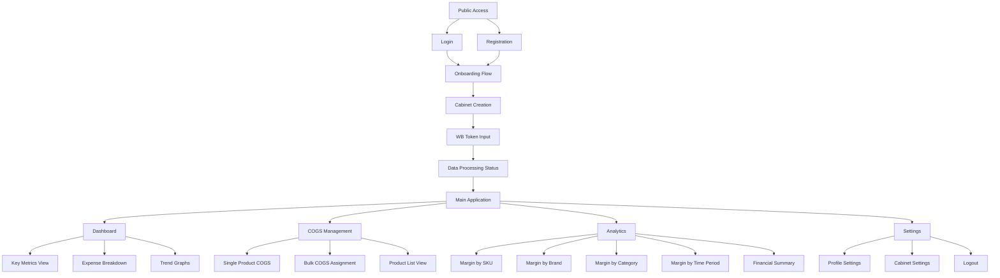
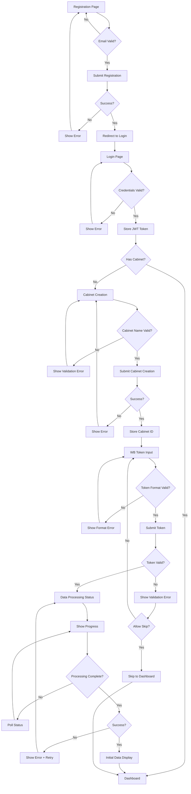
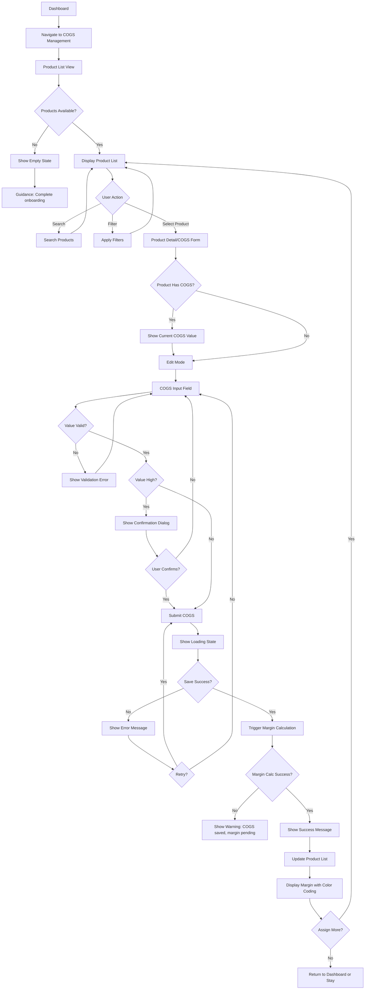
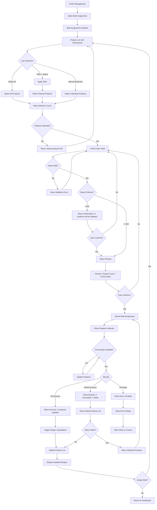
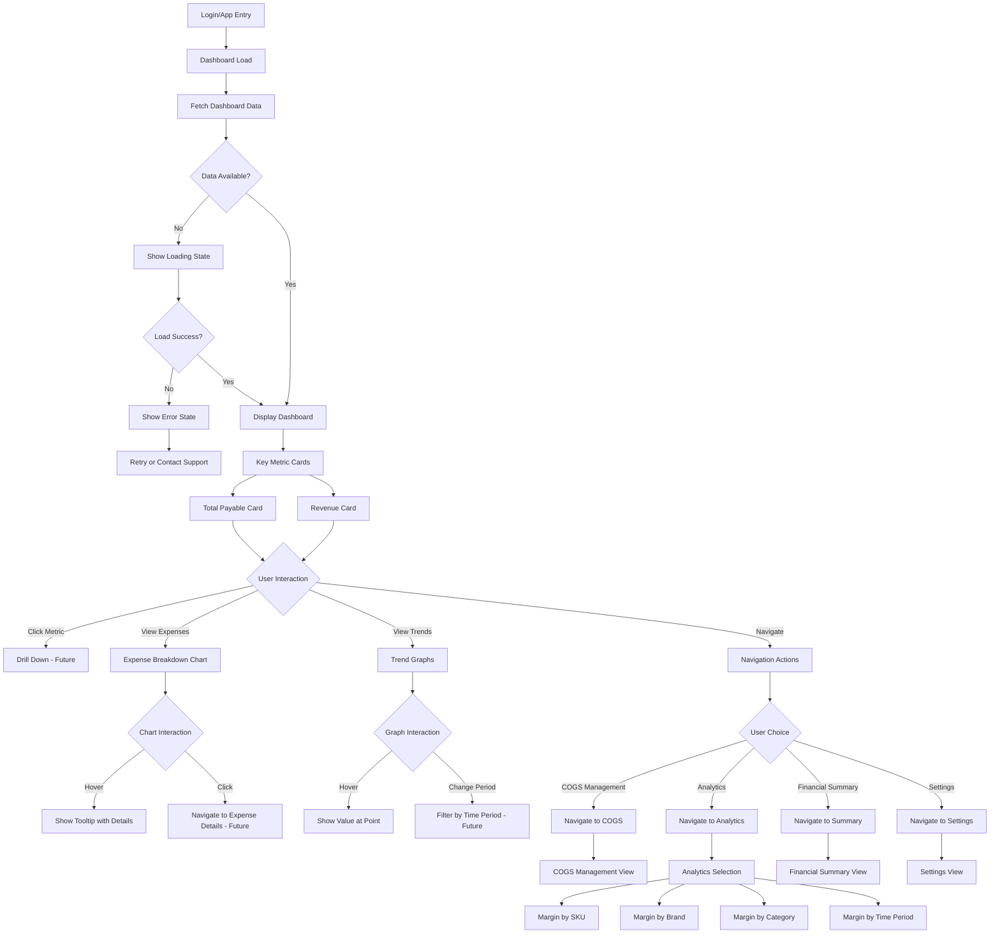

# WB Repricer System - Frontend UI/UX Specification

**Version:** 1.0  
**Date:** 2025-01-20  
**Author:** Sally (UX Expert)

---

## Introduction

This document defines the user experience goals, information architecture, user flows, and visual design specifications for WB Repricer System Frontend's user interface. It serves as the foundation for visual design and frontend development, ensuring a cohesive and user-centered experience.

The specification is based on the Product Requirements Document (PRD), Project Brief, and design system guidelines provided. It incorporates the red/white color scheme from the design kit and establishes comprehensive UI/UX standards for the financial dashboard application.

---

## Overall UX Goals & Principles

### Target User Personas

**Primary Persona: Business Owner / Entrepreneur**

- **Profile:** Small to medium-sized businesses selling on Wildberries, managing 50-5000 SKUs, monthly revenue 500K-50M RUB
- **Technical Comfort:** Moderate - comfortable with web interfaces but may have limited technical expertise
- **Primary Goals:**
  - Quickly understand which products are profitable
  - Reduce time spent on manual data processing (target: 75% reduction)
  - Make informed decisions about product portfolio management
  - Optimize pricing strategies based on real margin data
- **Key Pain Points:**
  - Manual spreadsheet calculations are time-consuming and error-prone
  - Difficulty tracking COGS across product catalog
  - Lack of real-time visibility into profitability
- **Usage Patterns:** Daily dashboard checks, weekly COGS assignment sessions, periodic deep-dive analysis

**Secondary Persona: Financial Director / CFO**

- **Profile:** Financial professionals in organizations selling on Wildberries, typically working with 1000+ SKUs
- **Technical Comfort:** High - comfortable with financial software and data analysis tools
- **Primary Goals:**
  - Provide accurate financial reporting to stakeholders
  - Support strategic decision-making with comprehensive data
  - Monitor business performance against targets
  - Identify financial risks and opportunities
- **Key Pain Points:**
  - Need comprehensive financial overviews and summaries
  - Require detailed breakdowns by various dimensions (brand, category, time)
  - Want to track financial trends and identify anomalies
- **Usage Patterns:** Regular dashboard monitoring, detailed analytics exploration, report generation for stakeholders

### Usability Goals

1. **Ease of Learning:** New users can complete onboarding (cabinet creation, WB token setup, initial data processing) within 10 minutes
2. **Efficiency of Use:** Business owners can assign COGS to products and see margin calculations with minimal clicks (target: < 3 clicks for single product COGS assignment)
3. **Error Prevention:** Clear validation and confirmation for COGS assignments, especially for bulk operations and high-value entries
4. **Memorability:** Infrequent users can return to the dashboard and understand their financial position without relearning the interface
5. **Time Savings:** Reduce time spent on financial data processing by 75% compared to manual spreadsheet methods
6. **Task Completion:** 80% of onboarded users complete the full onboarding flow within the first week
7. **Engagement:** 70% of active users access the dashboard at least 3 times per week

### Design Principles

1. **Clarity over Cleverness** - Prioritize clear communication of financial data over aesthetic innovation. Financial dashboards require immediate comprehension.
2. **Progressive Disclosure** - Show high-level metrics first (Total Payable, Revenue), with drill-down capabilities to detailed views. Don't overwhelm users with all data at once.
3. **Data-First Design** - Large, readable metric cards and clear visual hierarchy make complex financial data digestible at a glance. Numbers should be immediately readable.
4. **Immediate Feedback** - Every action (COGS assignment, data processing, API calls) should have clear, immediate visual feedback. Loading states, progress indicators, and success confirmations are essential.
5. **Consistent Patterns** - Use familiar UI patterns throughout (consistent button styles, navigation structure, form layouts) to reduce cognitive load for users managing financial data.
6. **Error Recovery** - Financial data is critical. All errors should be recoverable with clear guidance. Never lose user input without warning.
7. **Accessible by Default** - Design for all users from the start. Financial data must be accessible to users with disabilities (WCAG AA compliance).

### Change Log

| Date | Version | Description | Author |
|------|---------|-------------|--------|
| 2025-01-20 | 1.0 | Initial front-end specification creation | Sally (UX Expert) |

---

## Information Architecture (IA)

### Site Map / Screen Inventory

The application follows a hierarchical structure with authentication, onboarding, and main application areas. The main application uses a sidebar navigation pattern (as shown in the design kit) with a top navbar for global actions.



**Screen Inventory:**

**Authentication & Onboarding:**
- Login Page
- Registration Page
- Cabinet Creation (Onboarding Step 1)
- WB Token Input (Onboarding Step 2)
- Data Processing Status (Onboarding Step 3)
- Initial Data Display (Post-Onboarding)

**Main Application (Protected Routes):**
- Dashboard (Home/Default View)
- COGS Management - Single Assignment
- COGS Management - Bulk Assignment
- COGS Management - Product List
- Margin Analysis - By SKU
- Margin Analysis - By Brand
- Margin Analysis - By Category
- Margin Analysis - By Time Period
- Financial Summary View
- Settings/Profile

**Shared Components:**
- Sidebar Navigation (persistent)
- Top Navbar (persistent)
- Error Pages (404, 500, etc.)
- Loading States
- Empty States

### Navigation Structure

**Primary Navigation: Sidebar (Left)**

The sidebar navigation follows the design kit pattern with:
- Vertical menu items with icons
- Active state highlighting (red background with white text, as shown in design)
- Collapsible sub-items for nested navigation
- Persistent across all main application screens

**Navigation Items:**
1. **Dashboard** (Home icon)
   - Default landing page after login
   - Active state: Red background (#E53935 or #D32F2F) with white text
   
2. **COGS Management** (Product icon)
   - Sub-items:
     - Single Assignment
     - Bulk Assignment
     - Product List
   - Expandable/collapsible section
   
3. **Analytics** (Chart icon)
   - Sub-items:
     - Margin by SKU
     - Margin by Brand
     - Margin by Category
     - Margin by Time Period
     - Financial Summary
   - Expandable/collapsible section
   
4. **Settings** (Gear icon)
   - Sub-items:
     - Profile
     - Cabinet Settings
   - Expandable/collapsible section

5. **Logout** (Exit icon)
   - Red text color (#E53935) to indicate action
   - Positioned at bottom of sidebar
   - No sub-items

**Secondary Navigation: Top Navbar**

The top navbar (as shown in design kit) includes:
- **Left Side:**
  - Application title/logo: "WB Repricer" or "Dashboard"
  
- **Right Side:**
  - Search bar (with magnifying glass icon)
  - Notification icon (bell)
  - Messages icon (speech bubble)
  - User profile icon/avatar
  - All icons use red outline color (#E53935)

**Breadcrumb Strategy:**

Breadcrumbs are used for deep navigation within Analytics and COGS Management sections:

**Pattern:** Home > Section > Sub-section > Detail

**Examples:**
- Dashboard > Analytics > Margin by SKU
- Dashboard > COGS Management > Bulk Assignment
- Dashboard > Analytics > Margin by Brand > [Brand Name]

**Breadcrumb Design:**
- Text color: Gray (#BDBDBD for inactive, black for active)
- Separator: "/" or ">"
- Last item: Bold or different color to indicate current location
- Clickable: All items except the last are clickable links

**Navigation Behavior:**

- **Active State:** Current page/section highlighted in sidebar with red background (#E53935) and white text
- **Hover State:** Light red/pink background (#FFCDD2) on hover for interactive items
- **Disabled State:** Light gray background (#EEEEEE) with gray text (#BDBDBD) for unavailable features
- **Mobile/Tablet:** Sidebar collapses to hamburger menu, navbar remains visible with essential items

---

## User Flows

### Flow 1: New User Onboarding

**User Goal:** Complete initial setup to access financial data and begin using the system

**Entry Points:**
- User lands on registration page after signing up
- User completes registration and is redirected to login
- User logs in for the first time (no cabinet exists)

**Success Criteria:**
- User completes all onboarding steps (cabinet creation, WB token, data processing)
- User sees their processed financial data on dashboard
- User understands next steps (COGS assignment)

**Flow Diagram:**



**Edge Cases & Error Handling:**

- **Invalid Email Format:** Real-time validation prevents submission, shows inline error message
- **Duplicate Email:** Clear error message: "This email is already registered. Please log in instead."
- **Invalid Credentials:** Generic error message: "Invalid email or password" (security best practice)
- **Expired Token During Onboarding:** Detect expiration, show message, redirect to login, preserve progress if possible
- **Invalid WB Token Format:** Immediate format validation before submission, clear format requirements shown
- **WB Token Validation Failure:** Clear error: "Token validation failed. Please check your token and try again." Option to skip if backend allows
- **Data Processing Timeout (>10 minutes):** Show progress, allow user to navigate away, provide status check mechanism on return
- **Data Processing Failure:** Show error with details, provide retry button, option to contact support
- **No Products Found After Processing:** Show empty state with guidance: "No products found. Please verify your WB token or contact support."
- **Network Interruption:** Show network error, allow retry without losing form data (if secure)

**Notes:**
- Onboarding should feel guided but not restrictive - users should understand they can return to complete steps later
- Progress indicators are critical during data processing to set expectations
- Error messages should be actionable with clear next steps
- Consider allowing users to skip WB token input if backend supports adding it later

---

### Flow 2: Single Product COGS Assignment

**User Goal:** Assign Cost of Goods Sold to an individual product and see the calculated margin

**Entry Points:**
- User navigates from Dashboard to COGS Management
- User clicks on a product in the product list
- User searches for a specific product to assign COGS

**Success Criteria:**
- COGS value is successfully saved
- Margin calculation is automatically displayed
- User sees visual confirmation of successful assignment
- Product list updates to show new margin value

**Flow Diagram:**



**Edge Cases & Error Handling:**

- **No Products Available:** Show empty state with clear guidance: "Complete onboarding to see your products" or "No products found. Check your WB token."
- **Product Already Has COGS:** Show current value, allow editing, indicate when value was last updated
- **Invalid COGS Input (Negative, Non-numeric):** Real-time validation, prevent submission, show inline error: "Please enter a positive number"
- **Very Large COGS Value:** Show confirmation dialog: "This COGS value seems unusually high. Are you sure?" (threshold to be determined)
- **COGS Exceeds Revenue (Negative Margin):** Allow entry but show warning, highlight negative margin prominently in red
- **Concurrent Assignment:** Last write wins, show message if conflict detected: "This product was updated by another session"
- **API Save Failure:** Show error with retry option, preserve user input if possible
- **Margin Calculation Failure:** Show warning: "COGS saved successfully, but margin calculation is pending. Please refresh in a moment."
- **Network Timeout:** Show timeout error, allow retry, preserve form data
- **Session Expired:** Detect expired token, show message, redirect to login, preserve form state if possible

**Notes:**
- COGS input should support decimal values (e.g., 123.45 RUB)
- Visual feedback is critical - users need immediate confirmation that their financial data was saved
- Margin calculation happens automatically but may have a slight delay - show appropriate loading states
- Consider inline editing in product list for faster workflow (future enhancement)

---

### Flow 3: Bulk COGS Assignment

**User Goal:** Efficiently assign the same COGS value to multiple products at once

**Entry Points:**
- User selects "Bulk Assignment" from COGS Management menu
- User navigates from single assignment view to bulk mode
- User wants to assign COGS to many products with same value

**Success Criteria:**
- Selected products have COGS assigned
- Margins are calculated for all updated products
- User sees summary of successful and failed assignments
- Failed assignments can be retried individually

**Flow Diagram:**



**Edge Cases & Error Handling:**

- **No Products Selected:** Disable submit button, show message: "Please select at least one product"
- **Invalid COGS Value:** Same validation as single assignment, prevent bulk submission
- **Large Selection (>100 products):** Show confirmation dialog with exact count: "You are about to update 150 products. This may take a moment. Continue?"
- **Partial Success:** Show detailed results table:
  - Successfully updated: 145 products
  - Failed: 5 products (list reasons: "Product not found", "Invalid value", etc.)
  - Provide "Retry Failed" button
- **All Assignments Failed:** Show error with reasons, allow retry of entire batch or individual items
- **Timeout During Bulk Processing:** Show progress, allow cancellation, provide status check
- **Network Interruption:** Show error, preserve selection, allow retry
- **Some Products Already Have COGS:** In preview, indicate which products will be updated vs. newly assigned
- **Margin Calculation Delayed:** Show: "COGS assignments saved. Margin calculations in progress..." with refresh option

**Notes:**
- Bulk operations should feel powerful but safe - preview and confirmation are essential
- Progress indicators are critical for large batches
- Failed items should be clearly identified with actionable retry options
- Consider batch size limits if performance becomes an issue (e.g., max 500 products per batch)

---

### Flow 4: Dashboard Analysis & Navigation

**User Goal:** Quickly understand financial position and navigate to detailed analysis views

**Entry Points:**
- User logs in and lands on dashboard (default view)
- User navigates to dashboard from any section
- User returns to dashboard after completing a task

**Success Criteria:**
- User can see key metrics at a glance (Total Payable, Revenue)
- User can understand expense breakdown
- User can identify trends in financial data
- User can navigate to detailed views easily

**Flow Diagram:**



**Edge Cases & Error Handling:**

- **Empty Dashboard (No Data):** Show empty state with guidance: "Complete COGS assignment to see margin analysis" or "No financial data available. Check your WB token."
- **Partial Data Available:** Show available metrics, indicate missing data clearly: "Revenue data unavailable for this period"
- **Slow Data Load:** Show skeleton loaders, progressive data display (metrics first, charts second)
- **API Failure:** Show error message: "Unable to load dashboard data. Please try again." with retry button
- **Stale Data:** Consider showing last updated timestamp, provide refresh option
- **Very Large Dataset:** Implement pagination or data virtualization for product lists if shown on dashboard
- **Chart Rendering Failure:** Show fallback: "Chart unavailable. View data in table format." with link to table view
- **Multiple Cabinets (Future):** Show cabinet selector if user has multiple cabinets

**Notes:**
- Dashboard is the "home" - it should load quickly (< 2 seconds per NFR)
- Progressive loading: Show metrics first, then charts, then detailed data
- Interactive elements (tooltips, hover states) enhance data exploration without cluttering
- Quick navigation links should be prominent but not overwhelming
- Consider "favorites" or "pinned metrics" for power users (future enhancement)

---

## Wireframes & Mockups

### Primary Design Files

**Design System Reference:** Design Kit screenshots provided show comprehensive component library including:
- Button components (Primary, Secondary, Text) with all states
- Sidebar navigation with active states
- Navbar with search and action icons
- Dropdown menu components

**Design Tool:** Design specifications are provided via screenshots. For detailed implementation, developers should reference:
- Design Kit: Buttons, Sidebar, Navbar, Dropdown (screenshots provided)
- Color specifications: Red primary (#E53935, #D32F2F), white backgrounds, gray accents
- Component states: Default, Hover, Pressed, Disabled

**Note:** Detailed high-fidelity mockups for all screens should be created in Figma or similar design tool. The design kit provides the foundation for consistent component usage across all screens.

### Key Screen Layouts

#### Screen 1: Login Page

**Purpose:** Authenticate users and provide entry point to the application

**Key Elements:**
- Centered login form with email and password fields
- "Remember me" checkbox (optional)
- "Forgot password?" link (future feature - disabled for MVP)
- "Don't have an account? Register" link
- Application logo/branding at top
- Error message display area below form

**Interaction Notes:**
- Form validation on blur and submit
- Loading state on submit button during authentication
- Clear error messages for invalid credentials
- Redirect to dashboard on successful login
- Redirect to registration page when clicking register link

**Design File Reference:** To be created in Figma - follow design kit button styles (Primary button for "Login", Text button for "Register")

**Layout Structure:**
```
┌─────────────────────────────────┐
│        [Logo/Branding]          │
│                                 │
│    ┌─────────────────────┐     │
│    │   Email Input       │     │
│    └─────────────────────┘     │
│    ┌─────────────────────┐     │
│    │   Password Input    │     │
│    └─────────────────────┘     │
│    [ ] Remember me              │
│    [Forgot password?]           │
│                                 │
│    [Primary Button: Login]      │
│                                 │
│    Don't have account?          │
│    [Text Button: Register]      │
└─────────────────────────────────┘
```

---

#### Screen 2: Registration Page

**Purpose:** Allow new users to create accounts

**Key Elements:**
- Registration form with email and password fields
- Password confirmation field
- Password strength indicator (optional for MVP)
- Terms of service checkbox (if required)
- "Already have an account? Login" link
- Application logo/branding

**Interaction Notes:**
- Real-time email format validation
- Password requirements displayed (min length, complexity if required)
- Password confirmation must match
- Loading state during registration
- Success message and redirect to login on completion
- Clear error messages for duplicate email, weak password, etc.

**Design File Reference:** To be created in Figma - similar layout to login, Primary button for "Register"

---

#### Screen 3: Onboarding - Cabinet Creation

**Purpose:** First step of onboarding - create a cabinet to organize business data

**Key Elements:**
- Progress indicator (Step 1 of 3)
- Cabinet name input field
- Optional: Cabinet description field
- "Continue" button (Primary)
- "Skip for now" option (if backend allows)
- Help text explaining what a cabinet is

**Interaction Notes:**
- Cabinet name validation (required, min/max length)
- Real-time validation feedback
- Loading state on submit
- Success: Store cabinet ID, proceed to WB Token step
- Error handling with retry option

**Design File Reference:** To be created in Figma - clean, focused form layout

---

#### Screen 4: Onboarding - WB Token Input

**Purpose:** Collect Wildberries API token for automatic data processing

**Key Elements:**
- Progress indicator (Step 2 of 3)
- Token input field (masked for security)
- Help text with instructions on how to obtain token
- Link to WB documentation (if available)
- "Validate & Continue" button (Primary)
- "Skip for now" option (Text button, if backend allows)
- "Back" button to return to previous step

**Interaction Notes:**
- Token format validation (if format is known)
- Token validation via API on submit
- Loading state during validation
- Success: Proceed to data processing status
- Error: Show validation error, allow retry or skip
- Masked input for security (show/hide toggle)

**Design File Reference:** To be created in Figma

---

#### Screen 5: Onboarding - Data Processing Status

**Purpose:** Show progress of automatic data processing (product parsing, financial report loading)

**Key Elements:**
- Progress indicator (Step 3 of 3)
- Processing status cards:
  - Product Parsing: [Progress bar] "Processing 3 months of historical data..."
  - Financial Report Loading: [Progress bar] "Loading financial reports..."
- Estimated time remaining (if available from backend)
- "Processing..." animation/loader
- Success state: "Processing complete! Redirecting to dashboard..."
- Error state: Error message with retry button

**Interaction Notes:**
- Real-time progress updates via polling or WebSocket
- User can navigate away and return to check status
- Auto-redirect to dashboard when complete
- Clear messaging about what's happening
- Option to contact support if processing fails

**Design File Reference:** To be created in Figma - focus on progress visualization

---

#### Screen 6: Main Dashboard

**Purpose:** Primary interface showing key financial metrics and quick navigation

**Key Elements:**
- **Sidebar Navigation** (left, persistent):
  - Dashboard (active - red background)
  - COGS Management (with sub-items)
  - Analytics (with sub-items)
  - Settings (with sub-items)
  - Logout (bottom, red text)
  
- **Top Navbar** (persistent):
  - Left: "WB Repricer" or "Dashboard" title
  - Right: Search bar, Notification icon, Messages icon, User profile icon
  
- **Main Content Area:**
  - **Large Metric Cards** (prominent):
    - Total Payable card (large, blue accent)
    - Revenue card (large, blue accent)
    - Values formatted as currency (RUB) with Intl.NumberFormat
  
  - **Expense Breakdown Chart:**
    - Bar chart or pie chart showing expense categories
    - Interactive tooltips on hover
    - Color-coded (Green for positive, Red for negative)
  
  - **Trend Graphs:**
    - Line chart showing revenue/payable trends over time
    - Time period selector (weeks/months)
    - Interactive tooltips
  
  - **Quick Action Links:**
    - "Assign COGS" button (Primary)
    - "View Analytics" link
    - "Financial Summary" link

**Interaction Notes:**
- Dashboard loads progressively (metrics first, then charts)
- All charts are interactive with hover states
- Clicking metric cards may drill down (future feature)
- Quick action buttons navigate to respective sections
- Search in navbar searches across products/analytics (future feature)
- Responsive: Sidebar collapses on mobile, navbar adapts

**Design File Reference:** Design kit provides sidebar and navbar patterns. Dashboard layout to be created in Figma following these patterns.

**Layout Structure:**
```
┌──────┬────────────────────────────────────────────┐
│      │ [WB Repricer]    [Search] [🔔] [💬] [👤] │
│Side  ├────────────────────────────────────────────┤
│bar   │                                             │
│      │  ┌──────────┐  ┌──────────┐              │
│[📊]  │  │ Total    │  │ Revenue  │              │
│Dash  │  │ Payable  │  │          │              │
│board │  │ 1,234,567│  │ 2,345,678│              │
│      │  │   RUB    │  │   RUB    │              │
│[📦]  │  └──────────┘  └──────────┘              │
│COGS  │                                             │
│      │  ┌──────────────────────────┐             │
│[📈]  │  │  Expense Breakdown        │             │
│Analyt│  │  [Bar/Pie Chart]         │             │
│      │  └──────────────────────────┘             │
│[⚙️]  │                                             │
│Settin│  ┌──────────────────────────┐             │
│      │  │  Trend Graph             │             │
│[🚪]  │  │  [Line Chart]            │             │
│Logout│  └──────────────────────────┘             │
└──────┴────────────────────────────────────────────┘
```

---

#### Screen 7: COGS Management - Single Assignment

**Purpose:** Assign COGS to individual products

**Key Elements:**
- **Sidebar & Navbar** (persistent, same as dashboard)
- **Main Content:**
  - Product list/search interface
  - Product selection (click product to assign COGS)
  - COGS input form/modal:
    - Product name/SKU display
    - Current COGS value (if exists)
    - COGS input field (numeric, decimal support)
    - Validation error messages
    - "Save" button (Primary)
    - "Cancel" button (Secondary)
  - Success confirmation message
  - Updated margin display after save

**Interaction Notes:**
- Product list supports search and filtering
- Clicking product opens COGS input (inline or modal)
- Real-time validation (positive numbers, decimal support)
- Confirmation dialog for unusually high values
- Loading state during save
- Success: Show margin calculation immediately
- Error: Show error, preserve input, allow retry

**Design File Reference:** To be created in Figma - use design kit buttons (Primary for Save, Secondary for Cancel)

---

#### Screen 8: COGS Management - Bulk Assignment

**Purpose:** Assign same COGS value to multiple products efficiently

**Key Elements:**
- **Sidebar & Navbar** (persistent)
- **Main Content:**
  - Product list with checkboxes
  - "Select All" checkbox
  - Filter/search bar
  - Selection counter: "X products selected"
  - COGS input field (single value for all selected)
  - Preview section: "You are about to update X products with COGS: Y RUB"
  - "Confirm & Assign" button (Primary)
  - "Cancel" button (Secondary)
  - Progress indicator during bulk operation
  - Results summary: "X succeeded, Y failed" with details

**Interaction Notes:**
- Checkbox selection with visual feedback
- Bulk COGS input with validation
- Preview before confirmation (especially for >100 products)
- Progress bar for large batches
- Detailed results table for partial success
- Retry failed items individually

**Design File Reference:** To be created in Figma

---

#### Screen 9: Analytics - Margin by SKU

**Purpose:** View margin analysis organized by individual product SKU

**Key Elements:**
- **Sidebar & Navbar** (persistent)
- **Breadcrumb:** Dashboard > Analytics > Margin by SKU
- **Main Content:**
  - Data table with columns:
    - SKU
    - Product Name
    - COGS
    - Revenue
    - Margin % (color-coded: Green positive, Red negative)
    - Margin Amount
  - Sortable columns
  - Search/filter functionality
  - Pagination (if many products)
  - Export option (future - disabled for MVP)

**Interaction Notes:**
- Table is sortable by any column
- Margin percentages use color coding
- Clicking row may show product detail (future)
- Responsive: Table scrolls horizontally on mobile
- Loading state while fetching data

**Design File Reference:** To be created in Figma

---

#### Screen 10: Financial Summary View

**Purpose:** Comprehensive financial overview for financial directors

**Key Elements:**
- **Sidebar & Navbar** (persistent)
- **Breadcrumb:** Dashboard > Analytics > Financial Summary
- **Main Content:**
  - Summary metric cards (multiple metrics)
  - Financial data table
  - Basic filtering (time period, category if applicable)
  - Key performance indicators
  - Links to detailed analytics views

**Interaction Notes:**
- Filter controls at top
- Data updates based on filters
- Clear indication of filtered vs. unfiltered data
- Loading states during filter changes

**Design File Reference:** To be created in Figma

---

## Component Library / Design System

### Design System Approach

**Foundation:** The design system is based on the provided Design Kit screenshots which establish:
- Red primary color scheme (#E53935, #D32F2F)
- White backgrounds for clean, professional appearance
- Gray accents for neutral elements (#EEEEEE, #BDBDBD)
- Consistent component states (Default, Hover, Pressed, Disabled)

**Component Library Base: shadcn/ui**

We will use **shadcn/ui** as the foundation component library, which provides:
- High-quality, accessible components built on Radix UI primitives
- Tailwind CSS for styling (allows easy customization)
- Copy-paste component architecture (components live in your codebase, not as dependencies)
- TypeScript support out of the box
- Built-in accessibility features (WCAG AA compliant)

**Customization Strategy:**

1. **Install shadcn/ui** following their setup guide for Next.js + TypeScript
2. **Customize Tailwind theme** in `tailwind.config.ts` to match our design system:
   - Primary colors: Red (#E53935, #D32F2F)
   - Neutral colors: Gray scale (#EEEEEE, #BDBDBD, etc.)
   - Spacing, typography, border radius to match specifications
3. **Override component styles** in `src/components/ui/` after copying from shadcn/ui:
   - Customize Button component variants (primary red, secondary outlined)
   - Customize Input, Select, Dropdown components with red accent colors
   - Customize Sidebar and Navbar components (custom components based on shadcn/ui patterns)
4. **Create custom components** where needed:
   - Sidebar Navigation (custom, but using shadcn/ui patterns)
   - Metric Cards (custom component)
   - Data Tables (based on shadcn/ui Table component)

**Component Philosophy:**
- **Reusability:** Components are designed to be reused across all screens
- **Consistency:** All components follow the same visual language and interaction patterns
- **Accessibility:** All components meet WCAG AA standards (inherited from shadcn/ui + Radix UI)
- **Responsive:** Components adapt gracefully across device sizes (Tailwind responsive utilities)

**Implementation Notes:**
- Components will be based on shadcn/ui, customized to match our red/white design system
- Each component should be in its own file (< 200 lines per file constraint)
- Component library structure: `src/components/ui/` for shadcn/ui components
- Custom components: `src/components/custom/` for project-specific components (Sidebar, MetricCard, etc.)
- Design tokens (colors, spacing, typography) configured in `tailwind.config.ts` and `src/lib/utils.ts` (cn utility)
- Use shadcn/ui's `cn()` utility for conditional class merging

**shadcn/ui Components to Use:**
- `Button` - Customized with red primary variant
- `Input` - Customized with red focus border
- `Select` / `Dropdown` - Customized with red accent
- `Dialog` / `Modal` - For confirmations and forms
- `Table` - For data tables (product lists, analytics)
- `Card` - For metric cards and content containers
- `Label` - For form labels
- `Toast` / `Alert` - For notifications and error messages
- `Skeleton` - For loading states
- `Progress` - For progress indicators (onboarding, bulk operations)

### Core Components

#### Component 1: Primary Button

**Base Component:** shadcn/ui `Button` component

**Purpose:** Primary call-to-action buttons for main user actions (Save, Continue, Confirm, Login, etc.)

**Implementation:**
- Copy shadcn/ui Button component: `npx shadcn-ui@latest add button`
- Customize in `src/components/ui/button.tsx`:
  - Add custom `variant="primary"` with red background (#E53935)
  - Override default shadcn/ui colors in Tailwind config
  - Maintain shadcn/ui's built-in variants (default, destructive, outline, ghost, link) but add our custom red primary

**Variants:**
- **Primary (Custom):** Solid red background (#E53935), white text, rounded corners
- **Alternative Primary:** Slightly darker red (#D32F2F) for destructive or distinct actions
- **Disabled State:** Light pink background (#FFCDD2), light gray text (#BDBDBD), not clickable

**States:**
- **Default:** Solid red (#E53935), white text, cursor pointer
- **Hover:** Slightly darker red (#D32F2F), subtle shadow (optional)
- **Pressed/Active:** Darker red (#D32F2F), slight scale down (optional)
- **Disabled:** Light pink (#FFCDD2), gray text (#BDBDBD), cursor not-allowed
- **Loading:** Use shadcn/ui's built-in loading state or add spinner, disable interaction, maintain red background

**Usage Guidelines:**
- Use for primary actions: "Save", "Continue", "Login", "Confirm", "Assign COGS"
- One primary button per screen/section (visual hierarchy)
- Button text should be action-oriented and clear ("Save COGS" not "Submit")
- Minimum touch target: 44x44px for accessibility (shadcn/ui handles this)
- Full width on mobile, auto-width on desktop (with min-width)

**Tailwind Customization:**
```typescript
// tailwind.config.ts
theme: {
  extend: {
    colors: {
      primary: {
        DEFAULT: '#E53935',
        dark: '#D32F2F',
        light: '#FFCDD2',
      },
    },
  },
}
```

**Design Specifications:**
- **Height:** 40-48px (desktop), 44px minimum (mobile) - configured via Tailwind classes
- **Padding:** 12px 24px (horizontal, vertical) - `px-6 py-3`
- **Border Radius:** 4-8px (slightly rounded corners) - `rounded-md` or `rounded-lg`
- **Font:** Same as body, weight: 500-600 (medium to semi-bold) - `font-medium` or `font-semibold`
- **Text Color:** White (#FFFFFF) - `text-white`
- **Background:** #E53935 (default), #D32F2F (pressed/alternative) - `bg-primary` / `bg-primary-dark`
- **Disabled Background:** #FFCDD2 - `bg-primary-light`
- **Disabled Text:** #BDBDBD - `text-gray-400`

---

#### Component 2: Secondary Button

**Base Component:** shadcn/ui `Button` component with `variant="outline"`

**Purpose:** Secondary actions, cancel operations, alternative choices (Cancel, Back, Skip)

**Implementation:**
- Use shadcn/ui Button with `variant="outline"` as base
- Customize in `src/components/ui/button.tsx`:
  - Override outline variant colors to use red border (#E53935) instead of default
  - Add hover state with light pink background (#FFCDD2)

**Variants:**
- **Default State:** White background, thin red border (#E53935), red text (#E53935)
- **Hover State:** Light pink background (#FFCDD2), red border, red text
- **Pressed State:** Solid light red background, red border, white text
- **Disabled State:** White background, light gray border (#BDBDBD), light gray text (#BDBDBD)

**States:**
- **Default:** White background, red border 1-2px, red text, cursor pointer
- **Hover:** Light pink background (#FFCDD2), red border, red text
- **Pressed:** Light red background, red border, white text
- **Disabled:** White background, gray border (#BDBDBD), gray text (#BDBDBD), cursor not-allowed

**Usage Guidelines:**
- Use for secondary actions: "Cancel", "Back", "Skip", "Edit"
- Often paired with Primary button (e.g., "Cancel" + "Save")
- Provides visual hierarchy - less prominent than Primary
- Same size specifications as Primary button for consistency

**Tailwind Customization:**
```typescript
// In button.tsx, customize outline variant:
outline: "border-primary text-primary hover:bg-primary-light hover:text-primary",
```

**Design Specifications:**
- **Height:** 40-48px (matches Primary) - same Tailwind classes
- **Padding:** 12px 24px - `px-6 py-3`
- **Border Radius:** 4-8px (matches Primary) - `rounded-md` or `rounded-lg`
- **Border:** 1-2px solid #E53935 - `border border-primary`
- **Background:** White (#FFFFFF) default, #FFCDD2 hover - `bg-white hover:bg-primary-light`
- **Text Color:** #E53935 (default), white (pressed) - `text-primary`
- **Disabled Border:** #BDBDBD - `border-gray-400`
- **Disabled Text:** #BDBDBD - `text-gray-400`

---

#### Component 3: Text Button

**Purpose:** Tertiary actions, links that look like buttons, less prominent actions (View Details, Learn More)

**Variants:**
- **Default State:** Red text (#E53935), no background, no border
- **Hover/Pressed State:** Red text with underline, or light gray text (#BDBDBD) with underline
- **Disabled State:** Light gray text (#BDBDBD), no underline, not clickable

**States:**
- **Default:** Red text (#E53935), no decoration, cursor pointer
- **Hover:** Red text with underline, or gray text (#BDBDBD) with underline
- **Pressed:** Same as hover (visual feedback)
- **Disabled:** Gray text (#BDBDBD), cursor not-allowed

**Usage Guidelines:**
- Use for less critical actions: "View Details", "Skip for now", "Learn more"
- Can be used inline with text
- Minimal visual weight - doesn't compete with Primary/Secondary buttons
- Often used in navigation or as links

**Design Specifications:**
- **Height:** Auto (text height)
- **Padding:** 4-8px (minimal, for touch target)
- **Text Color:** #E53935 (default), #BDBDBD (disabled)
- **Text Decoration:** None (default), underline (hover)
- **Font:** Same as body text, weight: 400-500

---

#### Component 4: Sidebar Navigation

**Purpose:** Primary navigation menu, persistent across all main application screens

**Variants:**
- **Default Menu Item:** White background, black text, icon on left
- **Active Menu Item:** Red background (#E53935 or #D32F2F), white text, white icon
- **Hover State:** Light pink background (#FFCDD2), red text
- **Sub-items:** Indented, smaller text, shown when parent is expanded

**States:**
- **Default:** White background, black text, icon visible
- **Hover:** Light pink background (#FFCDD2), red text
- **Active/Selected:** Red background (#E53935), white text, white icon
- **Expanded:** Parent item shows sub-items below (indented)
- **Collapsed:** Sub-items hidden, parent shows expand icon

**Usage Guidelines:**
- Always visible on left side of main application screens
- Top-level items: Dashboard, COGS Management, Analytics, Settings
- Sub-items shown when parent is clicked/expanded
- Active state clearly indicates current page
- Logout item at bottom, red text to indicate action
- Collapsible on mobile (hamburger menu)

**Design Specifications:**
- **Width:** 240-280px (desktop), full width when expanded on mobile
- **Background:** White (#FFFFFF)
- **Active Background:** #E53935 or #D32F2F
- **Hover Background:** #FFCDD2
- **Text Color:** Black (default), White (active), Red (#E53935) for logout
- **Icon Size:** 20-24px
- **Item Height:** 48-56px
- **Padding:** 16px horizontal, 12px vertical
- **Border Radius:** 0 (rectangular) or 4px for active state

---

#### Component 5: Top Navbar

**Purpose:** Global navigation bar with search, notifications, and user profile access

**Variants:**
- **Default:** White background, black title text, red outline icons
- **Search Bar:** Light gray border (#EEEEEE or #BDBDBD), placeholder text
- **Icons:** Red outline (#E53935), hover state with fill or darker red

**States:**
- **Default:** White background, all elements visible
- **Search Focused:** Search bar border becomes red (#E53935), active state
- **Icon Hover:** Icon color darkens or fills, subtle background
- **User Menu Open:** Dropdown appears below user icon

**Usage Guidelines:**
- Persistent across all screens (except auth pages)
- Left side: Application title/logo
- Right side: Search, Notifications, Messages, User Profile (in order)
- Search functionality (future - placeholder for MVP)
- Icons should have tooltips on hover
- User profile icon opens dropdown menu (Settings, Logout)

**Design Specifications:**
- **Height:** 64-72px
- **Background:** White (#FFFFFF)
- **Border Bottom:** 1px solid #EEEEEE (subtle separation)
- **Padding:** 16-24px horizontal
- **Icon Size:** 24px
- **Icon Color:** #E53935 (red outline)
- **Search Bar:** Height 40px, border 1px #EEEEEE, border-radius 4px
- **Title Font:** 18-20px, weight: 600-700 (semi-bold to bold)

---

#### Component 6: Dropdown Menu / Select

**Base Component:** shadcn/ui `Select` component (built on Radix UI Select)

**Purpose:** Select options from a list, filter selections, menu dropdowns

**Implementation:**
- Copy shadcn/ui Select component: `npx shadcn-ui@latest add select`
- Customize in `src/components/ui/select.tsx`:
  - Override trigger border color to red (#E53935)
  - Customize dropdown content styling
  - Maintain Radix UI accessibility features

**Variants:**
- **Closed State:** White background, thin red border (#E53935), black text "Select Option", red caret icon
- **Open State:** White panel below button, list of options (Option 1, Option 2, Option 3)
- **Selected Option:** Highlighted (light pink background or red text)

**States:**
- **Closed:** Button appearance, shows selected value or placeholder
- **Open:** Dropdown panel appears below, shows options list (Radix UI handles this)
- **Hover (Option):** Light pink background (#FFCDD2) or red text
- **Selected (Option):** Visual indication (background or checkmark)
- **Disabled:** Gray background, gray text, not clickable

**Usage Guidelines:**
- Use for selecting from predefined options
- Can be used in filters, form selects, navigation menus
- Radix UI handles: closing on outside click, keyboard navigation (Arrow keys, Enter, Escape)
- Accessible: Built-in ARIA labels and keyboard support from Radix UI

**Tailwind Customization:**
```typescript
// In select.tsx, customize trigger:
trigger: "flex h-10 w-full items-center justify-between rounded-md border border-primary bg-white px-3 py-2 text-sm focus:outline-none focus:ring-2 focus:ring-primary",
// Customize content (dropdown panel):
content: "relative z-50 min-w-[8rem] overflow-hidden rounded-md border bg-white shadow-md",
// Customize option hover:
item: "hover:bg-primary-light hover:text-primary",
```

**Design Specifications:**
- **Button Height:** 40px (matches input fields) - `h-10`
- **Border:** 1px solid #E53935 - `border border-primary`
- **Border Radius:** 4px - `rounded-md`
- **Background:** White (#FFFFFF) - `bg-white`
- **Text Color:** Black (default), Red (#E53935) for selected - `text-black` / `text-primary`
- **Caret Icon:** Red (#E53935), 16px, positioned right - shadcn/ui includes ChevronDown icon
- **Dropdown Panel:** White background, shadow for depth, max-height with scroll - `bg-white shadow-md`
- **Option Height:** 40-48px - `h-10` or `h-12`
- **Option Padding:** 12px 16px - `px-4 py-3`
- **Hover Background:** #FFCDD2 - `hover:bg-primary-light`

---

#### Component 7: Input Field

**Base Component:** shadcn/ui `Input` component

**Purpose:** Text input, numeric input, password input, search input

**Implementation:**
- Copy shadcn/ui Input component: `npx shadcn-ui@latest add input`
- Customize in `src/components/ui/input.tsx`:
  - Override focus ring color to red (#E53935)
  - Add error state styling with red border
  - Maintain shadcn/ui's accessibility features

**Variants:**
- **Default:** White background, light gray border (#EEEEEE or #BDBDBD), black text
- **Focused:** Red border (#E53935), active state with red focus ring
- **Error:** Red border (#E53935 or #D32F2F), error message below (use shadcn/ui Form components)
- **Disabled:** Light gray background (#EEEEEE), gray text (#BDBDBD), gray border

**States:**
- **Default:** White background, gray border, black text
- **Focus:** Red border (#E53935), red focus ring (Tailwind `focus:ring-primary`)
- **Error:** Red border, red error message text below field (use shadcn/ui Form + Label)
- **Disabled:** Gray background (#EEEEEE), gray text, not editable
- **Loading:** Show spinner icon (for async validation) - custom addition

**Usage Guidelines:**
- Use for all text/numeric inputs (email, password, COGS, search)
- Use shadcn/ui `Label` component for labels
- Use shadcn/ui `Form` components for validation and error messages
- Support for helper text below field
- Password fields: Use `type="password"` with show/hide toggle (custom addition)
- Numeric inputs (COGS): Use `type="number"` or `inputMode="decimal"` with validation

**Tailwind Customization:**
```typescript
// In input.tsx, customize focus ring:
className={cn(
  "flex h-10 w-full rounded-md border border-gray-300 bg-white px-3 py-2 text-sm",
  "focus:border-primary focus:ring-2 focus:ring-primary focus:ring-offset-2",
  "disabled:bg-gray-100 disabled:text-gray-400",
  "file:border-0 file:bg-transparent file:text-sm file:font-medium",
  className
)}
```

**Design Specifications:**
- **Height:** 40-48px - `h-10` or `h-12`
- **Padding:** 12px 16px - `px-4 py-3`
- **Border:** 1px solid #EEEEEE (default), #E53935 (focused/error) - `border border-gray-300 focus:border-primary`
- **Border Radius:** 4px - `rounded-md`
- **Background:** White (#FFFFFF), #EEEEEE (disabled) - `bg-white disabled:bg-gray-100`
- **Text Color:** Black (default), #BDBDBD (disabled) - `text-black disabled:text-gray-400`
- **Placeholder Color:** #BDBDBD - `placeholder:text-gray-400`
- **Error Text Color:** #E53935 or #D32F2F - use shadcn/ui Form error message styling
- **Font Size:** 14-16px - `text-sm` or `text-base`

---

#### Component 8: Metric Card

**Base Component:** shadcn/ui `Card` component

**Purpose:** Display key financial metrics prominently on dashboard

**Implementation:**
- Copy shadcn/ui Card component: `npx shadcn-ui@latest add card`
- Create custom `MetricCard` component in `src/components/custom/MetricCard.tsx`:
  - Use shadcn/ui Card as base structure
  - Customize for financial metrics display
  - Add size variants (large, standard, small)
  - Use shadcn/ui Skeleton for loading states

**Variants:**
- **Large Metric Card:** Primary metrics (Total Payable, Revenue) - extra large, prominent
- **Standard Metric Card:** Secondary metrics - standard size
- **Small Metric Card:** Tertiary metrics - compact size

**States:**
- **Default:** White background, border or shadow, metric value displayed
- **Loading:** Use shadcn/ui Skeleton component for loading state
- **Error:** Error message or "N/A" display
- **Empty:** Placeholder text or empty state message

**Usage Guidelines:**
- Large cards for primary metrics (Total Payable, Revenue)
- Use blue accent color for primary metrics (per PRD color coding)
- Values formatted as currency (RUB) using Intl.NumberFormat
- Include metric label above value
- Optional: Trend indicator (up/down arrow) or comparison
- Clickable for drill-down (future feature)

**Implementation Example:**
```typescript
// src/components/custom/MetricCard.tsx
import { Card, CardContent, CardHeader, CardTitle } from "@/components/ui/card"
import { Skeleton } from "@/components/ui/skeleton"

interface MetricCardProps {
  title: string
  value: number | string
  isLoading?: boolean
  variant?: "large" | "standard" | "small"
}

export function MetricCard({ title, value, isLoading, variant = "standard" }: MetricCardProps) {
  const sizeClasses = {
    large: "min-h-[160px] p-6",
    standard: "min-h-[100px] p-5",
    small: "min-h-[80px] p-4",
  }
  
  return (
    <Card className={sizeClasses[variant]}>
      <CardHeader>
        <CardTitle className="text-sm font-medium text-gray-600">{title}</CardTitle>
      </CardHeader>
      <CardContent>
        {isLoading ? (
          <Skeleton className="h-8 w-24" />
        ) : (
          <div className="text-3xl font-bold">{value}</div>
        )}
      </CardContent>
    </Card>
  )
}
```

**Design Specifications:**
- **Large Card:** Min-height 120-160px, padding 24px - `min-h-[160px] p-6`
- **Standard Card:** Min-height 100px, padding 20px - `min-h-[100px] p-5`
- **Background:** White (#FFFFFF) - shadcn/ui Card default
- **Border/Shadow:** Subtle border or shadow for depth - shadcn/ui Card default
- **Border Radius:** 8-12px - `rounded-lg` or `rounded-xl`
- **Value Font:** 32-48px (large), 24-32px (standard), weight: 600-700 - `text-3xl font-bold` or `text-4xl font-bold`
- **Label Font:** 14-16px, weight: 400-500, color: gray - `text-sm font-medium text-gray-600`
- **Accent Color:** Blue for primary metrics (to be defined in color palette)

---

#### Component 9: Data Table

**Base Component:** shadcn/ui `Table` component

**Purpose:** Display tabular data (products, analytics, financial data)

**Implementation:**
- Copy shadcn/ui Table component: `npx shadcn-ui@latest add table`
- Use shadcn/ui Table structure (Table, TableHeader, TableBody, TableRow, TableHead, TableCell)
- Customize styling for alternating rows and hover states
- Add sortable headers (custom implementation or use a library like TanStack Table)
- Use shadcn/ui Checkbox for selectable rows

**Variants:**
- **Default Table:** White background, alternating row colors for readability
- **Sortable Header:** Clickable column headers with sort indicators (custom implementation)
- **Selectable Rows:** Use shadcn/ui Checkbox for bulk operations
- **Hover State:** Row highlight on hover

**States:**
- **Default Row:** White or light gray background (#F9F9F9)
- **Hover Row:** Light pink background (#FFCDD2) or light gray
- **Selected Row:** Light red background or border highlight
- **Loading:** Use shadcn/ui Skeleton for loading rows
- **Empty:** Empty state message (custom component)

**Usage Guidelines:**
- Use for product lists, analytics tables, financial data
- Sortable columns indicated by arrow icons (custom implementation)
- Color-code important columns (e.g., margin %: Green positive, Red negative)
- Responsive: Horizontal scroll on mobile, or stack columns
- Pagination for large datasets (custom or use TanStack Table)
- Search/filter above table (use shadcn/ui Input)

**Tailwind Customization:**
```typescript
// Customize table rows in your component:
<TableRow className="hover:bg-primary-light even:bg-gray-50">
  <TableCell className="px-4 py-3">...</TableCell>
</TableRow>

// Customize header:
<TableHead className="bg-gray-100 font-semibold text-sm">...</TableHead>
```

**Design Specifications:**
- **Header Background:** Light gray (#F5F5F5) or white - `bg-gray-100` or `bg-white`
- **Header Text:** 14px, weight: 600, color: black - `text-sm font-semibold`
- **Row Height:** 48-56px - `h-12` or `h-14`
- **Cell Padding:** 12px 16px - `px-4 py-3`
- **Border:** 1px solid #EEEEEE between rows - shadcn/ui Table default or custom `border-b border-gray-200`
- **Alternating Rows:** #F9F9F9 (every other row) - `even:bg-gray-50`
- **Hover Background:** #FFCDD2 or #F5F5F5 - `hover:bg-primary-light` or `hover:bg-gray-100`
- **Font Size:** 14px (body), 12px (secondary data) - `text-sm` or `text-xs`

---

#### Component 10: Modal/Dialog

**Base Component:** shadcn/ui `Dialog` component (built on Radix UI Dialog)

**Purpose:** Confirmation dialogs, form modals, important messages

**Implementation:**
- Copy shadcn/ui Dialog component: `npx shadcn-ui@latest add dialog`
- Customize in `src/components/ui/dialog.tsx`:
  - Maintain Radix UI's built-in features (backdrop, focus trap, keyboard handling)
  - Customize styling to match design system
  - Use shadcn/ui Button components for footer actions

**Variants:**
- **Confirmation Dialog:** "Are you sure?" type dialogs with Cancel/Confirm buttons
- **Form Modal:** Larger modal for forms (COGS assignment, etc.)
- **Alert Modal:** Error or success messages (can use shadcn/ui Alert component inside Dialog)

**States:**
- **Open:** Modal visible with backdrop overlay (Radix UI handles this)
- **Closing:** Fade out animation (Radix UI animation)
- **Backdrop:** Semi-transparent dark overlay (Radix UI Overlay component)

**Usage Guidelines:**
- Use for important confirmations (bulk operations, destructive actions)
- Use for focused forms that shouldn't navigate away
- Modal is centered on screen (Radix UI default)
- Close on backdrop click: Configurable via Radix UI props
- Close on Escape key: Built-in Radix UI feature
- Focus trap: Built-in Radix UI feature (keyboard navigation stays within modal)
- Accessible: Built-in ARIA labels and focus management from Radix UI

**Tailwind Customization:**
```typescript
// In dialog.tsx, customize overlay (backdrop):
overlay: "fixed inset-0 z-50 bg-black/50",
// Customize content (modal):
content: "fixed left-[50%] top-[50%] z-50 grid w-full max-w-lg translate-x-[-50%] translate-y-[-50%] gap-4 border bg-white p-6 shadow-lg duration-200 rounded-lg",
// Customize header and footer:
header: "flex flex-col space-y-1.5 text-center sm:text-left",
footer: "flex flex-col-reverse sm:flex-row sm:justify-end sm:space-x-2",
```

**Design Specifications:**
- **Width:** 400-600px (standard), up to 800px (large forms) - `max-w-lg` or `max-w-2xl`
- **Max Width:** 90vw (responsive) - `max-w-[90vw]`
- **Background:** White (#FFFFFF) - `bg-white`
- **Border Radius:** 8-12px - `rounded-lg` or `rounded-xl`
- **Padding:** 24-32px - `p-6` or `p-8`
- **Backdrop:** rgba(0, 0, 0, 0.5) - semi-transparent black - `bg-black/50`
- **Shadow:** Large shadow for depth - `shadow-lg`
- **Header:** Bold title, close button (X) in top right - shadcn/ui includes DialogTitle and DialogClose
- **Footer:** Button group (Cancel Secondary, Confirm Primary) - use shadcn/ui Button components

---

### Additional shadcn/ui Components

**Components to Install:**
- `Card` - For Metric Cards and content containers
- `Table` - For data tables (product lists, analytics)
- `Label` - For form labels
- `Form` - For form validation and error handling (react-hook-form integration)
- `Toast` / `Alert` - For notifications and error messages
- `Skeleton` - For loading states
- `Progress` - For progress indicators (onboarding, bulk operations)
- `Checkbox` - For bulk selection in tables
- `Separator` - For visual dividers
- `Badge` - For status indicators

**Custom Components (Not from shadcn/ui):**
- **Sidebar Navigation** - Custom component using shadcn/ui patterns and Tailwind styling
- **Top Navbar** - Custom component with search, icons, user menu
- **Metric Card** - Custom component based on shadcn/ui Card, customized for financial metrics

---

### Tailwind CSS Configuration

**Setup Instructions:**

1. **Install Tailwind CSS** (if not already installed):
   ```bash
   npm install -D tailwindcss postcss autoprefixer
   npx tailwindcss init -p
   ```

2. **Configure `tailwind.config.ts`** with custom colors:

```typescript
import type { Config } from "tailwindcss"

const config: Config = {
  darkMode: ["class"],
  content: [
    "./src/pages/**/*.{js,ts,jsx,tsx,mdx}",
    "./src/components/**/*.{js,ts,jsx,tsx,mdx}",
    "./src/app/**/*.{js,ts,jsx,tsx,mdx}",
  ],
  theme: {
    extend: {
      colors: {
        primary: {
          DEFAULT: '#E53935',
          dark: '#D32F2F',
          light: '#FFCDD2',
        },
        background: "hsl(var(--background))",
        foreground: "hsl(var(--foreground))",
        // shadcn/ui default colors (keep for compatibility)
        card: {
          DEFAULT: "hsl(var(--card))",
          foreground: "hsl(var(--card-foreground))",
        },
        // ... other shadcn/ui colors
      },
      borderRadius: {
        lg: "var(--radius)",
        md: "calc(var(--radius) - 2px)",
        sm: "calc(var(--radius) - 4px)",
      },
    },
  },
  plugins: [require("tailwindcss-animate")],
}
export default config
```

3. **Configure CSS Variables** in `src/app/globals.css` (or your global CSS file):

```css
@tailwind base;
@tailwind components;
@tailwind utilities;

@layer base {
  :root {
    --background: 0 0% 100%;
    --foreground: 0 0% 3.9%;
    --card: 0 0% 100%;
    --card-foreground: 0 0% 3.9%;
    --primary: 229 63% 53%; /* #E53935 converted to HSL */
    --primary-foreground: 0 0% 100%;
    --secondary: 0 0% 96.1%;
    --secondary-foreground: 0 0% 9%;
    --muted: 0 0% 96.1%;
    --muted-foreground: 0 0% 45.1%;
    --accent: 0 0% 96.1%;
    --accent-foreground: 0 0% 9%;
    --destructive: 0 84.2% 60.2%;
    --destructive-foreground: 0 0% 98%;
    --border: 0 0% 89.8%;
    --input: 0 0% 89.8%;
    --ring: 229 63% 53%; /* Primary red for focus rings */
    --radius: 0.5rem;
  }
}
```

4. **Install shadcn/ui**:
   ```bash
   npx shadcn-ui@latest init
   ```
   Follow the setup wizard, selecting:
   - TypeScript: Yes
   - Style: Default
   - Base color: Custom (we'll override)
   - CSS variables: Yes

5. **Install Required Components**:
   ```bash
   npx shadcn-ui@latest add button
   npx shadcn-ui@latest add input
   npx shadcn-ui@latest add select
   npx shadcn-ui@latest add dialog
   npx shadcn-ui@latest add card
   npx shadcn-ui@latest add table
   npx shadcn-ui@latest add label
   npx shadcn-ui@latest add form
   npx shadcn-ui@latest add toast
   npx shadcn-ui@latest add skeleton
   npx shadcn-ui@latest add progress
   npx shadcn-ui@latest add checkbox
   ```

6. **Customize Components**:
   - After installing, customize each component in `src/components/ui/` to match the red/white design system
   - Override default colors with our primary red (#E53935)
   - Maintain shadcn/ui's accessibility features and structure

**Color Palette Reference:**

```typescript
// Primary Colors
primary: {
  DEFAULT: '#E53935',  // Main red
  dark: '#D32F2F',     // Darker red (hover, pressed)
  light: '#FFCDD2',    // Light pink (hover backgrounds, disabled)
}

// Neutral Colors
gray: {
  100: '#F5F5F5',      // Light backgrounds
  200: '#EEEEEE',      // Borders, disabled backgrounds
  300: '#E0E0E0',      // Subtle borders
  400: '#BDBDBD',      // Disabled text, placeholders
  500: '#9E9E9E',      // Secondary text
  600: '#757575',      // Body text
  700: '#616161',      // Headings
  800: '#424242',      // Dark text
  900: '#212121',      // Very dark text
}

// Semantic Colors
success: '#4CAF50',    // Green for positive margins
error: '#E53935',      // Red for negative margins, errors
warning: '#FF9800',    // Orange for warnings
info: '#2196F3',       // Blue for information
```

---

## Visual Design

### Color Palette

**Primary Colors:**

The application uses a red-based primary color scheme derived from the design kit:

- **Primary Red (#E53935):** Main brand color, used for:
  - Primary buttons
  - Active navigation states
  - Focus rings and active states
  - Error messages and destructive actions
  - Icons and accents
  
- **Primary Dark (#D32F2F):** Darker variant for:
  - Hover states on primary buttons
  - Pressed/active button states
  - Alternative primary actions
  
- **Primary Light (#FFCDD2):** Light pink for:
  - Hover backgrounds (sidebar items, table rows)
  - Disabled button backgrounds
  - Subtle highlights and accents

**Neutral Colors:**

- **White (#FFFFFF):** Primary background color for:
  - Page backgrounds
  - Card backgrounds
  - Input field backgrounds
  - Modal/dialog backgrounds

- **Gray Scale:**
  - **Gray 100 (#F5F5F5):** Light backgrounds (table headers, subtle sections)
  - **Gray 200 (#EEEEEE):** Borders, disabled input backgrounds
  - **Gray 300 (#E0E0E0):** Subtle borders and dividers
  - **Gray 400 (#BDBDBD):** Disabled text, placeholders, inactive elements
  - **Gray 500 (#9E9E9E):** Secondary text, icons
  - **Gray 600 (#757575):** Body text, labels
  - **Gray 700 (#616161):** Headings, emphasized text
  - **Gray 800 (#424242):** Dark text, strong emphasis
  - **Gray 900 (#212121):** Very dark text, maximum contrast

**Semantic Colors:**

- **Success Green (#4CAF50):** Used for:
  - Positive margin percentages
  - Success messages and confirmations
  - Positive financial indicators
  
- **Error Red (#E53935):** Used for:
  - Error messages and validation failures
  - Negative margin percentages
  - Destructive actions (when not using primary red)
  
- **Warning Orange (#FF9800):** Used for:
  - Warning messages
  - Caution indicators
  - Important notices
  
- **Info Blue (#2196F3):** Used for:
  - Informational messages
  - Primary metric cards (Total Payable, Revenue) - per PRD requirement
  - Help text and tooltips

**Color Usage Guidelines:**

- **Contrast Requirements:** All text must meet WCAG AA standards (4.5:1 for normal text, 3:1 for large text)
- **Primary Actions:** Use primary red (#E53935) for main call-to-action buttons
- **Secondary Actions:** Use outlined buttons with red border and text
- **Data Visualization:** Use semantic colors consistently (green for positive, red for negative)
- **Accessibility:** Never rely solely on color to convey information; use icons, text, or patterns as well

---

### Typography

**Font Stack:**

The application uses system fonts for optimal performance and consistency:

```css
font-family: -apple-system, BlinkMacSystemFont, "Segoe UI", Roboto, "Helvetica Neue", Arial, sans-serif;
```

**Font Sizes & Hierarchy:**

- **H1 (Page Title):** 32-36px, weight: 700 (bold)
  - Used for: Main page titles, dashboard headers
  - Tailwind: `text-3xl font-bold` or `text-4xl font-bold`
  
- **H2 (Section Title):** 24-28px, weight: 600-700 (semi-bold to bold)
  - Used for: Section headers, card titles, modal titles
  - Tailwind: `text-2xl font-semibold` or `text-2xl font-bold`
  
- **H3 (Subsection Title):** 20-24px, weight: 600 (semi-bold)
  - Used for: Subsection headers, form section titles
  - Tailwind: `text-xl font-semibold`
  
- **H4 (Card Title):** 18px, weight: 600 (semi-bold)
  - Used for: Card headers, metric labels
  - Tailwind: `text-lg font-semibold`
  
- **Body Large:** 16px, weight: 400 (regular)
  - Used for: Important body text, descriptions
  - Tailwind: `text-base`
  
- **Body (Default):** 14-16px, weight: 400 (regular)
  - Used for: Standard body text, form labels, table content
  - Tailwind: `text-sm` or `text-base`
  
- **Body Small:** 12-14px, weight: 400 (regular)
  - Used for: Secondary information, helper text, captions
  - Tailwind: `text-xs` or `text-sm`
  
- **Metric Value (Large):** 32-48px, weight: 600-700 (semi-bold to bold)
  - Used for: Primary metric cards (Total Payable, Revenue)
  - Tailwind: `text-3xl font-bold` or `text-4xl font-bold`
  
- **Metric Value (Standard):** 24-32px, weight: 600-700
  - Used for: Secondary metric cards
  - Tailwind: `text-2xl font-bold` or `text-3xl font-bold`

**Line Height:**

- **Headings:** 1.2-1.3 (tight)
- **Body Text:** 1.5-1.6 (comfortable reading)
- **Small Text:** 1.4-1.5

**Letter Spacing:**

- **Headings:** -0.02em to -0.01em (slightly tighter)
- **Body Text:** Normal (0em)
- **Uppercase Text:** 0.05em (for labels, badges)

**Typography Usage Guidelines:**

- **Hierarchy:** Use font size and weight to establish clear visual hierarchy
- **Readability:** Maintain sufficient line height for body text (minimum 1.5)
- **Consistency:** Use the same font size/weight combinations throughout the application
- **Financial Data:** Use monospace or tabular numbers for financial values when alignment is critical
- **Responsive:** Scale font sizes appropriately for mobile devices (slightly smaller on mobile)

---

### Spacing & Layout

**Spacing Scale:**

Based on 4px base unit (Tailwind default):

- **2px (0.5):** Minimal spacing, tight elements
- **4px (1):** Very tight spacing
- **8px (2):** Tight spacing, related elements
- **12px (3):** Small spacing
- **16px (4):** Standard spacing (most common)
- **20px (5):** Medium spacing
- **24px (6):** Large spacing, section separation
- **32px (8):** Extra large spacing, major sections
- **40px (10):** Very large spacing
- **48px (12):** Maximum spacing, page-level separation

**Layout Guidelines:**

- **Container Max Width:** 1280px (xl breakpoint) for main content
- **Sidebar Width:** 240-280px (desktop)
- **Navbar Height:** 64-72px
- **Card Padding:** 20-24px (standard), 24-32px (large)
- **Form Field Spacing:** 16-20px vertical spacing between fields
- **Section Spacing:** 32-48px between major sections

**Grid System:**

- Use CSS Grid or Flexbox for layouts (Tailwind utilities)
- Dashboard: 2-column grid for metric cards, full-width for charts
- Forms: Single column on mobile, 2-column on desktop (when appropriate)
- Tables: Full-width with horizontal scroll on mobile

---

### Shadows & Elevation

**Shadow Levels:**

- **None:** Flat elements (default backgrounds)
- **Small (sm):** Subtle elevation - `shadow-sm`
  - Used for: Input fields, buttons (subtle)
  - CSS: `box-shadow: 0 1px 2px 0 rgba(0, 0, 0, 0.05)`
  
- **Medium (md):** Standard elevation - `shadow-md`
  - Used for: Cards, dropdowns, modals
  - CSS: `box-shadow: 0 4px 6px -1px rgba(0, 0, 0, 0.1), 0 2px 4px -1px rgba(0, 0, 0, 0.06)`
  
- **Large (lg):** Prominent elevation - `shadow-lg`
  - Used for: Modals, important cards, floating elements
  - CSS: `box-shadow: 0 10px 15px -3px rgba(0, 0, 0, 0.1), 0 4px 6px -2px rgba(0, 0, 0, 0.05)`

**Elevation Usage:**

- **Level 0:** Page background, flat elements
- **Level 1:** Cards, input fields (small shadow)
- **Level 2:** Dropdowns, tooltips (medium shadow)
- **Level 3:** Modals, dialogs (large shadow)

---

### Icons

**Icon System:**

- **Icon Library:** Use a consistent icon library (e.g., Lucide React, Heroicons, or similar)
- **Icon Size:** Standard sizes: 16px, 20px, 24px
- **Icon Color:** 
  - Default: Gray 600 (#757575) for neutral icons
  - Primary: Red (#E53935) for active states and primary actions
  - White: For icons on red backgrounds (active sidebar items)
  - Disabled: Gray 400 (#BDBDBD)

**Icon Usage:**

- **Navigation Icons:** 20-24px, consistent style
- **Action Icons:** 16-20px, clear and recognizable
- **Status Icons:** 16px, color-coded (green success, red error)
- **Metric Icons:** 24-32px, decorative or informative

**Icon Guidelines:**

- Use outlined icons for consistency (as shown in design kit)
- Maintain consistent stroke width (1.5-2px)
- Ensure icons are accessible (proper alt text or aria-labels)
- Use icons to reinforce meaning, not replace text

---

### Border Radius

**Radius Scale:**

- **None (0px):** Sharp corners (rare, for specific design needs)
- **Small (4px):** `rounded-sm` - Input fields, small elements
- **Medium (6-8px):** `rounded-md` or `rounded-lg` - Buttons, cards, standard elements
- **Large (12px):** `rounded-xl` - Large cards, modals
- **Full (9999px):** `rounded-full` - Pills, badges, avatars

**Usage:**

- **Buttons:** 4-8px (slightly rounded)
- **Input Fields:** 4px (small radius)
- **Cards:** 8-12px (medium to large radius)
- **Modals:** 12px (large radius)
- **Badges/Pills:** Full radius (circular)

---

## Responsive Design

### Breakpoints

The application uses Tailwind CSS default breakpoints:

- **Mobile (default):** < 640px (sm)
  - Single column layouts
  - Stacked components
  - Full-width elements
  - Collapsed sidebar (hamburger menu)
  
- **Tablet (sm):** 640px - 768px
  - 2-column layouts where appropriate
  - Sidebar can be collapsible or persistent
  - Optimized spacing and sizing
  
- **Desktop (md):** 768px - 1024px
  - Multi-column layouts
  - Persistent sidebar
  - Standard spacing and component sizes
  
- **Large Desktop (lg):** 1024px - 1280px
  - Full layout with sidebar and navbar
  - Maximum content width: 1280px
  - Optimal spacing and readability
  
- **Extra Large (xl):** 1280px+
  - Centered content with max-width constraints
  - Maintains readability (doesn't stretch too wide)

**Breakpoint Strategy:**

- **Mobile-First Approach:** Design and develop for mobile first, then enhance for larger screens
- **Progressive Enhancement:** Add features and layout complexity as screen size increases
- **Touch Targets:** Minimum 44x44px on mobile for all interactive elements

---

### Layout Adaptations

#### Sidebar Navigation

**Desktop (≥768px):**
- Persistent sidebar on left (240-280px width)
- Always visible
- Full menu items with icons and text
- Sub-items expandable inline

**Tablet (640px - 768px):**
- Sidebar can be persistent or collapsible
- Hamburger menu option available
- Overlay sidebar when collapsed

**Mobile (<640px):**
- Sidebar hidden by default
- Hamburger menu in navbar toggles sidebar
- Sidebar appears as overlay/drawer from left
- Full-width when open
- Backdrop overlay when sidebar is open
- Close on outside click or navigation

**Implementation:**
```typescript
// Use Tailwind responsive classes
<div className="hidden md:flex md:w-64 md:flex-col">
  {/* Sidebar content */}
</div>

// Mobile drawer
<Drawer open={isOpen} onClose={() => setIsOpen(false)}>
  {/* Sidebar content */}
</Drawer>
```

---

#### Top Navbar

**Desktop (≥768px):**
- Full navbar with all elements:
  - Left: Application title/logo
  - Right: Search bar, Notification icon, Messages icon, User profile icon
- All icons visible
- Search bar: 200-300px width

**Tablet (640px - 768px):**
- Compact navbar
- Search bar: 150-200px width
- All icons visible but slightly smaller

**Mobile (<640px):**
- Hamburger menu icon (left) replaces or accompanies logo
- Search bar: Collapsed to icon, expands on click
- Essential icons only (Notifications, User profile)
- Messages icon hidden or in dropdown menu
- Height: 56-64px (slightly smaller than desktop)

---

#### Dashboard Layout

**Desktop (≥1024px):**
- 2-column grid for metric cards
- Full-width charts below metrics
- Sidebar + main content area
- Optimal spacing: 24-32px between sections

**Tablet (768px - 1024px):**
- 2-column grid for metric cards (slightly narrower)
- Full-width charts
- Reduced spacing: 20-24px between sections

**Mobile (<768px):**
- Single column for metric cards (stacked)
- Full-width charts
- Reduced spacing: 16-20px between sections
- Cards take full width with padding

**Implementation:**
```typescript
<div className="grid grid-cols-1 md:grid-cols-2 gap-4 md:gap-6 lg:gap-8">
  <MetricCard />
  <MetricCard />
</div>
```

---

#### Forms

**Desktop (≥768px):**
- 2-column layout for related fields (when appropriate)
- Standard field widths
- Labels above inputs
- Button groups: Horizontal layout

**Tablet (640px - 768px):**
- Single or 2-column layout (depending on form complexity)
- Standard field widths
- Labels above inputs

**Mobile (<640px):**
- Single column layout (all fields stacked)
- Full-width inputs
- Labels above inputs
- Button groups: Vertical stack (full-width buttons)
- Reduced padding: 16px instead of 24px

**Implementation:**
```typescript
<div className="grid grid-cols-1 md:grid-cols-2 gap-4">
  <Input label="Field 1" />
  <Input label="Field 2" />
</div>
```

---

#### Data Tables

**Desktop (≥1024px):**
- Full table with all columns visible
- Horizontal scroll only if necessary
- Standard row height: 48-56px
- Pagination controls: Full set (First, Prev, Page numbers, Next, Last)

**Tablet (768px - 1024px):**
- Full table with all columns
- Horizontal scroll if table is wide
- Standard row height: 48px
- Pagination controls: Simplified (Prev, Page numbers, Next)

**Mobile (<768px):**
- **Option 1:** Horizontal scroll with sticky first column
- **Option 2:** Card-based layout (each row as a card)
- **Option 3:** Stacked columns (label: value format)
- Reduced row height: 40-48px
- Pagination controls: Minimal (Prev, Next only)
- Search/filter: Full-width, prominent

**Implementation:**
```typescript
// Mobile: Card layout
<div className="md:hidden space-y-4">
  {items.map(item => (
    <Card key={item.id}>
      <div className="space-y-2">
        <div><strong>SKU:</strong> {item.sku}</div>
        <div><strong>Name:</strong> {item.name}</div>
        {/* ... */}
      </div>
    </Card>
  ))}
</div>

// Desktop: Table
<Table className="hidden md:table">
  {/* Table content */}
</Table>
```

---

#### Modals/Dialogs

**Desktop (≥768px):**
- Centered modal
- Width: 400-600px (standard), up to 800px (large forms)
- Standard padding: 24-32px

**Tablet (640px - 768px):**
- Centered modal
- Width: 90% max-width (600px)
- Standard padding: 24px

**Mobile (<640px):**
- Full-screen or nearly full-screen modal
- Width: 100vw (minus small margins: 16px)
- Reduced padding: 20px
- Close button: Prominent, top-right
- Footer buttons: Stacked vertically, full-width

**Implementation:**
```typescript
<DialogContent className="w-[90vw] max-w-md md:max-w-lg p-4 md:p-6">
  {/* Modal content */}
</DialogContent>
```

---

### Component-Specific Responsive Behavior

#### Buttons

- **Desktop:** Auto-width with min-width, standard padding
- **Mobile:** Full-width or nearly full-width for primary actions
- **Touch Target:** Minimum 44x44px on all devices

#### Input Fields

- **Desktop:** Standard width (can be constrained)
- **Mobile:** Full-width (100% of container)
- **Height:** Consistent 40-48px across all devices

#### Metric Cards

- **Desktop:** 2-column grid, large cards
- **Tablet:** 2-column grid, standard cards
- **Mobile:** Single column, full-width cards

#### Charts/Graphs

- **Desktop:** Full-width with optimal aspect ratio
- **Tablet:** Full-width, maintain aspect ratio
- **Mobile:** Full-width, may need to adjust aspect ratio for readability
- **Interactivity:** Touch-friendly on mobile (larger touch targets)

---

### Touch Interactions

**Mobile-Specific Considerations:**

- **Touch Targets:** Minimum 44x44px for all interactive elements
- **Spacing:** Adequate spacing between touch targets (minimum 8px)
- **Swipe Gestures:** Consider swipe for navigation (sidebar, table rows)
- **Pull to Refresh:** Consider for data tables (future enhancement)
- **Long Press:** For context menus or additional actions (future enhancement)

**Touch Feedback:**

- Visual feedback on tap (button press animation)
- Haptic feedback where appropriate (native apps)
- Clear indication of interactive elements

---

### Performance Considerations

**Responsive Images:**

- Use Next.js Image component with responsive sizing
- Serve appropriately sized images for each breakpoint
- Lazy load images below the fold

**Conditional Rendering:**

- Consider rendering different components for mobile vs desktop when appropriate
- Use CSS display utilities (hidden/block) for simple show/hide
- Use conditional rendering for complex layout differences

**Progressive Loading:**

- Load critical content first (above the fold)
- Defer non-critical content on mobile
- Consider data pagination for large datasets on mobile

---

### Testing Requirements

**Device Testing:**

- **Mobile:** Test on actual devices (iOS Safari, Android Chrome)
- **Tablet:** Test on iPad and Android tablets
- **Desktop:** Test on various screen sizes (1280px, 1920px, etc.)

**Browser Testing:**

- Chrome, Firefox, Safari, Edge (latest versions)
- Mobile browsers: Safari (iOS), Chrome (Android)

**Responsive Testing Tools:**

- Browser DevTools responsive mode
- Real device testing (preferred)
- Online responsive testing tools

**Key Test Scenarios:**

- Sidebar collapse/expand on mobile
- Table horizontal scroll on mobile
- Form layout on all breakpoints
- Modal/dialog behavior on mobile
- Touch target sizes and spacing
- Text readability at all sizes

---

## Accessibility

### WCAG AA Compliance

The application must meet **WCAG 2.1 Level AA** standards as specified in the PRD. This ensures the application is accessible to users with disabilities.

**Key WCAG AA Requirements:**

1. **Color Contrast:**
   - Normal text (14-16px): Minimum 4.5:1 contrast ratio
   - Large text (18px+ or 14px+ bold): Minimum 3:1 contrast ratio
   - UI components (buttons, form controls): Minimum 3:1 contrast ratio
   - All color combinations must be tested and verified

2. **Keyboard Navigation:**
   - All interactive elements must be keyboard accessible
   - Logical tab order throughout the application
   - Visible focus indicators on all focusable elements
   - No keyboard traps

3. **Screen Reader Support:**
   - Proper semantic HTML structure
   - ARIA labels and roles where needed
   - Alternative text for images and icons
   - Form labels properly associated with inputs

4. **Text Alternatives:**
   - Images have alt text
   - Icons have aria-labels or text alternatives
   - Charts and graphs have text descriptions or data tables

---

### Keyboard Navigation

**Tab Order:**

- Logical, sequential tab order following visual layout
- Skip links for main content (bypass navigation)
- Focus management in modals (trap focus, return focus on close)

**Focus Indicators:**

- **Visible Focus Ring:** Red (#E53935) with 2px width, 2px offset
- **Focus Style:** `outline: 2px solid #E53935; outline-offset: 2px;`
- **Tailwind:** `focus:ring-2 focus:ring-primary focus:ring-offset-2`
- All interactive elements must have visible focus indicators
- Never remove focus indicators (no `outline: none` without replacement)

**Keyboard Shortcuts:**

- **Tab:** Move to next focusable element
- **Shift + Tab:** Move to previous focusable element
- **Enter/Space:** Activate buttons, links, checkboxes
- **Escape:** Close modals, dropdowns, sidebars
- **Arrow Keys:** Navigate within components (tables, dropdowns, menus)
- **Home/End:** Navigate to first/last item in lists

**Implementation:**

```typescript
// Example: Focusable button with proper focus styles
<button
  className="focus:outline-none focus:ring-2 focus:ring-primary focus:ring-offset-2"
  aria-label="Save COGS"
>
  Save
</button>
```

---

### Screen Reader Support

**Semantic HTML:**

- Use proper HTML elements (`<button>`, `<nav>`, `<main>`, `<form>`, etc.)
- Use heading hierarchy correctly (h1 → h2 → h3)
- Use lists (`<ul>`, `<ol>`) for navigation and content lists

**ARIA Attributes:**

- **aria-label:** For icons and buttons without visible text
- **aria-labelledby:** For elements labeled by other elements
- **aria-describedby:** For elements with additional descriptions
- **aria-expanded:** For collapsible elements (sidebar, dropdowns)
- **aria-selected:** For selected items in lists
- **aria-live:** For dynamic content updates (alerts, notifications)
- **role:** Use when semantic HTML isn't sufficient

**Form Labels:**

- All form inputs must have associated labels
- Use `<label>` with `htmlFor` attribute or `aria-labelledby`
- Error messages associated with inputs using `aria-describedby`
- Required fields indicated with `aria-required="true"`

**Implementation:**

```typescript
// Proper form label association
<Label htmlFor="cogs-input">COGS (RUB)</Label>
<Input
  id="cogs-input"
  aria-required="true"
  aria-describedby="cogs-error"
/>
{error && (
  <div id="cogs-error" role="alert" className="text-red-600">
    {error}
  </div>
)}
```

---

### Color & Contrast

**Contrast Requirements:**

All text and UI elements must meet these contrast ratios:

- **Normal Text (14-16px):** 4.5:1 minimum
  - Black text on white: ✓ (21:1)
  - Gray 600 on white: ✓ (7:1)
  - Red (#E53935) on white: ✗ (3.2:1) - Use only for large text or with sufficient weight
  
- **Large Text (18px+ or 14px+ bold):** 3:1 minimum
  - Red (#E53935) on white: ✓ (3.2:1) - Acceptable for large/bold text
  
- **UI Components:** 3:1 minimum
  - Red button (#E53935) with white text: ✓ (4.5:1)
  - Gray borders: Ensure sufficient contrast

**Color Usage:**

- **Never rely solely on color** to convey information
- Use icons, text, or patterns in addition to color
- Example: Margin percentages should show both color (green/red) and +/- symbol or text

**Testing:**

- Use tools like WebAIM Contrast Checker
- Test all color combinations
- Verify with browser dev tools accessibility features

---

### Alternative Text & Descriptions

**Images:**

- All images must have descriptive alt text
- Decorative images: `alt=""` (empty, screen readers skip)
- Informative images: Descriptive alt text explaining the image
- Charts/Graphs: Provide data table or text description

**Icons:**

- Icons without visible text must have `aria-label`
- Icons with visible text: Use `aria-hidden="true"` on icon, rely on text
- Example: `<Icon aria-label="Save" />` or `<><Icon aria-hidden="true" /> Save</>`

**Charts & Data Visualization:**

- Provide text alternatives for charts
- Data tables for chart data (hidden but accessible)
- Descriptive text explaining chart content
- Use `aria-label` or `aria-describedby` for chart descriptions

---

### Form Accessibility

**Required Fields:**

- Indicate required fields with `*` symbol and `aria-required="true"`
- Provide clear indication (visual and programmatic)

**Error Messages:**

- Display errors clearly and prominently
- Associate errors with inputs using `aria-describedby`
- Use `role="alert"` for error messages
- Provide suggestions for fixing errors

**Validation:**

- Real-time validation with clear feedback
- Error messages must be accessible to screen readers
- Success states also communicated clearly

**Implementation:**

```typescript
<FormField>
  <Label htmlFor="email">
    Email <span aria-label="required">*</span>
  </Label>
  <Input
    id="email"
    type="email"
    aria-required="true"
    aria-invalid={hasError}
    aria-describedby={hasError ? "email-error" : undefined}
  />
  {hasError && (
    <div id="email-error" role="alert" className="text-red-600">
      Please enter a valid email address
    </div>
  )}
</FormField>
```

---

### Dynamic Content

**Live Regions:**

- Use `aria-live` for dynamic content updates
- **aria-live="polite":** For non-critical updates (notifications, status changes)
- **aria-live="assertive":** For critical updates (errors, important alerts)
- Use `role="alert"` for important messages

**Loading States:**

- Indicate loading states to screen readers
- Use `aria-busy="true"` for elements being updated
- Provide loading messages: `aria-label="Loading dashboard data..."`

**Status Updates:**

- Announce status changes (e.g., "COGS saved successfully")
- Use toast notifications with proper ARIA attributes
- Provide status text, not just visual indicators

---

### shadcn/ui Accessibility Features

**Built-in Accessibility:**

shadcn/ui components (built on Radix UI) include:

- **Keyboard Navigation:** Built-in keyboard support
- **Focus Management:** Proper focus trapping in modals
- **ARIA Attributes:** Proper ARIA labels and roles
- **Screen Reader Support:** Semantic HTML and ARIA

**Maintain Accessibility:**

- When customizing shadcn/ui components, maintain their accessibility features
- Don't remove ARIA attributes
- Test with screen readers after customization
- Follow Radix UI accessibility guidelines

---

### Testing & Validation

**Automated Testing:**

- Use tools like:
  - **axe DevTools** (browser extension)
  - **Lighthouse** (Chrome DevTools)
  - **WAVE** (browser extension)
  - **Pa11y** (command-line tool)

**Manual Testing:**

- **Keyboard Navigation:** Test entire application with keyboard only
- **Screen Reader Testing:**
  - **NVDA** (Windows, free)
  - **JAWS** (Windows, paid)
  - **VoiceOver** (macOS/iOS, built-in)
  - **TalkBack** (Android, built-in)

**Test Checklist:**

- [ ] All interactive elements keyboard accessible
- [ ] Focus indicators visible on all focusable elements
- [ ] Color contrast meets WCAG AA standards
- [ ] All images have appropriate alt text
- [ ] Forms have proper labels and error associations
- [ ] Dynamic content announced to screen readers
- [ ] Modals trap focus and return focus on close
- [ ] No keyboard traps
- [ ] Logical heading hierarchy
- [ ] Semantic HTML used correctly

---

### Accessibility Resources

**Documentation:**

- [WCAG 2.1 Guidelines](https://www.w3.org/WAI/WCAG21/quickref/)
- [WebAIM Contrast Checker](https://webaim.org/resources/contrastchecker/)
- [ARIA Authoring Practices](https://www.w3.org/WAI/ARIA/apg/)
- [Radix UI Accessibility](https://www.radix-ui.com/primitives/docs/overview/accessibility)

**Tools:**

- axe DevTools (browser extension)
- Lighthouse (Chrome DevTools)
- WAVE (browser extension)
- Color Contrast Analyzer

---

## Animation & Transitions

### Animation Principles

**Purpose:** Subtle animations enhance user experience by providing feedback and guiding attention, but should never be distracting or slow.

**Guidelines:**

- **Performance First:** Use CSS transforms and opacity for smooth 60fps animations
- **Subtle & Fast:** Animations should be quick (150-300ms) and subtle
- **Purposeful:** Every animation should serve a purpose (feedback, state change, guidance)
- **Respect Preferences:** Honor `prefers-reduced-motion` media query

### Common Animations

**Button Interactions:**

- **Hover:** Subtle scale (1.02) or color transition (150ms)
- **Press:** Slight scale down (0.98) for tactile feedback (100ms)
- **Loading:** Spinner animation (smooth, continuous)

**Modal/Dialog:**

- **Open:** Fade in + scale up (200ms ease-out)
- **Close:** Fade out + scale down (150ms ease-in)
- **Backdrop:** Fade in/out (200ms)

**Sidebar (Mobile):**

- **Slide In:** Slide from left (300ms ease-out)
- **Slide Out:** Slide to left (250ms ease-in)
- **Backdrop:** Fade in/out (200ms)

**Form Interactions:**

- **Focus:** Border color transition (150ms)
- **Error:** Shake animation (300ms) for validation errors
- **Success:** Subtle checkmark animation (200ms)

**Data Updates:**

- **Loading:** Skeleton loaders with shimmer effect
- **Content Fade:** Fade in new content (200ms)
- **Table Row:** Subtle highlight on update (500ms fade out)

### Implementation

**CSS Transitions (Tailwind):**

```typescript
// Button hover
className="transition-all duration-150 hover:scale-105"

// Modal open/close
className="animate-in fade-in-0 zoom-in-95 duration-200"

// Sidebar slide
className="transition-transform duration-300 ease-out"
```

**Respect Reduced Motion:**

```css
@media (prefers-reduced-motion: reduce) {
  * {
    animation-duration: 0.01ms !important;
    animation-iteration-count: 1 !important;
    transition-duration: 0.01ms !important;
  }
}
```

**Framer Motion (Optional):**

For complex animations, consider Framer Motion:
- Modal transitions
- Page transitions
- Complex chart animations

---

## Implementation Notes

### Development Workflow

1. **Setup:**
   - Install Next.js with TypeScript
   - Configure Tailwind CSS
   - Install and configure shadcn/ui
   - Set up project structure

2. **Component Development:**
   - Start with shadcn/ui base components
   - Customize to match design system
   - Create custom components (Sidebar, MetricCard, etc.)
   - Test accessibility at each step

3. **Integration:**
   - Integrate with backend API
   - Implement data fetching (React Query or SWR)
   - Add error handling and loading states
   - Implement form validation

4. **Testing:**
   - Component testing (React Testing Library)
   - Accessibility testing (axe, Lighthouse)
   - Responsive testing (multiple devices)
   - User acceptance testing

### File Organization

```
src/
├── app/                 # Next.js app directory
├── components/
│   ├── ui/              # shadcn/ui components (customized)
│   ├── custom/          # Custom components (Sidebar, MetricCard, etc.)
│   └── layout/          # Layout components (Navbar, Sidebar, etc.)
├── lib/
│   ├── utils.ts         # Utility functions (cn, formatters)
│   └── api.ts           # API client
├── hooks/               # Custom React hooks
├── types/               # TypeScript types
└── styles/
    └── globals.css      # Global styles, Tailwind directives
```

### Key Dependencies

**Core:**
- Next.js 14+ (App Router)
- React 18+
- TypeScript
- Tailwind CSS

**UI Components:**
- shadcn/ui (component library)
- Radix UI (primitives, via shadcn/ui)
- Lucide React (icons)

**State Management:**
- React Query or SWR (data fetching)
- React Hook Form (form management)
- Zustand or Context API (global state, if needed)

**Utilities:**
- clsx / tailwind-merge (className utilities)
- date-fns (date formatting)
- Intl.NumberFormat (currency formatting)

### Currency Formatting

**Implementation:**

```typescript
// Format RUB currency
const formatCurrency = (value: number): string => {
  return new Intl.NumberFormat('ru-RU', {
    style: 'currency',
    currency: 'RUB',
    minimumFractionDigits: 0,
    maximumFractionDigits: 2,
  }).format(value);
};

// Usage
formatCurrency(1234567.89); // "1 234 567,89 ₽"
```

### Percentage Formatting

**Implementation:**

```typescript
// Format percentage
const formatPercentage = (value: number): string => {
  return new Intl.NumberFormat('ru-RU', {
    style: 'percent',
    minimumFractionDigits: 1,
    maximumFractionDigits: 2,
  }).format(value / 100);
};

// Usage
formatPercentage(15.5); // "15,5 %"
```

### Next Steps

1. **Design Review:** Review this specification with design and development teams
2. **Component Library Setup:** Install shadcn/ui and customize components
3. **Design Tokens:** Finalize color palette and spacing in Tailwind config
4. **Prototype:** Build key screens (Dashboard, COGS Management) as prototypes
5. **User Testing:** Conduct usability testing with target users
6. **Iterate:** Refine based on feedback and testing results

---

## Document Change Log

| Date | Version | Description | Author |
|------|---------|-------------|--------|
| 2025-01-20 | 1.0 | Initial front-end specification creation | Sally (UX Expert) |

---

## References

- **Product Requirements Document:** `docs/prd.md`
- **Project Brief:** `docs/brief.md`
- **Design Kit:** Screenshots provided (buttons, sidebar, navbar, dropdown)
- **shadcn/ui Documentation:** https://ui.shadcn.com/
- **Tailwind CSS Documentation:** https://tailwindcss.com/
- **WCAG 2.1 Guidelines:** https://www.w3.org/WAI/WCAG21/quickref/

---

**End of Document**

