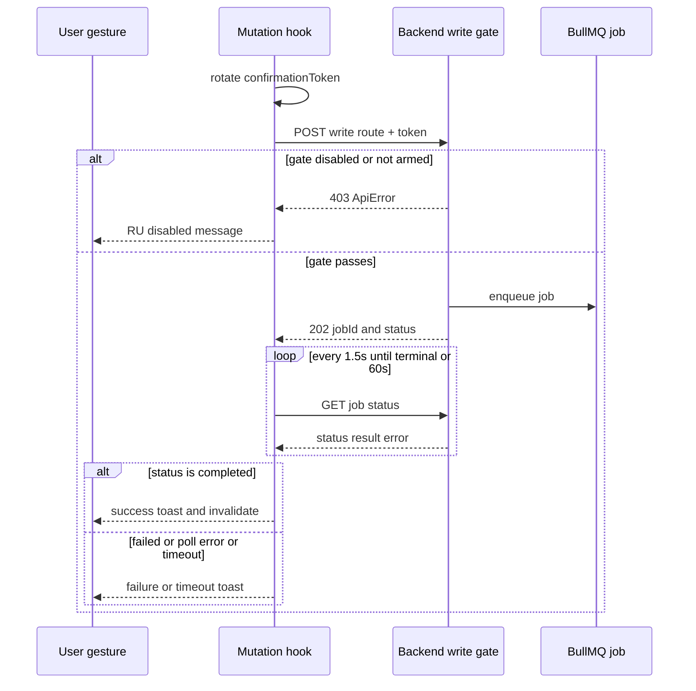

# API Layer & Normalizers

## API Client Singleton

`src/lib/api-client.ts` exports a singleton `ApiClient` instance (`apiClient`). All API calls flow through it.

| Concern | Implementation |
|---------|----------------|
| **Base URL** | `env.apiUrl` from `src/lib/env.ts` → reads `NEXT_PUBLIC_API_URL` (default `http://localhost:3000`). Endpoints are `/v1/...` paths. |
| **Auth header** | Auto-injects `Authorization: Bearer <token>` from `useAuthStore`. Bypassed via `options.skipAuth`. |
| **Cabinet header** | Auto-injects `X-Cabinet-Id` from `useAuthStore`. Bypassed via `options.skipCabinetId`. This is the multi-tenant isolation mechanism. |
| **Response unwrapping** | Backend returns `{ data: T }` envelopes. Client auto-unwraps `rawData.data`. Use `skipDataUnwrap: true` for paginated responses where `data` is a legitimate array field. |
| **Binary downloads** | `responseType: 'blob'` returns raw `Blob` without JSON parsing. |
| **Error handling** | Custom `ApiError` class carries `status`, `message`, `data`, `retryAfter`. HTTP 429/503 `Retry-After` header parsed and clamped to [1, 600] seconds. |

Source: `src/lib/api-client.ts`, `src/lib/api-interceptors.ts`, `src/lib/env.ts`

### Error tracking
- `extractErrorMessage()` handles both `{ error: { message } }` and flat `{ message }` JSON shapes.
- Telegram notification endpoint errors are routed to `TelegramMetrics` for observability (`trackTelegramApiError()`).
- WB token 401s mentioning "WB API token" are expected errors — suppressed from error logging via `isExpectedWbTokenError()`.

Source: `src/lib/api-interceptors.ts`, `src/lib/error-utils.ts`, `src/lib/api-wb-token-errors.ts`

## Boundary Normalizer Pattern

> Full spec: `CLAUDE-PATTERNS.md` § Boundary Normalizer Pattern

**Core rule**: Every backend response MUST be transformed into a frontend-canonical shape at the API client layer. Raw backend shapes never reach components or hooks.

### Why normalizers exist

1. **Defensive frontend** — Backend responses are typed `unknown`. Normalizers guarantee runtime type safety without relying on backend schema stability.
2. **snake_case → camelCase** — Backend uses Prisma (snake_case); frontend types use camelCase. Normalizers bridge both: `d.nmId ?? d.nm_id`.
3. **AP#8 null semantics** — Counts/totals default to `0` (known empty state); money/rates/ratios preserve `null` (unknown, renders "—"). This prevents misleading "0 ₽" displays.
4. **Prisma Decimal handling** — `toDecimalNumber()` reconstructs decimal.js `{s,e,d}` objects into numbers.
5. **Enum coercion** — Validates string unions against `ReadonlySet` of valid values.

### Shared helpers (`src/lib/api/normalizer-helpers.ts`)

| Function | Returns | AP#8 Category |
|----------|---------|---------------|
| `toCount(raw)` | `number` (0 default) | Counts, totals, pagination |
| `toNullableNumber(raw)` | `number \| null` | Money, rates, ratios |
| `toStringOrNull(raw)` | `string \| null` | Required strings |
| `toOptionalString(raw)` | `string \| undefined` | Optional strings |
| `toStr(raw)` | `string` ('' default) | Required strings with fallback |
| `asRecord(raw)` | `Record<string, unknown>` | Safe object access |
| `toDecimalNumber(raw)` | `number \| null` | Prisma Decimal deserialization |

### Normalizer file structure

Each domain follows the same pattern:
- **`<domain>-normalizer.ts`** — Pure functions: `normalize<Domain>Response(raw: unknown): TypedResponse`
- **`<domain>.ts`** — API client function that calls `apiClient.get()` then applies the normalizer

40+ normalizer files exist under `src/lib/api/`, one per API domain. Representative examples:
- `fulfillment-normalizer.ts` — FBO/FBS fulfillment metrics
- `storage-queries-normalizer.ts` — Storage cost by SKU, top consumers. Story 169.12 Task 0 hardened the boundary values: `has_warehouse_stock` is tri-state (`boolean | null` — absent/null stays `null`/unknown instead of being coerced to a false «Нет на складе» claim) and `percent_of_total` is nullable (unknown ratio stays `null`, never `0%`, per AP#8).
- `storage-import-normalizer.ts` — Storage import job status; an unrecognized backend status maps to a distinct `'unknown'` state (Story 169.12 Task 0) instead of being coerced to `'failed'`, which had rendered a false import error — consumers keep polling as with `'pending'`.
- `return-analytics-normalizer.ts` — Buyout/return analytics; an unrecognized return `category` stays a distinguishable `'unknown'` (Story 169.11 preface) with the neutral label «Неклассифицированный возврат» instead of silent coercion to a real category.
- `supply-planning-normalizer.ts` — Supply planning; Story 169.13 Task 0 (pattern #218/#226) hardened the boundary: unrecognized/absent `stockout_risk` and `reorder_status` map to a distinct `'unknown'` via map-based lookups (`STOCKOUT_RISK_MAP` / `REORDER_STATUS_MAP`) instead of the previous optimistic coercion to `'healthy'`/`'ok'`, and `avg_daily_sales` / `total_reorder_value` stay nullable (AP#8 — no `?? 0`). `has_cogs` uses `Boolean()` coercion because the backend schema declares it a required boolean (contract-faithful, not a boundary lie). Focused tests: `src/lib/api/__tests__/supply-planning-normalizer.test.ts`.
- `buyout-analytics-normalizer.ts` — Buyout/return rate (enum validation for source, confidence, trend)
- `liquidity-normalizer.ts` — Liquidity trends and distribution
- `communications-normalizer.ts` — WB seller communications (feedbacks, questions, chats, claims, pinned reviews); value fields (rating, nmId) preserve null (AP#8), chat message `direction` coerced to a `'client' | 'seller' | 'wb'` union, and the pinned-reviews normalizer receives the raw `{ data, next }` SDK passthrough (see `skipDataUnwrap` below)
- `finances-normalizer.ts` — Account balance (money fields preserve null, AP#8) and financial documents; the BE already maps snake_case → camelCase and unwraps the WB SDK envelope server-side, so the FE consumes bare camelCase shapes
- `price-recommendations-normalizer.ts` — Per-SKU repricing recommendations; unknown `priceBasis` enum values are **indicated** as `'UNKNOWN'` (a distinct badge) rather than silently relabeled, `validationFlags` coerced to a string array, `alternativeBasisPrice` kept nullable (AP#8). See [Domain Logic — Pricing Basis](domain-logic.md#pricing-basis-repricing-spp-1-lane)
- `monitoring-normalizer.ts` / `monitoring-grid-normalizer.ts` — Pipeline health for the `/monitor` and `/monitoring` routes; both pass through the backend-authored, schedule-aware lag label `dataLagDisplay` (trimmed; `null` when the pipeline never synced). `MonitorPipelineHealth` and `PipelineStatusGrid` render `dataLagDisplay` as authoritative and fall back to client-side `formatRelativeTime(lastSuccessAt)` only when it is absent — the raw `dataLagMinutes` no longer drives the displayed lag, because a naive minutes count misrepresents pipelines that run on infrequent schedules. Focused tests: `src/lib/api/__tests__/monitoring-normalizer.test.ts`, `src/lib/api/__tests__/monitoring-grid-normalizer.test.ts`, `src/app/(dashboard)/monitor/components/__tests__/monitor-pipeline-utils.test.ts`.
- `advertising-analytics-normalizer.ts`, `advertising-campaigns-normalizer.ts`, `search-analytics-item-normalizer.ts`, `search-position-trends-normalizer.ts` — the Epic 170/171 advertising & search normalizers, detailed in the next section.

### Advertising & Search normalizers (Epic 170/171)

The advertising and search domains consolidate their normalizers in `src/lib/api/` and their canonical frontend shapes in `src/types/`. Backend returns camelCase; these normalizers convert to frontend-canonical shapes (advertising item rows use snake_case fields like `total_sales`, `campaign_id`; search items use camelCase).

**`advertising-analytics-normalizer.ts`** — `normalizeAdvertisingResponse(raw, paramsFrom, paramsTo, paramsViewBy?)` maps the backend `{ items, summary, query, pagination, cachedAt?, daily?, multiCampaignSkuWarnings? }` envelope to `AdvertisingAnalyticsResponse` (`src/types/advertising-analytics/analytics.ts`): `{ meta, summary, data, daily?, multiCampaignSkuWarnings? }`. Key behaviors:

- **`efficiency_status` is authoritatively guarded here** (F-50): out-of-union backend values are sanitized to `'unknown'` with a `logger.warn` (empty/missing is a legitimate no-data case — no warn), so `EfficiencyBadge` (F-47) and the typed helpers `isAttentionRequired`/`isLossStatus` are only defense-in-depth.
- **AP#8 split per iter-130**: `revenue`, `profit`, `roas`, `roi`, `ctr`, `cpc`, `conversion_rate`, `profit_after_ads` use `toNullableNumber` (null renders "—", never a false "0 ₽"/"0 %"), while counts (`views`, `clicks`, `orders`, `spend`, `total_sales`, …) use `toCount`.
- **Cast-free enum lookups (Story 170.1 Task 0)**: `ViewByMode` is validated against a `ReadonlySet` (`sku`/`campaign`/`brand`/`category`) with `'sku'` fallthrough; item `type` must be `'merged_group' | 'individual'` or becomes `undefined`; absent `cachedAt` honestly maps to `meta.last_sync = null` (fabricated NOW removed).
- **Drill-through key precedence (FE-16)**: campaign-grouped items expose the id as `advertId`; the normalizer reads `advertId` first and falls back to `campaignId`, otherwise the drill-through Link for campaign view never renders.
- **Daily ROAS is computed at the boundary**: `roas = revenue_attributed / spend`, `null` when `spend` is 0 or revenue is missing.

**`advertising-campaigns-normalizer.ts`** — `normalizeCampaignsResponse` rebuilds `{ meta: { total_count, active_count }, data }` from the backend `{ campaigns, total, … }` array; `active_count` is derived client-side by counting campaigns with backend `status === 9`. `normalizeCampaign` maps camelCase campaign fields to the FE `Campaign` shape (`campaign_id`, `type_name` defaulting to «Неизвестно», `nm_ids` coerced to strings, `placements` with tri-state `carousel`). `normalizeSyncStatusResponse` sanitizes `SyncTaskStatus` via an exhaustive `Record<SyncTaskStatus, true>` map (`SYNC_STATUS_MEMBERS` — adding a union member without updating the map is a compile error); invalid values map to the neutral `'idle'` with `logger.warn`, since the union has no `'unknown'` member and the badge has its own fallback.

**`search-analytics-item-normalizer.ts`** — per-item normalizers extracted from `search-analytics-normalizer.ts` for the three search endpoints (`/v1/analytics/search/by-product`, `/by-query`, `/orders`; types in `src/types/search-analytics.ts`):

- `avgPosition` is a 1-based position — `null` stays `null`, never `?? 0` (170.7).
- `avgCtr` is a rate → `toNullableNumber` (AP#8 split); impressions/clicks/orders are counts → `toCount`.
- `normalizeSearchOrderItem` **absorbs key drift**: returns `null` for un-renderable items (key missing or a non-string/number type), coerces numeric keys to string, and the consumer filters `null`s from the array. Optional fields (`vendorCode`, `uniqueProducts`, `uniqueQueries`) are set only when present — `undefined` is canonicalized to omission, not `null`, preserving optional-property semantics.
- `searchCartAdds` is an additive semantic alias for `totalClicks` (Request #178): WB's openCard→impressions / addToCart→clicks column mislabeling.

**`search-position-trends-normalizer.ts`** — four endpoint normalizers (types in `src/types/search-position-trends.ts`): `normalizePositionTrendsResponse` (week-over-week movers + page-one candidates + summary), `normalizePositionMoversResponse` (rolling `7d | 14d | 30d` period), `normalizePageOneOpportunitiesResponse`, and `normalizePositionHistoryResponse` (per-SKU daily history). Notable semantics:

- `TrendDirection` includes `'unknown'` (170.7): missing/unrecognized direction → `'unknown'`, never a fabricated `'stable'`. Unrecognized values warn **once per distinct value** (`warnedTrendValues` set) so a 500-row garbage payload does not spam 500 warns; an absent trend is legitimate no-data and is silently `'unknown'`.
- Position fields (`currentAvgPosition`, `previousAvgPosition`, `positionChange`, deltas) and `ctr` are nullable ratios (AP#8); counts, `positionsAway`, and summary counts use `toCount`.

Focused tests: `src/lib/api/__tests__/advertising-analytics-normalizer.test.ts` (happy-path full response, nullability, type coercion, empty shapes).

### Search CSV export

`src/lib/csv/search-csv-export.ts` — pure, side-effect-free CSV builders for the search domain; Blob/DOM/download are handled by `<ExportCsvButton>`:

- `exportSearchByProductToCsv(queries)`, `exportSearchByQueryToCsv(products)`, `exportSearchOrdersToCsv(items)` — each produces UTF-8-BOM-prefixed, `\r\n`-joined CSV where every cell passes through `escapeCsvCell`; an empty array yields BOM + headers only.
- **Unknown numeric → empty cell, uniformly** (preface-review F2): `avgPosition == null` and `fmtPct(null)` render `''`, not `'—'`, so spreadsheet blank filters catch all unknowns — a deliberate divergence from the on-screen "—" rendering.
- Numbers are formatted with the Russian locale (`toLocaleString('ru-RU')`); percentages use one decimal and a ` %` suffix; `searchCartAdds`/`uniqueProducts` fall back to `0` (counts, AP#8-legal).

### Naming conventions
- `normalize<Name>Response` — endpoint response normalizer
- `to<Type>` — scalar/enum coercion
- `normalize<Name>` — per-item normalizer

## Anti-Pattern 8: Preserve Null Money and Ratio Values

> Full spec: `CLAUDE-ANTI-PATTERNS.md` AP#8

**Rule**: `?? 0` on nullable money/ratio fields lies about the data. Preserve `null`, render `—`. Counts and pagination still allow `?? 0`.

This rule governs the report-derived **historical SPP** values (`spp_rub`, `spp_pct`) on the SKU analytics page: a missing value stays `null` and renders `—`, while an explicit `0` renders as `0 ₽` / `0%`. The `includeCogs` filter on `useMarginAnalyticsBySku` (`include_cogs` query param) gates whether the backend returns these fields at all, and lives in the TanStack Query key so enabled/disabled states produce separate requests and cache entries. See [Domain Logic — Historical SPP](domain-logic.md#historical-spp-report-derived-sales-participation).

**ESLint enforcement** (`eslint.config.js`): A `no-restricted-syntax` AST rule flags new violations. Pre-existing legitimate exceptions use allowlist comments with canonical pattern names:
`BACKEND-CONTRACT-NON-NULL`, `SEMANTIC-ZERO`, `AGGREGATION-REDUCE`, `DISPLAY-GUARD`, `DEBUG-LOG`, `TEST-ASSERTION`.

**Ratchet guard**: `npm run check:anti-pattern-8-normalizer` (`scripts/check-anti-pattern-8-normalizer.sh`) — fails when violation count increases above the baseline (`scripts/.anti-pattern-8-normalizer-baseline.txt`).

## CSV Export Infrastructure

`src/lib/csv/` — Pure functions that convert typed arrays to RFC 4180-compliant CSV strings with UTF-8 BOM. Domain-specific export modules exist for buyout, funnel, advertising, pricing, returns, search, evaluations, SKU accuracy, and cross-reference data. The `<ExportCsvButton>` component handles Blob creation and download.

Core helper: `csv-helpers.ts` — `escapeCsvCell()` applies **OWASP CSV-injection defanging** (cells starting with `=`, `+`, `-`, `@`, TAB, CR, or LF are prefixed with a single quote so hostile product names like `=HYPERLINK(...)` cannot execute in Excel) and then RFC 4180 §2.6 quoting; `escapeCsvCellAlwaysQuoted()` preserves the legacy exporters whose stable file format quotes every cell without duplicating the security logic. Two deliberate, pinned trade-offs (do not "fix"): formatted negative values such as `"-1 234,56 ₽"` also match the leading `-` and gain a literal `'` (exempting `/^-\d/` would reopen the `-1+1|cmd` payload, and these cells are pre-formatted ru-RU strings Excel never treated as numeric); defanging checks the **cell-value start only**, so an embedded `safe\n=CMD()` gets no second-line prefix. `prefixUtf8Bom()` adds the UTF-8 BOM for Excel Cyrillic rendering. Null values render as "—" (em-dash).

Source: `src/lib/csv/`, tests in `src/lib/csv/__tests__/csv-helpers.test.ts`

## Communications Write-Back (NEW-2, Async 202 Job Polling)

The communications write-side (PR2) introduces a **gated async write** pattern distinct from the standard read-side normalizer flow. The BE write routes (reply, answer, send-chat, pin/unpin) all return **HTTP 202 `{ jobId, status }`** (the BullMQ enqueued-job state), not a synchronous result. The FE captures `jobId` and polls `GET /v1/communications/writeback/jobs/:jobId` until a terminal state.

*Communications write-back: a user gesture rotates a per-gesture confirmation token, the mutation POSTs to a 4-factor-gated BE route, and on 202 the coordinator polls the BullMQ job until a terminal state, a poll error, or the 60s timeout.*

### Four-factor write gate

All write routes are protected by a BE gate (JwtAuthGuard + CabinetGuard + `assertWritablePublic` env/arm/token) that returns **403** when write-back is disabled, not armed, or the token is missing. The FE maps a 403 `ApiError` to a clear RU "disabled" message — never a generic crash.

### Per-gesture confirmation token

`confirmationToken` is **presence-only** (a non-empty string), rotated as `crypto.randomUUID()` per user gesture inside the mutation hooks (`src/hooks/useCommunicationsWriteback.ts`). It is the 3rd factor of the 4-factor gate. This token is NOT a secret — it is the user-gesture proof, and the API client module never invents one (the hook supplies it so the proof stays at the UI boundary).

### BullMQ status allowlist (inverted-terminal)

`src/lib/communications-writeback-utils.ts` owns the status predicates (single source of truth; re-exported by `src/types/communications/writeback.ts`). Polling continues **only** for the four non-terminal BullMQ states (`active`, `waiting`, `delayed`, `waiting-children`) via an **allowlist** — every other state (including `completed`, `failed`, and unknown/unrecognized states) is treated as terminal. This is an allowlist (not a blocklist) precisely so an unknown state stops the poll (Defensive Frontend — a weird state can never spin the poll forever).

### Poll lifecycle

`usePollWritebackJob` (`src/hooks/useCommunicationsWriteback.ts`) takes `(jobId, attempt)` and polls every 1.5s with a hard **60s deadline** (`MAX_POLL_MS`); once elapsed, the job surfaces as a pseudo `timeout` terminal status so the submit button re-enables and a RU timeout message shows. `useWritebackJob` (`src/hooks/useWritebackJob.ts`) is the coordinator that wraps the mutation → 202 → poll → terminal flow shared by all four write surfaces: it fires `onTerminal` exactly once per **attempt** (guarded by a `firedRef` keyed on `attemptKey = jobId#attempt`), captures the action kind at fire time, and distinguishes a **poll error** (no job data) from a genuine BullMQ `failed` job.

### Retry-rearm for deterministic chat jobIds (NEW-2 fast-follow)

Chat sends enqueue with a **deterministic BullMQ jobId** (dedup), so retrying a timed-out send with byte-identical text reuses the **same** `jobId`. The original `firedRef`/reset-effect keyed only on `jobId`, so a re-submit of the same id would NOT re-run the reset effect, the poll would stay terminal (`timedOut = true`), and the retry would silently no-op. The fix: `setJobId` bumps an internal `attempt` **nonce** on *every* call (even when the id is unchanged) and threads it into `usePollWritebackJob` as part of the **query key** AND the reset-effect deps, and into `firedRef` via `attemptKey` (`jobId#attempt`). A re-submit of the same id therefore produces a **fresh query** (re-arms the poll, resets `startedAtRef`/`timedOut`) and re-arms terminal firing. One-shot paths (a new id per gesture, e.g. reply/answer/pin) are unaffected — the nonce bump is redundant-but-harmless there. The load-bearing regression test (`re-arms the poll when the SAME deterministic jobId is re-submitted after a timeout`) lives in `src/hooks/__tests__/useCommunicationsWriteback.test.ts`.

### `skipDataUnwrap` boundary detail

The pinned-reviews read endpoint (`GET /v1/communications/feedbacks/pinned`) is a **live SDK passthrough** that returns `{ data: PinnedReviewItem[], next }`. Because `apiClient` auto-unwraps `rawData.data ?? rawData` on every response, this endpoint REQUIRES `skipDataUnwrap: true` — without it, the `data` array would be hoisted out of the envelope and the normalizer would see `.data` = undefined → empty list. The liquidity trends endpoint (`GET /v1/analytics/liquidity/trends`) also uses `skipDataUnwrap: true` for its `{ meta, trends, insights }` envelope.

## Financial API Modules

| Module | Purpose |
|--------|---------|
| `financial-gaps.ts` | Import data gap detection, analysis, remediation (`/v1/imports/gaps/*`) |
| `liquidity.ts` + mappers | Liquidity analysis API |
| `buyout-analytics.ts` | Buyout rate per-SKU analytics |
| `unit-economics-normalizer.ts` | Unit economics response normalization |
| `margin-trends-normalizer.ts` | Margin trend data |
| `tax-analytics.ts` | Tax analytics |
| `acquiring-analytics.ts` | Acquiring/payment analytics |
| `cogs-history-normalizer.ts` / `bulk-cogs-normalizer.ts` | COGS history and bulk operations |
| `shipment-cost/fcu-aggregation-normalizer.ts` | FCU shipment cost allocation |
| `communications.ts` + `communications-normalizer.ts` | NEW-2 — WB seller communications (feedbacks, questions, chats, claims, pinned reviews); read-only list endpoints returning bare objects/arrays |
| `communications-writeback.ts` | NEW-2 (PR2) — gated write-side (reply/answer/send-chat/pin/unpin); all writes return HTTP 202 `{ jobId, status }` (BullMQ enqueued state), polled via `GET /writeback/jobs/:jobId` |
| `finances.ts` + `finances-normalizer.ts` | NEW-7 — account balance (`GET /v1/finances/balance`) + financial documents (`GET /v1/finances/documents`, `…/categories`, `…/:serviceName/download`); bare camelCase shapes from the BE |
| `pricing-basis.ts` | SPP-1 lane — cabinet repricing price basis (`GET`/`PUT /v1/pricing/basis`); `normalizePriceBasis()` folds unrecognized enum values to `'UNKNOWN'` (indicate, never relabel), `isSettablePriceBasis()` narrows the settable union, and `updatePricingBasis()` runtime-guards the PUT body. See [Domain Logic — Pricing Basis](domain-logic.md#pricing-basis-repricing-spp-1-lane) |

Source: `src/lib/api/`
