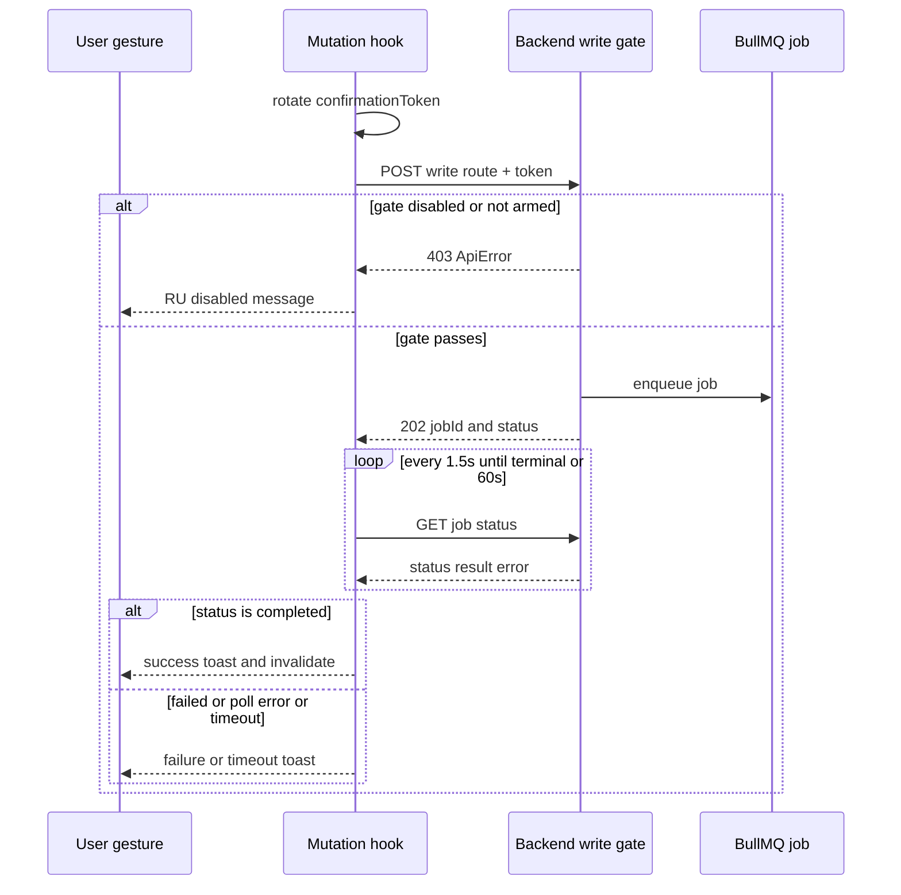

# API Layer & Normalizers

## API Client Singleton

`src/lib/api-client.ts` exports a singleton `ApiClient` instance (`apiClient`). All API calls flow through it.

| Concern | Implementation |
|---------|----------------|
| **Base URL** | `env.apiUrl` from `src/lib/env.ts` → reads `NEXT_PUBLIC_API_URL` (default `http://localhost:3000`). Endpoints are `/v1/...` paths. |
| **Auth header** | Auto-injects `Authorization: Bearer <token>` from `useAuthStore`. Bypassed via `options.skipAuth`. |
| **Cabinet header** | Auto-injects `X-Cabinet-Id` from `useAuthStore`. Bypassed via `options.skipCabinetId`. This is the multi-tenant isolation mechanism. |
| **Response unwrapping** | Backend returns `{ data: T }` envelopes. Client auto-unwraps `rawData.data`. Use `skipDataUnwrap: true` for paginated responses where `data` is a legitimate array field. |
| **Binary downloads** | `responseType: 'blob'` returns raw `Blob` without JSON parsing. |
| **Error handling** | Custom `ApiError` class carries `status`, `message`, `data`, `retryAfter`. HTTP 429/503 `Retry-After` header parsed and clamped to [1, 600] seconds. |

Source: `src/lib/api-client.ts`, `src/lib/api-interceptors.ts`, `src/lib/env.ts`

### Error tracking
- `extractErrorMessage()` handles both `{ error: { message } }` and flat `{ message }` JSON shapes.
- Telegram notification endpoint errors are routed to `TelegramMetrics` for observability (`trackTelegramApiError()`).
- WB token 401s mentioning "WB API token" are expected errors — suppressed from error logging via `isExpectedWbTokenError()`.

Source: `src/lib/api-interceptors.ts`, `src/lib/error-utils.ts`, `src/lib/api-wb-token-errors.ts`

## Boundary Normalizer Pattern

> Full spec: `CLAUDE-PATTERNS.md` § Boundary Normalizer Pattern

**Core rule**: Every backend response MUST be transformed into a frontend-canonical shape at the API client layer. Raw backend shapes never reach components or hooks.

### Why normalizers exist

1. **Defensive frontend** — Backend responses are typed `unknown`. Normalizers guarantee runtime type safety without relying on backend schema stability.
2. **snake_case → camelCase** — Backend uses Prisma (snake_case); frontend types use camelCase. Normalizers bridge both: `d.nmId ?? d.nm_id`.
3. **AP#8 null semantics** — Counts/totals default to `0` (known empty state); money/rates/ratios preserve `null` (unknown, renders "—"). This prevents misleading "0 ₽" displays.
4. **Prisma Decimal handling** — `toDecimalNumber()` reconstructs decimal.js `{s,e,d}` objects into numbers.
5. **Enum coercion** — Validates string unions against `ReadonlySet` of valid values.

### Shared helpers (`src/lib/api/normalizer-helpers.ts`)

| Function | Returns | AP#8 Category |
|----------|---------|---------------|
| `toCount(raw)` | `number` (0 default) | Counts, totals, pagination |
| `toNullableNumber(raw)` | `number \| null` | Money, rates, ratios |
| `toStringOrNull(raw)` | `string \| null` | Required strings |
| `toOptionalString(raw)` | `string \| undefined` | Optional strings |
| `toStr(raw)` | `string` ('' default) | Required strings with fallback |
| `asRecord(raw)` | `Record<string, unknown>` | Safe object access |
| `toDecimalNumber(raw)` | `number \| null` | Prisma Decimal deserialization |

### Normalizer file structure

Each domain follows the same pattern:
- **`<domain>-normalizer.ts`** — Pure functions: `normalize<Domain>Response(raw: unknown): TypedResponse`
- **`<domain>.ts`** — API client function that calls `apiClient.get()` then applies the normalizer

40+ normalizer files exist under `src/lib/api/`, one per API domain. Representative examples:
- `fulfillment-normalizer.ts` — FBO/FBS fulfillment metrics
- `storage-queries-normalizer.ts` — Storage cost by SKU, top consumers
- `buyout-analytics-normalizer.ts` — Buyout/return rate (enum validation for source, confidence, trend)
- `liquidity-normalizer.ts` — Liquidity trends and distribution
- `communications-normalizer.ts` — WB seller communications (feedbacks, questions, chats, claims, pinned reviews); value fields (rating, nmId) preserve null (AP#8), chat message `direction` coerced to a `'client' | 'seller' | 'wb'` union, and the pinned-reviews normalizer receives the raw `{ data, next }` SDK passthrough (see `skipDataUnwrap` below)
- `finances-normalizer.ts` — Account balance (money fields preserve null, AP#8) and financial documents; the BE already maps snake_case → camelCase and unwraps the WB SDK envelope server-side, so the FE consumes bare camelCase shapes

### Naming conventions
- `normalize<Name>Response` — endpoint response normalizer
- `to<Type>` — scalar/enum coercion
- `normalize<Name>` — per-item normalizer

## Anti-Pattern 8: Preserve Null Money and Ratio Values

> Full spec: `CLAUDE-ANTI-PATTERNS.md` AP#8

**Rule**: `?? 0` on nullable money/ratio fields lies about the data. Preserve `null`, render `—`. Counts and pagination still allow `?? 0`.

This rule governs the report-derived **historical SPP** values (`spp_rub`, `spp_pct`) on the SKU analytics page: a missing value stays `null` and renders `—`, while an explicit `0` renders as `0 ₽` / `0%`. The `includeCogs` filter on `useMarginAnalyticsBySku` (`include_cogs` query param) gates whether the backend returns these fields at all, and lives in the TanStack Query key so enabled/disabled states produce separate requests and cache entries. See [Domain Logic — Historical SPP](domain-logic.md#historical-spp-report-derived-sales-participation).

**ESLint enforcement** (`eslint.config.js`): A `no-restricted-syntax` AST rule flags new violations. Pre-existing legitimate exceptions use allowlist comments with canonical pattern names:
`BACKEND-CONTRACT-NON-NULL`, `SEMANTIC-ZERO`, `AGGREGATION-REDUCE`, `DISPLAY-GUARD`, `DEBUG-LOG`, `TEST-ASSERTION`.

**Ratchet guard**: `npm run check:anti-pattern-8-normalizer` (`scripts/check-anti-pattern-8-normalizer.sh`) — fails when violation count increases above the baseline (`scripts/.anti-pattern-8-normalizer-baseline.txt`).

## CSV Export Infrastructure

`src/lib/csv/` — Pure functions that convert typed arrays to RFC 4180-compliant CSV strings with UTF-8 BOM. Domain-specific export modules exist for buyout, funnel, advertising, pricing, returns, search, evaluations, SKU accuracy, and cross-reference data. The `<ExportCsvButton>` component handles Blob creation and download.

Core helper: `csv-helpers.ts` — `escapeCsvCell()` (RFC 4180 §2.6 quoting), `prefixUtf8Bom()` (UTF-8 BOM for Excel Cyrillic rendering). Null values render as "—" (em-dash).

Source: `src/lib/csv/`

## Communications Write-Back (NEW-2, Async 202 Job Polling)

The communications write-side (PR2) introduces a **gated async write** pattern distinct from the standard read-side normalizer flow. The BE write routes (reply, answer, send-chat, pin/unpin) all return **HTTP 202 `{ jobId, status }`** (the BullMQ enqueued-job state), not a synchronous result. The FE captures `jobId` and polls `GET /v1/communications/writeback/jobs/:jobId` until a terminal state.

*Communications write-back: a user gesture rotates a per-gesture confirmation token, the mutation POSTs to a 4-factor-gated BE route, and on 202 the coordinator polls the BullMQ job until a terminal state, a poll error, or the 60s timeout.*

### Four-factor write gate

All write routes are protected by a BE gate (JwtAuthGuard + CabinetGuard + `assertWritablePublic` env/arm/token) that returns **403** when write-back is disabled, not armed, or the token is missing. The FE maps a 403 `ApiError` to a clear RU "disabled" message — never a generic crash.

### Per-gesture confirmation token

`confirmationToken` is **presence-only** (a non-empty string), rotated as `crypto.randomUUID()` per user gesture inside the mutation hooks (`src/hooks/useCommunicationsWriteback.ts`). It is the 3rd factor of the 4-factor gate. This token is NOT a secret — it is the user-gesture proof, and the API client module never invents one (the hook supplies it so the proof stays at the UI boundary).

### BullMQ status allowlist (inverted-terminal)

`src/lib/communications-writeback-utils.ts` owns the status predicates (single source of truth; re-exported by `src/types/communications/writeback.ts`). Polling continues **only** for the four non-terminal BullMQ states (`active`, `waiting`, `delayed`, `waiting-children`) via an **allowlist** — every other state (including `completed`, `failed`, and unknown/unrecognized states) is treated as terminal. This is an allowlist (not a blocklist) precisely so an unknown state stops the poll (Defensive Frontend — a weird state can never spin the poll forever).

### Poll lifecycle

`usePollWritebackJob` (`src/hooks/useCommunicationsWriteback.ts`) polls every 1.5s with a hard **60s deadline** (`MAX_POLL_MS`); once elapsed, the job surfaces as a pseudo `timeout` terminal status so the submit button re-enables and a RU timeout message shows. `useWritebackJob` (`src/hooks/useWritebackJob.ts`) is the coordinator that wraps the mutation → 202 → poll → terminal flow shared by all four write surfaces: it fires `onTerminal` exactly once per `jobId` (guarded by a `firedRef` reset only on `jobId` change), captures the action kind at fire time, and distinguishes a **poll error** (no job data) from a genuine BullMQ `failed` job.

### `skipDataUnwrap` boundary detail

The pinned-reviews read endpoint (`GET /v1/communications/feedbacks/pinned`) is a **live SDK passthrough** that returns `{ data: PinnedReviewItem[], next }`. Because `apiClient` auto-unwraps `rawData.data ?? rawData` on every response, this endpoint REQUIRES `skipDataUnwrap: true` — without it, the `data` array would be hoisted out of the envelope and the normalizer would see `.data` = undefined → empty list. The liquidity trends endpoint (`GET /v1/analytics/liquidity/trends`) also uses `skipDataUnwrap: true` for its `{ meta, trends, insights }` envelope.

## Financial API Modules

| Module | Purpose |
|--------|---------|
| `financial-gaps.ts` | Import data gap detection, analysis, remediation (`/v1/imports/gaps/*`) |
| `liquidity.ts` + mappers | Liquidity analysis API |
| `buyout-analytics.ts` | Buyout rate per-SKU analytics |
| `unit-economics-normalizer.ts` | Unit economics response normalization |
| `margin-trends-normalizer.ts` | Margin trend data |
| `tax-analytics.ts` | Tax analytics |
| `acquiring-analytics.ts` | Acquiring/payment analytics |
| `cogs-history-normalizer.ts` / `bulk-cogs-normalizer.ts` | COGS history and bulk operations |
| `shipment-cost/fcu-aggregation-normalizer.ts` | FCU shipment cost allocation |
| `communications.ts` + `communications-normalizer.ts` | NEW-2 — WB seller communications (feedbacks, questions, chats, claims, pinned reviews); read-only list endpoints returning bare objects/arrays |
| `communications-writeback.ts` | NEW-2 (PR2) — gated write-side (reply/answer/send-chat/pin/unpin); all writes return HTTP 202 `{ jobId, status }` (BullMQ enqueued state), polled via `GET /writeback/jobs/:jobId` |
| `finances.ts` + `finances-normalizer.ts` | NEW-7 — account balance (`GET /v1/finances/balance`) + financial documents (`GET /v1/finances/documents`, `…/categories`, `…/:serviceName/download`); bare camelCase shapes from the BE |

Source: `src/lib/api/`
