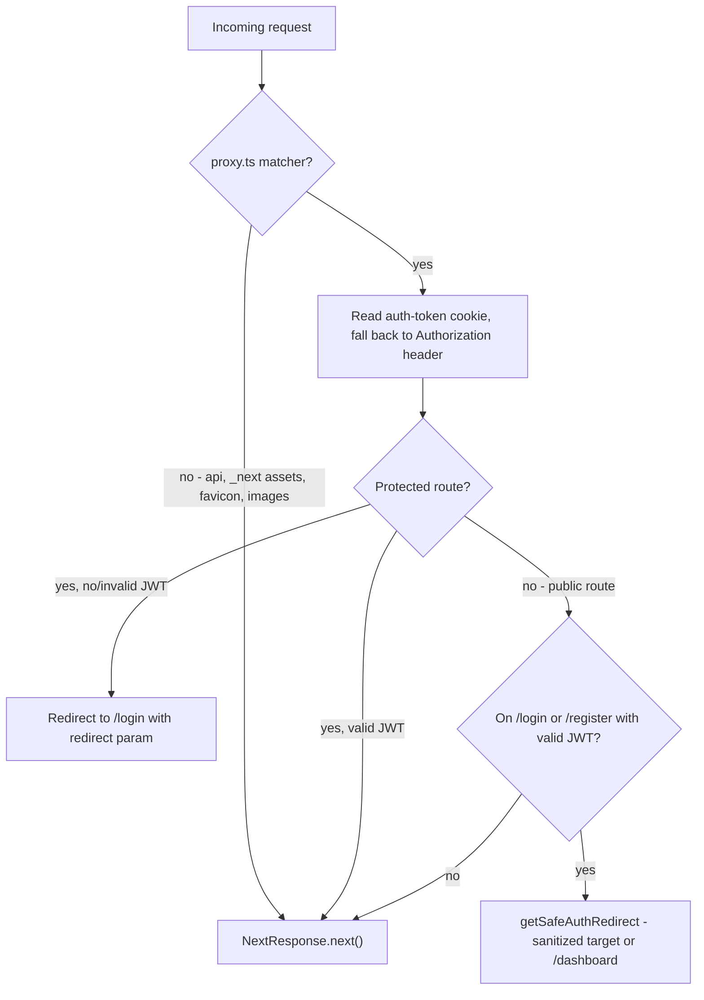
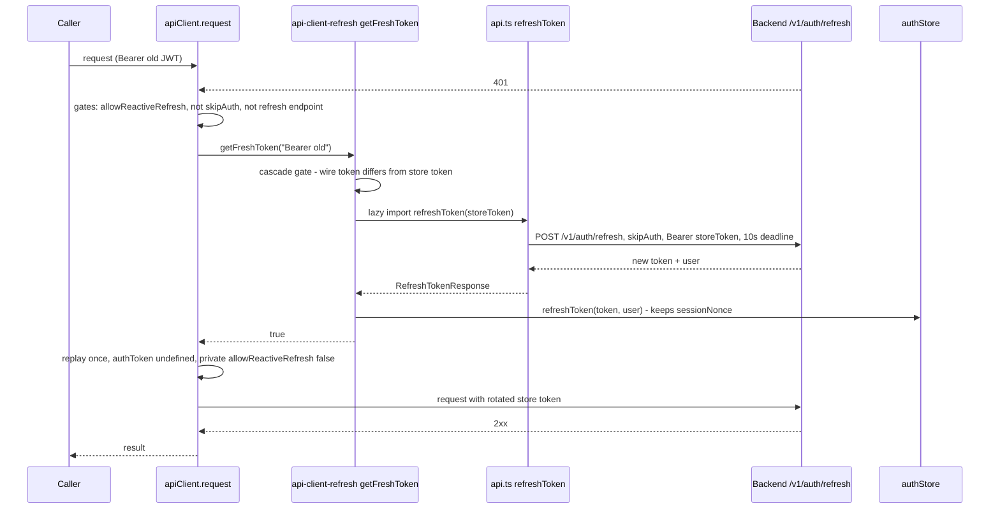

# Architecture

## Route Groups

The app uses three parenthesized route groups (directories that organize code without affecting URLs):

| Group | Purpose | Key Routes |
|-------|---------|------------|
| `(auth)` | Login / registration | `/login`, `/register` |
| `(onboarding)` | New user setup | `/cabinet`, `/processing`, `/wb-token` |
| `(dashboard)` | All authenticated app pages | `/dashboard`, `/analytics/*` (30+ sub-routes), `/orders/*`, `/shipments/*`, `/supplies/*`, `/products`, `/cogs/*`, `/finances`, `/communications`, `/settings/*`, `/monitor`, `/monitoring`, `/moysklad`, `/automation/*` |

Root `/` is a hydration-aware entry (`src/app/page.tsx`): it renders a named loading state until the Zustand `persist` runtime proves rehydration (`persist.hasHydrated()` / `onFinishHydration()`), then `router.replace`s **exactly once** to `/dashboard` when `isAuthenticated && token`, otherwise `/login`. A 5-second bounded hydration failure renders a storage-hydration error state (`PageState`) with a caller-triggered document reload; no navigation happens before hydration resolves.

Source: `src/app/(dashboard)/layout.tsx`, `src/lib/routes.ts`

## Layout & Provider Hierarchy

```
RootLayout (src/app/layout.tsx)
 └─ ThemeProvider (next-themes — class-based, light default)
     └─ Providers (src/app/providers.tsx)
         └─ QueryClientProvider (TanStack Query: 60s stale, 5min GC, retry=1)
             └─ TooltipProvider
                 └─ AuthProvider (auto JWT refresh)
                     └─ Toaster (sonner)
                         └─ Route Group Layouts
                             └─ (dashboard) → DashboardLayout (client component)
                                                ├─ Sidebar + Navbar
                                                ├─ TokenHealthBanner
                                                └─ [Page Content]
```

The dashboard layout (`src/app/(dashboard)/layout.tsx`) is a **client component** that acts as an auth fallback gate: checks Zustand store hydration, and if no token exists in localStorage, clears the `auth-token` cookie and redirects to `/login`. This prevents redirect loops that would occur if only middleware guarded the route. Story 167.1 unified this protected AppShell: the layout resolves **one** canonical navigation model via `resolveNavigationItems({ role, urgentCount })` (`src/components/custom/sidebar-navigation.ts`) and passes the same ordered entries to both the desktop `Sidebar` and the mobile `MobileSidebarSheet`, so labels, hrefs, icons, role visibility, and the supply-planning badge cannot drift between renderers. The layout also renders a skip-link to `#main-content` and detects cross-tab logout (storage event on the auth key) before deciding to redirect.

Nested layouts compose under this shell: `src/app/(dashboard)/settings/layout.tsx` is a second layout level for the settings area — a server component wrapping children in a two-column grid (`14rem` sticky nav column plus `min-w-0` content column) with the `SettingsNav` component providing section navigation for `/settings/*` sub-routes (cabinet, tariffs, tax, expenses, notifications, backfill). It demonstrates the App Router pattern of nesting route-specific shells inside the dashboard shell without duplicating auth or chrome.

Source: `src/app/layout.tsx`, `src/app/providers.tsx`, `src/app/(dashboard)/layout.tsx`, `src/app/(dashboard)/settings/layout.tsx`, `src/components/custom/sidebar-navigation.ts`

## Data Fetching — Interactive Pages Are Client-Side

Next.js server page and layout wrappers coexist with client components. **Not every page uses the `use client` directive**; server components still render page/layout wrappers. However, the interactive, data-driven pages fetch client-side — none of the React Server Components fetch data. For example, `src/app/(dashboard)/analytics/liquidity/page.tsx`, `src/app/(dashboard)/analytics/unit-economics/page.tsx`, and `src/app/(dashboard)/cogs/bulk/page.tsx` are all `'use client'` pages that delegate data loading to custom hooks. Those data flows use this layered architecture:

```
Page (client component)
  └─ Custom hook (src/hooks/use*.ts)
      └─ TanStack Query useQuery()
          └─ apiClient.get/post()  (src/lib/api-client.ts)
              └─ fetch() with auto-injected headers
                  ├─ Authorization: Bearer <JWT>
                  └─ X-Cabinet-Id: <cabinetId>
```

TanStack Query is configured with a browser-singleton `QueryClient` to avoid recreation on re-render. See `src/app/providers.tsx` and `src/lib/queryClient.ts`.

Query keys use structured factory patterns (e.g., `cabinetSummaryKeys.all` / `.byParams(params)`) for granular cache invalidation. Files are organized as `src/hooks/*-query-keys.ts`.

## Authentication

### Proxy (server-side, Next 16 convention)



*Auth gating in `src/proxy.ts`: server-side JWT gate plus sanitized authenticated redirects away from auth pages.*

`src/proxy.ts` (renamed from `middleware.ts` for Next.js 16) reads the `auth-token` cookie (set client-side after login) and validates the JWT structure. Protected routes without a valid token redirect to `/login` with a `redirect` query param. Authenticated users hitting `/login` or `/register` are redirected to the dashboard (or the `redirect` target).

The authenticated redirect is sanitized by `getSafeAuthRedirect` (`src/proxy.ts`): a `redirect` param is honored only if it starts with a single `/` (protocol-relative `//` is rejected), parses to the **same origin** as the request, and does not itself target `/login` or `/register`; everything else falls back to `/dashboard`. `LoginForm` enforces the same policy client-side before navigating (`isSafeRedirect` in `src/components/custom/LoginForm.tsx`, which additionally rejects backslashes, malformed percent-encoding, and control characters). Next.js 16 renamed the middleware entrypoint from `middleware.ts` to `proxy.ts` and the exported function from `middleware` to `proxy`. Focused tests: `src/proxy.test.ts`.

### Client-side auth store
`src/stores/authStore.ts` — Zustand store with `persist` middleware → localStorage (`createJSONStorage(() => getBrowserLocalStorage())`, which throws during server rendering). Persists `user`, `token`, `cabinetId`, and the per-login `sessionNonce` (Story 167.9) via `partialize`. `login()` normalizes the user, picks `cabinetId` (argument → first `cabinet_ids` entry → null), mints a fresh `sessionNonce` (`crypto.randomUUID()`), and mirrors the token into the `auth-token` cookie (24h) via `setAuthCookie()` for the proxy. `refreshToken(token, user?)` rotates the token and cookie while **keeping** the existing `sessionNonce` and user (see D-2 below). `logout()` clears state and the cookie and signals cross-tab logout by a set-then-remove write of `STORAGE_EVENT_KEY`. Rehydration (`onRehydrateStorage`) re-establishes `isAuthenticated`, re-normalizes the user, mints a nonce for pre-167.9 sessions lacking one, re-sets the cookie, and registers storage-event listeners that sync state across tabs (logout events on `STORAGE_EVENT_KEY`, full-state sync on the auth storage key, re-normalizing user and re-setting the cookie).

### Token refresh — one rotation engine (D-2)

Both refresh paths converge on a **single-flight rotation core**, `getFreshToken()` in `src/lib/api-client-refresh.ts`:

- **Proactive**: `useAuth()` (`src/hooks/useAuth.ts`, mounted by `AuthProvider`) checks `isTokenExpired(token)` on mount and every 5 minutes and calls `getFreshToken()`; on failed recovery it `logout()`s and redirects to `/login`. The store update happens *inside* `getFreshToken` — the hook never re-writes the rotated token.
- **Reactive (D-2, PB-3)**: the `ApiClient` request path intercepts 401s (see diagram below).

The contract (`docs/request-backend/230-auth-refresh-endpoint-missing.md` §ANEX): `POST /v1/auth/refresh` with the Bearer of a still-valid access JWT, body `{}` → `{ "token": ... , "user" }`. Rotation is **sliding** — the old JWT is atomically revoked, so in-flight requests carrying it get 401 `TOKEN_REVOKED`.



*Reactive 401 recovery: interceptor gates, single-flight refresh POST, nonce-preserving store rotation, and a single replay.*

Key mechanics and hazards:

- **Replay once** — the interceptor retries the failed request exactly once with the private replay parameter `allowReactiveRefresh = false`; a replay that 401s again surfaces the original `ApiError` (no loop). The private flag always wins over the public `options.allowReactiveRefresh`, which cannot re-enable refresh mid-recovery. Durable pinned operations may opt out via `options.allowReactiveRefresh: false`.
- **Hazard #1 (single-use revocation)** — `performRefresh()` reads the token from the **store** at refresh time (a concurrent rotation may already have won the race); reusing the failed request's original token would itself 401. No store session → no refresh POST (logged-out 401s stay terminal).
- **Hazard #2 (sessionNonce preservation)** — the store update goes through the `refreshToken(token, user)` store action, which keeps `sessionNonce` and the existing user; `login()` would mint a new nonce and break in-flight D-1 (Story 167.9) cabinet-create settlements.
- **Single-flight** — concurrent 401s all join one in-flight refresh promise (one POST total); the promise is cleared on settlement so a later 401 may start a fresh recovery.
- **Rotation-cascade gate (M1)** — the failed request's wire `Authorization` is compared to the current store token; if they differ, a prior rotation already completed, so no new refresh starts (a straggler joins the pending rotation or replays with the store token). The gate only applies to the reactive path — `useAuth()` calls `getFreshToken()` with no wire header.
- **Deadline (M2)** — the refresh POST runs under `AbortSignal.timeout` with a 10s default (`DEFAULT_REFRESH_DEADLINE_MS`, injectable via `setRefreshDeadlineForTests`); a black-holed refresh resolves `false` instead of wedging the single flight. Deadline aborts suppress `apiClient`'s network-error log — the recovery catch owns that failure.
- **Recursion guard** — `AUTH_REFRESH_ENDPOINT` (`/v1/auth/refresh`) is excluded by `isRefreshEndpoint()`: its own 401 is unrecoverable and must not be intercepted.
- **Module-cycle safety** — `api-client-refresh.ts` imports `api.ts` types only (erased at compile time) and loads `refreshToken()` lazily at runtime, avoiding the load-time cycle `api-client.ts → api-client-refresh.ts → api.ts → api-client.ts`.

Focused tests: `src/lib/api/__tests__/api-client-401-refresh.test.ts` (interceptor gates, single-flight, replay-once, store-action semantics), `src/hooks/__tests__/useAuth.test.ts` (proactive expiry, logout-on-failure).

### Multi-tenant isolation
Cabinet ID (tenant) is injected as `X-Cabinet-Id` header on every API call via the API client. Some endpoints also accept `cabinet_id` in request body.

Isolation also extends into the TanStack Query **cache** (Story 97.5-FE discipline, applied to price recommendations in W3-FE): concrete query keys embed `cabinetId` read from `useAuthStore(auth => auth.cabinetId)`, so switching cabinets can never serve another cabinet's cached rows even though the header would scope the network request. The canonical example is the `queryKeys` factory in `src/hooks/usePriceRecommendations.ts`: `all` stays an unscoped prefix (so `invalidateQueries({ queryKey: queryKeys.all })` in `usePriceRefresh` / `usePricingBasis` keeps prefix-invalidating everything), while `list(cabinetId, params)`, `detail(cabinetId, nmId)`, and `history(cabinetId, nmId, limit)` concretes plus their `lists()`/`details()`/`histories()` group prefixes are cabinet-scoped. The hooks are `enabled` only when `cabinetId` is non-null (idle queryFn, no fetch). Focused isolation suite: `src/hooks/__tests__/price-recommendations-cabinet-isolation.test.ts` (4 cabinets × list/detail/history, 12 keys pairwise distinct, plus single-field param-diff and history-limit axes); unit behavior incl. disabled-null-cabinet cases in `src/hooks/__tests__/usePriceRecommendations.test.ts`.

### WB API token
Separate from the JWT — a per-cabinet Wildberries API token configured during onboarding (`/wb-token`). Missing-token 401 errors are treated as expected soft errors, not logged as failures. `<RequireWbToken>` components guard routes that need it.

### RBAC
`src/lib/role-permissions.ts` — `canManageOperationalData()` returns true for Owner, Manager, and Service roles; Analyst is read-only.

## State Management

### Zustand stores (`src/stores/`)
| Store | Purpose | Persisted |
|-------|---------|-----------|
| `authStore` | JWT, cabinetId, user | ✅ localStorage + cross-tab sync |
| `dashboardWidgetsStore` | Dashboard widget layout/visibility | ✅ |
| `rateLimitStore` | API rate-limit tracking | ✅ |
| `marginPollingStore` | Margin recalculation polling state | ❌ |
| `dashboardPeriodStore` | Selected date range / period | ❌ |

Source: `src/stores/`

### React contexts (`src/contexts/`)

Beyond Zustand stores, one React context owns shared UI state: the **dashboard period** selection (`DashboardPeriodProvider` in `src/contexts/dashboard-period-context.tsx`). Its logic is split for size compliance — `dashboard-period-state.ts` (state machine), `dashboard-period-storage.ts` (localStorage persistence), `dashboard-period-types.ts` (contract). The provider manages period selection with URL sync and localStorage persistence; `useDashboardPeriod()` throws if consumed outside the provider. It backs the non-persisted `dashboardPeriodStore` role listed above — dashboard pages consume period state via the context, not duplicated per-page state.

### Service layer (`src/services/`)

`src/services/cabinets.service.ts` is the orchestration layer above raw API calls for cabinet creation (Story 167.9). `handleCreateCabinet(name, targetMarginPct)` captures an immutable `InitiatingSessionContext` (`accountId`, `sessionNonce`) from the auth store, performs the create + tax-settings calls, and then **conditionally settles** the new JWT/cabinet into global auth state — only when `evaluateCabinetSettlement()` proves the initiating session is still live. Settlement semantics:

- `applied` — nonce matches live session (primary predicate; account id compared only as defense-in-depth when both sides are non-null) → committed cabinet view returned.
- `stale` — no live token/user, nonce mismatch, or account mismatch → never mutates global auth state and never throws; logged quietly without secrets.
- `indeterminate` — either nonce is null (pre-167.9 persisted session) → fail-safe, treated like stale for all UI effects.

This is the reason token rotation must preserve `sessionNonce` (see D-2): a late cabinet-create result landing after a re-login must not overwrite the new session. Focused tests: `src/services/cabinets.service.test.ts`, `src/services/cabinets.service.settlement.test.ts`.

## Feature Flags & Mock/Proxy Data

`src/config/features.ts` is the feature-flag registry, read via `import { features } from '@/config/features'`:

- `epic37MergedGroups` — `{ enabled, useRealApi, debug }` for the merged-group ("Склейки") table: gates rendering the Epic 37 UI and switches between mock data and the real backend API (`NEXT_PUBLIC_EPIC_37_USE_REAL_API`). Note the env comparisons use `=== 'true' || true`, so both flags effectively default to enabled regardless of the documented defaults.
- `jamUrls` — subscription/info URLs used by `RequireJam` upgrade CTAs (`NEXT_PUBLIC_JAM_SUBSCRIPTION_URL` / `NEXT_PUBLIC_JAM_INFO_URL`, defaulting to `https://seller.wildberries.ru/jam`).

MSW (Mock Service Worker) handlers under `src/mocks/handlers/` provide request-level mocks grouped by domain (advertising, communications, finances, liquidity, supply-planning, unit-economics — each split into `*-queries.ts` / `*-mutations.ts` modules re-exported through `index.ts`), wired by `src/mocks/server.ts` for tests. These are the proxy/mock data source behind the `useRealApi` switch.

## Domain display configuration

`src/lib/unit-economics-config.ts` centralizes unit-economics display config: `PROFITABILITY_STATUS_CONFIG` maps each `ProfitabilityStatus` (excellent / good / warning / critical / loss, by net-margin % thresholds from ≥25 down to <0) to localized labels, semantic CSS-variable colors, Tailwind tint classes, icons, and contrast-corrected text colors (P2 wave-3 accessibility pass), plus an `UNKNOWN_PROFITABILITY_CONFIG` sentinel for enum-drift defense (F-49). Details of the margin math live in [Domain Logic](domain-logic.md).

## Design System

The presentation layer is migrating to a layered, semantic design system built on Tailwind v4 and shadcn/ui (Radix). The layers are built in order and consumed strictly downward — later route migrations reuse these foundations rather than restyling:

1. **Semantic tokens** — `src/styles/globals.css` defines the CSS-first Tailwind v4 `@theme` palette (background/foreground, card/popover, brand/primary, destructive, financial-positive/negative/neutral, status-success/warning/error/information/pending, availability, chart series, focus/ring, disabled) plus typography, spacing, radius, shadow, and animation scales for light and dark themes. The `ThemeProvider` (`next-themes`, class-based) toggles these.
2. **Generic shadcn primitives** — `src/components/ui/**` are domain-agnostic wrappers around Radix. They consume semantic tokens only (no hardcoded or light-only palette values) and own accessibility contracts: focus return, `motion-reduce`, ≥44×44 localized close controls, semantic invalid states, and named table scroller regions.
3. **Product compositions** — `src/components/product/` are presentational, route-supplied compositions that own no URL/search/query/state. Six families exist (Stories 166.3–166.8): page context (`PageHeader` with a single `h1`, `Breadcrumbs`, `ContextBar`), metrics/status (`FinancialValue`, `MetricCard`, `DataAvailability`, `StatusBadge`), filters (`FilterToolbar`), tables (`ResponsiveTable` family), charts (`ChartFrame`/`ChartEvidence` family), and page states (`PageState`, `AsyncOperationStatus`, `BulkResultSummary`, `ContextualSplitView` — the root entry and global `not-found.tsx` already consume `PageState`).
4. **Domain-shared / route-owned UI** — Epics 167–173 are migrating the 76 `page.tsx` routes onto these layers one BMAD Story at a time (Epic 167 closed; Epic 168 analytics migration in progress).

See [Design System](design-system.md) for the token contract, primitive hardening, product-composition APIs, and the Epics 166–174 migration program.

## Environment Configuration

`src/lib/env.ts` exposes a single `env` object reading `NEXT_PUBLIC_*` variables at build time: `apiUrl` (`NEXT_PUBLIC_API_URL`, defaulting to the local backend at `http://localhost:3000`), `appName` / `appVersion`, boolean flags `enableAnalytics`, `enableWebSocket`, `enableDevTools` (each `=== 'true'`), plus `isProduction`/`isDevelopment`. `env.enableDevTools` conditionally mounts `ReactQueryDevtools` inside `Providers`, and the API client constructor warns if a production `apiUrl` uses plain `http://` outside localhost.

Local runtime truth: the Next.js dev/start servers bind to **port 3100** (`next dev -p 3100` / `next start -p 3100` in `package.json`), while the backend API serves on **port 3000** (`NEXT_PUBLIC_API_URL=http://localhost:3000` — endpoints start with `/v1/`, no `/api` suffix). There is no deployment target; this is a self-hosted setup. `eslint.config.js` (ESLint 9 flat config) is the actual enforcement path for `npm run lint` and CI; the legacy `.eslintrc.json` is kept only for IDE/editor integration and is ignored by ESLint 9+ when both exist.

## Configuration

| File | Purpose |
|------|---------|
| `next.config.ts` | Next.js config |
| `tsconfig.json` | TypeScript strict mode, `@/` path alias |
| `eslint.config.js` | ESLint 9 flat config — actual `npm run lint` enforcement (legacy `.eslintrc.json` is IDE-only); includes custom `no-restricted-syntax` selectors for Anti-Pattern #8 (`?? 0` on money/ratio fields). There is no mandatory CI merge gate — validation commands live in `README.md`. |
| `src/styles/globals.css` | Tailwind v4 CSS-first theme — semantic token palette (background, card, brand/primary, financial, status, availability, chart roles), typography/spacing/radius/shadow scales, light + dark themes. The JavaScript `tailwind.config.ts` was removed; see [Design System](design-system.md). |
| `postcss.config.js` | `@tailwindcss/postcss` + autoprefixer (Tailwind v4 compiler contract) |
| `components.json` | shadcn/ui CLI metadata aligned to Tailwind v4 (`config: ""`, CSS variables, new-york style) |
| `src/config/features.ts` | Feature-flag registry — `epic37MergedGroups` (enabled / `useRealApi` mock-vs-real API switch / debug) and `jamUrls`; driven by `NEXT_PUBLIC_EPIC_37_*` and `NEXT_PUBLIC_JAM_*` variables |
| `.env.example` | Environment variable names (see [Testing & Operations](testing-and-ops.md)) |
