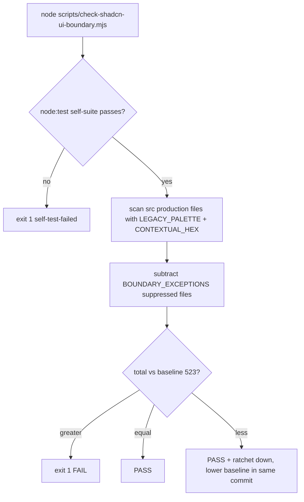

# Conventions & Quality Gates

The project enforces a rigorous set of coding standards and automated quality gates. These are load-bearing for every PR — not optional guidelines.

## Source Material

The canonical references for conventions are:
- **`CLAUDE.md`** — Main development rules, accepted baselines, two-pass review discipline
- **`CLAUDE-PATTERNS.md`** — Boundary Normalizer Pattern, Defensive Frontend Principle, Multi-Source Orchestration, Radix UI test patterns
- **`CLAUDE-ANTI-PATTERNS.md`** — 10 numbered anti-patterns with ❌ BAD / ✅ GOOD code blocks

## File Size Limits

| Category | Limit | Target |
|----------|-------|--------|
| Source files | 200 lines (ESLint `max-lines`, `skipBlankLines` + `skipComments`) | ~150 lines (proactive extraction) |
| Test files, fixtures, mock handlers | 800 lines | — |

Enforced via the ESLint 9 **flat config** `eslint.config.js` (the enforcement path for `npm run lint` / `npx eslint`). `next lint` is deprecated and does NOT load this — enforcement is exclusively via `npm run lint` / `npx eslint`, plus two cross-check gates: `npm run check:eslint-rules` and `npm run check:max-lines`.

### `eslint.config.js` (flat config) structure

- The legacy `.eslintrc.json` is retained for IDE/editor integration only (Story 98.1-FE); when both exist, ESLint 9 uses the flat config and ignores `.eslintrc.json`.
- `linterOptions.reportUnusedDisableDirectives: 'off'` restores the ESLint 8 default so the repo's ~34 intentionally-defensive `// eslint-disable-next-line no-restricted-syntax` comments on SEMANTIC-ZERO sites don't break the zero-warning baseline.
- `src/**/*.{ts,tsx}` block — `max-lines` 200 (`skipBlankLines`+`skipComments`), `@typescript-eslint/no-unused-vars` (error, `argsIgnorePattern: '^_'`), `no-explicit-any: 'warn'`, `jsx-a11y/control-has-associated-label: 'error'` (icon-only interactive elements must have an accessible name), and the **Anti-Pattern #8** `no-restricted-syntax` selectors banning `?? 0` on money/ratio field names (`revenue|profit|cost|spend|roas|margin|price|…`) and suffix fields (`_rub|_amount|_pct|…`) in both direct-member and optional-chaining forms. `project` is intentionally omitted from `parserOptions` — type-aware linting loads the full TS program (~1.2 GB) and OOMs the 2 GB CI VPS.
- `e2e/**/*.ts` block — TS-parsed with an 800-line cap instead of 200 (basic hygiene without capping the browser-test suite), plus two exact per-file `max-lines: 'off'` exemptions for historical E2E debt (`e2e/fixtures/playwright-network-guard.ts`, `e2e/onboarding.spec.ts`) that Story 174.3 left for their owner lifecycles.
- Test block (`src/**/__tests__/**`, `src/**/*.test.*`, `src/test/**`, `src/mocks/**`) — 800-line cap.
- `src/components/ui/**` (CLI-managed shadcn components) — `max-lines: 'off'`.
- A dedicated AP#8 block for `src/lib/api/**/*-normalizer.ts` / `**-mapper.ts` re-applies the money/ratio selectors with normalizer-specific guidance (`toNullableNumber` / `toCount`); the helper-defeat `toNullableNumber(x) ?? 0` form is ratcheted separately by `scripts/check-anti-pattern-8-normalizer.sh` (baseline `scripts/.anti-pattern-8-normalizer-baseline.txt`).

### Gate cross-check scripts

- **`npm run check:eslint-rules`** (`scripts/check-eslint-rules.sh`, Story 99.2-FE) — validates that every rule name declared in `.eslintrc.json` *and* `eslint.config.js` is recognized by ESLint (via `npx eslint --print-config`, with a `Linter().getRules()` fallback), catching silent disablement from typos like `max-lines-per-file` instead of `max-lines` (the Class 5 defect from the Story 97.7 investigation). Flat-config rule names are extracted by requiring the config module and iterating `config.rules` keys — not by regex on source text — so string literals inside rule messages can't produce false positives (fixed in Story 109.1-FE). Self-test: `--self-test`.
- **`npm run check:max-lines`** (`scripts/check-max-lines.sh`) — reports files exceeding the ESLint `max-lines` caps by running ESLint itself with the repository config (the enforcement path). It exists because raw `wc -l` counts JSDoc and blank lines that `skipBlankLines`+`skipComments` exclude, producing false "over-cap" reports; ESLint is the source of truth. Self-tests pin: 0 violations with the real config, a generated 201-code-line file is flagged, and invalid arguments exit 2.

## TypeScript Rules

- **Strict mode** — no `any` types (use `unknown`)
- **No `as` casts** — widen types with optional fields (`?:`) or add `?? fallback` guards
- **Path aliases** — use `@/components` not `../../components`
- **Next.js 16 async params** — `params`/`searchParams` on page/layout must be typed `Promise<...>` (validated by `check:next-params`)

## Key Anti-Patterns

Referenced as "AP#N" throughout the codebase:

| # | Anti-Pattern | Enforcement |
|---|-------------|-------------|
| 1 | `beforeEach(() => vi.clearAllMocks())` triggers TS2322 | Convention |
| 2 | Non-null assertion (`!`) inside async closures | Convention |
| 3 | Faking `ApiError` with `Object.assign` | Convention |
| 4 | `as any` in mock helpers | Convention |
| 5 | Variable shadowing in Zustand selectors | Convention |
| 6 | Silent E2E test skips that pass green | AST scanner (`check:e2e-assertions`) + Vitest self-test |
| 7 | Hard `waitForTimeout` in E2E specs | AST scanner (`check:e2e-waits`) + Vitest self-test |
| **8** | **`?? 0` on nullable money/ratio fields** | **ESLint `no-restricted-syntax` + ratchet guard** |
| 9 | `waitForLoadState('networkidle')` on polling pages | Convention |
| 10 | `formatNumber(opaqueId)` mangles search-key copy-paste | Convention |

See [API Layer & Normalizers](api-and-normalizers.md) for AP#8 details.

## Presentation-Source-Contract Test Pattern

The Epic 173 settings/shipments migration established a two-layer test contract that now appears across every migrated page: a **page-level source-contract test** colocated in the route's `__tests__/` directory, plus **component-level behavior/state contracts** for the migrated forms.

### Layer 1 — Page source contracts

Each migrated route owns a `*-presentation-source-contracts.test.ts` (Vitest, no DOM) that reads production source with `node:fs` and asserts four families of invariants. As of the 174.x era the repository carries **38 such suites** spanning: settings/backfill (173.2), settings/cabinet (173.3), settings/notifications (173.5), settings/tariffs (173.6), settings/tax (173.7), shipments list (173.8), shipment detail (173.9), shipments/box-types (173.10), shipments/sku-packaging (173.11), supplies list (173.12), supplies detail (173.13), and — added or already present alongside the 174-family wave — orders (list/fbo/integrity), moysklad, bulk-cogs/cogs-single/cogs-history, analytics AI families (anomalies, forecast accuracy, model registry, model evaluations, sku-accuracy, model performance, funnel, gaps, liquidity), automation (canned-rules, installed-rules, installed-rule editor), communications, finances, products, monitor, monitoring, dashboard, and the colocated dashboard-widgets suite:

1. **Pinned production catalog** — the test enumerates every production file the route owns (either recursively discovering non-test `.ts/.tsx` files under the route directory, as backfill does, or via an explicit `OWNED_PRODUCTION_FILES` array cross-checked against directory discovery, as shipments and cabinet do) and asserts the exact expected list. Adding or removing a file in a migrated route fails the suite until the catalog is consciously updated.
2. **No legacy palette or contextual hex** — every owned file must not match `LEGACY_PALETTE` (Tailwind palette classes like `text-yellow-600`, `bg-blue-500`, etc. across ~20 color families and shades 50–950) nor `CONTEXTUAL_HEX` (inline hex literals like `'#3B82F6'` in strings or Tailwind arbitrary values `bg-[#...]`). Colors must come from semantic design-system tokens instead of raw palettes.
3. **Merged semantic compositions** — pages must use the shared design-system compositions (`PageHeader`, `ContextBar`, `PageState`, `ResponsiveTable`/`TableState`, `FilterToolbar`, `StatusBadge`) and must NOT reintroduce `min-h-screen` layout; tables must use accessibility affordances like `kind: 'horizontal-scroll'` with Russian `regionLabel` and `caption` strings.
4. **Raw-palette helpers banished** — legacy helper functions such as `getStatusConfig`/`getProgressColorClass` and raw `<button>` elements in migrated render trees are asserted absent by name.

The Epic 173 shipments/supplies wave extended the pattern in three ways:

- **Multi-root catalogs** — the box-types (173.10) and sku-packaging (173.11) suites pin the union of the route directory (`src/app/(dashboard)/shipments/<route>`) *and* the colocated component tree (`src/components/custom/<family>`), so adding or removing a file in either location fails the pinned `OWNED_PRODUCTION_FILES` catalog. The sku-packaging suite also excludes an explicitly shared file (`ProductCombobox.tsx`) from the owned catalog.
- **Shared-surface SHA-256 pinning** — the supply-detail suite (173.13) pins the exact sha256 of files owned by the sibling supplies-list story (`SupplyStatusBadge.tsx`, the family `index.ts`, and the list contract test itself) so a detail-route story cannot silently mutate the list story's shared surfaces.
- **Named dialog states** — the box-types and sku-packaging suites additionally require every owned dialog (`SkuPackagingFormDialog`, `SkuPackagingDeleteDialog`, `BulkAddDialog`, `BoxTypeFormDialog`, `BoxTypeDeactivateDialog`) to carry `role="status"` and `role="alert"` announcements, and the supply-detail suite pins the status-stepper's `aria-label="Статус поставки"`, `aria-current="step"`, and `status-*` token usage so lifecycle meaning stays textual, not color-only.

### Layer 2 — Component behavior/state contracts

The migrated forms keep their behavior suites and gain story-scoped contracts:

- `TaxSettingsForm.test.tsx` holds the Story 66.3-FE behavior regression suite (tax-system radios, VAT checkbox, conditional manual-rate fields) with mocked TanStack hooks, while `TaxSettingsForm.story-173-7.test.tsx` pins the migration state contract: named loading state (`role="status"` with `aria-busy`), recoverable query-error state (`role="alert"` + "Повторить загрузку" retry button wired to `refetch`), and out-of-range percentage rejection without issuing a request.
- `TariffSettingsForm.test.tsx` holds the Story 52-FE.2 field-rendering contract (all 21 editable fields grouped by category, accessible Russian labels), while `TariffSettingsForm.story-173-6.test.tsx` adds the Story 173.6 form state and accessibility contract.

The net effect: a migrated page cannot silently regress to raw palette classes, ad-hoc layout, or unnamed loading/error states, because the contract tests fail on source text itself, independent of rendered output.

## Defensive Frontend Principle

> Full text: `CLAUDE-PATTERNS.md` § Defensive Frontend Principle

**The principle**: Frontend never silently transforms data it doesn't own — it **indicates**. When a backend anomaly is detected, render a warning indicator, preserve the raw value, and file a backend ticket. Do NOT "fix" the display by swapping fields, coercing nulls, or clamping values.

**Four anomaly categories**:
| Anomaly | Action |
|---------|--------|
| Field inversion (e.g., `salePrice > price × 1.2`) | Warning icon + tooltip, keep raw values |
| `null` where number expected | Preserve null, render `—`, add footnote |
| Impossible negative value | Show raw value + warning |
| Missing/empty response | Distinct empty-state with backend ticket link |

**Comment convention**: Use `// PENDING BACKEND: request #NNN — <description>` for backend-blocked work. Bare `TODO` must never appear in committed source.

## Quality Gates (Ratchet Scripts)

Each story closes only when every quality gate matches its accepted baseline (the CLAUDE.md "Accepted Baselines" table, `CLAUDE.md` § Accepted Baselines); when a story legitimately moves a baseline, that table is updated in the same PR.

| Gate | Command | Baseline |
|------|---------|----------|
| Doc citations | `npm run check:docs` | Auto set-diff vs `.check-docs-baseline.txt` (exit code is the gate) |
| TypeScript | `npm run type-check` | 0 errors |
| ESLint rules valid | `npm run check:eslint-rules` | All rule names recognized |
| Next.js async-params | `npm run check:next-params` | All params Promise-typed |
| Dot-locale percent | `npm run check:locale-percent` | Ratchet ↓ — current count 4 in `scripts/.locale-percent-baseline.txt` (started at ~108); lower the baseline when migrating |
| AP#8 normalizer | `npm run check:anti-pattern-8-normalizer` | Ratchet guard vs baseline (`scripts/.anti-pattern-8-normalizer-baseline.txt`) |
| ESLint | `npm run lint` | 0 errors, 0 warnings (zero-warning policy, `--max-warnings 0` in `lint` + `lint:fix`, Story 164.4) |
| Vitest | `npm test -- --run` | ≥ 19118 passing, 0 failed / 1234 files (floor moved exactly −756 dead tests, Story 174.2-FE; additions OK, regressions not; skipped informational) |
| E2E bare skips | `npm run check:e2e-bare-skips` + `scripts/check-e2e-bare-skips.test.mjs` | No bare `.skip` without reason in owned E2E specs |
| Max-lines cross-check | `npm run check:max-lines` | Matches the ESLint `max-lines` caps (200 source / 800 test) |
| Privacy console guard | `npm run check:privacy` | 0 forbidden `console.*` calls in PII-adjacent files (see [Testing & Operations](testing-and-ops.md#privacy-console-check)) |
| Privacy + diagnostic-capture unit tests | `npm run test:privacy` | Console guard + diagnostic-capture-policy tests pass (see [Testing & Operations](testing-and-ops.md#diagnostic-capture-policy)) |
| Outbound network guards | focused vitest run + `e2e/outbound-network-guard.spec.ts` | All non-local test network attempts denied (see [Testing & Operations](testing-and-ops.md#outbound-network-guards)) |
| Playwright static boundary | `npx vitest run src/test/playwright-static-boundary.test.ts` | No raw `@playwright/test` imports / dynamic code outside approved modules |
| E2E vacuous assertions (AP#6) | `npm run check:e2e-assertions` + `src/test/e2e-vacuous-assertions.test.ts` | AST scanner finds tautological assertions (`>= 0`, `\|\| true`, always-true) in owned E2E specs; self-test under `npm test` |
| E2E fixed waits (AP#7) | `npm run check:e2e-waits` + `src/test/e2e-fixed-waits.test.ts` | AST scanner finds `waitForTimeout`, raw `setTimeout`, and arbitrary wait helpers (`sleep`/`delay`/`pause`) in owned E2E specs; self-test under `npm test` |
| shadcn UI boundary | `node scripts/check-shadcn-ui-boundary.mjs` | 523 = ratchet baseline in `scripts/.shadcn-ui-boundary-baseline.txt` (exit 1 only on increase; Story 174.2-FE) — see below |
| shadcn migration parity | `node scripts/check-shadcn-migration-parity.mjs` | Schema-v3 model validates clean: 94 BMAD stories = 94 OMX plans, 76 source routes = 76 route-ledger rows, zero defect codes (Story 174.1-FE) — see below |

### Ratchet gate behavior

Ratchet gates (check:docs, check:locale-percent, check:anti-pattern-8-normalizer) are **not zero-tolerance** — they fail only when the violation count *increases* above a stored baseline. When a story legitimately reduces violations, the baseline file must be lowered in the same commit.

**Exit-code caveat**: Bash pipes capture only the last command's exit code — `npm run check:docs | tail` returns 0 even on failure. Always run the bare `npm run check:docs` or invoke the script directly.

### Toolchain pinning

`package.json` `engines` pins Node `24.18.0` and npm `11.11.0`. Vitest and `@vitest/coverage-v8` are pinned to exact `4.1.10`. These versions are enforced via local validation on the pinned toolchain (see [Local Validation and Merge Authority](#local-validation-and-merge-authority)); the project no longer has a CI workflow that asserts them at job start.

## shadcn Gate Scripts (Stories 174.1 / 174.2)

The Epics 166–174 shadcn full-UI migration added two Node-based gate scripts. Neither has an `npm run` alias — invoke them directly with `node scripts/…`. Both run a `node:test` self-suite first and fail fast if it fails, and both self-suites are excluded from the Vitest run (`vitest.config.ts` exclude list) because they are `node:test`-only surfaces (the Playwright static boundary forbids `node:child_process`/dynamic import in `.test.*` files Vitest would pick up).

### `check-shadcn-ui-boundary.mjs` — design-system boundary ratchet

Story 174.2-FE codifies the repository-wide UI boundary canon. The script scans all production `src/**/*.{ts,tsx}` (excluding tests, `__tests__`, `.d.ts`, and `src/test`) with two regexes that the page-level contract tests reuse:

- `LEGACY_PALETTE` — the widest route-guard form (monitoring 172.12 / 169.11 canon) across ~20 color families and shades 50–950, including the `ring-offset`, `inset-shadow`, and `text-shadow` prefixes; semantic token vocabulary (`bg-status-error`, `text-financial-positive`, `text-chart-3`, `bg-popover`) must never match.
- `CONTEXTUAL_HEX` — hex literals anchored to quote/backtick/arbitrary-value bracket/`;` contexts (3/4/6/8-digit) plus `rgb/rgba/hsl/hsla/oklch` color functions whose first ~40 chars contain a digit or `#`. Prose ticket numbers (`see ticket #197`) must not match.

Scanned files listed in the exported `BOUNDARY_EXCEPTIONS` map are counted as suppressed rather than active; every entry must carry an owner/debt ID (F-10 WCAG contrast exception, C5 waterfall chart hex, two historical `#7C3AED` chart marks) and be mirrored 1:1 in `_bmad-output/planning-artifacts/shadcn-ui-boundary-classification-manifest.md`. Violations are grouped per route (first `src/app` segment for app files, else first two path segments), totaled, and compared against the single-integer baseline `scripts/.shadcn-ui-boundary-baseline.txt`:

- `total > baseline` → exit 1 (fail) with offending files enumerated
- `total < baseline` → pass with "ratchet down" — the baseline MUST be lowered in the same commit
- `--init` writes the current total as a new baseline; an absent/non-integer baseline file is itself an error.

*The UI-boundary ratchet: scan → suppress registered exceptions → compare the active total against the stored baseline.*

### `check-shadcn-migration-parity.mjs` — schema-v3 plan/ledger/source parity

Story 174.1-FE's validator builds a parity model from four authorities and validates it with ~60 distinct defect codes:

1. **BMAD artifact** (`_bmad-output/planning-artifacts/epics-166-174-fe-shadcn-migration.md`) — parses `### Story N.M:` sections and their 12 EVIDENCE_FIELDS (`Owned Surface`, `Shared Dependencies`, `State Coverage`, …); each story's prerequisite set is derived from its shared-dependencies prose via `dependencyIds()` (range expansions like `Stories 166.1–166.8`, `Epics 169–171-FE`, `AppShell`, `C2`, `foundation` aliases).
2. **Master OMX plan** (`.omx/plans/shadcn-full-ui-migration-master.md`) — story-plan index, canonical ownership/dependency SHA-256 fingerprints (normalized-text hashes of `Owned Surface`/`Shared Dependencies` must match per story), backend exception lifecycle records, and the expected merge-base SHA.
3. **Route ledger** (`_bmad-output/planning-artifacts/shadcn-route-ledger.md`) — exactly 76 rows mapping `page.tsx` entries to owning stories; every row must be status `planned`, have a unique story owner and unique route/entry, and a matching implementation artifact.
4. **Source routes** — recursive discovery of every `page.tsx` under `src/app`, each of which must exist in the ledger with a matching route path; `sprint-status.yaml` rows must reference known stories with valid statuses and matching slugs.

The validator rejects duplicates (stories, plans, branches, worktrees, frontmatter keys, evidence fields, headings), orphans (plans/stories/statuses/ledger rows without counterparts), mismatches (titles, plan paths, owned-surface declarations, plan section profiles per epic era — legacy 166–168 / route 169–171 / modern 172–174), invalid DAG edges (unresolved, self-, future-prerequisites outside `ALLOWED_FORWARD_EDGES`, and prerequisite cycles via DFS), and verifies the two backend-exception stories (167.8, 169.14) end-to-end against live `git`: commit existence, merge ancestry onto `main`, branch/worktree absence (local and cached-remote-tracking — live-remote proof is explicitly an `unavailable` boundary), and merge/cleanup/handoff needles recorded in the historical artifacts. Expected counts are pinned constants: `EXPECTED_STORIES = 94`, `EXPECTED_ROUTES = 76`, exactly 2 backend-exception records, and a fixed `EXPECTED_BASE_SHA`. The report emits `schemaVersion: 3` plus human summary lines.

Both scripts ship node:test self-suites under `scripts/__tests__/`: the boundary suite pins the canon regexes (positives/negatives, 1-based line reporting, scope exclusion via temp dirs, baseline comparison and `--init`), and the parity suite asserts the clean repository corpus validates with zero errors, then injects defects into a cloned model to prove each code fires (missing/orphan/duplicate identities, count drift, forward edges, cycles, git stubbing).

See [Migration Program](migration-program.md) for the program these gates protect and [Design System](design-system.md) for the token canon the boundary script enforces.

## Two-Pass Review Discipline

Every story closes only after **two adversarial code-review passes** in fresh contexts, both completed before flipping `Status: review → done` and before any commit.

- **1st pass** typically catches structural/correctness defects
- **2nd pass** catches narrative/factual/attestation drift
- The passes find **different** defect classes; neither replaces the other

**Escalation triggers** (from Story 113.1-FE):
1. Novel-pattern story → ≥3 passes by default
2. Cumulative >12 findings → 3rd pass mandatory
3. High-density Nth pass (>5 findings) → (N+1)th mandatory
4. Meta-claim escalation → (N+1)th evaluates self-referential claims — MANDATORY for discipline-codification stories (default 4-pass schedule), RECOMMENDED otherwise; a declined escalation must carry the "unaudited meta-claim" qualifier

**Marker convention**: Each pass produces a `### Post-Nth-pass-review fixes (YYYY-MM-DD)` sub-heading in the story's Dev Agent Record; two such headings prove both passes ran before approving a `review` PR.

**Lessons line (Story 94.4-FE)**: the final close-row (Status → done) MUST carry a `**Lessons:**` sub-line — 1-3 single-sentence story-specific observations, each ≤120 chars, format `**Lessons:** (1) … (2) … (3) …`. Earlier rows don't need it. Validate via `npm run check:lessons` (`scripts/check-lessons-length.sh`).

**APPEND-ONLY closed rows (Story 111.1-FE F-2)**: later stories MAY append new dated rows to a closed story's Change Log but MUST NOT edit prior rows — especially Lessons. If a closed lesson violates the cap, add a disclosure row; never trim in-place.

**Dual-attestation for N-of-N close-row counts (Story 118.1-FE)**: a count attestation inside a close-row ("N lesson lines", "N-of-N record") is self-falsifying — the row's own `**Lessons:**` line ticks the scan count +1 the instant it is written. Recipe (pick one): (a) dual-attest "(N at write-time; N+1 after this Lessons line counts)"; (b) attest the post-write value and re-run the gate; (c) accept + disclose via an APPEND-ONLY follow-up row (a deliberately-divergent heading like `**Lessons (NOT close-row)…**` keeps the row count-neutral against the validator regex).

**Scope (Epic 107-FE A-2)**: 2-pass is MANDATORY for behavior-changing source code (runtime behavior, type signatures, normalizer logic, API contracts, test assertions); executor-with-inline-verify is acceptable for trivial process-cleanup. Decision rule: if a reviewer reading the diff could plausibly miss a logic defect, run 2 fresh-context reviews.

## Local Validation and Merge Authority

> Codified in `AGENTS.md` § Local validation and merge policy

This project has **no mandatory CI/CD merge gate** — there is currently no required GitHub Actions status check. Merge authority is local:

- Before merge, run the relevant tests, lint, type-check, and production build locally **with the pinned Node.js/npm versions** and record concise evidence. The current authoritative command set is the `README.md` **Local validation** section together with the active story plan. The historical Story 128.10 [Frontend Verification Orchestrator](testing-and-ops.md#frontend-verification-orchestrator-historical-story-12810) (`scripts/story-128-10/verify-frontend.mjs`) and its manifest are **immutable, branch-bound evidence** on the former `feat/epic-128-10-frontend-verification-foundation` branch — they are not the current project-wide validation entry point.
- After local validation passes, commit, push the feature branch, merge its PR into `main`, and remove completed local/remote feature branches and temporary worktrees.
- Do **not** enable or add a required `Quality Gates`/`CI` status check without an explicit owner decision.
- Local-only merge authority does **not** permit deploys, production operations, force-pushes, or direct pushes to `main`.

This complements the [Two-Pass Review Discipline](#two-pass-review-discipline): the two passes establish story-level correctness, and local validation establishes that the merged tree still builds and passes gates on the pinned toolchain.

`scripts/check-doc-citations.sh` scans Git-tracked `.md`/`.txt` files under `CLAUDE.md`, `CLAUDE-PATTERNS.md`, `CLAUDE-ANTI-PATTERNS.md`, `docs/`, `_bmad-output/`, `backlog/docs/`, and `backlog/tasks/` for backtick-wrapped citations and set-diffs the broken set against `scripts/.check-docs-baseline.txt` — the exit code is the gate. When legitimate churn occurs, update the baseline via `bash scripts/check-doc-citations.sh --update-baseline` and commit it with the story.

## Other Development Rules

- **Pre-flight source-trace verification** — Before implementing a story, grep for the story's AC nouns. If all ACs are already shipped, close as no-op with evidence
- **Pure functions over hook mocking** — Export testable logic as pure functions from hooks
- **Error test pattern** — Always use `mockRejectedValueOnce` (not `mockRejectedValue`)
- **Regex for locale assertions** — Use `/₽/`, `/\d+/` patterns in tests, not exact formatted strings
