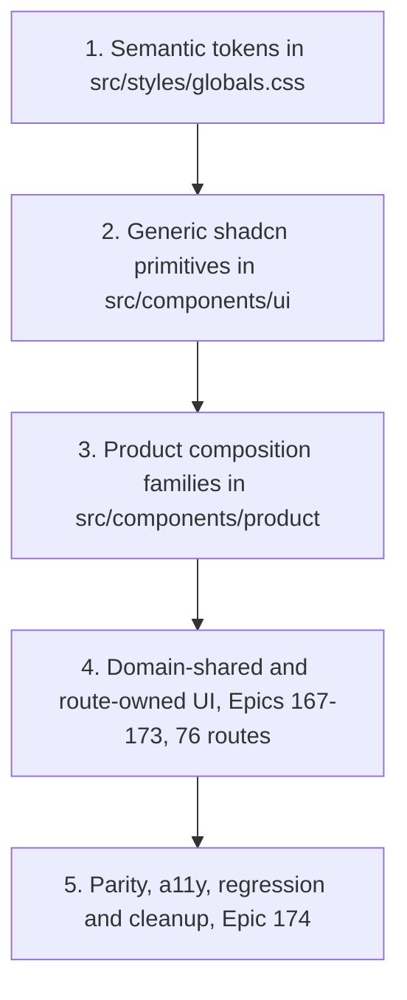

# Design System

The frontend presentation layer is migrating to a layered, semantic design system built on **Tailwind v4** and **shadcn/ui (Radix)**. The layers are built in order and consumed strictly downward. This page documents the foundation delivered by Epic 166 (stories 166.1–166.8: tokens, primitives, and six product-composition families) and the Epics 166–174 migration program that consumes it.



*Build order of the design-system layers; each layer consumes only the layers above it.*

## Why this exists

Before Epic 166, primitives carried hardcoded and light-only palette values (`bg-white`, fixed hex colors) and the theme lived in a JavaScript `tailwind.config.ts`. The migration establishes one semantic token vocabulary, hardens the shared primitives for accessibility and themes, and adds presentational compositions so route migrations can swap presentation without touching URL/search/state logic. It is delivered as part of the full shadcn/UI migration program defined in `.omx/plans/shadcn-full-ui-migration-master.md`.

## Layer 1 — Semantic tokens

`src/styles/globals.css` is the single source of truth for the theme. It uses Tailwind v4 CSS-first configuration:

- `@import 'tailwindcss'` + `@plugin 'tailwindcss-animate'` + a `@custom-variant dark` for class-based dark mode (matching `next-themes`).
- An `@theme inline` block maps every utility color to an HSL CSS variable: background/foreground, card, popover, muted, secondary, accent, border, input, disabled, ring/ring-offset, brand, primary (+ `primary-pressed`, `primary-subtle`), destructive, **financial** (positive/negative/neutral), **status** (success/warning/error/information/pending, each with foreground), **availability** (available/unavailable/stale/partial/restricted/unknown), telegram, and the full **chart** role set (series 1–6, positive/negative/reference/target/forecast/confidence-band/grid/axis/tooltip/selection).
- Typography (`--text-h1` …), spacing, radius, shadow, and animation scales are also defined in `@theme`.
- Light (`:root`) and dark (`.dark`) blocks assign concrete HSL values to each variable.

The JavaScript config was removed: `tailwind.config.ts` is deleted, `postcss.config.js` runs `@tailwindcss/postcss` + autoprefixer, and `components.json` is aligned (`config: ""`, `css: "src/styles/globals.css"`, `cssVariables: true`).

### Token regression tests

| File | Asserts |
|------|---------|
| `src/styles/__tests__/globals-token-contract.test.ts` | Every required semantic role is declared in `@theme`; utility-to-variable mapping is complete and consistent. |
| `src/styles/__tests__/globals-compiled-contrast.test.ts` | Real PostCSS-compiled output resolves to concrete colors; foreground/background pairs meet WCAG contrast for light and dark themes. |
| `src/styles/__tests__/token-test-utils.ts` | Shared `parseGlobals`, `themeInlineRules`, `declarationsFor`, `hslTripletToHex` helpers. |

## Layer 2 — Generic shadcn primitives

`src/components/ui/**` are domain-agnostic wrappers around Radix UI. Story 166.2 migrated fifteen primitives from fixed palette values to semantic tokens and hardened their accessibility contracts:

- **Semantic surfaces**: `bg-background`/`text-foreground`/`border-border`/`bg-accent` etc. replace `bg-white` and hardcoded colors across `dialog`, `alert-dialog`, `sheet`, `popover`, `tooltip`, `dropdown-menu`, `select`, `input`, `textarea`, `checkbox`, `radio-group`, `slider`, `progress`, `table`, `alert`.
- **Accessibility hardening**: Radix-owned Select focus return is restored; `Progress` forwards values including zero; synthetic overlay closes were replaced with native, localized, ≥44×44 (size-11) controls; responsive title space is reserved for narrow and 200%-reflow layouts (`min-[20rem]` guards); semantic invalid states are exposed; named table scrollers get a region contract; `motion-reduce:` variants disable animation/transition.
- **Compatibility preserved**: existing exports, variants, portals, and compatibility props are unchanged — only presentation and a11y behavior moved.

Four consumer test files (`OrderDetailsModal`, `GenerateStickersModal`, `OrderPickerDrawer`, `ScheduleVersionModal`) were updated for the shared Russian close label (`Закрыть`).

### Primitive regression tests

| File | Asserts |
|------|---------|
| `src/components/ui/__tests__/primitive-behavior-contracts.test.tsx` | Direct behavior, palette, portal, focus, reduced-motion, and compatibility contracts for the hardened primitives (uses `react-hook-form`, Testing Library, `userEvent`). |
| `src/components/ui/__tests__/primitive-semantic-surfaces.test.tsx` | Primitives render semantic-token surface/border/focus classes, not hardcoded or light-only values. |

## Layer 3 — Product composition families

`src/components/product/` are presentational, route-supplied compositions. They intentionally own **no** URL/search/debounce/persistence/query/API/store semantics — those stay with their route owners. The families are:

| Family (Story) | Subtree | Key exports |
|----------------|---------|-------------|
| Page context (166.3) | `src/components/product/` root | `PageHeader`, `Breadcrumbs`, `ContextBar` |
| Metrics & status (166.4) | `src/components/product/metrics/` | `FinancialValue`, `MetricCard`, `MetricGroup`, `DataAvailability`, `StatusBadge`, `StatusStrip` |
| Filters & period controls (166.5) | `src/components/product/filters/` | `FilterToolbar` |
| Data tables (166.6) | `src/components/product/tables/` | `ResponsiveTable`, `ResponsiveTableHeader`, `TablePagination`, `TableState`, `VirtualizedTableFrame` |
| Charts & evidence (166.7) | `src/components/product/charts/` | `ChartFrame`, `ChartEvidence`, `ChartLegend`, `ChartState`, `ChartTooltipContent` |
| Page states & async results (166.8) | `src/components/product/states/` | `PageState`, `AsyncOperationStatus`, `BulkResultSummary`, `ContextualSplitView` |

Barrel discipline: `src/components/product/index.ts` re-exports only page-context, metrics, and filters (`export * from './metrics'` / `'./filters'`). The tables, charts, and states families are consumed through their own subtree barrels (`@/components/product/tables`, `.../charts`, `.../states`) — the product root deliberately does not re-export them. Each family ships its own source-contract test with an explicit Story-owned manifest that also rejects route/API/hook/query/store/navigation/raw-palette ownership in the subtree; `product-composition-source-contracts.test.ts` stays scoped to the Story 166.3 files and must not be expanded, bypassed, or made directory-wide.

### Page context (Story 166.3)

#### `PageHeader` — `src/components/product/PageHeader.tsx`

Shared route identity. Renders **exactly one** logical `h1` regardless of visual size.

| Prop | Purpose |
|------|---------|
| `title` | Stable route identity; always the page's single `h1`. Must be non-empty (throws otherwise). |
| `description?` | Optional business-purpose explanation. |
| `breadcrumbs?` / `currentBreadcrumbIndex?` | Route-owned `BreadcrumbItem[]`; final item is current by default; invalid indices safely fall back to the last item. |
| `context?` | Route-supplied context metadata/controls. |
| `status?` | Route-supplied status/availability content. |
| `actions?` | Primary and secondary actions in task order. |
| `children?` | Additional slot below the identity row. |
| `compact?` | Compact layout for contextual detail views. |
| `busy?` | Indicates metadata refresh without replacing the title (`aria-busy`). |
| `breadcrumbLabel?` | Accessible label for the breadcrumb landmark (default `Навигация по странице`). |

#### `Breadcrumbs` (exported from `PageHeader.tsx`)

Standalone breadcrumb composition for routes that do not need the full header. `BreadcrumbItem` carries already-localized `label` and optional `href`; the current/terminal item renders `aria-current="page"`, link items render visible focus rings.

#### `ContextBar` — `src/components/product/ContextBar.tsx`

Decision-scope metadata bar. Semantic `state` (`fresh` | `refreshing` | `stale` | `partial` | `unavailable` | `restricted` | `overridden` | `default`) is rendered as localized text and **never conveyed by color alone**. `onRefresh`/`onReset` are route-owned callbacks — the composition changes no context implicitly. Common fields (`cabinet`, `period`, `comparison`, `freshness`, `completeness`, `scope`) plus generic `items: ContextItem[]` and `actions`/`children` slots.

### Metrics and status (Story 166.4) — `src/components/product/metrics/`

Standardizes how numeric business meaning is presented. `src/components/product/metrics/presentation.ts` is the single semantic map layer: `availabilityPresentation` (11 `AvailabilityState` values — loading, available, missing, unavailable, not-calculated, filtered-out, stale, partial, estimated, restricted, unknown — each with a localized label and `availability-*` token classes), `financialDirectionClass` / `comparisonSentimentClass` (`financial-positive/negative/neutral`, plus `unknown`), and `statusPresentation` (`OperationalStatus` success/warning/error/information/pending/neutral/unknown with icons and `status-*` classes).

- **`FinancialValue`** renders a discriminated `FinancialValueModel` (`value` | `temporal` | empty kinds) with a matching `FinancialFormat` (currency, percent, percentage-points, quantity+unit, duration, decimal, count, or date/date-time/iso-week). Russian locale, sign, tabular numerals, and caller-provided precision are preserved; `display: 'compact'` is only legal for currency/duration and **requires a caller-supplied `fullValue` string**, so the full value is always accessible without a tooltip. Zero, missing, and unavailable stay distinct; nullish/non-finite input never becomes a fabricated zero.
- **`MetricCard`** wraps a value in metric identity: `MetricCardState` is a discriminated union (`loading` / `error` with recovery / `ready`), `MetricComparison` carries caller-controlled meaning (direction ≠ sentiment — an increase can be financially negative), and variants scale density (`hero` | `standard` | `compact` | `dense`).
- **`MetricGroup`** frames related cards (`aria-label`d section, shared variant).
- **`DataAvailability` / `StatusBadge` / `StatusStrip`** render availability and operational status as **localized text with semantic token classes, never color alone** (`data-availability` attribute for testability).

Story 166.4 migrated no routes, formatters, or domain consumers — it only added the composition layer plus its source contract.

### Filters and period controls (Story 166.5) — `src/components/product/filters/`

**`FilterToolbar`** (`FilterToolbar.tsx` + `FilterToolbar.types.ts`) frames caller-owned filter controls. Its `FilterToolbarState` is a discriminated prop union: passive states (`default`, `dependency-loading`, `updating`, `invalid`, `disabled`) take an optional reset, while `state: 'applied'` requires `appliedSummary` + `onReset` + `resetScope`, and `state: 'empty'` additionally pins `resultCount: 0` — an empty *filtered* result is rendered differently from globally absent data. Reset is explicit, caller-owned, and focus-deterministic (`resetFocusRef` names the element that receives focus after reset). Secondary controls are progressive (`expanded`/`defaultExpanded`/`onExpandedChange`), and applied scope, result count, and state labels stay visible in every state.

The existing multi-route period controls were presentation-hardened in place (`src/components/custom/DateRangePicker.tsx`, `DateRangePickerExtended`, `MultiWeekSelector`, `ComparisonPeriodSelector`, `DashboardPeriodSelector`): visible labels, state handling, and wrapping — their URL/search-param/debounce/persistence behavior is unchanged and still owned by each route.

### Data tables (Story 166.6) — `src/components/product/tables/`

A route-free table foundation for static and server-controlled lists (deliberately **not** a client-side data engine — no TanStack Table dependency).

- **`ResponsiveTable`** frames a native semantic table. The name is a required union (`caption` node or `accessibleLabel`), and `TableNarrowStrategy` must be explicit — `horizontal-scroll` (one named, keyboard-reachable scroll region with a declared `minimumWidth`), `priority-columns`, `expanded-detail`, or `stacked-detail` — never inferred from column index. `TableConsumerContract` (in `contracts.ts`) declares numeric columns (`TableNumericColumnContract`: end alignment, precision, `TableNumericUnit`, `tabularNumerals: true`, full-value access), sorting (`TableSortContract`, caller-controlled), selection (`TableSelectionContract` + `TableSelectionSummaryModel`), and row actions; `ResponsiveTableRow` supports `selected`/`disabled`/`expanded`.
- **`ResponsiveTableHeader`** (+ `ResponsiveTableSortButton`, `ResponsiveTableNumericCell`), controlled **`TablePagination`**, **`TableState`** (terminal vs retained table states — retained states keep usable data visible), and **`VirtualizedTableFrame`** (the virtualization-preservation boundary for specialized collections).

### Charts and analytical evidence (Story 166.7) — `src/components/product/charts/`

Standardizes chart identity and non-color evidence. The subtree itself imports **no Recharts** (rejected by the source contract) — domain consumers keep owning series construction, formatting, visibility, selection, and queries, and compose them inside `ChartFrame`.

- **`ChartFrame`** exposes title, period, units, description, freshness, comparison, annotation, and actions as visible, programmatically-associated text. `ChartDataState` splits terminal states (`loading`/`empty`/`unavailable`; `error` requires a `recovery` node — they never fabricate a plot or a zero) from retained states (`rendered`/`partial`/`stale`, which keep evidence visible); `ChartActivityStatus` covers updating.
- **`ChartEvidence`** renders series evidence without relying on color: `ChartSeriesRole` (categorical, positive, negative, reference, target, forecast, confidence, selection) × `ChartSeriesMarker` (solid, dashed, dotted, point, bar, area, band), each with a localized label from `contracts.ts`, plus the equivalent-data alternative for screen readers.
- **`ChartLegend`**, **`ChartState`**, and **`ChartTooltipContent`** (caller-formatted tooltip entries) complete the frame.

### Page states and async results (Story 166.8) — `src/components/product/states/`

Honest state and recovery compositions, plus the single global not-found owner.

- **`PageState`** is built on a discriminated prop union (`PageStateProps` in `contracts.ts`): every state requires `title`, `explanation`, and a **`trust` statement** (what is and is not trustworthy). Passive kinds (loading, empty, offline, processing, success) forbid retained-evidence props; `restricted`/`not-found` require an `action`; `filtered-empty` requires `scope` + `resetAction`; `error` requires `recovery`; retained kinds (refreshing, stale, partial) require a `limitation` explanation plus retained `children`. Terminal states cannot fabricate retained content or a zero.
- **`AsyncOperationStatus`** exposes a caller-resolved lifecycle (`operation`, `scope`, phase union from idle/validating/queued/running/cancellable/non-cancellable/retrying to partial/complete/failed/expired, `safeLeave` guidance, truthful optional progress) without owning the mutation, polling, or retry rules.
- **`BulkResultSummary`** (+ `createBulkResultCounts`) reports exact result counts and failed-item evidence for bulk operations.
- **`ContextualSplitView`** renders list/detail presentation with an explicit narrow-screen detail transition and a deterministic focus contract.
- **`src/app/not-found.tsx`** is the global not-found owner — it renders `PageState state="not-found"` for every unmatched URL (test: `src/app/__tests__/not-found.test.tsx`).

### Product-composition regression tests

| Family | Files | Assert |
|--------|-------|--------|
| Page context | `src/components/product/__tests__/PageContextCompositions.test.tsx`, `product-composition-source-contracts.test.ts` | `PageHeader`/`Breadcrumbs`/`ContextBar` rendering, single-`h1`, current-page marking, state text, busy/compact; Story 166.3 manifest and presentational source contracts. |
| Metrics | `src/components/product/metrics/__tests__/` — `FinancialValue.test.tsx`, `MetricCompositions.test.tsx`, `StatusCompositions.test.tsx`, `metric-composition-source-contracts.test.ts` | Zero vs missing vs unavailable distinctions, compact full-value disclosure, comparison semantics, availability/status text; Story 166.4 manifest. |
| Filters | `src/components/product/filters/__tests__/` — `FilterToolbar.test.tsx`, `filter-toolbar-source-contracts.test.ts` | State-union rendering, applied/empty scope visibility, reset focus determinism; Story 166.5 manifest. |
| Tables | `src/components/product/tables/__tests__/` — `ResponsiveTable.test.tsx`, `ResponsiveTableHeader.test.tsx`, `TablePagination.test.tsx`, `TableState.test.tsx`, `VirtualizedTableFrame.test.tsx`, `TableContracts.test.ts`, `table-composition-source-contracts.test.ts` | Semantic framing, narrow strategies, numeric/sort/selection contracts, controlled pagination; Story 166.6 manifest. |
| Charts | `src/components/product/charts/__tests__/` — `ChartFrame.test.tsx`, `ChartEvidence.test.tsx`, `ChartLegend.test.tsx`, `ChartState.test.tsx`, `ChartTooltipContent.test.tsx`, `ChartContracts.test.ts`, `chart-composition-source-contracts.test.ts` | Identity/trust-state rendering, non-color series evidence, retained-data behavior; Story 166.7 manifest. |
| States | `src/components/product/states/__tests__/` — `PageState.test.tsx`, `AsyncOperationStatus.test.tsx`, `BulkResultSummary.test.tsx`, `ContextualSplitView.test.tsx`, `StateContracts.test.ts`, `state-composition-source-contracts.test.ts` | Discriminated-union prop contracts, trust statements, focus/reset determinism; Story 166.8 manifest. |

## Migration program (Epics 166–174)

The foundation above is the first phase of a 94-story, 76-route migration defined in:

- `.omx/plans/shadcn-full-ui-migration-master.md` — approved master plan, delivery DAG, standard per-story protocol, non-negotiable principles.
- `_bmad-output/planning-artifacts/epics-166-174-fe-shadcn-migration.md` — story scope, acceptance criteria, ownership, forbidden shared files.
- `_bmad-output/planning-artifacts/shadcn-route-ledger.md` — exact route-to-story ownership for all 76 `page.tsx` routes.
- `_bmad-output/planning-artifacts/shadcn-migration-status-and-debt-registry.md` — rolling status/debt snapshot of the migration waves (shipping log: Epics 166–168, 170, 171 closed; Epic 169 closed 15/15; Epic 172 at 9/17 with NEXT = 172.10; per-story status lives in `_bmad-output/implementation-artifacts/sprint-status.yaml` and is summarized on [Migration Program](migration-program.md)).
- `_bmad-output/planning-artifacts/ux-design-specification.md` — visual/interaction/responsive/table/chart/state/theme/accessibility contracts.

**Non-negotiable principles**: preserve behavior before changing presentation; keep `src/components/ui/**` generic and domain-agnostic; build in layers; one shared file = one upstream owner Story; never run `shadcn init --force`; do not hide financial/operational/chart/table/availability/error meaning behind color, hover, truncation, or viewport width; local validation is the merge gate; production/deployment work is forbidden (see [Architecture — Configuration](architecture.md#configuration) and [Testing & Operations](testing-and-ops.md)).

The full foundation (Stories 166.1–166.8) has landed in order: 166.1 tokens → 166.2 primitives → 166.3 page-context, 166.4 metrics, 166.5 filters, 166.6 tables, 166.7 charts, 166.8 states. **Epic 167 is closed** — all 9 stories done, including the re-planned onboarding lane (167.8 backend contracts → 167.9 account-scoped settlement → 167.5 `/cabinet` → 167.6 `/processing` → 167.7 `/wb-token`); 167.1 unified the protected AppShell (one `resolveNavigationItems` model consumed by both desktop `Sidebar` and mobile `MobileSidebarSheet` in `src/app/(dashboard)/layout.tsx`), 167.2 migrated the root entry, 167.3/167.4 the auth pages. **Epic 168 (analytics core) is closed**: 168.1–168.10 — analytics hub + shared-UI tokens, alerts, analytical dashboard, finance-history, orders, pricing, product detail (`OrganicTab`), reorder, SKU (route + `sku-financials` tree), and time-period (route + `MarginTrendChart` tree, moving chart dots/grid/line/tooltip to the `--color-chart-*` role tokens) — plus 168.11 unit-economics, which migrated the route (~40 sites, waterfall profit/loss to chart tokens) and consolidated the shared profitability tier tokens: `PROFITABILITY_STATUS_CONFIG` in `src/lib/unit-economics-config.ts` now uses the `/15`-chip idiom as the single set shared with the 168.9 legend and sku-financials (the `bgColor` hex field was deleted; `src/types/sku-financials/core.ts` carries the token classes). **Epic 169 (accessible operational analytics) is CLOSED 15/15** (2026-08-28): 169.1–169.5 are done — acquiring report index (route + shared `AcquiringRateLimitBanner`/`AnomalyVatIndicator`), acquiring period detail, acquiring report transaction detail (shared `AcquiringTransactionsTable`, additive-only optional caption), buyout analytics (single-source `BUYOUT_TREND_COLORS` in `buyout-trend-config.ts`, first consumer of `var(--color-chart-axis)`), buyout reconciliation (semantic `AnomalyIndicator`, 5-branch state machine untouched), and **169.6–169.10 are now also done**: 169.6 enhanced FBS analytics (route + regional tooltip moved to chart tokens), 169.7 FBS stock analytics (groups/regions/sizes sections), 169.8 funnel analytics (overlay chart split into `FunnelOverlayPlot`/`FunnelOverlayEvidence`, new `FunnelSyncStatus`/`SyncStatusBanner` presentation, retained-state and terminal-frame helpers in `src/app/(dashboard)/analytics/funnel/components/`), 169.9 gaps triage (query states and dialog lifecycle hardened in `useGapsPageState.ts`), and 169.10 liquidity (`liquidity-category-tokens.ts` as the shared category token source; liquidation planning modal/cards migrated). **169.11 (returns) is done** (PR #219 + preface PR #218): its Task-0 preface first preserved the unknown return category at the API boundary (`return-analytics-normalizer.ts` maps unrecognized categories to `'unknown'` with the neutral label «Неклассифицированный возврат» instead of coercing to a real category — see [API Layer & Normalizers](api-and-normalizers.md)); the migration then moved 4 trend series to `chart-1..3` + `chart-negative` (stack-order pinned), added the shared `ReturnTrendSrTable` sr-only data-alternative table, migrated reason triplets to status tokens with muted unknown-fallbacks, and added recursive no-palette/no-hex source-contract guards with a pinned production file count. **169.12 storage** has its Task-0 preface merged (PR #226: tri-state `has_warehouse_stock`, nullable `percent_of_total`, distinguishable `'unknown'` import status at the boundary — see [API Layer & Normalizers](api-and-normalizers.md)); the route migration itself landed early through PR #227 (`52f7f506`, 27 files; review round 71b1105b hardened error retention and set `aria-sort="none"` on non-sortable storage headers), but the Story is **not counted complete**: the approved Correct Course (PR #228) added two sequential non-route prerequisites — Story 169.14 (authoritative backend paid-storage import lifecycle/result/error contract) then Story 169.15 (shared frontend boundary alignment) — before 169.12's bounded contract closeout (plans: `.omx/plans/169.14-establish-authoritative-paid-storage-import-lifecycle-and-result-contract.md`, `.omx/plans/169.15-align-shared-frontend-paid-storage-import-boundary.md`). **169.13 (supply planning) is done** (preface PR #231 + migration PR #232, closed via PR #233): the preface preserved unknown `stockout_risk`/`reorder_status` enums and nullable velocity/capital at the API boundary (see [API Layer & Normalizers](api-and-normalizers.md)); the migration then introduced `supply-risk-tokens.ts` in the route's components as the single source reconciling the four previously divergent risk-tier color sites (risk-card-styles, row-constants, detail-header ternary, inline ring hex — the 169.4 tier-reconcile canon, following the 169.10 `liquidity-category-tokens.ts` pattern), with `unknown` styled muted rather than healthy green, plus `supply-planning-presentation-source-contracts.test.tsx` no-palette/no-hex guards, `sr-only` disambiguation, and pinned `aria-sort` on the total-occurrence column. Known carry-out: a pre-existing, load-dependent sidebar→supply-planning E2E flake (dashboard URL-race, documented in the test itself) is queued for e2e-hardening before 172.1. Epic 169 remainder: 169.14 (backend) → 169.15 (shared FE) → 169.12 closeout — **all three are now done and the epic is closed 15/15**: 169.14 (backend PR #229 + frontend final-handoff PR #292, all lifecycle records cleaned), 169.15 (PR #296 merged `2d99f7f3`, targeted 70/70), and 169.12's bounded contract closeout (PR #299, merge `3ff35bf6`, 158/158 route + 19 367/19 367 full). Story numbers are identities, not a universal execution order; later epics (169–173 routes, 174 audit) build on these merged prerequisites.

**Epic 170 (marketing analytics) is closed 7/7** (PRs #237–#250, 2026-08-25/26): 170.1 advertising analytics (route + route-local `advertising-tokens.ts` efficiency/campaign-status maps, `daily-trend-config.ts` and `ad-cost-discrepancy-config.ts` on chart tokens, sr-only `DailyTrendSrTable`, status `status-warning` `/15`+`/30` matched pairs for over-attribution/multi-campaign banners, honest-null `meta.last_sync` post-preface #236); 170.2 campaign detail (plain semantic back `Link`, no nested Button); 170.3 brand and 170.5 category (direct mirrors — `text-2xl font-semibold` h1 token canon, info-panel status-information tints in `BrandHelpSection`/`CategoryHelpSection`); 170.4 brand-share (`src/components/custom/analytics/BrandShareView.tsx` family — `id`+`aria-labelledby` filter names, filter context threaded into the chart subtitle, ≥44px SelectTrigger/retry Button, share-axis domain pinned 0–100); 170.6 cross-reference (single-source `channel-styling.ts`, unified correlation taxonomy on `interpretCorrelation`, one-source-partial coexistence: a failed query keeps the other sources' data visible — the 169.12 pattern); 170.7 search analytics (route + deep-link `?tab=`/`?nmId=` validated at page level with precedence `?tab=` > `?query=` > orders, single-source `search-chart-config.ts`, Pattern-1 own loading/error chrome over shared position tables).

**Epic 171 (AI/forecast analytics) is CLOSED 9/9** (PRs #252–#262 then the evening wave #266/#268/#270, 2026-08-26): 171.1 ai-admin anomalies (born token-clean, 7 contract gaps closed — accessible anomaly identity, filtered-empty distinct from no-anomalies, 409-conflict honest state, polite pending announcement); 171.2 ai-admin models list (`AdminModelsContent` filter-empty vs no-data split; epic AX literal "focus returns to the invoking row" delivered in the rollback dialog by capturing the row's button before unmount and re-querying it inside a `requestAnimationFrame` — a background refetch may remount the row between capture and frame); 171.3 ai-admin preferences (NO-OP verdict plus micro-fixes: mutation error `Alert` id joined into the Switch's describedby chain, `max-w-2xl` readable form width); 171.4 forecast (`ForecastChart` band cutout fixed for dark mode, 13 chart hexes removed, band tiers, sr-only `ForecastChartSrTable`, forecast series deliberately carry no financial valence — this is the live chart canon later reused by 171.9); 171.5 forecast-accuracy (MINOR-GAP — born clean, single amber MAPE>200 warning site + 169.7 static captions); 171.6 model registry root (`STATUS_BADGE_CONFIG` in `model-list-helpers.ts`: 7 light-only palette classes → semantic status tokens with hue preserved, shape frozen `{className,label,pulse}` because the then-unmigrated `[id]` subroutes read `.className`; pulse dot → `bg-status-information`, double-`p-6` removed, tabular-nums on version/MAPE/trained columns); **171.7 model evaluations list** (PR #266 — born-clean MINOR-GAP: `STATUS_BADGE_CONFIG.className` detached via route-local `EVALUATION_STATUS_BADGE_CLASS` `Record<ModelStatus,string>` map, byte-identical 1:1 across all 7 statuses, label still single-sourced from the shared config; TableCaption naming the model, tabular-nums ×7 with nmId exempt); **171.8 evaluation SKU-accuracy detail** (PR #268 — born-clean: TableCaption ×2, tabular-nums ×9, route paddings removed; also a cross-surface fix of the 171.7 guard whose substring filter on the joined absolute path matched the 171.8 plan-pinned worktree name and emptied the catalog — guards now filter relative segments before join); **171.9 model performance detail** (PR #270 — the only `[id]` subroute with real palette+hex: DRIFT+valence palette → status tokens with dark fix, `MapeTrendChart`'s 8 hexes → the 171.4 chart canon CSS vars (border/`chart-axis`/`chart-1`), performance consumers detached from `STATUS_BADGE_CONFIG.className` via a route-local map). The `className` field itself was **not** deleted: live-code check showed registry-root `ModelListSection.tsx:149` also renders `badge.className`, so removal was re-routed to 174.2 (route-ledger handoff from 171.9) together with rewriting the stale helper comments and migrating the 171.6 guard pins. The `/analytics/models` tree is now fully migrated and each `[id]` subroute has its own guard (`evaluations-list`, `sku-accuracy`, `model-performance`).

**Epic 172 (business operations, 17 stories) is IN PROGRESS at 9/17** (PRs #278–#285 then #287/#289/#293/#301+#303/#305, 2026-08-26–28): 172.1 business dashboard (PR #278, FULL cycle — 127 files across `src/app/(dashboard)/dashboard/**` and the `src/components/custom/dashboard/**` family incl. `BaseMetricCard`, executed in four delegated waves; `DashboardStatusStrip` consolidates the 8 conditional banners into one expandable status line using `status-*` token tones while children stay mounted via `hidden` so banner state and DOM assertions are preserved; `dashboard-presentation-source-contracts` + `dashboard-widgets-presentation-source-contracts` guards added, full floor 19 281 → 19 297); 172.2 canned automation rules gallery (PR #280 — `CannedRulesGallery` born-clean on merged shadcn primitives, py-6 debt and raw-button closed, new gallery e2e package with a fixture controller); 172.3 installed rules list (PR #282 — status tokens across badge/safety/banner, incl. `InstalledRuleRow`); 172.4 installed rule detail/editor (PR #285 — editor status tokens, `WritebackSafetyAcknowledgement` in the editor, and the 163.3 editor spec finally live 8/8). **172.5 single-product COGS management** (PR #287, merge `4e86272b` — FULL-lite owner story: the `/cogs` route page + the `ProductList`/`SingleCogs`/`Cogs*` custom-root family, 24 files, ~80 palette sites → 0, full floor 19 327/0, three-pass review with a transitive closure audit over 28 files; its guard pins a 21-file root catalog plus the `single-cogs`, `product-margin-cell`, and `products` subtrees, and pins valence/state tokens: margin cell signs on `text-status-success/-error`, selected rows on the information-tint idiom, missing-state config with solid `bg-status-error` critical and `/10` tints for warning/info). **172.6 bulk COGS assignment** (PR #289, merge `42ac0686` — MINOR-GAP-plus owner story: `/cogs/bulk` route + the `bulk-cogs/**` tree (11 files) + the `BulkCogsForm` re-export shim, 49 palette sites → 0; single/history/price-calculator surfaces excluded by construction; pins cover alerts summary tiles, selected rows, form-validation destructive, and preview/primary button). **172.7 COGS history** (PR #293, merge `da3e9078` — MINOR-GAP born-clean: `/cogs/history` route tree (5 files) + 5 custom-root widgets (`CogsHistoryTable`, `CogsHistoryMeta`, `CogsHistoryPagination`, `AffectedWeeksCell`, `CogsHistoryTableCells`); caption + tabular-nums table-contract pins and a muted deleted-row pin; full floor 19 343/0). **172.8 COGS price calculator** (feature PR #301, merge `08191dae` + reconciliation PR #303, merge `0b4c9deb` — MINOR-GAP: `/cogs/price-calculator` + the 71-file mutable manifest over `src/components/custom/price-calculator/**` (from `AcceptanceStatusBadge` to `WarehouseTariffsByBoxType`, plus `cost-breakdown-types.ts`/`margin-status-helpers.ts`); the guard rejects raw palette classes including black/white/950 utilities and any hex literal, and pins the narrow-width reflow contract for live calculator controls — `DimensionInputSection` and `WarehouseSelect`; composite full floor 19 383/0; dynamic-Playwright coverage is a recorded named gap). **172.9 communications workspace** (PR #305, merge `feb35cfd` — MINOR-GAP: the `/communications` route tree only, 18 files (+591/−18), hooks/API/types being forbidden shared files: `ChatComposer`, `ChatMessages`, `ChatsSection`, `ClaimsSection`, `FeedbackRow`/`FeedbacksSection`/`FeedbackWriteControls`, `PinnedReviewsSection`/`PinnedWriteControls`, `QuestionRow`/`QuestionsSection`/`QuestionWriteControls`, `ReplyForm`, `SectionState`, `UnreadBadge`, `WritebackStatus`, `ConfirmAction`; 15 palette sites → 0 with pins for status-success/-error valence, destructive writeback alerts ×5 plus the unread dot/counter, the primary seller bubble, `status-warning` rating stars, and raw-button → ghost `ui-Button` (`px-0`) thread rows; tabular-nums and route-level padding pins; a fixture-controlled e2e package was created; full floor 19 394/0; closure audit over 64 files clean). **NEXT = 172.10 finances & documents** (Epic 172 remainder 172.10–172.17; 172.14 is owner-coordinated). The automation domain (gallery + list + editor), the full COGS domain (single + bulk + history + price calculator), and the communications workspace are migrated end-to-end. Epics 173 (13 stories) and 174 (5 stories, final consolidation) remain in backlog.

## Route presentation source-contract guards (Epics 169–171 canon)

Every migrated route ships a `*-presentation-source-contracts.test(.tsx)` guard that pins the migrated surface so palette debt cannot regress. The canon (established by 169.11/169.12, refined by 170.x/171.x):

- **No raw hex, no Tailwind palette classes** — comment-stripped source of every owned production file is checked against `HEX_RE` (`#[0-9a-fA-F]{3,8}`) and `PALETTE_RE` (`text|bg|border|fill|stroke|ring|…-<color>-<nnn>`). `bg-white` is deliberately not flagged (token-adjacent). Self-tests prove the regexes fire on canonical violations, so the guard cannot silently rot.
- **Pinned owned-file catalog** — the manifest enumerates the exact migrated files (e.g. `cross-reference` pins "exactly 14 files", `forecast` "exactly 18 files", `search` pins the 22/23-file post-migration count). Partial-tree guards exclude not-yet-migrated subtrees explicitly: advertising excludes nested `campaigns/[advertId]` (separate ownership), and `model-registry-presentation-source-contracts.test.ts` is the first guard with an unmigrated-subroute exclusion (`[id]/**`).
- **Story-anchored pins** — token-flipped test pins (e.g. `getAdDeltaColor` → `text-status-success/error`, severity chips → status tokens) carry `Story 170.x` comments tying each pin to its migration, with thresholds explicitly unchanged.
- **C4 state-disposition matrix** — 170.1's guard documents, per data state (initial loading, background refresh, global vs filtered empty, sync gaps, over-attribution, partial daily/finance, stale), whether it is TESTED, N/A-with-evidence, or route-owned, so state honesty is auditable from the guard itself.

Current guards: `advertising`, `anomalies`, `brand-share` (in `src/components/custom/analytics/__tests__/`), `campaign-detail` (in `src/components/custom/advertising/__tests__/`), `cross-reference`, `forecast`, `forecast-accuracy`, `funnel`, `gaps`, `liquidity`, `model-registry`, `returns`, `search`, `storage`, `supply-planning`; the models `[id]` subroutes from Epic 171 — `evaluations-list`, `sku-accuracy`, `model-performance` (under `src/app/(dashboard)/analytics/models/[id]/`); and the Epic 172 family — `dashboard`, `dashboard-widgets` (in `src/components/custom/dashboard/__tests__/`), `canned-rules`, `installed-rules`, `installed-rule-editor` (under `src/app/(dashboard)/automation/`); and the COGS/communications wave — `cogs-single`, `bulk-cogs`, `cogs-history` (under `src/app/(dashboard)/cogs/**/__tests__/`), `story-172.8-presentation-source-contract` for the price calculator (in `src/components/custom/price-calculator/__tests__/`, guarding the route page plus the 71-file mutable family manifest), and `communications` (under `src/app/(dashboard)/communications/__tests__/`, route-tree-only with hooks/API/types excluded as forbidden shared files). The 171.8 anchor-safe lesson is canon for all relative-path guards: filter relative segments before joining to an absolute path, or a sibling worktree whose plan-pinned name contains the subtree name will silently empty the owned-file catalog.

## Remaining migration debt registry

Per `_bmad-output/planning-artifacts/shadcn-migration-status-and-debt-registry.md` and the per-story shipping log in `_bmad-output/implementation-artifacts/sprint-status.yaml` (Epics 166–171 and 169 all closed — 169 15/15; 172 at 9/17; per-story status is summarized on [Migration Program](migration-program.md)):

| Debt | Owner / due |
|------|-------------|
| Epic 172 remainder: 172.10–172.17 (NEXT = 172.10 finances & documents; 172.14 owner-dependent) | Current lane |
| Epics 173 (13 stories) and 174 (5 stories) | Backlog; 174 strictly after 166–173 |
| `STATUS_BADGE_CONFIG.className` — both `[id]` consumers detached (171.7/171.9 route-local 1:1 maps), field retained only for registry-root `ModelListSection.tsx:149`; removal plus stale-comment rewrites (`model-list-helpers.ts:24-26`, `evaluations-list-helpers.ts:20-23`), migration of the 171.6 guard token pins, and 171.6 anchor-hardening | Re-routed to 174.2 (route-ledger handoff from 171.9) |
| Sidebar→supply-planning E2E flake (dashboard URL-race, load-dependent, documented in the test) | e2e-hardening queue |
| Browser/theme/visual evidence for merged stories (incl. dark/breakpoint/zoom/reduced-motion manual runs) | Epic 174.3 |
| Credentialed functional E2E (incl. early-Epic-171 stories without e2e specs: 171.1/171.2/171.3) | Epic 174.4 |
| locale-percent ratchet at 4; docs check baseline 97 entries | Continuous ratchets, not blockers |

## When to consult this page

- Changing any color, spacing, radius, shadow, or typography value → edit `src/styles/globals.css` and re-run the token + contrast tests.
- Adding or modifying a `src/components/ui/**` primitive → keep it semantic-token-only and domain-agnostic; extend the primitive-behavior/semantic-surface tests.
- Adding a new shared presentational composition → place it in the owning `src/components/product/<family>/` subtree; keep it presentational and route-supplied; extend that family's tests and add its files to that family's source-contract manifest (do not widen an existing manifest).
- Migrating a route → confirm prerequisite Stories are merged, then follow the master plan's per-story protocol; consume compositions through the documented barrels (`src/components/product` for page-context/metrics/filters; subtree barrels for tables/charts/states).
- Adding or shrinking an interactive control (icon buttons, dismiss ×, clear, retry) → keep the hit-area floor at **44px** (`min-h-11 min-w-11`, TD-E). Precedent: the price-calculator `AutoFillWarning` dismiss ×, `CategorySelector` clear, and `ErrorMessage` retry (`src/components/custom/price-calculator/`) all use the unified 44px minimum with honest comments about the visual trade-offs (block grows, icon size unchanged).

## Change safety and validation

Design-system changes are guarded by focused regression suites; do not run the full suite to confirm a token, primitive, or composition change:

```bash
npx vitest run src/styles/__tests__ src/components/ui/__tests__ src/components/product
```

Token edits additionally require `npm run build` because the compiled CSS is what the contrast test parses. Primitive hardening must preserve every existing export, variant, portal, and compatibility prop — check the four updated consumer modal tests when changing close-control or focus behavior. Composition-family changes must keep the family's discriminated-union props exhaustive (a new state kind has to extend the union and the tests together) and keep the family's source-contract manifest in sync with its file list.
