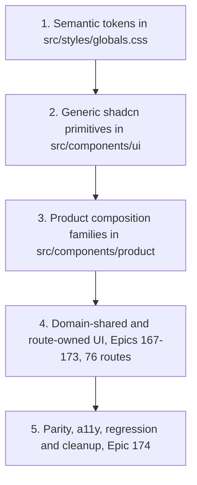

# Design System

The frontend presentation layer is migrating to a layered, semantic design system built on **Tailwind v4** and **shadcn/ui (Radix)**. The layers are built in order and consumed strictly downward. This page documents the foundation delivered by Epic 166 (stories 166.1–166.8: tokens, primitives, and six product-composition families) and the Epics 166–174 migration program that consumes it.



*Build order of the design-system layers; each layer consumes only the layers above it.*

## Why this exists

Before Epic 166, primitives carried hardcoded and light-only palette values (`bg-white`, fixed hex colors) and the theme lived in a JavaScript `tailwind.config.ts`. The migration establishes one semantic token vocabulary, hardens the shared primitives for accessibility and themes, and adds presentational compositions so route migrations can swap presentation without touching URL/search/state logic. It is delivered as part of the full shadcn/UI migration program defined in `.omx/plans/shadcn-full-ui-migration-master.md`.

## Layer 1 — Semantic tokens

`src/styles/globals.css` is the single source of truth for the theme. It uses Tailwind v4 CSS-first configuration:

- `@import 'tailwindcss'` + `@plugin 'tailwindcss-animate'` + a `@custom-variant dark` for class-based dark mode (matching `next-themes`).
- An `@theme inline` block maps every utility color to an HSL CSS variable: background/foreground, card, popover, muted, secondary, accent, border, input, disabled, ring/ring-offset, brand, primary (+ `primary-pressed`, `primary-subtle`), destructive, **financial** (positive/negative/neutral), **status** (success/warning/error/information/pending, each with foreground), **availability** (available/unavailable/stale/partial/restricted/unknown), telegram, and the full **chart** role set (series 1–6, positive/negative/reference/target/forecast/confidence-band/grid/axis/tooltip/selection).
- Typography (`--text-h1` …), spacing, radius, shadow, and animation scales are also defined in `@theme`.
- Light (`:root`) and dark (`.dark`) blocks assign concrete HSL values to each variable.

The JavaScript config was removed: `tailwind.config.ts` is deleted, `postcss.config.js` runs `@tailwindcss/postcss` + autoprefixer, and `components.json` is aligned (`config: ""`, `css: "src/styles/globals.css"`, `cssVariables: true`).

### Token regression tests

| File | Asserts |
|------|---------|
| `src/styles/__tests__/globals-token-contract.test.ts` | Every required semantic role is declared in `@theme`; utility-to-variable mapping is complete and consistent. |
| `src/styles/__tests__/globals-compiled-contrast.test.ts` | Real PostCSS-compiled output resolves to concrete colors; foreground/background pairs meet WCAG contrast for light and dark themes. |
| `src/styles/__tests__/token-test-utils.ts` | Shared `parseGlobals`, `themeInlineRules`, `declarationsFor`, `hslTripletToHex` helpers. |

## Layer 2 — Generic shadcn primitives

`src/components/ui/**` are domain-agnostic wrappers around Radix UI. Story 166.2 migrated fifteen primitives from fixed palette values to semantic tokens and hardened their accessibility contracts:

- **Semantic surfaces**: `bg-background`/`text-foreground`/`border-border`/`bg-accent` etc. replace `bg-white` and hardcoded colors across `dialog`, `alert-dialog`, `sheet`, `popover`, `tooltip`, `dropdown-menu`, `select`, `input`, `textarea`, `checkbox`, `radio-group`, `slider`, `progress`, `table`, `alert`.
- **Accessibility hardening**: Radix-owned Select focus return is restored; `Progress` forwards values including zero; synthetic overlay closes were replaced with native, localized, ≥44×44 (size-11) controls; responsive title space is reserved for narrow and 200%-reflow layouts (`min-[20rem]` guards); semantic invalid states are exposed; named table scrollers get a region contract; `motion-reduce:` variants disable animation/transition.
- **Compatibility preserved**: existing exports, variants, portals, and compatibility props are unchanged — only presentation and a11y behavior moved.

Four consumer test files (`OrderDetailsModal`, `GenerateStickersModal`, `OrderPickerDrawer`, `ScheduleVersionModal`) were updated for the shared Russian close label (`Закрыть`).

### Primitive regression tests

| File | Asserts |
|------|---------|
| `src/components/ui/__tests__/primitive-behavior-contracts.test.tsx` | Direct behavior, palette, portal, focus, reduced-motion, and compatibility contracts for the hardened primitives (uses `react-hook-form`, Testing Library, `userEvent`). |
| `src/components/ui/__tests__/primitive-semantic-surfaces.test.tsx` | Primitives render semantic-token surface/border/focus classes, not hardcoded or light-only values. |

## Layer 3 — Product composition families

`src/components/product/` are presentational, route-supplied compositions. They intentionally own **no** URL/search/debounce/persistence/query/API/store semantics — those stay with their route owners. The families are:

| Family (Story) | Subtree | Key exports |
|----------------|---------|-------------|
| Page context (166.3) | `src/components/product/` root | `PageHeader`, `Breadcrumbs`, `ContextBar` |
| Metrics & status (166.4) | `src/components/product/metrics/` | `FinancialValue`, `MetricCard`, `MetricGroup`, `DataAvailability`, `StatusBadge`, `StatusStrip` |
| Filters & period controls (166.5) | `src/components/product/filters/` | `FilterToolbar` |
| Data tables (166.6) | `src/components/product/tables/` | `ResponsiveTable`, `ResponsiveTableHeader`, `TablePagination`, `TableState`, `VirtualizedTableFrame` |
| Charts & evidence (166.7) | `src/components/product/charts/` | `ChartFrame`, `ChartEvidence`, `ChartLegend`, `ChartState`, `ChartTooltipContent` |
| Page states & async results (166.8) | `src/components/product/states/` | `PageState`, `AsyncOperationStatus`, `BulkResultSummary`, `ContextualSplitView` |

Barrel discipline: `src/components/product/index.ts` re-exports only page-context, metrics, and filters (`export * from './metrics'` / `'./filters'`). The tables, charts, and states families are consumed through their own subtree barrels (`@/components/product/tables`, `.../charts`, `.../states`) — the product root deliberately does not re-export them. Each family ships its own source-contract test with an explicit Story-owned manifest that also rejects route/API/hook/query/store/navigation/raw-palette ownership in the subtree; `product-composition-source-contracts.test.ts` stays scoped to the Story 166.3 files and must not be expanded, bypassed, or made directory-wide.

### Page context (Story 166.3)

#### `PageHeader` — `src/components/product/PageHeader.tsx`

Shared route identity. Renders **exactly one** logical `h1` regardless of visual size.

| Prop | Purpose |
|------|---------|
| `title` | Stable route identity; always the page's single `h1`. Must be non-empty (throws otherwise). |
| `description?` | Optional business-purpose explanation. |
| `breadcrumbs?` / `currentBreadcrumbIndex?` | Route-owned `BreadcrumbItem[]`; final item is current by default; invalid indices safely fall back to the last item. |
| `context?` | Route-supplied context metadata/controls. |
| `status?` | Route-supplied status/availability content. |
| `actions?` | Primary and secondary actions in task order. |
| `children?` | Additional slot below the identity row. |
| `compact?` | Compact layout for contextual detail views. |
| `busy?` | Indicates metadata refresh without replacing the title (`aria-busy`). |
| `breadcrumbLabel?` | Accessible label for the breadcrumb landmark (default `Навигация по странице`). |

#### `Breadcrumbs` (exported from `PageHeader.tsx`)

Standalone breadcrumb composition for routes that do not need the full header. `BreadcrumbItem` carries already-localized `label` and optional `href`; the current/terminal item renders `aria-current="page"`, link items render visible focus rings.

#### `ContextBar` — `src/components/product/ContextBar.tsx`

Decision-scope metadata bar. Semantic `state` (`fresh` | `refreshing` | `stale` | `partial` | `unavailable` | `restricted` | `overridden` | `default`) is rendered as localized text and **never conveyed by color alone**. `onRefresh`/`onReset` are route-owned callbacks — the composition changes no context implicitly. Common fields (`cabinet`, `period`, `comparison`, `freshness`, `completeness`, `scope`) plus generic `items: ContextItem[]` and `actions`/`children` slots.

### Metrics and status (Story 166.4) — `src/components/product/metrics/`

Standardizes how numeric business meaning is presented. `src/components/product/metrics/presentation.ts` is the single semantic map layer: `availabilityPresentation` (11 `AvailabilityState` values — loading, available, missing, unavailable, not-calculated, filtered-out, stale, partial, estimated, restricted, unknown — each with a localized label and `availability-*` token classes), `financialDirectionClass` / `comparisonSentimentClass` (`financial-positive/negative/neutral`, plus `unknown`), and `statusPresentation` (`OperationalStatus` success/warning/error/information/pending/neutral/unknown with icons and `status-*` classes).

- **`FinancialValue`** renders a discriminated `FinancialValueModel` (`value` | `temporal` | empty kinds) with a matching `FinancialFormat` (currency, percent, percentage-points, quantity+unit, duration, decimal, count, or date/date-time/iso-week). Russian locale, sign, tabular numerals, and caller-provided precision are preserved; `display: 'compact'` is only legal for currency/duration and **requires a caller-supplied `fullValue` string**, so the full value is always accessible without a tooltip. Zero, missing, and unavailable stay distinct; nullish/non-finite input never becomes a fabricated zero.
- **`MetricCard`** wraps a value in metric identity: `MetricCardState` is a discriminated union (`loading` / `error` with recovery / `ready`), `MetricComparison` carries caller-controlled meaning (direction ≠ sentiment — an increase can be financially negative), and variants scale density (`hero` | `standard` | `compact` | `dense`).
- **`MetricGroup`** frames related cards (`aria-label`d section, shared variant).
- **`DataAvailability` / `StatusBadge` / `StatusStrip`** render availability and operational status as **localized text with semantic token classes, never color alone** (`data-availability` attribute for testability).

Story 166.4 migrated no routes, formatters, or domain consumers — it only added the composition layer plus its source contract.

### Filters and period controls (Story 166.5) — `src/components/product/filters/`

**`FilterToolbar`** (`FilterToolbar.tsx` + `FilterToolbar.types.ts`) frames caller-owned filter controls. Its `FilterToolbarState` is a discriminated prop union: passive states (`default`, `dependency-loading`, `updating`, `invalid`, `disabled`) take an optional reset, while `state: 'applied'` requires `appliedSummary` + `onReset` + `resetScope`, and `state: 'empty'` additionally pins `resultCount: 0` — an empty *filtered* result is rendered differently from globally absent data. Reset is explicit, caller-owned, and focus-deterministic (`resetFocusRef` names the element that receives focus after reset). Secondary controls are progressive (`expanded`/`defaultExpanded`/`onExpandedChange`), and applied scope, result count, and state labels stay visible in every state.

The existing multi-route period controls were presentation-hardened in place (`src/components/custom/DateRangePicker.tsx`, `DateRangePickerExtended`, `MultiWeekSelector`, `ComparisonPeriodSelector`, `DashboardPeriodSelector`): visible labels, state handling, and wrapping — their URL/search-param/debounce/persistence behavior is unchanged and still owned by each route.

### Data tables (Story 166.6) — `src/components/product/tables/`

A route-free table foundation for static and server-controlled lists (deliberately **not** a client-side data engine — no TanStack Table dependency).

- **`ResponsiveTable`** frames a native semantic table. The name is a required union (`caption` node or `accessibleLabel`), and `TableNarrowStrategy` must be explicit — `horizontal-scroll` (one named, keyboard-reachable scroll region with a declared `minimumWidth`), `priority-columns`, `expanded-detail`, or `stacked-detail` — never inferred from column index. `TableConsumerContract` (in `contracts.ts`) declares numeric columns (`TableNumericColumnContract`: end alignment, precision, `TableNumericUnit`, `tabularNumerals: true`, full-value access), sorting (`TableSortContract`, caller-controlled), selection (`TableSelectionContract` + `TableSelectionSummaryModel`), and row actions; `ResponsiveTableRow` supports `selected`/`disabled`/`expanded`.
- **`ResponsiveTableHeader`** (+ `ResponsiveTableSortButton`, `ResponsiveTableNumericCell`), controlled **`TablePagination`**, **`TableState`** (terminal vs retained table states — retained states keep usable data visible), and **`VirtualizedTableFrame`** (the virtualization-preservation boundary for specialized collections).

### Charts and analytical evidence (Story 166.7) — `src/components/product/charts/`

Standardizes chart identity and non-color evidence. The subtree itself imports **no Recharts** (rejected by the source contract) — domain consumers keep owning series construction, formatting, visibility, selection, and queries, and compose them inside `ChartFrame`.

- **`ChartFrame`** exposes title, period, units, description, freshness, comparison, annotation, and actions as visible, programmatically-associated text. `ChartDataState` splits terminal states (`loading`/`empty`/`unavailable`; `error` requires a `recovery` node — they never fabricate a plot or a zero) from retained states (`rendered`/`partial`/`stale`, which keep evidence visible); `ChartActivityStatus` covers updating.
- **`ChartEvidence`** renders series evidence without relying on color: `ChartSeriesRole` (categorical, positive, negative, reference, target, forecast, confidence, selection) × `ChartSeriesMarker` (solid, dashed, dotted, point, bar, area, band), each with a localized label from `contracts.ts`, plus the equivalent-data alternative for screen readers.
- **`ChartLegend`**, **`ChartState`**, and **`ChartTooltipContent`** (caller-formatted tooltip entries) complete the frame.

### Page states and async results (Story 166.8) — `src/components/product/states/`

Honest state and recovery compositions, plus the single global not-found owner.

- **`PageState`** is built on a discriminated prop union (`PageStateProps` in `contracts.ts`): every state requires `title`, `explanation`, and a **`trust` statement** (what is and is not trustworthy). Passive kinds (loading, empty, offline, processing, success) forbid retained-evidence props; `restricted`/`not-found` require an `action`; `filtered-empty` requires `scope` + `resetAction`; `error` requires `recovery`; retained kinds (refreshing, stale, partial) require a `limitation` explanation plus retained `children`. Terminal states cannot fabricate retained content or a zero.
- **`AsyncOperationStatus`** exposes a caller-resolved lifecycle (`operation`, `scope`, phase union from idle/validating/queued/running/cancellable/non-cancellable/retrying to partial/complete/failed/expired, `safeLeave` guidance, truthful optional progress) without owning the mutation, polling, or retry rules.
- **`BulkResultSummary`** (+ `createBulkResultCounts`) reports exact result counts and failed-item evidence for bulk operations.
- **`ContextualSplitView`** renders list/detail presentation with an explicit narrow-screen detail transition and a deterministic focus contract.
- **`src/app/not-found.tsx`** is the global not-found owner — it renders `PageState state="not-found"` for every unmatched URL (test: `src/app/__tests__/not-found.test.tsx`).

### Product-composition regression tests

| Family | Files | Assert |
|--------|-------|--------|
| Page context | `src/components/product/__tests__/PageContextCompositions.test.tsx`, `product-composition-source-contracts.test.ts` | `PageHeader`/`Breadcrumbs`/`ContextBar` rendering, single-`h1`, current-page marking, state text, busy/compact; Story 166.3 manifest and presentational source contracts. |
| Metrics | `src/components/product/metrics/__tests__/` — `FinancialValue.test.tsx`, `MetricCompositions.test.tsx`, `StatusCompositions.test.tsx`, `metric-composition-source-contracts.test.ts` | Zero vs missing vs unavailable distinctions, compact full-value disclosure, comparison semantics, availability/status text; Story 166.4 manifest. |
| Filters | `src/components/product/filters/__tests__/` — `FilterToolbar.test.tsx`, `filter-toolbar-source-contracts.test.ts` | State-union rendering, applied/empty scope visibility, reset focus determinism; Story 166.5 manifest. |
| Tables | `src/components/product/tables/__tests__/` — `ResponsiveTable.test.tsx`, `ResponsiveTableHeader.test.tsx`, `TablePagination.test.tsx`, `TableState.test.tsx`, `VirtualizedTableFrame.test.tsx`, `TableContracts.test.ts`, `table-composition-source-contracts.test.ts` | Semantic framing, narrow strategies, numeric/sort/selection contracts, controlled pagination; Story 166.6 manifest. |
| Charts | `src/components/product/charts/__tests__/` — `ChartFrame.test.tsx`, `ChartEvidence.test.tsx`, `ChartLegend.test.tsx`, `ChartState.test.tsx`, `ChartTooltipContent.test.tsx`, `ChartContracts.test.ts`, `chart-composition-source-contracts.test.ts` | Identity/trust-state rendering, non-color series evidence, retained-data behavior; Story 166.7 manifest. |
| States | `src/components/product/states/__tests__/` — `PageState.test.tsx`, `AsyncOperationStatus.test.tsx`, `BulkResultSummary.test.tsx`, `ContextualSplitView.test.tsx`, `StateContracts.test.ts`, `state-composition-source-contracts.test.ts` | Discriminated-union prop contracts, trust statements, focus/reset determinism; Story 166.8 manifest. |

## Migration program (Epics 166–174)

The foundation above is the first phase of a 92-story, 76-route migration defined in:

- `.omx/plans/shadcn-full-ui-migration-master.md` — approved master plan, delivery DAG, standard per-story protocol, non-negotiable principles.
- `_bmad-output/planning-artifacts/epics-166-174-fe-shadcn-migration.md` — story scope, acceptance criteria, ownership, forbidden shared files.
- `_bmad-output/planning-artifacts/shadcn-route-ledger.md` — exact route-to-story ownership for all 76 `page.tsx` routes.
- `_bmad-output/planning-artifacts/ux-design-specification.md` — visual/interaction/responsive/table/chart/state/theme/accessibility contracts.

**Non-negotiable principles**: preserve behavior before changing presentation; keep `src/components/ui/**` generic and domain-agnostic; build in layers; one shared file = one upstream owner Story; never run `shadcn init --force`; do not hide financial/operational/chart/table/availability/error meaning behind color, hover, truncation, or viewport width; local validation is the merge gate; production/deployment work is forbidden (see [Architecture — Configuration](architecture.md#configuration) and [Testing & Operations](testing-and-ops.md)).

The full foundation (Stories 166.1–166.8) has landed in order: 166.1 tokens → 166.2 primitives → 166.3 page-context, 166.4 metrics, 166.5 filters, 166.6 tables, 166.7 charts, 166.8 states. **Epic 167 is closed** — all 9 stories done, including the re-planned onboarding lane (167.8 backend contracts → 167.9 account-scoped settlement → 167.5 `/cabinet` → 167.6 `/processing` → 167.7 `/wb-token`); 167.1 unified the protected AppShell (one `resolveNavigationItems` model consumed by both desktop `Sidebar` and mobile `MobileSidebarSheet` in `src/app/(dashboard)/layout.tsx`), 167.2 migrated the root entry, 167.3/167.4 the auth pages. **Epic 168 (analytics core) is closed**: 168.1–168.10 — analytics hub + shared-UI tokens, alerts, analytical dashboard, finance-history, orders, pricing, product detail (`OrganicTab`), reorder, SKU (route + `sku-financials` tree), and time-period (route + `MarginTrendChart` tree, moving chart dots/grid/line/tooltip to the `--color-chart-*` role tokens) — plus 168.11 unit-economics, which migrated the route (~40 sites, waterfall profit/loss to chart tokens) and consolidated the shared profitability tier tokens: `PROFITABILITY_STATUS_CONFIG` in `src/lib/unit-economics-config.ts` now uses the `/15`-chip idiom as the single set shared with the 168.9 legend and sku-financials (the `bgColor` hex field was deleted; `src/types/sku-financials/core.ts` carries the token classes). **Epic 169 (accessible operational analytics) is in progress**: 169.1–169.5 are done — acquiring report index (route + shared `AcquiringRateLimitBanner`/`AnomalyVatIndicator`), acquiring period detail, acquiring report transaction detail (shared `AcquiringTransactionsTable`, additive-only optional caption), buyout analytics (single-source `BUYOUT_TREND_COLORS` in `buyout-trend-config.ts`, first consumer of `var(--color-chart-axis)`), and buyout reconciliation (semantic `AnomalyIndicator`, 5-branch state machine untouched). Remaining: 169.6–169.13 (enhanced FBS, FBS stock, funnel, gaps triage, liquidity, returns, storage, supply planning) in backlog. Story numbers are identities, not a universal execution order; later epics (169–173 routes, 174 audit) build on these merged prerequisites.

## When to consult this page

- Changing any color, spacing, radius, shadow, or typography value → edit `src/styles/globals.css` and re-run the token + contrast tests.
- Adding or modifying a `src/components/ui/**` primitive → keep it semantic-token-only and domain-agnostic; extend the primitive-behavior/semantic-surface tests.
- Adding a new shared presentational composition → place it in the owning `src/components/product/<family>/` subtree; keep it presentational and route-supplied; extend that family's tests and add its files to that family's source-contract manifest (do not widen an existing manifest).
- Migrating a route → confirm prerequisite Stories are merged, then follow the master plan's per-story protocol; consume compositions through the documented barrels (`src/components/product` for page-context/metrics/filters; subtree barrels for tables/charts/states).
- Adding or shrinking an interactive control (icon buttons, dismiss ×, clear, retry) → keep the hit-area floor at **44px** (`min-h-11 min-w-11`, TD-E). Precedent: the price-calculator `AutoFillWarning` dismiss ×, `CategorySelector` clear, and `ErrorMessage` retry (`src/components/custom/price-calculator/`) all use the unified 44px minimum with honest comments about the visual trade-offs (block grows, icon size unchanged).

## Change safety and validation

Design-system changes are guarded by focused regression suites; do not run the full suite to confirm a token, primitive, or composition change:

```bash
npx vitest run src/styles/__tests__ src/components/ui/__tests__ src/components/product
```

Token edits additionally require `npm run build` because the compiled CSS is what the contrast test parses. Primitive hardening must preserve every existing export, variant, portal, and compatibility prop — check the four updated consumer modal tests when changing close-control or focus behavior. Composition-family changes must keep the family's discriminated-union props exhaustive (a new state kind has to extend the union and the tests together) and keep the family's source-contract manifest in sync with its file list.
