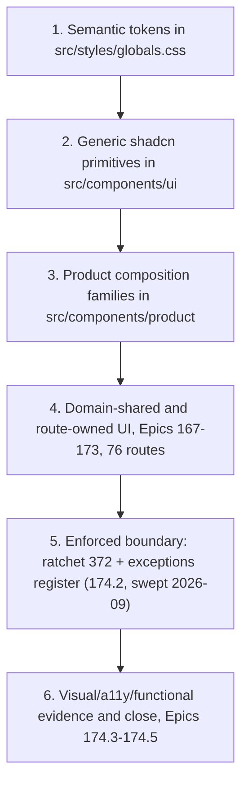
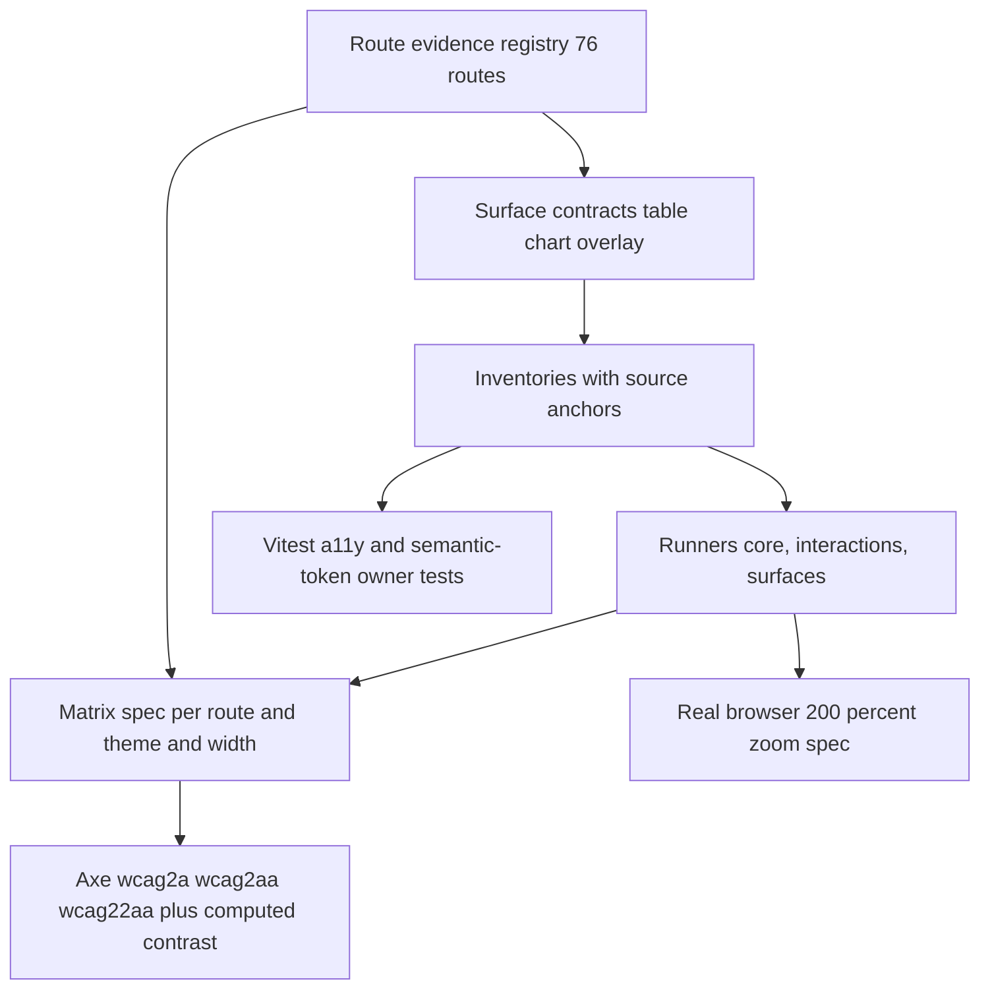

# Design System

The frontend presentation layer is migrating to a layered, semantic design system built on **Tailwind v4** and **shadcn/ui (Radix)**. The layers are built in order and consumed strictly downward. This page documents the foundation delivered by Epic 166 (stories 166.1–166.8: tokens, primitives, and six product-composition families) and the Epics 166–174 migration program that consumes it.



*Build order of the design-system layers; each layer consumes only the layers above it.*

## Why this exists

Before Epic 166, primitives carried hardcoded and light-only palette values (`bg-white`, fixed hex colors) and the theme lived in a JavaScript `tailwind.config.ts`. The migration establishes one semantic token vocabulary, hardens the shared primitives for accessibility and themes, and adds presentational compositions so route migrations can swap presentation without touching URL/search/state logic. It is delivered as part of the full shadcn/UI migration program defined in `.omx/plans/shadcn-full-ui-migration-master.md`.

## Layer 1 — Semantic tokens

`src/styles/globals.css` is the single source of truth for the theme. It uses Tailwind v4 CSS-first configuration:

- `@import 'tailwindcss'` + `@plugin 'tailwindcss-animate'` + a `@custom-variant dark` for class-based dark mode (matching `next-themes`).
- An `@theme inline` block maps every utility color to an HSL CSS variable: background/foreground, card, popover, muted, secondary, accent, border, input, disabled, ring/ring-offset, brand, primary (+ `primary-pressed`, `primary-subtle`), destructive, **financial** (positive/negative/neutral), **status** (success/warning/error/information/pending, each with foreground), **availability** (available/unavailable/stale/partial/restricted/unknown), telegram, and the full **chart** role set (series 1–6, positive/negative/reference/target/forecast/confidence-band/grid/axis/tooltip/selection).
- Typography (`--text-h1` …), spacing, radius, shadow, and animation scales are also defined in `@theme`.
- Light (`:root`) and dark (`.dark`) blocks assign concrete HSL values to each variable.

The JavaScript config was removed: `tailwind.config.ts` is deleted, `postcss.config.js` runs `@tailwindcss/postcss` + autoprefixer, and `components.json` is aligned (`config: ""`, `css: "src/styles/globals.css"`, `cssVariables: true`).

### Token regression tests

| File | Asserts |
|------|---------|
| `src/styles/__tests__/globals-token-contract.test.ts` | Every required semantic role is declared in `@theme`; utility-to-variable mapping is complete and consistent. |
| `src/styles/__tests__/globals-compiled-contrast.test.ts` | Real PostCSS-compiled output resolves to concrete colors; foreground/background pairs meet WCAG contrast for light and dark themes. |
| `src/styles/__tests__/token-test-utils.ts` | Shared `parseGlobals`, `themeInlineRules`, `declarationsFor`, `hslTripletToHex` helpers. |

## Layer 2 — Generic shadcn primitives

`src/components/ui/**` are domain-agnostic wrappers around Radix UI. Story 166.2 migrated fifteen primitives from fixed palette values to semantic tokens and hardened their accessibility contracts:

- **Semantic surfaces**: `bg-background`/`text-foreground`/`border-border`/`bg-accent` etc. replace `bg-white` and hardcoded colors across `dialog`, `alert-dialog`, `sheet`, `popover`, `tooltip`, `dropdown-menu`, `select`, `input`, `textarea`, `checkbox`, `radio-group`, `slider`, `progress`, `table`, `alert`.
- **Accessibility hardening**: Radix-owned Select focus return is restored; `Progress` forwards values including zero; synthetic overlay closes were replaced with native, localized, ≥44×44 (size-11) controls; responsive title space is reserved for narrow and 200%-reflow layouts (`min-[20rem]` guards); semantic invalid states are exposed; named table scrollers get a region contract; `motion-reduce:` variants disable animation/transition.
- **Compatibility preserved**: existing exports, variants, portals, and compatibility props are unchanged — only presentation and a11y behavior moved.

Four consumer test files (`OrderDetailsModal`, `GenerateStickersModal`, `OrderPickerDrawer`, `ScheduleVersionModal`) were updated for the shared Russian close label (`Закрыть`).

Story 174.3 added one further primitive hardening exemplar: the `Slider` (`src/components/ui/slider.tsx`) forwards every caller-supplied ARIA attribute (`aria-label`, `aria-labelledby`, `aria-describedby`, `aria-valuetext`, `aria-valuenow/min/max`, `aria-invalid`, `aria-required`) from the Radix root down to the thumb — spread conditionally so absent attributes are not rendered — because Radix applies accessible semantics to the thumb, not the root. The thumb also carries `focus-visible:ring-2` with ring-offset and `motion-reduce:transition-none`, pinned by `primitive-behavior-contracts.test.tsx` (semantic focus treatment) and `primitive-semantic-surfaces.test.tsx` (semantic track/thumb surfaces).

### Primitive regression tests

| File | Asserts |
|------|---------|
| `src/components/ui/__tests__/primitive-behavior-contracts.test.tsx` | Direct behavior, palette, portal, focus, reduced-motion, and compatibility contracts for the hardened primitives (uses `react-hook-form`, Testing Library, `userEvent`). |
| `src/components/ui/__tests__/primitive-semantic-surfaces.test.tsx` | Primitives render semantic-token surface/border/focus classes, not hardcoded or light-only values. |

## Layer 3 — Product composition families

`src/components/product/` are presentational, route-supplied compositions. They intentionally own **no** URL/search/debounce/persistence/query/API/store semantics — those stay with their route owners. The families are:

| Family (Story) | Subtree | Key exports |
|----------------|---------|-------------|
| Page context (166.3) | `src/components/product/` root | `PageHeader`, `Breadcrumbs`, `ContextBar` |
| Metrics & status (166.4) | `src/components/product/metrics/` | `FinancialValue`, `MetricCard`, `MetricGroup`, `DataAvailability`, `StatusBadge`, `StatusStrip` |
| Filters & period controls (166.5) | `src/components/product/filters/` | `FilterToolbar` |
| Data tables (166.6) | `src/components/product/tables/` | `ResponsiveTable`, `ResponsiveTableHeader`, `TablePagination`, `TableState`, `VirtualizedTableFrame` |
| Charts & evidence (166.7) | `src/components/product/charts/` | `ChartFrame`, `ChartEvidence`, `ChartLegend`, `ChartState`, `ChartTooltipContent` |
| Page states & async results (166.8) | `src/components/product/states/` | `PageState`, `AsyncOperationStatus`, `BulkResultSummary`, `ContextualSplitView` |

Barrel discipline: `src/components/product/index.ts` re-exports only page-context, metrics, and filters (`export * from './metrics'` / `'./filters'`). The tables, charts, and states families are consumed through their own subtree barrels (`@/components/product/tables`, `.../charts`, `.../states`) — the product root deliberately does not re-export them. Each family ships its own source-contract test with an explicit Story-owned manifest that also rejects route/API/hook/query/store/navigation/raw-palette ownership in the subtree; `product-composition-source-contracts.test.ts` stays scoped to the Story 166.3 files and must not be expanded, bypassed, or made directory-wide.

### Page context (Story 166.3)

#### `PageHeader` — `src/components/product/PageHeader.tsx`

Shared route identity. Renders **exactly one** logical `h1` regardless of visual size.

| Prop | Purpose |
|------|---------|
| `title` | Stable route identity; always the page's single `h1`. Must be non-empty (throws otherwise). |
| `description?` | Optional business-purpose explanation. |
| `breadcrumbs?` / `currentBreadcrumbIndex?` | Route-owned `BreadcrumbItem[]`; final item is current by default; invalid indices safely fall back to the last item. |
| `context?` | Route-supplied context metadata/controls. |
| `status?` | Route-supplied status/availability content. |
| `actions?` | Primary and secondary actions in task order. |
| `children?` | Additional slot below the identity row. |
| `compact?` | Compact layout for contextual detail views. |
| `busy?` | Indicates metadata refresh without replacing the title (`aria-busy`). |
| `breadcrumbLabel?` | Accessible label for the breadcrumb landmark (default `Навигация по странице`). |

#### `Breadcrumbs` (exported from `PageHeader.tsx`)

Standalone breadcrumb composition for routes that do not need the full header. `BreadcrumbItem` carries already-localized `label` and optional `href`; the current/terminal item renders `aria-current="page"`, link items render visible focus rings.

#### `ContextBar` — `src/components/product/ContextBar.tsx`

Decision-scope metadata bar. Semantic `state` (`fresh` | `refreshing` | `stale` | `partial` | `unavailable` | `restricted` | `overridden` | `default`) is rendered as localized text and **never conveyed by color alone**. `onRefresh`/`onReset` are route-owned callbacks — the composition changes no context implicitly. Common fields (`cabinet`, `period`, `comparison`, `freshness`, `completeness`, `scope`) plus generic `items: ContextItem[]` and `actions`/`children` slots.

### Metrics and status (Story 166.4) — `src/components/product/metrics/`

Standardizes how numeric business meaning is presented. `src/components/product/metrics/presentation.ts` is the single semantic map layer: `availabilityPresentation` (11 `AvailabilityState` values — loading, available, missing, unavailable, not-calculated, filtered-out, stale, partial, estimated, restricted, unknown — each with a localized label and `availability-*` token classes), `financialDirectionClass` / `comparisonSentimentClass` (`financial-positive/negative/neutral`, plus `unknown`), and `statusPresentation` (`OperationalStatus` success/warning/error/information/pending/neutral/unknown with icons and `status-*` classes).

- **`FinancialValue`** renders a discriminated `FinancialValueModel` (`value` | `temporal` | empty kinds) with a matching `FinancialFormat` (currency, percent, percentage-points, quantity+unit, duration, decimal, count, or date/date-time/iso-week). Russian locale, sign, tabular numerals, and caller-provided precision are preserved; `display: 'compact'` is only legal for currency/duration and **requires a caller-supplied `fullValue` string**, so the full value is always accessible without a tooltip. Zero, missing, and unavailable stay distinct; nullish/non-finite input never becomes a fabricated zero.
- **`MetricCard`** wraps a value in metric identity: `MetricCardState` is a discriminated union (`loading` / `error` with recovery / `ready`), `MetricComparison` carries caller-controlled meaning (direction ≠ sentiment — an increase can be financially negative), and variants scale density (`hero` | `standard` | `compact` | `dense`).
- **`MetricGroup`** frames related cards (`aria-label`d section, shared variant).
- **`DataAvailability` / `StatusBadge` / `StatusStrip`** render availability and operational status as **localized text with semantic token classes, never color alone** (`data-availability` attribute for testability).

Story 166.4 migrated no routes, formatters, or domain consumers — it only added the composition layer plus its source contract.

### Filters and period controls (Story 166.5) — `src/components/product/filters/`

**`FilterToolbar`** (`FilterToolbar.tsx` + `FilterToolbar.types.ts`) frames caller-owned filter controls. Its `FilterToolbarState` is a discriminated prop union: passive states (`default`, `dependency-loading`, `updating`, `invalid`, `disabled`) take an optional reset, while `state: 'applied'` requires `appliedSummary` + `onReset` + `resetScope`, and `state: 'empty'` additionally pins `resultCount: 0` — an empty *filtered* result is rendered differently from globally absent data. Reset is explicit, caller-owned, and focus-deterministic (`resetFocusRef` names the element that receives focus after reset). Secondary controls are progressive (`expanded`/`defaultExpanded`/`onExpandedChange`), and applied scope, result count, and state labels stay visible in every state.

The existing multi-route period controls were presentation-hardened in place (`src/components/custom/DateRangePicker.tsx`, `DateRangePickerExtended`, `MultiWeekSelector`, `ComparisonPeriodSelector`, `DashboardPeriodSelector`): visible labels, state handling, and wrapping — their URL/search-param/debounce/persistence behavior is unchanged and still owned by each route.

### Data tables (Story 166.6) — `src/components/product/tables/`

A route-free table foundation for static and server-controlled lists (deliberately **not** a client-side data engine — no TanStack Table dependency).

- **`ResponsiveTable`** frames a native semantic table. The name is a required union (`caption` node or `accessibleLabel`), and `TableNarrowStrategy` must be explicit — `horizontal-scroll` (one named, keyboard-reachable scroll region with a declared `minimumWidth`), `priority-columns`, `expanded-detail`, or `stacked-detail` — never inferred from column index. `TableConsumerContract` (in `contracts.ts`) declares numeric columns (`TableNumericColumnContract`: end alignment, precision, `TableNumericUnit`, `tabularNumerals: true`, full-value access), sorting (`TableSortContract`, caller-controlled), selection (`TableSelectionContract` + `TableSelectionSummaryModel`), and row actions; `ResponsiveTableRow` supports `selected`/`disabled`/`expanded`.
- **`ResponsiveTableHeader`** (+ `ResponsiveTableSortButton`, `ResponsiveTableNumericCell`), controlled **`TablePagination`**, **`TableState`** (terminal vs retained table states — retained states keep usable data visible), and **`VirtualizedTableFrame`** (the virtualization-preservation boundary for specialized collections).

### Charts and analytical evidence (Story 166.7) — `src/components/product/charts/`

Standardizes chart identity and non-color evidence. The subtree itself imports **no Recharts** (rejected by the source contract) — domain consumers keep owning series construction, formatting, visibility, selection, and queries, and compose them inside `ChartFrame`.

- **`ChartFrame`** exposes title, period, units, description, freshness, comparison, annotation, and actions as visible, programmatically-associated text. `ChartDataState` splits terminal states (`loading`/`empty`/`unavailable`; `error` requires a `recovery` node — they never fabricate a plot or a zero) from retained states (`rendered`/`partial`/`stale`, which keep evidence visible); `ChartActivityStatus` covers updating.
- **`ChartEvidence`** renders series evidence without relying on color: `ChartSeriesRole` (categorical, positive, negative, reference, target, forecast, confidence, selection) × `ChartSeriesMarker` (solid, dashed, dotted, point, bar, area, band), each with a localized label from `contracts.ts`, plus the equivalent-data alternative for screen readers.
- **`ChartLegend`**, **`ChartState`**, and **`ChartTooltipContent`** (caller-formatted tooltip entries) complete the frame.

### Page states and async results (Story 166.8) — `src/components/product/states/`

Honest state and recovery compositions, plus the single global not-found owner.

- **`PageState`** is built on a discriminated prop union (`PageStateProps` in `contracts.ts`): every state requires `title`, `explanation`, and a **`trust` statement** (what is and is not trustworthy). Passive kinds (loading, empty, offline, processing, success) forbid retained-evidence props; `restricted`/`not-found` require an `action`; `filtered-empty` requires `scope` + `resetAction`; `error` requires `recovery`; retained kinds (refreshing, stale, partial) require a `limitation` explanation plus retained `children`. Terminal states cannot fabricate retained content or a zero.
- **`AsyncOperationStatus`** exposes a caller-resolved lifecycle (`operation`, `scope`, phase union from idle/validating/queued/running/cancellable/non-cancellable/retrying to partial/complete/failed/expired, `safeLeave` guidance, truthful optional progress) without owning the mutation, polling, or retry rules.
- **`BulkResultSummary`** (+ `createBulkResultCounts`) reports exact result counts and failed-item evidence for bulk operations.
- **`ContextualSplitView`** renders list/detail presentation with an explicit narrow-screen detail transition and a deterministic focus contract.
- **`src/app/not-found.tsx`** is the global not-found owner — it renders `PageState state="not-found"` for every unmatched URL (test: `src/app/__tests__/not-found.test.tsx`).

### Product-composition regression tests

| Family | Files | Assert |
|--------|-------|--------|
| Page context | `src/components/product/__tests__/PageContextCompositions.test.tsx`, `product-composition-source-contracts.test.ts` | `PageHeader`/`Breadcrumbs`/`ContextBar` rendering, single-`h1`, current-page marking, state text, busy/compact; Story 166.3 manifest and presentational source contracts. |
| Metrics | `src/components/product/metrics/__tests__/` — `FinancialValue.test.tsx`, `MetricCompositions.test.tsx`, `StatusCompositions.test.tsx`, `metric-composition-source-contracts.test.ts` | Zero vs missing vs unavailable distinctions, compact full-value disclosure, comparison semantics, availability/status text; Story 166.4 manifest. |
| Filters | `src/components/product/filters/__tests__/` — `FilterToolbar.test.tsx`, `filter-toolbar-source-contracts.test.ts` | State-union rendering, applied/empty scope visibility, reset focus determinism; Story 166.5 manifest. |
| Tables | `src/components/product/tables/__tests__/` — `ResponsiveTable.test.tsx`, `ResponsiveTableHeader.test.tsx`, `TablePagination.test.tsx`, `TableState.test.tsx`, `VirtualizedTableFrame.test.tsx`, `TableContracts.test.ts`, `table-composition-source-contracts.test.ts` | Semantic framing, narrow strategies, numeric/sort/selection contracts, controlled pagination; Story 166.6 manifest. |
| Charts | `src/components/product/charts/__tests__/` — `ChartFrame.test.tsx`, `ChartEvidence.test.tsx`, `ChartLegend.test.tsx`, `ChartState.test.tsx`, `ChartTooltipContent.test.tsx`, `ChartContracts.test.ts`, `chart-composition-source-contracts.test.ts` | Identity/trust-state rendering, non-color series evidence, retained-data behavior; Story 166.7 manifest. |
| States | `src/components/product/states/__tests__/` — `PageState.test.tsx`, `AsyncOperationStatus.test.tsx`, `BulkResultSummary.test.tsx`, `ContextualSplitView.test.tsx`, `StateContracts.test.ts`, `state-composition-source-contracts.test.ts` | Discriminated-union prop contracts, trust statements, focus/reset determinism; Story 166.8 manifest. |

## Layer 4 — Migrated domain composition families

Unlike the generic `src/components/product` families, the domain families below own their query/mutation hooks and form state; the design-system contract they follow is the same one: semantic tokens only (each family has a `*-presentation-source-contracts` guard rejecting legacy palette classes and contextual hex literals), truthful loading/error/empty/partial states, localized text for all semantic state, and route-supplied focus/announcement contracts.

### Financial summary — `src/components/custom/financial-summary/*`

The dashboard financial-summary family, decomposed into focused sub-components (the C13/C15-era max-lines/QA refactor): `FinancialSummaryTable.tsx` is a slim orchestrator composing seven section components — `RevenueSection`, `SalesFunnelSection` (over `FunnelParts`), `ExpensesSection` (over `ExpenseRow`/`ExpenseTableRows`/`CogsSubRows` and `expenses-data.ts`), `CompensationsSection`, `PayoutSection`, `CogsSection`, and `ProfitSection` (renders only at 100% COGS coverage) — with `MetricRow` (comparison columns, `ChangeIndicator` deltas) and `LabelWithTooltip` (over `metric-explanations.ts`) as shared row primitives, plus `financial-summary-formatters.ts`/`financial-summary-types.ts`. The whole subtree was token-migrated by P2 wave 1 (58 sites, boundary 459→401) with the measured-contrast house rule. Its a11y contract is source-pinned: every section's semantic table carries a stable `sr-only` `TableCaption` name («Доходы», «Итого к оплате», «Расходы Wildberries», «Компенсации», «Себестоимость (COGS)», «Чистая прибыль») and the expenses divider exposes an identity value (`sr-only` «Операционные удержания») instead of an empty row — asserted by `__tests__/FinancialSummaryTables.a11y.test.tsx` reading the component sources.

### Margin family — `src/components/custom/Margin*` + `price-calculator/margin-status-helpers.ts`

The margin presentation family token-migrated by P2 wave 2 (boundary 401→372). `MarginBadge` renders the compact chip: finite margins use financial valence (`bg-financial-*/5` + `text-financial-*` + `border-financial-*/20`), zero renders muted, and null/NaN/Infinity never fabricate a zero — it renders a muted «—» chip with the missing-data reason as `title`. `MarginInfoCard` wraps it with period/sales stats on `bg-card` (wave-2 dark-mode fix). `MarginAggregatedTableHeader` is the shared sortable header for the margin-by-brand/category tables: active sort icons use `text-status-information` (5.75/8.53), idle/help icons `muted-foreground`, and every sortable `TableHead` carries `aria-sort`. `MARGIN_STATUS_CONFIG` in `margin-status-helpers.ts` tiers margins (≥20 excellent, ≥10 good, ≥5 warning, else critical): `excellent`/`critical` use the financial `/5` tint idiom (wave-2 `/15`→`/5` after measured 4.19/4.42 light fails), `good`/`warning` use the solid `bg-status-*` + `text-status-*-foreground` pairs (the D-4 fix), and `getMarginColor` returns the matching text-token class per tier. P2 wave 3 re-measured the financial `/5` chips **in situ** over the `TwoLevelPricingDisplay` gradient card (`from-background to-muted/30`): 4.68 light / 8.18 dark — PASS, and corrected the wave-2 bare-card attestations (4.80/5.20 had not modeled that layer). Wave 3 also swept the price-calculator margin hosts: `MarginSlider` badge/label text on unfixable tinted bases (`bg-primary/5` box) went fg-on-tint, and `TwoLevelPriceHeader`'s warning box and `GrossProfitSection`'s coverage warning + margin chip moved to solid `bg-status-warning` + `text-status-warning-foreground` pairs.

### Settings — `src/components/custom/settings/*`


The cabinet/tax settings family (Stories 173.3/173.7). `CabinetInfoCard.tsx` composes `Card`/`Alert`/`Badge`/`Skeleton` primitives with `useSellerInfo`/`useJamStatus`/`useDelayedLoadingState`; Jam tiers use a semantic `Record<JamTier, string>` style map (`status-information`/`status-success` with `/30` border + `/10` tint, and a deliberate `status-warning` for an unrecognized backend tier — "warning = indicate the anomaly"). Loading is delayed via `useDelayedLoadingState` so a fast response skips the skeleton; a slow load flips to a polite `role="status"` warning alert instead of fabricating content. `TaxSettingsForm.tsx` is a slim orchestrator: it renders query state through the product `ContextBar` (via `taxSettingsContext` from `tax-settings-form-model`), keeps draft/baseline `TaxSettingsDraft` state with pristine rebase (a refetch only replaces the draft when it matches the baseline, so user edits survive), role-gates writes with `canManageOperationalData`, and delegates sections/actions/states to `tax-settings-sections`, `TaxSettingsFormStates`, and `TaxSettingsWarningDialog` (the no-tax consequence confirmation with failed-payload retry).

### Tariffs admin — `src/components/custom/tariffs-admin/*`

The 173.6 tariff-edit family (29 route-reachable production files pinned by the tariffs guard). `TariffSettingsForm.tsx` is a slim orchestrator per the 74.6 refactor: all logic lives in `useTariffSettingsForm` (react-hook-form `register`/`control`/`watch`, Zod via `tariffSettingsSchema`, dirty tracking, save-confirm lifecycle), skeleton/error in `TariffFormSkeleton`/`TariffFormError`, actions in `TariffFormActions`; the form Card is a focusable region (`tabIndex={-1}` + `focus-visible:ring-2`) so pending-safe save can deterministically move focus. Six collapsible rate sections (`AcceptanceRatesSection`, `LogisticsRatesSection` + `LogisticsTiersEditor`/`LogisticsTierRow`, `ReturnsRatesSection`, `CommissionRatesSection`, `StorageSettingsSection`, `FbsSettingsSection`) are framed by `TariffSectionWrapper`, with exact nested-tier label association; unavailable fields surface as labeled evidence (`unavailableFieldLabels`) rather than zeros.

### Notifications — `src/components/notifications/*`

The 173.5 Telegram-notification family. `NotificationPreferencesPanel.tsx` composes `Card`/`Alert` primitives over `usePreferencesPanelState` (local draft, dirty detection, save/cancel), rendering four `EventTypeCard`s, `LanguageRadio` (labeled switches/visible radio focus), and `PreferencesActionBar`; when Telegram is unbound the whole panel is disabled via `disabled` (`opacity-50 pointer-events-none`) rather than hidden. Its loading state is an honest `role="status"` pulse skeleton with `motion-reduce:animate-none`. `QuietHoursPanel` (+ pickers/timezone) and `TelegramBindingCard`/`TelegramBindingModal`/`UnbindConfirmationDialog` complete the pending-safe binding/unbind lifecycle.

### Shipments — `src/components/custom/shipments/*`

The 173.8/173.9 shipments family. `ShipmentsTable.tsx` is the canonical Layer-3 consumer composition: it composes `ResponsiveTable`/`ResponsiveTableHeader`/`ResponsiveTableSortButton`/`ResponsiveTableNumericCell`/`TableState` from the product tables subtree barrel with an explicit `TableConsumerContract` — a `PALLETS_CONTRACT` numeric column (`alignment: 'end'`, `precision: 'integer'`, count unit, `tabularNumerals: true`, `fullValueAccess: 'visible'`), `caller-controlled` sorting on `createdAt`, `selection: { kind: 'none' }`, and `caller-rendered` row actions with the accessible name pattern «Открыть отправку {entityId}». All filters, pagination, and sort toggling are route-owned callbacks (`onStatusChange`/`onPageChange`/`onLimitChange`/`onSortToggle`); narrow screens fall back to `ShipmentQueueCards` preserving identity/status/date/action. `ShipmentStatusBadge` is shared between list and detail; detail mutations (shipment, pallet, box line) announce pending/success/failure with first-invalid focus and exact invoking-trigger focus return.

### Box types — `src/components/custom/box-types/*`

The 173.10 shipment box-types family. `BoxTypesTable.tsx` frames the route's named wide table with stacked narrow cards; `box-types-columns.ts` keeps dimensions visibly unit-labeled (`см`/`см³`) with tabular numerals; status is non-color (icon + localized text). `BoxTypeFormDialog`/`BoxTypeDeactivateDialog` own validation (`boxTypeFormValidation.ts`), pending/error semantics, duplicate-submit suppression, and `useBoxTypeDialogFocus` provides the stable focus fallback for removed/CSS-hidden triggers; same-entity stale errors are cleared on retry. Action stacks at 320/768 widths are contained by production CSS (not test-only), and entity actions carry visible labels with 44px targets.

### SKU packaging — `src/components/custom/sku-packaging/*`

The 173.11 SKU-packaging family (24 files). `SkuPackagingTable`/`SkuPackagingFilterToolbar` render the named wide table + stacked narrow cards with local filtered-empty recovery; `BoxTypeSelect` and `SkuPackagingProductCombobox` keep the preserved unparameterized-SKU and active-only box-type queries, surfacing dependency failures truthfully. Mapping status (active/inactive/incomplete/mismatched) is non-color; strict integer validation and exact single/bulk/delete payloads are owned here. `BulkAddDialog` is the bulk-add flow: a three-step input → preview → results dialog driven by `sku-packaging-bulk-utils.ts` (`parseBulkInput` → `attachActiveBoxTypes` → `reconcileBulkResponse`), with duplicate-submit suppression, in-flight ref guard, deterministic cancellation and success focus, and persistent per-row result announcements via `BulkPreviewTable`.

### Supplies list and detail — `src/components/custom/supplies/*`

The 173.12 (list/shared) and 173.13 (detail) supplies family. `SupplyStatusBadge.tsx` is the five-status semantic map: `OPEN` = status-information, `DELIVERING` = status-pending (purple canon), `DELIVERED` = status-success, `CANCELLED` = status-error, and **`CLOSED` = a WCAG solid pair** (`bg-status-warning` + `text-status-warning-foreground`) — an e2e-axe run caught the `/10` tint at 4.06:1 for 12px text (bisect-proven), root-caused as tint-blindness of the compiled-contrast test; an unrecognized status falls back to a muted «Неизвестно» rather than masquerading as OPEN. Detail (`SupplyHeader`, `SupplyStatusStepper`, `SupplyDocumentsList`, `AcceptanceActSection`) and the order-picker drawer (`OrderPickerDrawer` + filters/table/row/footer and `useOrderPickerSelection`) share `SupplyStatusBadge` and `SyncStatusIndicator`; lifecycle dialogs (`CreateSupplyModal`, `CloseSupplyDialog`, `RemoveOrderDialog`, `GenerateStickersModal` + `StickerFormatSelector`/`StickerPreview`) are pending-safe with exact focus returns. The list guard's `DETAIL_EXCLUDED` set (18 files, the exact transitive `[id]`-page closure) is load-bearing ownership separation between 173.12 and 173.13.

## Migration program (Epics 166–174)

The foundation above is the first phase of a 94-story, 76-route migration defined in (status snapshot 2026-08-31: **91 of 94 canonical stories complete** — Epics 166–173 all closed, plus Stories 174.1–174.2; recorded Vitest floor **19,118/0 across 1,234 files** after 174.2 deleted 756 dead tests):

- `.omx/plans/shadcn-full-ui-migration-master.md` — approved master plan, delivery DAG, standard per-story protocol, non-negotiable principles.
- `_bmad-output/planning-artifacts/epics-166-174-fe-shadcn-migration.md` — story scope, acceptance criteria, ownership, forbidden shared files.
- `_bmad-output/planning-artifacts/shadcn-route-ledger.md` — exact route-to-story ownership for all 76 `page.tsx` routes.
- `_bmad-output/planning-artifacts/shadcn-migration-status-and-debt-registry.md` — rolling status/debt snapshot of the migration waves (snapshot 2026-08-31: **Epics 166–173 are all closed** — Epic 173 at 13/13 including shipments 173.8–173.11, supplies list 173.12 and supply detail 173.13 — and Stories 174.1 (ledger reconciliation) and 174.2 (legacy-removal/boundary) are shipped, so **Epic 174 is IN PROGRESS at 2/5 with NEXT = 174.3** visual/a11y verification, then 174.4 functional/backend, 174.5 docs/close; per-story status lives in `_bmad-output/implementation-artifacts/sprint-status.yaml` and is summarized on [Migration Program](migration-program.md)).
- `_bmad-output/planning-artifacts/ux-design-specification.md` — visual/interaction/responsive/table/chart/state/theme/accessibility contracts.

**Non-negotiable principles**: preserve behavior before changing presentation; keep `src/components/ui/**` generic and domain-agnostic; build in layers; one shared file = one upstream owner Story; never run `shadcn init --force`; do not hide financial/operational/chart/table/availability/error meaning behind color, hover, truncation, or viewport width; local validation is the merge gate; production/deployment work is forbidden (see [Architecture — Configuration](architecture.md#configuration) and [Testing & Operations](testing-and-ops.md)).

The full foundation (Stories 166.1–166.8) has landed in order: 166.1 tokens → 166.2 primitives → 166.3 page-context, 166.4 metrics, 166.5 filters, 166.6 tables, 166.7 charts, 166.8 states. **Epic 167 is closed** — all 9 stories done, including the re-planned onboarding lane (167.8 backend contracts → 167.9 account-scoped settlement → 167.5 `/cabinet` → 167.6 `/processing` → 167.7 `/wb-token`); 167.1 unified the protected AppShell (one `resolveNavigationItems` model consumed by both desktop `Sidebar` and mobile `MobileSidebarSheet` in `src/app/(dashboard)/layout.tsx`), 167.2 migrated the root entry, 167.3/167.4 the auth pages. **Epic 168 (analytics core) is closed**: 168.1–168.10 — analytics hub + shared-UI tokens, alerts, analytical dashboard, finance-history, orders, pricing, product detail (`OrganicTab`), reorder, SKU (route + `sku-financials` tree), and time-period (route + `MarginTrendChart` tree, moving chart dots/grid/line/tooltip to the `--color-chart-*` role tokens) — plus 168.11 unit-economics, which migrated the route (~40 sites, waterfall profit/loss to chart tokens) and consolidated the shared profitability tier tokens: `PROFITABILITY_STATUS_CONFIG` in `src/lib/unit-economics-config.ts` now uses the `/15`-chip idiom as the single set shared with the 168.9 legend and sku-financials (the `bgColor` hex field was deleted; `src/types/sku-financials/core.ts` carries the token classes). **Epic 169 (accessible operational analytics) is CLOSED 15/15** (2026-08-28): 169.1–169.5 are done — acquiring report index (route + shared `AcquiringRateLimitBanner`/`AnomalyVatIndicator`), acquiring period detail, acquiring report transaction detail (shared `AcquiringTransactionsTable`, additive-only optional caption), buyout analytics (single-source `BUYOUT_TREND_COLORS` in `buyout-trend-config.ts`, first consumer of `var(--color-chart-axis)`), buyout reconciliation (semantic `AnomalyIndicator`, 5-branch state machine untouched), and **169.6–169.10 are now also done**: 169.6 enhanced FBS analytics (route + regional tooltip moved to chart tokens), 169.7 FBS stock analytics (groups/regions/sizes sections), 169.8 funnel analytics (overlay chart split into `FunnelOverlayPlot`/`FunnelOverlayEvidence`, new `FunnelSyncStatus`/`SyncStatusBanner` presentation, retained-state and terminal-frame helpers in `src/app/(dashboard)/analytics/funnel/components/`), 169.9 gaps triage (query states and dialog lifecycle hardened in `useGapsPageState.ts`), and 169.10 liquidity (`liquidity-category-tokens.ts` as the shared category token source; liquidation planning modal/cards migrated). **169.11 (returns) is done** (PR #219 + preface PR #218): its Task-0 preface first preserved the unknown return category at the API boundary (`return-analytics-normalizer.ts` maps unrecognized categories to `'unknown'` with the neutral label «Неклассифицированный возврат» instead of coercing to a real category — see [API Layer & Normalizers](api-and-normalizers.md)); the migration then moved 4 trend series to `chart-1..3` + `chart-negative` (stack-order pinned), added the shared `ReturnTrendSrTable` sr-only data-alternative table, migrated reason triplets to status tokens with muted unknown-fallbacks, and added recursive no-palette/no-hex source-contract guards with a pinned production file count. **169.12 storage** has its Task-0 preface merged (PR #226: tri-state `has_warehouse_stock`, nullable `percent_of_total`, distinguishable `'unknown'` import status at the boundary — see [API Layer & Normalizers](api-and-normalizers.md)); the route migration itself landed early through PR #227 (`52f7f506`, 27 files; review round 71b1105b hardened error retention and set `aria-sort="none"` on non-sortable storage headers), but the Story is **not counted complete**: the approved Correct Course (PR #228) added two sequential non-route prerequisites — Story 169.14 (authoritative backend paid-storage import lifecycle/result/error contract) then Story 169.15 (shared frontend boundary alignment) — before 169.12's bounded contract closeout (plans: `.omx/plans/169.14-establish-authoritative-paid-storage-import-lifecycle-and-result-contract.md`, `.omx/plans/169.15-align-shared-frontend-paid-storage-import-boundary.md`). **169.13 (supply planning) is done** (preface PR #231 + migration PR #232, closed via PR #233): the preface preserved unknown `stockout_risk`/`reorder_status` enums and nullable velocity/capital at the API boundary (see [API Layer & Normalizers](api-and-normalizers.md)); the migration then introduced `supply-risk-tokens.ts` in the route's components as the single source reconciling the four previously divergent risk-tier color sites (risk-card-styles, row-constants, detail-header ternary, inline ring hex — the 169.4 tier-reconcile canon, following the 169.10 `liquidity-category-tokens.ts` pattern), with `unknown` styled muted rather than healthy green, plus `supply-planning-presentation-source-contracts.test.tsx` no-palette/no-hex guards, `sr-only` disambiguation, and pinned `aria-sort` on the total-occurrence column. Known carry-out: a pre-existing, load-dependent sidebar→supply-planning E2E flake (dashboard URL-race, documented in the test itself) is queued for e2e-hardening before 172.1. Epic 169 remainder: 169.14 (backend) → 169.15 (shared FE) → 169.12 closeout — **all three are now done and the epic is closed 15/15**: 169.14 (backend PR #229 + frontend final-handoff PR #292, all lifecycle records cleaned), 169.15 (PR #296 merged `2d99f7f3`, targeted 70/70), and 169.12's bounded contract closeout (PR #299, merge `3ff35bf6`, 158/158 route + 19 367/19 367 full). Story numbers are identities, not a universal execution order; later epics (169–173 routes, 174 audit) build on these merged prerequisites.

**Epic 170 (marketing analytics) is closed 7/7** (PRs #237–#250, 2026-08-25/26): 170.1 advertising analytics (route + route-local `advertising-tokens.ts` efficiency/campaign-status maps, `daily-trend-config.ts` and `ad-cost-discrepancy-config.ts` on chart tokens, sr-only `DailyTrendSrTable`, status `status-warning` `/15`+`/30` matched pairs for over-attribution/multi-campaign banners, honest-null `meta.last_sync` post-preface #236); 170.2 campaign detail (plain semantic back `Link`, no nested Button); 170.3 brand and 170.5 category (direct mirrors — `text-2xl font-semibold` h1 token canon, info-panel status-information tints in `BrandHelpSection`/`CategoryHelpSection`); 170.4 brand-share (`src/components/custom/analytics/BrandShareView.tsx` family — `id`+`aria-labelledby` filter names, filter context threaded into the chart subtitle, ≥44px SelectTrigger/retry Button, share-axis domain pinned 0–100); 170.6 cross-reference (single-source `channel-styling.ts`, unified correlation taxonomy on `interpretCorrelation`, one-source-partial coexistence: a failed query keeps the other sources' data visible — the 169.12 pattern); 170.7 search analytics (route + deep-link `?tab=`/`?nmId=` validated at page level with precedence `?tab=` > `?query=` > orders, single-source `search-chart-config.ts`, Pattern-1 own loading/error chrome over shared position tables).

**Epic 171 (AI/forecast analytics) is CLOSED 9/9** (PRs #252–#262 then the evening wave #266/#268/#270, 2026-08-26): 171.1 ai-admin anomalies (born token-clean, 7 contract gaps closed — accessible anomaly identity, filtered-empty distinct from no-anomalies, 409-conflict honest state, polite pending announcement); 171.2 ai-admin models list (`AdminModelsContent` filter-empty vs no-data split; epic AX literal "focus returns to the invoking row" delivered in the rollback dialog by capturing the row's button before unmount and re-querying it inside a `requestAnimationFrame` — a background refetch may remount the row between capture and frame); 171.3 ai-admin preferences (NO-OP verdict plus micro-fixes: mutation error `Alert` id joined into the Switch's describedby chain, `max-w-2xl` readable form width); 171.4 forecast (`ForecastChart` band cutout fixed for dark mode, 13 chart hexes removed, band tiers, sr-only `ForecastChartSrTable`, forecast series deliberately carry no financial valence — this is the live chart canon later reused by 171.9); 171.5 forecast-accuracy (MINOR-GAP — born clean, single amber MAPE>200 warning site + 169.7 static captions); 171.6 model registry root (`STATUS_BADGE_CONFIG` in `model-list-helpers.ts`: 7 light-only palette classes → semantic status tokens with hue preserved, shape frozen `{className,label,pulse}` because the then-unmigrated `[id]` subroutes read `.className`; pulse dot → `bg-status-information`, double-`p-6` removed, tabular-nums on version/MAPE/trained columns); **171.7 model evaluations list** (PR #266 — born-clean MINOR-GAP: `STATUS_BADGE_CONFIG.className` detached via route-local `EVALUATION_STATUS_BADGE_CLASS` `Record<ModelStatus,string>` map, byte-identical 1:1 across all 7 statuses, label still single-sourced from the shared config; TableCaption naming the model, tabular-nums ×7 with nmId exempt); **171.8 evaluation SKU-accuracy detail** (PR #268 — born-clean: TableCaption ×2, tabular-nums ×9, route paddings removed; also a cross-surface fix of the 171.7 guard whose substring filter on the joined absolute path matched the 171.8 plan-pinned worktree name and emptied the catalog — guards now filter relative segments before join); **171.9 model performance detail** (PR #270 — the only `[id]` subroute with real palette+hex: DRIFT+valence palette → status tokens with dark fix, `MapeTrendChart`'s 8 hexes → the 171.4 chart canon CSS vars (border/`chart-axis`/`chart-1`), performance consumers detached from `STATUS_BADGE_CONFIG.className` via a route-local map). The `className` field itself was **not** deleted: live-code check showed registry-root `ModelListSection.tsx:149` also renders `badge.className`, so removal was re-routed to 174.2 (route-ledger handoff from 171.9) together with rewriting the stale helper comments and migrating the 171.6 guard pins. The `/analytics/models` tree is now fully migrated and each `[id]` subroute has its own guard (`evaluations-list`, `sku-accuracy`, `model-performance`).

**Epic 172 (business operations, 17 stories) is CLOSED 17/17** (PRs #278–#285 then #287/#289/#293/#301+#303/#305, then the 172.10–172.17 wave #308–#325, 2026-08-26–29): 172.1 business dashboard (PR #278, FULL cycle — 127 files across `src/app/(dashboard)/dashboard/**` and the `src/components/custom/dashboard/**` family incl. `BaseMetricCard`, executed in four delegated waves; `DashboardStatusStrip` consolidates the 8 conditional banners into one expandable status line using `status-*` token tones while children stay mounted via `hidden` so banner state and DOM assertions are preserved; `dashboard-presentation-source-contracts` + `dashboard-widgets-presentation-source-contracts` guards added, full floor 19 281 → 19 297); 172.2 canned automation rules gallery (PR #280 — `CannedRulesGallery` born-clean on merged shadcn primitives, py-6 debt and raw-button closed, new gallery e2e package with a fixture controller); 172.3 installed rules list (PR #282 — status tokens across badge/safety/banner, incl. `InstalledRuleRow`); 172.4 installed rule detail/editor (PR #285 — editor status tokens, `WritebackSafetyAcknowledgement` in the editor, and the 163.3 editor spec finally live 8/8). **172.5 single-product COGS management** (PR #287, merge `4e86272b` — FULL-lite owner story: the `/cogs` route page + the `ProductList`/`SingleCogs`/`Cogs*` custom-root family, 24 files, ~80 palette sites → 0, full floor 19 327/0, three-pass review with a transitive closure audit over 28 files; its guard pins a 21-file root catalog plus the `single-cogs`, `product-margin-cell`, and `products` subtrees, and pins valence/state tokens: margin cell signs on `text-status-success/-error`, selected rows on the information-tint idiom, missing-state config with solid `bg-status-error` critical and `/10` tints for warning/info). **172.6 bulk COGS assignment** (PR #289, merge `42ac0686` — MINOR-GAP-plus owner story: `/cogs/bulk` route + the `bulk-cogs/**` tree (11 files) + the `BulkCogsForm` re-export shim, 49 palette sites → 0; single/history/price-calculator surfaces excluded by construction; pins cover alerts summary tiles, selected rows, form-validation destructive, and preview/primary button). **172.7 COGS history** (PR #293, merge `da3e9078` — MINOR-GAP born-clean: `/cogs/history` route tree (5 files) + 5 custom-root widgets (`CogsHistoryTable`, `CogsHistoryMeta`, `CogsHistoryPagination`, `AffectedWeeksCell`, `CogsHistoryTableCells`); caption + tabular-nums table-contract pins and a muted deleted-row pin; full floor 19 343/0). **172.8 COGS price calculator** (feature PR #301, merge `08191dae` + reconciliation PR #303, merge `0b4c9deb` — MINOR-GAP: `/cogs/price-calculator` + the 71-file mutable manifest over `src/components/custom/price-calculator/**` (from `AcceptanceStatusBadge` to `WarehouseTariffsByBoxType`, plus `cost-breakdown-types.ts`/`margin-status-helpers.ts`); the guard rejects raw palette classes including black/white/950 utilities and any hex literal, and pins the narrow-width reflow contract for live calculator controls — `DimensionInputSection` and `WarehouseSelect`; composite full floor 19 383/0; dynamic-Playwright coverage is a recorded named gap). **172.9 communications workspace** (PR #305, merge `feb35cfd` — MINOR-GAP: the `/communications` route tree only, 18 files (+591/−18), hooks/API/types being forbidden shared files: `ChatComposer`, `ChatMessages`, `ChatsSection`, `ClaimsSection`, `FeedbackRow`/`FeedbacksSection`/`FeedbackWriteControls`, `PinnedReviewsSection`/`PinnedWriteControls`, `QuestionRow`/`QuestionsSection`/`QuestionWriteControls`, `ReplyForm`, `SectionState`, `UnreadBadge`, `WritebackStatus`, `ConfirmAction`; 15 palette sites → 0 with pins for status-success/-error valence, destructive writeback alerts ×5 plus the unread dot/counter, the primary seller bubble, `status-warning` rating stars, and raw-button → ghost `ui-Button` (`px-0`) thread rows; tabular-nums and route-level padding pins; a fixture-controlled e2e package was created; full floor 19 394/0; closure audit over 64 files clean). The wave then continued to **172.10–172.17, closing Epic 172 at 17/17**:

- **172.10 finances & documents** (feature PR #308 + closeout PR #309 — born-clean plus an absorbed parallel-session delta; 10 files +558/−105): caption RTC (`captionText` → `TableCaption`, the 171.9 canon), download accessibility (pending/success announcements, visible failure, `aria-hidden` icons, `mutation.reset` on format switch), `categoryState` loading/error, filtered-empty with reset, an `error.tsx` boundary, and a `DocumentsBody` extraction for max-lines. Guard: `finances-presentation-source-contracts.test.ts` (catalog 8, exact array). The finances e2e was repaired during the story (end-anchored globs missed query URLs → `RegExp` with strict-mode `exact: true`; bisect-proven pre-existing on main).
- **172.11 monitor route** (PR #311 — MINOR-GAP; 14 files +213/−52): 18 palette classes + 9 hex → semantic tokens (status valence, `chart-1/positive/negative/grid`, `muted-foreground`, destructive, foreground); the gauge band's hex stroke became a **color CSS-var read through the `style` prop**; the weekly chart moved to the **Recharts `var()` idiom**. Guard: `monitor-presentation-source-contracts.test.ts` (catalog 14, BFS-verified, mutation-tested). Carry-out: the shared `STATUS_COLORS` in `src/lib` re-routed to 172.12.
- **172.12 monitoring operations console** (PR #315 — FULL-class MINOR; 23 files +352/−134): 74 palette + 20 hex + 2 raw buttons → tokens across 19 files. The heatmap's `STATUS_COLORS` and `LEGEND_ITEMS` are now **synchronized on semantic CSS-var tokens** (`heatmap-constants.ts`: `recovered` uses a `color-mix(in srgb, var(--color-chart-positive) 60%, transparent)` alpha variant to stay distinct from plain success); two raw buttons became `ui/Button` with `type="button"` restored. Guard: `monitoring-presentation-source-contracts.test.ts` (catalog 32 + cross-file legend-sync pins).
- **172.13 moysklad integration workspace** (PR #317 — MINOR-GAP; 8 files +115/−7): 7 palette → tokens (health-badge success branch, 3 warning banners canonicalized, unmapped headline → `status-warning`, link → primary, recalc badge). Guard: `moysklad-presentation-source-contracts.test.ts` (catalog 13).
- **172.14 orders overview** (PR #319 — FULL owner-story; 30 files +350/−132): status-badge token maps (`SHIPPED` → `status-pending`, purple-native hue preserved; alpha-tier variants), WB-vs-local pending/muted distinction, the analytics family, 4 Button conversions, ~50 test re-pins with the test mirror switched to the real lib import. Guard: `orders-presentation-source-contracts.test.ts` (dual-root catalog 61; `fbo/` and `integrity/` excluded by ownership). A pass-1 MEDIUM lib-mirror drift was caught and fixed.
- **172.15 FBO orders** (PR #321 — born-clean; 6 files +184/−6): RTC captions ×2 (RU from PageContent), `tabular-nums` ×6, +4 caption tests. Guard: `fbo-presentation-source-contracts.test.ts` (catalog 7). Honest e2e gap: the plan's e2e spec did not exist.
- **172.16 order integrity analysis** (PR #323 — MINOR-GAP; 3 files +84/−6): 6 palette → token swaps (status/warning/failure valence; icons and RU labels frozen). Guard: `integrity-presentation-source-contracts.test.ts` (catalog 6, HEAD-mutation-tested).
- **172.17 product management** (PR #325 — MINOR-GAP; 2 files +66/−2): 2 palette → token swaps on error branches. Guard: `products-presentation-source-contracts.test.ts` (dual-root catalog 1+1).

The automation domain (gallery + list + editor), the full COGS domain (single + bulk + history + price calculator), communications, finances/documents, monitor + monitoring console, moysklad, and the full orders/products family are migrated end-to-end — as are the full settings family (173.1–173.7), the shipments list + detail routes (173.8–173.9), shipment box types (173.10), SKU packaging incl. bulk add (173.11), the supplies list/shared surface (173.12), and supply detail (173.13).

**Epic 173 (settings, shipments, supplies — 13 stories) is CLOSED 13/13**. **173.1 settings shell and overview** (feature PR #328 + closeout PR #329) delivered a static settings overview plus the shared seven-route settings shell under `src/app/(dashboard)/settings/` (backfill, cabinet, expenses, notifications, tariffs, tax + overview) with role-aware restricted/current states — the shell renders role-gated restricted states rather than hiding routes — and carried a credentialed non-Owner visual gap to 174.3 (C18 — its semantic Manager/Analyst/Service proof is deterministic in Vitest; a real credentialed screenshot must never be claimed without a live run and remains an owner-request gap post-program). The route wave then completed: **173.2 backfill** (truthful query/recovery states, dual-pipeline status, guarded pending trigger), **173.3 cabinet**, **173.4 expense** (native-valid amount semantics, pending-safe CRUD overlays), **173.5 notifications**, **173.6 tariffs**, and **173.7 tax** (inclusive manual-rate/supported-VAT validation, same-cabinet draft preservation with cross-cabinet isolation). **173.8 shipments list** (PRs #350/#351/#352) and **173.9 shipment detail** (PRs #353/#354/#355) shipped persistent PageHeader/PageState identity through loading/404/error/retained-partial states, the shared ShipmentStatusBadge, ResponsiveTable detail evidence, and pending/success/failure announcements for shipment, pallet, and box-line mutations. **173.10 shipment box types** (PRs #356/#357) and **173.11 SKU packaging** (PRs #359/#360) are described in Layer 4 above. **173.12 supplies list** (PR #361) and **173.13 supply detail** (PRs #365/#366/#367) closed the epic; the dead legacy twin `SUPPLY_STATUS_CONFIG` in `src/types/supplies/helpers.ts` was rerouted to 174.2 (types were outside 173.13 ownership) and deleted there.

**Epic 174 (consolidation, 5 stories) is CLOSED 5/5 — the program ended here (2026-09-02)**: **174.1** (ledger reconciliation — feature PR #369 + closeout PR #370 + lifecycle PR #371) proved the schema-v3 ledger 94 = 94 stories and 76 = 76 = 76 route/ledger rows with all linked artifacts unique. **174.2** (legacy-removal and design-system boundary — feature PR #372 on base `fbdab2da`) is summarized in the boundary section below. **174.3** (inclusive accessibility/responsive/theme/visual verification, including the §3.3 tint-audit of `text-status-*` on `bg-*/10` pairs) executed the inclusive visual contract documented in [the Story 174.3 section below](#the-story-1743-inclusive-visual-contract) and closed after its three-APPROVE review gate. **174.4** (feature PR #375) ran the full functional/backend regression — 53 spec fixes plus the DrrSlider /15-tint→solid-pair and TaxRateInput overflow product fixes — and, on a live re-run, discovered the boundary total had dropped to 459 during the 174.3 merge window and correctly lowered the ratchet baseline same-commit. **174.5** (feature PR #379 on base `0d6225ac`) flipped all 76 route-ledger rows to `verified` with full evidence chains, re-pinned the parity validator's expected base SHA, and re-confirmed the remaining boundary exceptions as owner-accepted.

### Post-program P2 owner-sweep waves (2026-09-02/05)

After the program closed, the category-1 residue began its ratchet-driven owner-sweep in coherent family waves (canon: live pre-flight recount, measured WCAG contrast per replacement in both themes, baseline lowered in the same commit):

- **Wave 1 — financial-summary** (PR #394; 11 files, 58 sites, 0 hex; boundary 459→401): the `src/components/custom/financial-summary/` family migrated to semantic tokens with a per-replacement contrast harness (HSL→sRGB, alpha tint blended over the **card** surface — card ≠ background in dark). Mapping canon: neutrals → `muted-foreground`/`border-border`; money-direction deltas → `text-financial-positive/negative` (returns arrows are direction, not error); tinted patterns by meaning with the `bg-status-*/10 + border-status-*/20` idiom; **house rule**: colored text on a tint must *measure* ≥4.5:1 light — on fail, either drop the tint to `/5` or switch the text to `foreground`/`muted` (a measured `/10` pass stays `/10`). Reviewers independently reproduced the contrast math twice (REJECT→fix→APPROVE→fix).
- **Wave 2 — margin family** (PR #395; 29 live sites after the catalog's stale 58 was live-recounted; boundary 401→372): `MarginBadge`, `MarginAggregatedTableHeader`, and the D-4 fold-in in `margin-status-helpers.ts`. Margin chips use **financial valence** (`bg-financial-*/5 + text-financial-* + border-financial-*/20`, parity with `MarginDisplay`), sort-state accents use `status-information` (parity with the SkuFinancialsTable canon), `MarginInfoCard`'s literal `bg-white` → `bg-card` (dark-mode fix). The D-4 fold-in exposed that the earlier "≥4.5 both themes" attestation covered only the two solid pairs — `excellent`/`critical` on financial `/15` tints measured 4.19/4.42 light (WCAG 1.4.3 FAIL), independently confirmed by a reviewer's own calculator; corrected `/15`→`/5` with an append-only registry disclosure. Lesson canon: an attestation is valid only for measured pairs — retained neighbors of a fix inherit nothing.
- **C13/C15 quality wave** (PR #393, 2026-09-02): C13 — `GapsTable` duplicated meaning between caption and scroll `aria-label` (resolved: aria-label → «Область прокрутки таблицы пропущенных дней», caption keeps identity); C15 — liquidity `URGENCY_CLASS` keyed by Cyrillic labels where a lib rename silently falls back (resolved: `ScenarioUrgencyTier` + `getScenarioUrgencyTier` single source, typed Record, exhaustive color switch).
- **Wave 3 — AA quick wins + layered compositing model** (PR #404, 2026-09-05; 15 files, artifact `_bmad-output/implementation-artifacts/debt-p2-wave3-aa-quickwins.md`): the registered sub-AA `/15`,`/10` sites from waves 1–2 (3.97–4.49 light) plus their host files. Pass-1 **falsified the "over card" measurement model**: real DOM stacks contain gradient cards (`bg-gradient-to-br from-status-information/10 to-status-warning/10`), nested tints, and `muted/50` parents, so in-situ contrast was 2.79–4.41 FAIL where bare-card attestations said PASS. New canon (superset of waves 1–2): (1) contrast is measured over the **actual compositing stack** (sequential alpha layers above card; gradients at worst-end) — bare card is valid only with a verified mount chain; (2) **structural remedies** when tint-tuning cannot fix a tinted base: fg-on-tint (`text-foreground` on the tint; valence carried by tint+border+label+icon) or solid pairs (`bg-status-X` + `text-status-X-foreground`, which kill parent compositing) — financial tokens have no `-foreground`, so financial valence on unfixable bases goes fg-on-tint. Applied to `CashflowRowPrimitives`/`SkuCashflowSection` (the worst repo site at 2.79 → solid warning), `CashflowExpenseGrid`, `unit-economics-config` chips, `MarginSlider` (in-situ over `bg-primary/5`: 4.19/4.45 FAIL → fg-on-tint 13.98–14.89), `GrossProfitSection` (chip + coverage box → solid warning, 4.81/11.41), `TwoLevelPriceHeader` (warning box → solid), and `MarginSection`/`margin-status-helpers` (attestations re-measured in-situ at 4.68 over the gradient card). Boundary **unchanged at 372** (semantic tokens only); vitest floor 19,436→19,439. Lesson canon: trace a file's consumers, not just the file — each fix wave exposed another missed layer. Registered follow-ups: WCAG 1.4.11 valence channels (tint 1.07–1.21, border 1.52–1.89 < 3:1 need a ≥3:1 carrier), `TwoLevelPriceHeader.tsx` `text-primary/70` ₽ glyph, `PctBadge colorClass` escape-hatch, MarginSlider `/20` track segments (3.47 ≥ 3:1 non-text PASS, monitor).

Remaining registered follow-ups: waves 4–6 of the 372 residue (SourceBadge, RequireJam, lib residues), plus the wave-3 follow-ups above — the wave-1/2 registered tint sites (`unit-economics-config.ts`, `GrossProfitSection.tsx`, `CashflowRowPrimitives.tsx`, `TwoLevelPriceHeader`, `MarginSlider`, `MarginSection`) were all addressed by wave 3.

## Route presentation source-contract guards (Epics 169–171 canon)

Every migrated route ships a `*-presentation-source-contracts.test(.tsx)` guard that pins the migrated surface so palette debt cannot regress. The canon (established by 169.11/169.12, refined by 170.x/171.x):

- **No raw hex, no Tailwind palette classes** — comment-stripped source of every owned production file is checked against `HEX_RE` (`#[0-9a-fA-F]{3,8}`) and `PALETTE_RE` (`text|bg|border|fill|stroke|ring|…-<color>-<nnn>`). `bg-white` is deliberately not flagged (token-adjacent). Self-tests prove the regexes fire on canonical violations, so the guard cannot silently rot.
- **Pinned owned-file catalog** — the manifest enumerates the exact migrated files (e.g. `cross-reference` pins "exactly 14 files", `forecast` "exactly 18 files", `search` pins the 22/23-file post-migration count). Partial-tree guards exclude not-yet-migrated subtrees explicitly: advertising excludes nested `campaigns/[advertId]` (separate ownership), and `model-registry-presentation-source-contracts.test.ts` is the first guard with an unmigrated-subroute exclusion (`[id]/**`).
- **Story-anchored pins** — token-flipped test pins (e.g. `getAdDeltaColor` → `text-status-success/error`, severity chips → status tokens) carry `Story 170.x` comments tying each pin to its migration, with thresholds explicitly unchanged.
- **C4 state-disposition matrix** — 170.1's guard documents, per data state (initial loading, background refresh, global vs filtered empty, sync gaps, over-attribution, partial daily/finance, stale), whether it is TESTED, N/A-with-evidence, or route-owned, so state honesty is auditable from the guard itself.

Current guards: `advertising`, `anomalies`, `brand-share` (in `src/components/custom/analytics/__tests__/`), `campaign-detail` (in `src/components/custom/advertising/__tests__/`), `cross-reference`, `forecast`, `forecast-accuracy`, `funnel`, `gaps`, `liquidity`, `model-registry`, `returns`, `search`, `storage`, `supply-planning`; the models `[id]` subroutes from Epic 171 — `evaluations-list`, `sku-accuracy`, `model-performance` (under `src/app/(dashboard)/analytics/models/[id]/`); and the Epic 172 family — `dashboard`, `dashboard-widgets` (in `src/components/custom/dashboard/__tests__/`), `canned-rules`, `installed-rules`, `installed-rule-editor` (under `src/app/(dashboard)/automation/`); the COGS/communications wave — `cogs-single`, `bulk-cogs`, `cogs-history` (under `src/app/(dashboard)/cogs/**/__tests__/`), `story-172.8-presentation-source-contract` for the price calculator (in `src/components/custom/price-calculator/__tests__/`), and `communications` (under `src/app/(dashboard)/communications/__tests__/`); the Epic 172 closing wave — `finances`, `monitor`, `monitoring` (cross-file legend-sync pins), `moysklad` (under their `src/app/(dashboard)/<route>/__tests__/`), `orders` (dual-root, fbo/integrity excluded), `fbo`, `integrity` (`src/app/(dashboard)/orders/**/__tests__/`), and `products` (dual-root); and the Epic 173 settings + shipments wave — `backfill`, `cabinet` (`presentation-source-contracts.test.ts`), `notifications`, `tariffs`, `tax` (under `src/app/(dashboard)/settings/<route>/__tests__/`) and `shipments` + `shipment-detail` (under `src/app/(dashboard)/shipments/`). Every migrated family is therefore now guard-covered, closing the 173.1 no-guard gap (the settings shell itself is covered by the per-route settings guards). The shipments guard pins an 11-file route catalog with an explicit exclusion set for the Story 173.9-owned detail files; the tariffs guard pins the exact 29-file route-reachable catalog with self-tested `LEGACY_PALETTE`/`CONTEXTUAL_HEX` regexes. The 171.8 anchor-safe lesson is canon for all relative-path guards: filter relative segments before joining to an absolute path, or a sibling worktree whose plan-pinned name contains the subtree name will silently empty the owned-file catalog.

### Analytics, liquidity, and FBS sections — `src/components/custom/analytics/*`

The shared analytics family is consumed by the marketing/FBS analytics routes: `BrandShareView.tsx` (170.4 — `id`+`aria-labelledby` filter names, filter context threaded into the chart subtitle, share-axis domain pinned 0–100) with `BrandShareChart`/`Tooltip`/`brand-share-chart-config` and the sr-only `brand-share-sr-table` data alternative; the FBS trends sections (`FbsTrendsChart`/`Legend`/`Tooltip` + `FbsTrendsChartStates`, 169.6) remain registered ratchet residue for their hex/palette marks until their owner sweep; `DataSourceIndicator` likewise. Route-local liquidity sections (`src/app/(dashboard)/analytics/liquidity/`, 169.10) own `liquidity-category-tokens.ts` as the single category token source, with the lib-side liquidity maps (`liquidity-category-config`, `liquidity-action-benchmark`, `liquidity-utils`) now partially token-migrated but still carrying registered hex chart marks (category 1 in the boundary manifest, ratchet-registered for the owner sweep; the pre-existing liquidity e2e failures are owned by 174.4).

### Price-calculator sections — `src/components/custom/price-calculator/*`

The 71-file mutable manifest migrated by 172.8 (from `AcceptanceStatusBadge` to `WarehouseTariffsByBoxType`): its guard rejects raw palette classes including black/white/950 utilities and any hex literal, and pins the narrow-width reflow contract for the live calculator controls (`DimensionInputSection`, `WarehouseSelect`). Interactive micro-controls keep the unified 44px hit-area floor (the `AutoFillWarning` dismiss ×, `CategorySelector` clear, and `ErrorMessage` retry); unavailable inputs surface as labeled evidence rather than zeros. Dynamic-Playwright coverage of the live calculator remains a recorded named gap (→ 174.4).

## The enforced design-system boundary (Story 174.2)

Story 174.2 (feature PR #372) converted the per-route guard canon into a **repository-wide, ratcheted boundary**:

- **Validator**: `scripts/check-shadcn-ui-boundary.mjs` (Node stdlib only) scans all production `src/**/*.{ts,tsx}` (tests, `__tests__`, `.d.ts`, `src/test` excluded; enumeration is relative-first per the 171.8 anchor-safety canon) for two detection classes that form the superset regex canon — `LEGACY_PALETTE` (the monitoring-172.12/169.11 guard form extended with `ring-offset`, `shadow`/`inset-shadow`/`text-shadow` prefixes) and `CONTEXTUAL_HEX` (quote/backtick or `-[`-anchored hex with a trailing quote/backtick/`]`/`;` lookahead, plus rgba/hsl/hsla/oklch color functions whose first ~40 chars contain a digit or `#`). It reports per-file/per-route/total counts and ratchets against `scripts/.shadcn-ui-boundary-baseline.txt` — a single integer, currently **372** (523 at 174.2 close → 459 by 174.4's live re-run → 401 by wave 1 → 372 by wave 2; the P2 wave-3 AA sweep used only semantic tokens, so the baseline held at 372).
- **Ratchet semantics**: `node scripts/check-shadcn-ui-boundary.mjs` exits 0 at or below the baseline and exits 1 only when the total **increases**; any migration that lowers the count must lower the baseline in the same commit. There are no file-level waivers — suppression is only possible via the `BOUNDARY_EXCEPTIONS` map, which requires an owner/debt ID and a 1:1 mirror in category 5 of the classification manifest. Current exceptions (3 files, 22 suppressed matches): the C5 waterfall categorical hex and the two historical `#7C3AED` chart marks (pricing `PriceHistorySheet`, product `FunnelTab`); the F-10 FeedbackButtons exception was lifted 2026-09-02 when its legacy span moved to a solid AA-safe status pair.
- **Self-suite**: `scripts/__tests__/check-shadcn-ui-boundary.test.mjs` runs 10 node:test cases proving the regexes fire on canonical violations and that enumeration/exclusion logic works, so the scanner itself cannot silently rot.
- **Classification manifest**: `_bmad-output/planning-artifacts/shadcn-ui-boundary-classification-manifest.md` records every finding in six categories and was **arithmetic-closed at Story 174.2 close** against the original 523 baseline: category 1 (live legacy palette/literals) 514 + category 2 (route-owner-completed residue) 1 + category 6 (comment-only false positives) 8 = **523**. Its §7 update (2026-09-02) records: total 459 = baseline 459 PASS, the FeedbackButtons exception lifted (3 registered / 3 suppressing live matches = 22), self-suite 10/10; the post-program P2 waves 1–2 continued the ratchet-down to **372**. Category-1 residue is swept by the ratchet at the owning surface's next touch (C14 owner-sweep pattern, now executing in family waves); the remaining residue is the counted set carried as owner-sweep debt.
- **174.2's own cleanup**: 65 proven-dead files deleted (import-closure reviewer-verified — including the legacy-twin `SUPPLY_STATUS_CONFIG`, `WbTokenBanner`, `KPICard`/`MetricCard`/`DeltaIndicator`/`MarginBySkuTable` families, and the seasonal/period-comparison analytics surfaces), the lib wave migrated `src/lib` class-maps to status tokens (wb-status trio → **solid pairs**, orders/liquidity/supply-planning/monitoring maps, `analytics-utils` `getDiscrepancyColor`, and a canonical dedupe of `getMarginColor` in `top-table-utils.ts`), and all five 171.9 carry-outs were executed (including removing `STATUS_BADGE_CONFIG.className` and the stale-helper-comment rewrites).

### 174.2 design calls

The lib wave collapsed the legacy hue vocabulary onto semantic tokens rather than mapping hues 1:1:

- **indigo → status-information** (the information hue replaces indigo/violet/sky for neutral-emphasis statuses).
- **orange and lime → the warning/success collapses** (e.g. `text-orange-600` → `text-status-warning`; lime → `text-status-success`) — hue-level collapses, not per-site judgment.
- **WbStatusBadge solid pairs**: the wb-status trio (`wb-status-data-core`/`-delivery`/`-returns`) moved to solid `bg-status-*` + `text-status-*-foreground` pairs, and **stale/no_data → muted** rather than a colored status.
- **WCAG solid pairs over tints for small text**: the CLOSED supply status uses the solid `bg-status-warning` + `text-status-warning-foreground` pair because its `/10` tint measured 4.06:1 at 12px (caught by e2e-axe, bisect-proven) — the compiled-contrast test is tint-blind — which is why the 174.3 tint-audit swept these pairs, and the 2026-09-02 D-3/D-4 fix moved the remaining offenders (FeedbackButtons, margin-status-helpers, AcceptanceStatusBadge) to solid status pairs verified ≥4.5:1 in both themes.


## The Story 174.3 inclusive visual contract

Story 174.3 turns the design system's accessibility promises into executable, route-exhaustive evidence. The target is **WCAG 2.2 Level AA** for every migrated route (the PRD's WCAG 2.1 AA remains the minimum contract; 2.2 is the migration uplift), verified across **both themes**, the Story width matrix (390/…/1280/1440 CSS px), **reduced motion**, and a complete keyboard path. The contract is enforced by one consolidated Playwright matrix (`e2e/shadcn-migration-visual-accessibility.spec.ts`) plus a separate real-browser-zoom spec, both driven by typed fixture inventories under `e2e/fixtures/story-174-3/`.



*How the Story 174.3 evidence stack fits together: registry-driven Playwright matrix, fixture inventories with import-time anchor verification, and the vitest owner-test layer.*

### Registry and self-verification

`STORY_174_3_ROUTE_EVIDENCE` covers exactly **76 ledger routes**, each with a unique story/route/entry, a `routeIdentity` (static/materialized h1 or redirector), state evidence for the canonical lifecycle states, and a surface contract. The first matrix test is a meta-assertion: every route's surface contract is internally closed (table expectedCount == surfaces, same for charts and overlays), every chart's data-alternative association is one of `explicit-accessible-name` / `shared-complete-data-table`, every conditional surface records a `not-applicable-in-canonical-default` rationale naming its route plus an owner-test or canonical-trigger verification, and every executed state evidence row carries a SHA-256 of its cited test file plus a line number whose content contains the scenario id. Screenshots stay prohibited (`screenshotDisposition: 'privacy-safe-dom-equivalent'`); manual AT evidence is ledgered as `representative-browser-ledger-with-real-at-gaps`.

The inventories self-verify at **import time**: `evidence(source, anchor)` in `e2e/fixtures/story-174-3/surface-types.ts` reads the cited production file and throws if it is missing or does not contain the anchor string (e.g. `aria-label="График динамики заказов FBS"` or a `<table id={...} className="sr-only" data-chart-summary>` mark), so the inventory cannot silently drift from the code. Feature dispositions are closed too: each table surface must assign exactly one disposition to all **8 table features** (caption-or-name, primary-identity-column, numeric-alignment-and-precision, sorting, selection-and-actions, pagination, virtualization, narrow-width-strategy) and each chart surface to all **7 chart features** (title, period-and-units, series-or-legend-meaning, tooltip-precision, responsive-containment, reduced-motion, exact-data-alternative) — `executed` (canonical runner), `owner-test`, or `not-applicable` with a rationale; duplicates or gaps throw.

### Chart and table data surfaces

- **Chart inventory** (`chart-inventory.ts`): every chart names its accessible name, its alternative surface (an sr-only `data-chart-summary` table or explicitly named summary), the required period/unit tokens («период:», «единицы:») and series tokens the alternative must contain, and the owner vitest test that pins exact tooltip precision/values. Charts without a period dimension record an N/A rationale instead of a fake one — the unit-economics waterfall is point-in-time cost composition, so `period-and-units` is not applicable. A chart may share one complete data table with sibling charts via `shared-complete-data-table` (selector must be an id, ≥2 sharing surfaces).
- **Table inventory** (`table-inventory.ts`): each table names its accessible name (typically a `sr-only` `TableCaption`), its evidence anchor, executed features, and optional interaction owner tests (e.g. pricing opens the exact SKU row from its focused action button with Enter).
- **Overlay inventory** (`overlay-inventory.ts`): each overlay is classified by archetype (`modal-dialog`, `modal-alert-dialog`, `modal-sheet`, `non-modal-popover`, `non-modal-menu`) with a trigger role/name and canonical behavior — open with `Enter`, close with `Escape`, executed by the canonical runner.

The consolidated runner (`e2e/support/story-174-3-runner-surfaces.ts`) executes these contracts live: it polls until the route renders exactly the expected count of live (visible, non-sr-only, non-chart-alternative) tables and charts, then asserts pagination semantics (exact single-page terminal when both controls are disabled; keyboard `Enter` on a focused control changes page status or row data), and the chart/table framing asserted from the DOM.

### Keyboard, focus, overlays, and themes

`assertKeyboardFocus` (`story-174-3-runner-interactions.ts`) Tab-walks the route-owned interactive set (excluding header/nav/aside, devtools, and disabled controls) and requires that Tab produces a **visible** focus target with focus-specific computed styling (style snapshot differs after blur) and `:focus-visible`. Overlays are exercised at 390px in both themes: keyboard open (Enter **and** Space for the mobile navigation sheet) must move focus inside the dialog, contain forward and reverse Tab, keep geometry inside the 390px viewport, and `Escape` must close and restore focus to the exact trigger; non-modal popovers assert intentional focus (trigger or content) without a modal-trap claim. The per-route matrix loop asserts for every theme × width: exactly one visible `h1` preceding the first data surface (generic error/not-found shells rejected), no document overflow beyond +2px (with overflow-source diagnostics), reduced-motion media match, `color-scheme` matching the applied theme (localStorage `theme` + `.dark` class), and — at 390 and 1280 — **axe with tags `wcag2a`, `wcag2aa`, `wcag22aa`** plus computed-text contrast measured in-page (canvas-composited foreground over effective ancestor background, expecting 4.5:1 normal / 3:1 large-or-bold text).

### Real-browser 200% zoom

`e2e/story-174-3-real-browser-zoom.spec.ts` runs only through the headed macOS zoom orchestrator (`STORY_174_3_REAL_BROWSER_ZOOM=1` + ready file). It proves the evidence is **actual browser UI zoom, not a CSS-zoom proxy**: root `zoom` must stay `1|normal`, `devicePixelRatio` must at least double, and `innerWidth` must shrink accordingly. At that zoom, every one of the 76 routes must keep the document bounded (`scrollWidth ≤ clientWidth + 2`) with `main` fully inside the viewport, in both themes — the WCAG 1.4.10 reflow requirement executed rather than assumed.

### The vitest a11y and semantic-token layer

Below the e2e matrix sits a per-surface vitest layer, the `*.a11y.test.tsx` files across the analytics, dashboard, financial-summary, moysklad, and orders components — e.g. `UnitEconomicsWaterfall.a11y.test.tsx` (exact percentage/currency units, categories, values, precision), `LiquidityDistributionChart`, `PricingFilters`, `SupplyPlanningControls`, `MoyskladHealthBadge`, `ReconciliationSection`, `DailyBreakdownChart`, `StorageTrendsChart`. Most are DOM-level owner tests (the `tooltipOwnerTest`/`interactionOwnerTest` bindings cited by the inventories); the financial-summary pair (`FinancialSummaryTables.a11y.test.tsx`, `ExpensesSection.a11y.test.tsx`) is instead a source-contract pin — it reads the component sources and asserts each section table's stable sr-only `TableCaption` name and the expenses divider's identity value. Semantic-token honesty is additionally pinned by DOM-level tests using exact `classList.contains` matches (no substring false-passes):

- `src/components/custom/pnl-waterfall/__tests__/semantic-tokens.test.tsx` pins `text-financial-positive`, the AA-contrast idiom (`bg-financial-positive/10` tint with **foreground** text — `text-financial-positive` explicitly absent), named help/formula tooltip buttons, and rejects the widened legacy-palette regex in the rendered DOM; since P2 wave 3 it also pins `GrossProfitSection`'s **solid** `bg-status-warning` + `text-status-warning-foreground` pairs for both the COGS-coverage warning block (4.81 light / 11.41 dark over any base) and the 15–25% margin chip branch (the in-situ warn/5 chip over the `bg-muted/50` strip measured 4.34 light FAIL → solid).
- `src/components/custom/sku-financials/__tests__/ProfitabilityBadge.test.tsx` pins the `/15` chip idiom (`bg-financial-positive/15` + `text-foreground`; the canonical `-100,0 %` loss uses `bg-financial-negative/15` + `text-foreground` and explicitly **not** `text-financial-negative`), Russian-locale margin formatting, and the no-fabricated-zero fallback to the status label when `marginPct` is null.

### Responsive chart frame

`src/components/custom/analytics/ResponsiveChartFrame.tsx` is the shared positive-size wrapper for Recharts `ResponsiveContainer`: a `min-h-[240px]` (overridable) relative frame that prevents the width/height=-1 warnings when charts mount mid-layout, and couples sizing to semantics — when a `label` is supplied the frame takes `role="img"` with `aria-label` and `aria-describedby={descriptionId}` pointing at the exact semantic data alternative; without a label no image role is applied. Callers may override `role` and `min-height` without depending on wrapper internals.

## Remaining migration debt registry

Per `_bmad-output/planning-artifacts/shadcn-migration-status-and-debt-registry.md` (final snapshot 2026-09-02: **program complete at 94/94, all epics closed**, final handoff `docs/HANDOFF-2026-09-02-FINAL-94-94-PROGRAM-COMPLETE.md`; final gates: vitest 19,363/0, lint 0/0, tsc 0, boundary 459, docs-baseline 95, locale-percent 4; per-story status is summarized on [Migration Program](migration-program.md)):

| Debt | Owner / due |
|------|-------------|
| Boundary category-1 residue: the counted violations registered in the classification manifest (372 after P2 waves 1–2; mostly `src/lib` class-maps and legacy chart widgets — waves 4–6 pending) — swept by the ratchet at the owning surface's next touch; category-2 `ScheduleVersionForm.tsx` residue reverified at next tariffs owner touch | Ratchet owner-sweep (C14), continuous |
| Boundary ratchet semantics: "registered" = baseline-grandfathered (372, lowered from 523 by 174.4 and P2 waves 1–2; wave 3 held it unchanged), exit-1 only on increase (locale-percent precedent); comment-only category-6 noise stays counted | Accepted exception, continuous |
| locale-percent ratchet at 4; docs check citation-state drift | Continuous ratchets, not blockers |

## When to consult this page

- Changing any color, spacing, radius, shadow, or typography value → edit `src/styles/globals.css` and re-run the token + contrast tests.
- Adding or modifying a `src/components/ui/**` primitive → keep it semantic-token-only and domain-agnostic; extend the primitive-behavior/semantic-surface tests.
- Adding a new shared presentational composition → place it in the owning `src/components/product/<family>/` subtree; keep it presentational and route-supplied; extend that family's tests and add its files to that family's source-contract manifest (do not widen an existing manifest).
- Migrating a route → confirm prerequisite Stories are merged, then follow the master plan's per-story protocol; consume compositions through the documented barrels (`src/components/product` for page-context/metrics/filters; subtree barrels for tables/charts/states).
- Adding or shrinking an interactive control (icon buttons, dismiss ×, clear, retry) → keep the hit-area floor at **44px** (`min-h-11 min-w-11`, TD-E). Precedent: the price-calculator `AutoFillWarning` dismiss ×, `CategorySelector` clear, and `ErrorMessage` retry (`src/components/custom/price-calculator/`) all use the unified 44px minimum with honest comments about the visual trade-offs (block grows, icon size unchanged).

## Change safety and validation

Design-system changes are guarded by focused regression suites; do not run the full suite to confirm a token, primitive, or composition change:

```bash
npx vitest run src/styles/__tests__ src/components/ui/__tests__ src/components/product
```

Token edits additionally require `npm run build` because the compiled CSS is what the contrast test parses. Primitive hardening must preserve every existing export, variant, portal, and compatibility prop — check the four updated consumer modal tests when changing close-control or focus behavior. Composition-family changes must keep the family's discriminated-union props exhaustive (a new state kind has to extend the union and the tests together) and keep the family's source-contract manifest in sync with its file list. Any change that adds a legacy palette class or contextual hex/color literal to production source must either migrate it to semantic tokens or register it in `BOUNDARY_EXCEPTIONS` (owner/debt ID + manifest mirror) — otherwise the boundary gate fails:

```bash
node scripts/check-shadcn-ui-boundary.mjs                          # exit 1 only on increase past 372
node --test scripts/__tests__/check-shadcn-ui-boundary.test.mjs   # scanner self-suite (10 cases)
```
