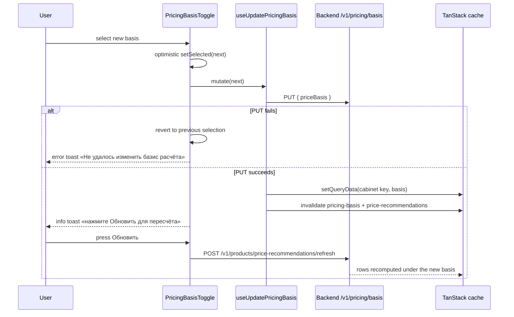

# Domain Logic

Financial and business-logic helpers that encode the core domain rules of the Wildberries seller analytics ERP. These live primarily in `src/lib/` as pure functions, separate from API calls and React hooks.

## Theoretical Profit Formula

**File**: `src/lib/theoretical-profit.ts`

The core profitability formula:

> **Теор. прибыль = Выкупы − COGS − реклама − логистика − хранение**

Key design decisions:
- Uses **sales (выкупы)**, not orders, as the revenue base — orders include items that may be returned.
- Returns a `TheoreticalProfitResult` with a breakdown of each cost component and tracking of missing fields.
- Missing COGS or tariff data results in `null` profit, not a fabricated zero — consistent with [Anti-Pattern #8](api-and-normalizers.md#anti-pattern-8-preserve-null-money-and-ratio-values).

## Margin & COGS

| File | Purpose |
|------|---------|
| `margin-helpers.ts` | Moscow-timezone-anchored week calculation (`nowInMoscow()`, `getLastCompletedWeek()`), COGS temporal validity checks (`isCogsAfterLastCompletedWeek()`), affected-weeks calculation |
| `margin-polling-helpers.ts` | Margin recalculation polling config and ETA estimation |
| `week-calculation-helpers.ts` | Extracted week arithmetic (file-size compliance) |

**COGS temporal validity**: COGS entries are valid for a specific ISO week. The system checks whether a COGS record was set after the last completed Moscow-timezone week to determine if margin calculations are current or need recalculation.

## Profitability Status

**File**: `src/lib/profitability-utils.ts`

`EXTENDED_STATUS_CONFIG` defines profitability tiers with thresholds, colors, Russian labels, and actionable recommendations:

| Status | Threshold |
|--------|-----------|
| Excellent | > 25% |
| Good | 15–25% |
| Warning | (below good) |
| Critical | (below warning) |

**File**: `src/lib/roi-profit-utils.ts` — ROI color coding (≥100% green, <0% red), `formatProfitPerUnit()`.

## Cabinet Target Margin

Each cabinet carries an explicit **target margin** (`targetMarginPct`, Epic 121 GAP-3) that the UI uses as the configurable pricing/profitability target instead of a hardcoded threshold.

| Aspect | Detail |
|--------|--------|
| **Type** | `Cabinet.targetMarginPct: number \| null` (`src/types/cabinet/core.ts`). `null` means "not configured" — the UI falls back to a proposed **20%**. |
| **Persistence** | Stored per-cabinet on the backend alongside tax/VAT settings; updated via `PUT /v1/cabinets/:id` with body field `target_margin_pct` (snake_case). |
| **API boundary** | `updateCabinetTaxSettings()` in `src/lib/api/cabinet.ts` translates the camelCase `targetMarginPct` to the backend `target_margin_pct` field and omits it entirely when `undefined` (so unrelated tax updates don't clear the value). The response is re-normalized so consumers read the same canonical shape as the GET path. |
| **Normalization** | `normalizeCabinetResponse()` (`src/lib/api/cabinet-normalizer.ts`) accepts either `targetMarginPct` or `target_margin_pct` from the raw payload and coerces to `number | null` (consistent with [Anti-Pattern #8](api-and-normalizers.md#anti-pattern-8-preserve-null-money-and-ratio-values) — a missing target stays `null`, never `0`). |
| **Validation** | zod schema: trimmed string, finite number, range `0–100%` (0.01 step). Applied identically in both surfaces below. |

**Two entry points for editing target margin**:

| Surface | Component | Behavior |
|---------|-----------|----------|
| Settings → Cabinet | `TargetMarginSettingsCard` (`src/components/custom/settings/TargetMarginSettingsCard.tsx`), mounted on `src/app/(dashboard)/settings/cabinet/page.tsx` | React Hook Form + zod, resets to the stored value (or 20% fallback), saves via `useUpdateTaxSettings`, gated by `canManageOperationalData` (read-only for Analyst). |
| Onboarding (cabinet creation) | `CabinetCreationForm` (`src/components/custom/CabinetCreationForm.tsx`) | Collects target margin alongside the cabinet name; if a cabinet already exists for the session, submitting updates that cabinet's margin via `useUpdateTaxSettings` instead of creating a new one. Includes a retry path: if cabinet creation succeeds but the margin save fails ("target margin" error), the form re-binds to the existing cabinet so the operator can retry just the margin. Story 167.5 hardened non-idempotent-create recovery: a session recovery marker and helpers (`src/components/custom/cabinetCreationRecovery.ts`, `useCabinetCreationRecovery.ts`, `useCabinetCreationSubmission.ts`) restore the "cabinet already exists" alert, focus, and disabled-create state after reload/remount for the same user, and the presentation split lives in `CabinetCreationFormPresentation.tsx`. |

The mutation hook `useUpdateTaxSettings` (`src/hooks/useCabinetTaxSettings.ts`) invalidates both the `cabinet-tax` and `financial` query families on success, so dashboards pick up the new target alongside the canonical tax config.

## Pricing Basis (Repricing, SPP-1 Lane)

The **pricing basis** is a cabinet-level setting that decides which WB price the per-SKU price recommendations (`/analytics/pricing`) are computed from. Two settable values: `SELLER` (цена продавца, from the seller API) and `STOREFRONT_ANON` (цена витрины — the price an anonymous buyer sees, promos included). Delivered by the SPP-1 frontend lane (SPP-1.3 API/hooks, SPP-1.4/1.6 row fields, SPP-1.7-FE badge/toggle).

> Not to be confused with [Historical SPP](#historical-spp-report-derived-sales-participation) — that is the WB sales-participation metric in rubles/percent. "SPP" in story IDs of this lane refers to the backend repricing track; "basis" is the price source, not a discount.

| Aspect | Detail |
|--------|--------|
| **Endpoint** | `GET`/`PUT /v1/pricing/basis` (`src/lib/api/pricing-basis.ts`), cabinet-scoped by the auto-injected `X-Cabinet-Id` header (see [API Layer & Normalizers](api-and-normalizers.md#financial-api-modules)). GET reads with `skipDataUnwrap: true`; PUT body is `{ priceBasis }` and echoes the persisted basis. |
| **Types** | `PriceBasis` (settable union) and `PriceBasisOrUnknown` (adds `'UNKNOWN'`) in `src/types/price-recommendations.ts`. `STOREFRONT_SESSION` is reserved on the backend (PUT → 400) and deliberately absent from the FE union. |
| **Boundary rule** | `normalizePriceBasis()` passes only the two settable values through; null/missing/future enum members → `'UNKNOWN'` — **indicate, never silently relabel** a financial surface. The badge renders a distinct «Неизвестный базис» chip instead of guessing `SELLER`. `isSettablePriceBasis()` narrows for the toggle; `updatePricingBasis()` runtime-guards the PUT so only the two supported values leave the client. |
| **Row fields** | `toItem()` in `src/lib/api/price-recommendations-normalizer.ts` maps `priceBasis` (via `normalizePriceBasis`), `validationFlags` (non-array → `[]`; entries coerced with `String()`), and `alternativeBasisPrice` — the seller-equivalent companion price under a storefront primary, `null` on batch rows (AP#8 nullable money, see [Anti-Pattern #8](api-and-normalizers.md#anti-pattern-8-preserve-null-money-and-ratio-values)). |
| **Query** | `pricingBasisKeys.cabinet(cabinetId)` (`src/hooks/usePricingBasis.ts`) — cabinet-scoped key (multi-tenant isolation); `usePricingBasis(cabinetId)` is disabled without a cabinet, 60s staleTime. |
| **Mutation contract** | `useUpdatePricingBasis` seeds the cabinet cache with the persisted basis (`setQueryData`) and invalidates **both** the `pricing-basis` and `price-recommendations` key families — a basis change makes every cached recommendation row stale. Since W3-FE the recommendation query keys are themselves cabinet-scoped (`src/hooks/usePriceRecommendations.ts` — see [Architecture — Multi-tenant isolation](architecture.md#multi-tenant-isolation)); the `price-recommendations.all` prefix is deliberately unchanged so this prefix invalidation keeps working. |
| **Recompute pending** | After a basis switch the BE list still serves cached rows computed under the OLD basis until `/refresh` or the scheduler recomputes. `isRecomputePending(cabinetBasis, rowBasis)` (exported pure helper) detects the mixed state so the UI can surface it instead of silently showing toggle=Витрина / badges=Продавец. |



*Basis switch: the toggle optimistically updates, the mutation seeds the basis cache and invalidates both key families, and rows are only recomputed after the explicit refresh.*

### Badge semantics (`src/components/custom/PriceBasisBadge.tsx`)

`resolveBasisBadgeVariant(basis, flags)` is a pure function; the badge is a static chip with `aria-label` + `title` (deliberately **not** `role="status"` — N badges in a table would create N aria-live regions). Styling mirrors `MarginBadge` (`rounded-full` border + `text-xs`).

| Variant | Trigger | Label | Meaning |
|---------|---------|-------|---------|
| `seller` | `SELLER` | Продавец | Seller API price |
| `storefront` | `STOREFRONT_ANON`, no stale flag | Витрина | Anonymous storefront price with promos |
| `stale` | `STOREFRONT_ANON` + `STOREFRONT_STALE` flag | Витрина · устарела | No fresh storefront observation ≤24h — seller fallback price was used |
| `unknown` | `UNKNOWN` | Неизвестный базис | Unrecognized backend value — never folded to SELLER |

A `SELLER` row ignores the stale flag (stale is a storefront-basis concern); unrecognized flags do not trigger the stale variant.

### UI wiring

- `PricingBasisToggle` (`src/app/(dashboard)/analytics/pricing/components/PricingBasisToggle.tsx`) renders in the header's `actions` slot (`PricingPageHeader` gained an optional `actions` prop rendered before the Refresh button). Loading, error, and `UNKNOWN` states render a **disabled placeholder** («—» / «Ошибка загрузки») — never a fabricated basis. Server data wins once loaded (effect resets `selected` after success/refetch). Renders nothing when `cabinetId` is null; the page passes `useAuthStore(s => s.cabinetId)`.
- `CurrentPriceCell` in `PricingTable` renders the price + badge inline, plus a muted `продав: …` companion line when `alternativeBasisPrice` is present.

**Focused tests**: `src/lib/api/__tests__/pricing-basis.test.ts` (normalizer folding + GET/PUT), `src/hooks/__tests__/usePricingBasis.test.ts` (key isolation, dual invalidation, cache seeding), `src/components/custom/__tests__/PriceBasisBadge.test.tsx` (variant resolution, labels, a11y), `src/app/(dashboard)/analytics/pricing/components/__tests__/PricingBasisToggle.test.tsx` (placeholder/revert/hint), `PricingTable.test.tsx` (badge + companion price in the cell), `PricingPageHeader.test.tsx` (actions slot), `price-recommendations-normalizer.test.ts` (row-field mapping).

```bash
npx vitest run src/lib/api/__tests__/pricing-basis.test.ts src/hooks/__tests__/usePricingBasis.test.ts src/components/custom/__tests__/PriceBasisBadge.test.tsx src/app/\(dashboard\)/analytics/pricing
```

**Change recipe — adding a new basis value** (e.g. a future `STOREFRONT_SESSION` enablement): extend `PriceBasis` in `src/types/price-recommendations.ts` → pass it through in `normalizePriceBasis` + `isSettablePriceBasis` (`src/lib/api/pricing-basis.ts`) → add the option in `BASIS_OPTIONS` (`PricingBasisToggle.tsx`) → add a badge variant in `PriceBasisBadge.tsx` → update `emptyPriceRecommendation` (`src/test/fixtures/price-recommendations-empty.ts`) and every `PriceRecommendation` test literal → extend the five focused test files above. Non-goals: the PUT runtime guard, dual key-family invalidation, and the disabled-placeholder rule stay untouched.

## Historical SPP (Report-Derived Sales Participation)

The SKU analytics page (`/analytics/sku`, Story 128.27) exposes **historical SPP** — the actual sales-participation / списание-за-продажу amount derived from WB financial-report transactions, not an estimate. It surfaces as two parity fields: `spp_rub` (₽) and `spp_pct` (%).

| Aspect | Detail |
|--------|--------|
| **URL state** | `src/app/(dashboard)/analytics/sku/components/historical-spp-state.ts` — `readHistoricalSppEnabled()` reads the `include_cogs` search param (defaults to **enabled**; only an explicit `false` disables). `setHistoricalSppSearchParam()` returns a copy so Next.js read-only search params are never mutated in place. `selectHistoricalSppValues()` scrubs stale enabled-cache values to `null` when disabled while preserving explicit `0` when enabled. |
| **Query flag** | The toggle drives the `includeCogs` filter on `useMarginAnalyticsBySku` (`src/hooks/useMarginAnalyticsBySku.ts`), which is part of the TanStack Query key — enabled and disabled states produce **separate requests and cache entries**. See [API Layer & Normalizers](api-and-normalizers.md#anti-pattern-8-preserve-null-money-and-ratio-values). |
| **Parity mapping** | `useSkuPageState` merges `/v1/analytics/weekly/by-sku` parity data onto the base SKU financials by `nm_id`; `toSkuParity()` maps `spp_rub`/`spp_pct` through `selectHistoricalSppValues()`. When disabled, prior enabled-cache values never leak into the disabled view. |
| **Null vs zero** | A missing historical SPP value is `null` and renders as `—`; an explicit `0` renders as `0 ₽` / `0%`. This distinction is the AP#8 rule applied to report-derived money/ratio fields. |
| **Rendering** | `HistoricalSppHeaders` + `ParityMetricCells` (`src/components/custom/sku-financials/`) render the columns; the `showHistoricalSpp` prop threads through `SkuFinancialsTable` → `SkuRow` → `ParityMetricCells` so the headers and cells stay in sync. Columns are `lg:`-only. |

**Focused tests**: `historical-spp-state.test.ts` (URL state), `historical-spp-query.test.tsx` (query/cache separation), `historical-spp-rendering.test.tsx` (null vs zero rendering), `e2e/historical-spp-analytics.spec.ts` (fully mocked end-to-end).

## Unit Economics

| File | Purpose |
|------|---------|
| `unit-economics-utils.ts` | Barrel re-export + waterfall chart transformation (`transformToWaterfallData`) |
| `unit-economics-config.ts` | Cost categories, profitability status configs (`PROFITABILITY_STATUS_CONFIG` is the single token-based tier set — `/15` chip classes + `var(--color-*)`, Story 168.11 — shared with the sku-financials legend; the legacy `bgColor` hex field was removed) |
| `unit-economics-analysis.ts` | `getTopMarginKillers`, `calculateHealthScore`, `sortByProfitability`, `filterLossMaking`, `filterMissingCogs` |
| `unit-economics-formatters.ts` | Domain-specific formatting |

## Price Calculator Domain Logic (COGS → Калькулятор цены)

The price calculator (`/cogs/price-calculator`, `src/components/custom/price-calculator/`) has its business logic extracted into sibling non-component modules (a repeated "file size compliance" pattern), separate from the presentational components covered in [Design System](design-system.md).

### Cost breakdown types & chart building

`cost-breakdown-types.ts` defines the pure data contract for the recommended-price cost breakdown chart:

- `ChartInputParams` — the form-derived percentages (`commissionPct`, `acquiringPct`, `drrPct`, `vatPct`) threaded through `PriceCalculatorResults` → `CostBreakdownChart` for dynamic segment labels.
- `ChartSegment` — one chart slice: `key`, `label`, share of price (`pct`), ruble amount (`rub`), `color`, `isMargin` (margin is always last), and the input percentage for tooltips.
- `CHART_COLORS` — design-token color mapping per cost kind (`commission_wb` → `var(--color-chart-1)`, …, `margin` → `var(--color-chart-positive)`), so chart colors follow the theme, not hex literals.
- `MIN_SEGMENT_WIDTH_PX = 24` — minimum visual width for any non-zero segment so thin slices stay visible.

`cost-breakdown-helpers.ts` re-exports these for backward compatibility and contains the builders: `formatPctRu()` (Russian comma decimal), `buildLabel()` (labels echo the user's actual input percentage), and `buildChartSegments()` — which returns `[]` when `recommendedPrice <= 0`, computes each segment's share of the recommended price, derives the fixed-cost base as price minus all percentage segments and margin, and sorts segments by size with margin last.

### Margin status helpers

`margin-status-helpers.ts` is shared between `MarginSection` and related components:

- `MARGIN_STATUS_CONFIG` — the four margin tiers with Russian labels and token-based badge classes (`/15` backgrounds + `text-*` status tokens): excellent «Отлично», good «Хорошо», warning «Низкая», critical «Критично».
- `getMarginStatus(pct)` — threshold mapping: **≥ 20% excellent, ≥ 10% good, ≥ 5% warning, else critical**.
- `getMarginColor(marginPct)` — the same thresholds mapped to text-color classes for inline health coloring.

Note these thresholds are calculator-internal defaults; the cabinet-level configurable target is `targetMarginPct` (see above), and the analytics-wide profitability tiers live in `PROFITABILITY_STATUS_CONFIG` — three distinct tier systems with different purposes.

## Liquidity Analysis

| File | Purpose |
|------|---------|
| `liquidity-utils.ts` | Summary helpers: `getIlliquidSkuCount`, `isFrozenCapitalHealthy`, `calculatePotentialUnlock`, `getRecommendedScenario` |
| `liquidity-category-config.ts` | Category definitions: highly_liquid, medium, low, illiquid (with colors/labels) |
| `liquidity-action-benchmark.ts` | Action types, benchmark statuses, trend insights |
| `liquidity-formatters.ts` | Turnover days, velocity, frozen capital formatters |
| `liquidity-sort.ts` | Sort field mapping and item sorting |

### Liquidity Trends (Story 165.4)

The liquidity page (`/analytics/liquidity`) renders a **trends section** (Динамика ликвидности) backed by `GET /v1/analytics/liquidity/trends`, which returns up to 90 dated daily snapshots (`{ meta, trends: TrendDataPoint[], insights }`) computed from the BE daily-sync pipeline. A period selector (30/60/90 days, default 90) drives the query param and lives in the TanStack Query key.

| Aspect | Detail |
|--------|--------|
| **Trend point** | `TrendDataPoint` (`src/types/liquidity/distribution.ts`) — `date`, `distribution` (per-category percentages), `frozen_capital`, `avg_turnover_days`. Forwards ONLY BE-provided points (AC2). |
| **Charts** | `LiquidityTrendChart` (Recharts ComposedChart, dual-axis: frozen capital ₽ left, turnover days right) + `LiquidityDistributionTrendChart` (stacked AreaChart, liquid → illiquid). Config in `src/app/(dashboard)/analytics/liquidity/components/liquidity-trend-config.ts`. |
| **Malformed-response guard** | `getLiquidityTrends` (`src/lib/api/liquidity.ts`) THROWS when the body lacks `meta` or a non-array `trends`, so TanStack surfaces `isError` and the section renders its retry branch — the normalizer would otherwise coerce any body to an empty response and hide a genuine backend failure. A well-formed empty response (`{ meta, trends: [] }`) still passes. |
| **Independent state machine** | `LiquidityTrendsSection` owns its own loading/empty/error state (AC4 multi-source) — a trends failure never blanks the surrounding liquidity page. 30-min staleTime (historical data changes slowly). |

**Focused tests**: `src/app/(dashboard)/analytics/liquidity/components/__tests__/LiquidityTrendChart.test.tsx` (chart rendering), `e2e/liquidity.spec.ts` (E2E).

## Cost & Tariff Calculations

| File | Purpose |
|------|---------|
| `acceptance-cost-formulas.ts` / `acceptance-cost-utils.ts` | WB acceptance (приёмка) cost calculations |
| `storage-cost-utils.ts` / `storage-cost-helpers.ts` | Storage cost per box type |
| `logistics-tariff.ts` / `logistics-tariff-helpers.ts` / `logistics-calculation-utils.ts` | Logistics tariff calculations |
| `tariff-system-utils.ts` / `tariff-extraction-utils.ts` | Tariff system parsing and validation |
| `tariff-fallback-diagnostics.ts` | Bounded fallback-warning dedup for storage-tariff fallbacks (Story 164.3) — collapses N per-row fallback events within one calculation into a single aggregate diagnostic, and dedupes identical snapshots across renders via a bounded FIFO store; calculation results are unaffected |
| `coefficient-utils.ts` / `coefficient-date-helpers.ts` | WB coefficient calculations (dimensional, etc.) |

## ISO Week & Moscow Timezone

The entire analytics system operates on **ISO weeks anchored to Moscow timezone** (UTC+3). Week boundaries, period comparisons, and "last completed week" calculations all use Moscow time.

| File | Purpose |
|------|---------|
| `src/lib/iso-week/core.ts` | Core ISO week calculation |
| `src/lib/iso-week/navigation.ts` | Week navigation (prev/next) |
| `src/lib/iso-week/ranges.ts` | Week range generation |
| `src/lib/iso-week/comparison.ts` | Period comparison utilities |
| `src/lib/date-utils.ts` / `src/lib/date-range-utils.ts` | General date manipulation |

## Formatters

All formatters use **Russian locale** (`ru-RU`) for number/currency display.

| File | Key Functions |
|------|---------------|
| `src/lib/formatters/currency-formatters.ts` | `formatCurrency` (RUB), `formatCurrencyCompact` (1.2 млн ₽), `formatCogsCost` (2 decimals, null→"—") |
| `src/lib/formatters/percentage-formatters.ts` | `formatPercentage`, `formatPercentageInt`, `formatPercentagePoints` |
| `src/lib/formatters/number-formatters.ts` | `formatNumber`, `formatDecimal`, `formatRoas` |
| `src/lib/formatters/date-formatters.ts` | `formatDate`, `formatDateTime`, `formatIsoWeek`, `formatWeeksAgo` |

**Locale formatting rule**: Percentages must render as `"15,5 %"` (comma + non-breaking space), not `"15.5%"`. Use `formatPercentage` / `formatPercentageInt` — inline `toFixed(N) + '%'` is banned by the dot-locale percent ratchet (see [Conventions & Quality Gates](conventions-and-quality.md)).

## Null Helpers

**File**: `src/lib/null-helpers.ts`

Enforces the "null not undefined" standard for missing data: `isNullish`, `coerceToNull`, `hasValue`, `nullSafe`. This is the foundation of AP#8 null semantics — missing money/ratio data is `null`, not `0` or `undefined`.

**File**: `src/lib/decimal-utils.ts` — `parseDecimal()` handles Prisma DECIMAL strings ("96000.0000" → 96000).

## Order Expiration (WB Shelf-Life Management)

Wildberries supports per-order product expiration dates (shelf-life / срок годности). This feature lets operators manually set or auto-fill the expiration date on FBS orders, with a reconcile-and-retry strategy for WB API write uncertainties.

**Backend capability metadata** (`ExpirationMeta` in `src/types/orders.ts`):
- `requirement` — `'required'` or `'optional'` per SKU/category
- `value` — current committed expiration date (`null` if unset)
- `editable` / `manualEditable` / `fefoAvailable` — which write workflows are available
- `reconciliationRequired` — a previous WB write has no definitive read-back; must reconcile before another PUT
- `minimumDate` — earliest acceptable date (backend-authoritative)

**Three write workflows** (`src/hooks/useOrdersExpirationMutations.ts`, API in `src/lib/api/orders-actions.ts`):

| Workflow | Endpoint | Description |
|----------|----------|-------------|
| Manual update | `PUT /v1/orders/:orderUuid/meta/expiration` | Operator enters a date directly |
| FEFO auto-fill | `PUT /v1/orders/:orderUuid/meta/expiration/from-stock-batch` | Backend picks the soonest-expiring stock batch (First-Expire-First-Out), reserves it, and writes the date |
| Reconcile | `POST /v1/orders/:orderUuid/meta/expiration/reconcile` | Read-only WB read-back to verify a previous uncertain write; never repeats the PUT |

**Uncertain-write handling** (`src/lib/api/order-expiration-error.ts`):
- HTTP 502 with `ORDER_EXPIRATION_OUTCOME_UNCERTAIN` — the WB write may or may not have succeeded. The mutation hooks automatically call reconcile; if verified, the date is confirmed; otherwise the write stays blocked until the operator intervenes.
- HTTP 400 with `ORDER_EXPIRATION_DATE_TOO_EARLY` — `extractExpirationMinimumDate()` reads the authoritative minimum from the backend envelope and surfaces it so the UI can clamp the date picker.

**Date validation** (`src/lib/order-expiration-date.ts`): `isIsoCalendarDate()` performs strict `YYYY-MM-DD` pattern + UTC calendar round-trip validation, guarding against invalid dates like `2026-02-31`.

**UI**: `OrderExpirationSection` (`src/components/custom/orders/OrderExpirationSection.tsx`) — integrated into `OrderDetailsModal`, renders the date input, FEFO auto-fill button, and reconcile button based on `ExpirationMeta` capability flags.

## Account Finances (NEW-7)

The `/finances` page is an **account-level** page (not weekly analytics) with two independent sources (AC4 multi-source): account balance + financial documents.

### Account balance

`GET /v1/finances/balance` returns WB account balance. Money fields (`current`, `forWithdraw`) are nullable per AP#8 — WB may omit them when the cabinet has no balance data yet, so they preserve `null` and render `—`, never collapse to `0`. `BalanceCard` (`src/app/(dashboard)/finances/components/BalanceCard.tsx`) renders the balance using `formatNullableCurrency()` (`src/lib/finances/finances-formatters.ts`), which bridges the nullable money → RUB string (`null` → `—`, number → formatted). The hook uses a 60s staleTime mirroring the WB 1/min rate limit so TanStack doesn't refetch faster than WB allows (which would surface a 503).

### Financial documents

| Aspect | Detail |
|--------|--------|
| **List** | `GET /v1/finances/documents` (filtered + paginated, 1/10s WB rate limit → 10s staleTime). `DocumentItem.serviceName` is REQUIRED to download. |
| **Categories** | `GET /v1/finances/documents/categories` — filter options (5-min staleTime, stable). |
| **Download** | `GET /v1/finances/documents/:serviceName/download?extension=pdf\|xlsx` returns **base64-encoded** content. `download-blob.ts` (`src/lib/finances/download-blob.ts`) decodes base64 → Blob → transient `<a download>` browser click. Returns `false` on empty/malformed base64 so the mutation can surface an error. The 1s-revoke grace avoids a Firefox download-handoff race. |
| **Fallback filename** | When the BE omits `fileName`, `useDownloadDocument` builds a fallback from the `serviceName` tail (last `/`-segment) + extension. |

**Components**: `DocumentsTable`, `DocumentsFilters`, `DocumentsPagination`, `DocumentDownloadButton` (`src/app/(dashboard)/finances/components/`). **Focused tests**: `BalanceCard.test.tsx`, `DocumentsTable.test.tsx`, `src/lib/finances/__tests__/download-blob.test.ts`, `e2e/finances.spec.ts`.

## Seller Communications (NEW-2)

The `/communications` page surfaces WB seller communications across five tabs: feedbacks (Отзывы), questions (Вопросы), chats (Чаты), claims (Претензии), and pinned reviews (Закреплённые). Each section is an **independent state machine** (AC4 multi-source) — one failing never blanks the others. The header carries a live `UnreadBadge` (its own query, 60s staleTime). All sections are gated on `cabinetReady` (cabinet selected) so they don't fire before a cabinet is available.

### Read-side (PR1)

| Concern | Detail |
|---------|--------|
| **Value fields** | `rating`, `nmId` preserve null (AP#8 — render `—`); only `total`/`unansweredCount`/`unreadCount` use counts (legit `?? 0`). |
| **Opaque id** | `nmId` is an opaque numeric WB id — render with `String(nmId)` (AP#10), never `formatNumber`. |
| **Chats dual-mode** | `GET /v1/communications/chats` returns a threads list (no `chatId`) OR a single thread + messages (with `chatId`). An empty-string `chatId` collapses to list mode (same cache entry as undefined — no cache split). |
| **Pinned passthrough** | `GET /v1/communications/feedbacks/pinned` is a live SDK passthrough returning `{ data, next }`; requires `skipDataUnwrap: true`. `pinOn` is the LOCATION of the pin (`'nm'` = product card, `'imt'` = merged-card group), NOT a date — the pin date is `changeStateAt`. |
| **Freshness** | List endpoints 30s staleTime; unread badge 60s. `refetchOnWindowFocus: false`, `retry: 1`. |

### Write-side (PR2) — gated async 202

The write-side (reply to feedback, answer question, send chat message, pin/unpin feedback) is gated and async. See [API Layer & Normalizers — Communications Write-Back](api-and-normalizers.md#communications-write-back-new-2-async-202-job-polling) for the four-factor gate, per-gesture confirmation token, BullMQ allowlist, and poll-lifecycle details.

| Aspect | Detail |
|--------|--------|
| **Status predicates** | `src/lib/communications-writeback-utils.ts` — single source of truth for `isWritebackPolling` / `isWritebackCompleted` / `isWritebackDisabledError` / `writebackErrorMessage`. Re-exported by `src/types/communications/writeback.ts`. |
| **Coordinator** | `useWritebackJob` (`src/hooks/useWritebackJob.ts`) wraps mutation → 202 → poll → terminal; fires `onTerminal` once per **attempt** (`attemptKey = jobId#attempt`); captures action kind at fire time; distinguishes poll-error from job-failed. The `setJobId` attempt nonce re-arms the poll for a deterministic chat jobId (dedup) so retrying a timed-out send works — see [API Layer & Normalizers — Retry-rearm](api-and-normalizers.md#retry-rearm-for-deterministic-chat-jobids-new-2-fast-follow). |
| **UX copy** | RU-only messages: `WRITEBACK_DISABLED_MESSAGE` (403 kill-switch), `WRITEBACK_INFLIGHT_MESSAGE` (Отправляется…), `WRITEBACK_TIMEOUT_MESSAGE` (poll deadline). Raw BE/English error.message is NEVER shown to the user. |

**Components**: `FeedbackWriteControls` / `QuestionWriteControls` / `PinnedWriteControls` (per-section write controls), `ChatComposer` + `ReplyForm`, `ConfirmAction`, `WritebackStatus` (`src/app/(dashboard)/communications/components/`). **Focused tests**: `communications-writeback.test.ts`, `communications-writeback-msw.test.ts`, `useCommunicationsWriteback.test.ts` (incl. retry-rearm regression), `useWritebackJob.test.ts`, `communications-writeback-utils.test.ts`, `QuestionWriteControls.test.tsx` (incl. timeout-toast).

## Backfill Retry (Story 165.5)

The backfill admin page (`/settings/backfill`) exposes **per-source retry** controls for failed backfill pipelines. The backend exposes two separate retry endpoints — `POST /v1/admin/backfill/report/retry` and `POST /v1/admin/backfill/analytics/retry` — keyed by `BackfillRetrySource` (`'reports' | 'analytics'`, `src/types/backfill.ts`). `retryBackfill()` (`src/lib/api/backfill.ts`) routes to the correct path via a `RETRY_PATH` map and normalizes the response (`{ success, message }` with an attempt counter) through `normalizeRetryBackfillResponse`. The UI disambiguates the failed state so the operator retries only the failed source's pipeline. **Focused tests**: `src/lib/api/__tests__/backfill-retry.test.ts`, `BackfillRetryControls.test.tsx`, `e2e/settings/backfill-admin.spec.ts`.
