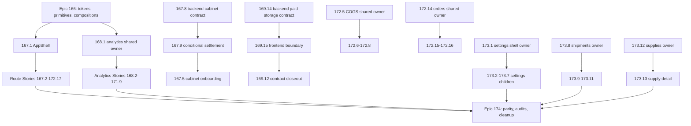
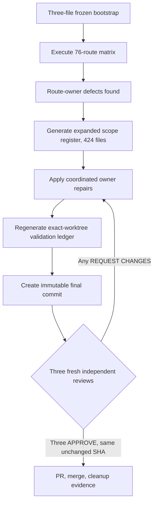

# Migration Program (Epics 166-174)

<!-- openwiki: broken internal link [/openwiki/conventions-and-quality.md] file "/openwiki/conventions-and-quality.md" does not exist. Fix the href or restore the target, then delete this comment. -->
<!-- openwiki: broken internal link [/openwiki/design-system.md] file "/openwiki/design-system.md" does not exist. Fix the href or restore the target, then delete this comment. -->
This page is the canonical wiki home for the shadcn full-UI migration **program**: the master plan, the story pipeline, the current status ledger, and the handoff/orchestration process. Per-story migration status lives here (not in `design-system.md` or `quickstart.md`) so status churn is isolated from stable conventions. See [/openwiki/conventions-and-quality.md](/openwiki/conventions-and-quality.md) for coding standards and [/openwiki/design-system.md](/openwiki/design-system.md) for the token/component layers this program delivers.

Immediate predecessor context: **Epic 165** (Truthful Status & Backend-Ready Backlog) closed with stories 165.1–165.3 done and **165.4 / 165.5 deferred (backend-gated)** — 165.4 (liquidity trends activation) waits on the backend daily-snapshots contract, 165.5 (per-status backfill retry) on the backend per-status retry contracts. This migration program (Epics 166–174) started after that lane settled into its deferred state.

## Program goal and invariants

The master plan (`.omx/plans/shadcn-full-ui-migration-master.md`) migrates the entire frontend presentation layer to the approved shadcn/ui semantic design system, one BMAD Story at a time, **preserving** backend contracts, calculations, query keys, mutation behavior, URLs/search parameters, authentication, cabinet context, Russian localization, and formatting semantics. The only approved contract exceptions are Story 167.8 (cabinet session reconciliation/create-idempotency) and Story 169.14 (paid-storage import lifecycle/result), both executed in the backend repository; no other story inherits either exception.

Program completion requires: exactly 94 stories with matching OMX plans and completion evidence, all 76 `page.tsx` routes verified exactly once via the route ledger, legacy presentation removed only after its last consumer migrates, and every temporary feature worktree and branch removed after merge. Production/deployment work and CI gates are explicitly out of scope; local validation is the merge gate.

Key structural rules:

- **Layering**: semantic tokens → generic shadcn primitives → product compositions → domain-shared components → route-owned UI trees. `src/components/ui/**` stays generic and is forbidden territory for route stories.
- **Ownership**: every file consumed by two or more routes has exactly one upstream owner story (e.g. 172.5 owns single-COGS presentation for 172.6–172.8; 172.14 owns order-shared presentation for 172.15–172.16; 173.1 owns the settings shell; 173.8 owns shipment-shared presentation for 173.9–173.11; 173.12 owns supply-shared presentation for 173.13). Forbidden shared files (`package.json`, `src/components/ui/**`, `src/hooks/**`, `src/lib/**`, `src/types/**`, `src/stores/**`, AppShell, `analytics/shared/**`) require stop-and-escalate, never direct edits.
- **DAG over numbering**: story numbers are identities, not a universal execution order. Correct-course prerequisites (e.g. 167.8 → 167.9 → 167.5 before 167.6/167.7; 169.14 → 169.15 → 169.12 closeout; owner stories before consumers) override numeric order. The standing operator policy is sequential execution: numeric order 173.2 → 173.13 → 174.1 → 174.5 is safe and satisfies the DAG. Epic 174 starts only after Epics 166–173 are complete.

## Status ledger (verified 2026-08-31, PR #372)

| Epic | Scope | Progress | Status |
|---|---|---|---|
| 166 foundation | 8 stories | 8/8 | **CLOSED** (tokens, primitives, compositions, contracts) |
| 167 AppShell/auth | 9 stories | 9/9 | **CLOSED** |
| 168 analytics core | 11 stories | 11/11 | **CLOSED** (hub + 10 routes) |
| 169 operational analytics | 15 stories | 15/15 | **CLOSED** (169.14 → 169.15 → 169.12 contract-closeout chain; 169.13 via PR #232) |
| 170 advertising/brand/search | 7 stories | 7/7 | **CLOSED** (PRs #237-#250) |
| 171 AI/forecast/models | 9 stories | 9/9 | **CLOSED** (PRs #252-#270) |
| 172 business workspace | 17 stories | 17/17 | **CLOSED** — 172.10 Finances & Documents (#308/#309), 172.11 Monitor (#311/#312), 172.12 Monitoring Operations Console (#315), 172.13 Moysklad workspace (#317), 172.14 Orders Overview (#319), 172.15 FBO Orders (#321), 172.16 Order Integrity (#323), 172.17 Product Management (#325, includes Epic-172 retrospective) |
| 173 settings/shipments/supplies | 13 stories | **13/13** | **CLOSED** — settings 173.1–173.7 (#328–#348), shipments 173.8 (#350/#351 + auxiliary #352, no residue), 173.9 (#353/#354 + auxiliary #355, fully historical), 173.10 Shipment Box Types (#356/#357, 17 files, visible units/44px targets), 173.11 SKU Packaging (#359/#360, 24 files, strict integer/single-bulk-delete payloads), 173.12 Supplies List owner (#361, WCAG solid-pair badge canon after a 4.06:1 axe catch), 173.13 Supply Detail (#365/#366 + auxiliary #367, fully historical; full floor 19,874/0/1255) |
| 174 consolidation | 5 stories | **5/5** | **CLOSED** — 174.1 parity (#369 `360c9cb9` + closeout #370 `fbdab2da` + lifecycle #371 `e7d438ce`); 174.2 legacy removal + design-system boundary (PR #372, merge `862d45a1`, ratchet born at 523); 174.3 inclusive visual/a11y matrix (PR #374, merge `c5605a38`, after the immutable three-APPROVE gate closed via remediation `56b3a6c2`); 174.4 full functional/backend-contract regression (PR #375 `a21bf67e` + closeout #376, ~53 spec defects fixed, boundary ratcheted 523→459); 174.5 final documentation/cleanup (PR #379 on base `0d6225ac`, route ledger 76/76 `verified`, tracker drift synced) |

**Program complete: 94 of 94 stories done, all 9 epics CLOSED (2026-08-11 → 2026-09-02), final main base `0d6225acb9abfafa872d2d2ee45f215594edc4e6`.** All 76 route-ledger rows are `verified` — flipped `planned → verified` only by Story 174.5 after a full per-row evidence audit: 54 rows with complete per-story chains and 22 early-wave rows (167.4–167.7, 168.1–168.11, 169.1–169.7) whose cleanup link was satisfied by a collective live-absence audit (`git worktree list` / `branch --list 'cdx/*'` / `ls-remote --heads origin`), after an independent adversarial verifier **refuted 4 builder-map rows** (167.5/167.6/167.7 CLEANUP, 167.4 partial), forcing the audit rescope 18→22 and correcting the full-chain tally 58→54. Every story PR SHA is an ancestor of `0d6225ac`.

Final full-suite Vitest floor: **19,363 passed / 0 failed across 1,270 + 4 files** (trajectory: 19,874 at 173.13 → 19,118 after 174.2's deliberate −756 dead-test deletion → 19,355 in the 174.3 window → 19,363 with 174.4's +8 contracts).

Epic 173 closed 13/13: 173.1 owns the settings shell (children 173.2–173.7 never edited it); 173.8 owns shipment-shared presentation for 173.9–173.11; 173.12 owned supply-shared presentation for 173.13, including the 18-file `DETAIL_EXCLUDED` load-bearing guard catalog proving the list equals the exact transitive import closure of `[id]/page.tsx`. APIs, hooks, query keys, types, calculations, authentication, cabinet context, URLs/search parameters, mutation semantics, cache behavior, and backend contracts remain behavior-preservation surfaces unless an exact story explicitly owns a change.

### Epic 174 consolidation chain

Epic 174 is sequential and started only after all 13 Epic 173 stories merged with lifecycle cleanup/evidence complete; frontmatter wording such as `ready-for-execution` never overrides a plan's prerequisite DAG.

1. **174.1 parity — DONE** (`scripts/check-shadcn-migration-parity.mjs`): proves schema-v3 parity 94 BMAD stories = 94 OMX plans and 76 source routes = 76 ledger rows = 76 unique route-owning stories = 76 unique linked implementation artifacts, including App Router route-group normalization and the exact backend exceptions 167.8/169.14. It is dependency-free and filesystem-only, runs a 33-test deterministic `node:test` mutation suite (deep-cloned real corpus; asserts exact `{ code, identity }` failure records for missing/orphan/duplicate/title/evidence/status/repository/prerequisite/route/artifact defects) before validating the canonical corpus, and emits one machine-readable report plus one human summary from the same run/base SHA. Backend Git corroboration is labeled `PASS(historical+local+cached)` with live remote proof honestly `unavailable` (DNS). It did **not** flip ledger rows to `verified` — 174.5 owns those transitions.
2. **174.2 legacy removal + boundary enforcement — DONE** (PR #372): 65 proven-dead files deleted (−13,022 lines) across six executor waves with per-file import-closure proof, the complete lib-wave (§3.1 of the 2026-08-30 team handoff: wb-status trio → solid status pairs, monitoring `STATUS_COLORS`, `getMarginColor` dedupe to canonical 168.3 tiers, orders/liquidity/supply-planning helpers), the 171.9 carry-outs ×5, `SUPPLY_STATUS_CONFIG` whole-file delete, and the C2/C3/C4/C10/C16 families. It also added the bounded design-system boundary enforcement described below.
3. **174.3 inclusive visual/theme/responsive/a11y proof — DONE** (PR #374, merge `c5605a38`; status synced from stale `review` to `done` by 174.5) — see the dedicated section below. The scope covered the 76-route inclusive visual matrix (the canonical twelve-state ledger taxonomy across light+dark themes, six widths, 200% real browser-UI zoom, reduced motion, keyboard/focus, reading/heading order, non-color data meaning, axe WCAG 2 A/AA/2.2 AA at 390px and 1280px), remediation of the discovered product defects, and the fail-closed execution-manifest evidence pipeline. The **three-review remediation gate** closed via remediation commit `56b3a6c2`: the initial commit and three remediation candidates received `REQUEST CHANGES`/`REJECT` verdicts from independent reviewers before a final unchanged SHA collected three `APPROVE`s. Automated axe alone was never sufficient; unavailable environments (real VoiceOver/NVDA/JAWS/TalkBack) were recorded as gaps, never passes.
4. **174.4 full functional/backend-contract regression — DONE** (PR #375 `a21bf67e` + closeout #376): fixed ~53 baseline-failing tests (spec-defect classes across Epic-44 sliders/aria, navigation canonicalization, 167.5/167.7 auth seeds, h2-loading collisions, timeouts, strict locators) plus 2 real product WCAG/layout defects (D5/D6); regenerated the 174.3 execution manifest via its documented `--owner-browsers` runner after spec fixes broke SHA pins (**367 passed / 0 failed / 23 skipped**); resolved the 13 bisect-proven pre-existing liquidity (×12, resolved-by-174.3) and monitor weekly-chart (×1, fixed) e2e failures; ratcheted the ui-boundary baseline 523 → **459** (the 64-violation drop originated in the 174.3-window raw-class removals, initially mis-attributed and corrected by a second fresh-context review pass). Two review passes: APPROVE-WITH-NOTES after the false-attribution finding was applied, then REJECT-as-is with a scoped fix path at the recorded counts.
5. **174.5 final documentation and cleanup — DONE** (PR #379 on base `0d6225ac`): documentation/tracking-only closeout owning zero runtime routes — flipped all 76 ledger rows to `verified` with the adversarially verified evidence map, re-pinned the parity gate to its terminal state (`EXPECTED_BASE_SHA` → `0d6225ac`, ledger expectation `planned → verified`), synced tracker drift (duplicate 174.2 row deleted, 174.3 `review → done`, 21 frozen pre-merge artifact status lines synced with history preserved in parentheses), re-confirmed the owner-accepted exceptions, and published the final delivery manifest, program retrospective, and final 94/94 handoff. Zero completed migration branches/worktrees remain; no deploy action.

### Validator scripts and baselines

Two enforcement scripts were built during Epic 174 and now serve as **post-migration regression guards over a finished program** — they protect the completed migration against regressions on future changes; they gate no in-flight stories. Each has a committed plain-text baseline:

- `scripts/check-shadcn-migration-parity.mjs` (Story 174.1) — BMAD/route-ledger/OMX plan parity; self-suite `scripts/__tests__/check-shadcn-migration-parity.test.mjs` (33/33). Now in **terminal state**: the corpus expectation was moved to `verified` and `EXPECTED_BASE_SHA` was re-pinned to the Story 174.5 base `0d6225ac`. Maintainer note: on `main` after merge it reports **base-sha-mismatch BY DESIGN** (precedent 174.1); re-check by running in a worktree based on the pinned SHA or re-pinning the constant to a new story base. Corpus-only mode: `STORY_174_1_SKIP_SELF_TESTS=1` (same pin).
- `scripts/check-shadcn-ui-boundary.mjs` (Story 174.2, ratcheted down by 174.4 and the post-program boundary waves) — node-stdlib-only scanner over production `src/**/*.{ts,tsx}` (tests, d.ts, `src/test/**` excluded; relative-first enumeration so foreign worktree paths cannot re-enter), detecting the extended `LEGACY_PALETTE` regex and 3-branch `CONTEXTUAL_HEX` canon. Its ratchet baseline `scripts/.shadcn-ui-boundary-baseline.txt` was born at 523 in 174.2, lowered to **459** by 174.4, to **372** by debt session-2 boundary waves (459 → 401 via wave-1, the financial-summary family ×11 files / 58 sites → semantic tokens, PR #394; 401 → 372 via wave-2, the Margin family — whose live count had drifted 58→29, proving catalog drift — plus the D-4 fold-in catching a hidden 4.19/4.42 AA failure the D-4 attestation had masked, fixed /15→/5, PR #395), and were lowered to **114** by C5 wave-1 (2026-09-11, dead `src/lib/chart-colors.ts` deleted, −4 sites) and to the current **57** by C5 wave-2 (lib-hex 57 sites → semantic tokens; residue = 38 chart-hex + 19 legacy-palette classes: components 37 + app 17 + types 3, owned by C5 waves 3–4). A plain run exits 0 at ≤ the baseline and fails only on increase ("registered" = baseline-grandfathered, locale-percent precedent). **3** suppressed matches in **3** files remain in the `BOUNDARY_EXCEPTIONS` register (single source of truth, mirrored 1:1 by the classification manifest): the C5 waterfall categorical hex (11 hex + 2 tokens across 13 series, awaiting a chart-palette owner decision) and two historical `#7C3AED` chart marks (PriceHistorySheet, FunnelTab — 170.x carry-outs). The former fourth exception (FeedbackButtons) was **lifted 2026-09-02** when PB-4 was fixed via a solid status pair (debt D-3). Self-suite 10/10. The long-frozen 118 residue was **unblocked by the C5 owner decisions of 2026-09-11** (session-12, 8 questions answered: CSS tokens are the sole chart-color canon, categorical palette extends to `chart-1..10`, a valence scale `--valence-1..5` + `--valence-neutral`, waterfall valence semantics, full 118 → 0 target with all 3 exceptions lifted, delivery as 4 waves, review mode 4/2/2/4). Waves 1–2 have executed: W1 (PR #441) minted the tokens in `src/styles/globals.css`, fixed dark `--chart-2` lightness 59.6% → 70% (selected-stack pair 5.31:1, RED-checked at 3.6979 ≈ the wave-6 "3.71" attestation), deleted the dead `src/lib/chart-colors.ts` (boundary 118 → 114, floor 19,570 → **19,573**), and pinned pixel-identity, hue-separability, and compiled-contrast contracts; W2 (branch `debt/c5-w2-lib-hex-tokens`) migrated the 57 lib-hex sites (boundary 114 → **57**) with a codified `color-mix(in srgb, var(--color-<role>) N%, var(--color-card))` tint recipe — raw triplets `var(--x)` are not colors (jsdom is blind to CSS-variable resolution; proven by a reviewer headless-Chromium probe) and `hsl(var(--x))` matches `CONTEXTUAL_HEX` and would re-inflate the boundary. The former freeze rule is superseded: chart-hex migration is now in progress, not owner-gated. Live per-file counts drift, so recount with grep before any wave. The contrast canon is layered and cumulative: wave-3 (`debt-p2-wave3-aa-quickwins.md`) established measuring over the actual DOM compositing stack with structural remedies (fg-on-tint / solid pairs) over N-th alpha iterations; the `/80`-sweep (session-6, `debt-p2-80-sweep.md`) added hover-layer and worst-end-gradient precedents; WCAG wave-6 (session-8, `debt-p2-w6-warn-on-warn-cluster.md`) added the mount-chain rule (page stacks sit on `bg-muted/50` from the root layout, so bare-bg pins are invalid) and per-tint/per-stack attestation numbers.
- The docs-citation gate `check:docs` tracks its own historical baseline `scripts/.check-docs-baseline.txt` (95 committed entries, `--update-baseline` only with NEW/RESOLVED analysis in the commit message). As of session-10 (registry §24; merged as PR #433 after a pass-1 REJECT — the artifact's own backtick citation itself matched `CITATION_REGEX`, the #424 incident recurring — then a fix and a delta re-pass APPROVE) the baseline is **zoned by comments** — CANONICAL: 1 / ARCHIVAL-CANDIDATE: 4 / ARCHIVAL: 90 — but the zones are narrative only: the gate strips comments today, and `--update-baseline` regenerates the file flat and silently destroys the zones (re-split after every regeneration). Recon showed the canonical zone is materially empty (94 of 95 broken citations live in frozen docs), so the gate already implicitly enforces "zero broken citations in living docs"; zone-based enforcement is blocked structurally (the baseline entry key carries no host-doc — an architect-level format change, registered as a low-priority owner item).

Live per-story history: `_bmad-output/implementation-artifacts/sprint-status.yaml`. Consolidated per-epic slice: `_bmad-output/planning-artifacts/shadcn-migration-status-and-debt-registry.md` (final snapshot 2026-09-02, PROGRAM COMPLETE; treat the repo as truth on drift, corrected through a reviewable documentation lane).

## Story 174.3: the inclusive visual matrix and its evidence pipeline

Story 174.3 (`in-progress-remediation`, branch `cdx/epic-174-story-3-inclusive-visual-verification`, plan `.omx/plans/174.3-complete-accessibility-responsive-theme-and-visual-verification.md`) is the program's assurance story for accessibility, responsive, theme, and visual verification. Its canonical state taxonomy is the twelve-state matrix **default/loading/refresh/empty/filtered-empty/error/stale/partial/permission/pending/partial-success/not-found** applied to all 76 ledger routes (76 × 12 = 912 materialized route/state rows: 444 exact executed, 468 explicit route-specific not-applicable, 0 blocked, plus 76 canonical Story-runner defaults, 318 owner-unit and 50 owner-browser executable rows across 154/21 unique sources). The title-token fallback was deleted: absence of a substring can never become N/A, and every declared executable scenario must resolve exactly once.

### Three-review remediation gate and the expanded scope register

Commit `82465fbf96f2319116c1cad101044e8004a52cc3` received three independent `REQUEST CHANGES`/`REJECT` verdicts; subsequent candidates `633f202b`, `7e41cc96`, and `f8cbaba2` were also rejected by independent reviews (findings included focusable native table rows, incorrectly N/A-declared model-evaluation features, pointer-only row `onClick`, retained raw browser diagnostics under `.playwright-cli/`, and raw API-derived error text on the finance-history terminal state — all closed). The gate required every accepted finding repaired, validation regenerated, and a new immutable commit approved by three fresh independent reviewers on that same unchanged SHA (any content change invalidated all approvals and restarted the gate); the gate ultimately closed via remediation commit `56b3a6c2` and PR #374 merged as `c5605a38`. This gate is historical — 174.3 closed long before program end.

The story began with a frozen three-file bootstrap (`e2e/shadcn-migration-visual-accessibility.spec.ts`, `e2e/fixtures/story-174-3-visual-accessibility.ts`, the delivery record), but the live matrix found concrete route-owner defects, so the scope legitimately expanded. The **generated** register `_bmad-output/implementation-artifacts/174-3-expanded-scope-register.md` — produced by `scripts/generate-story-174-3-scope-register.mjs` from the exact `origin/main` comparison plus current untracked Story files and regenerated before freeze (path drift is a review blocker) — is now the **current file-level coordination authority**, not the historical three-file bootstrap. It enumerates 424 files across coordination classes: `route-owner-remediation` (335 files, ledger route owner + 174.3), `story-evidence` (46), `owner-browser-evidence` (15), `shared-owner-remediation` (15), `foundation-appshell-coordination` (5), `repository-validation` (3), `delivery-record` (2), `story-support` (2), and `remediation-plan` (1). All product/shared entries are coordinated, contract-preserving repairs that add no dependency; no backend, deployment, production, force-push, or direct-`main` operation is admitted.

The 174.3 remediation/evidence flow: the frozen bootstrap executes the canonical matrix, discovered defects expand the register, repairs regenerate validation, and only three same-SHA `APPROVE` verdicts unblock merge.

### Execution-manifest pipeline (fail-closed)

The evidence backbone is `e2e/fixtures/story-174-3/execution-manifest.ts` plus `scripts/lib/story-174-3-manifest.mjs`, with contract tests in `src/test/story-174-3-*.test.ts` enforcing the manifest, state, surface, and manual-evidence contracts:

- **Types**: `Story1743RequiredExecution` is `{ source, sourceSha256, scenarioId, runner: 'vitest' | 'playwright' }`; manifest entries extend it with `command`, `result: 'passed' | 'failed' | 'skipped'`, `exitCode`, `startedAt`, `durationMs`; the manifest carries `schemaVersion: 1`, `generatedAt`, and a `runtime { node, npm }` block.
- **Reader (`scripts/lib/story-174-3-manifest.mjs`)**: `readStory1743Manifest` returns an empty manifest only for a true `ENOENT`, and `validateStory1743Manifest` rejects malformed JSON, unsupported schema, missing runtime metadata, duplicate entries, and every malformed field class — each entry must have a 64-hex-character `sourceSha256`, a supported runner/result, a non-empty command, an integer exit code, a valid ISO timestamp, and a non-negative duration.
- **Indexer (`indexStory1743ExecutionManifest` in `execution-manifest.ts`)**: keys results by `(source, scenarioId)`; for every required execution it fails on missing entries, stale source hashes, runner mismatches, non-`passed` results or non-zero exit codes, and incomplete runner metadata. With `requireExactSet: true` the merge-ready gate additionally rejects **surplus** entries (stale, failed, skipped, nonexistent-source, obsolete-scenario, unknown) — exact key-set equality with the canonical owner plus default-route execution union — while recording mode remains explicitly partial.
- **Requirements extraction (`scripts/lib/story-174-3-execution-requirements.mjs`)**: `story1743ExactOwnerExecutions` parses the owner declaration sources (state/owner-evidence/surface-contract/chart/table/dedicated-route scenario fixtures) with the TypeScript compiler, accepts only literal `source`/`scenarioId`/runner arguments in the `bind`/`binding`/`scenario` helper calls, rejects conflicting runners, and computes a SHA-256 of each source file so the committed manifest is pinned to exact content. The runner spec plus the route ledger drive `story1743MergeReadyExecutions`.
- **Contract tests**: `src/test/story-174-3-state-contract.test.ts` (route/state dispositions, owner reconciliation, explicit N/A clauses, merge-ready execution indexing), `story-174-3-surface-contract.test.ts` (76 route surface contracts: overlays 83 executed / 15 N/A, tables 42/21, charts 13/4, table/chart features 292 executed / 331 N/A, all conditional branches fail closed), `story-174-3-manifest-reader.test.ts` (every fail-closed reader branch), and `story-174-3-manual-evidence-contract.test.ts` (the immutable operator-driven manual ledger `e2e/fixtures/story-174-3/manual-evidence.ts`).

The committed `e2e/fixtures/story-174-3/execution-manifest.json` recorded 770 passed entries (627 Vitest / 143 Playwright, including the 76 canonical defaults and 4 dedicated-route executions) and 0 failed in the final validation ledger, alongside full Vitest 19,355/19,355 across 1,270 files, the canonical Story runner (82 passed / 1 optional Manager skip), real browser-UI 200% zoom for all 76 routes × both themes, and the 70/70-page production build. Story 174.4 later fixed three pinned spec defects and **regenerated the owner-browser manifest via the dedicated runner** (`scripts/run-story-174-3-state-evidence.mjs --owner-browsers`: 367 passed / 0 failed / 23 skipped) — a live guard now: any edit to a SHA-pinned e2e spec breaks module-load of the whole e2e suite, and regeneration is allowed only through that runner.

### What the matrix verifies and its honesty rules

Every final route run covers light and dark themes at 320/390/768/1024/1280/1440 CSS pixels, `prefers-reduced-motion: reduce`, body-scoped WCAG 2 A/AA/2.2 AA axe at both 390px and 1280px, a nonzero measured contrast set validated against axe's applicable thresholds, route/surface geometry, computed theme tokens (light/dark root/body signatures must differ), reading/heading order (exactly one route-specific visible `h1` before the first semantic data surface; `/`, `/login`, `/register` are explicit redirectors), table/chart semantics, and visible keyboard focus. Zero focusable native table rows is a canonical invariant: pointer-only row convenience may stay, but keyboard activation belongs to named native buttons. True 200% zoom is executed through real browser-UI shortcuts on headed Chromium, proving the doubled device-pixel ratio and bounded geometry.

Authenticated screenshots, videos, traces, ARIA snapshots, and raw attachments are prohibited; evidence is privacy-safe DOM/accessibility/geometry/computed-style data only, and `e2e/.auth/user.json`, `test-results/`, `playwright-report/`, and `.playwright-cli/` must be deleted after final validation without reading their contents. The operator-driven manual ledger records Codex-App browser-operator sessions (never conflated with automated results or human AT review); real VoiceOver/Safari, NVDA/JAWS, and TalkBack remain explicit environment-capability gaps (`ENV-WEBKIT-TAB` style records), and unavailable environments are never relabeled as passes.

## The Story 173.1 settings-shell pattern

Story 173.1 (Settings Shell and Overview) established the reusable owner pattern for the settings family: a **static overview page** plus a **shared seven-route settings shell** consumed by the child settings stories (173.2–173.7), with a desktop grid layout and a compact Sheet for narrow viewports, and role-aware **restricted/current states** carrying Owner/non-Owner semantics. It was delivered in an exact six-file manifest (focused 2/22, settings 17/217, full floor 19,489/0). The child settings stories shipped through it without touching the shell: 173.2 Backfill (17 files, dual-pipeline status, guarded pending trigger), 173.3 Cabinet (12 files, fail-closed unknown Jam tier), 173.4 Expenses (9 files, pending-safe CRUD overlays), 173.5 Notifications (28 files, Telegram binding lifecycle, quiet-hours validation), 173.6 Tariffs (29 files, nested-tier validation, controlled dirty state), and 173.7 Tax (11 files, same-cabinet draft preservation, cross-cabinet isolation), each with its own exact manifest, feature + closeout PR pair, and full-floor advance. Their migrated routes live under `src/app/(dashboard)/settings/*`; 173.8's shipments list and 173.9's shipment detail migrated routes live under `src/app/(dashboard)/shipments/*`.

Its known gap is debt item **C18**: the credentialed non-Owner restricted-navigation visual (Manager/Analyst/Service × Tariffs/Import, desktop + compact Sheet, both themes) was not captured because optional Manager credentials are not configured. The semantic proof is deterministic in Vitest; a Manager screenshot must not be claimed without a real credentialed run. C18 was carried out to Story **174.3**, whose inclusive visual matrix and expanded scope register absorbed it; the real-credentialed Manager journeys themselves remained environment-gap skips (see the post-migration debt section).

## Story pipeline: FULL / MINOR / born-clean

Every story follows a unified A–J pipeline, but its **verdict class** is decided by an explicit compliance count (palette + raw hex + `py-6` occurrences across the owned surface, counted with literal paths because zsh does not word-split `$VAR`):

- **NO-OP** — everything already implemented; close with evidence only.
- **MINOR-GAP** (≤10 files) — orchestrator edits directly; typically token/class swaps, captions, `tabular-nums`.
- **MINOR born-clean** — the route was born already token-clean; only guard tests and contract gaps (captions, tabular numerals, paddings) are added.
- **FULL / FULL-lite** — legacy palette-heavy surfaces; executed in executor "waves" of ~30 non-overlapping files, with targeted Vitest after each wave. 172.1 (Business Dashboard, 127 files, 4 waves) is the FULL reference; 172.5 is the FULL-lite owner reference including the import-closure audit canon; 172.14 is the FULL owner-story reference for the shared orders family (29 modified files + guard, cross-restraint 0-import proof).

Pipeline stages, in order: **A** plan + pre-flight (registry carry-in grep by story ID; reconnaissance written to a file, never held in context) → **B** worktree + behavior-lock (branch/worktree names come from the story plan; targeted baseline N/M) → **C** compliance count + import-closure pre-scan (BFS from entry points; every live file in the closure goes into the future guard catalog) → **D** edits (waves or direct) → **E** guard tests (pinned per-file catalog, no-palette/no-hex regexes, contract pins for caption/tabular/valence/badge idioms) → **F** validation gates → **G** adversarial review (reviewer ≠ author, fresh context, diff attached as `/tmp/<story>-review-diff.txt`, import-closure audit mandatory) → **H** fixes → **I** commit/PR/merge/cleanup → **J** closeout (story artifact, sprint-flip, registry, handoff §0, CLAUDE.md floor — one closeout PR).

Validation gates per PR (unpiped exit codes; Node 24.18.0 — system Node 26 breaks webpack builds): full Vitest ≥ floor with 0 failed, ESLint 0 errors/0 warnings, `tsc` 0, `check:max-lines` (source ≤200, test ≤800 lines), `check:docs` exit 0, locale-percent ratchet, lessons-length ≤120 chars, `next build --webpack`, and Playwright e2e 0 failed via the npm wrapper (the wrapper injects orders+auth setup, so attest test counts by decomposition).

## OMC story-worktree orchestration and handoff lineage

Handoff lineage (each superseding the previous as the execution entry point; older files remain only as historical process evidence):

1. `docs/HANDOFF-2026-08-27-CROSS-TEAM-OMC-ORCHESTRATOR-172-8-CONTINUATION.md` — cross-team OMC continuation canon. **Superseded operationally**: it contained obsolete Story 172.12 execution instructions and a known plaintext test-credential exposure (debt SEC-DOC-1 — the literals were redacted 2026-09-02, PR #383).
2. `docs/ORCHESTRATOR-PROMPT-2026-08-28-V11-HANDOFF-SUPERVISOR-OMC.md` — supervisor control loop (V11); later superseded by V12 (A–J conveyor) and V13 (final Story 174.5) orchestrator prompts.
3. `docs/HANDOFF-2026-08-29-EPIC-173-174-FULL-MIGRATION-AND-DEBT.md` — the deep process canon (19 sections: story lifecycle §7, UX contracts §8, ownership/forbidden §9, gates §10, and the complete debt register §11). Remains a reference for the debt vocabulary (§11.9 status dictionary).
4. `docs/HANDOFF-2026-08-30-TEAM-HANDOFF-173.13-EPILOGUE-174-FULL-DEBT.md` — was the continuation entry point through Stories 174.1–174.2; superseded.
5. `docs/HANDOFF-2026-09-01-TEAM-HANDOFF-174-5-FINAL-CLOSEOUT-AND-DEBT.md` — the 174.5 closeout brief; superseded.
6. `docs/HANDOFF-2026-09-02-FINAL-94-94-PROGRAM-COMPLETE.md` — the final program handoff: program completion summary, final gates and how to re-run them (including the parity base-pin note), the complete **owner-escalated debt register** (§4, statuses updated in place by the debt sessions), an explicit owner-decision checklist (§5), maintainer entry points (§6), and the P0→P3 onboarding backlog (§8). The deep 08-29 §11 debt canon remains its reference vocabulary.
7. `docs/HANDOFF-2026-09-02-V14-DEBT-SESSION1-EXECUTION-AND-REMAINING-BACKLOG.md` — session-1 debt execution + detailed backlog.
8. `docs/HANDOFF-2026-09-03-V15-SESSION2-EXECUTION-AND-REMAINING-BACKLOG.md` — session-2 record (8 PRs; boundary 459→401→372; floor →19,439). Superseded.
9. `docs/ORCHESTRATOR-PROMPT-2026-09-03-V16-SESSION3-CONTINUATION-OMC.md` — the session-3 V16 continuation prompt (OMC sub-agent delegation matrix, per-item control loop, ordered backlog). P2 wave-3 "AA quick-wins" executed under it (2026-09-05, PR #404). Superseded.
10. `docs/HANDOFF-2026-09-05-V16-SESSION4-5-EXECUTION-AND-REMAINING-BACKLOG.md` — sessions-4/5 record: boundary waves 4–5 executed, ratchet 372 → **118**; the residue is C5-blocked. Superseded.
11. `docs/HANDOFF-2026-09-05-V17-SESSION6-80-SWEEP-AND-FE-D3-EXECUTION-AND-REMAINING-BACKLOG.md` — sessions-6/7 record: the `/80`-sweep (PR #410), FE-D3 `sanitizeFallbackMessage` error-scrub (PR #411, first 174.3-manifest test-file SHA-pin regen lesson), and FE-D1 mutation retry skip-4xx (PR #413). Superseded.
12. `docs/ORCHESTRATOR-PROMPT-2026-09-06-V18-DEBT-CONTINUATION-OMC-SUBAGENTS.md` — the session-8 V18 process canon (§0 control loop with 105.2 + manifest preflights, §2 delegation matrix, A–J conveyor §5, stops §8); forbids boundary waves while the 118 residue is C5-blocked. The next orchestrator prompt (V19) must point at the session-8 handoff.
13. `docs/HANDOFF-2026-09-06-V18-SESSION8-FE-D5-FE-D3FAM-WCAG-W6-EXECUTED-AND-REMAINING-BACKLOG.md` — session-8 record (V18, 2026-09-06): 4 PRs, all merged with 0/0/0 cleanup (FE-D5 Web Locks #415, fe-d3-family #416, WCAG wave-6 #417, dead-`queryClient.ts` deletion #418); main `0b95e963`, Vitest 19,559/0, boundary 118 = baseline, 174.3 contracts green. Superseded as entry point by the V19 handoff.
14. `docs/HANDOFF-2026-09-09-V19-SESSION9-PRETTIER-BROWSER02-PRIVACY-EXECUTED-AND-REMAINING-BACKLOG.md` — the session-9 record (V19, 2026-09-09): finally **5 items / 9 PRs (#420-#428)**, all merged, cleanup 0/0/0 ×5 — four items in the handoff body (#420-#425), the handoff merge itself (#426), then a post-merge APPEND executed the route-guards item (#427) and its handoff append (#428) (details below in the debt session history). Live state on main `c012f89d` (post-#427): Vitest **19,570/0** (floor synced 19,559→19,570 by #427), lint 0/0, tsc 0, webpack build clean, boundary 118 = baseline with 3 exceptions, docs 95, locale 4, lessons 0, privacy exit 0 on bare main, 174.3 contracts 33/33 (manifest regenerated in #427: 3 SHA updates, 275/275 pins == disk), treewide `prettier --embedded-language-formatting=off --check "docs/**/*.md"` exit 0. Priority on conflict: item mini-plan > V19 handoff > V18 prompt > CLAUDE.md > earlier handoffs — and **live gate runs are the final authority** because numbers in the docs drift.
15. `docs/ORCHESTRATOR-PROMPT-2026-09-10-V20-DEBT-CONTINUATION-OMC-SUBAGENTS.md` — the **V20 process canon (§0 loop, §2 delegation matrix, §5 A–J conveyor, §8 stops)**, unchanged across sessions 10–12: per-item pre-flight (Story-105.2 "already fixed?" grep, 174.3 manifest intersection for every touched test file, e2e visibility checks, scope estimation by the gate tool itself), executor opus for behavior / sonnet for proven mechanical waves, code-reviewer opus fresh-context with 2 mandatory passes for behavior/test-assertion classes (escalating per trigger counts), full solo Vitest as the only honest floor measurement, and commit-immediately for /tmp worktrees.
16. `docs/HANDOFF-2026-09-10-SESSION10-4-ITEMS-EXECUTED-AND-REMAINING-BACKLOG.md` — the session-10 record (4 items / 4 PRs #430-#433, cleanup 0/0/0 ×4; P3 exhausted to owner/BE blockers): live state main `298002fa`, Vitest 19,570/0, boundary 118, the two legal e2e lanes (npm wrapper smoke + `test:e2e:isolated`), micro-closures §25, the follow-up queue §3.4, and session-10 canon precedents (commit-immediately surviving 7+ network deaths; performative fake mocks as the top false-green source; an Nth-review fix itself being CRITICAL; the #424 citation-recurrence — bare-gate on the final tree after artifact write). Superseded as entry point by the session-11 handoff.
17. `docs/HANDOFF-2026-09-10-SESSION11-FOLLOWUPS-EXECUTED.md` — **the current execution entry point (session-11, 2026-09-10)**: follow-up tranche closed (FU-1…FU-5, PRs #435-#439 + no-op), unblocked backlog exhausted. Live state main `092e7c26`: Vitest 19,570/0, node:test 63/63, boundary 118, contracts 33/33, manifest 275/275 == disk. Remaining: the owner/BE ledger, new infra residuals (§3.4), and session-12's C5 waves (registry §31+). Canon additions: twin-sweep before planning (handoff inventories undercount), week-stamped verification claims rot per reseed, post-review fixes take the same manifest preflight, never pipe push/merge (#436), and grep by absolute path under multi-worktree. Priority on conflict: item mini-plan > this handoff > V20 prompt > CLAUDE.md > earlier handoffs — live gate runs remain the final authority.

Worktree hygiene, summarized:

- One story = one branch `cdx/epic-{epic}-story-{story}-{slug}` = one temporary worktree at an explicit validated path (`/private/tmp/wb-repricer-fe-...`), created from current `main` only after prerequisites merge; never reuse a stale branch or another story's worktree. The standing operator policy is sequential execution; numeric order is safe and satisfies the DAG.
- Subagents never commit/push/merge — git operations belong exclusively to the orchestrator; each wave of a story runs in the single story worktree with non-overlapping file lists.
- Every Agent call in this environment requires an explicit model tier (`opus`/`sonnet`/`haiku`); defaults are executor=sonnet (opus for hard edits), code-reviewer=opus, explore/verifier/writer=sonnet.
- Mandatory cleanup is completion evidence, not housekeeping: PR merged with `--match-head-commit` identity fences, exact recorded PR number, remote branch deleted via exact-old-SHA lease, worktree removed, `git worktree prune`, verified 0/0/0 (remote/local/worktree) and primary checkout in sync. Story 173.1 proved exact cleanup for both its feature and closeout lanes, 173.8 and 173.9 through all three lanes (feature/closeout/auxiliary, no residue), 173.13 through feature + exact-five docs + auxiliary (#365/#366/#367), 174.1 through feature + exact-five closeout (#369/#370) plus lifecycle PR #371, and 174.2 through feature PR #372 (remote+local branch absent, worktree removed, prune ran); the audits recorded 0/0/0 across all completed Epic 172–174.2 lanes.

Cross-team cautions: parallel teams/sessions are real (PRs #295/#296/#300/#301 landed on top of other sessions' PRs; a mid-flight 172.10 collision was resolved by the owner absorbing the parallel delta and re-running the full pipeline). Never touch foreign worktrees; on a mid-flight conflict for the NEXT story, take the next unclaimed story per the registry instead of duplicating. Registry/handoff vs repo drift resolves in favor of the repo, corrected in the next closeout commit.

## Post-migration debt registry and the debt-execution sessions

With the program closed, nothing below blocks anything — every item is **owner-scoped**, registered with status, fix-canonical fix, and evidence in the final handoff (`docs/HANDOFF-2026-09-02-FINAL-94-94-PROGRAM-COMPLETE.md` § Debt escalation, updated in place by the debt sessions; the 2026-08-29 §11 canon remains the status-dictionary vocabulary). Execution of the backlog began immediately after program close through orchestrator sessions (V14 → V15 → V16 → V17 → V18 → V19 → V20), each item = one branch/PR with a `debt-*` artifact, closeout registry flips, and 0/0/0 cleanup — the same A–J discipline as the story pipeline, extended past the program boundary.

### Debt session history

- **Session-1 (2026-09-02, V14)** — PRs #382–#386: FE-D9 `logApiError` redaction, SEC-DOC-1 credential redaction, D-3/D-4 WCAG solid pairs (PB-4, /15-family), D-5 PB-2 nested `<main>`, and the `.http` scanner follow-up.
- **Session-2 (2026-09-02/03, V15 — 8 PRs, all merged, cleanup 0/0/0)** — see `docs/HANDOFF-2026-09-03-V15-SESSION2-EXECUTION-AND-REMAINING-BACKLOG.md` §1: D-1 fixed PB-1 (initiation-mint `ensureSessionNonce`, indeterminate recovery-alert, `finishRecoveryOperation` release; e2e true-pin failing on `main`, PR #390); D-2/PB-3 initially hit a BE blocker (no `/v1/auth/refresh` → request-backend #230, PR #391), then was executed on `debt/d2-pb3-reactive-refresh` after the owner approved the re-scope and the BE contract was agreed; the P2 /10-family ASB solid pairs (PR #392); C13+C15 quality wave (PR #393); boundary waves 1–2 (PRs #394/#395, ratchet 459→401→372); the BE handoff package and refresh-contract annex (PRs #396/#397). D-2 was **live-verified 2026-09-03 02:02Z** after a local BE rebuild (refresh 200, revocation 401); remote BE publish remains the open backend question.
- **Session-3 (V16 continuation prompt)** — P2 wave-3 "AA quick-wins" executed (2026-09-05, PR #404, 3 review passes, floor 19,436 → **19,439**, boundary unchanged at 372 — semantic tokens only) plus the D-2 re-scope tail. The prompt established OMC sub-agent delegation (explore/executor/debugger/verifier/code-reviewer/writer with explicit model tiers) as the standing orchestration model.
- **Sessions-4/5 (V16, 2026-09-05)** — boundary waves 4–5 over the 372 residue: W4 component families (`debt-p2-w4-component-families.md`) and W5 lib residue (`debt-p2-w5-lib-residue.md`), ratcheting the ui-boundary baseline 372 → **118**, which now equals the committed baseline. Everything remaining is C5-blocked. Record: `docs/HANDOFF-2026-09-05-V16-SESSION4-5-EXECUTION-AND-REMAINING-BACKLOG.md`.
- **Sessions-6/7 (V17, 2026-09-05)** — three behavior PRs (record: `docs/HANDOFF-2026-09-05-V17-SESSION6-80-SWEEP-AND-FE-D3-EXECUTION-AND-REMAINING-BACKLOG.md`): the `/80`-sweep (PR #410 — 16 prod `text-*/80` sites: 9 remediated to 3.76+ text contrast, 6 PASS-as-is with attested comments, 1 owner-exception OrganicTab `/80`-tier; floor →19,448); **FE-D3** `getErrorMessage` raw-echo scrub (PR #411 — new exported `sanitizeFallbackMessage` with 11 scrub patterns, prebound 4096, code-point truncate ≤200, generic fallback; benign EN+RU pass-through contracts kept; 4 opus review passes; the 174.3 manifest had to be regenerated because it SHA-pins **test files** too — the standing manifest-preflight lesson; floor →19,464); and **FE-D1** mutation retry skip-4xx (session-7, PR #413 — global `shouldRetryMutation` predicate in `src/lib/mutation-retry.ts` (ApiError 4xx incl. 429 → no retry; 5xx/network → retry) **plus** the root fix: all 8 throw branches of `api-wb-token-errors.ts` now re-throw `ApiErrorClass` so the predicate is not dead code — the flat `new Error` re-throw was caught by a live-e2e review REJECT after 17/17 green units; live e2e 6 passed via the PM2-swap protocol; floor →19,492).
- **Session-8 (V18, 2026-09-06)** — 4 PRs, all merged, cleanup 0/0/0 ×4 (record: `docs/HANDOFF-2026-09-06-V18-SESSION8-FE-D5-FE-D3FAM-WCAG-W6-EXECUTED-AND-REMAINING-BACKLOG.md`, process canon `docs/ORCHESTRATOR-PROMPT-2026-09-06-V18-DEBT-CONTINUATION-OMC-SUBAGENTS.md`):
  - **FE-D5 cross-tab cabinet-create → Web Locks** (PR #415, merge `dd4ec115`): new `src/lib/cabinetCreationLock.ts` — `navigator.locks` (feature-detected, injectable) + localStorage cross-tab claim (write-verify CAS fallback) + in-lock shared re-checks (cabinetId live + persisted blob → tombstone → in-flight). The Idempotency-Key is minted **inside** the lock; a wire-ambiguous takeover reuses the dead tab's key (BE replay; `@@unique([userId, operationId])` verified in the backend repo makes key-reuse duplicate-safe). Three-pole reporter (clean / failed-ambiguous, immediately adoptable / uncertain-tombstone); `'blocked'` settlement surfaces through the recovery-alert machine and clears the CREATE_PENDING marker. Live cross-tab e2e green with a negative control failing on `main` ("Expected 1, Received 2"); 5 review passes; 174.3 manifest regenerated ×2; floor 19,492 → **19,521**. New registry item: CABINET-BROWSER-02 is a pre-existing red on `main` (bisect-verified 2026-09-06), likely interacting with FE-D1 retry semantics.
  - **fe-d3-family** (PR #416, merge `d8743fd5`): `sanitizeFallbackMessage` moved byte-identically to its canonical home `src/lib/sanitize-fallback-message.ts`; `wb-token-form-helpers.ts` imports and re-exports it, so the SHA-pinned test was untouched and **no manifest regen was needed** (removing the re-export fails loudly — the move-without-regen precedent). The four hook-local `getErrorMessage` fallbacks (useCloseSupply, useCreateSupply, useGenerateStickers, useDownloadDocument) now sanitize instead of echoing raw `error.message`; rethrows untouched (FE-D1 pins intact). Floor 19,521 → **19,537**. Remaining: ~128 `.tsx` echo surfaces — owner decision on apiClient-egress sanitization.
  - **WCAG wave-6** (PR #417, merge `e7666331`): the full warn-on-warn/10 cluster + selected-row stacks — 12 text failures (4 newly found, incl. a 1.41 dark `text-white`) remediated with fg-on-tint + `warning-foreground` + underline; post-remedy worst kept ratio 4.87; selected-row chips use fg-on-tint across all four row statuses (worst selHover 10.74/9.94). 3 review passes with an independent contrast calculator. Floor 19,537 → **19,559**. Residuals routed: chart-2 dark selHover 3.71 → C5; `warn/40` borders 2.66 → the 1.4.11 valence rider.
  - **P3 quickwin** (PR #418, merge `0b95e963`): deletion-only removal of the dead `src/lib/queryClient.ts` (0 importers, stale `retry:1`), floor unchanged.
- **Session-9 (V19, 2026-09-08/09) — the pre-V20 baseline** — finally 5 items / 9 PRs (#420-#428), all merged, cleanup 0/0/0 ×5 (record: `docs/HANDOFF-2026-09-09-V19-SESSION9-PRETTIER-BROWSER02-PRIVACY-EXECUTED-AND-REMAINING-BACKLOG.md`):
  - **prettier-md docs normalization** (PR #420, artifact `debt-p3-prettier-md-docs.md`): strict-mode `prettier --embedded-language-formatting=off` over `docs/**/*.md` — **1,189 files**, 36289+/22817−, fences byte-untouched (two independent fence-walkers 1188/1189 exact + one explained file; 30 in-fence deltas = 28 blank-only + 2 broken-fence repairs, token-multiset 0). Review pass-1 (opus) **REJECT** (2 CRITICAL: 9× `__tests__`→`**tests**` emphasis corruption and a `--include=*.tsx`→`_.tsx` GFM pipe-split; 1 HIGH: ~30k in-fence embedded-reformat lines) → owner decisions → fix wave (`0771645d` `\_\_`/`\|` escapes; `ac366ad9` 2 corpus files to idempotency) → fix-verification **APPROVE**. Treewide `--check` exit 0 idempotently. The `/tmp` worktree was destroyed between moves — the **commit-immediately protocol** (write+commit in one chain) yielded zero loss. Precedents: embedded formatting silently rewrites fence examples → only `=off`; prettier emphasis-normalization corrupts literal `__x__` → escape with `\_\_`/`\|` in GFM cells.
  - **CABINET-BROWSER-02 pre-existing red** (PRs #421 + #422 pin-fixup, artifact `debt-p3-cabinet-browser-02-repin.md`): root cause = a stale twin pin in `e2e/onboarding.spec.ts`, **not a product regression — the FE-D1 interaction hypothesis was falsified** (both flow mutations have explicit `retry: false`; no 4xx in the mocks). It was the second of two identical `toHaveCount(0)` twins (the first was re-pinned by 174.4 commit `6ac32024`); the margin alert persists by documented product semantics (`onSubmit` never clears `recoveryError`; quiet-guard; unmount only via PUT#2-success navigation), and the old pin was never green. Re-pin to `toHaveText(MARGIN_RECOVERY_MESSAGE)` (`d03123fa`, 9+/1−); 2 review passes both APPROVE; live e2e: negative control on main reproduced the exact bisect signature, the positive worktree run **PASSED 3.3s** including the first live run of downstream pins 1066-1107; PM2 restored. Manifest: `onboarding.spec` has 0 pins — no regeneration needed.
  - **privacy docs-example redaction** (PRs #423 + #424 fixup) — born in session-9: the privacy gate on a clean tree scans the **HEAD merge-diff** (fallback `-m`), so pre-existing doc examples with fake Bearer tokens surfaced at the merge of #420. Fix: 9 lines / 4 files in `request-backend/{133,88,95,99}` shortened below the trigger length (`eyJhbGci...`=11, `YOUR_TOKEN`=10). A fifth file (front-end-architecture.md:754 — a route constant, scanner quirk) deliberately left → owner ledger, later resolved indirectly by the tool-dir exclusion.
  - **privacy-scanner tool-dir exclusion** (PR #425, artifact `debt-p3-privacy-scanner-tool-dir-exclusion.md`, owner decision 2026-09-08): the §18a estimate of "135" was a 4.7× undercount — exact enumeration by the scanner = **630 violations in 4 classes** (270 diagnostic + 180 authorization + 135 url + 45 capture) across the vendored BMAD knowledge base (5 directories, 4,865 tracked files, regenerated by `bmad install`). Owner chose to exclude the 5 directories from change-set scanning. Tests-first implementation in `scripts/check-privacy-console.mjs`: `EXCLUDED_CHANGE_SET_PREFIXES` + filter in `collectGitChangeFiles` (**not** `IGNORED_DIRECTORIES` — the change-set path is per-file); fallback decided on the RAW change-set; scan-roots and PII files untouched (pinned). `node --test` 24→27, mutation-verified pins; 2× opus APPROVE. Accepted residual (both records in the artifact): secrets in the 5 directories are invisible to the change-set gate; strict fail-closed errors are suppressed there (otherwise `bmad install` would fail the gate on 143 benign files); `git mv` into the directories hides files; excluded-only dirty trees skip the stale-HEAD fallback.
  - **route-guards exact-array unification** (PR #427, executed after handoff merge #426, append #428; artifact `debt-p3-route-guards-exact-array.md`): recon re-scoped "~25" to **33 deviants of 45 presentation-source guards** (12 already exact; 26 count-pins (d) + 3 unpinned (b) + 4 literal-without-disk-checks (c/c′)); 32 guards converted in 3 executor waves (opus/sonnet/opus), 2 declared out-of-scope with rationale (`primitive-semantic-surfaces` — an invariant guard over the CLI-maintained `src/components/ui`; `dashboard-widgets` — `toBeGreaterThanOrEqual(140)` over an open registry). Wave-3 found a **stale tariffs pin 29→32** (three `ScheduleVersion*` files arrived after the pin; dated in-file disclosure, not silently re-fit). A **manifest incident** proved the standing lesson: the orchestrator's pre-flight intersected only previous items' files, full Vitest caught `stale source hash`, and regeneration via `--owner-units` actually updated **3 pinned hashes** (advertising/supply-planning/supply-detail — the "just 1" attestation was wrong), post-regen 275/275 pins == disk. 6× `process.cwd()` → `import.meta.url` migrations; 172.10 canon (relative slice → forward slashes → sort → `toEqual`) everywhere. 2× opus APPROVE; floor **19,559 → 19,570 (+11)**, CLAUDE.md synced in the same PR. Residuals registered §20: the 2 out-of-scope guards and **unowned surfaces** (6 `custom/analytics` files, `campaigns/[advertId]` subtree, `period-presets/`, price-calculator).
- **Session-10 (V20, 2026-09-10) — CLOSED, 4 items / 4 PRs #430-#433, cleanup 0/0/0 ×4** (prompt: `docs/ORCHESTRATOR-PROMPT-2026-09-10-V20-DEBT-CONTINUATION-OMC-SUBAGENTS.md`; artifacts `debt-cwd-anchoring-4-guards.md`, `debt-p3-e2e-isolated-runner.md`, `debt-p3-test-epics-tranche.md`, `debt-p3-docs-95-zoning.md`; registry appends §21-§25; record: `docs/HANDOFF-2026-09-10-SESSION10-4-ITEMS-EXECUTED-AND-REMAINING-BACKLOG.md`):
  - **cwd-anchoring 4 sibling guards** (PR #430): mechanical anchor switch in the four (a)-class guards that still used `process.cwd()` (`settings/tax`, `shipments`, `shipments/sku-packaging`, `shipments/box-types`) to the 170.6 `import.meta.url`/`repoRoot` canon; 0 logic changes, 11 `resolve(process.cwd(), X)` call-sites, depth-table 5/6/6/6. A **newly introduced zero-literal comment convention** (canon comments avoid the `process.cwd()` literal so `grep -c "process.cwd()" = 0` stays checkable — the commit's "per shipped sibling convention" attribution was falsified by both review passes). 2× opus APPROVE; floor unchanged at 19,570; 174.3 manifest untouched (0 pins). Registered residual: 2 more cwd-anchored contracts outside scope (`state-composition-source-contracts`, `story-172.8` price-calculator).
  - **e2e isolated runner (harness restart-per-run)** (PR #431, artifact `debt-p3-e2e-isolated-runner.md`): the "174.3 canon" was an operational protocol in docs, not code — now codified as `scripts/run-e2e-isolated.mjs` (CLI orchestrator) + `scripts/lib/e2e-isolated-plan.mjs` (pure logic) + a 56-test hermetic node:test suite + `npm run test:e2e:isolated`. Flow: fail-closed port classification (`lsof -ti tcp:3100 -sTCP:LISTEN` with ps process-tree matching, because the socket is held by a pm2 child, not the fork pid) → detached-HEAD tmp-worktree (symlinked node_modules, chmod-600 env copies) → pm2 stop (pm2-owned only) → own webpack dev server on 3100 → composition of the protected `test:e2e:full` (handshake/3100 pins byte-untouched) → guaranteed teardown with triple restore attestation (HTTP 200, pm2 online, port re-classified pm2-owned) and per-step teardownErrors. 5 review passes (2 REJECT — one empirically reproduced CRITICAL: an lsof argv-order fix made the port always look "free"); final confirmation run PASSED with `restoreVerified:true`. The orchestrator's V20 loop dogfooded it for the next item's validation.
  - **test-epics tranche: FR-7 re-pin · AT-matrix · Manager-creds** (PR #432, artifact `debt-p3-test-epics-tranche.md`, three owner decisions 2026-09-10 via AskUserQuestion): **FR-7** re-pinned to live data (PRODUCT 202867769→148188881, W26→W33 with 28 live rows, range W35..W36; endpoint discovered in `useMarginAnalyticsByVariant.ts` — the PRODUCT constant is a UI route, not an API path); validated by the isolated runner: 7 passed / 1 skipped, all 4 FR-7 tests green where 2/4 had been unrunnable since the DB reseed. **AT-matrix**: real screen readers never existed on the host — owner accepted the automated evidence base (19 AxeBuilder e2e files, Chromium/Firefox keyboard, WebKit proxy, 200% zoom ×76 routes ×2 themes) as a written accepted residual (#425 precedent). **Manager-creds**: live statics show **4 skips, not the handoff's "22-23"** (`auth-manager.setup.ts` skip without `E2E_MANAGER_EMAIL/PASSWORD` + 3 PII role-gate tests in the excluded `@mutating` spec) — the "22-23" figure was run-level skip totals of the 174.4 manifest regen mis-attributed to Manager creds; number corrected in registry §23, journeys remain available when creds appear.
  - **docs-95 zoning** (PR #433, artifact `debt-p3-docs-95-zoning.md`, doc-only, registry §24): `scripts/.check-docs-baseline.txt` re-zoned by comments into CANONICAL: 1 / ARCHIVAL-CANDIDATE: 4 / ARCHIVAL: 90 with a self-asserted deterministic classifier (the self-assert caught its own `.bak`-host defect). Recon **corrected the item's premise**: the canonical zone is materially empty (94 of 95 broken citations live in frozen docs; the single living-doc entry — `useMarginTrends.ts:70` quoting the permanently deleted `src/hooks-v1/` — is fixable only by rewriting the citation in the doc itself). The gate already enforces "zero broken citations in living docs" implicitly; zoning adds narrative, not semantics — and `--update-baseline` regenerates the file flat, silently destroying the zones (re-split after every regeneration). Review pass 1 REJECTed: the artifact's own backtick citation matched the gate regex and introduced a 96th broken citation (#424 precedent); fixed, delta re-pass APPROVE.
  - **Micro-closures (registry §25, owner decisions 2026-09-10)**: "unowned surfaces" (§20) resolved by **owner fixation of absence** — the 4 unguarded zones (6 `custom/analytics` files, the `campaigns/[advertId]` subtree, `period-presets/`, price-calculator) are accepted as a documented residual with a reopening canon; "pm2 delete 5" (V16) was a **no-op — the item had rotted**: `pm2 jlist` shows 0 stopped/stale registrations and id 5 is the live `wb-repricer-frontend-dev`. Live state after #433 (main `298002fa`): Vitest 19,570/0, boundary 118 = baseline, contracts 33/33, manifest 275/275 == disk. P3 residue **exhausted down to owner/BE blockers and follow-ups**.
- **Session-11 (V20, 2026-09-10) — the follow-up tranche §3.4, 4 items + 1 no-op / 5 PR #435–#439** (record: `docs/HANDOFF-2026-09-10-SESSION11-FOLLOWUPS-EXECUTED.md`; registry appends §26-§30; artifacts `debt-fu4-w26-stale-comment.md`, `debt-fu1-cwd-anchor-contracts.md`, `debt-fu2-sibling-guard-harmonization.md`, `debt-fu3-runner-failsafe.md`):
  - **FU-4** stale "(verified W26)" comment (PRs #435 + literal follow-up #436 — a piped push ate the exit code and the literal commit, the "never pipe push/merge" lesson): `useMarginAnalyticsByVariant.ts:29` made week-agnostic.
  - **FU-1** cwd-anchor contracts (PR #437): recon twin-sweep corrected the handoff's "2 contracts" to **4 files / 7 anchors** (adding campaign-detail ×2 and PricingTable ×1 — the latter inside the "done" family). Orchestrator depth plans were wrong in 2 of 4; the executor proved depths (4×`..`+`app`, 5×`..` ×2, 7×`..`) with a node-resolve pre-commit. Manifest protocol 0.3b in full: only PricingTable pinned, regen set-diff exactly 1 source-SHA / 275. 2× opus APPROVE.
  - **FU-2** canon-comment harmonization (PR #438): codified the repo-wide 170.6 canon declaration ("All reads anchor to import.meta.url — no process working directory dependence", zero-literal form) across 27 files — 16 guard files, 5 "verified W26" sites swept by pattern (one word-order variant escaped both greps and was caught by pass 2), 6 `__dirname` anchors migrated. Two manifest regens (post-review fixes need the same 0.3b preflight as waves — both fix files were pinned); pass-2 swept all 275 pins, 0 stale.
  - **FU-3** isolated-runner failsafes (PR #439): 3a **no-op** — free-port restore-verify is already the owner-pinned loud fail-safe (60s poll → `restoreVerified:false` → CRITICAL → exit 1 even on a green suite; changing it is an owner-class reopen, registered). 3b dev-spawn fast-fail: spawn `'error'` and exit-before-ready abort readiness within one poll tick with cause-named messages (`devExitSignal`) instead of burning the 180s window, gated by a try/finally `readinessAchieved` so teardown's own kill cannot pollute the attestation. 3c: ps-failure and jlist-corrupt abort pins. RED→GREEN (pins burned the full 30s budget pre-fix, <10s post), a live proof-run (`restoreVerified:true`, 27.3s), and a **reviewer-run RED-check** (revert one statement → pin fails → sha256 byte-identical restore). node:test 56 → **63/63**; vitest 19,570/0 held.
  - **FU-5** FR-7 recurrence disclosure — **no-op close**: the disclosure already lives in `e2e/fr7-by-variant.spec.ts:28-30`.
  - Live state after #439 (main `092e7c26`): Vitest 19,570/0, boundary 118, contracts 33/33, manifest 275/275 == disk (5 pins updated across 3 set-diff-verified regens: 1/275, 3/275, 2/275). **The unblocked backlog is exhausted** — only owner/BE-blocked items and newly registered residuals remain (infra-only `__dirname`/`process.cwd()` sites outside guard classes, the FU-3 free-port false-alarm owner question).
- **Session-12 (V20, 2026-09-11) — the C5 chart-token epic opens** (artifact `debt-c5-w1-chart-token-canon.md`, registry §31-§32.1): the owner answered the 8 C5 questions (canon = CSS tokens, `chart-1..10`, `--valence-1..5` + `--valence-neutral`, waterfall valence semantics, full 118 → 0 with all 3 exceptions lifted, 4-wave delivery, review mode 4/2/2/4). **Wave-1** (PR #441, branch `debt/c5-w1-chart-token-canon` @ `a1908d54`, 4 codification review passes): +10 token roles ×2 themes in `src/styles/globals.css` with a canon declaration header; dark `--chart-2` lightness 59.6% → 70% (selected-hover stack pair **5.31:1**, RED-check reproduced 3.6979 ≈ wave-6's 3.71; min viable L = 65.17%); light values pixel-identical to the legacy hex (proven by `hslTripletToHex` tests); dead `src/lib/chart-colors.ts` deleted (0 importers) → boundary **118 → 114**; token-test-utils `compositeTriplets`; requiredRoles/pixel/hue-separability/compiled-contrast contracts; floor 19,570 → **19,573** (CLAUDE.md synced). Disclosed riders: light valence/chart-7/8/10 as text are 1.92–3.76:1 (below AA; chart-9 light = 4.83 AA-PASS) — not a regression (legacy render preserved) but a wave-4 owner fork for closing the WCAG 1.4.11 bundle in light; three same-name exported `CHART_COLORS` entities plus two module-local ones inventoried for waves 3–4. **Wave-2** (branch `debt/c5-w2-lib-hex-tokens`, 2 passes: pass-1 REQUEST-CHANGES on an empirically proven CRITICAL): 8 files / 57 lib sites → tokens (unit-economics indexed `chart-1..10`; profitability → valence; liquidity → valence + `color-mix` tints; orders-status → status-*; seasonal/fbs → chart/status roles), 33–34 test-pin lines across 10 files, a computed-style Playwright probe proving byte-identity (valence-1 → `#22C55E`), boundary **114 → 57**, CLAUDE.md boundary row 57. The color-mix recipe requires full `--color-*` argument form. Waves 3 (components/app/types 57 → 0) and 4 (waterfall semantics, exception lifts — PriceHistorySheet's exception suppresses 6 hex literals, migrate all 6 — baseline → 0, C5/1.4.11 closeout including the light-AA fork) remain.

### Contrast canon: layered compositing (waves 3-6)

**Wave-3** (`debt-p2-wave3-aa-quickwins.md`, the founding superset canon over the wave-1/2 artifacts) executed the registered `/15` and `/10` sub-AA sites but review pass-1 **falsified the "over card" measurement model**: real DOM stacks contain gradient cards (`bg-gradient-to-br from-status-information/10 to-status-warning/10`), nested tints, and `muted/50` parents, producing in-situ 2.79–4.41 failures behind "PASS" attestations (2.79 on a nested `/20`-on-`/15` badge was the worst repo site found). The updated rules: contrast must be measured over the **actual compositing stack** (sequential alpha layers over card; gradients at worst-end; a bare-card measurement is valid only with a verified mount chain), and when tint tuning cannot reach AA the remedy is structural — **fg-on-tint** (`text-foreground` on the tint; valence carried by tint+border+label+icon) or **solid pairs** (`bg-status-X text-status-X-foreground`); financial tokens have no `-foreground`, so fg-on-tint is the only option there. Wave-3 touched 15 files (CashflowRowPrimitives family, SkuCashflowSection/CashflowExpenseGrid host fold-ins, unit-economics-config chips, MarginSlider, GrossProfitSection, TwoLevelPriceHeader, MarginSection/margin-status-helpers), re-pinned 8 test files, and registered a **WCAG 1.4.11 follow-up**: valence channels (tint 1.07–1.21:1, border 1.52–1.89:1) sit below the 3:1 non-text threshold and need a ≥3:1 carrier (solid border/icon) — an owner-scope design decision. Later waves extended the canon without overturning it: the `/80`-sweep added hover-layer and worst-end precedents; wave-6 established that mount chains must be traced through the root layout (`bg-muted/50` at `layout.tsx`), invalidating bare-bg pins, and that attestation numbers are per-tint/per-stack.

**Resolved (final window + debt sessions):**

- **PB-1** — silent cabinet-create skip on nonce-less sessions — **RESOLVED 2026-09-02** (D-1, session-2, PR #390): initiation-mint `authStore.ensureSessionNonce()` (mint-before-capture), an indeterminate recovery alert, and `finishRecoveryOperation` release in the non-applied branch; e2e pins the defect two-sidedly (fails on `main`, passes on the branch). Artifact `debt-d1-pb1-silent-cabinet-create.md`. Follow-ups recorded: missing `/v1/auth/refresh` (superseded by D-2) and decodeJWT padding fragility.
- **PB-3** — no reactive 401-refresh interceptor — **RESOLVED 2026-09-03** (D-2): interceptor with single-flight refresh (**token from the store**, not the failed request — single-use revocation), replay-once, cascade gate, 10s deadline, nonce-safe counter-fix (`store.refreshToken()` instead of `login()` to avoid minting a new sessionNonce and breaking D-1 in-flight settlements), durable-op opt-outs; G4 pin updated; live gate verified 02:02Z. Artifact `debt-d2-pb3-reactive-refresh.md`. Post-expiration recovery awaits a dedicated BE refresh-token/grace design (trivial FE extension over the interceptor).
- **PB-4** — FeedbackButtons `text-green-700` 3.53:1 dark-theme AA failure — solid `bg-status-success` pair (D-3, PR #384); boundary exception lifted the same day.
- **PB-2** — nested `<main>` on `/analytics/ai-admin/preferences` (+ parallel `/models` location, 97.1 propagation) — `<main>` → `
` (D-5, PR #385).
- **/15-family and /10-family ASB** — text-status on tinted backgrounds <4.5:1 — solid pairs applied (`margin-status-helpers.ts`, `AcceptanceStatusBadge.tsx`, D-4 PR #384 + /10-family PR #392 with border-based high/warning escalation re-differentiation); the registered residual sub-AA `/15`/`/10` sites were then structurally remediated by wave-3 (PR #404, 2026-09-05) under the layered-compositing canon.
- **WCAG 1.4.11 valence channels** — tint (1.07–1.21:1) and border (1.52–1.89:1) carriers sit below the 3:1 non-text threshold; needs a ≥3:1 carrier (solid border/icon) — registered by wave-3, awaiting owner design decision.
- **C13 / C15** — GapsTable SR-caption duplication and `URGENCY_CLASS` localized keys — **RESOLVED session-2** (PR #393): aria-label ≠ caption identity fix and a typed `ScenarioUrgencyTier` single classification source; floor +3.
- **FE-D9** — `logApiError` logged non-2xx bodies including secrets — `redactSensitive` redact layer in both branches (PR #382).
- **SEC-DOC-1** — plaintext credentials in tracked docs — **closed fully**: FE literals redacted (PR #383), live credential rotated by the owner and verified (login 200), `.http` scanner executed (PR #386); canonical value now only in untracked `.env.e2e`. BE-repo stale hits (135) and git history remain explicit owner requests (recommendation: leave history alone).
- **C6** (tabular-nums) resolved-by-migration, pinned by RTC tests; the 174.2-registered pre-existing liquidity e2e failures (×12) were resolved by 174.3 and the monitor weekly-chart failure (×1) fixed by 174.4.
- **/80-sweep** — repo-wide `text-*/80` — **RESOLVED session-6** (PR #410): 16 prod sites → 9 remediated (worst 2.78 → 3.76+), 6 PASS-as-is with attested comments, 1 owner exception (A2 OrganicTab `/80`-tier).
- **FE-D3** — raw `getErrorMessage` echo — **RESOLVED session-6** (PR #411, `sanitizeFallbackMessage`); its family follow-up **fe-d3-family** (4 hook-local fallbacks) **RESOLVED session-8** (PR #416). Residuals: ~128 `.tsx` echo surfaces (owner decision on apiClient-egress sanitization) and scrubber edge cases (short secrets <40, dashed UUIDs, scheme-less creds).
- **FE-D1** — mutation `retry:1` retrying 4xx — **RESOLVED session-7** (PR #413): `shouldRetryMutation` skip-4xx predicate plus ApiError preservation across all re-throw sites; live e2e verified via the PM2-swap protocol.
- **FE-D5** — cross-tab cabinet-create duplication — **RESOLVED session-8** (PR #415): `src/lib/cabinetCreationLock.ts` Web Locks + localStorage claim + in-lock re-checks; Idempotency-Key minted in the lock and reused on wire-ambiguous takeover (backend `@@unique([userId, operationId])` replay); tri-pole reporter; recovery-alert `'blocked'` settlement. Follow-up registry item: CABINET-BROWSER-02 pre-existing red on `main`.
- **WCAG wave-6 cluster** (full warn-on-warn/10 + selected-row stacks) — **RESOLVED session-8** (PR #417); residuals chart-2 dark selHover 3.71 → C5 and `warn/40` borders 2.66 → the 1.4.11 valence rider.
- **Dead `src/lib/queryClient.ts`** — **RESOLVED session-8** (PR #418, deletion-only, 0 importers).
- **prettier-md docs normalization** — **RESOLVED session-9** (PR #420): strict embedded=off prettier over 1,189 `docs/**/*.md` files with fence-byte preservation; treewide `--check` exit 0 idempotent.
- **CABINET-BROWSER-02 pre-existing red** — **RESOLVED session-9** (PRs #421/#422): stale twin spec pin re-pinned to `MARGIN_RECOVERY_MESSAGE` per the `6ac32024` precedent; FE-D1 interaction hypothesis falsified; live e2e green.
- **privacy docs-example redaction** — **RESOLVED session-9** (PRs #423/#424): fake Bearer-token doc examples shortened below the scanner trigger; the 174.3 registry text itself also had to be fixed after quoting the trigger pattern.
- **privacy-scanner BMAD tool-dir exclusion** — **RESOLVED session-9** (PR #425): 5 vendored BMAD knowledge directories excluded from the change-set scan (owner decision; 630 real violations accepted as vendor-regenerated content); the front-end-architecture.md:754 route-constant quirk is resolved-deferred and only resurfaces if a future merge touches that file.
- **~25 route guards → exact-array unification** — **RESOLVED session-9** (PR #427): 32 of 45 presentation-source guards converted to the 172.10 exact-array canon in 3 waves (recon re-scoped "~25" to 33 deviants); tariffs stale pin 29→32 disclosed in-file; manifest regenerated (3 hash updates, 275/275 == disk); floor → 19,570. Residuals: `primitive-semantic-surfaces` and `dashboard-widgets` declared out-of-scope (§20), plus the unowned-surfaces register.
- **cwd-anchoring of 4 sibling guards** — **RESOLVED session-10** (PR #430): `settings/tax`, `shipments`, `shipments/sku-packaging`, `shipments/box-types` migrated to the 170.6 `import.meta.url`/repoRoot canon with a zero-literal comment convention; cwd-independence proven by executing the guards from a foreign cwd.
- **harness restart-per-run** — **RESOLVED session-10** (PR #431): codified as `npm run test:e2e:isolated` (`scripts/run-e2e-isolated.mjs` + `scripts/lib/e2e-isolated-plan.mjs`, 56 hermetic tests) — fail-closed port classification, tmp-worktree, pm2 swap with triple restore attestation.
- **FR-7 / AT-matrix / Manager-creds test epics** — **RESOLVED session-10** (PR #432, three owner decisions): FR-7 re-pinned to live data (4/4 green via the isolated runner); AT-matrix accepted as a written owner residual; Manager-creds figure corrected 22-23 → 4 actual skips (machinery ready, journeys available when creds appear).
- **docs-95 canonical-vs-archival split** — **RESOLVED session-10** (PR #433, registry §24): baseline zoned 1/4/90 by comments; canonical zone materially empty, zones are narrative, `--update-baseline` regenerates flat (re-split required).
- **unowned surfaces + pm2-id5** — **RESOLVED session-10 micro-closures** (registry §25): the 4 unguarded zones owner-fixed as documented residuals; "pm2 delete 5" was a rotted no-op (id 5 = the live frontend-dev process).
- **FU-1 cwd-anchor contracts** — **RESOLVED session-11** (PR #437, registry §27): 4 files / 7 anchors (recon-corrected from the handoff's 2) migrated to `import.meta.url`; manifest set-diff 1/275.
- **FU-2 canon-comment harmonization** — **RESOLVED session-11** (PR #438, registry §28): repo-wide 170.6 zero-literal canon declaration across 27 files; 6 `__dirname` anchors migrated; "verified W26" class swept by pattern.
- **FU-3 isolated-runner failsafes** — **RESOLVED session-11** (PR #439, registry §29): 3a no-op (owner-pinned fail-safe), 3b dev-spawn fast-fail within one poll tick, 3c ps/jlist abort pins; node:test 63/63.
- **FU-4 / FU-5** — **RESOLVED session-11** (PRs #435/#436; FU-5 no-op — disclosure already in the spec), registries §26/§30.
- **C5 waves 1–2** — **EXECUTED session-12 (2026-09-11)**: owner decisions taken, token foundation + canon declaration landed (W1, PR #441, floor → 19,573, boundary → 114), 57 lib-hex sites migrated (W2, boundary → **57**). The chart-2 dark selHover 3.71 residual is closed by the dark `--chart-2` retune (5.31:1, RED-checked).

**Confirmed live, awaiting owner/BE action (per the session-11 handoff §3.2-§3.3, updated by session-12):**

- **Boundary residue 57** — owned by **C5 waves 3–4** (38 chart-hex + 19 legacy-palette classes: components 37 + app 17 + types 3). The C5 owner decisions are taken and waves 1–2 executed; the freeze is lifted, but the residue is wave-scoped, not free-for-all. Pinned scenarioIds ("error-colour badge" in MarginByBrand/Category tests) must not be renamed without manifest regeneration.
- **C5 waves 3–4 execution** — components/app/types migration (57 → 0), waterfall valence semantics, lifting all 3 boundary exceptions (PriceHistorySheet suppresses 6 hex literals — migrate all 6), baseline → 0, and the **WCAG 1.4.11 light-AA fork** (light valence/chart-7/8/10 as text are 1.92–3.76:1; either retune light values — breaking the pixel contract — or a recorded owner acceptance of "1.4.11 closed for dark + legacy light"). The `warn/40` borders 2.66 rider is bundled into C5.
- **A2 OrganicTab `/80`-tier** — finPos/80 3.51 light FAIL; tier idiom, alpha non-viable; structural tier differentiation recommended.
- **apiClient-egress sanitization** (~128 `.tsx` echo surfaces) — recommended systemic solution: sanitize at the apiClient boundary (fe-d3-family closed only the 4 hooks).
- **C8** — `FunnelPageContent` at the 200-line cap; watch on any touch.
- **FE-D8** — `getCabinetCreationOperation` middle path; UX-complaint-triggered only.
- **logger-redact architecture** — ~84 `logger.error` calls outside `logApiError`; separate wave after owner approval (redact in `src/lib/logger.ts`).
- **financial-foreground tokens** — owner recommendation: do not add while the `/5` solid-pair pattern suffices.
- **docs-baseline zone enforcement** (low) — structurally blocked (entry key carries no host-doc); architect-level format change. **Free-port restore-verify false alarm** (low, §29) — CRITICAL + exit 1 fires even when PM2 was untouched (`swapped:false`); softening/distancing the fail-safe is an owner decision.
- **BE questions (monitor)** — remote publish of the D-2 backend branch (then live re-check + request-backend #230 annex, plus the 401-PUT-double → BROWSER-03 pin note); FE-D3-residual (whether NestJS filters leak raw pg/redis errors into the JSON envelope); competitive same-key writes verified safe (unique-index INSERT, noted in the lock module); **BE seed for Manager creds** — the machinery is ready (§23), journeys activate when `E2E_MANAGER_EMAIL/PASSWORD` (+`E2E_CABINET_ID`/`E2E_MANAGER_TOKEN` for the 403 test) appear. Epic 165's deferred stories 165.4/165.5 likewise wait on their backend contracts.
- **New infra residuals (registered, non-blocking)** — `e2e/fixtures/dbw-order-seed.ts:16` (the only live `__dirname`, an infra fixture outside guard classes), 10 `process.cwd()` in `scripts/` (checker/preflight CLI tools), 6 registered `src/` cwd sites (primitive-semantic-surfaces #427, token-test-utils, outbound-node-network-guard, playwright-static-boundary), and the FU-3 ~500ms last-tick race (message-quality only, JSON attestation correct).

**Environment/harness gaps and canons:**

- **AT-matrix** — real screen readers (VoiceOver/NVDA/JAWS/TalkBack) were never executed and the environments do not exist on the host; proven instead: Chromium+Firefox keyboard, WebKit semantic proxy, axe (19 e2e files), and 200% zoom across 76 routes × 2 themes. **Closed session-10 (PR #432) as a written owner-accept of the residual release risk** (#425 accepted-residual precedent, registry §23).
- **Manager-creds** — figure corrected session-10: live statics show **4 skips** (`auth-manager.setup.ts` skip + 3 PII role-gate tests in the `@mutating` excluded spec), not the handoff's "22-23" (those were 174.4 manifest-regen run-level totals mis-attributed); journeys remain available when optional Manager credentials appear (registry §23).
- **FR-7** — **RESOLVED session-10** (PR #432): nmId 202867769/W26 pins re-pinned to live data (nmId 148188881, W33/W35-W36, verified by a live endpoint probe via `useMarginAnalyticsByVariant.ts`); 4/4 tests green through the isolated runner.
- Harness canons: shared `next dev` degrades under repeated suite runs — the restart-per-run/tmp-worktree protocol is now codified as `npm run test:e2e:isolated` (PR #431) instead of a docs-only canon; BE login throttle 5/hr shared; storageState TTL ~1h with a preflight that treats stale sessions as fresh; Node 24.18.0 PATH-pinned (system Node 26 breaks webpack).
- **P3 window — EXHAUSTED** (sessions-10/11): the V20 §4 items are all closed — route-guards, cwd-anchoring (both the sibling wave #430 and the FU-1 contracts #437), harness restart-per-run, FR-7/AT/Manager-creds, docs-95 split, unowned-surfaces fixation, and the pm2-id5 no-op; the follow-up tranche §3.4 likewise (FU-1…FU-5). What remains is only the owner/BE-blocked ledger above, the C5 waves 3–4 execution, and the registered infra residuals.

The standing FE-debt table (FE-D1…FE-D9), wave carry-outs C1–C18, BE-debt, and contrast escalations remain catalogued in `_bmad-output/planning-artifacts/shadcn-migration-status-and-debt-registry.md` (final program snapshot 2026-09-02, then extended in place by appended debt-session sections: §9 `/80`-sweep, §10 FE-D3 + follow-ups, §11 FE-D1, §12 FE-D5, §13 fe-d3-family, §14 WCAG wave-6, §15 dead queryClient, §16 prettier-md, §17 CABINET-BROWSER-02 + privacy-residual birth, §18 docs redaction + tool-dir quirks, §19 scanner exclusion with accepted residual, §20 route-guards exact-array + unowned surfaces, §21 cwd-anchoring, §22 e2e isolated runner, §23 test-epics tranche dispositions, §24 docs-95 zoning, §25 unowned-surfaces fixation + pm2 no-op, §26-§30 session-11 follow-ups FU-1…FU-5, §31-§32.1 C5 waves 1–2; the registry is APPEND-ONLY — corrections land as disclosure lines, e.g. §31.1), cross-referenced against the final handoff's escalation register. The debt-session Vitest floor trajectory: 19,363 (program close) → 19,439 (wave-3) → 19,448/19,464 (session-6) → 19,492 (FE-D1) → 19,521/19,537/19,559 (session-8) → 19,570 (session-9 route-guards #427; sessions-10/11 held it exactly) → **19,573** (C5-W1 +3 token-contract pins — the current CLAUDE.md floor).

## The 169 paid-storage lane (cross-repository exception)

Story 169.14 established the authoritative paid-storage import lifecycle/result contract in the **backend** repository: BullMQ `waiting | delayed | prioritized | waiting-children` map to wire `pending`, `active` maps to `processing`, terminal states keep their meanings, and BullMQ `unknown` fails closed as wire `failed` with sanitized `UNKNOWN_QUEUE_STATE` detail. Story 169.15 aligned the shared frontend boundary and may use a frontend-only `unknown` sentinel solely for an unrecognized backend wire value. Story 169.12's route presentation had merged early (PR #227) and was only closed after the 169.14 → 169.15 chain validated the route (contract-closeout lane PRs #299/#304), closing Epic 169 at 15/15.

This lane carries unusually strict evidence machinery (serialized single-leader lifecycle, mode-600 review-bootstrap and record-retirement transactions, payload-hash-verified RED/reviewer/manifest evidence re-read from trusted history, and a suffix-aware secret scan rejecting credential families across `=`, `:=`, `+=`, `-=`, `?=`, `&&=`, `||=`) because it is the only authorized cross-repository contract change; see the plans `169.14-establish-authoritative-paid-storage-import-lifecycle-and-result-contract.md` and `169.15-align-shared-frontend-paid-storage-import-boundary.md` under `.omx/plans/` for the executable detail. For frontend stories, the practical takeaway is: the paid-storage wire contract above is authoritative, and no other story may touch backend contracts.
