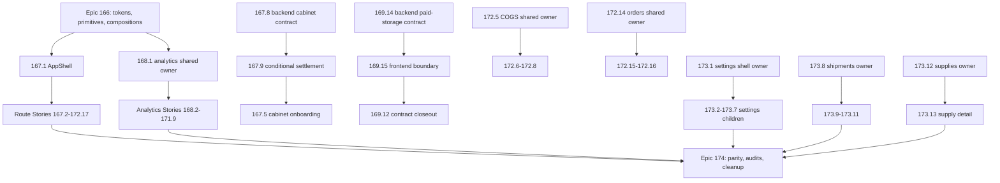
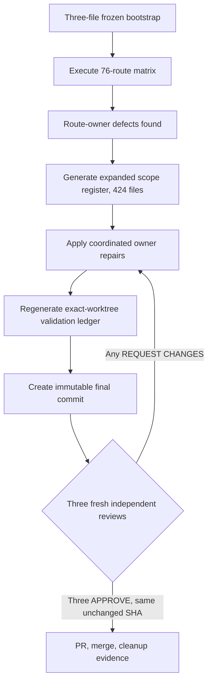

# Migration Program (Epics 166-174)

This page is the canonical wiki home for the shadcn full-UI migration **program**: the master plan, the story pipeline, the current status ledger, and the handoff/orchestration process. Per-story migration status lives here (not in `design-system.md` or `quickstart.md`) so status churn is isolated from stable conventions. See [/openwiki/conventions-and-quality.md](/openwiki/conventions-and-quality.md) for coding standards and [/openwiki/design-system.md](/openwiki/design-system.md) for the token/component layers this program delivers.

## Program goal and invariants

The master plan (`.omx/plans/shadcn-full-ui-migration-master.md`) migrates the entire frontend presentation layer to the approved shadcn/ui semantic design system, one BMAD Story at a time, **preserving** backend contracts, calculations, query keys, mutation behavior, URLs/search parameters, authentication, cabinet context, Russian localization, and formatting semantics. The only approved contract exceptions are Story 167.8 (cabinet session reconciliation/create-idempotency) and Story 169.14 (paid-storage import lifecycle/result), both executed in the backend repository; no other story inherits either exception.

Program completion requires: exactly 94 stories with matching OMX plans and completion evidence, all 76 `page.tsx` routes verified exactly once via the route ledger, legacy presentation removed only after its last consumer migrates, and every temporary feature worktree and branch removed after merge. Production/deployment work and CI gates are explicitly out of scope; local validation is the merge gate.

Key structural rules:

- **Layering**: semantic tokens → generic shadcn primitives → product compositions → domain-shared components → route-owned UI trees. `src/components/ui/**` stays generic and is forbidden territory for route stories.
- **Ownership**: every file consumed by two or more routes has exactly one upstream owner story (e.g. 172.5 owns single-COGS presentation for 172.6–172.8; 172.14 owns order-shared presentation for 172.15–172.16; 173.1 owns the settings shell; 173.8 owns shipment-shared presentation for 173.9–173.11; 173.12 owns supply-shared presentation for 173.13). Forbidden shared files (`package.json`, `src/components/ui/**`, `src/hooks/**`, `src/lib/**`, `src/types/**`, `src/stores/**`, AppShell, `analytics/shared/**`) require stop-and-escalate, never direct edits.
- **DAG over numbering**: story numbers are identities, not a universal execution order. Correct-course prerequisites (e.g. 167.8 → 167.9 → 167.5 before 167.6/167.7; 169.14 → 169.15 → 169.12 closeout; owner stories before consumers) override numeric order. The standing operator policy is sequential execution: numeric order 173.2 → 173.13 → 174.1 → 174.5 is safe and satisfies the DAG. Epic 174 starts only after Epics 166–173 are complete.

## Status ledger (verified 2026-08-31, PR #372)

| Epic | Scope | Progress | Status |
|---|---|---|---|
| 166 foundation | 8 stories | 8/8 | **CLOSED** (tokens, primitives, compositions, contracts) |
| 167 AppShell/auth | 9 stories | 9/9 | **CLOSED** |
| 168 analytics core | 11 stories | 11/11 | **CLOSED** (hub + 10 routes) |
| 169 operational analytics | 15 stories | 15/15 | **CLOSED** (169.14 → 169.15 → 169.12 contract-closeout chain; 169.13 via PR #232) |
| 170 advertising/brand/search | 7 stories | 7/7 | **CLOSED** (PRs #237-#250) |
| 171 AI/forecast/models | 9 stories | 9/9 | **CLOSED** (PRs #252-#270) |
| 172 business workspace | 17 stories | 17/17 | **CLOSED** — 172.10 Finances & Documents (#308/#309), 172.11 Monitor (#311/#312), 172.12 Monitoring Operations Console (#315), 172.13 Moysklad workspace (#317), 172.14 Orders Overview (#319), 172.15 FBO Orders (#321), 172.16 Order Integrity (#323), 172.17 Product Management (#325, includes Epic-172 retrospective) |
| 173 settings/shipments/supplies | 13 stories | **13/13** | **CLOSED** — settings 173.1–173.7 (#328–#348), shipments 173.8 (#350/#351 + auxiliary #352, no residue), 173.9 (#353/#354 + auxiliary #355, fully historical), 173.10 Shipment Box Types (#356/#357, 17 files, visible units/44px targets), 173.11 SKU Packaging (#359/#360, 24 files, strict integer/single-bulk-delete payloads), 173.12 Supplies List owner (#361, WCAG solid-pair badge canon after a 4.06:1 axe catch), 173.13 Supply Detail (#365/#366 + auxiliary #367, fully historical; full floor 19,874/0/1255) |
| 174 consolidation | 5 stories | **2/5 done, 174.3 in remediation** | **IN PROGRESS** — 174.1 parity done (feature #369 `4c930a9d`/`360c9cb9` + closeout #370 `0492403d`/`fbdab2da` + lifecycle #371 `9f792044`/`e7d438ce`); 174.2 legacy removal + design-system boundary done (PR #372 on base `fbdab2da`: 65 proven-dead files deleted, −13,022 lines, boundary ratchet 523); 174.3 inclusive a11y/visual verification **implementation + exact-worktree validation complete, blocked on the immutable three-APPROVE review gate** (status `in-progress-remediation`) → then 174.4 functional/backend regression → 174.5 docs, verified routes (76/76), cleanup proof |

**Program readiness: 91 of 94 canonical stories complete** (all 76 route-owning stories implemented; Stories 174.3–174.5 remain). Recorded full-suite Vitest floor after 174.2: **19,118 passed / 0 failed across 1,234 files**. That floor is an exact **downward** move from 19,874/1,255 (post-173.13): 174.1 shipped a main-RED (its plan required no full vitest run, leaving main at 19,873/1) which 174.2 fixed as a carry-in (vitest.config.ts exclude + `playwright-static-boundary.ts` SELF_TEST_MODULES for the parity node:test suite), and 174.2 then deleted 756 tests across 22 proven-dead test files together with their production owners (import-closure proved per file, reviewer-verified) — no live test was deleted. `origin/main` advanced through PR #372 (Story 174.2) atop base `fbdab2da` (174.1 closeout #370 + lifecycle #371). All 76 route-ledger rows intentionally remain `planned`: Story 174.1 validated ownership and evidence without changing implementation state, and Story 174.5 owns the final transitions to `verified`.

Epic 173 closed 13/13: 173.1 owns the settings shell (children 173.2–173.7 never edited it); 173.8 owns shipment-shared presentation for 173.9–173.11; 173.12 owned supply-shared presentation for 173.13, including the 18-file `DETAIL_EXCLUDED` load-bearing guard catalog proving the list equals the exact transitive import closure of `[id]/page.tsx`. APIs, hooks, query keys, types, calculations, authentication, cabinet context, URLs/search parameters, mutation semantics, cache behavior, and backend contracts remain behavior-preservation surfaces unless an exact story explicitly owns a change.

### Epic 174 consolidation chain

Epic 174 is sequential and started only after all 13 Epic 173 stories merged with lifecycle cleanup/evidence complete; frontmatter wording such as `ready-for-execution` never overrides a plan's prerequisite DAG.

1. **174.1 parity — DONE** (`scripts/check-shadcn-migration-parity.mjs`): proves schema-v3 parity 94 BMAD stories = 94 OMX plans and 76 source routes = 76 ledger rows = 76 unique route-owning stories = 76 unique linked implementation artifacts, including App Router route-group normalization and the exact backend exceptions 167.8/169.14. It is dependency-free and filesystem-only, runs a 33-test deterministic `node:test` mutation suite (deep-cloned real corpus; asserts exact `{ code, identity }` failure records for missing/orphan/duplicate/title/evidence/status/repository/prerequisite/route/artifact defects) before validating the canonical corpus, and emits one machine-readable report plus one human summary from the same run/base SHA. Backend Git corroboration is labeled `PASS(historical+local+cached)` with live remote proof honestly `unavailable` (DNS). It did **not** flip ledger rows to `verified` — 174.5 owns those transitions.
2. **174.2 legacy removal + boundary enforcement — DONE** (PR #372): 65 proven-dead files deleted (−13,022 lines) across six executor waves with per-file import-closure proof, the complete lib-wave (§3.1 of the 2026-08-30 team handoff: wb-status trio → solid status pairs, monitoring `STATUS_COLORS`, `getMarginColor` dedupe to canonical 168.3 tiers, orders/liquidity/supply-planning helpers), the 171.9 carry-outs ×5, `SUPPLY_STATUS_CONFIG` whole-file delete, and the C2/C3/C4/C10/C16 families. It also added the bounded design-system boundary enforcement described below.
3. **174.3 inclusive visual/theme/responsive/a11y proof — IN PROGRESS (implementation and exact-worktree validation complete; reviews pending)** — see the dedicated section below. Scope now covers the 76-route inclusive visual matrix (the canonical twelve-state ledger taxonomy across light+dark themes, six widths, 200% real browser-UI zoom, reduced motion, keyboard/focus, reading/heading order, non-color data meaning, axe WCAG 2 A/AA/2.2 AA at 390px and 1280px), the remediation of the RED→GREEN product defects the executable matrix discovered, and the fail-closed execution-manifest evidence pipeline. The **three-review remediation gate** blocks merge until three fresh independent reviewers return `APPROVE` on one unchanged final commit SHA with zero unresolved P0–P2 and no material P3; any content change invalidates all approvals and restarts the gate. Automated axe alone is never sufficient; unavailable environments (real VoiceOver/NVDA/JAWS/TalkBack) are recorded as gaps, never passes. 174.1 and 174.2 are done; all 76 route-ledger rows intentionally remain `planned` until Story 174.5 owns the `verified` transitions.
4. **174.4 full functional/backend-contract regression** — full local unit/integration/E2E against the approved local environment, including mandatory credentialed E2E (credentials in-memory only, never printed or persisted); owner of the 13 bisect-proven pre-existing liquidity (×12) and monitor weekly-chart (×1) e2e failures on clean main; a missing environment blocks completion.
5. **174.5 final documentation and cleanup** — verified routes only with complete linked evidence, delivery manifest/retrospective/cleanup report, every exception resolved or owner-accepted, finishing at 94/94 stories, 76/76 verified routes, zero completed migration branches/worktrees, no deploy action.

### Validator scripts and baselines

Two enforcement scripts now guard the program, each with a committed plain-text baseline:

- `scripts/check-shadcn-migration-parity.mjs` (Story 174.1) — BMAD/route-ledger/OMX plan parity; self-suite `scripts/__tests__/check-shadcn-migration-parity.test.mjs` (33/33). Canonical GREEN: 94 = 94, 76 = 76 = 76, epic counts 166:8 … 174:5, errors 0.
- `scripts/check-shadcn-ui-boundary.mjs` (Story 174.2) — node-stdlib-only scanner over production `src/**/*.{ts,tsx}` (tests, d.ts, `src/test/**` excluded; relative-first enumeration so foreign worktree paths cannot re-enter), detecting the extended `LEGACY_PALETTE` regex and 3-branch `CONTEXTUAL_HEX` canon. Its ratchet baseline `scripts/.shadcn-ui-boundary-baseline.txt` = **523**: a plain run exits 0 at ≤ 523 counted violations and fails only on increase ("registered" = baseline-grandfathered, locale-percent precedent); 24 matches in 4 files are suppressed by the `BOUNDARY_EXCEPTIONS` register (single source of truth, mirrored 1:1 by the manifest). Self-suite 10/10. The companion classification manifest `_bmad-output/planning-artifacts/shadcn-ui-boundary-classification-manifest.md` is arithmetic-closed: 514 (cat-1 live residue in 59 files) + 1 (cat-2) + 8 (cat-6 counted false positives) = 523; 65 cat-4 deletions and 11 cat-3 resolved files are listed.
- The docs-citation gate `check:docs` tracks its own historical baseline `scripts/.check-docs-baseline.txt` (95 committed entries, one per line, `--update-baseline` only with NEW/RESOLVED analysis in the commit message); Story 174.1 passed `check:docs` with 427 citations against that unchanged baseline.

Live per-story history: `_bmad-output/implementation-artifacts/sprint-status.yaml`. Consolidated per-epic slice: `_bmad-output/planning-artifacts/shadcn-migration-status-and-debt-registry.md` (snapshot 2026-08-31, updated at each orchestrator closeout; treat the repo as truth on drift).

## Story 174.3: the inclusive visual matrix and its evidence pipeline

Story 174.3 (`in-progress-remediation`, branch `cdx/epic-174-story-3-inclusive-visual-verification`, plan `.omx/plans/174.3-complete-accessibility-responsive-theme-and-visual-verification.md`) is the program's assurance story for accessibility, responsive, theme, and visual verification. Its canonical state taxonomy is the twelve-state matrix **default/loading/refresh/empty/filtered-empty/error/stale/partial/permission/pending/partial-success/not-found** applied to all 76 ledger routes (76 × 12 = 912 materialized route/state rows: 444 exact executed, 468 explicit route-specific not-applicable, 0 blocked, plus 76 canonical Story-runner defaults, 318 owner-unit and 50 owner-browser executable rows across 154/21 unique sources). The title-token fallback was deleted: absence of a substring can never become N/A, and every declared executable scenario must resolve exactly once.

### Three-review remediation gate and the expanded scope register

Commit `82465fbf96f2319116c1cad101044e8004a52cc3` received three independent `REQUEST CHANGES`/`REJECT` verdicts; subsequent candidates `633f202b`, `7e41cc96`, and `f8cbaba2` were also rejected by independent reviews (findings included focusable native table rows, incorrectly N/A-declared model-evaluation features, pointer-only row `onClick`, retained raw browser diagnostics under `.playwright-cli/`, and raw API-derived error text on the finance-history terminal state — all closed). Merge is blocked until every accepted finding is repaired, validation is regenerated, a new immutable commit is created, and three fresh independent reviewers all return `APPROVE` for that same unchanged SHA; any content change invalidates all previous approvals and restarts the gate.

The story began with a frozen three-file bootstrap (`e2e/shadcn-migration-visual-accessibility.spec.ts`, `e2e/fixtures/story-174-3-visual-accessibility.ts`, the delivery record), but the live matrix found concrete route-owner defects, so the scope legitimately expanded. The **generated** register `_bmad-output/implementation-artifacts/174-3-expanded-scope-register.md` — produced by `scripts/generate-story-174-3-scope-register.mjs` from the exact `origin/main` comparison plus current untracked Story files and regenerated before freeze (path drift is a review blocker) — is now the **current file-level coordination authority**, not the historical three-file bootstrap. It enumerates 424 files across coordination classes: `route-owner-remediation` (335 files, ledger route owner + 174.3), `story-evidence` (46), `owner-browser-evidence` (15), `shared-owner-remediation` (15), `foundation-appshell-coordination` (5), `repository-validation` (3), `delivery-record` (2), `story-support` (2), and `remediation-plan` (1). All product/shared entries are coordinated, contract-preserving repairs that add no dependency; no backend, deployment, production, force-push, or direct-`main` operation is admitted.

The 174.3 remediation/evidence flow: the frozen bootstrap executes the canonical matrix, discovered defects expand the register, repairs regenerate validation, and only three same-SHA `APPROVE` verdicts unblock merge.

### Execution-manifest pipeline (fail-closed)

The evidence backbone is `e2e/fixtures/story-174-3/execution-manifest.ts` plus `scripts/lib/story-174-3-manifest.mjs`, with contract tests in `src/test/story-174-3-*.test.ts` enforcing the manifest, state, surface, and manual-evidence contracts:

- **Types**: `Story1743RequiredExecution` is `{ source, sourceSha256, scenarioId, runner: 'vitest' | 'playwright' }`; manifest entries extend it with `command`, `result: 'passed' | 'failed' | 'skipped'`, `exitCode`, `startedAt`, `durationMs`; the manifest carries `schemaVersion: 1`, `generatedAt`, and a `runtime { node, npm }` block.
- **Reader (`scripts/lib/story-174-3-manifest.mjs`)**: `readStory1743Manifest` returns an empty manifest only for a true `ENOENT`, and `validateStory1743Manifest` rejects malformed JSON, unsupported schema, missing runtime metadata, duplicate entries, and every malformed field class — each entry must have a 64-hex-character `sourceSha256`, a supported runner/result, a non-empty command, an integer exit code, a valid ISO timestamp, and a non-negative duration.
- **Indexer (`indexStory1743ExecutionManifest` in `execution-manifest.ts`)**: keys results by `(source, scenarioId)`; for every required execution it fails on missing entries, stale source hashes, runner mismatches, non-`passed` results or non-zero exit codes, and incomplete runner metadata. With `requireExactSet: true` the merge-ready gate additionally rejects **surplus** entries (stale, failed, skipped, nonexistent-source, obsolete-scenario, unknown) — exact key-set equality with the canonical owner plus default-route execution union — while recording mode remains explicitly partial.
- **Requirements extraction (`scripts/lib/story-174-3-execution-requirements.mjs`)**: `story1743ExactOwnerExecutions` parses the owner declaration sources (state/owner-evidence/surface-contract/chart/table/dedicated-route scenario fixtures) with the TypeScript compiler, accepts only literal `source`/`scenarioId`/runner arguments in the `bind`/`binding`/`scenario` helper calls, rejects conflicting runners, and computes a SHA-256 of each source file so the committed manifest is pinned to exact content. The runner spec plus the route ledger drive `story1743MergeReadyExecutions`.
- **Contract tests**: `src/test/story-174-3-state-contract.test.ts` (route/state dispositions, owner reconciliation, explicit N/A clauses, merge-ready execution indexing), `story-174-3-surface-contract.test.ts` (76 route surface contracts: overlays 83 executed / 15 N/A, tables 42/21, charts 13/4, table/chart features 292 executed / 331 N/A, all conditional branches fail closed), `story-174-3-manifest-reader.test.ts` (every fail-closed reader branch), and `story-174-3-manual-evidence-contract.test.ts` (the immutable operator-driven manual ledger `e2e/fixtures/story-174-3/manual-evidence.ts`).

The committed `e2e/fixtures/story-174-3/execution-manifest.json` recorded 770 passed entries (627 Vitest / 143 Playwright, including the 76 canonical defaults and 4 dedicated-route executions) and 0 failed in the final validation ledger, alongside full Vitest 19,355/19,355 across 1,270 files, the canonical Story runner (82 passed / 1 optional Manager skip), owner-browser regeneration (368 passed / 22 accepted skips), real browser-UI 200% zoom for all 76 routes × both themes, and the 70/70-page production build.

### What the matrix verifies and its honesty rules

Every final route run covers light and dark themes at 320/390/768/1024/1280/1440 CSS pixels, `prefers-reduced-motion: reduce`, body-scoped WCAG 2 A/AA/2.2 AA axe at both 390px and 1280px, a nonzero measured contrast set validated against axe's applicable thresholds, route/surface geometry, computed theme tokens (light/dark root/body signatures must differ), reading/heading order (exactly one route-specific visible `h1` before the first semantic data surface; `/`, `/login`, `/register` are explicit redirectors), table/chart semantics, and visible keyboard focus. Zero focusable native table rows is a canonical invariant: pointer-only row convenience may stay, but keyboard activation belongs to named native buttons. True 200% zoom is executed through real browser-UI shortcuts on headed Chromium, proving the doubled device-pixel ratio and bounded geometry.

Authenticated screenshots, videos, traces, ARIA snapshots, and raw attachments are prohibited; evidence is privacy-safe DOM/accessibility/geometry/computed-style data only, and `e2e/.auth/user.json`, `test-results/`, `playwright-report/`, and `.playwright-cli/` must be deleted after final validation without reading their contents. The operator-driven manual ledger records Codex-App browser-operator sessions (never conflated with automated results or human AT review); real VoiceOver/Safari, NVDA/JAWS, and TalkBack remain explicit environment-capability gaps (`ENV-WEBKIT-TAB` style records), and unavailable environments are never relabeled as passes.

## The Story 173.1 settings-shell pattern

Story 173.1 (Settings Shell and Overview) established the reusable owner pattern for the settings family: a **static overview page** plus a **shared seven-route settings shell** consumed by the child settings stories (173.2–173.7), with a desktop grid layout and a compact Sheet for narrow viewports, and role-aware **restricted/current states** carrying Owner/non-Owner semantics. It was delivered in an exact six-file manifest (focused 2/22, settings 17/217, full floor 19,489/0). The child settings stories shipped through it without touching the shell: 173.2 Backfill (17 files, dual-pipeline status, guarded pending trigger), 173.3 Cabinet (12 files, fail-closed unknown Jam tier), 173.4 Expenses (9 files, pending-safe CRUD overlays), 173.5 Notifications (28 files, Telegram binding lifecycle, quiet-hours validation), 173.6 Tariffs (29 files, nested-tier validation, controlled dirty state), and 173.7 Tax (11 files, same-cabinet draft preservation, cross-cabinet isolation), each with its own exact manifest, feature + closeout PR pair, and full-floor advance. Their migrated routes live under `src/app/(dashboard)/settings/*`; 173.8's shipments list and 173.9's shipment detail migrated routes live under `src/app/(dashboard)/shipments/*`.

Its known gap is debt item **C18**: the credentialed non-Owner restricted-navigation visual (Manager/Analyst/Service × Tariffs/Import, desktop + compact Sheet, both themes) was not captured because optional Manager credentials are not configured. The semantic proof is deterministic in Vitest; a Manager screenshot must not be claimed without a real credentialed run. C18 is carried out to Story **174.3** (visual/a11y), together with browser/theme/responsive evidence for other lanes.

## Story pipeline: FULL / MINOR / born-clean

Every story follows a unified A–J pipeline, but its **verdict class** is decided by an explicit compliance count (palette + raw hex + `py-6` occurrences across the owned surface, counted with literal paths because zsh does not word-split `$VAR`):

- **NO-OP** — everything already implemented; close with evidence only.
- **MINOR-GAP** (≤10 files) — orchestrator edits directly; typically token/class swaps, captions, `tabular-nums`.
- **MINOR born-clean** — the route was born already token-clean; only guard tests and contract gaps (captions, tabular numerals, paddings) are added.
- **FULL / FULL-lite** — legacy palette-heavy surfaces; executed in executor "waves" of ~30 non-overlapping files, with targeted Vitest after each wave. 172.1 (Business Dashboard, 127 files, 4 waves) is the FULL reference; 172.5 is the FULL-lite owner reference including the import-closure audit canon; 172.14 is the FULL owner-story reference for the shared orders family (29 modified files + guard, cross-restraint 0-import proof).

Pipeline stages, in order: **A** plan + pre-flight (registry carry-in grep by story ID; reconnaissance written to a file, never held in context) → **B** worktree + behavior-lock (branch/worktree names come from the story plan; targeted baseline N/M) → **C** compliance count + import-closure pre-scan (BFS from entry points; every live file in the closure goes into the future guard catalog) → **D** edits (waves or direct) → **E** guard tests (pinned per-file catalog, no-palette/no-hex regexes, contract pins for caption/tabular/valence/badge idioms) → **F** validation gates → **G** adversarial review (reviewer ≠ author, fresh context, diff attached as `/tmp/<story>-review-diff.txt`, import-closure audit mandatory) → **H** fixes → **I** commit/PR/merge/cleanup → **J** closeout (story artifact, sprint-flip, registry, handoff §0, CLAUDE.md floor — one closeout PR).

Validation gates per PR (unpiped exit codes; Node 24.18.0 — system Node 26 breaks webpack builds): full Vitest ≥ floor with 0 failed, ESLint 0 errors/0 warnings, `tsc` 0, `check:max-lines` (source ≤200, test ≤800 lines), `check:docs` exit 0, locale-percent ratchet, lessons-length ≤120 chars, `next build --webpack`, and Playwright e2e 0 failed via the npm wrapper (the wrapper injects orders+auth setup, so attest test counts by decomposition).

## OMC story-worktree orchestration and handoff lineage

Handoff lineage (each superseding the previous as the execution entry point; older files remain only as historical process evidence):

1. `docs/HANDOFF-2026-08-27-CROSS-TEAM-OMC-ORCHESTRATOR-172-8-CONTINUATION.md` — cross-team OMC continuation canon (delegation matrix, gates, accumulated lessons). **Now superseded operationally**: it contains obsolete Story 172.12 execution instructions and a known plaintext test-credential exposure (open debt SEC-DOC-1 until a review-safe security remediation), so it must not be used as an execution entry point.
2. `docs/ORCHESTRATOR-PROMPT-2026-08-28-V11-HANDOFF-SUPERVISOR-OMC.md` — supervisor control loop (V11); V10 remains the extended delegation-conveyor reference.
3. `docs/HANDOFF-2026-08-29-EPIC-173-174-FULL-MIGRATION-AND-DEBT.md` — the deep process canon (19 sections: story lifecycle §7, UX contracts §8, ownership/forbidden §9, gates §10, and the complete debt register §11 — FE-D1…D9, C1–C17, contrast families, process debt). **Superseded as the continuation entry point** by the 2026-08-30 team handoff, but still mandatory reading for its canonical registers.
4. `docs/HANDOFF-2026-08-30-TEAM-HANDOFF-173.13-EPILOGUE-174-FULL-DEBT.md` — **current continuation entry point** (updated 2026-08-31 with the 173.13/174.1/174.2 closeouts): executive snapshot of remaining work (174.3 → 174.4 → 174.5), reading order, the consolidated debt additions of waves 172.10–172.17/173.12 (lib-wave, dead code, tint-audit, discovered-not-executed evidence, baseline/process debt), the parallel-team protocol, and live main gates after 174.2 (Vitest ≥ 19,118/0/1,234; lint 0/0; tsc 0; ui-boundary ratchet 523; locale-percent 4). Priority on conflict: story plan → the 08-29 process canon → this team handoff → `CLAUDE.md` baselines → live registries, with live source + passing behavior-locking tests always the final arbiter; drift is corrected through a reviewable documentation lane, never by silently picking convenient text.

Worktree hygiene, summarized:

- One story = one branch `cdx/epic-{epic}-story-{story}-{slug}` = one temporary worktree at an explicit validated path (`/private/tmp/wb-repricer-fe-...`), created from current `main` only after prerequisites merge; never reuse a stale branch or another story's worktree. The standing operator policy is sequential execution; numeric order is safe and satisfies the DAG.
- Subagents never commit/push/merge — git operations belong exclusively to the orchestrator; each wave of a story runs in the single story worktree with non-overlapping file lists.
- Every Agent call in this environment requires an explicit model tier (`opus`/`sonnet`/`haiku`); defaults are executor=sonnet (opus for hard edits), code-reviewer=opus, explore/verifier/writer=sonnet.
- Mandatory cleanup is completion evidence, not housekeeping: PR merged with `--match-head-commit` identity fences, exact recorded PR number, remote branch deleted via exact-old-SHA lease, worktree removed, `git worktree prune`, verified 0/0/0 (remote/local/worktree) and primary checkout in sync. Story 173.1 proved exact cleanup for both its feature and closeout lanes, 173.8 and 173.9 through all three lanes (feature/closeout/auxiliary, no residue), 173.13 through feature + exact-five docs + auxiliary (#365/#366/#367), 174.1 through feature + exact-five closeout (#369/#370) plus lifecycle PR #371, and 174.2 through feature PR #372 (remote+local branch absent, worktree removed, prune ran); the audits recorded 0/0/0 across all completed Epic 172–174.2 lanes.

Cross-team cautions: parallel teams/sessions are real (PRs #295/#296/#300/#301 landed on top of other sessions' PRs; a mid-flight 172.10 collision was resolved by the owner absorbing the parallel delta and re-running the full pipeline). Never touch foreign worktrees; on a mid-flight conflict for the NEXT story, take the next unclaimed story per the registry instead of duplicating. Registry/handoff vs repo drift resolves in favor of the repo, corrected in the next closeout commit.

## Carry-out debt registry

Route migrations may leave wave-scoped carry-outs recorded in the registry and sprint status rather than blocking the story; they land in later stories:

- **Landed in 174.2**: the 172.12 monitoring-console carry-outs (dead Telegram trio, `STATUS_COLORS`, `getMarginColor` dedupe); the 171.9 carry-outs ×5 (`STATUS_BADGE_CONFIG.className` → route-local `MODEL_LIST_BADGE_CLASS`, stale-comment rewrites, 171.6 guard re-pins + anchor-hardening); the full lib-wave; `SUPPLY_STATUS_CONFIG` dead twin; C2/C3/C4/C10/C16 and the `/80`-on-text reconciliation in MarginCard/GrossMarginCard.
- **Landed in 174.1**: route-ledger status reconciliation for all 76 routes (validated, statuses intentionally unchanged); the dead `SUPPLY_STATUS_CONFIG` twin in `src/types/supplies/helpers.ts` was routed onward to 174.2 and deleted there.
- **In execution → 174.3**: C18 credentialed non-Owner visual gap (see the settings-shell section above); the consolidated visual/theme/responsive matrix and the §3.3 tint-audit; discovered-but-not-executed Playwright evidence (173.5: 40 tests; 173.6: 81 file-level; 173.7: 99 file-level; 172.8 dynamic-Playwright; missing `e2e/orders-fbo.spec.ts`); repo-wide text-`/80` sweep (pricing/automation/cashflow/popover families + hover variants — scanner-extension candidate). Story 174.3's expanded scope register absorbs the route-level share of these as coordinated `route-owner-remediation`/`owner-browser-evidence` entries; real assistive-technology environments remain recorded gaps, never passes.
- **Still open → 174.4**: credentialed functional E2E for 169.9 corrective journeys (credentials in-memory only, never printed or stored); 13 bisect-proven pre-existing liquidity/monitor e2e failures on clean main `fbdab2da`.
- **Still open → 174.5**: baseline/process debt — `check:docs` 95-entry baseline acceptance discipline, 39 pre-existing `format:check` warnings, always deriving the CLAUDE.md floor from a live run.
- The standing FE-debt table (FE-D1…FE-D9), wave carry-outs C1–C18, BE-debt (TD-S2b, TD-P8, legacy test-api ×42), and contrast escalations live in `_bmad-output/planning-artifacts/shadcn-migration-status-and-debt-registry.md` (snapshot 2026-08-31), cross-referenced against the 2026-08-30 team handoff §3.

## The 169 paid-storage lane (cross-repository exception)

Story 169.14 established the authoritative paid-storage import lifecycle/result contract in the **backend** repository: BullMQ `waiting | delayed | prioritized | waiting-children` map to wire `pending`, `active` maps to `processing`, terminal states keep their meanings, and BullMQ `unknown` fails closed as wire `failed` with sanitized `UNKNOWN_QUEUE_STATE` detail. Story 169.15 aligned the shared frontend boundary and may use a frontend-only `unknown` sentinel solely for an unrecognized backend wire value. Story 169.12's route presentation had merged early (PR #227) and was only closed after the 169.14 → 169.15 chain validated the route (contract-closeout lane PRs #299/#304), closing Epic 169 at 15/15.

This lane carries unusually strict evidence machinery (serialized single-leader lifecycle, mode-600 review-bootstrap and record-retirement transactions, payload-hash-verified RED/reviewer/manifest evidence re-read from trusted history, and a suffix-aware secret scan rejecting credential families across `=`, `:=`, `+=`, `-=`, `?=`, `&&=`, `||=`) because it is the only authorized cross-repository contract change; see the plans `169.14-establish-authoritative-paid-storage-import-lifecycle-and-result-contract.md` and `169.15-align-shared-frontend-paid-storage-import-boundary.md` under `.omx/plans/` for the executable detail. For frontend stories, the practical takeaway is: the paid-storage wire contract above is authoritative, and no other story may touch backend contracts.
