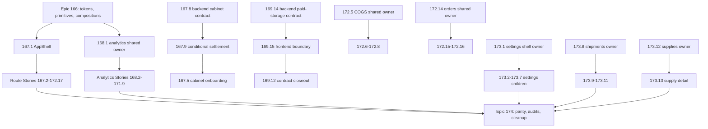

# Migration Program (Epics 166-174)

This page is the canonical wiki home for the shadcn full-UI migration **program**: the master plan, the story pipeline, the current status ledger, and the handoff/orchestration process. Per-story migration status lives here (not in `design-system.md` or `quickstart.md`) so status churn is isolated from stable conventions. See [/openwiki/conventions-and-quality.md](/openwiki/conventions-and-quality.md) for coding standards and [/openwiki/design-system.md](/openwiki/design-system.md) for the token/component layers this program delivers.

## Program goal and invariants

The master plan (`.omx/plans/shadcn-full-ui-migration-master.md`) migrates the entire frontend presentation layer to the approved shadcn/ui semantic design system, one BMAD Story at a time, **preserving** backend contracts, calculations, query keys, mutation behavior, URLs/search parameters, authentication, cabinet context, Russian localization, and formatting semantics. The only approved contract exceptions are Story 167.8 (cabinet session reconciliation/create-idempotency) and Story 169.14 (paid-storage import lifecycle/result), both executed in the backend repository; no other story inherits either exception.

Program completion requires: exactly 94 stories with matching OMX plans and completion evidence, all 76 `page.tsx` routes verified exactly once via the route ledger, legacy presentation removed only after its last consumer migrates, and every temporary feature worktree and branch removed after merge. Production/deployment work and CI gates are explicitly out of scope; local validation is the merge gate.

Key structural rules:

- **Layering**: semantic tokens → generic shadcn primitives → product compositions → domain-shared components → route-owned UI trees. `src/components/ui/**` stays generic and is forbidden territory for route stories.
- **Ownership**: every file consumed by two or more routes has exactly one upstream owner story (e.g. 172.5 owns single-COGS presentation for 172.6–172.8; 172.14 owns order-shared presentation for 172.15–172.16; 173.1 owns the settings shell; 173.8 owns shipment-shared presentation for 173.9–173.11; 173.12 owns supply-shared presentation for 173.13). Forbidden shared files (`package.json`, `src/components/ui/**`, `src/hooks/**`, `src/lib/**`, `src/types/**`, `src/stores/**`, AppShell, `analytics/shared/**`) require stop-and-escalate, never direct edits.
- **DAG over numbering**: story numbers are identities, not a universal execution order. Correct-course prerequisites (e.g. 167.8 → 167.9 → 167.5 before 167.6/167.7; 169.14 → 169.15 → 169.12 closeout; owner stories before consumers) override numeric order. The standing operator policy is sequential execution: numeric order 173.2 → 173.13 → 174.1 → 174.5 is safe and satisfies the DAG. Epic 174 starts only after Epics 166–173 are complete.

## Status ledger (verified 2026-08-29, PR #329)

| Epic | Scope | Progress | Status |
|---|---|---|---|
| 166 foundation | 8 stories | 8/8 | **CLOSED** (tokens, primitives, compositions, contracts) |
| 167 AppShell/auth | 9 stories | 9/9 | **CLOSED** |
| 168 analytics core | 11 stories | 11/11 | **CLOSED** (hub + 10 routes) |
| 169 operational analytics | 15 stories | 15/15 | **CLOSED** (169.14 → 169.15 → 169.12 contract-closeout chain; 169.13 via PR #232) |
| 170 advertising/brand/search | 7 stories | 7/7 | **CLOSED** (PRs #237-#250) |
| 171 AI/forecast/models | 9 stories | 9/9 | **CLOSED** (PRs #252-#270) |
| 172 business workspace | 17 stories | 17/17 | **CLOSED** — 172.10 Finances & Documents (#308/#309), 172.11 Monitor (#311/#312), 172.12 Monitoring Operations Console (#315), 172.13 Moysklad workspace (#317), 172.14 Orders Overview (#319), 172.15 FBO Orders (#321), 172.16 Order Integrity (#323), 172.17 Product Management (#325, includes Epic-172 retrospective) |
| 173 settings/shipments/supplies | 13 stories | **1/13** | **IN PROGRESS** — 173.1 settings shell + overview shipped (feature PR #328 / `3c560ed2`, closeout PR #329 / `7bec65fd`) with exact cleanup proved; **NEXT = 173.2 Backfill Settings**; remaining owners 173.8 shipments and 173.12 supplies |
| 174 consolidation | 5 stories | 0/5 | final; strictly after 166-173 (174.2 design-system/source-boundary/contrast; 174.3 visual/a11y; 174.4 functional/backend) |

**Program readiness: 77 of 94 canonical stories complete** (17 remain: 12 in Epic 173, 5 in Epic 174). Recorded full-suite Vitest floor after 173.1: **19,489 passed / 0 failed / 0 skipped across 1,229 files** (a fresh pinned-runtime full-suite rerun; the floor grows only by exact +N per story). `origin/main` = `7bec65fd` (Story 173.1 closeout merge); 0 open PRs; 0 local branches / 0 remote branches / 0 temporary worktrees for all completed Epic 172–173.1 lanes. Route implementation: 64 route-owning stories complete, 12 Epic 173 routes remain; all 76 route-ledger rows stay `planned` until Story 174.1 validates ownership/evidence and Story 174.5 owns the final transitions to `verified`.

Live per-story history: `_bmad-output/implementation-artifacts/sprint-status.yaml`. Consolidated per-epic slice: `_bmad-output/planning-artifacts/shadcn-migration-status-and-debt-registry.md` (snapshot 2026-08-29, updated at each orchestrator closeout; treat the repo as truth on drift).

## The Story 173.1 settings-shell pattern

Story 173.1 (Settings Shell and Overview) established the reusable owner pattern for the settings family: a **static overview page** plus a **shared seven-route settings shell** consumed by the child settings stories (173.2–173.7), with a desktop grid layout and a compact Sheet for narrow viewports, and role-aware **restricted/current states** carrying Owner/non-Owner semantics. It was delivered in an exact six-file manifest (focused 2/22, settings 17/217, full floor 19,489/0). Child settings stories must not silently edit the shell; they own only their route-exclusive UI and tests while preserving job/API semantics and the shared shell.

Its known gap is debt item **C18**: the credentialed non-Owner restricted-navigation visual (Manager/Analyst/Service × Tariffs/Import, desktop + compact Sheet, both themes) was not captured because optional Manager credentials are not configured. The semantic proof is deterministic in Vitest; a Manager screenshot must not be claimed without a real credentialed run. C18 is carried out to Story **174.3** (visual/a11y), together with browser/theme/responsive evidence for other lanes.

## Story pipeline: FULL / MINOR / born-clean

Every story follows a unified A–J pipeline, but its **verdict class** is decided by an explicit compliance count (palette + raw hex + `py-6` occurrences across the owned surface, counted with literal paths because zsh does not word-split `$VAR`):

- **NO-OP** — everything already implemented; close with evidence only.
- **MINOR-GAP** (≤10 files) — orchestrator edits directly; typically token/class swaps, captions, `tabular-nums`.
- **MINOR born-clean** — the route was born already token-clean; only guard tests and contract gaps (captions, tabular numerals, paddings) are added.
- **FULL / FULL-lite** — legacy palette-heavy surfaces; executed in executor "waves" of ~30 non-overlapping files, with targeted Vitest after each wave. 172.1 (Business Dashboard, 127 files, 4 waves) is the FULL reference; 172.5 is the FULL-lite owner reference including the import-closure audit canon; 172.14 is the FULL owner-story reference for the shared orders family (29 modified files + guard, cross-restraint 0-import proof).

Pipeline stages, in order: **A** plan + pre-flight (registry carry-in grep by story ID; reconnaissance written to a file, never held in context) → **B** worktree + behavior-lock (branch/worktree names come from the story plan; targeted baseline N/M) → **C** compliance count + import-closure pre-scan (BFS from entry points; every live file in the closure goes into the future guard catalog) → **D** edits (waves or direct) → **E** guard tests (pinned per-file catalog, no-palette/no-hex regexes, contract pins for caption/tabular/valence/badge idioms) → **F** validation gates → **G** adversarial review (reviewer ≠ author, fresh context, diff attached as `/tmp/<story>-review-diff.txt`, import-closure audit mandatory) → **H** fixes → **I** commit/PR/merge/cleanup → **J** closeout (story artifact, sprint-flip, registry, handoff §0, CLAUDE.md floor — one closeout PR).

Validation gates per PR (unpiped exit codes; Node 24.18.0 — system Node 26 breaks webpack builds): full Vitest ≥ floor with 0 failed, ESLint 0 errors/0 warnings, `tsc` 0, `check:max-lines` (source ≤200, test ≤800 lines), `check:docs` exit 0, locale-percent ratchet, lessons-length ≤120 chars, `next build --webpack`, and Playwright e2e 0 failed via the npm wrapper (the wrapper injects orders+auth setup, so attest test counts by decomposition).

## OMC story-worktree orchestration and handoff lineage

Handoff lineage (each superseding the previous as the execution entry point; older files remain only as historical process evidence):

1. `docs/HANDOFF-2026-08-27-CROSS-TEAM-OMC-ORCHESTRATOR-172-8-CONTINUATION.md` — cross-team OMC continuation canon (delegation matrix, gates, accumulated lessons). **Now superseded operationally**: it contains obsolete Story 172.12 execution instructions and a known plaintext test-credential exposure (open debt SEC-DOC-1 until a review-safe security remediation), so it must not be used as an execution entry point.
2. `docs/ORCHESTRATOR-PROMPT-2026-08-28-V11-HANDOFF-SUPERVISOR-OMC.md` — supervisor control loop (V11); V10 remains the extended delegation-conveyor reference.
3. `docs/HANDOFF-2026-08-29-EPIC-173-174-FULL-MIGRATION-AND-DEBT.md` — **current single continuation entry point** for Epics 173–174: authority hierarchy and mandatory reading order, git/worktree topology, per-story tables with exact branch/worktree names, the debt register, and Epic 174 assurance scope. Priority on conflict: live source + passing behavior-locking tests → exact story plan → canonical BMAD/route/UX artifacts → the handoff snapshot; drift is corrected through a reviewable documentation lane, never by silently picking convenient text.

Worktree hygiene, summarized:

- One story = one branch `cdx/epic-{epic}-story-{story}-{slug}` = one temporary worktree at an explicit validated path (`/private/tmp/wb-repricer-fe-...`), created from current `main` only after prerequisites merge; never reuse a stale branch or another story's worktree. The standing operator policy is sequential execution; numeric order is safe and satisfies the DAG.
- Subagents never commit/push/merge — git operations belong exclusively to the orchestrator; each wave of a story runs in the single story worktree with non-overlapping file lists.
- Every Agent call in this environment requires an explicit model tier (`opus`/`sonnet`/`haiku`); defaults are executor=sonnet (opus for hard edits), code-reviewer=opus, explore/verifier/writer=sonnet.
- Mandatory cleanup is completion evidence, not housekeeping: PR merged with `--match-head-commit` identity fences, exact recorded PR number, remote branch deleted via exact-old-SHA lease, worktree removed, `git worktree prune`, verified 0/0/0 (remote/local/worktree) and primary checkout in sync. Story 173.1 proved exact cleanup for both its feature and closeout lanes; the 2026-08-29 handoff audit recorded 0 open PRs and 0/0/0 for all completed Epic 172–173.1 lanes.

Cross-team cautions: parallel teams/sessions are real (PRs #295/#296/#300/#301 landed on top of other sessions' PRs; a mid-flight 172.10 collision was resolved by the owner absorbing the parallel delta and re-running the full pipeline). Never touch foreign worktrees; on a mid-flight conflict for the NEXT story, take the next unclaimed story per the registry instead of duplicating. Registry/handoff vs repo drift resolves in favor of the repo, corrected in the next closeout commit.

## Carry-out debt registry

Route migrations may leave wave-scoped carry-outs recorded in the registry and sprint status rather than blocking the story; they land in later stories:

- **172.12 monitoring console**: dead trio of unused exports, the `STATUS_COLORS` lib, `text-white` circles, and `role=listitem` semantics — swept in a later pass.
- **172.10 Finances & Documents**: route-ledger status reconciliation for all 76 routes → **Story 174.1**; Standard Turbopack build and live visual/axe/keyboard/real-SR not claimed (worktree-symlink gap) → **174.3**.
- **173.1**: C18 credentialed non-Owner visual gap → **174.3** (see the settings-shell section above).
- **171.9 handoff → 174.2 owner**: remove `className` from `STATUS_BADGE_CONFIG` after ModelListSection migrates to its own overlay; rewrite stale comments in `model-list-helpers.ts` / `evaluations-list-helpers.ts`; re-pin 171.6 status-token guards; anchor-harden the 171.6 guard (join-before-filter).
- The standing FE-debt table (FE-D1…FE-D9), wave carry-outs C1–C18, BE-debt (TD-S2b, TD-P8, legacy test-api ×42, `getMarginColor` dedup → 174.2), and contrast escalations → 174.2 (the `/15-chip` light-mode sub-AA family, the chart-colors-as-text rule — series colors only as fill/border, text on tints uses `var(--color-foreground)` — and `/80` weaker text) all live in `_bmad-output/planning-artifacts/shadcn-migration-status-and-debt-registry.md`. Credentialed functional E2E for 169.9 corrective journeys → **174.4** (requires explicit credential authorization; credentials in-memory only, never printed or stored).

## The 169 paid-storage lane (cross-repository exception)

Story 169.14 established the authoritative paid-storage import lifecycle/result contract in the **backend** repository: BullMQ `waiting | delayed | prioritized | waiting-children` map to wire `pending`, `active` maps to `processing`, terminal states keep their meanings, and BullMQ `unknown` fails closed as wire `failed` with sanitized `UNKNOWN_QUEUE_STATE` detail. Story 169.15 aligned the shared frontend boundary and may use a frontend-only `unknown` sentinel solely for an unrecognized backend wire value. Story 169.12's route presentation had merged early (PR #227) and was only closed after the 169.14 → 169.15 chain validated the route (contract-closeout lane PRs #299/#304), closing Epic 169 at 15/15.

This lane carries unusually strict evidence machinery (serialized single-leader lifecycle, mode-600 review-bootstrap and record-retirement transactions, payload-hash-verified RED/reviewer/manifest evidence re-read from trusted history, and a suffix-aware secret scan rejecting credential families across `=`, `:=`, `+=`, `-=`, `?=`, `&&=`, `||=`) because it is the only authorized cross-repository contract change; see the plans `169.14-establish-authoritative-paid-storage-import-lifecycle-and-result-contract.md` and `169.15-align-shared-frontend-paid-storage-import-boundary.md` under `.omx/plans/` for the executable detail. For frontend stories, the practical takeaway is: the paid-storage wire contract above is authoritative, and no other story may touch backend contracts.
