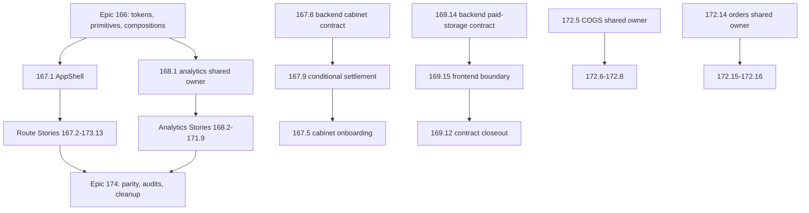

# Migration Program (Epics 166-174)

This page is the canonical wiki home for the shadcn full-UI migration **program**: the master plan, the story pipeline, the current status ledger, and the handoff/orchestration process. Per-story migration status lives here (not in `design-system.md` or `quickstart.md`) so status churn is isolated from stable conventions. See [/openwiki/conventions-and-quality.md](/openwiki/conventions-and-quality.md) for coding standards and [/openwiki/design-system.md](/openwiki/design-system.md) for the token/component layers this program delivers.

## Program goal and invariants

The master plan (`.omx/plans/shadcn-full-ui-migration-master.md`) migrates the entire frontend presentation layer to the approved shadcn/ui semantic design system, one BMAD Story at a time, **preserving** backend contracts, calculations, query keys, mutation behavior, URLs/search parameters, authentication, cabinet context, Russian localization, and formatting semantics. The only approved contract exceptions are Story 167.8 (cabinet session reconciliation/create-idempotency) and Story 169.14 (paid-storage import lifecycle/result), both executed in the backend repository; no other story inherits either exception.

Program completion requires: exactly 94 stories with matching OMX plans and completion evidence, all 76 `page.tsx` routes verified exactly once via the route ledger, legacy presentation removed only after its last consumer migrates, and every temporary feature worktree and branch removed after merge. Production/deployment work and CI gates are explicitly out of scope; local validation is the merge gate.

Key structural rules:

- **Layering**: semantic tokens → generic shadcn primitives → product compositions → domain-shared components → route-owned UI trees. `src/components/ui/**` stays generic and is forbidden territory for route stories.
- **Ownership**: every file consumed by two or more routes has exactly one upstream owner story (e.g. 172.5 owns single-COGS presentation for 172.6–172.8; 172.14 owns order-shared presentation for 172.15–172.16). Forbidden shared files (`package.json`, `src/components/ui/**`, `src/hooks/**`, `src/lib/**`, `src/types/**`, `src/stores/**`, AppShell, `analytics/shared/**`) require stop-and-escalate, never direct edits.
- **DAG over numbering**: story numbers are identities, not a universal execution order. Correct-course prerequisites (e.g. 167.8 → 167.9 → 167.5 before 167.6/167.7; 169.14 → 169.15 → 169.12 closeout) override numeric order. Epic 174 starts only after Epics 166–173 are complete.

## Status ledger (verified 2026-08-28, PR #305)

| Epic | Scope | Progress | Status |
|---|---|---|---|
| 166 foundation | 8 stories | 8/8 | **CLOSED** (tokens, primitives, compositions, contracts) |
| 167 AppShell/auth | 9 stories | 9/9 | **CLOSED** |
| 168 analytics core | 11 stories | 11/11 | **CLOSED** (hub + 10 routes) |
| 169 operational analytics | 15 stories | 15/15 | **CLOSED** (169.12 contract closeout via PR #299/#304 lane; 169.13 independent via PR #232; 169.14/169.15 paid-storage chain complete) |
| 170 advertising/brand/search | 7 stories | 7/7 | **CLOSED** (PRs #237-#250) |
| 171 AI/forecast/models | 9 stories | 9/9 | **CLOSED** (PRs #252-#270) |
| 172 business workspace | 17 stories | **9/17** | **IN PROGRESS** — latest: 172.9 Communications Workspace (PR #305, merge `feb35cfd`); **NEXT = 172.10 Finances & Documents** |
| 173 settings/shipments/supplies | 13 stories | 0/13 | backlog |
| 174 consolidation | 5 stories | 0/5 | final; strictly after 166-173 |

**Program total: 63/94 canonical stories.** Full-suite Vitest floor at handoff: 19,394 passed / 0 failed (floor grows only by exact +N per story). `main` = `feb35cfd`, in sync with origin; session branches/worktrees at 0/0/0. Owner coordination note: 172.14 owns order-shared presentation needed by 172.15–172.16.

Live per-story history: `_bmad-output/implementation-artifacts/sprint-status.yaml`. Consolidated per-epic slice: `_bmad-output/planning-artifacts/shadcn-migration-status-and-debt-registry.md` (updated at each orchestrator closeout; treat the repo as truth on drift).

## Story pipeline: FULL / MINOR / born-clean

Every story follows a unified A–J pipeline (HANDOFF §3.2), but its **verdict class** is decided by an explicit compliance count (palette + raw hex + `py-6` occurrences across the owned surface, counted with literal paths because zsh does not word-split `$VAR`):

- **NO-OP** — everything already implemented; close with evidence only.
- **MINOR-GAP** (≤10 files) — orchestrator edits directly; typically token/class swaps, captions, `tabular-nums`.
- **MINOR born-clean** — the route was born already token-clean; only guard tests and contract gaps (captions, tabular numerals, paddings) are added.
- **FULL / FULL-lite** — legacy palette-heavy surfaces; executed in executor "waves" of ~30 non-overlapping files, with targeted Vitest after each wave. 172.1 (Business Dashboard, 127 files, 4 waves) is the FULL reference; 172.5 is the FULL-lite owner reference including the import-closure audit canon.

Pipeline stages, in order: **A** plan + pre-flight (registry carry-in grep by story ID; reconnaissance written to a file, never held in context) → **B** worktree + behavior-lock (branch/worktree names come from the story plan; targeted baseline N/M) → **C** compliance count + import-closure pre-scan (BFS from entry points; every live file in the closure goes into the future guard catalog) → **D** edits (waves or direct) → **E** guard tests (pinned per-file catalog, no-palette/no-hex regexes, contract pins for caption/tabular/valence/badge idioms) → **F** validation gates → **G** adversarial review (reviewer ≠ author, fresh context, diff attached as `/tmp/<story>-review-diff.txt`, import-closure audit mandatory) → **H** fixes → **I** commit/PR/merge/cleanup → **J** closeout (story artifact, sprint-flip, registry, handoff §0, CLAUDE.md floor — one closeout PR).

Validation gates per PR (unpiped exit codes; Node 24.18.0 — system Node 26 breaks webpack builds): full Vitest ≥ floor with 0 failed, ESLint 0 errors/0 warnings, `tsc` 0, `check:max-lines` (source ≤200, test ≤800 lines), `check:docs` exit 0, locale-percent ratchet, lessons-length ≤120 chars, `next build --webpack`, and Playwright e2e 0 failed via the npm wrapper (the wrapper injects orders+auth setup, so attest test counts by decomposition).

## OMC story-worktree orchestration

The process canon is `docs/HANDOFF-2026-08-27-CROSS-TEAM-OMC-ORCHESTRATOR-172-8-CONTINUATION.md` (operational handoff, delegation matrix, gates, and 17 accumulated lessons) and `docs/ORCHESTRATOR-PROMPT-2026-08-28-V11-HANDOFF-SUPERVISOR-OMC.md` (supervisor control loop). Priority on conflict: story plan > HANDOFF > V11 > V10; live code plus passing tests are the final authority.

Worktree hygiene, summarized:

- One story = one branch `cdx/epic-{epic}-story-{story}-{slug}` = one temporary worktree at an explicit validated path (`/private/tmp/wb-repricer-fe-...`), created from current `main` only after prerequisites merge; never reuse a stale branch or another story's worktree.
- Subagents never commit/push/merge — git operations belong exclusively to the orchestrator; each wave of a story runs in the single story worktree with non-overlapping file lists.
- Every Agent call in this environment requires an explicit model tier (`opus`/`sonnet`/`haiku`); defaults are executor=sonnet (opus for hard edits), code-reviewer=opus, explore/verifier/writer=sonnet.
- Mandatory cleanup is completion evidence, not housekeeping: PR merged with `--match-head-commit` identity fences, exact recorded PR number, remote branch deleted via exact-old-SHA lease, worktree removed, `git worktree prune`, verified 0/0/0 (remote/local/worktree) and primary checkout in sync.

Cross-team cautions: parallel teams/sessions are real (PRs #295/#296/#300/#301 landed on top of other sessions' PRs). Never touch foreign worktrees (`/private/tmp/wb-repricer-fe-169-*` for the 169 tail); on a mid-flight conflict for the NEXT story, take the next unclaimed story per the registry instead of duplicating. Registry/handoff §0 vs repo drift resolves in favor of the repo, corrected in the next closeout commit.

## The 169 paid-storage lane (cross-repository exception)

Story 169.14 established the authoritative paid-storage import lifecycle/result contract in the **backend** repository: BullMQ `waiting | delayed | prioritized | waiting-children` map to wire `pending`, `active` maps to `processing`, terminal states keep their meanings, and BullMQ `unknown` fails closed as wire `failed` with sanitized `UNKNOWN_QUEUE_STATE` detail. Story 169.15 aligned the shared frontend boundary and may use a frontend-only `unknown` sentinel solely for an unrecognized backend wire value. Story 169.12's route presentation had merged early (PR #227) and was only closed after the 169.14 → 169.15 chain validated the route (contract-closeout lane PRs #299/#304), closing Epic 169 at 15/15.

This lane carries unusually strict evidence machinery (serialized single-leader lifecycle, mode-600 review-bootstrap and record-retirement transactions, payload-hash-verified RED/reviewer/manifest evidence, suffix-aware secret scanning) because it is the only authorized cross-repository contract change; see the plans `169.14-establish-authoritative-paid-storage-import-lifecycle-and-result-contract.md` and `169.15-align-shared-frontend-paid-storage-import-boundary.md` under `.omx/plans/` for the executable detail. For frontend stories, the practical takeaway is: the paid-storage wire contract above is authoritative, and no other story may touch backend contracts.

## What's next

1. **172.10 Finances & Documents** (`.omx/plans/172.10-migrate-finances-and-documents.md`), then 172.11–172.17 in plan order with 172.14 owner coordination.
2. Epic 173 (13 stories: settings shell 173.1 owns the layout for 173.2–173.7; 173.8/173.12 own shipment/supply shared compositions).
3. Epic 174 (5 stories): ledger parity, legacy-source removal, inclusive visual/a11y proof, full local regression, and repository cleanup — only after 166–173 complete.
