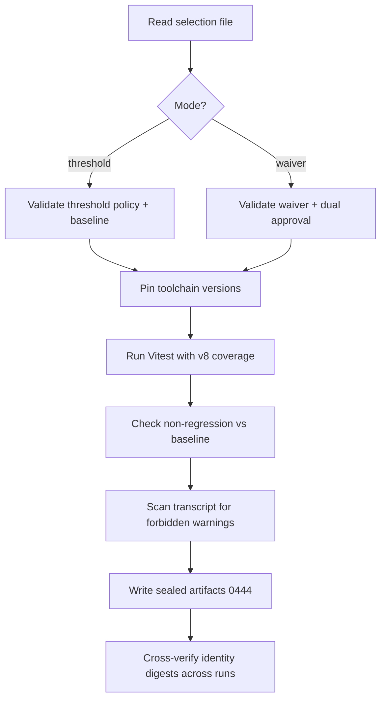
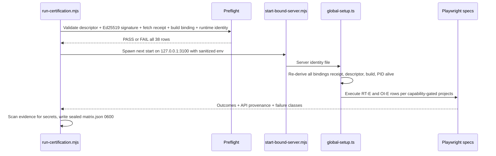

# Testing & Operations

## Unit Tests — Vitest

**Config**: `vitest.config.ts`

| Aspect | Detail |
|--------|--------|
| Environment | `jsdom` with 10 MB localStorage quota |
| Plugin | `@vitejs/plugin-react` |
| Coverage | V8 provider (text/json/html reporters) |
| Fake timers | `shouldAdvanceTime: true` (waitFor/MSW compatibility) |
| Test count | ~975 test files across `src/` |

### Test setup (`src/test/`)
- `localStorage-polyfill.ts` — pre-MSW polyfill
- `setup.ts` — Testing Library `jest-dom` matchers, MSW server lifecycle (`server.listen()` / `resetHandlers()` / `close()`), Radix UI browser API mocks (ResizeObserver, pointer capture, scrollIntoView)
- `test-utils.tsx` — Custom render helpers

### Test file organization
Tests are co-located with source in `__tests__/` directories:
- `src/hooks/__tests__/` — ~140+ files (custom hooks, data fetching, mutations, polling)
- `src/lib/__tests__/` — ~100+ files (utilities, formatters, calculators, API client)
- `src/stores/__tests__/` — 7 files (Zustand stores)
- `src/types/__tests__/` — 13 files (type guards, runtime validators)

**Naming**: `*.test.ts` (logic), `*.test.tsx` (component/JSX), plus specialized variants like `*.bug-fix.test.tsx`, `*.story-NN.test.ts`.

### MSW (Mock Service Worker)
`src/mocks/server.ts` — MSW v2 server for intercepting API calls in unit tests. Handlers are reset between tests via `server.resetHandlers()`.

## E2E Tests — Playwright

**Config**: `playwright.config.ts`

| Aspect | Detail |
|--------|--------|
| Test directory | `./e2e/` (83 `.spec.ts` files) |
| Base URL | `http://localhost:3100` (overridable via `E2E_BASE_URL`) |
| Projects | `setup` (auth, uses storage state) → `chromium` (desktop, depends on setup) |
| CI behavior | 2 retries, 1 worker, `forbidOnly: true`, auto-starts dev server |
| Dev behavior | 0 retries, reuse existing server |
| Artifacts | Trace on first retry, screenshots on failure, video retained on failure |

### Notable fixtures
- `e2e/auth.setup.ts` — Authentication setup with storage state at `e2e/.auth/user.json`
- `e2e/fixtures/mutation-guard.ts` — Conditionally skips `@mutating` tests via `grepInvert`
- `e2e/fixtures/read-only-network-guard.ts` — Network-level mutation guard

### E2E test areas
Dashboard, orders, supplies, margin analytics, FBS, COGS, pricing calculator, liquidity, unit economics, advertising, funnel, search analytics, forecasts, Moysklad integration, accessibility, settings, monitoring, read-only route audit.

## Coverage Governance Certification

**Config**: `quality/coverage-policy-selection.v1.json` (active-mode switch), `quality/coverage-policy.v1.json` (threshold baseline)
**Engine**: `scripts/certification/coverage-governance.mjs`

The coverage governance system transforms frontend code-coverage enforcement from a best-effort CI gate into a deterministic, tamper-evident certification process. It wraps Vitest with a governance layer that selects between threshold enforcement and temporary waivers, then produces sealed artifacts that prove the run was legitimate, reproducible, and policy-compliant.

### Why it exists

Standard percentage-based coverage gates are fragile: rounding drift, opaque thresholds, no audit trail for exceptions, and no reproducibility guarantee. The governance system replaces these with exact-count non-regression checks, cryptographic identity binding, and sealed read-only artifacts.

### Policy modes (mutually exclusive)

| Mode | Selection file field | Description |
|------|---------------------|-------------|
| `threshold` | `thresholdPolicy` set, `waiver: null` | Non-regression against a frozen baseline of uncovered counts. Currently active. |
| `waiver` | `waiver` set, `thresholdPolicy: null` | Temporary exception (max 14-day lifetime) requiring dual approval from Frontend Tech Lead + QA Owner. Cannot reduce the baseline. |

Mode selection is validated by `quality/schemas/coverage-policy-selection.v1.json` using a `oneOf` constraint — both active or both inactive is a hard failure.

### Key design choices

- **Uncovered counts, not percentages** — baseline is expressed as negative counts (e.g., `-6799` statements), not "must be ≥ 73%". A 0.01 percentage-point epsilon handles floating-point tolerance.
- **Sealed artifacts** — all output files are `chmod 0444`, directories `chmod 0555` (tamper evidence).
- **Identity binding** — every run carries an `identity.json` with SHA-256 digests over the source tree, resolved test paths, lockfile, policy files, and toolchain versions.
- **Forbidden warning scan** — test transcript scanned for known Vite/Vitest migration deprecation warnings (`quality/coverage-warning-governance.v1.json`).
- **Toolchain pinning** — Node v24.18.0, npm 11.11.0, Vitest 4.1.10, `@vitest/coverage-v8` 4.1.10 (exact versions enforced at runtime).

### Certification run

A complete CI certification produces four sealed artifact directories: `measurement/` (measurement-only), `negative/` (negative control — intentionally mutated to verify the gate fails), `final-1/` and `final-2/` (two enforcement runs proving reproducibility).

### CLI commands

| Command | Action |
|---------|--------|
| `npm run cert:coverage:ci` | Run coverage in whichever mode the selection file specifies |
| `npm run cert:coverage:threshold` | Run in threshold enforcement mode |
| `npm run cert:coverage:waiver` | Run in waiver mode |
| `npm run test:coverage:governance` | Run the governance engine's own unit tests |
| `npm run cert:coverage:negative-threshold` | Negative-control flow (verifies the gate fails on regression) |
| `npm run cert:coverage:verify-artifact-set` | Full four-directory artifact verification |

Source: `quality/`, `scripts/certification/coverage-governance.mjs`, `scripts/certification/read-policy-mode.mjs`

## Tier 0 Runtime Certification

**Config**: `playwright.tier0.config.ts`
**Scripts**: `scripts/tier0/` (preflight, evidence-matrix, run-certification, runtime-safety, start-bound-server)
**Specs**: `e2e/tier0/`, `e2e/runtime-certification.spec.ts`, `e2e/orders-integrity.spec.ts`

Tier 0 is a **fail-closed, tamper-evident certification harness** that verifies a production build artifact against live runtime contracts before external certification (gate `CERT-F01`). It is architecturally separate from the generic Playwright E2E suite — it never builds, never installs dependencies, never reuses a process on port 3100, and never authorizes production writes. Its verdict ceiling is intentionally `UNDETERMINED` until a fully authorized live run completes.

### Evidence registry

The 38-row immutable contract (`e2e/tier0/tier0-row-registry.v1.json`) declares every assertion with exact capability dependencies. Its SHA-256 is pinned in code.

| Group | Rows | Purpose |
|-------|------|---------|
| prerequisite | PRE-I01–I10 | Artifact, environment, runner, credentials, mutation opt-in, cleanup |
| runtime | RT-E01–E14 | Server readiness, auth, session, role boundaries, cabinet isolation, API semantics, financial reconciliation, mutation guard/mutation |
| orders-integrity | OI-E01–E10 | Orders Integrity page contracts: navigation, denial, loading, counts, reconciliation |
| observability | OBS-I01–I04 | Command provenance, sanitized evidence, matrix completeness |

Each row uses two-tier capabilities: **guard capabilities** (structural preconditions from preflight) and **permission capabilities** (optional authorities checked against descriptor + environment).

### Certification flow

### Safety mechanisms

- **Triple mutation guard** — three env vars must all be exact: `E2E_ENABLE_MUTATIONS=true`, `E2E_MUTATION_TARGET=sandbox`, `E2E_MUTATION_ACK=I_UNDERSTAND_THIS_MUTATES_TEST_DATA` (RT-E13 tests partial combinations are denied)
- **Runtime egress enforcement** — every Playwright page route validated against descriptor allowlist; methods restricted to GET/HEAD/OPTIONS except auth POST
- **Ed25519 descriptor authority** — environment descriptor signed by a runtime-operator; public key pinned via env var, max 72-hour validity window
- **Immutable fetch receipt** — proves artifact was fetched read-only, verified before extraction, no reconstruction
- **Credential leak detection** — console output monitored for declared credential values

### CLI commands

| Command | Action |
|---------|--------|
| `npm run test:tier0:safety` | Run Tier 0 script unit tests |
| `npm run test:tier0:list` | List available Tier 0 Playwright tests |
| `npm run test:tier0:certify` | Run full Tier 0 certification (`run-certification.mjs`) |

Source: `e2e/tier0/README.md`, `scripts/tier0/`, `playwright.tier0.config.ts`

## CI/CD Workflows

### `frontend-quality.yml` — Frontend Quality Gates
- **Triggers**: PR + push to `main`/`develop`
- **Runner**: Self-hosted (`wb-ci-fe` label), 2 vCPU / 4 GB RAM
- **Timeout**: 90 minutes
- **Toolchain pin**: Node `24.18.0` + npm `11.11.0` (installed and asserted at job start)
- **Steps** (sequential, single job):
  1. ESLint (flat config, `npm run lint`)
  2. TypeScript type-check (`tsc --noEmit`, `--max-old-space-size=1536`)
  3. Governed coverage validation helpers (`npm run test:coverage:governance`)
  4. Full Vitest suite with governed coverage (`npm run cert:coverage:ci`) — uploads sealed evidence artifacts via `upload-artifact`
  5. Privacy Guard — scans PII-adjacent files for forbidden `console.*` calls

### `openwiki-update.yml` — OpenWiki Documentation Update
- **Triggers**: Schedule (daily `0 8 * * *` UTC) + manual `workflow_dispatch`
- **Runner**: `ubuntu-latest`, Node 22
- **Provider**: GLM 5.2 via OpenRouter (`OPENWIKI_PROVIDER: openrouter`, `OPENWIKI_MODEL_ID: z-ai/glm-5.2`); LangSmith tracing enabled
- **Process**: `npm install --global openwiki` → `openwiki code --update --print` → creates a pull request via `peter-evans/create-pull-request` (branch `openwiki/update`). PR includes `openwiki/`, `AGENTS.md`, `CLAUDE.md`, and `.github/workflows/openwiki-update.yml`.

## PM2 Deployment

**Config**: `ecosystem.config.js`

Two PM2 app definitions — **never run both simultaneously** (both use port 3100):

| App | Mode | Script | Requires Build |
|-----|------|--------|----------------|
| `wb-repricer-frontend-dev` | Development | `npm run dev` | No (hot reload, no caching) |
| `wb-repricer-frontend` | Production | `next start` | Yes (`npm run build` first) |

Both configured with: `max_restarts: 5`, `min_uptime: 30s`, `restart_delay: 5000`, `exp_backoff_restart_delay: 100`.

Helper scripts: `pm2-switch-dev.sh` / `pm2-switch-prod.sh`.

## Environment Variables

From `.env.example` (names only — never commit actual values):

| Variable | Purpose |
|----------|---------|
| `NEXT_PUBLIC_API_URL` | Backend API URL (no `/api` suffix; default `http://localhost:3000`) |
| `NEXT_PUBLIC_APP_NAME` | Application name |
| `NEXT_PUBLIC_APP_VERSION` | Application version |
| `NEXT_PUBLIC_ENABLE_ANALYTICS` | Feature flag |
| `NEXT_PUBLIC_ENABLE_WEBSOCKET` | Feature flag |
| `NEXT_PUBLIC_MIXPANEL_TOKEN` | Mixpanel analytics (Epic 37) |
| `NEXT_PUBLIC_ENABLE_DEV_TOOLS` | Development-only tools |
| `NEXT_PUBLIC_TELEGRAM_BOT_USERNAME` | Telegram bot username (Epic 34-FE) |

### E2E-specific (`.env.e2e.example`)

| Variable | Purpose |
|----------|---------|
| `E2E_BASE_URL` | Frontend URL (default `:3100`) |
| `E2E_API_URL` | Backend API URL |
| `E2E_TEST_EMAIL` / `E2E_TEST_PASSWORD` | Test user credentials |
| `E2E_REQUEST_TIMEOUT` | Timeout (30s) |
| `E2E_SCREENSHOT_DIR` | Failure screenshot path |
| `E2E_DEBUG` / `E2E_HEADED` | Playwright Inspector / headless toggle |
| `E2E_WB_TOKEN` | Optional real WB API token for integration tests |
