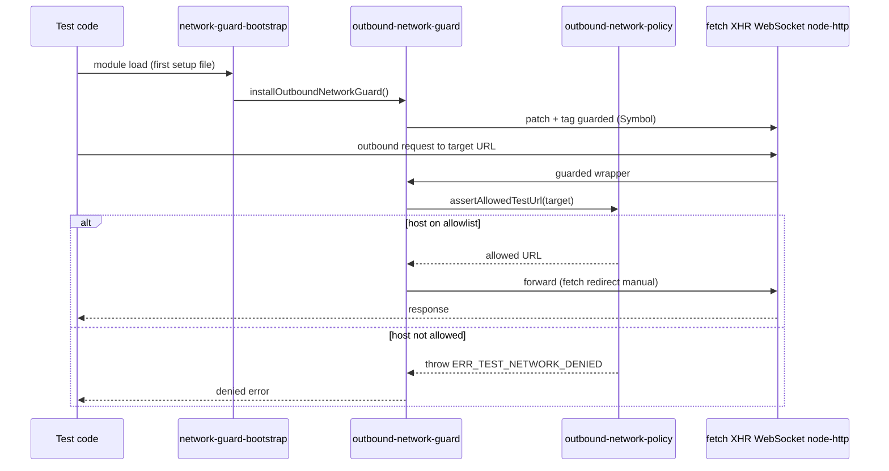
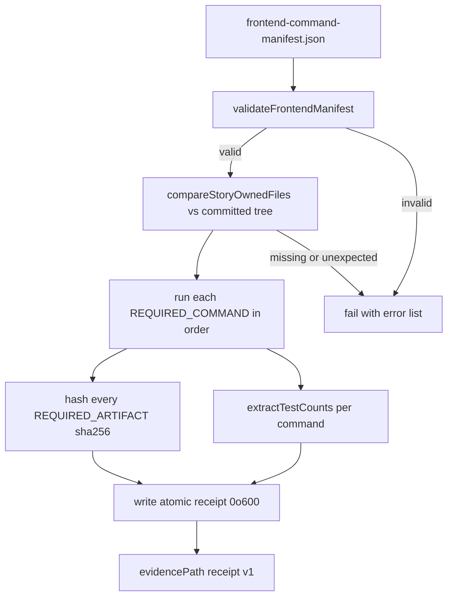

# Testing & Operations

## Unit Tests — Vitest

**Config**: `vitest.config.ts`

| Aspect | Detail |
|--------|--------|
| Environment | `jsdom` with 10 MB localStorage quota |
| Plugin | `@vitejs/plugin-react` |
| Coverage | V8 provider (text/json/json-summary/html reporters), output `coverage/local` |
| Fake timers | `shouldAdvanceTime: true` (waitFor/MSW compatibility) |
| Test count | ~1096 test files across `src/` |

### Test setup (`src/test/`)
Setup files run in explicit list order (`sequence.setupFiles: 'list'`) defined by `VITEST_SETUP_FILES` in `vitest.config.ts`. Order is load-bearing: the outbound network guard must install **before** any general setup or MSW import, or module-evaluation-time network attempts would escape the guard.

- `network-guard-bootstrap.ts` — **first entry**; calls `installOutboundNetworkGuard()` so transport interception exists before any other module is evaluated (see [Outbound Network Guards](#outbound-network-guards))
- `fixtures/module-evaluation-network-attempt.ts` — load-time assertion that the guard was installed before module evaluation; throws if a `node:http` request to an external host is not denied
- `localStorage-polyfill.ts` — pre-MSW polyfill
- `setup.ts` — Testing Library `jest-dom` matchers, MSW server lifecycle (`server.listen()` / `resetHandlers()` / `close()`), Radix UI browser API mocks (ResizeObserver, pointer capture, scrollIntoView)
- `test-utils.tsx` — Custom render helpers

### Test file organization
Tests are co-located with source in `__tests__/` directories:
- `src/hooks/__tests__/` — ~140+ files (custom hooks, data fetching, mutations, polling)
- `src/lib/__tests__/` — ~100+ files (utilities, formatters, calculators, API client)
- `src/stores/__tests__/` — 7 files (Zustand stores)
- `src/types/__tests__/` — 13 files (type guards, runtime validators)

**Naming**: `*.test.ts` (logic), `*.test.tsx` (component/JSX), plus specialized variants like `*.bug-fix.test.tsx`, `*.story-NN.test.ts`.

### MSW (Mock Service Worker)
`src/mocks/server.ts` — MSW v2 server for intercepting API calls in unit tests. Handlers are reset between tests via `server.resetHandlers()`.

## E2E Tests — Playwright

**Config**: `playwright.config.ts`

| Aspect | Detail |
|--------|--------|
| Test directory | `./e2e/` (~87 `.spec.ts` files) |
| Base URL | `http://localhost:3100` (overridable via `E2E_BASE_URL`, validated against the network policy allowlist via `assertAllowedTestUrl`) |
| Projects | `setup` (auth, uses storage state) → `chromium` (desktop, depends on setup); `historical-spp` (self-contained, empty storage state, skips `setup`) for the Story 128.27 exact-command spec |
| CI behavior | 2 retries, 1 worker, `forbidOnly: true`, auto-starts dev server |
| Dev behavior | 0 retries, reuse existing server |
| Diagnostics | `trace: 'off'`, `screenshot: 'off'`, `video: 'off'` — raw browser capture is disabled by default because it can retain URLs, storage, headers, or bodies (Story 128.10) |
| Service workers | `serviceWorkers: 'block'` — BrowserContext routing cannot intercept service-worker-owned traffic |

`playwright.config.ts` imports `src/test/network-guard-bootstrap` as its first statement so the Node-side outbound network guard is installed before any test file evaluates. It also imports `scripts/e2e-preflight-handshake.mjs` and, for non-CI runs, enforces a fresh preflight handshake before collection (see [Local E2E Preflight](#local-e2e-preflight)). The guarded Playwright runtime is supplied to specs via the custom fixtures in [Outbound Network Guards](#outbound-network-guards).

### Notable fixtures
- `e2e/auth.setup.ts` — Authentication setup with storage state at `e2e/.auth/user.json`
- `e2e/auth-manager.setup.ts` — Manager-role auth setup (matched by the `.*\.setup\.ts` setup project)
- `e2e/fixtures/mutation-guard.ts` — Conditionally skips `@mutating` tests via `grepInvert`
- `e2e/fixtures/network-test.ts` — Extends the Playwright `test` object with the guarded facade and a `networkGuard` fixture (deny counter / snapshot)
- `e2e/fixtures/playwright-network-guard.ts` — Guarded Playwright object graph (see [Outbound Network Guards](#outbound-network-guards))

### E2E test areas
Dashboard, orders, supplies, margin analytics, FBS, COGS, pricing calculator, liquidity (with trends, Story 165.4), unit economics, advertising, funnel, search analytics, forecasts, Moysklad integration, finances (NEW-7), backfill admin (per-source retry, Story 165.5), accessibility, settings, monitoring, historical SPP analytics (Story 128.27), plus `e2e/outbound-network-guard.spec.ts` which exercises the guard itself end-to-end.

> **Note**: A hosted Tier 0 runtime certification harness and governed coverage certification system previously lived here. Both were removed when the project replaced hosted certification with local validation gates. The remaining quality gates are documented in [Conventions & Quality Gates](conventions-and-quality.md).

### E2E assertion and wait quality gates (Stories 162.3–162.7)

Two AST-based scanners enforce AP#6 (vacuous E2E assertions) and AP#7 (hard `waitForTimeout` waits) across the E2E specs touched by Epic 162. They mask comments/strings and regex literals before scanning so prohibited patterns cannot hide in prose, and each owns an explicit per-story file list:

- **Vacuous assertions** — `scripts/check-e2e-vacuous-assertions.mjs` (`npm run check:e2e-assertions`) flags tautological matchers such as `expect(x >= 0).toBeTruthy()`, `expect(true).toBeTruthy()`, and `toBeGreaterThanOrEqual(0)` that cannot prove content exists. Owned files: `STORY_162_3_E2E_FILES` (analytics/finance specs) and `STORY_162_4_E2E_FILES` (operations/settings/supplies/COGS/price specs). Self-test: `src/test/e2e-vacuous-assertions.test.ts` (runs under `npm test`).
- **Fixed waits** — `scripts/check-e2e-fixed-waits.mjs` (`npm run check:e2e-waits`) flags `waitForTimeout`, raw `setTimeout`/`new Promise(setTimeout)` timers, and arbitrary wait helpers (`sleep`, `delay`, `pause`). Each story baseline (`STORY_162_5`/`162_6`/`162_7`) pins its owned E2E + fixture file set and the canonical wait/timer counts reduced from the story's base revision. Self-test: `src/test/e2e-fixed-waits.test.ts` (runs under `npm test`).

These are not in the `README.md` **Local validation** command list; they are enforced as quality gates via their Vitest self-tests and the dedicated npm scripts. See [Conventions & Quality Gates — Quality Gates](conventions-and-quality.md#quality-gates-ratchet-scripts) for how they sit alongside the other gates.

## Local E2E Preflight

Story 162.2 introduced a reproducible localhost preflight that gates every local Playwright run. Raw `npx playwright test` invocations are rejected so they cannot silently reuse stale ignored auth state.

| Script | Command | Purpose |
|--------|---------|---------|
| Bounded smoke | `npm run test:e2e` | Preflight checks, refresh auth state, run `e2e/orders.spec.ts` on Chromium (read-only) |
| Full suite | `npm run test:e2e:full` | Same preflight, full suite |
| Diagnostics only | `npm run test:e2e:preflight` | Validate config + services, print the exact next command (no Playwright launch) |
| UI mode | `npm run test:e2e:ui` | Full suite with Playwright UI |

**Preflight** (`scripts/e2e-preflight.mjs`) validates the `.env.e2e` configuration and probes both localhost services (`:3100/login`, `:3000/v1/health`) before Playwright collection. It removes only the two ignored auth-state files (`e2e/.auth/user.json`, `e2e/.auth/manager.json`) and regenerates them through the live setup-project login flow. `--no-deps` is rejected by both the preflight and `playwright.config.ts` because Chromium relies on the setup project for a fresh `user.json`. Playwright arguments forward after `--` (e.g., `npm run test:e2e -- --list`).

**Handshake** (`scripts/e2e-preflight-handshake.mjs`) — the preflight creates a fresh random temporary handshake (token + file, 60s max age) for its Playwright child and exports it via `E2E_PREFLIGHT_HANDSHAKE_FILE` / `E2E_PREFLIGHT_HANDSHAKE_TOKEN`. `playwright.config.ts` calls `assertLocalE2EPreflightHandshake()` on non-CI runs; a raw `playwright test` without a handshake is rejected with the message to run `npm run test:e2e`. Cleanup is attempted after Playwright exits; any cleanup failure is surfaced as a redacted non-zero result (the path, token, and raw error are never printed). CI runs (`CI=true`) bypass the handshake.

**Mutation safety**: `@mutating` specs stay excluded by default (see `e2e/fixtures/mutation-guard.ts`). Enabling requires all three opt-ins: `E2E_ENABLE_MUTATIONS=true`, `E2E_MUTATION_TARGET=sandbox`, `E2E_MUTATION_ACK=I_UNDERSTAND_THIS_MUTATES_TEST_DATA`. Full setup, backend-seed, argument-forwarding, and recovery guidance is in `e2e/README.md`.

**Test**: `scripts/e2e-preflight.test.mjs` (runs under `node --test`, excluded from Vitest). The preflight never prints credential values, response bodies, headers, cookies, tokens, or storage state.

### Historical SPP exact-command harness

The Story 128.27 spec (`e2e/historical-spp-analytics.spec.ts`) runs fully mocked and owns its own guarded local server lifecycle, bypassing the standard preflight handshake via a separate execution marker.

- `establishHistoricalSppExecution()` in `scripts/e2e-preflight-handshake.mjs` detects the exact command shape (`historical-spp-analytics.spec.ts` + `--reporter=html` + the evidence `--output` path) and sets `HISTORICAL_SPP_EXACT_COMMAND_VERIFIED=1`; only that exact invocation and its worker-index children bypass the local preflight requirement.
- `scripts/historical-spp-global-setup.ts` (Playwright `globalSetup`) asserts the port is unoccupied, spawns a guarded `next dev` via `scripts/start-fresh-next-dev.mjs`, waits for readiness, and stops it on teardown. Readiness/stop logic lives in `src/test/historical-spp-server-lifecycle.ts`.
- The `historical-spp` Playwright project uses empty storage state and a no-op `setup` match (`/$^/`) so it stays self-contained; the `chromium` project explicitly ignores that spec.

**Test**: `src/test/historical-spp-server-lifecycle.test.ts`.

## Privacy Console Check

**Script**: `scripts/check-privacy-console.mjs` · **Test**: `scripts/check-privacy-console.test.mjs`

A local privacy guard that scans PII-adjacent source files for forbidden `console.*` calls, preventing customer data (e.g., order client info) from leaking to the browser console. It replaced the privacy step that previously ran in CI.

- **PII file list** — `PII_FILES` in `check-privacy-console.mjs` enumerates the guarded paths (`orders/client-info-api.ts`, `useClientInfo.ts`, `orders-client-info.ts`, and their tests/components).
- **AST scan** — parses each file with `@typescript-eslint/parser` and flags any `console.<method>` call where method is in `FORBIDDEN_CONSOLE_METHODS` (log, info, warn, error, debug, trace, dir, table, count, group*, time*, profile*, etc.), including computed access (`console['log']`).
- **Exit code** — non-zero on the first violation, printing file, line, and the offending expression.

| Command | Action |
|---------|--------|
| `npm run check:privacy` | Run the privacy console scan |
| `npm run test:privacy` | Run the guard's own unit tests **and** the diagnostic-capture-policy tests (`node --test scripts/check-privacy-console.test.mjs scripts/privacy/diagnostic-capture-policy.test.mjs`) |

The sibling [Diagnostic Capture Policy](#diagnostic-capture-policy) guard validates the schema and sanitization rules for any opt-in diagnostic capture; both are privacy guards and run together under `npm run test:privacy`.

## Outbound Network Guards

Introduced by Story 128.10 (frontend verification foundation). The guards ensure that **no test can reach a non-local network endpoint** — every outbound transport channel (browser `fetch`, XHR, WebSocket, EventSource, and the Node `http`/`https`/`net`/`tls`/`dns`/`http2`/`dgram`/`worker_threads` modules) is intercepted and denied unless the target host is on the test allowlist. This makes tests hermetic: a missing MSW handler or an accidental real-network call fails loudly instead of flaking or leaking.

### Policy allowlist
`test-utils/network-policy.json` (`schemaVersion: epic128-test-network-policy/v1`) defines the allowlist:

| Field | Value |
|-------|-------|
| `allowedProtocols` | `http:`, `https:`, `ws:`, `wss:` |
| `allowedHosts` | `localhost`, `127.0.0.1`, `::1`, `host.docker.internal`, `postgres`, `redis` |
| `allowUnixSockets` | `false` (frontend intentionally tightens the shared backend v1 host list) |

`test-utils/outbound-network-policy.ts` is the single source of truth shared by every guard variant:
- `assertAllowedTestUrl(target, baseUrl?)` — resolves the target against `TEST_NETWORK_ORIGIN` (`http://localhost`), rejects credentials in the URL, and returns the URL only if protocol + host match the allowlist. On denial it throws an error with `code: 'ERR_TEST_NETWORK_DENIED'`.
- `assertAllowedSocketHost(host)` — socket-level host check used by the Node guard.
- `networkPolicyDeniedError()` — shared denied-error factory.

The end-to-end request path a test takes through the guard layers:

Figure: a test's outbound request is canonicalized, checked against the shared policy allowlist, then either forwarded to the (patched) transport or denied before any I/O.

### Vitest (Node + jsdom) guard
`src/test/network-guard-bootstrap.ts` is the **first** Vitest setup file and calls `installOutboundNetworkGuard()` from `src/test/outbound-network-guard.ts`. Installation is idempotent (guarded values are tagged with `Symbol.for('epic128.frontend.test-network-guard.guarded')` so re-installation is a no-op):

- `globalThis.fetch` is replaced by a guarded fetch that canonicalizes `string` / `URL` / `Request` inputs, asserts the target, and forces `redirect: 'manual'` (redirects cannot be followed past the guard).
- `XMLHttpRequest.prototype.open` is replaced and always throws — XHR redirects happen below the JS seam and cannot be safely intercepted.
- `WebSocket` and `EventSource` constructors are replaced by Proxies whose `construct` trap always throws — browser-managed streaming transports can follow redirects internally and are therefore denied entirely.

`src/test/outbound-node-network-guard.ts` extends the guard to Node transports reachable from jsdom/Node: it patches `node:http` / `node:https` request functions, the `node:net` / `node:tls` `connect`/`createConnection`, `node:dns` `lookup`, `node:http2`, `node:dgram`, and `node:worker_threads`. It also rejects unsafe `RequestOptions` (`lookup`, `auth`, `agent`, `_defaultAgent`, `createConnection`) that could bypass host validation, and snapshots option objects to plain data before forwarding (rejecting accessors or non-plain prototypes).

`src/test/fixtures/module-evaluation-network-attempt.ts` (second setup file) is a load-time canary: it imports `node:http`/`net`/`dns`, verifies each named export is already guarded, and attempts a request to `https://example.invalid/...` — if the request is *not* denied with `ERR_TEST_NETWORK_DENIED`, module evaluation throws. This catches ordering regressions where a guard-installation gap lets module-evaluation-time code escape.

### Playwright guard
The browser-side guard is more involved because Playwright owns the browser process and its object graph must be wrapped, not patched.

- `e2e/fixtures/playwright-network-guard.ts` builds **guarded wrappers** for the entire Playwright runtime (`playwright`, `chromium`/`firefox`/`webkit` browser types, `Browser`, `BrowserContext`, `Page`, `APIRequest`/`APIRequestContext`/`APIResponse`, `Route`, `WebSocketRoute`). Wrappers are memoized in `WeakMap`s keyed on the underlying object so identity is stable. Browser-context routing applies a route handler (`createPlaywrightRouteGuard`) that calls `assertAllowedTestUrl` on every request URL; non-local requests are aborted. Diagnostic surfaces that can retain raw request data (`page.pdf`, `page.screenshot`, `page.video`, `page.coverage`, `page.routeFromHAR`, `request.consoleMessages`, `request.requests`, `APIResponse.securityDetails`/`serverAddr`/`body`) are denied through the guarded facade. `testInfo.attach` is denied to prevent arbitrary artifact retention. Auth storage-state paths are restricted to `e2e/.auth/manager.json` and `e2e/.auth/user.json`.
- `e2e/fixtures/network-test.ts` re-exports a `test` object extended with the guarded fixtures (`networkGuard` fixture exposing `expectDenied(cb)` and `snapshot()` for `{ denied, unexpected }` counters). Specs import `test`/`expect` from `./fixtures/network-test`, **not** from `@playwright/test` directly.
- `e2e/outbound-network-guard.spec.ts` is the end-to-end exercise: it confirms a non-local `page.goto` is rejected, localhost/relative targets are allowed, the guarded facade denies raw diagnostics, and the static boundary enforces the import restriction.

### Playwright static boundary (compile-time guard)
`src/test/playwright-static-boundary.ts` + `src/test/playwright-static-dataflow.ts` perform a **TypeScript AST analysis** of the whole `e2e/`, `tests/e2e/`, `src/test/`, and `*.{test,spec}.*` source tree to forbid patterns the runtime guard cannot fully close:

- Direct imports of `@playwright/test` / `playwright` / `playwright-core` anywhere except an explicit `APPROVED_RUNTIME_MODULES` allowlist (the guard fixtures themselves, `playwright.config.ts`, and the boundary self-tests). Specs must import from `./fixtures/network-test` instead.
- Dynamic code execution (`eval`, `Function`, `AsyncFunction`, `GeneratorFunction`, etc.), `node:vm`, `node:worker_threads`, `node:child_process`, `node:inspector`, `node:repl`, `node:http2`, `node:dgram`, `node:cluster` in restricted test sources.
- Reflective object introspection (`Object.getOwnPropertyDescriptor(s)`, `getPrototypeOf`) and `node:module` loader APIs (`createRequire`, `require`, `_linkedBinding`, `binding`, `dlopen`, `getBuiltinModule`) that could unwrap the guarded facade.
- Browser-type launch/connect methods (`launch`, `connect`, `connectOverCDP`, `launchPersistentContext`, `launchServer`) and serialized-browser execution (`page.evaluate`/`evaluateHandle`/`evaluateAll`) outside approved modules.
- Forbidden guarded test surfaces (`chromium`, `firefox`, `webkit`, `defineConfig`, `expect`, `mergeExpects`, `mergeTests`, `request`, `selectors`) — these are the raw Playwright entry points the guarded facade replaces.

The boundary runs as the Vitest test `src/test/playwright-static-boundary.test.ts`, which scans `RUNTIME_SOURCE_PATTERNS` and fails on any violation. This is the compile-time complement to the runtime facade: the AST guard stops a contributor from importing `@playwright/test` directly, while the facade stops a guarded handle from leaking diagnostics at runtime.

### Focused tests
| Behavior | Test |
|----------|------|
| Policy allow/deny + denial error | `test-utils/...` covered via `src/test/outbound-network-guard.test.ts` |
| Vitest fetch/XHR/WebSocket/Node-module interception | `src/test/outbound-network-guard.test.ts` |
| Guarded Playwright object graph (wrappers, diagnostics denial, attach denial) | `src/test/playwright-object-graph-guard.test.ts` |
| Guarded Playwright facade security (route guard, storage-state restriction) | `src/test/playwright-facade-security.test.ts` |
| Static boundary AST violations | `src/test/playwright-static-boundary.test.ts` |
| E2E guard exercise | `e2e/outbound-network-guard.spec.ts` |

### Change guidance
- **Adding a new E2E spec**: import `{ test, expect }` from `./fixtures/network-test` (or `../fixtures/network-test` from a subdirectory). Never import from `@playwright/test`. The static boundary will fail the build otherwise.
- **Adding an allowed test origin** (e.g., a new docker service): edit `test-utils/network-policy.json` `allowedHosts` only; both the Vitest and Playwright guards read the same file. Update `MANIFEST_SCHEMA_VERSION`/baseline expectations only if the manifest must reflect it.
- **Approving a new runtime module for raw Playwright/dynamic-code use**: add it to `APPROVED_RUNTIME_MODULES` in `src/test/playwright-static-boundary.ts` and justify why the guarded facade cannot cover it; this is rarely correct.
- **Validating the guard itself**: `npx vitest run src/test/outbound-network-guard.test.ts src/test/playwright-network-guard.test.ts src/test/playwright-object-graph-guard.test.ts src/test/playwright-facade-security.test.ts src/test/playwright-static-boundary.test.ts` and `npx playwright test e2e/outbound-network-guard.spec.ts --project=chromium --no-deps`.

## Diagnostic Capture Policy

**Module**: `scripts/privacy/diagnostic-capture.mjs` · **Policy**: `scripts/privacy/diagnostic-capture-policy.json` · **Test**: `scripts/privacy/diagnostic-capture-policy.test.mjs`

A schema/privacy validator for any opt-in diagnostic-capture feature (e.g., capturing provider-API response shapes for debugging). The policy (`schemaVersion: epic128-diagnostic-capture-policy/v1`) is deliberately restrictive:

| Policy field | Constraint |
|--------------|------------|
| `enabledByDefault` | must be `false` |
| `maxBytes` | bounded to 1 MiB (current 64 KiB) |
| `maxRecords` | bounded to 1000 (current 100) |
| `retentionHours` | 1–24 (current 24) |
| `accessControl` | `OWNER_ONLY` |
| `sanitization` | `ALLOWLIST_V1` |
| `allowedFields` | non-empty; each field must have a validator and must not match the forbidden pattern (`token|cookie|authorization|header|url|body|payload|storage|fingerprint`) |

The allowed fields are exclusively non-sensitive shape/class indicators: `captureId`, `capturedAt`, `providerContractVersion`, `profileVersion`, `responseClass`, `statusCode`, `bodyShapeHash` (a SHA-256 of the response body shape, not the body itself).

`validateDiagnosticCapturePolicy(policy)` returns a list of policy violations; `sanitizeDiagnosticRecord(input, policy)` reduces an inbound record to only the allowlisted fields and rejects accessors, cycles, or forbidden keys; `prepareDiagnosticCapture({ records, enabled, actorRole, authorizationExpiresAt, ... })` enforces the full lifecycle — disabled-by-default short-circuit, `OWNER`-only authorization, byte/record caps, and a `deleteAt` deadline computed as the minimum of the retention window and the authorization expiry.

This guard is a privacy sibling to the [Privacy Console Check](#privacy-console-check) and runs under the same `npm run test:privacy` command. It is the frontend half of a shared Epic 128 privacy contract. As part of the same Story 128.10 privacy tightening, `src/lib/api-client-debug.ts` was reduced to no-op compatibility seams — the previous raw COGS payload `console.group` logging (which echoed raw API response bodies to the browser console) is now intentionally disabled and emits nothing, while keeping the exported `logCogsRawResponse` / `logCogsProcessedResponse` names for existing callers.

## Frontend Verification Orchestrator (Historical, Story 128.10)

**Script**: `scripts/story-128-10/verify-frontend.mjs` · **Manifest**: `scripts/story-128-10/frontend-command-manifest.json` · **Test**: `scripts/story-128-10/verify-frontend.test.mjs` · **Evidence notice**: `scripts/story-128-10/README.md`

> **Historical, branch-bound evidence.** This directory is immutable historical evidence for Story 128.10. Its command manifest is branch-bound: `requiredBranch` names the former `feat/epic-128-10-frontend-verification-foundation` feature branch on which the evidence was captured. **Do not use these scripts or their recorded results as the current project-wide validation entry point.** For current commands, use the `README.md` **Local validation** section together with the active story plan. This status is recorded directly in the manifest (see below).

A pinned, self-validating orchestrator that ran the complete local frontend verification suite (Story 128.10) and emitted a tamper-evident receipt. It is retained as historical evidence of how the story was validated on its feature branch; it exists because the project has **no mandatory CI merge gate** (see [Conventions & Quality Gates — Local Validation and Merge Authority](conventions-and-quality.md#local-validation-and-merge-authority)). The current authoritative command set for local validation is the `README.md` **Local validation** section plus the active story plan.

### Manifest invariants (`frontend-command-manifest.json`)
The manifest now explicitly records its historical lifecycle at the top level:
- `schemaVersion: epic128-frontend-command-manifest/v1`, `storyId: 128.10`, `repository: frontend`
- `lifecycle: "historical"`, `status: "immutable-evidence"` — declares the artifact is frozen Story 128.10 evidence, not a live entrypoint
- `currentValidationEntrypoint: "README.md#local-validation and the active story plan"` — points readers to the current validation source
- `usageWarning` — restates that this is historical, branch-bound evidence only
- `runtime`: Node `v24.18.0`, npm `11.11.0` (matches `package.json` `engines`)
- `requiredBranch: feat/epic-128-10-frontend-verification-foundation` — the branch the evidence was captured on
- `backendContractCommit`: binds the independently reviewed backend remediation commit
- `networkPolicyNote`: documents the frontend-only Unix-socket tightening
- `commands`: exact ordered list (`REQUIRED_COMMANDS`) — version checks, `npm ci`, the orchestrator's own self-test, `npm test -- --run`, the focused network-guard vitest run, the E2E guard spec, `test:privacy`, `check:privacy`, `type-check`, `lint`, `format:check`, `build`, `git diff --check`
- `expectedArtifacts`: exact list (`REQUIRED_ARTIFACTS`) of every E2E spec, fixture, guard module, and config file the story owns

`validateFrontendManifest(manifest)` enforces these invariants, and `compareStoryOwnedFiles(actual, expected)` asserts the committed artifact set matches the manifest exactly (no missing, no unexpected files). `invalidCommand` rejects placeholders (`<...>`, `${...}`, `TODO`/`TBD`), globs, and shell chaining (`&&`, `||`, `;`, newlines) so the command list stays literal and safe.

### Receipt
On a full run the orchestrator executes each command via `run()` (capturing stdout/stderr/exitCode/duration), hashes every expected artifact (`sha256`), counts test results via `extractTestCounts` (TAP, Vitest, and Playwright output formats), and writes an atomic (`*.tmp` → rename, mode `0o600`) JSON receipt under the manifest's `evidencePath` with `RECEIPT_SCHEMA_VERSION: epic128-frontend-verification-receipt/v1`. To reproduce the story's historical self-test only: `node --test scripts/story-128-10/verify-frontend.test.mjs`.

Figure: the orchestrator self-validates its pinned manifest and artifact set, then runs the ordered command list and emits a tamper-evident receipt.

### Relationship to the guards
The orchestrator's command list was the integration point for the [Outbound Network Guards](#outbound-network-guards), [Diagnostic Capture Policy](#diagnostic-capture-policy), and [Privacy Console Check](#privacy-console-check): it ran the focused guard vitest files, the E2E guard spec, and both `test:privacy` / `check:privacy` as distinct ordered steps. The guards themselves remain the current testing infrastructure; only the Story 128.10 receipt-generating orchestrator is historical. When changing any guard module in `src/test/` or `e2e/fixtures/`, the historical `REQUIRED_ARTIFACTS` in `verify-frontend.mjs` and `frontend-command-manifest.json` should not be edited to match — that manifest is frozen evidence on its branch, not a live manifest.

## CI/CD Workflows

### `frontend-quality.yml` — removed
The self-hosted `frontend-quality.yml` workflow (ESLint, type-check, governed coverage certification, privacy guard) was removed when the project replaced hosted certification with local validation gates. Its quality checks now run locally via the commands in [Conventions & Quality Gates](conventions-and-quality.md). There is currently no required GitHub Actions status check enforcing them.

### `openwiki-update.yml` — OpenWiki Documentation Update
Refreshes the generated `openwiki/**` pages. Authoritative contract in `.github/workflows/openwiki-update.yml`.

| Aspect | Detail |
|--------|--------|
| **Triggers** | Schedule (daily `47 8 * * *` UTC) + manual `workflow_dispatch`. A manual dispatch must target a branch ref (not a tag or other ref) and must not target `main`; the `Validate manual dispatch ref` step rejects anything else before checkout. |
| **Runner** | Self-hosted `wb-ci-fe` (`runs-on: [self-hosted, Linux, X64, wb-ci-fe]`), Node.js 24, 60 min timeout |
| **Concurrency** | `openwiki-frontend` group, `cancel-in-progress: false` |
| **Provider** | Anthropic protocol through `https://api.z.ai/api/anthropic`, model `glm-5.2` (`OPENWIKI_PROVIDER: anthropic`, `ANTHROPIC_API_KEY` from the `ZAI_API_KEY` secret) |
| **Generator** | `npx --yes openwiki@0.3.0 code --update --print` in an isolated per-run `npm_config_cache` under `RUNNER_TEMP` |

**Commit and publish rules** (enforced by the `Commit OpenWiki updates`, `Open pull request for scheduled main refresh`, and `Push updates back to dispatched branch` steps):
- `actions/checkout` runs with `persist-credentials: false`, so no token is stored in `.git/config` after checkout.
- After generation, the workflow restores `.github/workflows/openwiki-update.yml`, every `AGENTS.md`, `CLAUDE.md`, and `openwiki/INSTRUCTIONS.md` to their committed `HEAD` versions so only generated pages are committed.
- `git add -A -- openwiki/ ':(top,exclude)openwiki/INSTRUCTIONS.md'` is the only staging command: it stages generated `openwiki/**` output while explicitly excluding `openwiki/INSTRUCTIONS.md`. The step refuses to commit if any change is staged outside `openwiki/`, if unexpected unstaged tracked changes remain, or if any untracked or ignored file is present.
- **Scheduled run on `main`** → commits, creates a unique `automation/openwiki-${GITHUB_RUN_ID}-${GITHUB_RUN_ATTEMPT}` branch (including the attempt so failed-publication reruns use a fresh branch), pushes it with a temporary `x-access-token:${GH_TOKEN}` remote URL that is restored to a credential-free origin via an `EXIT` trap, and opens a PR against `main` through the GitHub REST API (`POST /repos/{owner}/{repo}/pulls` with `curl`); the PR title/body are built with `node`. There is no `gh` CLI dependency and no auto-merge.
- **Manual dispatch on a non-`main` branch** → commits and pushes the generated commit back to that same branch using the same credential-isolated remote-url pattern.
- **Manual dispatch on `main`** → rejected before checkout.

> Never edit generated `openwiki/**` pages by hand; update source/docs and let the workflow regenerate. The workflow never force-pushes and never pushes directly to `main`.

## Running Locally

The dev and production servers both use port **3100**; never run both simultaneously.

| Mode | Command | Notes |
|------|---------|-------|
| Development | `npm run dev` | Hot reload, no caching |
| Production | `npm run build && npm run start` | Built `.next/` served via `next start -p 3100` |

The previous PM2 process manager configuration (`ecosystem.config.js`, `pm2-switch-*.sh`, `.conductor/` scripts) was removed; local lifecycle helpers now live under `scripts/` (e.g., `start-fresh-next-dev.mjs` via `npm run dev:clean` / `npm run restart:safe`).

## Environment Variables

From `.env.example` (names only — never commit actual values):

| Variable | Purpose |
|----------|---------|
| `NEXT_PUBLIC_API_URL` | Backend API URL (no `/api` suffix; default `http://localhost:3000`) |
| `NEXT_PUBLIC_APP_NAME` | Application name |
| `NEXT_PUBLIC_APP_VERSION` | Application version |
| `NEXT_PUBLIC_ENABLE_ANALYTICS` | Feature flag |
| `NEXT_PUBLIC_ENABLE_WEBSOCKET` | Feature flag |
| `NEXT_PUBLIC_MIXPANEL_TOKEN` | Mixpanel analytics (Epic 37) |
| `NEXT_PUBLIC_ENABLE_DEV_TOOLS` | Development-only tools |
| `NEXT_PUBLIC_TELEGRAM_BOT_USERNAME` | Telegram bot username (Epic 34-FE) |

### E2E-specific (`.env.e2e.example`)

| Variable | Purpose |
|----------|---------|
| `E2E_BASE_URL` | Frontend origin (required, exact `http://localhost:3100`) |
| `E2E_API_URL` | Backend origin (required, exact `http://localhost:3000`) |
| `E2E_TEST_EMAIL` / `E2E_TEST_PASSWORD` | Owner credentials matching the backend seed (required) |
| `E2E_MANAGER_EMAIL` / `E2E_MANAGER_PASSWORD` | Optional Manager pair; set both or leave both blank |
| `E2E_WB_TOKEN` | Optional token for legacy fixture integration scenarios |
| `E2E_ENABLE_MUTATIONS` / `E2E_MUTATION_TARGET` / `E2E_MUTATION_ACK` | Three-part opt-in to un-gate `@mutating` specs (see [Local E2E Preflight](#local-e2e-preflight)) |
