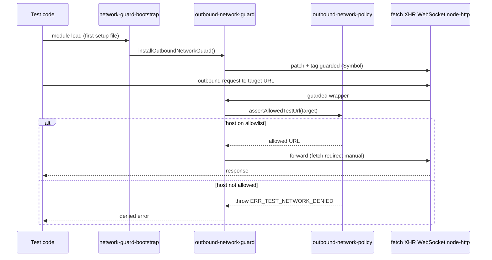
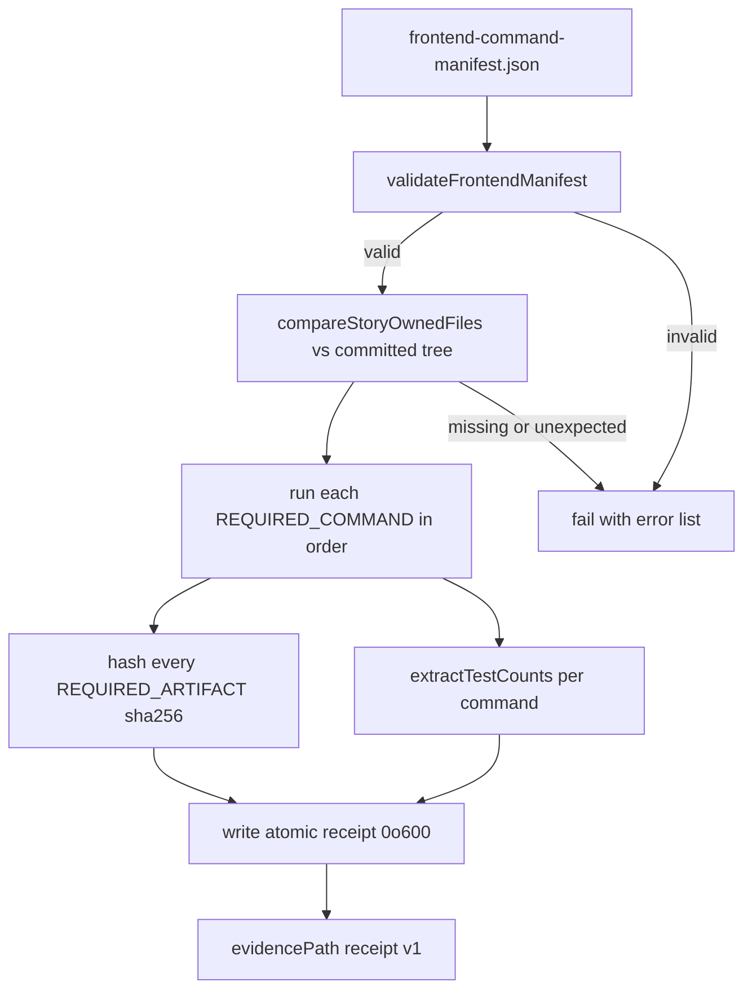

# Testing & Operations

## Unit Tests — Vitest

**Config**: `vitest.config.ts`

| Aspect | Detail |
|--------|--------|
| Environment | `jsdom` with 10 MB localStorage quota |
| Plugin | `@vitejs/plugin-react` |
| Coverage | V8 provider (text/json/json-summary/html reporters), output `coverage/local` |
| Fake timers | `shouldAdvanceTime: true` (waitFor/MSW compatibility) |
| Test count | ~1050 test files across `src/` |

### Test setup (`src/test/`)
Setup files run in explicit list order (`sequence.setupFiles: 'list'`) defined by `VITEST_SETUP_FILES` in `vitest.config.ts`. Order is load-bearing: the outbound network guard must install **before** any general setup or MSW import, or module-evaluation-time network attempts would escape the guard.

- `network-guard-bootstrap.ts` — **first entry**; calls `installOutboundNetworkGuard()` so transport interception exists before any other module is evaluated (see [Outbound Network Guards](#outbound-network-guards))
- `fixtures/module-evaluation-network-attempt.ts` — load-time assertion that the guard was installed before module evaluation; throws if a `node:http` request to an external host is not denied
- `localStorage-polyfill.ts` — pre-MSW polyfill
- `setup.ts` — Testing Library `jest-dom` matchers, MSW server lifecycle (`server.listen()` / `resetHandlers()` / `close()`), Radix UI browser API mocks (ResizeObserver, pointer capture, scrollIntoView)
- `test-utils.tsx` — Custom render helpers

### Test file organization
Tests are co-located with source in `__tests__/` directories:
- `src/hooks/__tests__/` — ~140+ files (custom hooks, data fetching, mutations, polling)
- `src/lib/__tests__/` — ~100+ files (utilities, formatters, calculators, API client)
- `src/stores/__tests__/` — 7 files (Zustand stores)
- `src/types/__tests__/` — 13 files (type guards, runtime validators)

**Naming**: `*.test.ts` (logic), `*.test.tsx` (component/JSX), plus specialized variants like `*.bug-fix.test.tsx`, `*.story-NN.test.ts`.

### MSW (Mock Service Worker)
`src/mocks/server.ts` — MSW v2 server for intercepting API calls in unit tests. Handlers are reset between tests via `server.resetHandlers()`.

## E2E Tests — Playwright

**Config**: `playwright.config.ts`

| Aspect | Detail |
|--------|--------|
| Test directory | `./e2e/` (~83 `.spec.ts` files) |
| Base URL | `http://localhost:3100` (overridable via `E2E_BASE_URL`, validated against the network policy allowlist via `assertAllowedTestUrl`) |
| Projects | `setup` (auth, uses storage state) → `chromium` (desktop, depends on setup) |
| CI behavior | 2 retries, 1 worker, `forbidOnly: true`, auto-starts dev server |
| Dev behavior | 0 retries, reuse existing server |
| Diagnostics | `trace: 'off'`, `screenshot: 'off'`, `video: 'off'` — raw browser capture is disabled by default because it can retain URLs, storage, headers, or bodies (Story 128.10) |
| Service workers | `serviceWorkers: 'block'` — BrowserContext routing cannot intercept service-worker-owned traffic |

`playwright.config.ts` imports `src/test/network-guard-bootstrap` as its first statement so the Node-side outbound network guard is installed before any test file evaluates. The guarded Playwright runtime is supplied to specs via the custom fixtures in [Outbound Network Guards](#outbound-network-guards).

### Notable fixtures
- `e2e/auth.setup.ts` — Authentication setup with storage state at `e2e/.auth/user.json`
- `e2e/auth-manager.setup.ts` — Manager-role auth setup (matched by the `.*\.setup\.ts` setup project)
- `e2e/fixtures/mutation-guard.ts` — Conditionally skips `@mutating` tests via `grepInvert`
- `e2e/fixtures/network-test.ts` — Extends the Playwright `test` object with the guarded facade and a `networkGuard` fixture (deny counter / snapshot)
- `e2e/fixtures/playwright-network-guard.ts` — Guarded Playwright object graph (see [Outbound Network Guards](#outbound-network-guards))

### E2E test areas
Dashboard, orders, supplies, margin analytics, FBS, COGS, pricing calculator, liquidity, unit economics, advertising, funnel, search analytics, forecasts, Moysklad integration, accessibility, settings, monitoring, plus `e2e/outbound-network-guard.spec.ts` which exercises the guard itself end-to-end.

> **Note**: A hosted Tier 0 runtime certification harness and governed coverage certification system previously lived here. Both were removed when the project replaced hosted certification with local validation gates. The remaining quality gates are documented in [Conventions & Quality Gates](conventions-and-quality.md).

## Privacy Console Check

**Script**: `scripts/check-privacy-console.mjs` · **Test**: `scripts/check-privacy-console.test.mjs`

A local privacy guard that scans PII-adjacent source files for forbidden `console.*` calls, preventing customer data (e.g., order client info) from leaking to the browser console. It replaced the privacy step that previously ran in CI.

- **PII file list** — `PII_FILES` in `check-privacy-console.mjs` enumerates the guarded paths (`orders/client-info-api.ts`, `useClientInfo.ts`, `orders-client-info.ts`, and their tests/components).
- **AST scan** — parses each file with `@typescript-eslint/parser` and flags any `console.<method>` call where method is in `FORBIDDEN_CONSOLE_METHODS` (log, info, warn, error, debug, trace, dir, table, count, group*, time*, profile*, etc.), including computed access (`console['log']`).
- **Exit code** — non-zero on the first violation, printing file, line, and the offending expression.

| Command | Action |
|---------|--------|
| `npm run check:privacy` | Run the privacy console scan |
| `npm run test:privacy` | Run the guard's own unit tests **and** the diagnostic-capture-policy tests (`node --test scripts/check-privacy-console.test.mjs scripts/privacy/diagnostic-capture-policy.test.mjs`) |

The sibling [Diagnostic Capture Policy](#diagnostic-capture-policy) guard validates the schema and sanitization rules for any opt-in diagnostic capture; both are privacy guards and run together under `npm run test:privacy`.

## Outbound Network Guards

Introduced by Story 128.10 (frontend verification foundation). The guards ensure that **no test can reach a non-local network endpoint** — every outbound transport channel (browser `fetch`, XHR, WebSocket, EventSource, and the Node `http`/`https`/`net`/`tls`/`dns`/`http2`/`dgram`/`worker_threads` modules) is intercepted and denied unless the target host is on the test allowlist. This makes tests hermetic: a missing MSW handler or an accidental real-network call fails loudly instead of flaking or leaking.

### Policy allowlist
`test-utils/network-policy.json` (`schemaVersion: epic128-test-network-policy/v1`) defines the allowlist:

| Field | Value |
|-------|-------|
| `allowedProtocols` | `http:`, `https:`, `ws:`, `wss:` |
| `allowedHosts` | `localhost`, `127.0.0.1`, `::1`, `host.docker.internal`, `postgres`, `redis` |
| `allowUnixSockets` | `false` (frontend intentionally tightens the shared backend v1 host list) |

`test-utils/outbound-network-policy.ts` is the single source of truth shared by every guard variant:
- `assertAllowedTestUrl(target, baseUrl?)` — resolves the target against `TEST_NETWORK_ORIGIN` (`http://localhost`), rejects credentials in the URL, and returns the URL only if protocol + host match the allowlist. On denial it throws an error with `code: 'ERR_TEST_NETWORK_DENIED'`.
- `assertAllowedSocketHost(host)` — socket-level host check used by the Node guard.
- `networkPolicyDeniedError()` — shared denied-error factory.

The end-to-end request path a test takes through the guard layers:

Figure: a test's outbound request is canonicalized, checked against the shared policy allowlist, then either forwarded to the (patched) transport or denied before any I/O.

### Vitest (Node + jsdom) guard
`src/test/network-guard-bootstrap.ts` is the **first** Vitest setup file and calls `installOutboundNetworkGuard()` from `src/test/outbound-network-guard.ts`. Installation is idempotent (guarded values are tagged with `Symbol.for('epic128.frontend.test-network-guard.guarded')` so re-installation is a no-op):

- `globalThis.fetch` is replaced by a guarded fetch that canonicalizes `string` / `URL` / `Request` inputs, asserts the target, and forces `redirect: 'manual'` (redirects cannot be followed past the guard).
- `XMLHttpRequest.prototype.open` is replaced and always throws — XHR redirects happen below the JS seam and cannot be safely intercepted.
- `WebSocket` and `EventSource` constructors are replaced by Proxies whose `construct` trap always throws — browser-managed streaming transports can follow redirects internally and are therefore denied entirely.

`src/test/outbound-node-network-guard.ts` extends the guard to Node transports reachable from jsdom/Node: it patches `node:http` / `node:https` request functions, the `node:net` / `node:tls` `connect`/`createConnection`, `node:dns` `lookup`, `node:http2`, `node:dgram`, and `node:worker_threads`. It also rejects unsafe `RequestOptions` (`lookup`, `auth`, `agent`, `_defaultAgent`, `createConnection`) that could bypass host validation, and snapshots option objects to plain data before forwarding (rejecting accessors or non-plain prototypes).

`src/test/fixtures/module-evaluation-network-attempt.ts` (second setup file) is a load-time canary: it imports `node:http`/`net`/`dns`, verifies each named export is already guarded, and attempts a request to `https://example.invalid/...` — if the request is *not* denied with `ERR_TEST_NETWORK_DENIED`, module evaluation throws. This catches ordering regressions where a guard-installation gap lets module-evaluation-time code escape.

### Playwright guard
The browser-side guard is more involved because Playwright owns the browser process and its object graph must be wrapped, not patched.

- `e2e/fixtures/playwright-network-guard.ts` builds **guarded wrappers** for the entire Playwright runtime (`playwright`, `chromium`/`firefox`/`webkit` browser types, `Browser`, `BrowserContext`, `Page`, `APIRequest`/`APIRequestContext`/`APIResponse`, `Route`, `WebSocketRoute`). Wrappers are memoized in `WeakMap`s keyed on the underlying object so identity is stable. Browser-context routing applies a route handler (`createPlaywrightRouteGuard`) that calls `assertAllowedTestUrl` on every request URL; non-local requests are aborted. Diagnostic surfaces that can retain raw request data (`page.pdf`, `page.screenshot`, `page.video`, `page.coverage`, `page.routeFromHAR`, `request.consoleMessages`, `request.requests`, `APIResponse.securityDetails`/`serverAddr`/`body`) are denied through the guarded facade. `testInfo.attach` is denied to prevent arbitrary artifact retention. Auth storage-state paths are restricted to `e2e/.auth/manager.json` and `e2e/.auth/user.json`.
- `e2e/fixtures/network-test.ts` re-exports a `test` object extended with the guarded fixtures (`networkGuard` fixture exposing `expectDenied(cb)` and `snapshot()` for `{ denied, unexpected }` counters). Specs import `test`/`expect` from `./fixtures/network-test`, **not** from `@playwright/test` directly.
- `e2e/outbound-network-guard.spec.ts` is the end-to-end exercise: it confirms a non-local `page.goto` is rejected, localhost/relative targets are allowed, the guarded facade denies raw diagnostics, and the static boundary enforces the import restriction.

### Playwright static boundary (compile-time guard)
`src/test/playwright-static-boundary.ts` + `src/test/playwright-static-dataflow.ts` perform a **TypeScript AST analysis** of the whole `e2e/`, `tests/e2e/`, `src/test/`, and `*.{test,spec}.*` source tree to forbid patterns the runtime guard cannot fully close:

- Direct imports of `@playwright/test` / `playwright` / `playwright-core` anywhere except an explicit `APPROVED_RUNTIME_MODULES` allowlist (the guard fixtures themselves, `playwright.config.ts`, and the boundary self-tests). Specs must import from `./fixtures/network-test` instead.
- Dynamic code execution (`eval`, `Function`, `AsyncFunction`, `GeneratorFunction`, etc.), `node:vm`, `node:worker_threads`, `node:child_process`, `node:inspector`, `node:repl`, `node:http2`, `node:dgram`, `node:cluster` in restricted test sources.
- Reflective object introspection (`Object.getOwnPropertyDescriptor(s)`, `getPrototypeOf`) and `node:module` loader APIs (`createRequire`, `require`, `_linkedBinding`, `binding`, `dlopen`, `getBuiltinModule`) that could unwrap the guarded facade.
- Browser-type launch/connect methods (`launch`, `connect`, `connectOverCDP`, `launchPersistentContext`, `launchServer`) and serialized-browser execution (`page.evaluate`/`evaluateHandle`/`evaluateAll`) outside approved modules.
- Forbidden guarded test surfaces (`chromium`, `firefox`, `webkit`, `defineConfig`, `expect`, `mergeExpects`, `mergeTests`, `request`, `selectors`) — these are the raw Playwright entry points the guarded facade replaces.

The boundary runs as the Vitest test `src/test/playwright-static-boundary.test.ts`, which scans `RUNTIME_SOURCE_PATTERNS` and fails on any violation. This is the compile-time complement to the runtime facade: the AST guard stops a contributor from importing `@playwright/test` directly, while the facade stops a guarded handle from leaking diagnostics at runtime.

### Focused tests
| Behavior | Test |
|----------|------|
| Policy allow/deny + denial error | `test-utils/...` covered via `src/test/outbound-network-guard.test.ts` |
| Vitest fetch/XHR/WebSocket/Node-module interception | `src/test/outbound-network-guard.test.ts` |
| Guarded Playwright object graph (wrappers, diagnostics denial, attach denial) | `src/test/playwright-object-graph-guard.test.ts` |
| Guarded Playwright facade security (route guard, storage-state restriction) | `src/test/playwright-facade-security.test.ts` |
| Static boundary AST violations | `src/test/playwright-static-boundary.test.ts` |
| E2E guard exercise | `e2e/outbound-network-guard.spec.ts` |

### Change guidance
- **Adding a new E2E spec**: import `{ test, expect }` from `./fixtures/network-test` (or `../fixtures/network-test` from a subdirectory). Never import from `@playwright/test`. The static boundary will fail the build otherwise.
- **Adding an allowed test origin** (e.g., a new docker service): edit `test-utils/network-policy.json` `allowedHosts` only; both the Vitest and Playwright guards read the same file. Update `MANIFEST_SCHEMA_VERSION`/baseline expectations only if the manifest must reflect it.
- **Approving a new runtime module for raw Playwright/dynamic-code use**: add it to `APPROVED_RUNTIME_MODULES` in `src/test/playwright-static-boundary.ts` and justify why the guarded facade cannot cover it; this is rarely correct.
- **Validating the guard itself**: `npx vitest run src/test/outbound-network-guard.test.ts src/test/playwright-network-guard.test.ts src/test/playwright-object-graph-guard.test.ts src/test/playwright-facade-security.test.ts src/test/playwright-static-boundary.test.ts` and `npx playwright test e2e/outbound-network-guard.spec.ts --project=chromium --no-deps`.

## Diagnostic Capture Policy

**Module**: `scripts/privacy/diagnostic-capture.mjs` · **Policy**: `scripts/privacy/diagnostic-capture-policy.json` · **Test**: `scripts/privacy/diagnostic-capture-policy.test.mjs`

A schema/privacy validator for any opt-in diagnostic-capture feature (e.g., capturing provider-API response shapes for debugging). The policy (`schemaVersion: epic128-diagnostic-capture-policy/v1`) is deliberately restrictive:

| Policy field | Constraint |
|--------------|------------|
| `enabledByDefault` | must be `false` |
| `maxBytes` | bounded to 1 MiB (current 64 KiB) |
| `maxRecords` | bounded to 1000 (current 100) |
| `retentionHours` | 1–24 (current 24) |
| `accessControl` | `OWNER_ONLY` |
| `sanitization` | `ALLOWLIST_V1` |
| `allowedFields` | non-empty; each field must have a validator and must not match the forbidden pattern (`token|cookie|authorization|header|url|body|payload|storage|fingerprint`) |

The allowed fields are exclusively non-sensitive shape/class indicators: `captureId`, `capturedAt`, `providerContractVersion`, `profileVersion`, `responseClass`, `statusCode`, `bodyShapeHash` (a SHA-256 of the response body shape, not the body itself).

`validateDiagnosticCapturePolicy(policy)` returns a list of policy violations; `sanitizeDiagnosticRecord(input, policy)` reduces an inbound record to only the allowlisted fields and rejects accessors, cycles, or forbidden keys; `prepareDiagnosticCapture({ records, enabled, actorRole, authorizationExpiresAt, ... })` enforces the full lifecycle — disabled-by-default short-circuit, `OWNER`-only authorization, byte/record caps, and a `deleteAt` deadline computed as the minimum of the retention window and the authorization expiry.

This guard is a privacy sibling to the [Privacy Console Check](#privacy-console-check) and runs under the same `npm run test:privacy` command. It is the frontend half of a shared Epic 128 privacy contract. As part of the same Story 128.10 privacy tightening, `src/lib/api-client-debug.ts` was reduced to no-op compatibility seams — the previous raw COGS payload `console.group` logging (which echoed raw API response bodies to the browser console) is now intentionally disabled and emits nothing, while keeping the exported `logCogsRawResponse` / `logCogsProcessedResponse` names for existing callers.

## Frontend Verification Orchestrator

**Script**: `scripts/story-128-10/verify-frontend.mjs` · **Manifest**: `scripts/story-128-10/frontend-command-manifest.json` · **Test**: `scripts/story-128-10/verify-frontend.test.mjs`

A pinned, self-validating orchestrator that runs the complete local frontend verification suite (Story 128.10) and emits a tamper-evident receipt. It exists because the project has **no mandatory CI merge gate** (see [Conventions & Quality Gates — Local Validation and Merge Authority](conventions-and-quality.md#local-validation-and-merge-authority)); the orchestrator codifies the exact command set and artifact set that constitute a valid local validation.

### Manifest invariants (`frontend-command-manifest.json`)
`validateFrontendManifest(manifest)` enforces, and the manifest pins:
- `schemaVersion: epic128-frontend-command-manifest/v1`, `storyId: 128.10`, `repository: frontend`
- `runtime`: Node `v24.18.0`, npm `11.11.0` (matches `package.json` `engines`)
- `requiredBranch: feat/epic-128-10-frontend-verification-foundation`
- `backendContractCommit`: binds the independently reviewed backend remediation commit
- `networkPolicyNote`: documents the frontend-only Unix-socket tightening
- `commands`: exact ordered list (`REQUIRED_COMMANDS`) — version checks, `npm ci`, the orchestrator's own self-test, `npm test -- --run`, the focused network-guard vitest run, the E2E guard spec, `test:privacy`, `check:privacy`, `type-check`, `lint`, `format:check`, `build`, `git diff --check`
- `expectedArtifacts`: exact list (`REQUIRED_ARTIFACTS`) of every E2E spec, fixture, guard module, and config file the story owns

`compareStoryOwnedFiles(actual, expected)` asserts the committed artifact set matches the manifest exactly (no missing, no unexpected files). `invalidCommand` rejects placeholders (`<...>`, `${...}`, `TODO`/`TBD`), globs, and shell chaining (`&&`, `||`, `;`, newlines) so the command list stays literal and safe.

### Receipt
On a full run the orchestrator executes each command via `run()` (capturing stdout/stderr/exitCode/duration), hashes every expected artifact (`sha256`), counts test results via `extractTestCounts` (TAP, Vitest, and Playwright output formats), and writes an atomic (`*.tmp` → rename, mode `0o600`) JSON receipt under the manifest's `evidencePath` with `RECEIPT_SCHEMA_VERSION: epic128-frontend-verification-receipt/v1`. Run it directly when reproducing a story validation: `node --test scripts/story-128-10/verify-frontend.test.mjs` (self-test) or execute the script itself for a full receipt.

Figure: the orchestrator self-validates its pinned manifest and artifact set, then runs the ordered command list and emits a tamper-evident receipt.

### Relationship to the guards
The orchestrator's command list is the integration point for the [Outbound Network Guards](#outbound-network-guards), [Diagnostic Capture Policy](#diagnostic-capture-policy), and [Privacy Console Check](#privacy-console-check): it runs the focused guard vitest files, the E2E guard spec, and both `test:privacy` / `check:privacy` as distinct ordered steps. Changing any guard module in `src/test/` or `e2e/fixtures/` also requires updating `REQUIRED_ARTIFACTS` in both `verify-frontend.mjs` and `frontend-command-manifest.json`, or the manifest self-test fails.

## CI/CD Workflows

### `frontend-quality.yml` — removed
The self-hosted `frontend-quality.yml` workflow (ESLint, type-check, governed coverage certification, privacy guard) was removed when the project replaced hosted certification with local validation gates. Its quality checks now run locally via the commands in [Conventions & Quality Gates](conventions-and-quality.md). There is currently no required GitHub Actions status check enforcing them.

### `openwiki-update.yml` — OpenWiki Documentation Update
- **Triggers**: Schedule (daily `0 8 * * *` UTC) + manual `workflow_dispatch`
- **Runner**: `ubuntu-latest`, Node 22
- **Provider**: GLM 5.2 via OpenRouter (`OPENWIKI_PROVIDER: openrouter`, `OPENWIKI_MODEL_ID: z-ai/glm-5.2`); LangSmith tracing enabled
- **Process**: `npm install --global openwiki` → `openwiki code --update --print` → creates a pull request via `peter-evans/create-pull-request` (branch `openwiki/update`). PR includes `openwiki/`, `AGENTS.md`, `CLAUDE.md`, and `.github/workflows/openwiki-update.yml`.

## Running Locally

The dev and production servers both use port **3100**; never run both simultaneously.

| Mode | Command | Notes |
|------|---------|-------|
| Development | `npm run dev` | Hot reload, no caching |
| Production | `npm run build && npm run start` | Built `.next/` served via `next start -p 3100` |

The previous PM2 process manager configuration (`ecosystem.config.js`, `pm2-switch-*.sh`, `.conductor/` scripts) was removed; local lifecycle helpers now live under `scripts/` (e.g., `start-fresh-next-dev.mjs` via `npm run dev:clean` / `npm run restart:safe`).

## Environment Variables

From `.env.example` (names only — never commit actual values):

| Variable | Purpose |
|----------|---------|
| `NEXT_PUBLIC_API_URL` | Backend API URL (no `/api` suffix; default `http://localhost:3000`) |
| `NEXT_PUBLIC_APP_NAME` | Application name |
| `NEXT_PUBLIC_APP_VERSION` | Application version |
| `NEXT_PUBLIC_ENABLE_ANALYTICS` | Feature flag |
| `NEXT_PUBLIC_ENABLE_WEBSOCKET` | Feature flag |
| `NEXT_PUBLIC_MIXPANEL_TOKEN` | Mixpanel analytics (Epic 37) |
| `NEXT_PUBLIC_ENABLE_DEV_TOOLS` | Development-only tools |
| `NEXT_PUBLIC_TELEGRAM_BOT_USERNAME` | Telegram bot username (Epic 34-FE) |

### E2E-specific (`.env.e2e.example`)

| Variable | Purpose |
|----------|---------|
| `E2E_BASE_URL` | Frontend URL (default `:3100`) |
| `E2E_API_URL` | Backend API URL |
| `E2E_TEST_EMAIL` / `E2E_TEST_PASSWORD` | Test user credentials |
| `E2E_REQUEST_TIMEOUT` | Timeout (30s) |
| `E2E_SCREENSHOT_DIR` | Failure screenshot path |
| `E2E_DEBUG` / `E2E_HEADED` | Playwright Inspector / headless toggle |
| `E2E_WB_TOKEN` | Optional real WB API token for integration tests |
