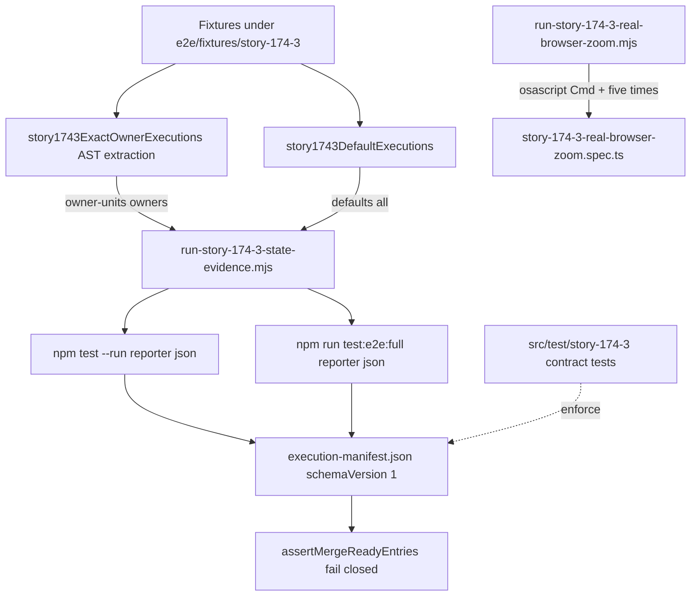
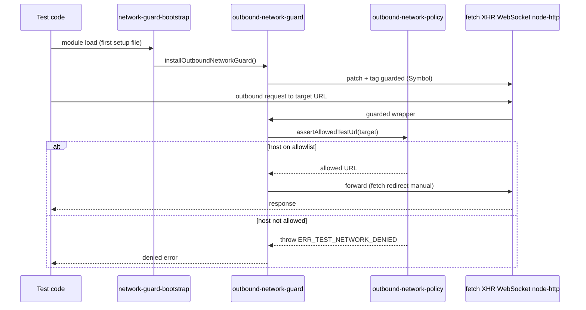
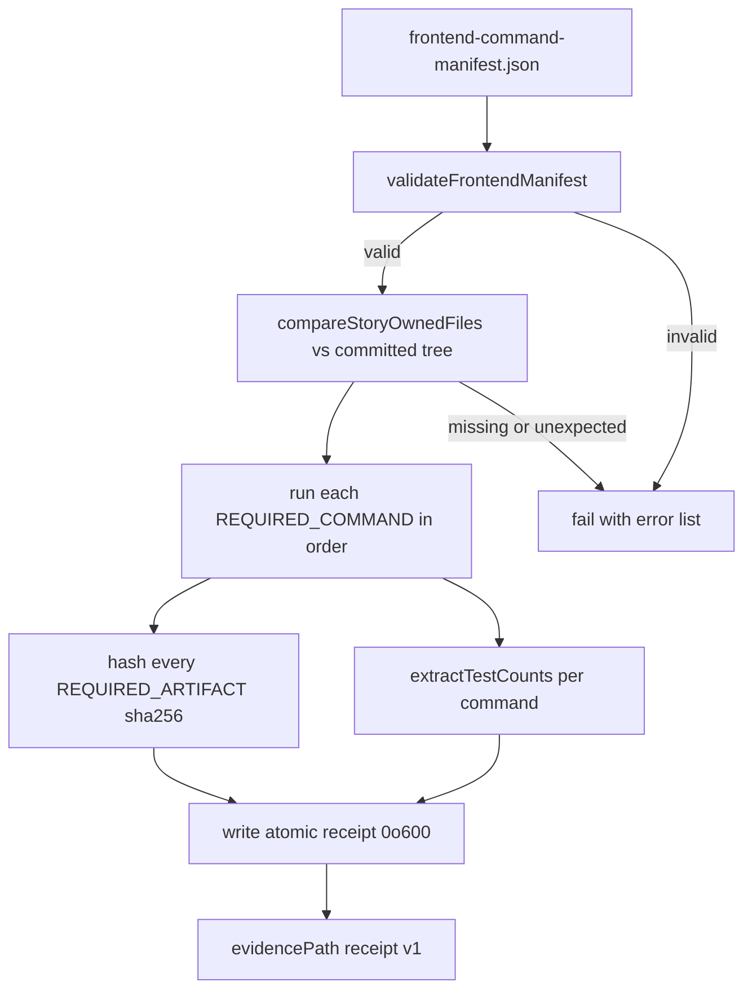

# Testing & Operations

## Unit Tests — Vitest

**Config**: `vitest.config.ts`

| Aspect | Detail |
|--------|--------|
| Environment | `jsdom` with 10 MB localStorage quota |
| Plugin | `@vitejs/plugin-react` |
| Coverage | V8 provider (text/json/json-summary/html reporters), output `coverage/local` |
| Fake timers | `shouldAdvanceTime: true` (waitFor/MSW compatibility) |
| Full-suite floor | ≥ 19,118 tests passing across 1,234 test files (0 failed) — raised after Story 174.2-FE; a full `npm test -- --run` run must not regress this floor |

### Test setup (`src/test/`)
Setup files run in explicit list order (`sequence.setupFiles: 'list'`) defined by `VITEST_SETUP_FILES` in `vitest.config.ts`. Order is load-bearing: the outbound network guard must install **before** any general setup or MSW import, or module-evaluation-time network attempts would escape the guard.

- `network-guard-bootstrap.ts` — **first entry**; calls `installOutboundNetworkGuard()` so transport interception exists before any other module is evaluated (see [Outbound Network Guards](#outbound-network-guards))
- `fixtures/module-evaluation-network-attempt.ts` — load-time assertion that the guard was installed before module evaluation; throws if a `node:http` request to an external host is not denied
- `localStorage-polyfill.ts` — pre-MSW polyfill
- `setup.ts` — Testing Library `jest-dom` matchers, MSW server lifecycle (`server.listen()` / `resetHandlers()` / `close()`), Radix UI browser API mocks (ResizeObserver, pointer capture, scrollIntoView)
- `test-utils.tsx` — Custom render helpers

### Test file organization
Tests are co-located with source in `__tests__/` directories:
- `src/hooks/__tests__/` — ~140+ files (custom hooks, data fetching, mutations, polling)
- `src/lib/__tests__/` — ~100+ files (utilities, formatters, calculators, API client)
- `src/styles/__tests__/` — Tailwind v4 semantic token contract and PostCSS-compiled WCAG contrast regression (see [Design System](design-system.md#token-regression-tests))
- `src/components/ui/__tests__/` — shadcn primitive behavior, semantic-surface, palette, portal, focus, reduced-motion, and compatibility contracts (see [Design System](design-system.md#primitive-regression-tests))
- `src/components/product/__tests__/` — `PageHeader`/`Breadcrumbs`/`ContextBar` composition rendering and source contracts (see [Design System](design-system.md#product-composition-regression-tests))
- `src/app/(dashboard)/**/__tests__/` — **presentation-source contract** suites co-located with each route tree (dashboard, communications, COGS single/bulk/history, automation canned/installed rules, and the analytics feature trees). Each pins the route's production-file catalog (per-file identity, anchor-safe `__tests__` exclusion), forbids legacy palette classes and contextual hex over that catalog, and pins semantic-token valence contracts (e.g. Story 172.9's status-success/error, destructive alerts, unread counter, ghost ui-Button rows). These micro-guards are owned per story/surface and are the unit-level counterpart to the E2E specs below.
- `src/stores/__tests__/` — 7 files (Zustand stores)
- `src/types/__tests__/` — 13 files (type guards, runtime validators)

**Naming**: `*.test.ts` (logic), `*.test.tsx` (component/JSX), plus specialized variants like `*.bug-fix.test.tsx`, `*.story-NN.test.ts`.

### MSW (Mock Service Worker)
`src/mocks/server.ts` — MSW v2 server for intercepting API calls in unit tests. Handlers are reset between tests via `server.resetHandlers()`.

### Full-suite floor history
The floor is a floor, not a substitute for fresh per-story validation. It moves down legitimately only when tests are provably deleted with their production owners:

- **Current accepted baseline (CLAUDE.md, `npm test -- --run`): ≥ 19,559 passing / 0 failed.** That is the 19,118 floor established by Story 174.2-FE (2026-08-31) plus +237 tests from the Story 174.3 window, +8 contract tests from 174.4, +52 redact-suite tests from debt-FE-D9, +6 nonce-mint tests (D-1/PB-1), +3 urgency-tier tests (C15), +12 reactive-refresh tests (D-2/PB-3), +3 wave-3 AA re-pins, +9 `/80`-sweep style pins, +16 FE-D3 sanitizer pins, +28 FE-D1 retry/ApiError-preservation pins, +29 FE-D5 web-locks/claim suite, +16 fe-d3-family hook-fallback pins, and +22 wave-6 WCAG style pins. The 174.2 floor itself moved from 19,874/1,256 by an exact −756 tests / −22 files, entirely from 65 proven-dead test files deleted together with their dead production owners (import-closure proved per file, reviewer-verified) — no live test was deleted.
- **Per-story peaks are historical**, not the current bar: e.g. the 19,874 peak observed after Story 173.13 was superseded by the legitimate 174.2 dead-test deletion, then by the 174.3/174.4/debt-FE-D9 additions. Record the current accepted baseline, not historical counts, when validating. When a story legitimately moves a baseline, update the CLAUDE.md table in the same PR.
- `vitest.config.ts` excludes the two `node:test`-only self-suites (`scripts/__tests__/check-shadcn-migration-parity.test.mjs`, `scripts/__tests__/check-shadcn-ui-boundary.test.mjs`) from the Vitest run — they run under `node --test` from their own scripts instead.

## E2E Tests — Playwright

**Config**: `playwright.config.ts`

| Aspect | Detail |
|--------|--------|
| Test directory | `./e2e/` (~95 `.spec.ts` files, including the `settings/`, `shipments/`, `supplies/`, `analytics/`, and `automation/` subdirectories plus the Story 174.3 specs) |
| Base URL | `http://localhost:3100` (overridable via `E2E_BASE_URL`, validated against the network policy allowlist via `assertAllowedTestUrl`) |
| Projects | `setup` (auth, uses storage state) → `chromium` (desktop, depends on setup); `historical-spp` (self-contained, empty storage state, skips `setup`) for the Story 128.27 exact-command spec |
| CI behavior | 2 retries, 1 worker, `forbidOnly: true`, auto-starts dev server |
| Dev behavior | 0 retries, reuse existing server |
| Diagnostics | `trace: 'off'`, `screenshot: 'off'`, `video: 'off'` — raw browser capture is disabled by default because it can retain URLs, storage, headers, or bodies (Story 128.10) |
| Service workers | `serviceWorkers: 'block'` — BrowserContext routing cannot intercept service-worker-owned traffic |

`playwright.config.ts` imports `src/test/network-guard-bootstrap` as its first statement so the Node-side outbound network guard is installed before any test file evaluates. It also imports `scripts/e2e-preflight-handshake.mjs` and, for non-CI runs, enforces a fresh preflight handshake before collection (see [Local E2E Preflight](#local-e2e-preflight)). The guarded Playwright runtime is supplied to specs via the custom fixtures in [Outbound Network Guards](#outbound-network-guards).

### Notable fixtures
- `e2e/auth.setup.ts` — Authentication setup with storage state at `e2e/.auth/user.json`
- `e2e/auth-manager.setup.ts` — Manager-role auth setup (matched by the `.*\.setup\.ts` setup project)
- `e2e/fixtures/mutation-guard.ts` — Conditionally skips `@mutating` tests via `grepInvert`
- `e2e/fixtures/network-test.ts` — Extends the Playwright `test` object with the guarded facade and a `networkGuard` fixture (deny counter / snapshot)
- `e2e/fixtures/playwright-network-guard.ts` — Guarded Playwright object graph (see [Outbound Network Guards](#outbound-network-guards))
- `e2e/fixtures/story-172-8-price-calculator.ts` — Story 172.8 tariff-reference mocks for the price calculator (see below)
- `e2e/fixtures/story-172-9-communications.ts` — Story 172.9 communications route controller with exact API paths and flippable per-section status (see below)

### E2E test areas
Dashboard, orders, supplies, shipments (incl. SKU packaging, Story 173.11), margin analytics, FBS, COGS, pricing calculator (Epic 44-FE + Story 172.8), liquidity (with trends, Story 165.4), unit economics, advertising, funnel, search analytics, forecasts, Moysklad integration, finances (NEW-7), backfill admin (per-source retry, Story 165.5), communications (Story 172.9), accessibility, settings, monitoring, historical SPP analytics (Story 128.27), reactive 401 refresh (D-2/PB-3, `e2e/auth-reactive-refresh.spec.ts`), onboarding cabinet-create nonce-less-session coverage (D-1/PB-1, `e2e/onboarding-cabinet-create-nonce-mint.spec.ts`), plus `e2e/outbound-network-guard.spec.ts` which exercises the guard itself end-to-end. Story 174.3 added three more top-level specs: `e2e/shadcn-migration-visual-accessibility.spec.ts` (the 76-route inclusive visual/a11y matrix — see [Design System](design-system.md#the-story-1743-inclusive-visual-contract)), `e2e/story-174-3-dedicated-route-evidence.spec.ts`, and `e2e/story-174-3-real-browser-zoom.spec.ts` (see [Story 174.3 Evidence Runners](#story-1743-evidence-runners)).

### Story 172.8 — price calculator (`e2e/price-calculator.spec.ts`)

`mockPriceCalculatorTariffReferences` (in `e2e/fixtures/story-172-8-price-calculator.ts`) fulfills the three tariff-reference endpoints (`/v1/tariffs/warehouses-with-tariffs`, `/v1/tariffs/acceptance/coefficients/all`, `/v1/tariffs/commissions`) with deterministic fixtures in `test.beforeEach`. Rationale: the real backend protects these reference endpoints with strict per-minute limits, and the UI suite opens/reloads `/cogs/price-calculator` in many independent tests — live reference data would make the JS-error smoke flaky and hide real UI regressions behind backend 429 noise. Live tariff contracts are exercised by separate backend-connected smoke coverage; this spec validates UI behavior (margin slider zones, form validation, calculation results, reset confirmation, Escape keyboard handling, WCAG 2.1 AA and mobile responsiveness). Fields are driven through real Playwright actions so React Hook Form receives browser events.

### Story 172.9 — communications (`e2e/communications.spec.ts`)

`installStory1729Routes(page, mode)` pre-registers **exact-API-path** routes (no `**` globs) for the six `/v1/communications/*` endpoints and fulfills them from in-memory fixtures shaped to the pre-normalizer contract (`src/lib/api/communications-normalizer.ts`, nulls preserved). Modes are `'populated' | 'empty'` with an error variant via `setSectionStatus` (e.g. flip 500 → 200 mid-test for the retry assertion). The spec follows the 163.3 observable-wait canon: `waitForResponse` pre-registered **before** the triggering action, `toBeVisible` terminal states, no hard waits, no `networkidle`; the first test in the file tolerates the dev-server cold compile of `/communications` (>10 s observed) with a 30 s response wait. Coverage matches the plan's state matrix: populated sections with RU labels, rating stars (aria-labeled), answer/pin status chips, unread badge, chat thread drill-in with unread counter, empty markers, section error + retry, and tab selection preserved across switches.

### Story 172.10 — finances & documents (`e2e/finances.spec.ts`, NEW-7)

Covers balance populated/empty/error, the documents list with category filter and pagination (a 25-row fixture exceeds `DEFAULT_PAGE_SIZE = 20` so the Next-page button is enabled and an `offset>0` fetch fires), and the download route being hit when the download button is clicked. All API calls are stubbed via `page.route` with `waitForResponse`/`expect.poll`/`toBeVisible` observable waits only (no `waitForTimeout`, no `networkidle`).

**Story 172.10 repair pattern — end-anchored globs vs query strings.** Playwright glob patterns are end-anchored: the old `'**/v1/finances/documents'` glob never matched the real request because the documents query **always** carries `?locale=ru&limit=…`. The stub silently missed, and the page rendered live-backend documents instead of fixtures while the test stayed green. Both `DOCS_API` and `CATEGORIES_API` now use RegExp route matchers of the shape `/\/v1\/finances\/documents(?:\?.*)?$/` which cover the request with and without a query string and cannot collide with sibling endpoints (`/documents/categories`, `/documents/*/download` continue with `/` after `documents`, not `?` or end-of-URL). Lesson: when a request URL carries query parameters, either include a trailing `**` or use a RegExp — an end-anchored glob without it produces a silently-passing, non-intercepting stub.

### Story 172.11 — monitor (`e2e/monitor.spec.ts`)

Epic 92-FE coverage (KPI cards, metrics table, weekly chart, buyout gauge, pipeline panel) plus empty-state tests that mock exactly one endpoint each (`emptyMonitorSummary`, `emptyPipelineGrid`, `mockEmptyDailyMetrics` — the last mocks **all four** daily endpoints because `useDailyMetrics` fires them in parallel). It follows the domcontentloaded + landmark canon (no `networkidle` — the monitor page runs background polling that never settles) and uses visible `test.skip(condition, reason)` rather than silent returns.

**Story 172.11 repair pattern — strict-mode locator ambiguity.** The BD-22 rename (PR #41) added a second weekly-chart legend item «Продажи + Возвраты», so the previous `/Продажи/` regex locator resolved **two** elements and failed Playwright strict mode — an ambiguity pre-existing on `main`. The repair pins `getByText('Продажи', { exact: true })` scoped to the `monitor-weekly-chart` landmark. Lesson: substring/regex locators over mutable UI text are strict-mode hazards; scope assertions to a landmark (L-3 canon) and prefer `exact: true` when a label can be a prefix of another.

### Settings pages (`e2e/settings-pages.spec.ts`)

Covers `/settings/cabinet`, `/settings/tariffs`, `/settings/notifications`, `/settings/tax`, `/settings/expenses`, and `/settings/backfill` plus the shared settings shell. Beyond per-page heading/landmark and data-or-skeleton assertions, it pins:

- The canonical desktop navigation: the exact seven-item ordered link list (Обзор, Кабинет, Уведомления, Налоги, Тарифы, Расходы, Импорт) with `aria-current="page"` on exactly one visible current item per route, and the sidebar rendered left of the H1 at 1280×900.
- The compact Sheet (390×844, reduced motion): dialog visibility, current-item `aria-current`, keyboard focus containment over 12 Tab and 12 Shift+Tab presses, Escape closing and returning focus.
- Light/dark theming via `localStorage.theme` + reload with class-regex assertions on `<html>`, horizontal-overflow checks (`main.scrollWidth ≤ clientWidth + 1`), and per-page axe scans (`wcag2a`, `wcag2aa`, `wcag22aa`) requiring zero violations.

### Backfill admin specs (`e2e/settings/backfill-admin.spec.ts`, `e2e/settings/backfill-a11y.spec.ts`)

Story 173.2 migrated the backfill admin page to `/settings/backfill` with two dedicated specs (both import `test`/`expect` from `../fixtures/network-test`):

- **`backfill-admin.spec.ts`** — deterministic Owner-shell coverage of `/settings/backfill` against a stubbed `**/v1/admin/backfill/status`: per-cabinet dual-pipeline status (reports vs analytics: `in_progress`/`pending`/`failed`/`paused`/`completed`/`not_started`), progress percentage with ETA rendering, `lastError` display, and `@mutating`-guarded interactions behind `shouldSkipMutatingE2E`.
- **`backfill-a11y.spec.ts`** — axe-core WCAG 2.1 AA scans (including a dense eight-cabinet mixed-status fixture with a very long RU cabinet name to prove wrapping without horizontal overflow), keyboard navigation, dialog focus management, ARIA/role support, and layout cases at 320/390/768/1024/1280/1440 px. It uses the Story 162.8 bounded-settle pattern: the page must resolve to one of two terminals (Owner shell heading «Управление бэкфиллом» or its fallback) with no open-ended polling wait.

### Shipments specs (`e2e/shipments/*.spec.ts`)

Story 173.8 (list) and 173.9 (detail) restored dedicated shipments e2e packages:

- **`shipments-list.spec.ts`** — `/shipments` list coverage driven by a switchable scenario fixture (`default`/`empty`/`error`/gated `pending`): DRAFT vs CONFIRMED status filtering, pagination, the create-shipment dialog, empty and error states.
- **`shipments-detail.spec.ts`** — `/shipments/story-173-9-detail` detail coverage stubbing `**/v1/shipments/story-173-9-detail`: header, pallet accordion, box-line table with per-line allocation results (calculated vs pending lines), draft-vs-confirmed action buttons, plus an axe scan.
- The subdirectory also carries `shipments-a11y.spec.ts` and `shipments-lifecycle.spec.ts`; `e2e/supplies/` mirrors this shape for supplies (list/detail/lifecycle/a11y).

### SKU Packaging (`e2e/sku-packaging-page.spec.ts`, Story 173.11)

Deterministic coverage of the SKU-packaging management page (`ROUTES.shipmentsSkuPackaging`), importing `test`/`expect` from `./fixtures/network-test` — a representative new-spec pattern the static boundary exercises:

- `installSkuPackagingApiFixtures(page)` registers **exact-method, exact-query** `page.route` handlers (RegExp matchers) for `GET/POST /v1/sku-packaging`, `POST /v1/sku-packaging/bulk`, `DELETE /v1/sku-packaging/{nmId}`, and `GET /v1/box-types`; every unexpected method/path/payload throws inside the handler, so a silently-missed stub cannot pass. Wire contracts are pinned exactly: the single-upsert POST body must equal `{ nmId, boxTypeId, unitsPerBox: 18 }` (asserted again via `waitForRequest` post-data), the bulk POST must equal the one-item `BULK_PAYLOAD`, and DELETE must carry no body.
- UI coverage: populated rows (active vs inactive box-type statuses «Привязка активна» / «Тип коробки неактивен»), client-side search filter with filtered empty state and «Показать все привязки» reset returning focus to the search field, bulk-add preview→submit flow with terminal `role=status` announcements, delete confirmation dialog, keyboard-driven validation with first-invalid focus, and 320/390 px narrow-card layout with the wide table hidden and a no-horizontal-overflow check.
- All routes are installed in `beforeEach` **before** navigation so scenarios never accept a live-backend terminal state; waits follow the observable-wait canon (`waitForRequest` pre-registered before the triggering click, `toBeVisible` terminals, `domcontentloaded`).

### Reactive 401 refresh (`e2e/auth-reactive-refresh.spec.ts`, D-2/PB-3)

Defect-pinned **synthetic** spec for the reactive 401-refresh interceptor (`src/lib/api-client-refresh.ts` + the 401 gate in `src/lib/api-client.ts`). Page under test is `/analytics/alerts` — the lightest data-bearing dashboard route — where the summary KPI «Всего за 7 дней» renders data-dependent content on success and the em-dash placeholder once the query terminal-fails, making the 401 → refresh → replay outcome directly observable:

- A single wildcard `page.route` dispatcher fulfills every `/v1` call locally (deterministic wire control): `POST /v1/auth/refresh` → 200 `{ data: { token } }` (test 1) or 401 (test 2); `GET /v1/alerts/summary?days=7` → first call 401, replay 200 (test 1) or always 401 (test 2); rules/history and dashboard-shell calls → benign 200 fixtures; catch-all → `200 {}` so a non-enumerated local call cannot break the shell. The refresh envelope unwraps via `rawData.data ?? rawData`, so both the annex flat form and the `{ data: { token } }` envelope work.
- Session seeding mirrors the D-1 canon (see below): empty storageState + init-script auth-storage + `auth-token` cookie, with JWT payloads that are **real base64url of the JSON** — a corrupted payload makes `isTokenExpired()` fail-safe to true and logs the session out mid-test.
- Test 1 pins the recovery chain (401 → single refresh → replay with the rotated token → KPI renders); test 2 pins the failure chain (refresh 401 → terminal failure surfaces, no retry loop). The live backend contract chain (refresh 200 + single-use revocation 401 `TOKEN_REVOKED` + health) was verified separately per the D-2 annex record.

Its unit-level counterpart is `src/lib/api/__tests__/api-client-401-refresh.test.ts` (MSW), which pins the actual post-D-2 wire behavior: single-flight refresh fired once, exactly one replay with the rotated store token, replay 401 → the original `ApiError` surfaces (no second refresh, no loop); the M1 rotation-cascade gate (a failed request whose wire token differs from the store token joins a pending rotation instead of triggering a second refresh); the M2 refresh deadline (a black-holed refresh POST is aborted at `DEFAULT_REFRESH_DEADLINE_MS` = 10 s and treated as refresh failure); `createCabinet` opting out of reactive replay; and L1+L2 wire-level replay parity (method, byte-parity body, `Idempotency-Key`, `X-Cabinet-Id`). Handler assertions live in the test after the `await`, never inside MSW handlers (an in-handler `expect` failure surfaces as an opaque unhandled rejection).

### Onboarding cabinet create — nonce-less session (`e2e/onboarding-cabinet-create-nonce-mint.spec.ts`, D-1/PB-1)

Synthetic-seeding spec (Story 167.5 canon) covering cabinet creation from a legacy nonce-less session:

- **[P0] — the true D-1 defect pin.** Seeds a *normal* nonce (Story 167.5 family), then nulls the live store's nonce **after** rehydration via the only supported path — a cross-tab `storage` event from a second page in the same context (a same-tab `setItem` does not fire it). With D-1's initiation mint (`authStore.ensureSessionNonce`, mint-before-capture in `handleCreateCabinet`), the create settles `applied` and the user reaches the WB-token step; without it the captured nonce is `null` → `indeterminate` → the create is silently swallowed and the spec fails (stays on `/cabinet`). The initiation mint is also pinned by `src/services/cabinets.service.settlement.test.ts`.
- **[P1]** is a composite regression check of the nonce-less-session *class* (rehydrate mint + form usability), not a D-1 defect pin — the user-visible fix for legacy sessions was predominantly the Story 167.9 rehydrate mint already on main.
- The same base64url JWT lesson applies: synthetic token payloads must be real base64url of the JSON, or `isTokenExpired()` fails-safe to true, the proactive refresh fires, and the session logs out mid-test. Init-script seeding omits the nonce key entirely for legacy sessions (Playwright serializes `undefined` init args to `null`, hence a truthiness check).
- Its FE-D5 sibling `e2e/onboarding-cabinet-create-cross-tab.spec.ts` pins cross-tab cabinet-create duplicate prevention (Web Locks + claim): two tabs of the same context submit the create form simultaneously, tab A's `POST /v1/cabinets` is held open by a deferred route gate so it genuinely holds the lock, and exactly **one** POST may reach the wire — tab B must end blocked with RU copy instead of creating a duplicate multi-tenant cabinet. On unfixed code tab B mints its own `Idempotency-Key` and POSTs, failing the POST-count assertion. The broader onboarding wizard flow is covered by `e2e/onboarding.spec.ts`.

- `e2e/expenses-page.spec.ts` and `e2e/backfill-page.spec.ts` cover their settings routes with the same shell conventions (headings/landmarks, data-or-skeleton, theme and overflow assertions).
- `e2e/telegram-notifications.spec.ts` covers the Telegram binding lifecycle (status types with `bound`/`telegram_user_id`/`binding_expires_at`, notification preferences, quiet hours) and mutation success/failure/pending modes via `page.route` stubs, with axe scans. A former duplicate at `tests/e2e/telegram-notifications.spec.ts` is **no longer present** in the current tree; only the `e2e/` copy exists. (The Playwright static boundary still scans the `tests/e2e/` path prefix defensively — see [Outbound Network Guards](#outbound-network-guards).)

These specs run against the local stack only (frontend `:3100`, backend `:3000`); the project has no deployment target.

> **Note**: A hosted Tier 0 runtime certification harness and governed coverage certification system previously lived here. Both were removed when the project replaced hosted certification with local validation gates. The remaining quality gates are documented in [Conventions & Quality Gates](conventions-and-quality.md).

### E2E assertion and wait quality gates (Stories 162.3–162.7)

Two AST-based scanners enforce AP#6 (vacuous E2E assertions) and AP#7 (hard `waitForTimeout` waits) across the E2E specs touched by Epic 162. They mask comments/strings and regex literals before scanning so prohibited patterns cannot hide in prose, and each owns an explicit per-story file list:

- **Vacuous assertions** — `scripts/check-e2e-vacuous-assertions.mjs` (`npm run check:e2e-assertions`) flags tautological matchers such as `expect(x >= 0).toBeTruthy()`, `expect(true).toBeTruthy()`, and `toBeGreaterThanOrEqual(0)` that cannot prove content exists. Owned files: `STORY_162_3_E2E_FILES` (analytics/finance specs) and `STORY_162_4_E2E_FILES` (operations/settings/supplies/COGS/price specs). Self-test: `src/test/e2e-vacuous-assertions.test.ts` (runs under `npm test`).
- **Fixed waits** — `scripts/check-e2e-fixed-waits.mjs` (`npm run check:e2e-waits`) flags `waitForTimeout`, raw `setTimeout`/`new Promise(setTimeout)` timers, and arbitrary wait helpers (`sleep`, `delay`, `pause`). Each story baseline (`STORY_162_5`/`162_6`/`162_7`) pins its owned E2E + fixture file set and the canonical wait/timer counts reduced from the story's base revision. Self-test: `src/test/e2e-fixed-waits.test.ts` (runs under `npm test`).

These are not in the `README.md` **Local validation** command list; they are enforced as quality gates via their Vitest self-tests and the dedicated npm scripts. See [Conventions & Quality Gates — Quality Gates](conventions-and-quality.md#quality-gates-ratchet-scripts) for how they sit alongside the other gates.

## Story 174.3 Evidence Runners

Story 174.3 (inclusive accessibility/responsive/theme/visual verification) added a dedicated evidence layer on top of the ordinary E2E suites: dedicated-route evidence specs, a real-browser-zoom orchestrator, a fail-closed state-evidence runner that materializes a committed execution manifest, and a large typed fixture corpus under `e2e/fixtures/story-174-3/`. The 76-route matrix contract itself is documented in [Design System](design-system.md#the-story-1743-inclusive-visual-contract); this section covers the operational tooling.

Figure: the state-evidence runner extracts literal owner-scenario declarations from the fixtures, executes them via the standard npm wrappers with JSON reporters, and rewrites the committed execution manifest; the zoom orchestrator drives actual macOS browser UI zoom into the skipped-by-default zoom spec.

### Shared runner support (`e2e/support/story-174-3-*.ts`)

Three modules, all importing `expect` and types from `../fixtures/network-test` (so they live inside the guarded Playwright runtime):

- **`story-174-3-runner-core.ts`** — the settled-route and evidence primitives: `EXPECTED_ROUTE_COUNT = 76`, `MATRIX_HEIGHT = 900`, `ROUTE_SETTLE_TIMEOUT = 15_000`; `assertSettledRoute` (polls the exact pathname — redirectors must settle on one of their declared final routes — a settled `document.readyState`, zero Next.js error markers, exactly one visible `h1`, and rejection of generic error/not-found shells, then checks the route's identity contract: `static-h1`/`materialized-h1` exact text, `backend-h1` landmark with pattern + forbidden texts, `route-landmark` accessible name, or `redirector` destination heading); `applyTheme` (localStorage `theme` + reload + `.dark` class regex); `prepareSessionProfile` (unauthenticated-onboarding routes get cookies cleared and auth-storage keys removed via `addInitScript` so their own UI renders instead of the guard redirect); `measureComputedTextContrast` (in-page canvas-composited WCAG contrast evidence); `summarizeAxeViolations`, `readEvidenceLine`, and `evidenceSha256` (SHA-256 of cited evidence files).
- **`story-174-3-runner-interactions.ts`** — `assertKeyboardFocus` (Tab-walks the route-owned interactive set — excluding `header/nav/aside`, devtools overlays, and disabled controls — requiring a visible focus target with focus-specific computed styling) and overlay/focus exercises (`reachByKeyboard`, `assertOverlayInventory`).
- **`story-174-3-runner-surfaces.ts`** — executes the table/chart surface contracts live (expected counts of live tables/charts, pagination semantics, chart/table framing).

### Dedicated-route evidence (`e2e/story-174-3-dedicated-route-evidence.spec.ts`)

Closes the evidence gaps the canonical matrix could not prove per-route: `/analytics/brand-share`, `/analytics/buyout`, and `/orders/fbo` each get a settled-route + exact-h1 assertion (via `assertDedicatedRoute` with reduced motion), and the dynamic `/analytics/models/[id]/evaluations/sku-accuracy` route gets full deterministic coverage — an exact-method/exact-query `page.route` for `GET /v1/ai/evaluations/sku-accuracy?modelId=…` (fulfilling a two-SKU fixture), the exact table caption, sorted/ordered rows with localized percentage formatting, `aria-sort` ascending/descending toggling, viewport containment at 1280 and 390 px (no non-`-1` `tabindex`/stray `role` on rows), and the Enter-driven drill-in to `?nmId=…` with the exact detail text.

### Real-browser zoom (`scripts/run-story-174-3-real-browser-zoom.mjs` + `e2e/story-174-3-real-browser-zoom.spec.ts`)

The zoom spec is `test.skip` by default and runs only through its macOS headed orchestrator:

- The orchestrator refuses to run off `darwin`, off Node `v24.18.0`, or without `STORY_174_3_NPM_CLI` naming the pinned npm `11.11.0` CLI (verified before spawning). It spawns `npm run test:e2e:full -- e2e/story-174-3-real-browser-zoom.spec.ts --project=chromium --workers=1 --headed --grep 'real browser 200 percent zoom'` with `STORY_174_3_REAL_BROWSER_ZOOM=1` and a private `STORY_174_3_ZOOM_READY_FILE` in a temp directory.
- The spec writes the ready file (`wx`) once it has a baseline `devicePixelRatio`/`innerWidth`; the orchestrator polls for it (120 s), finds the single headed Chromium browser process (descendant-PID walk over `ps`, matching `--remote-debugging-pipe` without `--type=`), and applies **actual macOS browser UI zoom** via `osascript` System Events (`Cmd+0` reset, then five `Cmd+Plus` presses). The spec's `expect.poll` waits until `devicePixelRatio` at least doubles.
- The proof is explicitly **not a CSS-zoom proxy**: root `zoom` must remain `1|normal`, `devicePixelRatio` must at least double, and `innerWidth` must shrink correspondingly (≤ baseline/1.9). At that zoom, all 76 routes must keep the document bounded (`scrollWidth ≤ clientWidth + 2`) with `main` inside the viewport, in **both themes**; authenticated routes run first, then `prepareSessionProfile` clears the session and the unauthenticated-onboarding routes run. Cleanup kills the child and removes the temp root.

### State-evidence runner (`scripts/run-story-174-3-state-evidence.mjs`)

A fail-closed orchestrator for the committed execution manifest `e2e/fixtures/story-174-3/execution-manifest.json` (invoked as `npm run evidence:story-174-3:states` or `node scripts/run-story-174-3-state-evidence.mjs [mode]`):

- Modes: `--owner-units` (Vitest owner tests), `--owner-browsers` (Playwright owner specs), `--dedicated-routes` (only `e2e/story-174-3-dedicated-route-evidence.spec.ts`), `--owners` (both owner groups), `--defaults` (the 76 canonical matrix defaults, run with `STORY_174_3_RECORDING_DEFAULTS=1`), and `--all`. Required executions are extracted from the fixture sources by `scripts/lib/story-174-3-execution-requirements.mjs` (TypeScript-AST parse accepting only literal `source`/`scenarioId`/runner arguments, with per-source SHA-256 pinning).
- It runs Vitest with `--reporter=json` and Playwright through the `test:e2e:full` wrapper (so the preflight gate still applies) with `PLAYWRIGHT_JSON_OUTPUT_FILE` in a temp directory, maps each required scenario id to its recorded outcome, and throws on any scenario missing from the runner output, any non-`passed` result, or a non-zero exit code ("evidence run failed closed"). Playwright outcome mapping keeps the top-level spec-file identity through the `network-test` wrapper instead of letting the fixture file substitute for the spec.
- The manifest is rewritten only with deduplicated, sorted entries (`schemaVersion: 1`, runtime node/npm, command, exitCode, startedAt, durationMs per entry). The `--defaults` mode additionally requires that `--owners` ran first (full owner coverage present) and calls `assertMergeReadyEntries`: every merge-ready entry must match the expected `sourceSha256`/runner exactly, be `passed` with exit 0 and a valid command/timestamp/duration — anything stale, missing, unexpected, or incomplete throws before the manifest is written.
- Reader/contract enforcement lives in `scripts/lib/story-174-3-manifest.mjs` and `src/test/story-174-3-{manifest-reader,state-contract,surface-contract,manual-evidence-contract}.test.ts` (the Vitest-side guarantees; see [Migration Program](migration-program.md#story-1743-the-inclusive-visual-matrix-and-its-evidence-pipeline)).

### Fixture corpus (`e2e/fixtures/story-174-3/`)

~30 typed modules feeding the runners: `route-evidence.ts`/`route-contracts.ts`/`state-evidence.ts` (the 76-route registry and state dispositions), `state-scenarios*.ts` and the `owner-state-evidence-{a,b,c}*` families with their `owner-state-exceptions*` and `owner-state-reconciliation.ts` (owner-test bindings and N/A reconciliation), the surface inventories `table-inventory.ts`, `chart-inventory.ts`, and `overlay-inventory.ts` (import-time anchor verification against cited production files), `surface-types.ts`, `dedicated-route-scenarios.ts`, `manual-evidence.ts` (the operator-driven manual ledger), and the execution-manifest pair. Changing any cited source invalidates its recorded SHA-256 and the next `--defaults` merge-ready check fails closed.

## shadcn Gate Scripts (Stories 174.1 / 174.2)

The Epics 166–174 shadcn migration added two Node-based gate scripts. Neither has an `npm run` alias — invoke them directly with `node scripts/…`. Both run a `node:test` self-suite **first** and fail fast if it fails; both self-suites are excluded from the Vitest run (`vitest.config.ts` exclude list) because the Playwright static boundary forbids `node:child_process`/dynamic execution in files Vitest would pick up (the parity self-suite is explicitly whitelisted in `SELF_TEST_MODULES`).

### `check-shadcn-migration-parity.mjs` (Story 174.1)
Schema-v3 parity validator over three corpora: the BMAD story artifact (`_bmad-output/planning-artifacts/epics-166-174-fe-shadcn-migration.md`, 94 stories with 12 pinned `EVIDENCE_FIELDS` and per-epic section profiles), the master OMX plan (`.omx/plans/shadcn-full-ui-migration-master.md`, ownership/dependency SHA-256 fingerprints, expected base SHA, backend-exception lifecycle records for 167.8/169.14), and the route ledger (exactly 76 rows). It proves 94 BMAD stories = 94 OMX plans and 76 source routes = 76 ledger rows with unique owners and linked implementation artifacts. It is filesystem-only (dependency-free), runs a deterministic mutation self-suite (`scripts/__tests__/check-shadcn-migration-parity.test.mjs`, 33 cases over a deep-cloned real corpus asserting exact `{ code, identity }` defect records) before validating the canonical corpus, and emits one machine-readable report plus one human summary per run.

### `check-shadcn-ui-boundary.mjs` (Story 174.2)
Design-system boundary ratchet over production `src/**/*.{ts,tsx}` (tests, `__tests__`, `.d.ts`, and `src/test/**` excluded; enumeration is relative-first so foreign worktree paths cannot re-enter). Two detection classes form the superset regex canon — `LEGACY_PALETTE` (the monitoring-172.12 guard form extended with `ring-offset`, `shadow`/`inset-shadow`/`text-shadow` prefixes) and `CONTEXTUAL_HEX` (quote/backtick or `-[`-anchored hex with a trailing lookahead, plus rgba/hsl/hsla/oklch color functions). Violation counts are grouped per route, totaled, and compared against the single-integer baseline `scripts/.shadcn-ui-boundary-baseline.txt` (**372**; born at 523 in 174.2, lowered to 401 by the 174.4 re-run after the 174.3-window raw-class removals, then ↓58 in the Margin-family wave-1 removals and ↓29 in wave-2 plus the D-4 `/15→/5` fold-in, 2026-09-03): a plain run exits 0 at or below the baseline, exits 1 only on increase, and a decrease must lower the baseline in the same commit. There are no file-level waivers — suppression is only via the exported `BOUNDARY_EXCEPTIONS` map (3 files: the C5 waterfall categorical hex and two historical `#7C3AED` chart marks; the former F-10 WCAG-contrast exception was lifted 2026-09-02 when PB-4 was fixed), each entry carrying an owner/debt ID and mirrored 1:1 in the classification manifest. Self-suite: `scripts/__tests__/check-shadcn-ui-boundary.test.mjs` (10 `node:test` cases proving the regexes and enumeration logic). See [Design System — boundary enforcement](design-system.md) for the canon's regex details and the arithmetic-closed manifest.

A concrete repaired example of AP#6 (vacuous assertion): the `e2e/login-dashboard.spec.ts` "displays trend graph" check used a `[data-testid="trend-graph"]` selector that only matched unit-test mocks — the real `TrendGraph` never rendered it — and its `.or()` recharts fallback matched the always-mounted `DailyBreakdownChart`, so the test stayed green even if `TrendGraph` were deleted. The contract now puts `data-testid` on the real `TrendGraph` Card (`src/components/custom/TrendGraph.tsx`), and the test expands the «Аналитика» disclosure first (lazy unmount) with no `.or()` fallback. When adding data-testid contracts, bind them to the real component, not to mocks, and prefer expanding collapsed containers over broad `or()` fallbacks.

## Local E2E Preflight

Story 162.2 introduced a reproducible localhost preflight that gates every local Playwright run. Raw `npx playwright test` invocations are rejected so they cannot silently reuse stale ignored auth state.

| Script | Command | Purpose |
|--------|---------|---------|
| Bounded smoke | `npm run test:e2e` | Preflight checks, refresh auth state, run `e2e/orders.spec.ts` on Chromium (read-only) |
| Full suite | `npm run test:e2e:full` | Same preflight, full suite |
| Diagnostics only | `npm run test:e2e:preflight` | Validate config + services, print the exact next command (no Playwright launch) |
| UI mode | `npm run test:e2e:ui` | Full suite with Playwright UI |

**Preflight** (`scripts/e2e-preflight.mjs`) validates the `.env.e2e` configuration and probes both localhost services (`:3100/login`, `:3000/v1/health`) before Playwright collection. It removes only the two ignored auth-state files (`e2e/.auth/user.json`, `e2e/.auth/manager.json`) and regenerates them through the live setup-project login flow. `--no-deps` is rejected by both the preflight and `playwright.config.ts` because Chromium relies on the setup project for a fresh `user.json`. Playwright arguments forward after `--` (e.g., `npm run test:e2e -- --list`).

**Handshake** (`scripts/e2e-preflight-handshake.mjs`) — the preflight creates a fresh random temporary handshake (token + file, 60s max age) for its Playwright child and exports it via `E2E_PREFLIGHT_HANDSHAKE_FILE` / `E2E_PREFLIGHT_HANDSHAKE_TOKEN`. `playwright.config.ts` calls `assertLocalE2EPreflightHandshake()` on non-CI runs; a raw `playwright test` without a handshake is rejected with the message to run `npm run test:e2e`. Cleanup is attempted after Playwright exits; any cleanup failure is surfaced as a redacted non-zero result (the path, token, and raw error are never printed). CI runs (`CI=true`) bypass the handshake.

**Mutation safety**: `@mutating` specs stay excluded by default (see `e2e/fixtures/mutation-guard.ts`). Enabling requires all three opt-ins: `E2E_ENABLE_MUTATIONS=true`, `E2E_MUTATION_TARGET=sandbox`, `E2E_MUTATION_ACK=I_UNDERSTAND_THIS_MUTATES_TEST_DATA`. Full setup, backend-seed, argument-forwarding, and recovery guidance is in `e2e/README.md`.

**Test**: `scripts/e2e-preflight.test.mjs` (runs under `node --test`, excluded from Vitest). The preflight never prints credential values, response bodies, headers, cookies, tokens, or storage state.

### Historical SPP exact-command harness

The Story 128.27 spec (`e2e/historical-spp-analytics.spec.ts`) runs fully mocked and owns its own guarded local server lifecycle, bypassing the standard preflight handshake via a separate execution marker.

- `establishHistoricalSppExecution()` in `scripts/e2e-preflight-handshake.mjs` detects the exact command shape (`historical-spp-analytics.spec.ts` + `--reporter=html` + the evidence `--output` path) and sets `HISTORICAL_SPP_EXACT_COMMAND_VERIFIED=1`; only that exact invocation and its worker-index children bypass the local preflight requirement.
- `scripts/historical-spp-global-setup.ts` (Playwright `globalSetup`) asserts the port is unoccupied, spawns a guarded `next dev` via `scripts/start-fresh-next-dev.mjs`, waits for readiness, and stops it on teardown. Readiness/stop logic lives in `src/test/historical-spp-server-lifecycle.ts`.
- The `historical-spp` Playwright project uses empty storage state and a no-op `setup` match (`/$^/`) so it stays self-contained; the `chromium` project explicitly ignores that spec.

**Test**: `src/test/historical-spp-server-lifecycle.test.ts`.

## Privacy Console Check

**Script**: `scripts/check-privacy-console.mjs` · **Test**: `scripts/check-privacy-console.test.mjs`

A local privacy guard that scans PII-adjacent source files for forbidden `console.*` calls, preventing customer data (e.g., order client info) from leaking to the browser console. It replaced the privacy step that previously ran in CI.

- **PII file list** — `PII_FILES` in `check-privacy-console.mjs` enumerates the guarded paths (`orders/client-info-api.ts`, `useClientInfo.ts`, `orders-client-info.ts`, and their tests/components).
- **AST scan** — parses each file with `@typescript-eslint/parser` and flags any `console.<method>` call where method is in `FORBIDDEN_CONSOLE_METHODS` (log, info, warn, error, debug, trace, dir, table, count, group*, time*, profile*, etc.), including computed access (`console['log']`).
- **Exit code** — non-zero on the first violation, printing file, line, and the offending expression.

| Command | Action |
|---------|--------|
| `npm run check:privacy` | Run the privacy console scan |
| `npm run test:privacy` | Run the guard's own unit tests **and** the diagnostic-capture-policy tests (`node --test scripts/check-privacy-console.test.mjs scripts/privacy/diagnostic-capture-policy.test.mjs`) |

The sibling [Diagnostic Capture Policy](#diagnostic-capture-policy) guard validates the schema and sanitization rules for any opt-in diagnostic capture; both are privacy guards and run together under `npm run test:privacy`.

## Outbound Network Guards

Introduced by Story 128.10 (frontend verification foundation). The guards ensure that **no test can reach a non-local network endpoint** — every outbound transport channel (browser `fetch`, XHR, WebSocket, EventSource, and the Node `http`/`https`/`net`/`tls`/`dns`/`http2`/`dgram`/`worker_threads` modules) is intercepted and denied unless the target host is on the test allowlist. This makes tests hermetic: a missing MSW handler or an accidental real-network call fails loudly instead of flaking or leaking.

### Policy allowlist
`test-utils/network-policy.json` (`schemaVersion: epic128-test-network-policy/v1`) defines the allowlist:

| Field | Value |
|-------|-------|
| `allowedProtocols` | `http:`, `https:`, `ws:`, `wss:` |
| `allowedHosts` | `localhost`, `127.0.0.1`, `::1`, `host.docker.internal`, `postgres`, `redis` |
| `allowUnixSockets` | `false` (frontend intentionally tightens the shared backend v1 host list) |

`test-utils/outbound-network-policy.ts` is the single source of truth shared by every guard variant:
- `assertAllowedTestUrl(target, baseUrl?)` — resolves the target against `TEST_NETWORK_ORIGIN` (`http://localhost`), rejects credentials in the URL, and returns the URL only if protocol + host match the allowlist. On denial it throws an error with `code: 'ERR_TEST_NETWORK_DENIED'`.
- `assertAllowedSocketHost(host)` — socket-level host check used by the Node guard.
- `networkPolicyDeniedError()` — shared denied-error factory.

The end-to-end request path a test takes through the guard layers:

Figure: a test's outbound request is canonicalized, checked against the shared policy allowlist, then either forwarded to the (patched) transport or denied before any I/O.

### Vitest (Node + jsdom) guard
`src/test/network-guard-bootstrap.ts` is the **first** Vitest setup file and calls `installOutboundNetworkGuard()` from `src/test/outbound-network-guard.ts`. Installation is idempotent (guarded values are tagged with `Symbol.for('epic128.frontend.test-network-guard.guarded')` so re-installation is a no-op):

- `globalThis.fetch` is replaced by a guarded fetch that canonicalizes `string` / `URL` / `Request` inputs, asserts the target, and forces `redirect: 'manual'` (redirects cannot be followed past the guard).
- `XMLHttpRequest.prototype.open` is replaced and always throws — XHR redirects happen below the JS seam and cannot be safely intercepted.
- `WebSocket` and `EventSource` constructors are replaced by Proxies whose `construct` trap always throws — browser-managed streaming transports can follow redirects internally and are therefore denied entirely.

`src/test/outbound-node-network-guard.ts` extends the guard to Node transports reachable from jsdom/Node: it patches `node:http` / `node:https` request functions, the `node:net` / `node:tls` `connect`/`createConnection`, `node:dns` `lookup`, `node:http2`, `node:dgram`, and `node:worker_threads`. It also rejects unsafe `RequestOptions` (`lookup`, `auth`, `agent`, `_defaultAgent`, `createConnection`) that could bypass host validation, and snapshots option objects to plain data before forwarding (rejecting accessors or non-plain prototypes).

`src/test/fixtures/module-evaluation-network-attempt.ts` (second setup file) is a load-time canary: it imports `node:http`/`net`/`dns`, verifies each named export is already guarded, and attempts a request to `https://example.invalid/...` — if the request is *not* denied with `ERR_TEST_NETWORK_DENIED`, module evaluation throws. This catches ordering regressions where a guard-installation gap lets module-evaluation-time code escape.

### Playwright guard
The browser-side guard is more involved because Playwright owns the browser process and its object graph must be wrapped, not patched.

- `e2e/fixtures/playwright-network-guard.ts` builds **guarded wrappers** for the entire Playwright runtime (`playwright`, `chromium`/`firefox`/`webkit` browser types, `Browser`, `BrowserContext`, `Page`, `APIRequest`/`APIRequestContext`/`APIResponse`, `Route`, `WebSocketRoute`). Wrappers are memoized in `WeakMap`s keyed on the underlying object so identity is stable. Browser-context routing applies a route handler (`createPlaywrightRouteGuard`) that calls `assertAllowedTestUrl` on every request URL; non-local requests are aborted. Diagnostic surfaces that can retain raw request data (`page.pdf`, `page.screenshot`, `page.video`, `page.coverage`, `page.routeFromHAR`, `request.consoleMessages`, `request.requests`, `APIResponse.securityDetails`/`serverAddr`/`body`) are denied through the guarded facade. `testInfo.attach` is denied to prevent arbitrary artifact retention. Auth storage-state paths are restricted to `e2e/.auth/manager.json` and `e2e/.auth/user.json`.
- `e2e/fixtures/network-test.ts` re-exports a `test` object extended with the guarded fixtures (`networkGuard` fixture exposing `expectDenied(cb)` and `snapshot()` for `{ denied, unexpected }` counters). Specs import `test`/`expect` from `./fixtures/network-test`, **not** from `@playwright/test` directly.
- `e2e/outbound-network-guard.spec.ts` is the end-to-end exercise: it confirms a non-local `page.goto` is rejected, localhost/relative targets are allowed, the guarded facade denies raw diagnostics, and the static boundary enforces the import restriction.

### Playwright static boundary (compile-time guard)
`src/test/playwright-static-boundary.ts` + `src/test/playwright-static-dataflow.ts` perform a **TypeScript AST analysis** of the whole `e2e/`, `tests/e2e/`, `src/test/`, and `*.{test,spec}.*` source tree to forbid patterns the runtime guard cannot fully close:

- Direct imports of `@playwright/test` / `playwright` / `playwright-core` anywhere except an explicit `APPROVED_RUNTIME_MODULES` allowlist (the guard fixtures themselves, `playwright.config.ts`, and the boundary self-tests in `SELF_TEST_MODULES`). `SELF_TEST_MODULES` also carries the two script self-suites that legitimately need `node:child_process` — `scripts/check-privacy-console.test.mjs` and `scripts/__tests__/check-shadcn-migration-parity.test.mjs` (Story 174.2 carry-in fix). Specs must import from `./fixtures/network-test` instead.
- Dynamic code execution (`eval`, `Function`, `AsyncFunction`, `GeneratorFunction`, etc.), `node:vm`, `node:worker_threads`, `node:child_process`, `node:inspector`, `node:repl`, `node:http2`, `node:dgram`, `node:cluster` in restricted test sources.
- Reflective object introspection (`Object.getOwnPropertyDescriptor(s)`, `getPrototypeOf`) and `node:module` loader APIs (`createRequire`, `require`, `_linkedBinding`, `binding`, `dlopen`, `getBuiltinModule`) that could unwrap the guarded facade.
- Browser-type launch/connect methods (`launch`, `connect`, `connectOverCDP`, `launchPersistentContext`, `launchServer`) and serialized-browser execution (`page.evaluate`/`evaluateHandle`/`evaluateAll`) outside approved modules.
- Forbidden guarded test surfaces (`chromium`, `firefox`, `webkit`, `defineConfig`, `expect`, `mergeExpects`, `mergeTests`, `request`, `selectors`) — these are the raw Playwright entry points the guarded facade replaces.

The boundary runs as the Vitest test `src/test/playwright-static-boundary.test.ts`, which scans `RUNTIME_SOURCE_PATTERNS` and fails on any violation. This is the compile-time complement to the runtime facade: the AST guard stops a contributor from importing `@playwright/test` directly, while the facade stops a guarded handle from leaking diagnostics at runtime.

### Focused tests
| Behavior | Test |
|----------|------|
| Policy allow/deny + denial error | `test-utils/...` covered via `src/test/outbound-network-guard.test.ts` |
| Vitest fetch/XHR/WebSocket/Node-module interception | `src/test/outbound-network-guard.test.ts` |
| Guarded Playwright object graph (wrappers, diagnostics denial, attach denial) | `src/test/playwright-object-graph-guard.test.ts` |
| Guarded Playwright facade security (route guard, storage-state restriction) | `src/test/playwright-facade-security.test.ts` |
| Static boundary AST violations | `src/test/playwright-static-boundary.test.ts` |
| E2E guard exercise | `e2e/outbound-network-guard.spec.ts` |

### Change guidance
- **Adding a new E2E spec**: import `{ test, expect }` from `./fixtures/network-test` (or `../fixtures/network-test` from a subdirectory). Never import from `@playwright/test`. The static boundary will fail the build otherwise.
- **Adding an allowed test origin** (e.g., a new docker service): edit `test-utils/network-policy.json` `allowedHosts` only; both the Vitest and Playwright guards read the same file. Update `MANIFEST_SCHEMA_VERSION`/baseline expectations only if the manifest must reflect it.
- **Approving a new runtime module for raw Playwright/dynamic-code use**: add it to `APPROVED_RUNTIME_MODULES` in `src/test/playwright-static-boundary.ts` and justify why the guarded facade cannot cover it; this is rarely correct.
- **Validating the guard itself**: `npx vitest run src/test/outbound-network-guard.test.ts src/test/playwright-network-guard.test.ts src/test/playwright-object-graph-guard.test.ts src/test/playwright-facade-security.test.ts src/test/playwright-static-boundary.test.ts` and `npx playwright test e2e/outbound-network-guard.spec.ts --project=chromium --no-deps`.

## Diagnostic Capture Policy

**Module**: `scripts/privacy/diagnostic-capture.mjs` · **Policy**: `scripts/privacy/diagnostic-capture-policy.json` · **Test**: `scripts/privacy/diagnostic-capture-policy.test.mjs`

A schema/privacy validator for any opt-in diagnostic-capture feature (e.g., capturing provider-API response shapes for debugging). The policy (`schemaVersion: epic128-diagnostic-capture-policy/v1`) is deliberately restrictive:

| Policy field | Constraint |
|--------------|------------|
| `enabledByDefault` | must be `false` |
| `maxBytes` | bounded to 1 MiB (current 64 KiB) |
| `maxRecords` | bounded to 1000 (current 100) |
| `retentionHours` | 1–24 (current 24) |
| `accessControl` | `OWNER_ONLY` |
| `sanitization` | `ALLOWLIST_V1` |
| `allowedFields` | non-empty; each field must have a validator and must not match the forbidden pattern (`token|cookie|authorization|header|url|body|payload|storage|fingerprint`) |

The allowed fields are exclusively non-sensitive shape/class indicators: `captureId`, `capturedAt`, `providerContractVersion`, `profileVersion`, `responseClass`, `statusCode`, `bodyShapeHash` (a SHA-256 of the response body shape, not the body itself).

`validateDiagnosticCapturePolicy(policy)` returns a list of policy violations; `sanitizeDiagnosticRecord(input, policy)` reduces an inbound record to only the allowlisted fields and rejects accessors, cycles, or forbidden keys; `prepareDiagnosticCapture({ records, enabled, actorRole, authorizationExpiresAt, ... })` enforces the full lifecycle — disabled-by-default short-circuit, `OWNER`-only authorization, byte/record caps, and a `deleteAt` deadline computed as the minimum of the retention window and the authorization expiry.

This guard is a privacy sibling to the [Privacy Console Check](#privacy-console-check) and runs under the same `npm run test:privacy` command. It is the frontend half of a shared Epic 128 privacy contract. As part of the same Story 128.10 privacy tightening, `src/lib/api-client-debug.ts` was reduced to no-op compatibility seams — the previous raw COGS payload `console.group` logging (which echoed raw API response bodies to the browser console) is now intentionally disabled and emits nothing, while keeping the exported `logCogsRawResponse` / `logCogsProcessedResponse` names for existing callers.

## Frontend Verification Orchestrator (Historical, Story 128.10)

**Script**: `scripts/story-128-10/verify-frontend.mjs` · **Manifest**: `scripts/story-128-10/frontend-command-manifest.json` · **Test**: `scripts/story-128-10/verify-frontend.test.mjs` · **Evidence notice**: `scripts/story-128-10/README.md`

> **Historical, branch-bound evidence.** This directory is immutable historical evidence for Story 128.10. Its command manifest is branch-bound: `requiredBranch` names the former `feat/epic-128-10-frontend-verification-foundation` feature branch on which the evidence was captured. **Do not use these scripts or their recorded results as the current project-wide validation entry point.** For current commands, use the `README.md` **Local validation** section together with the active story plan. This status is recorded directly in the manifest (see below).

A pinned, self-validating orchestrator that ran the complete local frontend verification suite (Story 128.10) and emitted a tamper-evident receipt. It is retained as historical evidence of how the story was validated on its feature branch; it exists because the project has **no mandatory CI merge gate** (see [Conventions & Quality Gates — Local Validation and Merge Authority](conventions-and-quality.md#local-validation-and-merge-authority)). The current authoritative command set for local validation is the `README.md` **Local validation** section plus the active story plan.

### Manifest invariants (`frontend-command-manifest.json`)
The manifest now explicitly records its historical lifecycle at the top level:
- `schemaVersion: epic128-frontend-command-manifest/v1`, `storyId: 128.10`, `repository: frontend`
- `lifecycle: "historical"`, `status: "immutable-evidence"` — declares the artifact is frozen Story 128.10 evidence, not a live entrypoint
- `currentValidationEntrypoint: "README.md#local-validation and the active story plan"` — points readers to the current validation source
- `usageWarning` — restates that this is historical, branch-bound evidence only
- `runtime`: Node `v24.18.0`, npm `11.11.0` (matches `package.json` `engines`)
- `requiredBranch: feat/epic-128-10-frontend-verification-foundation` — the branch the evidence was captured on
- `backendContractCommit`: binds the independently reviewed backend remediation commit
- `networkPolicyNote`: documents the frontend-only Unix-socket tightening
- `commands`: exact ordered list (`REQUIRED_COMMANDS`) — version checks, `npm ci`, the orchestrator's own self-test, `npm test -- --run`, the focused network-guard vitest run, the E2E guard spec, `test:privacy`, `check:privacy`, `type-check`, `lint`, `format:check`, `build`, `git diff --check`
- `expectedArtifacts`: exact list (`REQUIRED_ARTIFACTS`) of every E2E spec, fixture, guard module, and config file the story owns

`validateFrontendManifest(manifest)` enforces these invariants, and `compareStoryOwnedFiles(actual, expected)` asserts the committed artifact set matches the manifest exactly (no missing, no unexpected files). `invalidCommand` rejects placeholders (`<...>`, `${...}`, `TODO`/`TBD`), globs, and shell chaining (`&&`, `||`, `;`, newlines) so the command list stays literal and safe.

### Receipt
On a full run the orchestrator executes each command via `run()` (capturing stdout/stderr/exitCode/duration), hashes every expected artifact (`sha256`), counts test results via `extractTestCounts` (TAP, Vitest, and Playwright output formats), and writes an atomic (`*.tmp` → rename, mode `0o600`) JSON receipt under the manifest's `evidencePath` with `RECEIPT_SCHEMA_VERSION: epic128-frontend-verification-receipt/v1`. To reproduce the story's historical self-test only: `node --test scripts/story-128-10/verify-frontend.test.mjs`.

Figure: the orchestrator self-validates its pinned manifest and artifact set, then runs the ordered command list and emits a tamper-evident receipt.

### Relationship to the guards
The orchestrator's command list was the integration point for the [Outbound Network Guards](#outbound-network-guards), [Diagnostic Capture Policy](#diagnostic-capture-policy), and [Privacy Console Check](#privacy-console-check): it ran the focused guard vitest files, the E2E guard spec, and both `test:privacy` / `check:privacy` as distinct ordered steps. The guards themselves remain the current testing infrastructure; only the Story 128.10 receipt-generating orchestrator is historical. When changing any guard module in `src/test/` or `e2e/fixtures/`, the historical `REQUIRED_ARTIFACTS` in `verify-frontend.mjs` and `frontend-command-manifest.json` should not be edited to match — that manifest is frozen evidence on its branch, not a live manifest.

## CI/CD Workflows

### `frontend-quality.yml` — removed
The self-hosted `frontend-quality.yml` workflow (ESLint, type-check, governed coverage certification, privacy guard) was removed when the project replaced hosted certification with local validation gates. Its quality checks now run locally via the commands in [Conventions & Quality Gates](conventions-and-quality.md). There is currently no required GitHub Actions status check enforcing them.

### `openwiki-update.yml` — OpenWiki Documentation Update
Refreshes the generated `openwiki/**` pages. Authoritative contract in `.github/workflows/openwiki-update.yml`.

| Aspect | Detail |
|--------|--------|
| **Triggers** | Schedule (daily `47 8 * * *` UTC) + manual `workflow_dispatch`. A manual dispatch must target a branch ref (not a tag or other ref) and must not target `main`; the `Validate manual dispatch ref` step rejects anything else before checkout. |
| **Runner** | Self-hosted `wb-ci-fe` (`runs-on: [self-hosted, Linux, X64, wb-ci-fe]`), Node.js 24, 60 min timeout |
| **Concurrency** | `openwiki-frontend` group, `cancel-in-progress: false` |
| **Provider** | Anthropic protocol through `https://api.z.ai/api/anthropic`, model `glm-5.2` (`OPENWIKI_PROVIDER: anthropic`, `ANTHROPIC_API_KEY` from the `ZAI_API_KEY` secret) |
| **Generator** | `npx --yes openwiki@0.3.0 code --update --print` in an isolated per-run `npm_config_cache` under `RUNNER_TEMP` |

**Commit and publish rules** (enforced by the `Commit OpenWiki updates`, `Open pull request for scheduled main refresh`, and `Push updates back to dispatched branch` steps):
- `actions/checkout` runs with `persist-credentials: false`, so no token is stored in `.git/config` after checkout.
- After generation, the workflow restores `.github/workflows/openwiki-update.yml`, every `AGENTS.md`, `CLAUDE.md`, and `openwiki/INSTRUCTIONS.md` to their committed `HEAD` versions so only generated pages are committed.
- `git add -A -- openwiki/ ':(top,exclude)openwiki/INSTRUCTIONS.md'` is the only staging command: it stages generated `openwiki/**` output while explicitly excluding `openwiki/INSTRUCTIONS.md`. The step refuses to commit if any change is staged outside `openwiki/`, if unexpected unstaged tracked changes remain, or if any untracked or ignored file is present.
- **Scheduled run on `main`** → commits, creates a unique `automation/openwiki-${GITHUB_RUN_ID}-${GITHUB_RUN_ATTEMPT}` branch (including the attempt so failed-publication reruns use a fresh branch), pushes it with a temporary `x-access-token:${GH_TOKEN}` remote URL that is restored to a credential-free origin via an `EXIT` trap, and opens a PR against `main` through the GitHub REST API (`POST /repos/{owner}/{repo}/pulls` with `curl`); the PR title/body are built with `node`. There is no `gh` CLI dependency and no auto-merge.
- **Manual dispatch on a non-`main` branch** → commits and pushes the generated commit back to that same branch using the same credential-isolated remote-url pattern.
- **Manual dispatch on `main`** → rejected before checkout.

> Never edit generated `openwiki/**` pages by hand; update source/docs and let the workflow regenerate. The workflow never force-pushes and never pushes directly to `main`.

## Running Locally

The dev and production servers both use port **3100**; never run both simultaneously.

| Mode | Command | Notes |
|------|---------|-------|
| Development | `npm run dev` | Hot reload, no caching |
| Production | `npm run build && npm run start` | Built `.next/` served via `next start -p 3100` |

The previous PM2 process manager configuration (`ecosystem.config.js`, `pm2-switch-*.sh`, `.conductor/` scripts) was removed; local lifecycle helpers now live under `scripts/` (e.g., `start-fresh-next-dev.mjs` via `npm run dev:clean` / `npm run restart:safe`).

## Environment Variables

From `.env.example` (names only — never commit actual values):

| Variable | Purpose |
|----------|---------|
| `NEXT_PUBLIC_API_URL` | Backend API URL (no `/api` suffix; default `http://localhost:3000`) |
| `NEXT_PUBLIC_APP_NAME` | Application name |
| `NEXT_PUBLIC_APP_VERSION` | Application version |
| `NEXT_PUBLIC_ENABLE_ANALYTICS` | Feature flag |
| `NEXT_PUBLIC_ENABLE_WEBSOCKET` | Feature flag |
| `NEXT_PUBLIC_MIXPANEL_TOKEN` | Mixpanel analytics (Epic 37) |
| `NEXT_PUBLIC_ENABLE_DEV_TOOLS` | Development-only tools |
| `NEXT_PUBLIC_TELEGRAM_BOT_USERNAME` | Telegram bot username (Epic 34-FE) |

### E2E-specific (`.env.e2e.example`)

| Variable | Purpose |
|----------|---------|
| `E2E_BASE_URL` | Frontend origin (required, exact `http://localhost:3100`) |
| `E2E_API_URL` | Backend origin (required, exact `http://localhost:3000`) |
| `E2E_TEST_EMAIL` / `E2E_TEST_PASSWORD` | Owner credentials matching the backend seed (required) |
| `E2E_MANAGER_EMAIL` / `E2E_MANAGER_PASSWORD` | Optional Manager pair; set both or leave both blank |
| `E2E_WB_TOKEN` | Optional token for legacy fixture integration scenarios |
| `E2E_ENABLE_MUTATIONS` / `E2E_MUTATION_TARGET` / `E2E_MUTATION_ACK` | Three-part opt-in to un-gate `@mutating` specs (see [Local E2E Preflight](#local-e2e-preflight)) |
ng` specs (see [Local E2E Preflight](#local-e2e-preflight)) |
